> 码者的 Maven 实战：https://ma-zhe.cn/maven
>
> https://mp.weixin.qq.com/mp/appmsgalbum?__biz=MzkyMDUyMDMwNQ==&action=getalbum&album_id=3018129717054537731&scene=173&subscene=&sessionid=undefined&enterid=0&from_msgid=2247483653&from_itemidx=1&count=3&nolastread=1#wechat_redirect

# 一、Maven 基本信息

1、什么叫做 Maven
---------

在上一篇中我们简单的介绍了一下 Maven实战这本书的简介以及相关的背景，在这一篇中我们开始详细的介绍一下这本书的内容。今天我们分享的内容主要是详细的介绍一下Maven的基本信息。例如什么叫做Maven，为什么我们需要Maven，以及如何安装它。

首先我们从英语的角度看什么是Maven。在英语的角度上看Maven可以翻译为“内行、专家”。所以当我们以后看到这个单词的时候，它除了是一项技术外，我们还学习了一个新的单词的含义。那么在技术领域的角度上看。Maven实际上是一个跨平台的项目管理工具。说是项目管理工具，是因为它支持项目的的构建、编译、打包和依赖管理等内容。（如果不理解上面说的构建、编译、打包是什么意思，也不用担心，后面的章节中将详细介绍）。说它夸平台是因为Maven是由Java语言开发的。所以在使用Maven的时候，必须安装JDK才可以使用。并且Maven也是Apache组织中的开源的项目。为什么要强调这一点呢，是因为如果一个项目是Apache的项目，大概率这样的开源项目流行的概率是比较大的。总之简单概括一下，Maven是一个跨平台的项目管理工具，它支持项目的构建、编译、打包和依赖管理等内容。


2、为什么需要 Maven
----------

介绍了这么多Maven的好处，那么我们在日常的开发中为什么需要Maven呢？在没有Maven之前我们如何开发呢。下面我们带着这个问题，看一下下面的例子，例子很简单，我们使用工具类将对象转成Json字符串并输出。并且先不使用Maven的情况下实现上面的内容呢。实现上面的方式的工具类比较多fastjson的方式实现。

我们首先创建一个普通的Java项目，具体操作如下：

[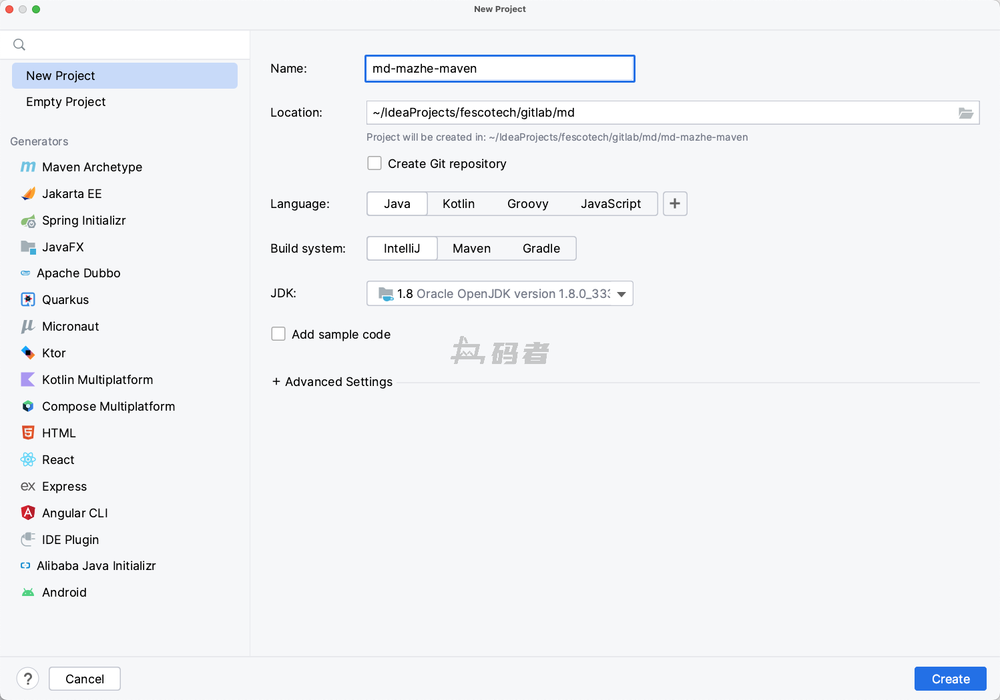](Maven 实战.assets/image-20241025145956738.png)

我们简单输出一句话，验证一下项目是否有问题。

[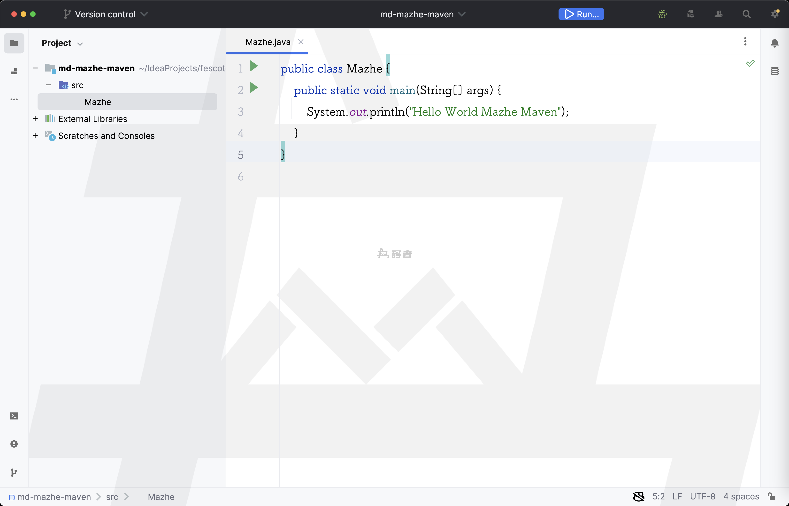](Maven 实战.assets/image-20241025145956739.png)

执行上面的代码：

```java
Hello World Mazhe Maven!
```

下面我们创建一个Userinfo对象，然后输出对象的属性。具体操作如下：

*   Userinfo.java

```java
public class Userinfo {
    private String username;
    private String passworld;

    public String getUsername() {
        return username;
    }

    public void setUsername(String username) {
        this.username = username;
    }

    public String getPassworld() {
        return passworld;
    }

    public void setPassworld(String passworld) {
        this.passworld = passworld;
    }

    @Override
    public String toString() {
        return "Userinfo{" +
            "username='" + username + '\'' +
            ", passworld='" + passworld + '\'' +
            '}';
    }
}
```

*   Mazhe.java

```java
public class Mazhe {
    public static void main(String[] args) {
        Userinfo userinfo = new Userinfo();
        userinfo.setUsername("mazhe");
        userinfo.setPassworld("maven");
        System.out.println(userinfo);
    }
}
```

输出：

```java
Userinfo{username='mazhe', password='maven'}
```

下面我们引入fastjson的依赖包，由于我们不使用Maven，所以我们使用下面的方式引用，具体操作如下：

[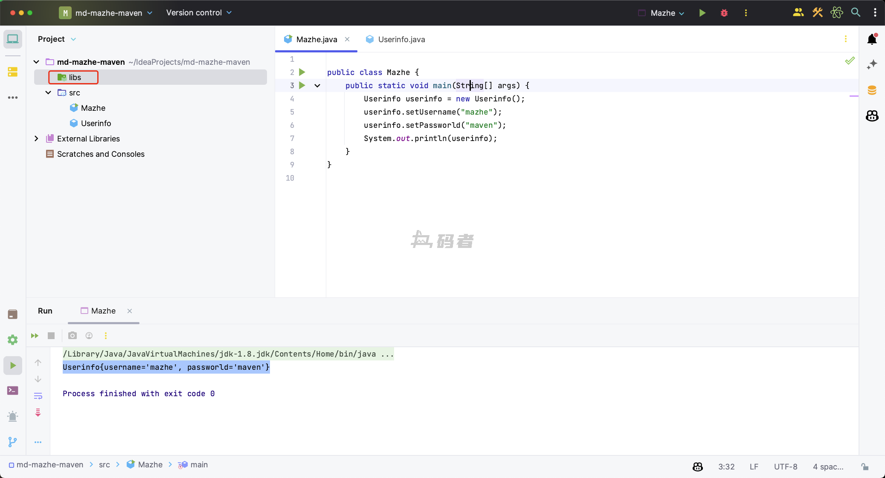](Maven 实战.assets/image-20241025145956740.png)

我们首先在项目的根目录中创建一个目录来存放我们引入外部的依赖包。当然我也可以不在项目的根目录中创建，在任何目录中引入都可以，只不过在项目中创建的好处是为了避免因目录改动，导致我们之前引入的依赖包找到不相应的目录，而导致引入的依赖包不可用。

[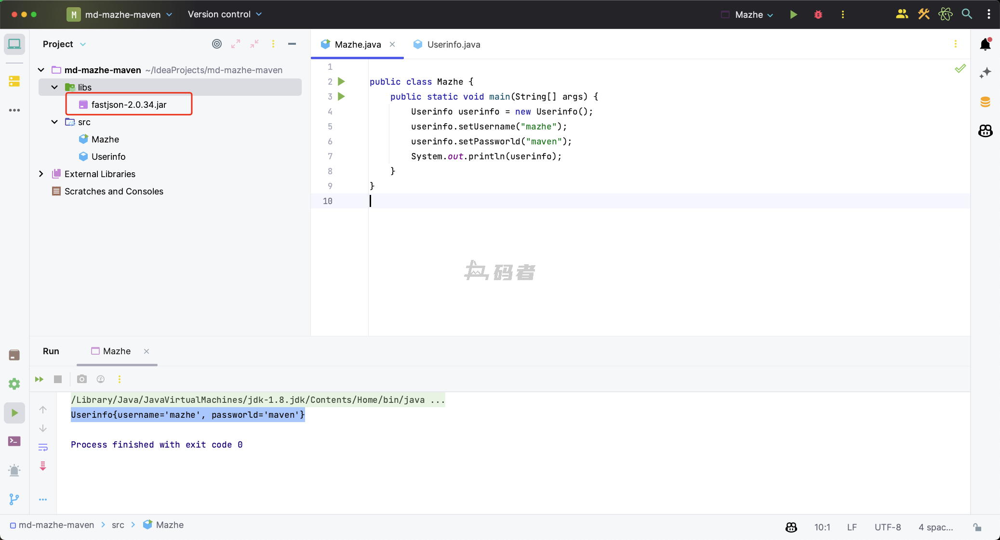](Maven 实战.assets/image-20241025145956741.png)

然后我们将我们需要要依赖包拷贝到我们刚刚创建的目录中。如果我们这前配置过，那么这个依赖包就可以直接在项目中引入了，如果我们没有问题过，那么项目中还是使用不了我们这个依赖包的，因为它没有识别出这个目录。那以怎么判断项目是否识别同这个目录呢？很简单我们只需要看一下，这个目录中的依赖包，是否可以直接查看相应的源码即可。如果项目中显示了依赖包的目录结构，并且可以直接查看源码，那么则证明我们项目识别出了这个依赖包，可以直接在项目中引用了。反之亦然。

我们通过上图观察到，项目并没有显示出依赖包的目录结构，所以也就说明项目并没有识别出这个依赖包。下面我们通过下面的配置即可。配置的方式有很多，我们采用下面的方式实现。

[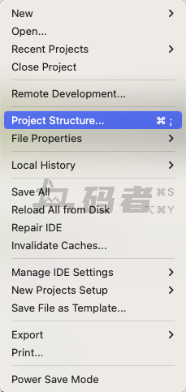](Maven 实战.assets/image-20241025145956742.png)

我们在IDEA的File菜单中选择`Project Structure ...`

[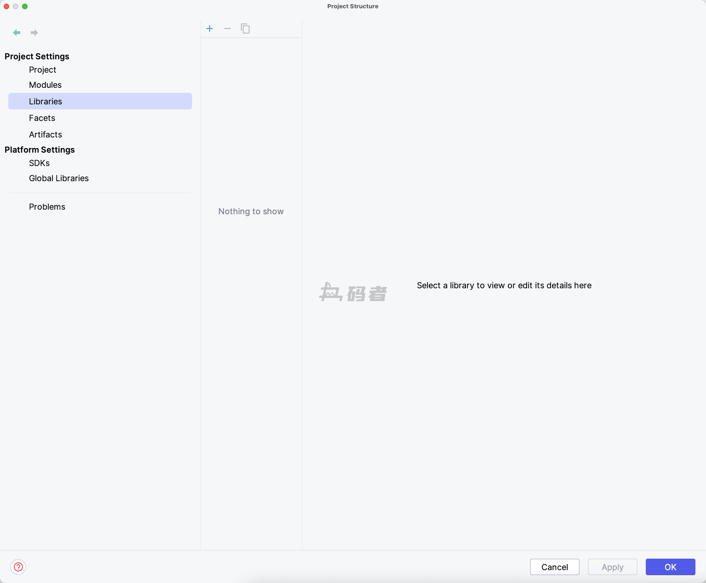](Maven 实战.assets/image-20241025145956743.png)

然后选择`Libraires`

[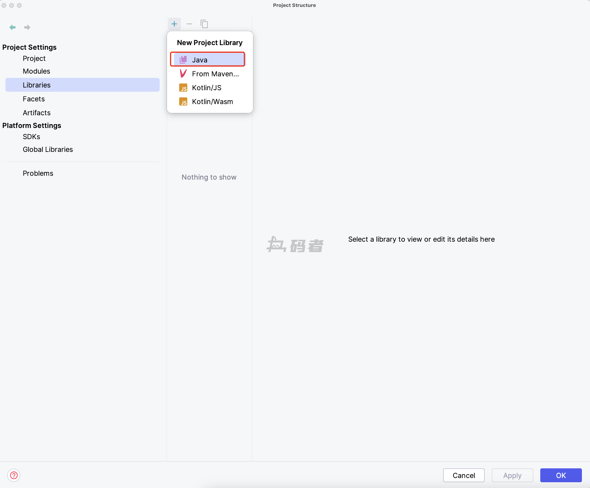](Maven 实战.assets/image-20241025145956744.png)

点击`+`选择`Java`然后选择我们之前项目中创建的目录即可。

[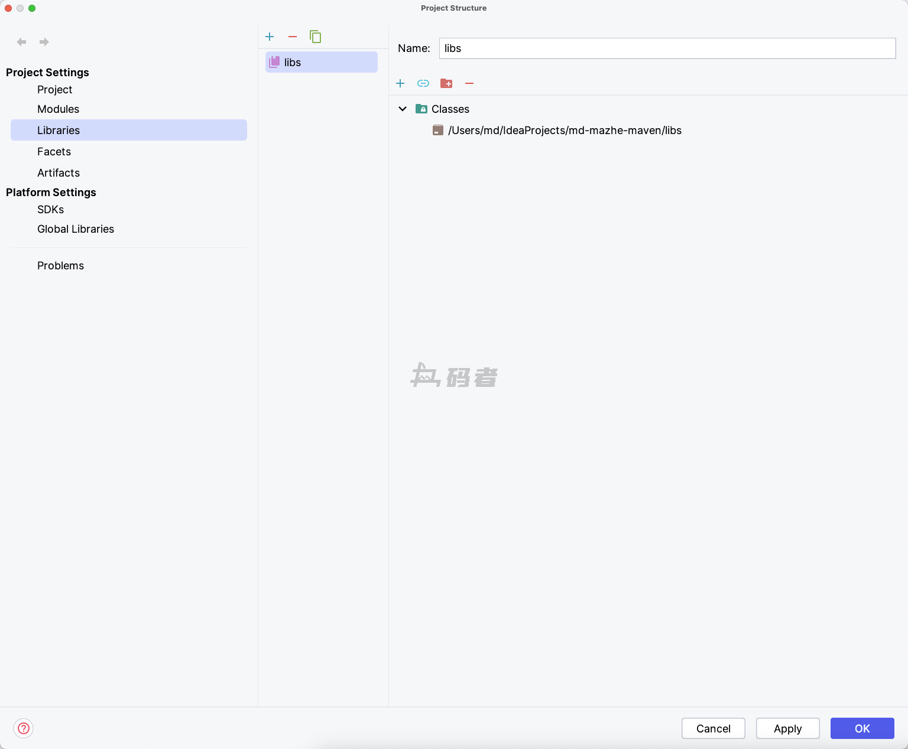](Maven 实战.assets/image-20241025145956745.png)

这块就是我们上面所说的，我们实际上也可以不选择一个目录，而是直接选择一个依赖包，这样我们依然可以在项目中引入它。只不过选择目录好好处是，如果我有新和依赖包的要引入时，直接拷贝到这个目录中就可以直接引入了，而不需要在次配置了。这就是选择目录的好处。

[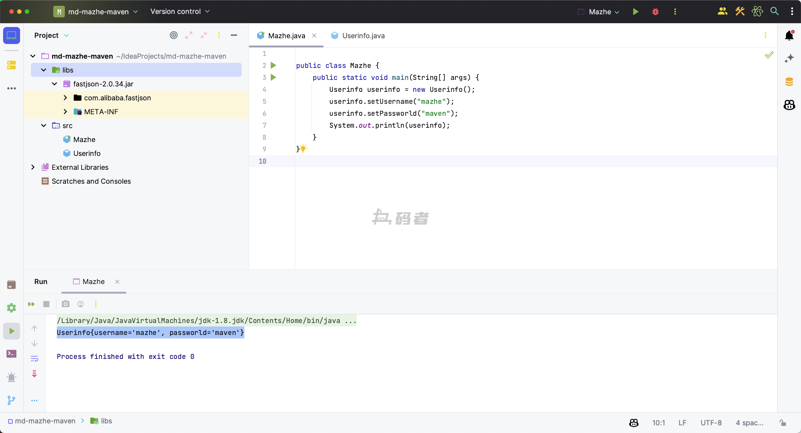](Maven 实战.assets/image-20241025145956746.png)

我们在次查看项目中的依赖包，发现项目中可以识别出我们依赖包的里的目录结构了。下面我们修改一下代码来将我们之前说的把对象转成Json。

*   Mazhe.java

```java
import com.alibaba.fastjson.JSONObject;

public class Mazhe {
    public static void main(String[] args) {
        Userinfo userinfo = new Userinfo();
        userinfo.setUsername("mazhe");
        userinfo.setPassworld("maven");
        System.out.println(JSONObject.toJSONString(userinfo));
    }
}
```

*   输出

```java
/Users/md/IdeaProjects/md-mazhe-maven/src/Mazhe.java:8:27
java: 无法访问com.alibaba.fastjson2.util.Wrapper
  找不到com.alibaba.fastjson2.util.Wrapper的类文件
```

当我们以为大功告成的时候，发现上面的代码居然报错了。我们看上面的输出日志发现是缺少了`fastjson2`的依赖包。下面我们将这个依赖我也拷贝到项目中。

[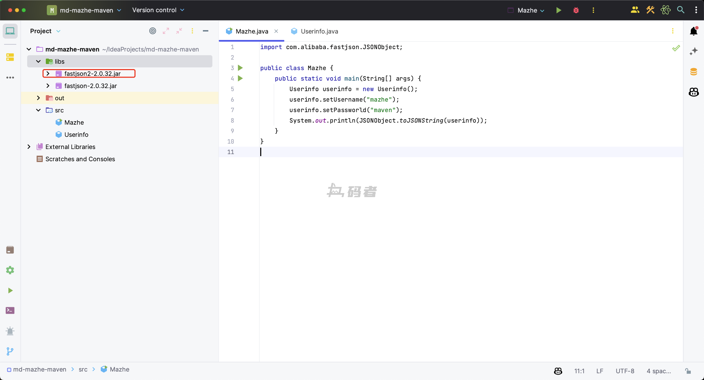](Maven 实战.assets/image-20241025145956747.png)

我们在次执行上面的代码，查看一下日志输出。

*   输出

```java
Exception in thread "main" java.lang.NoClassDefFoundError: com/alibaba/fastjson2/support/AwtRederModule
    at com.alibaba.fastjson.JSON.<clinit>(JSON.java:84)
    at Mazhe.main(Mazhe.java:8)
Caused by: java.lang.ClassNotFoundException: com.alibaba.fastjson2.support.AwtRederModule
    at java.net.URLClassLoader.findClass(URLClassLoader.java:387)
    at java.lang.ClassLoader.loadClass(ClassLoader.java:418)
    at sun.misc.Launcher$AppClassLoader.loadClass(Launcher.java:355)
    at java.lang.ClassLoader.loadClass(ClassLoader.java:351)
    ... 2 more
```

我们发现日志还是报错，并且从日志中我们找到了`java.lang.ClassNotFoundException`异常的关键字，说明我们依赖包里还缺少依赖。下面我们将缺少的依赖在拷贝到项目中。

[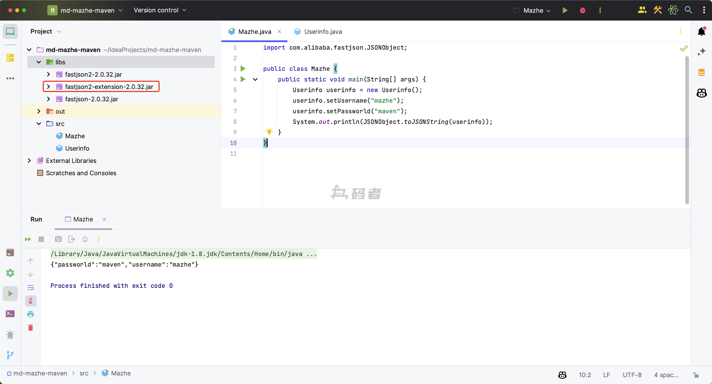](Maven 实战.assets/image-20241025145956748.png)

在次执行上面的代码，观察日志输出。

*   输出

```java
{"passworld":"maven","username":"mazhe"}
```

我们看日志输出发现这次项目执行成功了，我们成功的将对象转换成Json了。但这时可能有人会有些疑惑，上面的报错，为什么你能知道缺少的是哪个依赖包？这实际上也就是我们在没有使用Maven管理项目一个非常耗费时间的一个工作。因为这个是需要一点一点尝试出来的。尝试的方式，可以是直接看项目的源码，看一下这个源码中依赖的包是哪一个。或者简单一点将相同的依赖包全都拷贝到项目中，但这在实际的项目开发中是不推荐的。

除了这个问题外，还有的问题就是依赖包与依赖包冲突，因为现在依赖包的版本非常的多，通常都有一个稳定的依赖版本，如果依赖版本引入的不正确，也会导致相应的依赖包不可用。这也就是为什么我们在使用Maven的管理项目依赖的好处，它可以大在提高我们的工作效率。例如作者在书中所举的例子一样，例如我们要买一台电脑，我们现在方式相当于我们自己组装一台电脑，那么这样的工作是非常繁琐的，并且需要我们非常了解显卡、内存、主板等这方面的内容。除了这个入门比较难之外，还有一个问题是，可能会因为我们选择的配置有问题，导致不兼容最后导致电脑不可用。但这么做也有好处，就是可以让我们非常详细了解这方面的知识。那使用Maven的方式和这个方式而完全不同，相当于，我们购买了一台笔记本。它不需要我们了解上面的内容，我们只是需要选择好我们想要购买的牌子即可。这两种的效率可是截然不同的。这也就是使用Maven的好处。


3、Maven 的同类产品
-----------

下面我们了解一下，在没有Maven之前，那我们除了上面说的方式，还有哪些其它的项目管理工具可以提高我们开发效率吗？实际上也是有的，并且不只一个，下面我们分开介绍一下。

### 1、Make

Make几乎可以理解为最早的项目构建工具。它由Stuart Feldman于1977年在Bell实验室创建的。在使用Make时需要定义一个名为Makefile的脚本，Make通过该脚本来达到项目构建的目的。其它以后的项目构建工具也采取了同样的方式，例如Maven中的`pom.xml`文件。该脚本使用了Make自己定义的语法格式。语法中包括一部分规则（Rules），而规则中又包括目标（Target）、依赖（Prerequisite）和命令（Command）等信息。

下面是具体的Make的语法如下：

```bash
# 指定编译Java代码时使用的参数
JFLAGS = -g

# 指定Java编译器
JC = javac

# 指定生成Jar包时使用的参数
JARFLAGS = cvfm

# 指定生成的Jar包文件名
JARFILE = MyProgram.jar

# 定义一种依赖关系，指示如何从.java文件生成.class文件
.SUFFIXES: .java .class
.java.class:
        $(JC) $(JFLAGS) $*.java

# 定义要编译的Java源代码文件列表
CLASSES = \
        MyClass1.java \
        MyClass2.java \
        MyClass3.java

# 定义默认规则，指示执行`jar`规则
default: jar

# 定义`classes`规则，指示如何编译Java源代码
classes: $(CLASSES:.java=.class)

# 定义`jar`规则，指示如何生成Jar包
jar: classes
        jar $(JARFLAGS) $(JARFILE) Manifest.txt $(CLASSES:.java=.class)

# 定义`clean`规则，指示如何清理生成的class文件和Jar包文件
clean:
        $(RM) *.class $(JARFILE)
```

上面的内容就是Make的语法规则，由于此项目管理工具太早了，所以我们只简单了解一下即可。下面我们详细介绍一下上面具体的规则。

```bash
- default：默认规则，指定执行jar规则。

- classes：编译Java源代码生成class文件。

- jar：生成Jar包。

- clean：清理生成的class文件和Jar包文件。
```

要生成Jar包，只需在终端窗口中输入make jar命令即可。该命令会执行Makefile文件中定义的jar规则，生成Jar包。如果需要清理生成的class文件和Jar包文件，可以输入make clean命令。


### 2、Ant

在Make之后，Ant出现了。为什么会出现Ant呢？这是因为Make不支持跨平台，这对于使用Java来说是不友好的，并且Make的语法也比较难，通过编译失败都是因为多少空格导致的，但这很难提前发现问题。在Ant中使用了build.xml作为项目的构建脚本。这点和Maven比较像。相比Makefile的语法Ant的xml方式，则要方便很多。当然也有其它的构建工具，例如Gradle，它是采用Groovy编程语言来定义构建脚本的，相比xml来说，又方便了很多，所以Gradle也被移为Maven之后，下一代的构建工具。

下面我们介绍一下Ant构建脚本的具体配：

```xml
<?xml version="1.0"?>
<project name="MyProject" default="jar">
    <!-- 定义项目的属性 -->
    <property name="src.dir" value="src"/>
    <property name="build.dir" value="build"/>
    <property name="dist.dir" value="dist"/>
    <property name="main.class" value="com.example.MyClass1"/>

    <!-- 创建目标目录 -->
    <target name="init">
        <mkdir dir="${build.dir}"/>
        <mkdir dir="${dist.dir}"/>
    </target>

    <!-- 编译Java源代码 -->
    <target name="compile" depends="init">
        <javac srcdir="${src.dir}" destdir="${build.dir}"/>
    </target>

    <!-- 生成Jar包 -->
    <target name="jar" depends="compile">
        <jar destfile="${dist.dir}/${ant.project.name}.jar" basedir="${build.dir}">
            <manifest>
                <attribute name="Main-Class" value="${main.class}"/>
            </manifest>
        </jar>
    </target>

    <!-- 清理生成的文件 -->
    <target name="clean">
        <delete dir="${build.dir}"/>
        <delete dir="${dist.dir}"/>
    </target>
</project>
```

我们通过上面的配置，第一次直观的感受就是，Ant的构建配置确实比Makefile的语法相对来说比较简洁。下面我们同样的详细介绍一下Ant的配置规则：

```bash
> init：创建编译和生成Jar包所需的目录。

> compile：编译Java源代码。

> jar：生成Jar包。

> clean：清理生成的文件。
```

要生成Jar包，只需在终端窗口中输入ant jar命令即可。该命令会执行build.xml文件中定义的jar任务，生成Jar包。如果需要清理生成的文件，可以输入ant clean命令。

注意：在执行该build.xml文件之前，需要将文件中的属性值替换为您的项目属性。例如，src.dir属性指向包含Java源代码的目录，main.class属性指向包含main方法的类的类名，这将是您的程序的入口点。

通过上面的介绍我们发了一个问题，那就是不管是Make还是Ant虽然都提供了自动化管理项目的功能，但都是正对项目打包和编译的功能，并没有提供项目的依赖管理，也就是我们依赖包的管理，实际上项目开发中，这项的工作实际是最繁琐的。所以Maven的出现改变了上述的工作方式，除了上面的内容外，Maven还支持依赖管理、项目管理等内容，并且和Ant相比，Maven定义了很多额外的约定了，只要遵循这些约定，就可以很方便的管理项目。但Ant而不是，所以它也是用xml做为构建管理的，但并没有过多的约定。所以常常需要人为的约定，否则，在不同的环境中的Ant构建脚本，在换到其它环境中，则会因为目录或者其它的原因导致编译失败。


4、Maven 有哪些缺点
----------

在开始介绍Maven之前，我们先介绍一下Maven的缺点，任何技术都有它的适用之处，只有我们采用是了合适的技术，才是这项技术最佳的使用方法。

*   Maven过于复杂

说Maven复杂是相比来说的，因为它几乎帮我们处理了项目管理的全部工作，例如清理、编译、测试、打包、发布等等。但要想实现上述说的实现，难度是可想面知的，所以可以说Maven的入门还是比较难的。

因为Maven是用来管理项目的，清理、编译、测试、打包、发布，以及一些自定义的过程都是一件非常复杂的事，所以可以说的Maven入门还是比较难的。

*   Maven的仓库十分混乱

我们知道通过Maven是可以管理我们的依赖包的，因为Maven支持下载的功能，但有时会因为一些原因导致，我们下载失败，这时我们只能手动的去下载。并且Maven为了我们方便管理依赖包，提供了中央仓库的概念，但Maven的中央仓库并不完美，你们常常会发现相同的依赖包在两个不同的路径中。

*   Maven官方文档非常凌乱

我们知道作为一个开源的项目工具，官方的文档是很重要的，它是我们第一时间了解一项开源技术的唯一途经。其中有一些开源项目的管方文档确实写的比较好，例如Spring的相关文档。当有一些开源项目文档写的则比较差，其中Maven就是其中之一。Maven的官方网站的文档非常凌乱，各种插件的文档寻找非常吃力。通过官方文档，很难入门。


5、Maven 的安装
--------

介绍了这么多，我们终于来到了这一步，也就是安装，任何技术都是从安装开始的。那么Maven也是一样的，不同的地方在于，Maven在装之前需要有些额外的配置。


### 1、Windows 安装 Maven

*   安装前环境的准备

由于Maven是使用Java语言开发的，所以在使用Maven之前需要提前把Java的环境安装好，也就是需要检查是否成功的安装了JDK。具体执行的命令如下：

```bash
java -version
```

*   输出

[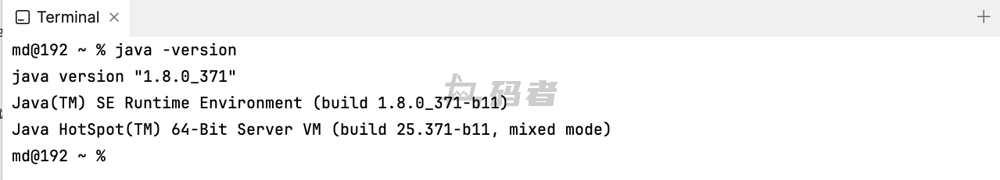](Maven 实战.assets/image-20241025145956749.png)

这样则表示我们的环境变量配置成功了。

如果本地成功的安装JDK，则会直接显示Java的版本信息。如果想查询本地JDK的安装路径可以执行下面的命令查询：

```bash
echo $JAVA_HOME
```

*   下载Maven

下面我介绍一下如何下载Maven。和其它开源软件一下，软件一定是要通过官方网站下载的。下面是Maven官方网站的地址：https://maven.apache.org

当我们访问上述官方网站时，首页直接就会看到Maven的下载地址。我们直接点击Download链接即可：

[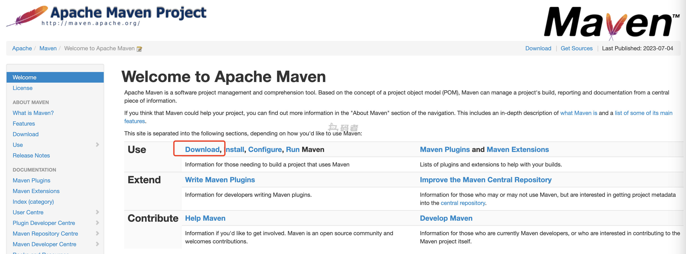](Maven 实战.assets/image-20241025145956750.png)

当我们点击后就会看到有多种类型的安装包供我们下载，也就是如下图所示：

[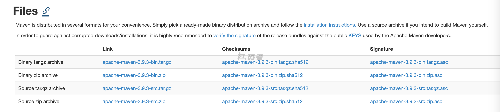](Maven 实战.assets/image-20241025145956751.png)

它们具体的区别是，提供了不够平台的下载文件。如果是Linux或者是MacOS推荐使用`tar.gz`的下载文件，如果是Windows平台的推荐使用`zip`后缀的下载文件。除此之外，Maven官方还提供了，上述不同平台的md5校验和（checksum）文件和asc数字签名文件，目的是可以用来检验Maven下载包的正确性和安全性。如果你想对Maven的源码感兴趣可以下载`src`的版本文件，自己构建Maven。那由于我是MacOS系统，所以我下载tar包就可以了。

*   安装Maven

当我们下载完对应的平台的版本后，我们先直接解压然。但解压后我们还不能直接用Maven。我们需要配置Maven的环境变量之后在使用。由于不同平台的配置方式有所不同，我们主要介绍两种平台的配置。我们首先介绍一下如何在Windows平台中配置Maven的环境变量：

*   我们首先需要在系统的环境变量中新创建一个`M2_HOME`的变量，路径为上面Maven解压后的全路径，注意结尾不要加任何符号。
*   接着在系统中环境变量中查找到`Path`变量，然后在改变量的后面追加下面的配置：

```bash
%M2_HOME%\bin;
```

注意后面的分号。如果配置完成后，可以在命令窗口中查询一下配置的`M2_HOME`的变量是否配置成功。

```bash
echo %M2_HOME%
```

如果该命令输入的结果是我们Maven下载后解压的路径，则表示我们配置成功了。接着我们可以输入下面的命令来验证Maven是否安装成功

```bash
mvn-v
```
如果此命令成功的显示了Maven的安装版本则表示，我们Maven配置的成功了。


### 2、Mac/Linux 安装 Maven

下面我们看了解一下如何在Linux或者MacOS系统中配置Maven环境变量。首先我们在命令窗口中执行下面的命令：

```bash
sudo vim ~/.bash_profile
```

[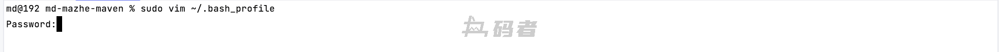](Maven 实战.assets/image-20241025145956752.png)

当输入上述命令后，系统会提未你输入机器的登陆密码，当我们输入成功后，就会进入到文件当中，然后将下面的配置添加到`bash_profile`文件中。

```bash
export MAVEN_HOME=/Users/jilinwula/Downloads/apache-maven-3.6.3
export PATH=$PATH:$MAVEN_HOME/bin
```

注意，上面说的`MAVEN_HOME`对应的是系统的Maven解压后的路径。当设置完成后，输入`:wq`命令保存我们刚刚打开的文件。然后我们还需要执行下面的命令，让上述的配置立即生效。

[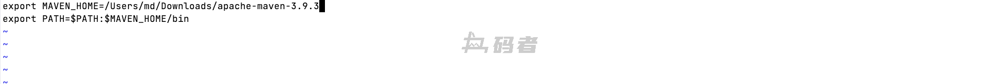](Maven 实战.assets/image-20241025145956753.png)

```bash
source ~/.bash_profile
```

[](Maven 实战.assets/image-20241025145956754.png)

由于我们已经输入完机器的登陆密码了，所以这次我们不需要在输入机器的密码了。

接着，我们输入`mvn-v`命令，看检查是否成功的返回的Maven的版本信息。

[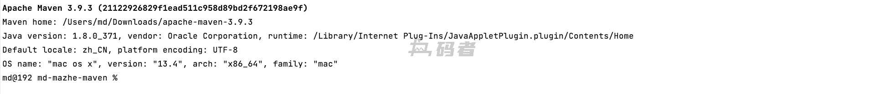](Maven 实战.assets/image-20241025145956755.png)

看上图中显示了我们指定的Maven版本，并且还显示出了我们Maven配置的路径，这表示我们Maven配置成功了，可以直接使用了。


6、Maven 的目录结构
----------

下面我们介绍一下Maven安装包的目录结构，通过目录结构可以让我们更加理解和掌握Maven。在Maven中主要包括下面的目录和文件下面我们详细介绍一下：

*   bin：很多的开源软件中都包括这具目录也就是目录`bin`目录。在这个目录中主要包括了Maven运行的所有脚本文件，其中没有带`.cmd`后缀的命令为Linux平台的脚本文件，带`.cmd`后缀的为Windows平台的脚本文件。在此目录中还提供了我们上述中我们介绍过的`mvn`命令脚本。除此之外Maven还提供了`mvnDebug`命令。它俩的区别是后者在运行时开启debug模式，可以允许我们调试Maven。下图为`bin`目录的相关截图：

[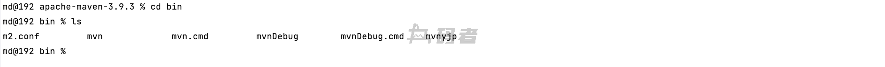](Maven 实战.assets/image-20241025145956756.png)

*   boot：boot`目录下有一个jar文件。该文件的作用是Maven自己实现的类加载器。和默认的Java类加载器相比，它提供了丰富的语法和配置，Maven使用此类加载器加载自己的类库。

[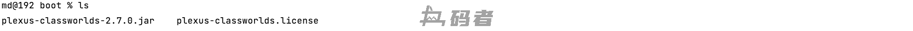](Maven 实战.assets/image-20241025145956757.png)

*   conf：conf`目录中包含了一个非常重要的文件`settings.xml`文件。在后续的内容中我们会详细`settings.xml`文件。通过该文件我们可以全局地定制Maven的行为。

[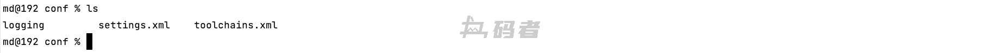](Maven 实战.assets/image-20241025145956758.png)

*   lib：lib`目录中包括了Maven运行时依赖的所有的Java类库。这也间接的说明了Maven是使用Jave语言开发的。

[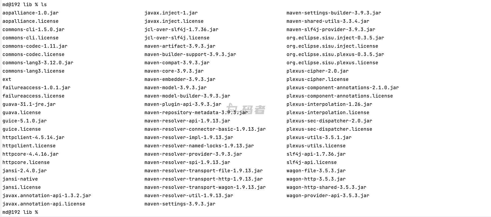](Maven 实战.assets/image-20241025145956759.png)

  

# 二、Maven 入门

通过前两篇的介绍我们基本上对Maven有了一个初入的了解，在一这一篇中，我们详细介绍一下如何在项目中使用Maven，也就是Maven的入门。

1、什么是 POM
------

在Maven实战-第一篇（Maven的基本信息）中我们介绍过Make和Ant。它们都是通过Makefile或者build.xml来管理项目的。那么对于Maven也是一样的，Maven也需要一个脚本文件来执行项目的构建和管理。在Maven中采用了和Ant一样的管理方式，也就是xml文件的方式进行项目的管理。只不过在语法中有些区别。并且在Maven中命令规则为pom.xml，而不是Ant中的build.xml。

下面我们按照软件开发的惯例，创建一个Helloworld空项目。具体操作如图所示：

[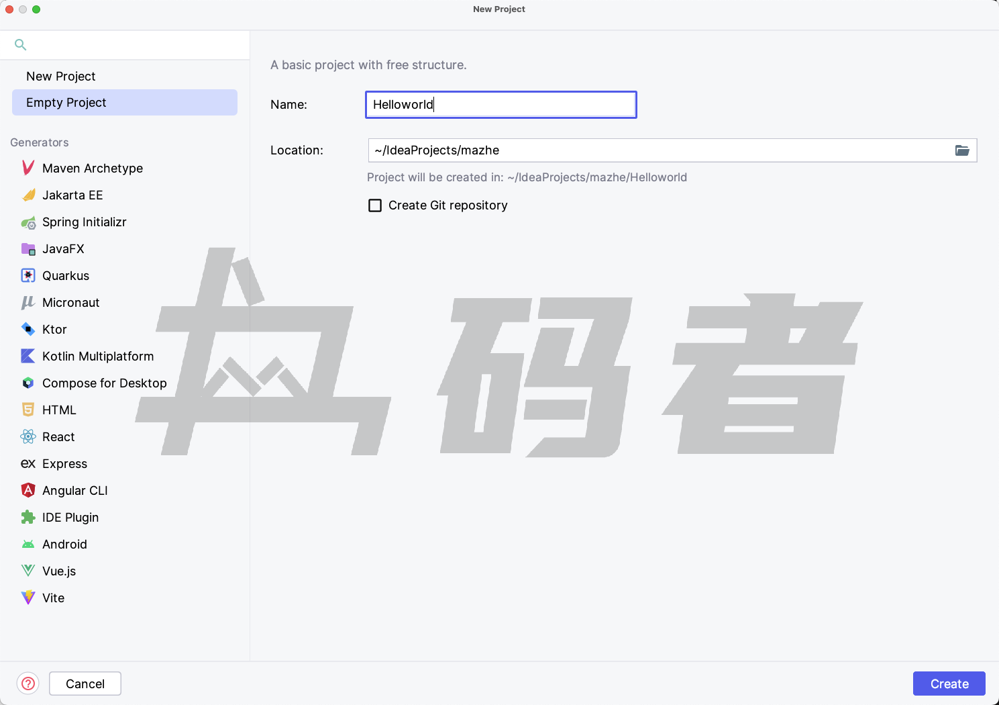](Maven 实战.assets/image-20241025175710940.png)

然后我们在这个项目的根目录中创建一个`pom.xml`文件。

[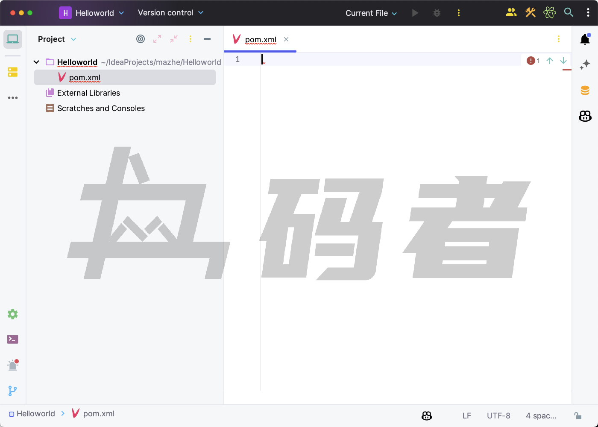](Maven 实战.assets/image-20241025150741194.png)

我们IDEA中提示了我们`pom.xml`文件报错了，这是因为`pom.xml`文件中有Maven约定的语法规则，我们现在的`pom.xml`文件是空的所以报错了。`pom.xml`文件中可以配置的语法非常的多，我们下面介绍一下，`pom.xml`文件中必须要设置的内容。

*   xml：指定了xml文件的版本和编码。
*   project：该标签是pom.xml项目的的根标签。
*   modelVersion：指定POM模型的版本。对于Maven3来说，必须是4.0.0。
*   groupId：指定我们创建的这个项目是属于哪个组的，通常为公司组织的域名倒写，这样保证不会重复。
*   artifactId：定义了当前Maven项目在组中的唯一标识，也就是同组唯一。
*   version：指定当前项目的版本。在Maven中有两个类型的版本，一个是正常的版本需要，还有一个为SNAPSHOT快照版本。快照版本为不稳定版本。
*   name：项目的名称。

我们先简单有一个概念，在后续的章节中，我们会详细介绍上面的内容。下面我们看一下例子，来更直观的感受到，在Maven中怎么配置上面介绍的信息。

```xml
<?xml version="1.0" encoding="utf-8" ?>
<project xmlns="http://maven.apache.org/POM/4.0.0">
    <modelVersion>4.0.0</modelVersion>
    <groupId>cn.ma-zhe</groupId>
    <artifactId>mazhe-maven</artifactId>
    <version>1.0-SNAPSHOT</version>
    <name>Maven实战</name>
</project>
```

当我们配置完上述内容时，我们发现`pom.xml`中已经不显示报错信息了，这就表明我们配置的没有任何问题了，如果还是报错，而表示我们有的标签配置的还是有误。

[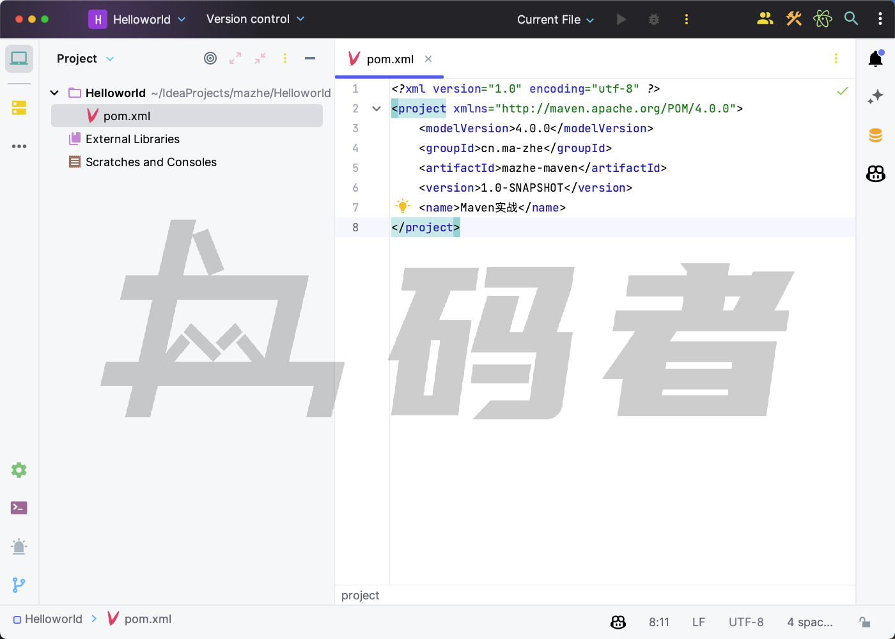](Maven 实战.assets/image-20241025150741195.png)


2、代码编写
----

在我们完成上面的配置后，我们可以开始我们的代码编写了。但使用Maven编写代码时，和我们普通的Jave项目有一些区别，它也有相应的默认的约定。我们知道在普通的项目中所有Jave源码代码都写在项目的`src`目录中。在Maven中同样的对项目的源代码目录进行了约定，只不过在Maven中对普通项目的源代码称之为主代码。还约定了测试代码的目录。主代码会最终打包到构建Jar包中的代码。而测试代码只在测试运行时用到，不会被打包。在Maven中使用下面两个目录结构进行区分。

*   主代码

```
src/main/java
```

上述目录为Maven默认约束好的主代码的目录，只要按照上面的路径设置，Maven会自动编译上述目录中的代码并打包到Jar构建包中。

*   测试代码

```
src/test/java
```

上述目录为Maven默认约束好的测试代码的目录，Maven只会在测试运行时编译上述目录中的代码并且不会打包到Jar构建包中。

有一点我们要注意，上面所说的主代码或者测试代码的目录都是Maven默认约定的目录结构，我们可以通过`pom.xml`中提供的语法更改默认的目录结构，但在实际的项目中我们并不会这么做。


3、Maven    命令
-------

按照上面介绍的我们先在项目中创建一个`src/main/java`目录。

[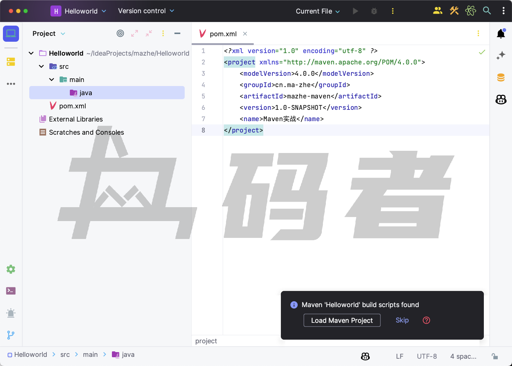](Maven 实战.assets/image-20241025150741196.png)

然后我们在创建一个新的Java类，来测试一下，代码能否执行成功。

[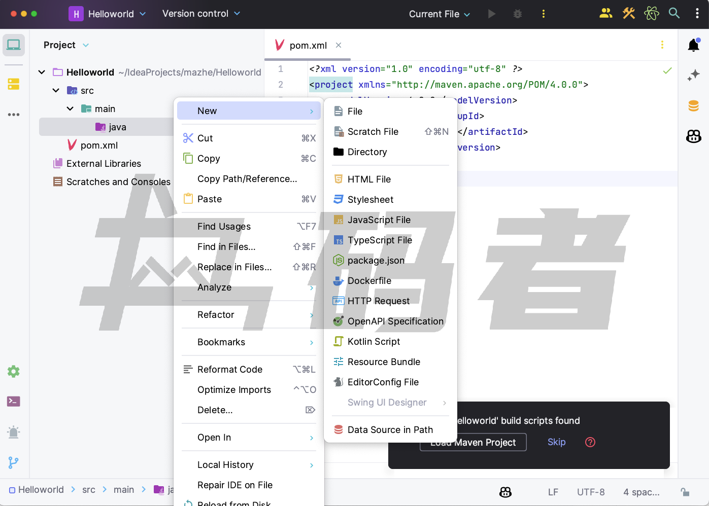](Maven 实战.assets/image-20241025150741197.png)

当我们要创建Java类，发现IDEA中已经没有我们想要创建Java类的那个菜单了。这是因为IDEA认为`src`才是源代码的目录。所以没有显示可以创建Java的菜单。要想可以显示出创建Java的菜单也非常的简单，也就是告诉IDEA此时`src/main/java`目录就是项目的源代码目录即可。具体配置如下：

[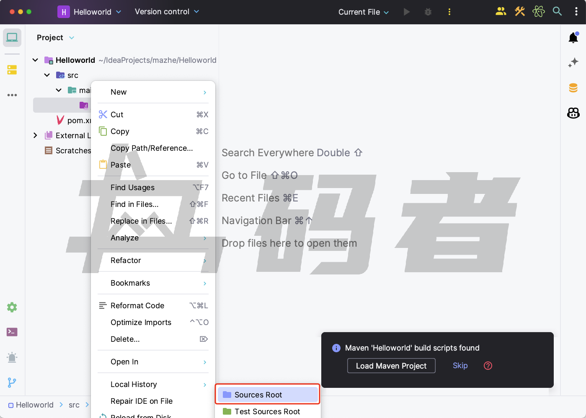](Maven 实战.assets/image-20241025150741198.png)

这样IDEA就会识别出我们现在选择的这个目录是源码目录，就允许我们创建Java文件。

[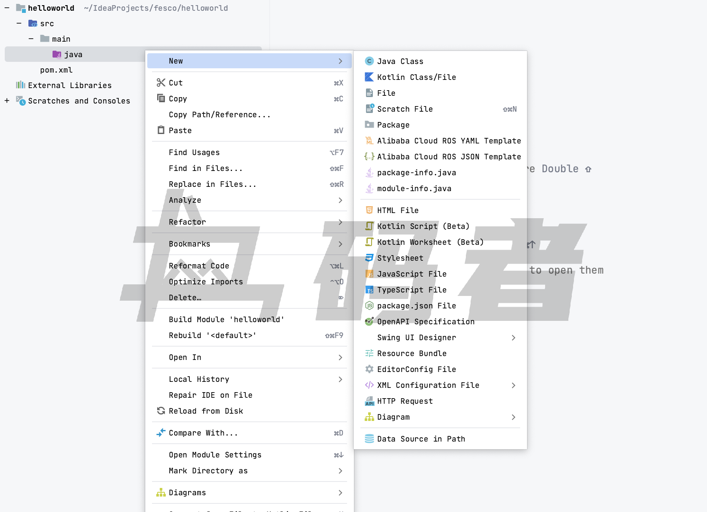](Maven 实战.assets/image-20241025150741199.png)

我们首先创建一个简单的Java类，来验证一下，项目是否能成功的执行的我们的代码。

*   Mazhe

```java
public class Mazhe {
    public static void main(String[] args) {
        System.out.println("Hello World Mazhe Maven");
    }
}
```

*   输出

```
Hello World Mazhe Maven
```

[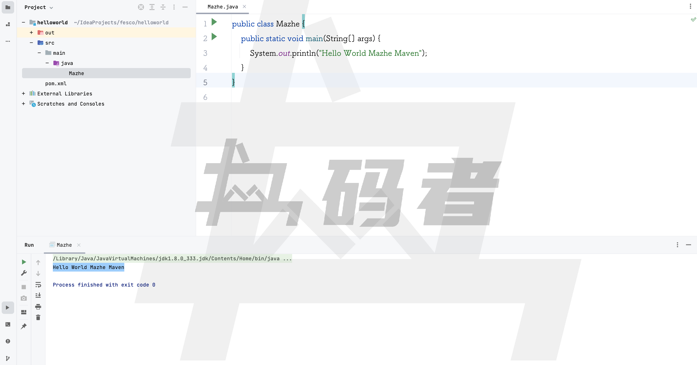](Maven 实战.assets/image-20241025150741200.png)

下面我们还是改造一下代码，按照第一篇中例子一样，我们创建一个对象，然后将对象转换成JSON字符串。

*   Userinfo

```java
public class Userinfo {
    private String username;
    private String passworld;

    public String getUsername() {
        return username;
    }

    public void setUsername(String username) {
        this.username = username;
    }

    public String getPassworld() {
        return passworld;
    }

    public void setPassworld(String passworld) {
        this.passworld = passworld;
    }

    @Override
    public String toString() {
        return "Userinfo{" +
            "username='" + username + '\'' +
            ", passworld='" + passworld + '\'' +
            '}';
    }
}
```

*   Mazhe

```java
public class Mazhe {
    public static void main(String[] args) {
        Userinfo userinfo = new Userinfo();
        userinfo.setUsername("mazhe");
        userinfo.setPassworld("maven");
        System.out.println(userinfo);
    }
}
```

*   输出

```
Userinfo{username='mazhe', passworld='maven'}
```

下面我们按照Maven的方式引入依赖包，这样就不用向之前那样，我们需要在项目中手动的创建依赖包的目录和依赖包的拷贝工作了。那我们上哪去查询依赖包呢？这个不用担心，Maven为了方便我们查询，可以通过在线的网站上通过关键字搜索查询。下面是依赖包的网站的地址：

- https://mvnrepository.com


[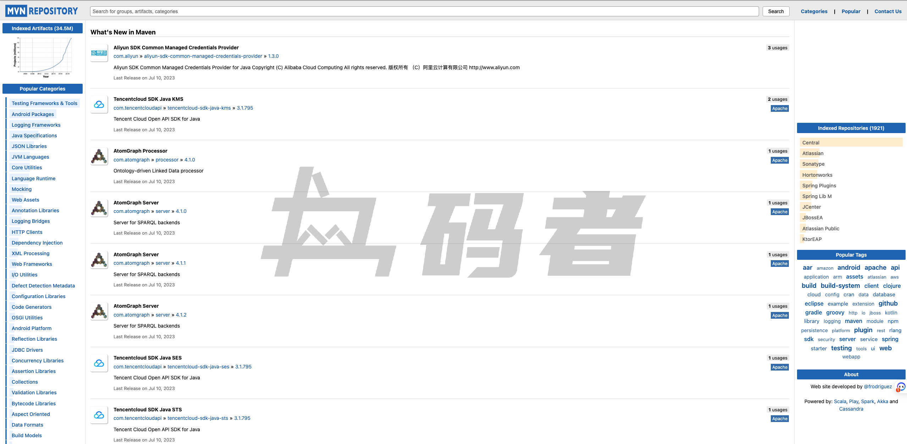](Maven 实战.assets/image-20241025150741201.png)

我们可以在上面搜索中直接搜索我们想要的依赖包。按照需求，我们需要将对象转换成json。这样的工具类很多，我们使用fastjson的方式实现。所以我们只需要在上面的网站上搜索即可。

[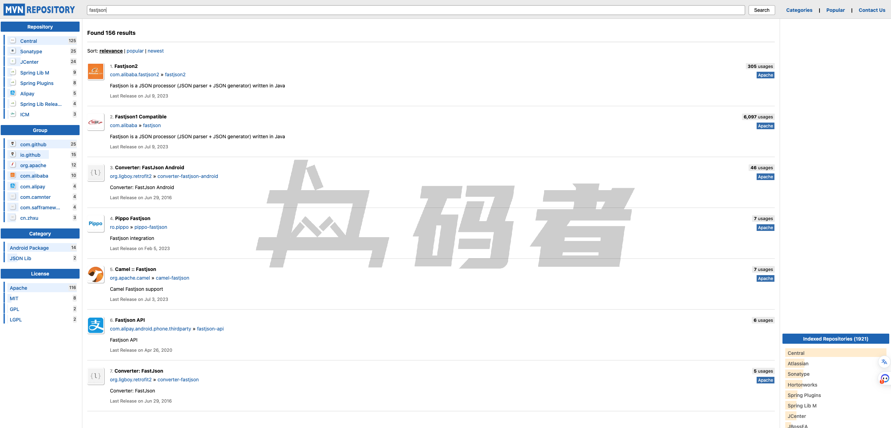](Maven 实战.assets/image-20241025150741202.png)

然后我们点击上面的链接，就会显示出这个依赖包所有可以使用的版本。

[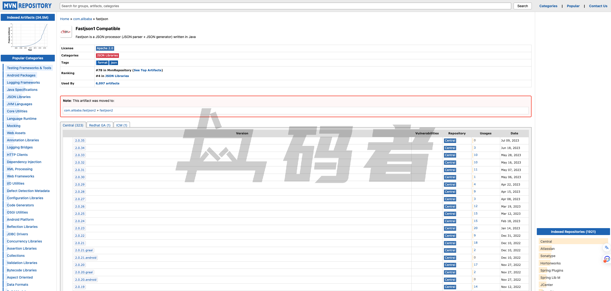](Maven 实战.assets/image-20241025150741203.png)

我们随便选择一个版本即可。在实际的软件开发中，我们需要选择相对比较稳定的版本，这样的版本问题比较少。那如何选择文档的版本呢。我们可以通过上图中的`Usages`参数来观察，这个参数越多，则表示使用的人越多。

[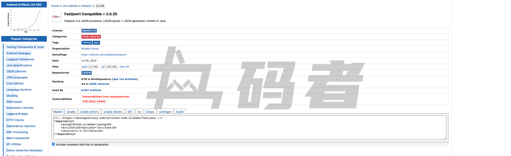](Maven 实战.assets/image-20241025150741204.png)

当我们选择一个版本后，点击链接就会显示出我们使用这个依赖包具体的Maven配置信息了。并且，通过上图中我们可以观察到，除了Maven外，它还支持其它的项目管理工具，例如Gradle。我们点击这个标签就会显示Gradle的配置信息。

[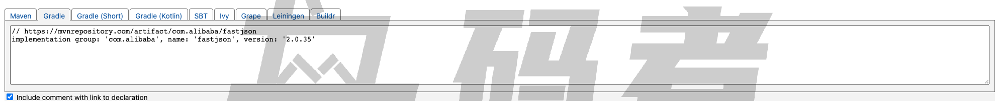](Maven 实战.assets/image-20241025150741205.png)

下面我们介绍一下，如何使用上面的Maven配置。我们拷贝一下fastjson的Maven配置信息，然后粘贴到项目的pom.xml文件中。之前我们介绍过，pom.xml是项目的构建文件，所以所有和Maven相关的配置都可以在pom.xml文件中配置。

```xml
<?xml version="1.0" encoding="utf-8" ?>
<project xmlns="http://maven.apache.org/POM/4.0.0">
    <modelVersion>4.0.0</modelVersion>
    <groupId>cn.ma-zhe</groupId>
    <artifactId>mazhe-maven</artifactId>
    <version>1.0-SNAPSHOT</version>
    <name>Maven实战</name>

    <dependency>
        <groupId>com.alibaba</groupId>
        <artifactId>fastjson</artifactId>
        <version>2.0.35</version>
    </dependency>

</project>
```

当我们将上面的配置粘贴到pom.xml后，发现文件居然报错了。

[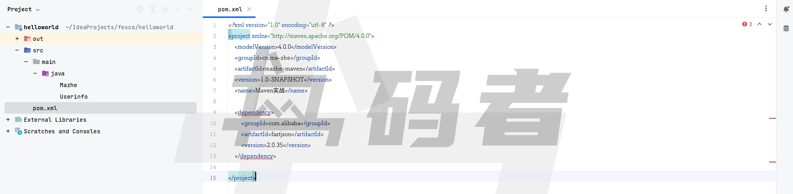](Maven 实战.assets/image-20241025150741206.png)

这是因为上面的配置不符合Maven的语法规则。具体的原因是因为Maven中需要将所有的依赖配置都放到`<dependencies></dependencies>`标签中。也就是如下配置才可以：

```xml
<?xml version="1.0" encoding="utf-8" ?>
<project xmlns="http://maven.apache.org/POM/4.0.0">
    <modelVersion>4.0.0</modelVersion>
    <groupId>cn.ma-zhe</groupId>
    <artifactId>mazhe-maven</artifactId>
    <version>1.0-SNAPSHOT</version>
    <name>Maven实战</name>

    <dependencies>
        <dependency>
            <groupId>com.alibaba</groupId>
            <artifactId>fastjson</artifactId>
            <version>2.0.35</version>
        </dependency>
    </dependencies>

</project>
```

当我们这样配置完后成后，发现依赖包的版本显示红色了，这是因为Maven还没有查找到这个依赖包。

[](Maven 实战.assets/image-20241025150741207.png)

这是因为IDEA暂时还没有将我们这个项目识别出Maven项目。所以需要选中pom.xml文件，然后右键选择：`Add as Maven Project`

[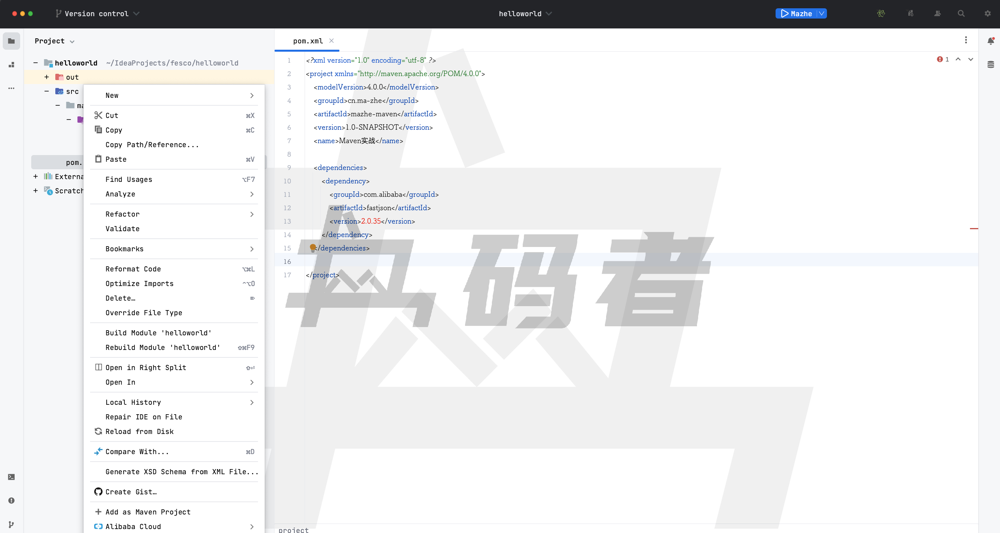](Maven 实战.assets/image-20241025150741208.png)

当我们这样操作完成后，我们发现我们的版本已经不会报错了。

[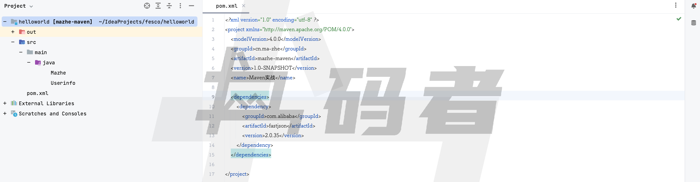](Maven 实战.assets/image-20241025150741209.png)

并且这时我们看项目的依赖包，发现Maven已经自动将fastjson依赖的所有包都下载成功了。

[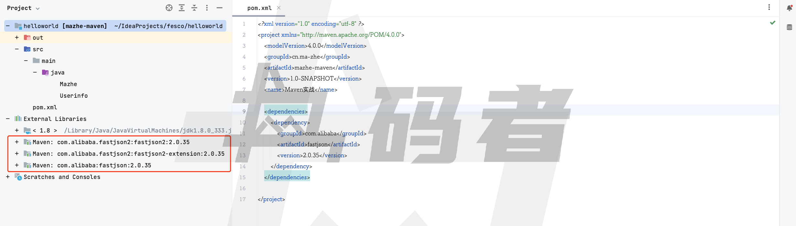](Maven 实战.assets/image-20241025150741210.png)

下面我们在项目中使用一下，看看用Maven引入依赖包的方式和我们自己引用有没有什么区别。

*   Mazhe

```java
import com.alibaba.fastjson.JSONObject;

public class Mazhe {
    public static void main(String[] args) {
        Userinfo userinfo = new Userinfo();
        userinfo.setUsername("mazhe");
        userinfo.setPassworld("maven");
        System.out.println(JSONObject.toJSONString(userinfo));
    }
}
```

*   输出

```
{"passworld":"maven","username":"mazhe"}
```

我们看日志输出，成功的将对象转换成json了，并且在我们使用Maven和我们自己引入依赖的方式在编写代码上没有任何区别。但在使用上，我们可以很直观的感受到使用Maven引入依赖包时，为我们带来的便捷。

* * *

*   编译

下面我们介绍一下，Maven提供的其它的功能，我们知道在项目中我们比较常见的操作就是代码测试、编译、打包、运行等操作。上面我们介绍了如何使用Maven引入我们需要的依赖包。下面我们介绍一下，如何使用Maven编译项目。

*   Mazhe

```java
import com.alibaba.fastjson.JSONObject;

public class Mazhe {
    public static void main(String[] args) {
        Userinfo userinfo = new Userinfo();
        userinfo.setUsername("mazhe");
        userinfo.setPassworld("maven");
        System.out.println(JSONObject.toJSONString(userinfo));
    }
}
```

在Maven中编译项目很简单，特别是使用是IDEA这样的开发工具，我们只需要简单保存一下就可以完成代码的编译了。所以为了加深我们的理解，今天我们使用Maven命令的方式编译项目，这也是我们介绍Maven的第二个命令（第一个Maven命令为：）：

```bash
mvn clean compile
```

当我们在项目的根目录中输入完上面的命令后，Maven就会自动的执行项目的编译。

[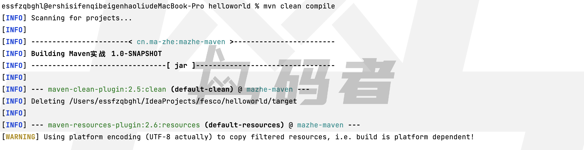](Maven 实战.assets/image-20241025150741211.png)

当我们输入完上面的Maven命令后，Maven就会开始工作了，并且通过上图中，我们也可以发现Maven执行时输出的日志信息。

[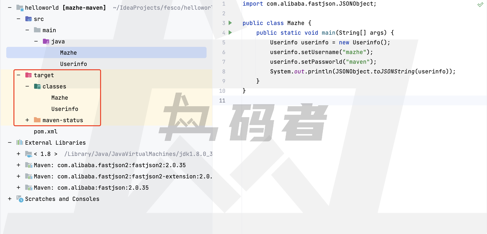](Maven 实战.assets/image-20241025150741212.png)

当项目编译成功后就会在项目的根目录中创建target目录，然后将主代码的中编译好的class文件放到target中的classes目录下。也就上图所示。

***

*   测试

下面我们介绍一下如何使用Maven进行代码的测试。在Maven中如果要想执行测试代码，需要引入额外的依赖包。因为我们上面的内容中已经介绍了如何在项目中引入依赖包，所以在这里我们就不做过说的介绍了。在Maven中要执行测试，需要我们使用junit依赖。引入junit依赖的配置信息如下：

```xml
<dependencies>
    <dependency>
        <groupId>junit</groupId>
        <artifactId>junit</artifactId>
        <version>4.13.2</version>
    </dependency>
</dependencies>
```

同样的，我们还是需要将上面的配置信息配置到pom.xml文件中。下面我们开始编写测试类的代码。这里有一点要我们注意，按照Maven的约定，测试类的代码是需要放在测试类代码`src/test/java`目录中的，而不是我们刚刚写的主代码的目录中，这一点要特别的注意。

同样的我们在项目中创建一个`src/test/java`目录。

[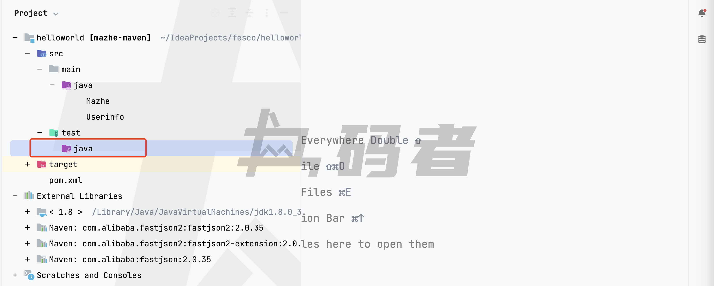](Maven 实战.assets/image-20241025150741213.png)

然后我们继续创建一个测试类，但当我们右键创建时，发现了类似的问题，就是没有提供创建Java类的菜单，这个问题和上面遇到的问题一样，是因为IDEA并没有识别出我们这个测试类的目录，同样的我们使用下面的方式配置一下即可。

[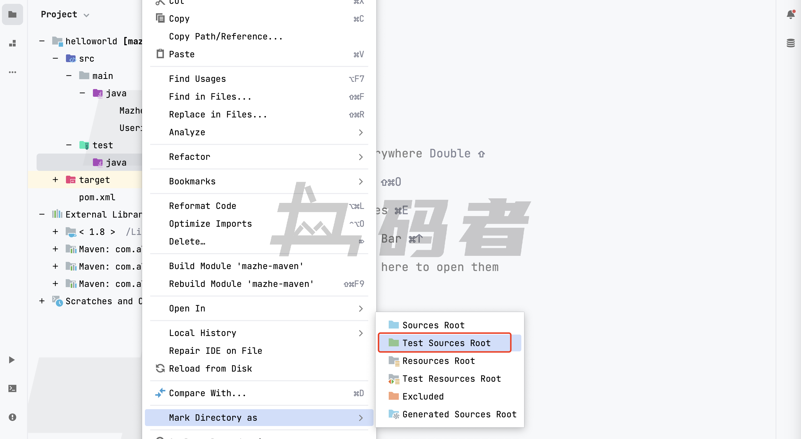](Maven 实战.assets/image-20241025150741214.png)

这里有一点选择和上面的不同，就是因为这次我们创建的是测试类的目录，所以我们要选择`Test Rources Root`，而不是之前我们选择的`Sources Root`。

[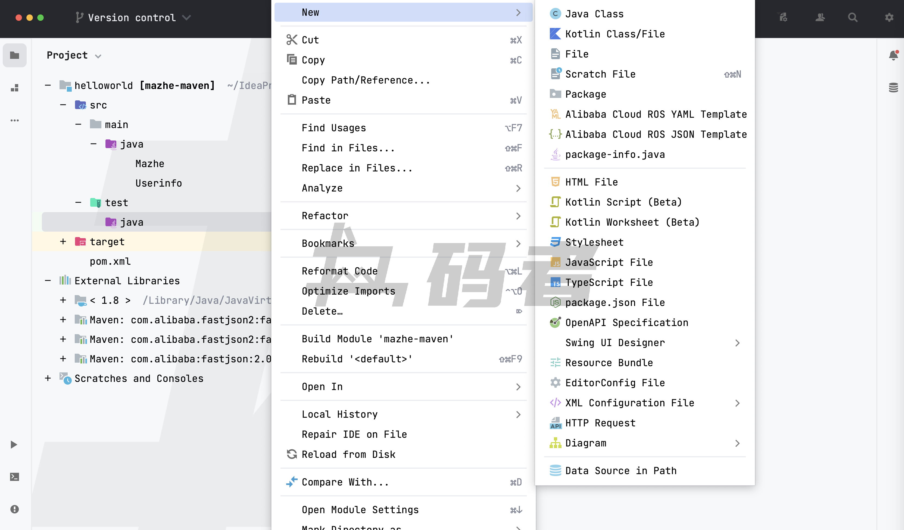](Maven 实战.assets/image-20241025150741215.png)

当我们设置完成后，在右键创建时，我们发现这时IDEA可以允许我们创建Java类了。下面我们创建一个测试类，具体的代码如下：

```java
import org.junit.Test;

public class MazheTest {
    @Test
    public void maven(){
        System.out.println("Hello world Mazhe Maven Test");
    }
}
```

我们简单说明一下上面的代码。因为这里面和我们平常写的代码还是有一些不一样的。例如我们之前要写可以执行的代码时，需要写`public static void main(String[] args)` 方法才可以执行。而当我们使用junit进行测试时代码时，对可以执行的方法名称并没有要求，可以随便定义符合Java规范的方法名，然后在对应的方法上添加`@Test`注解即可，这样这个方法就可以使用Maven进行测试了，也可以我们通过右键的方式直接运行。下面我们执行一下：

[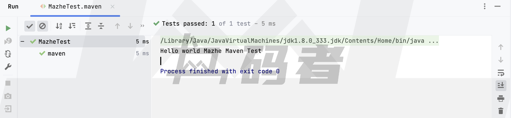](Maven 实战.assets/image-20241025150741216.png)

我们看日志的输入成功的输出了我们代码中的结果。下面我们还是使用Maven命令的方式来执行一下我们测试的代码，要如何使用呢?很简单，我们还是通过命令的方式即可。在Maven中执行测试的命令为：

```bash
mvn clean test
```

我们在项目的根目录中执行一下上面的命令，来看一下输出的结果。

[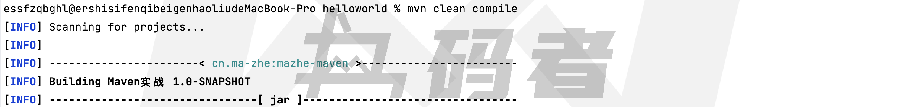](Maven 实战.assets/image-20241025174639448.png)

[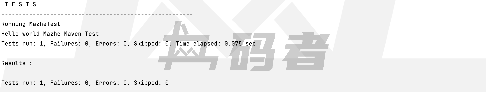](Maven 实战.assets/image-20241025174639449.png)

我们看日志输出，不但成功的输出了我们测试代码中的内容，还输出了我们本次运行了多少测试，运行了多少和失败了多少等统计的信息。这也就是使用Maven非常方便的体现。下面我们将上面的代码手动抛出一个异常，然后在执行一下测试用例在看一下，这次Maven会输入什么样的信息。

*   MazheTest

```java
import org.junit.Test;

public class MazheTest {
    @Test
    public void maven() {
        System.out.println("Hello world Mazhe Maven Test");
        System.out.println(1 / 0);
    }
}
```

我们手动输出了一个除以0的操作，所以上面的代码会抛出异常，我们看这时Maven的日志输出，会不会成功的输入异常上面的内容。

[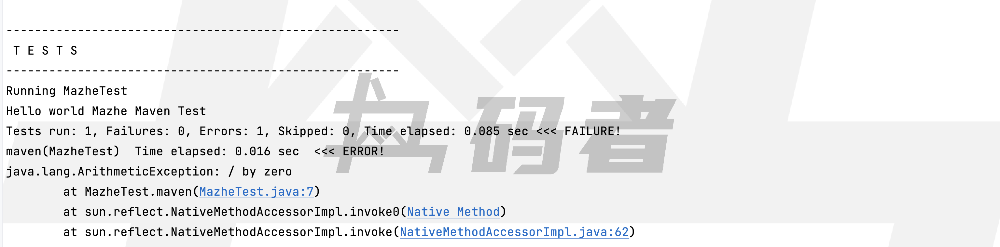](Maven 实战.assets/image-20241025174639450.png)

我们看异常上面的代码也成功的输出了，但是是执行下面的代码报错了。并且Maven已经将错误的信息输出。下面我们在看一下Maven中测试用例的统计信息，我们可以看到显示运行了一个，错误的一个。

[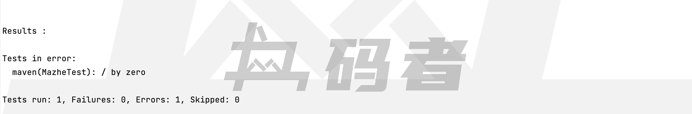](Maven 实战.assets/image-20241025174639451.png)

* * *

下面我们详细介绍一下pom.xml中配置的标签：

*   dependencies：声明项目的依赖的父标签，也就是上面介绍的，所有依赖包的配置必须在这个配置标签下面才可以使用。
    
*   dependency：声明项目的依赖的子标签，也就是我们上面说的依赖的配置标签。
    
*   groupId：依赖的基本坐标，通常为组织的域名倒写。目的就是唯一不能重复。
    
*   artifactId：依赖的基本坐标，通常为该项目的唯一标识。不同组织下可以重复，相同项目中不可以重复。
    
*   version：依赖的基本坐标，项目的不同版本号。不同版本中依赖包的内容，可能会有很大的不同，所以我们在通过Maven使用依赖包时，版本要特别的注意，甚至不同依赖包版本与版本不同，可能会导致项目冲突的问题。
    
*   打包
    

下面我们介绍一下如何在Maven中执行项目的打包。在Maven中执行打包也非常的方便，只要执行下面的命令即可，Maven就会自动在target目录下生成相应的jar包。因为jar包是Maven默认的打包类型。所以我们不需要添加额外的配置，当然我们也可以指定其它的打包类型。在后面的章节中我在做过多的介绍。下面是Maven打包的命令：

```bash
mvn clean package
```

当我们执行完上面的命令后，Maven就会将打包完的jar包放到target目录下。

[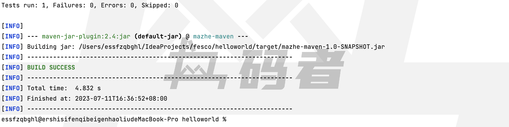](Maven 实战.assets/image-20241025174639452.png)

我们通过上面的Maven日志输出可以很方便的看到，这个jar包生成的目录地址。我们直接进入到target目录中，也可以直接看到我们刚刚打包完的jar包。

[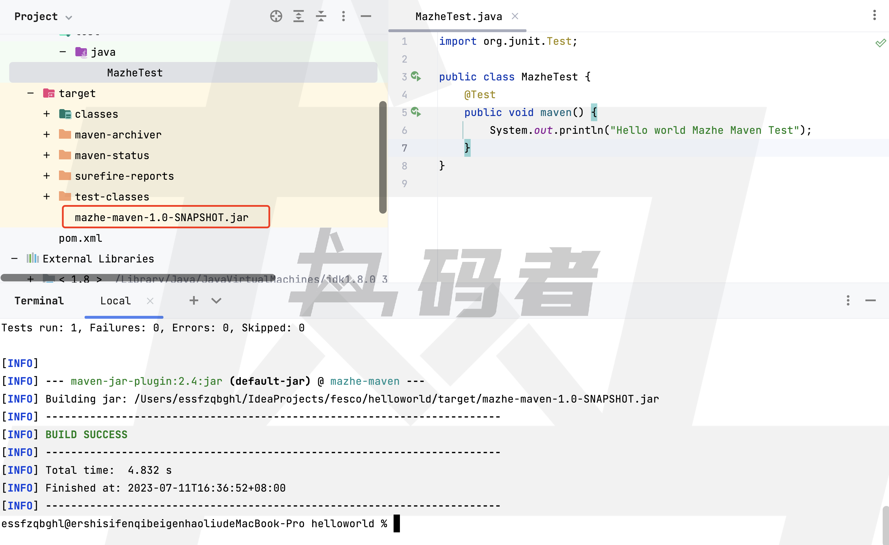](Maven 实战.assets/image-20241025174639453.png)

Maven默认的打包命名规则为当前项目的名称。当然我们也可以通过Maven中提供的`finalName`来自定义该打包文件的名称。具体配置如下：

*   pom.xml

```xml
<?xml version="1.0" encoding="utf-8" ?>
<project xmlns="http://maven.apache.org/POM/4.0.0">
    <modelVersion>4.0.0</modelVersion>
    <groupId>cn.ma-zhe</groupId>
    <artifactId>mazhe-maven</artifactId>
    <version>1.0-SNAPSHOT</version>
    <name>Maven实战</name>

    <dependencies>
        <dependency>
            <groupId>com.alibaba</groupId>
            <artifactId>fastjson</artifactId>
            <version>2.0.35</version>
        </dependency><dependency>
        <groupId>junit</groupId>
        <artifactId>junit</artifactId>
        <version>4.13.2</version>
    </dependency>

        <dependency>
            <groupId>junit</groupId>
            <artifactId>junit</artifactId>
            <version>4.13.2</version>
        </dependency>

    </dependencies>

    <build>
        <finalName>Mazhe-Maven-1.0</finalName>
    </build>

</project>
```

然后我们继续执行`mvn clean package`命令后在看一下打包后的jar包是否为我们配置中指定的名称。

[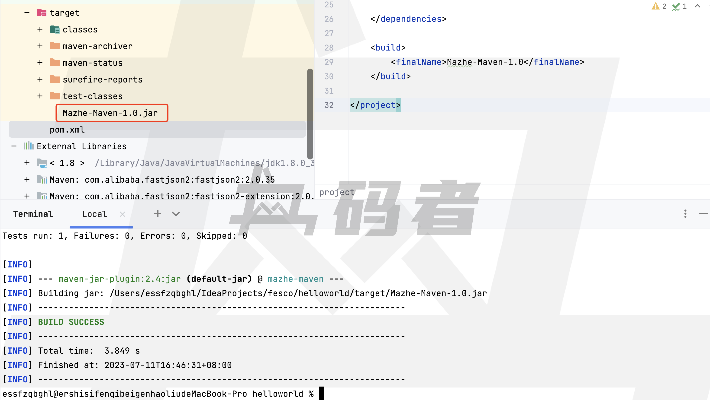](Maven 实战.assets/image-20241025174639454.png)

我们看上图中的结果，我们成功的指定了我们打包的名称了，这也就是`finalName`标签的作用。

*   安装

下面我们继续介绍另外的Maven命令，也就是安装命令。这里所说的安装可以理解为将打包好的jar安装到你的电脑中。这样当其它的项目相要引入这个依赖包时，只需要在对应的项目的pom.xml中配置即可。在Maven中可以使用下面命令进行安装：

```bash
mvn clean install 
```

当我们执行完上面的命令后，Maven依然会在项目的target中生成相应的jar包。

[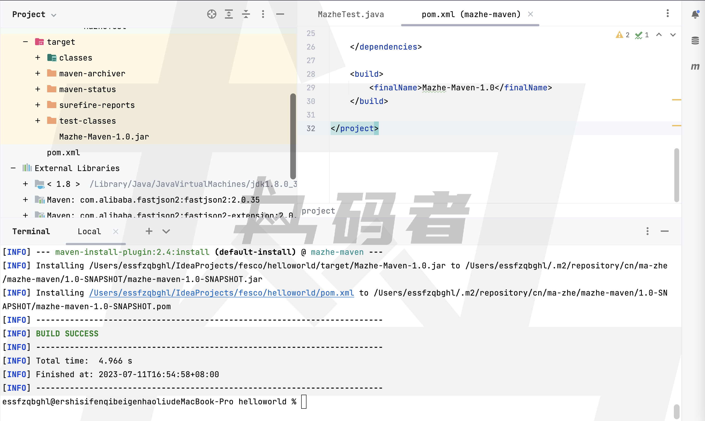](Maven 实战.assets/image-20241025174639455.png)

除此之外Maven还会将这个jar包生成到本地的仓库中，也就是上图中`Installing`输出的目录信息。由于Maven中涉及仓库的内容，我们会在后续的内容中详细的介绍，所以我们暂时可以先理解当我们执行完上面的命令后，Maven就会将这个jar包安装到我们的Maven指定的目录中，并且这个目录可以允许其它项目通过依赖配置的方式引入我们这个依赖包。

*   运行

下面我们介绍一下，如果在Maven中直接运行项目中的main方法，如果要实现上面的需求，需要我们添加额外的配置才能实现。在Maven中可以通过插件的方式完成上述的内容。插件的内容我们后续的内容中在详细的介绍，我们先简单了解如何使用。具体配置如下：

```xml
<build>
    <plugins>
        <plugin>
            <groupId>org.apache.maven.plugins</groupId>
            <artifactId>maven-shade-plugin</artifactId>
            <version>3.4.1</version>
            <executions>
                <execution>
                    <phase>package</phase>
                    <goals>
                        <goal>shade</goal>
                    </goals>
                    <configuration>
                        <transformers>
                            <transformer
                                         implementation="org.apache.maven.plugins.shade.resource.ManifestResourceTransformer">
                                <mainClass>Main</mainClass>
                            </transformer>
                        </transformers>
                    </configuration>
                </execution>
            </executions>
        </plugin>
    </plugins>
</build>
```

上面有一点我们要特别注意就是`mainClass`参数，我们要指定的是Mavn方法所在类的名称。并且不需要写类的后缀。当我们在pom.xml中配置了上面的信息后，然后执行打包的命令先生成新的打包文件。然后我们进入target目录中执行以下命令运行我的Jar包。

```bash
java -jar mazhe-maven-1.0.jar 
```

当我们输入上述命令时，就会发现成功输出了我们Main方法的内容了。

[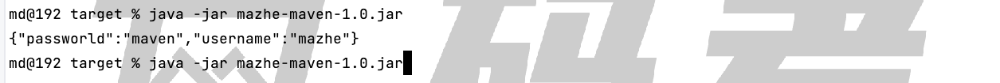](Maven 实战.assets/image-20241025174639456.png)

这时可能有人会怀疑，如果我们不配置上面的信息，直接打包，然后直接使用上面的命令运行我们Jar包，会显示什么结果呢？

下面我们尝试一下，将上面pom.xml中配置的build配置注释掉，然后测试一下。

*   pom.xml

```xml
<?xml version="1.0" encoding="utf-8" ?>
<project xmlns="http://maven.apache.org/POM/4.0.0">
    <modelVersion>4.0.0</modelVersion>
    <groupId>cn.ma-zhe</groupId>
    <artifactId>mazhe-maven</artifactId>
    <version>1.0-SNAPSHOT</version>
    <name>Maven实战</name>

    <dependencies>
        <dependency>
            <groupId>com.alibaba</groupId>
            <artifactId>fastjson</artifactId>
            <version>2.0.35</version>
        </dependency>
    </dependencies>

    <!-- <build>
        <finalName>mazhe-maven-1.0</finalName>
        <plugins>
            <plugin>
                <groupId>org.apache.maven.plugins</groupId>
                <artifactId>maven-shade-plugin</artifactId>
                <version>3.4.1</version>
                <executions>
                    <execution>
                        <phase>package</phase>
                        <goals>
                            <goal>shade</goal>
                        </goals>
                        <configuration>
                            <transformers>
                                <transformer
                                        implementation="org.apache.maven.plugins.shade.resource.ManifestResourceTransformer">
                                    <mainClass>Mazhe</mainClass>
                                </transformer>
                            </transformers>
                        </configuration>
                    </execution>
                </executions>
            </plugin>
        </plugins>
    </build>-->

</project>
```

下面我们执行打包命令，然后直接使用上面的命令运行我们新打包的Jar包。

[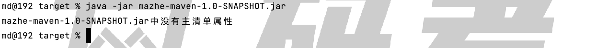](Maven 实战.assets/image-20241025174639457.png)

我们看上图所示，Jar在运行时抛出了异常，上面内容指的是没有指定Main方法的类，所以Java不知道要运行哪一个。这也就间接说明了，我们上面配置的信息是没有任何问题的。

*   总结

下面我们在简单总结一下我们上面所介绍的Maven命令。上述命令就是Maven中比较常见的命令：

```bash
mvn clean compile # 编译项目
mvn clean test    # 执行测试用例
mvn clean package # 项目打包
mvn clean install # 安装项目到本地
```

我们在执行Maven上述的命令时，如果仔细观察就会发现，上述的命令与命令之间是有依赖关系的。也就是在执行`mvn clean test`命令之前是会先执行`mvn clean compile`命令的，同样的在执行`mvn clean package`命令之前是会先执行`mvn clean test`命令的，而类似地，`mvn clean install`命令之前会执行`mvn clean package`命令。

那么Maven为什么要设置这样的规则呢，我们后续的内容中在详细介绍这方面的内容。


4、Maven 如何解决重复造轮子问题
----------------

通过上面我们的介绍，我们知道按照上面步骤，知道了如果在项目中使用Maven。虽然比我们自行引入Java时，方便了许多，但还是有一些比较繁琐的问题。例如上面中介绍的那样，我们要手动的创建`pom.xml`。还要按照相应Maven的规则创建`src/main/java`和`src/test/java`等目录。如果只创建一次还好，如果有多个项目都要创建的话，上面的步骤就比较麻烦了。这也就体现不出来Maven便利之处处了。实际上Maven已经考虑到上面的问题了。于是提供了`mvn archetype:generate`命令来允许我们使用命令的方式初始化Maven项目的骨架。

下面我们测试一下，使用`mvn archetype:generate`。生成Maven项目骨架时，都会自动给我们生成哪些内容。我们首先选择一个空项目，然后执行上面的命令。

[](Maven 实战.assets/image-20241025174639458.png)

输入`mvn archetype:generate`命令。

[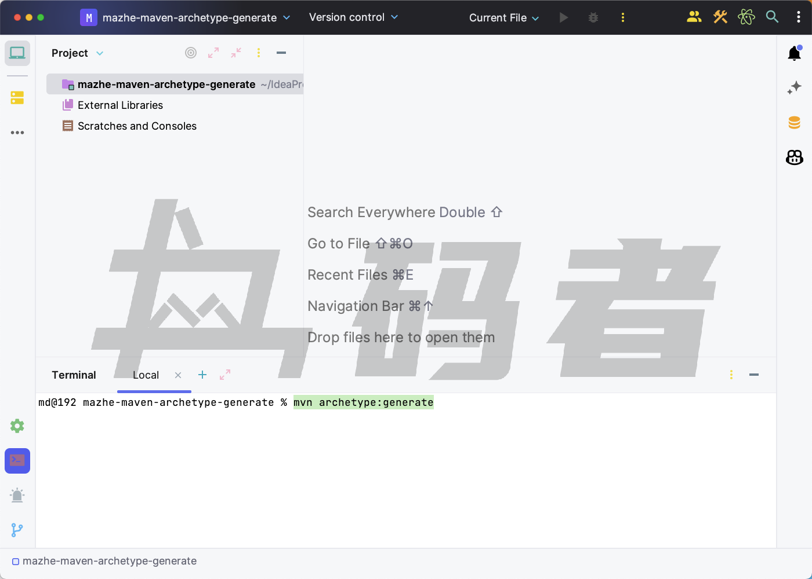](Maven 实战.assets/image-20241025174639459.png)

当我们输入完上面的命令后，Maven就会自动运行创建我们想要的项目骨架。但运行中时，需要我们做出人为的选择。

[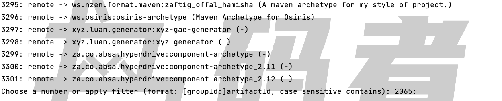](Maven 实战.assets/image-20241025174639460.png)

上面提示的2065，指的就是Maven会安装下面的方式创建项目骨架。那为什么Maven提供的了这么多选项呢？这是因为不同的项目，需要生成的项目骨架是不一样的，例如Java Web的项目的和普通Java项目就是不一样的，所以Maven为了兼容这种情况，提供了很多的选择，我们在使用`mvn archetype:generate`创建项目时，通常按照默认的方式创建即可，除非你有特殊的创建需求，在选择指定的创建规则。

[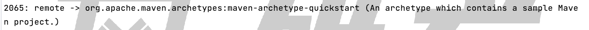](Maven 实战.assets/image-20241025174639461.png)

我们回车后，让Maven继续创建，也就是默认选择了2065创建。

[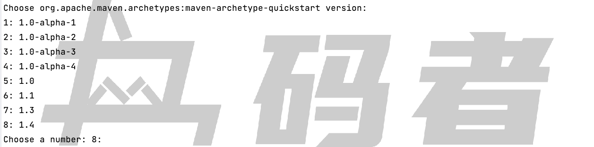](Maven 实战.assets/image-20241025174639462.png)

当我们选择后，会提示让我们选择相应的版本，我们通常选择比较稳定的版本即可，也就是不待任何修饰的版本，我们选择最后一个，也就是默认的选项8。

[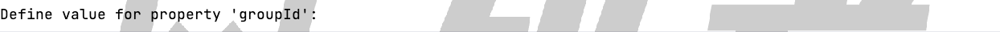](Maven 实战.assets/image-20241025174639463.png)

继续后，Maven又提示了，这回没有选择项了，需要我们手动的填入了，也就是`groupId`参数，这个参数上面的内容介绍过，项目的基本坐标，不要重复，我们随便写`cn-mazhe.maven`然后继续。

[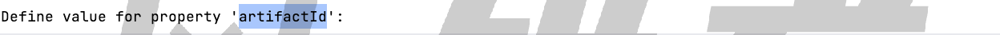](Maven 实战.assets/image-20241025174639464.png)

Maven又让我们写`artifactId`参数，这个参数我们也介绍过，项目的唯一标识，我们写`mazhe-maven-quickstart`然后继续。

[](Maven 实战.assets/image-20241025174639465.png)

这时又提示需要我们指定项目的版本了，并且通过上面的提示，我们可以看到，Maven在提示我们版本时，这个版本号的后面添加了SNAPSHOT修饰，这是什么意思呢？

在Maven中后缀添加SNAPSHOT的为快照版本，它本普通的版本在使用上没有任何区别，但是在下载更新时还是有区别的，我们后续的内容中在详细的介绍有关Maven版本的内容，我们继续。

[](Maven 实战.assets/image-20241025174639466.png)

Maven提示我们这个项目的包路径是不是我们上面指定的那个`groupId`参数路径。这个我们可以随便修改。

[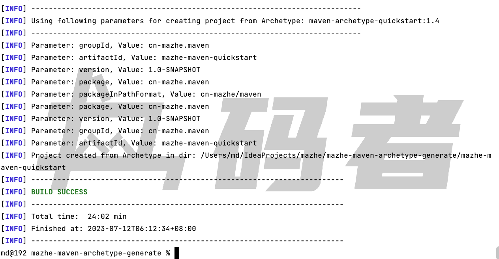](Maven 实战.assets/image-20241025174639467.png)

当我们执行完成后，Maven提示了我们项目构建成功了。下面我们用IDEA打开这个项目看一样，Maven都会我们生成哪些内容了。

[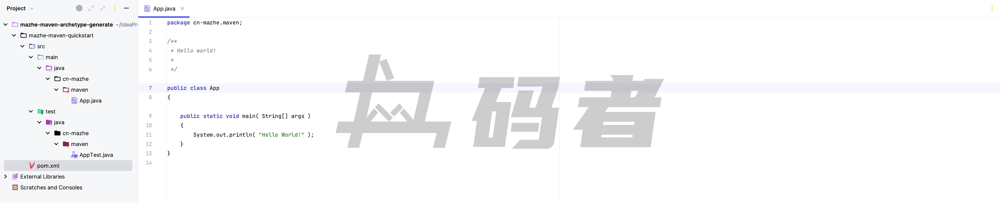](Maven 实战.assets/image-20241025174639468.png)

如上图所示，使用Maven中的`mvn archetype:generate`创建项目骨架时，生成了我们使用Maven默认约定的配置。也就是我们上面内容中手动创建的内容。

[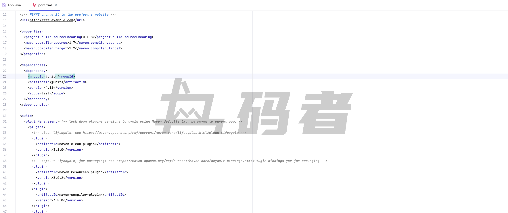](Maven 实战.assets/image-20241025174639469.png)

并且通过观察我们还发现了在pom.xml中还为我们生成了，很多我们没介绍过的标签内容。这里先不用担心，我们后续的内容中，都会详细的介绍。我们下面执行一下上面生成的代码，看一下项目是否能够运行。

[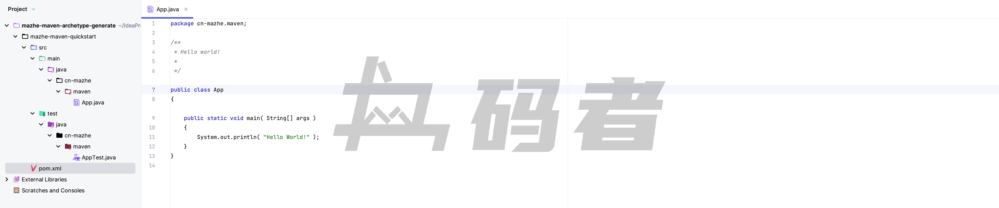](Maven 实战.assets/image-20241025174639470.png)

当我们执行时，我们发现，IDEA中并没有显示可以运行的按钮，这是什么原因呢。这是因为我们是在一个空的项目中创建了上面的另外的一个项目，所以IDEA并没有将这个项目识别出是一个Maven项目，已经这是我们创建空项目的一个目录。要想解决这个问题，有两种途径，一种是用IDEA,直接打开我们生成的这个项目。还有一个办法，就是如下图所示，我们设置一下。

[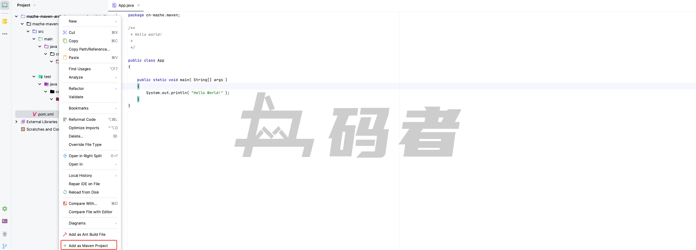](Maven 实战.assets/image-20241025174639471.png)

选中pom.xml文件，然后我们右键选择`Add as Maven Project`即可。

[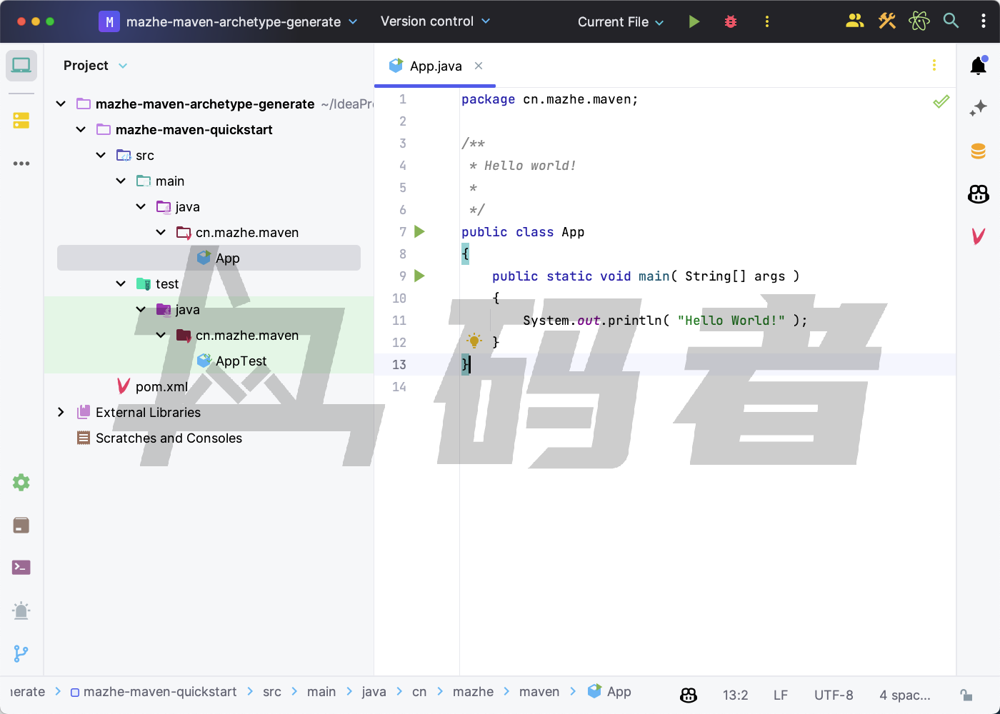](Maven 实战.assets/image-20241025174639472.png)

这样我们就可以执行上图中自动生成的代码了。

 

# 三、Maven 中的坐标

我们在上一篇中我们介绍过，如果想通过Maven添加项目的依赖时，就需要在pom.xml中引入项目的相关配置，也就是上一篇中说过的，如果要在项目中引入fastjson依赖，需要添加以下的配置：

```xml
<dependency>
    <groupId>com.alibaba</groupId>
    <artifactId>fastjson</artifactId>
    <version>2.0.35</version>
</dependency>
```

上面的配置，实际上最关键的就是`groupId`、`artifactId`和`version`参数。这三个主要的参数就可以理解为Maven中的坐标。下面在详细介绍Maven坐标之前，我们先回想一下在我们之前学平面几何的知识，我们知道如果要描述一个坐标，我们可以用x轴和y轴来表示。那么在现实世界中，我们可以通过经纬度来定位一个城市的位置。所以在Maven世界中，由于构建的组件非常多，于是也采用了同样的方式，也就是坐标来定位一个组件。但有唯一不同之处，就是相对x轴和y轴、经纬度来说，Maven的坐标中还包括版本等其它额外的信息。

在之前的文章中我们介绍过，我们没有使用Maven之前如果我们想要使用组件时，我们需要去相应的网站中找寻找，然后去下载才可以使用。但这个过程比较繁琐，并且非常不容易找到。如果项目依赖的组件比较多时，这项工作非常的浪费时间。并且在之前的文章中，我们也介绍过，这样常常会导致我们引入的依赖包，还依赖其它的依赖，这样我们很不方便的一次性全部寻找全。所以Maven为了解决上述的问题，方便我们使用和管理依赖。于是在Maven中定义了这样一组规则：世界上任何一个构件也就是依赖包都可以使用Maven坐标唯一标识。通过这个坐标标识，我们可以下载任何的组件。在Maven坐标中主要包括以下元素：groupId、artifactId、version、packaging、classifier等。下面我们就详细介绍一下这些元素的作用及其使用。


1、groupId
---------

groupId会被定义为Maven所属的项目名称。不过这个项目名称通常会被命令为公司或者组织的域名反向的命名。因为这样基本上是可以保证唯一的。只不过本书中并不推荐使用公司或者组织命名，因为在Maven中一个项目会被划分为多个模块，如果多个模块都按照此方式命名。那么在Maven中就无法通过groupId坐标来区分不同的模块了，当然我们也可以指定其它的坐标参数来区分，但这不是推荐的方式。所以groupId最好使用公司或者组织在加上项目名称来区分。例如大名鼎鼎的Spring Boot项目就是采用下面的方式定义groupId的：`spring-boot`的groupId就是使用`org.springframework.boot`来定义的。具体配置如下：

```xml
<dependency>
    <groupId>org.springframework.boot</groupId>
    <artifactId>spring-boot-starter-parent</artifactId>
    <version>3.0.5</version>
    <type>pom</type>
</dependency>
```

上面的配置中，我们看有了一新的配置也就是type参数，这个我们称不用了解，后续内容中，我们在详细的介绍。这样做除了上面说的好处外，还有一个目的，就是Maven在执行安装命令时，也就是install，会将此依赖安装到本地的仓库中，并且是按照是groupId的目录进行区分的，例如上面的`org.springframework.boot`配置，Maven在安装时会生成`org/springframework/boot`目录。这样如果我们添加了项目的后缀，在本地仓库寻找相应的Jar包就会容易很多。


2、artifactId  
--------------

artifactId元素会被定义为Maven中的项目名称，但由于现有的软件开发架构中，通常都会把Maven划分为多个模块。所以常常将artifactId元素指定为模块的名称。并且推荐加上groupId元素的前缀。这样的好处是，在Maven库中可以很方便的通过artifactId元素的名字来找到我们想要的Jar包。因为就是上面说过的在Maven的库中groupId的命名会被解析为目录，而artifactId的命名才是组件真正的名称。如果我们不加前缀可能会有很多不同的groupId的artifactId的命名重复。虽然不会影响我们使用，但可能会影响我们在本地仓库中寻找。当然Maven也可以通过额外的参数设置来更改构建的名称。也就是这前介绍过的。`finalName`参数。


3、version
---------

version元素定义Maven中的项目的版本。不同的版本可能会有很大的不同，并且不同的版本所依赖其它依赖包的版本也可能是不同的。在Maven中有两个版本类型。一个是正常的版本信息，也就是我们之前看到了1.0这类的。还有一个是快照版本，也就是SNAPSHOT版本。SNAPSHOT版本，在特殊的场景中有不同的效果，我们后续的内容在做详细的介绍。我们现在需要知道，如果我们要引入任何一个依赖包时，必须指定相应的版本，如果我们版本信息有指定的不对时，Maven则不会下载相应的依赖包。


4、packaging
-----------

packaging元素定义为Maven中的打包方式。在Maven中打包方式指的就是项目构建完组件的扩展名。在Maven中默认的打包方式为jar。也就是上一篇中我们介绍过的，我们什么都没有指定，默认Maven打包的方式就是jar包。也就是当然我们忽略这个参数不指定时，Maven会自动构建出jar类型的组件。在Maven中除了jar打包方式外，还有war和pom类型。其中war类型的组建为网站的类型，需要通过应用服务器才可以运行。也就是我们常说的的Java Web项目。而pom类型，则是Maven中父项目的类型。因为Maven中可以划分为多个模块，但一定是需要一个父模块来管理其它的子模块。这个父模块的类型，我们就需要设置为pom类型。


5、classifier
------------

classifier元素定义Maven中的附属构建。我们知道在Maven中可以使用groupId、artifactId和version元素来定位一个组件。但在一些其它的情况下，只使用上面的元素是定位不到组件的。因为有些组件并不是按照上面3个元素构建的。所以只指定上在面三个元素是下载不下来的。这时就需要classifier元素了。例如有些组件需要兼容不的jdk版本，这时我们就需要将classifier元素配置为指定的jdk版本。例如下面的组件配置。

```xml
<dependency>
    <groupId>net.sf.json-lib</groupId>
    <artifactId>json-lib</artifactId>
    <version>2.4</version>
</dependency>
```

按照我们上面介绍的，一般的组件我们只要按照上面的方式配置就可以直接下载这个组件的Jar包。但上面的组件比较特殊，因为它需要指定相应的jdk版本才可以下载。也就是要按照下面的方式才可以。

```xml
<dependency>
    <groupId>net.sf.json-lib</groupId>
    <artifactId>json-lib</artifactId>
    <version>2.4</version>
    <classifier>jdk15</classifier>
</dependency>
```

上面介绍的是Maven中比较常见的元素，当然还有很多其它的元素，需要我们学习，我们先了解上面的内容，后续的章节中我们在慢慢介绍。

 

# 四、Maven 的依赖配置

在之前文章中，我们已经介绍过了，如果要在Maven中添加新的依赖则需要使用dependencies标签来配置Maven的依赖，并且我们已经介绍过了很多有关依赖元素的配置。例如：`groupId、artifactId、version`等。但上面的内容只是我们比较常见的配置，实际上Maven为了满足我们很多需求场景，提供了很多额外的配置，具体的配置如下：

```xml
<dependencies>
    <dependency>
        <groupId>…</groupId>
        <artifactId>…</artifactId>
        <version>…</version>
        <type>…</type>
        <scope>…</scope>
        <optional>…</optional>
        <exclusions>
            <exclusion>…</exclusion>
        </exclusions>
    </dependency>
</dependencies>
```

上面的部分标签我们在之前的文章中已经介绍过了，下面我们重点介绍一下没有介绍过的标签的作用：


1、type
------

依赖的类型，也就是引入其它依赖组件packaging指定的类型。所以该标签可以选择的参数为`jar、war、pom`。且在Maven中默认的type类型为`jar`。也就是将改依赖的jar包引入到项目中，`war`参数也是如些。下面我们验证一下。

首先我们先创建一个Maven的项目，因为之前的内容已经详细介绍过怎么创建了，所以我们这里就不做过多的介绍了。我们直接创建一个`midai-mazhe-maven`项目。

[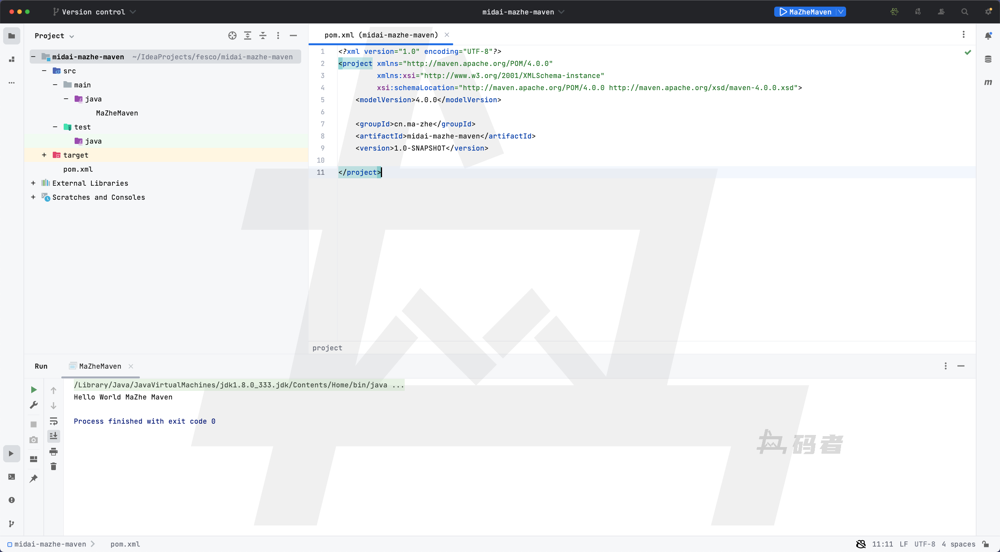](Maven 实战.assets/image-20241025174639473.png)

然后我们写一个测试类测试一下项目。

*   MaZheMaven

```java
public class MaZheMaven {
    public static void main(String[] args) {
        System.out.println("Hello World MaZhe Maven");
    }
}
```

*   输出

```
Hello World MaZhe Maven
```

[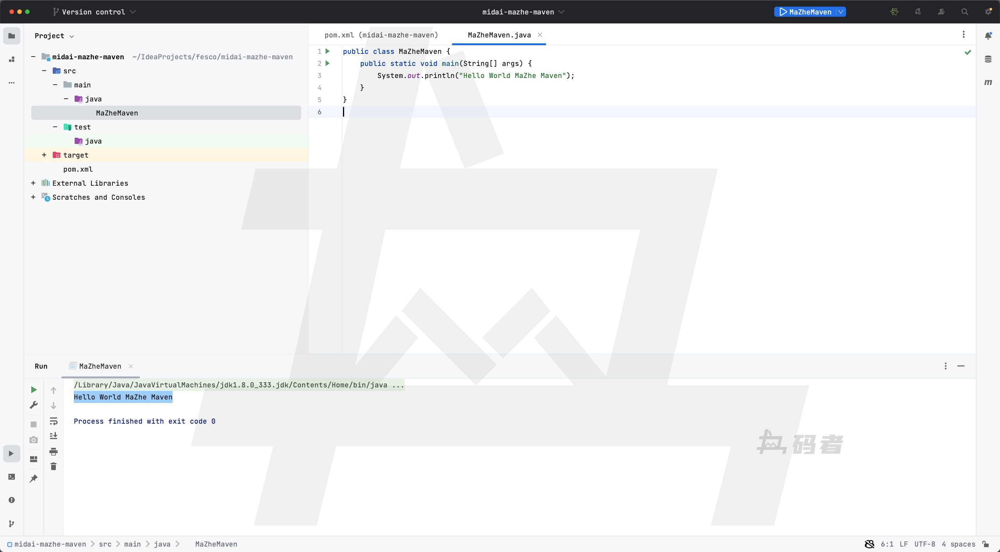](Maven 实战.assets/image-20241025174639474.png)

通过上图证明了我们刚刚创建的项目是没有任何问题的。下面我们还是和之前一样创建一个对象然后使用fastjson工具类转成json。

*   Userinfo

```java
public class Userinfo {
    private String username;
    private String password;

    public String getUsername() {
        return username;
    }

    public void setUsername(String username) {
        this.username = username;
    }

    public String getPassword() {
        return password;
    }

    public void setPassword(String password) {
        this.password = password;
    }

    @Override
    public String toString() {
        return "Userinfo{" +
                "username='" + username + '\'' +
                ", password='" + password + '\'' +
                '}';
    }
}

```

*   MaZheMaven

```java
import com.alibaba.fastjson.JSONObject;

public class MaZheMaven {
    public static void main(String[] args) {
        System.out.println(JSONObject.toJSONString("Hello World MaZhe Maven"));
        printJson();
    }

    public static void printJson(){
        Userinfo userinfo = new Userinfo();
        userinfo.setUsername("mazhe");
        userinfo.setPassword("maven");
        System.out.println(JSONObject.toJSONString(userinfo));
    }
}
```

由于上面的代码非常的简单，我们就不详细介绍了。下面我们将上面的项目打成包。也就是使用Maven中的`install`命令。下面我们在项目的根目录中执行下面的命令：

```bash
mvn clean install
```

上面实际上是两个命令，`install`命令我们介绍过，就是将依赖包安装到达本地仓库中。而`clean`命令的作用就是清理的意思。我们知道当执行Maven命令编译或者打包时，当执行完成后，会在项目的根目录中创建一个target目录，然后Maven将相应的jar包生成到这个目录中。而`clean`命令的作用就是删除这个目录。如果我们不执行`clean`命令，而直接执行`install`命令而Maven并不会自动删除之前target目录下生成的内容。所以为了方便，也为了我们不会使用错jar包。我们实际的工作中基本上会联合使用上面的命令。

[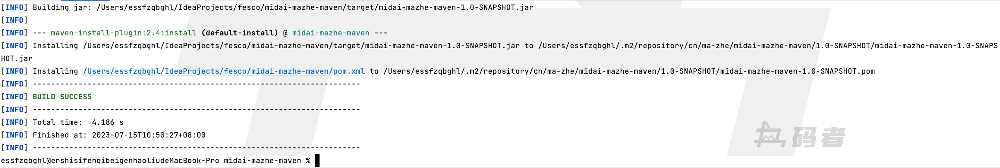](Maven 实战.assets/image-20241025174639475.png)

我们之前也介绍过，当使用`install`命令安装成功后，会将这个依赖包安装到本地的仓库中，这样的好处是其它项目也可以通过Maven依赖的配置引入到自己的项目中。下面我们在创建一个新的项目，来测试一下。

[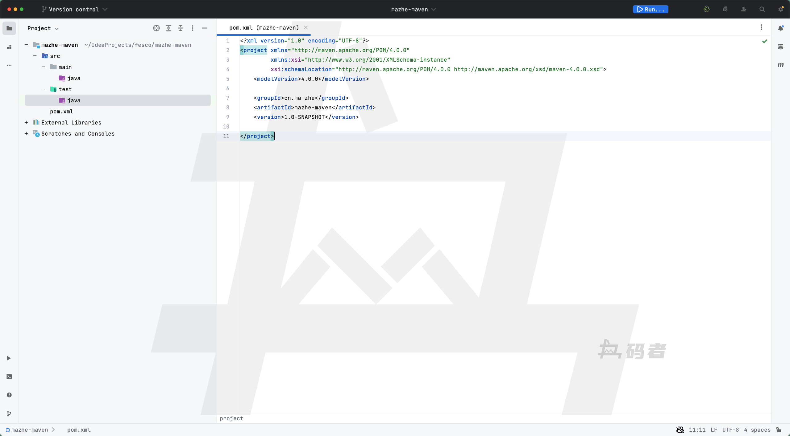](Maven 实战.assets/image-20241025174639476.png)

这次我们添加一个测试类测试一下代码。为了我们可以使用测试用例，所以我们需要添加`junit`依赖包，具体配置如下：

*   pom.xml

```xml
<?xml version="1.0" encoding="UTF-8"?>
<project xmlns="http://maven.apache.org/POM/4.0.0"
         xmlns:xsi="http://www.w3.org/2001/XMLSchema-instance"
         xsi:schemaLocation="http://maven.apache.org/POM/4.0.0 http://maven.apache.org/xsd/maven-4.0.0.xsd">
    <modelVersion>4.0.0</modelVersion>

    <groupId>cn.ma-zhe</groupId>
    <artifactId>mazhe-maven</artifactId>
    <version>1.0-SNAPSHOT</version>

    <dependencies>
        <dependency>
            <groupId>junit</groupId>
            <artifactId>junit</artifactId>
            <version>4.13.2</version>
        </dependency>
    </dependencies>

</project>
```

下面我们创建一个测试类，简单输出一句话，来验证，我们引入的依赖包，没有任何问题。

*   MazheMaveTest

```java
import org.junit.Test;

public class MazheMavenTest {
    @Test
    public void test(){
        System.out.println("Hello World Mazhe Maven");
    }
}
```

*   输出

```
Hello World Mazhe Maven
```

[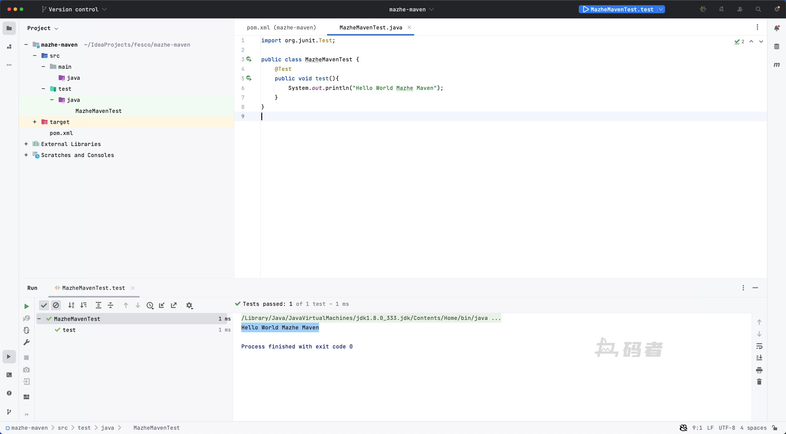](Maven 实战.assets/image-20241025174639477.png)

看上图所示，我们成功引入了junit依赖了。下面我们引入我们上一个项目的依赖，看一下能否直接使用。具体配置如下：

*   pom.xml

```xml
<?xml version="1.0" encoding="UTF-8"?>
<project xmlns="http://maven.apache.org/POM/4.0.0"
         xmlns:xsi="http://www.w3.org/2001/XMLSchema-instance"
         xsi:schemaLocation="http://maven.apache.org/POM/4.0.0 http://maven.apache.org/xsd/maven-4.0.0.xsd">
    <modelVersion>4.0.0</modelVersion>

    <groupId>cn.ma-zhe</groupId>
    <artifactId>mazhe-maven</artifactId>
    <version>1.0-SNAPSHOT</version>

    <dependencies>
        <dependency>
            <groupId>junit</groupId>
            <artifactId>junit</artifactId>
            <version>4.13.2</version>
        </dependency>
        <dependency>
            <groupId>cn.ma-zhe</groupId>
            <artifactId>midai-mazhe-maven</artifactId>
            <version>1.0-SNAPSHOT</version>
        </dependency>
    </dependencies>

</project>
```

下面我们直接在测试类中使用上一个项目的代码，看一下是否能直接使用。

*   MazheMavenTest

```java
import org.junit.Test;

public class MazheMavenTest {
    @Test
    public void test(){
        MaZheMaven.printJson();
    }
}
```

*   输出

```
{"password":"maven","username":"mazhe"}
```

[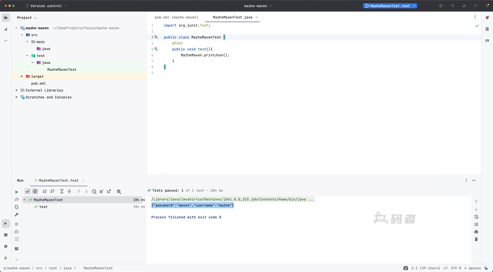](Maven 实战.assets/image-20241025174639478.png)

我们看上图所示，我们成功了引入了上个项目的依赖。因为默认`type`的参数的值为`jar`。所以我们上述的配置实际上就是验证了引入外部依赖包的功能。那么对于`war`的参数配置也是一样。下面我们验证一下如果将`type`的参数设置为`pom`，然后我们在从另外的项目中引入会有什么效果呢？下面我们尝试一下。首先在`midai-mazhe-maven`项目中将`packaging`参数设置为`pom`。配置如下：

*   pom.xml

```xml
<?xml version="1.0" encoding="UTF-8"?>
<project xmlns="http://maven.apache.org/POM/4.0.0"
         xmlns:xsi="http://www.w3.org/2001/XMLSchema-instance"
         xsi:schemaLocation="http://maven.apache.org/POM/4.0.0 http://maven.apache.org/xsd/maven-4.0.0.xsd">
    <modelVersion>4.0.0</modelVersion>

    <groupId>cn.ma-zhe</groupId>
    <artifactId>midai-mazhe-maven</artifactId>
    <version>1.0-SNAPSHOT</version>

    <packaging>pom</packaging>

    <dependencies>
        <dependency>
            <groupId>com.alibaba</groupId>
            <artifactId>fastjson</artifactId>
            <version>2.0.6</version>
        </dependency>
    </dependencies>

</project>
```

下面我们在修改一下mazhe-maven项目的pom.xml文件。将刚刚引入的midai-mazhe-maven项目的依赖配置的`type`参数配置成`pom`。 

然后我们在观察一下测试类的代码，看看有啥不同。

[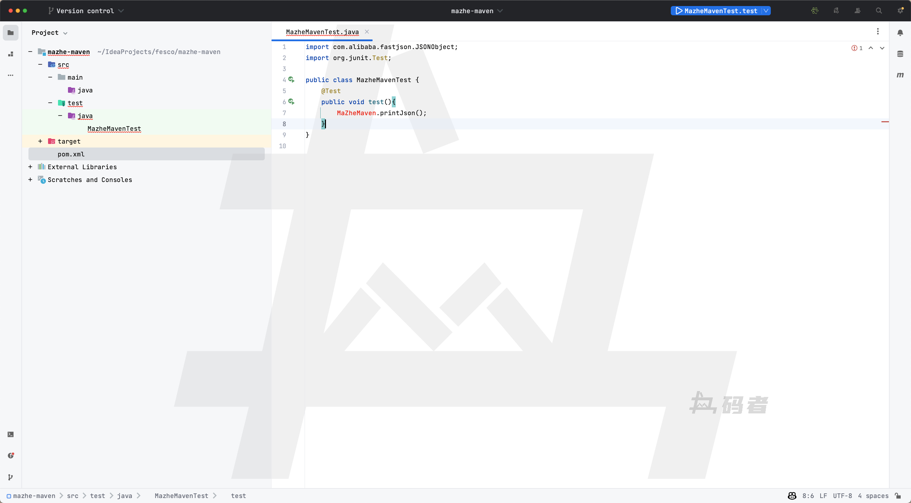](Maven 实战.assets/image-20241025174639479.png)

我们看midai-mazhe-maven项目中的MaZheMaven显示报错了，这就表明了，我们这个项目中并没有成功的引入这个类的依赖。这个就是`type`参数配置成`pom`的左右。当然这样配置时，Maven并不会引入这个项目本身的任何依赖类，所以我们这个项目中也就引入不到MaZheMaven类了。那这时可能有人想问了，那这样我还引入这个依赖包干什么呢？当这样配置时，虽然Maven不会引入这个依赖包项目本身的代码，但是它将这个项目的配置依赖引入到新项目中，可以简单的理解为将这个项目的pom.xml中的配置引入过来。因为midai-mazhe-maven项目的pom.xml中引入了fastjson依赖，下面我们看一下，我们直接在mazhe-maven项目中是否可以直接使用这个依赖呢？如果可以则说明了，当将`type`参数配置成`pom`时，确实会引入依赖配置。下面我们尝试一下。

*   MazheMavenTest

```java
import com.alibaba.fastjson.JSONObject;
import org.junit.Test;

public class MazheMavenTest {
    @Test
    public void test(){
//        MaZheMaven.printJson();
        System.out.println(JSONObject.toJSONString("Hello World Mazhe Maven"));
    }
}

```

*   输出

```
"Hello World Mazhe Maven"
```

[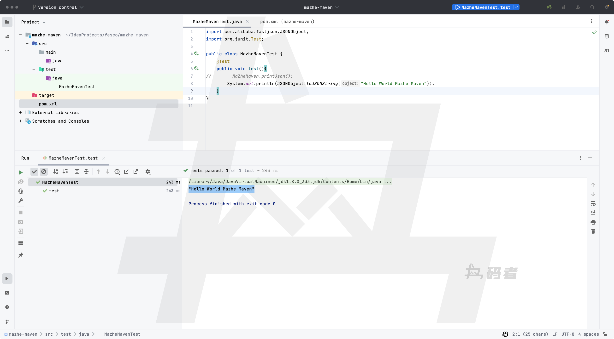](Maven 实战.assets/image-20241025174639480.png)

我们看上图所示，成功的使用了fastjson的工具类了，虽然我们项目本身没有引入fastjson的依赖，但是因为我们引入了midai-mazhe-maven项目，该项目配置了fastjson的依赖。所以本项目可以直接使用。这就是type参数的作用。


2、scope
-------

依赖的范围。通过此标签可以指定Maven的打包行为。下面我们介绍一下，scope参数都有哪些配置参数：

*   compile
*   test
*   runntime
*   provided
*   system
*   import


### 1、compile

编译的依赖范围。该依赖访问是一个比较强的依赖，配置此依赖的依赖包，将参与项目的编译、测试、运行等操作，并且在项目打包时，会将此依赖包部署到打包文件中。该依赖也是Maven中scope参数的默认配置。

下面我们通过示例验证一下，上面说的内容。首先我们引入一个依赖包也就是之前介绍过的fastjson依赖包，具体配置如下：

```xml
<?xml version="1.0" encoding="UTF-8"?>
<project xmlns="http://maven.apache.org/POM/4.0.0"
         xmlns:xsi="http://www.w3.org/2001/XMLSchema-instance"
         xsi:schemaLocation="http://maven.apache.org/POM/4.0.0 http://maven.apache.org/xsd/maven-4.0.0.xsd">
    <modelVersion>4.0.0</modelVersion>

    <groupId>cn.ma-zhe</groupId>
    <artifactId>midai-mazhe-maven</artifactId>
    <version>1.0-SNAPSHOT</version>

    <dependencies>
        <dependency>
            <groupId>com.alibaba</groupId>
            <artifactId>fastjson</artifactId>
            <version>2.0.6</version>
        </dependency>
    </dependencies>

</project>
```

按照上面介绍的，当我们什么都不指定的时候，scope参数的默认配置为：`compile`。下面我们创建两个类，一个在项目的主代码目录中，一个在项目的测试目录中。

*   MaZheMaven

```java
import com.alibaba.fastjson.JSONObject;

public class MaZheMaven {
    public static void main(String[] args) {
        System.out.println(JSONObject.toJSONString("Hello World MaZhe Maven"));
    }
}
```

[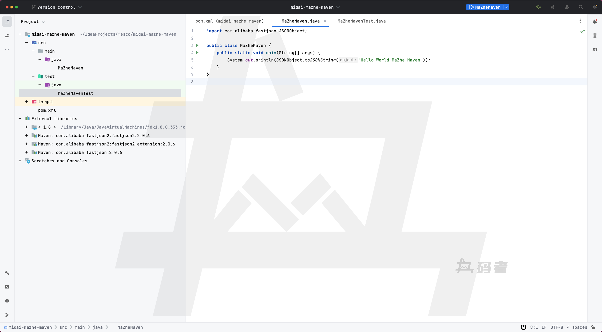](Maven 实战.assets/image-20241025174639481.png)

*   MaZheMavenTest

```java
import com.alibaba.fastjson.JSONObject;

public class MaZheMavenTest {
    public static void main(String[] args) {
        System.out.println(JSONObject.toJSONString("Hello World MaZhe Maven Test"));
    }
}
```

[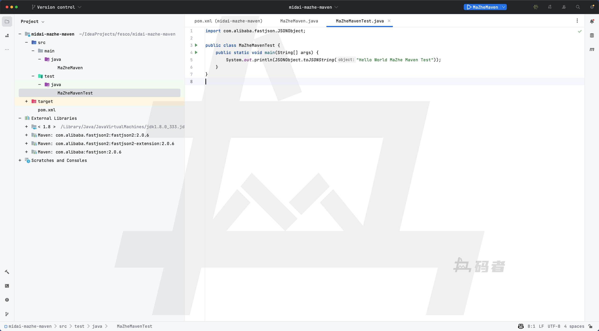](Maven 实战.assets/image-20241025174639482.png)

由于`compile`依赖范围的是针对编译、测试和运行都是有效的，所以上面的代码均可运行，都可以引入fastjson的依赖包。


### 2、test

测试的依赖范围。顾名思义，该依赖只对测试环境有效，所以当配置为此依赖时，并不会参与项目的编译和运行，打包时也不会将此依赖部署到打包文件中。该依赖最常使用的场景就是测试用例的依赖。

同样样我们也验证一下test的配置范围。我们将之前引入的fastjson依赖包的scope的参数修改为test。

```xml
<?xml version="1.0" encoding="UTF-8"?>
<project xmlns="http://maven.apache.org/POM/4.0.0"
         xmlns:xsi="http://www.w3.org/2001/XMLSchema-instance"
         xsi:schemaLocation="http://maven.apache.org/POM/4.0.0 http://maven.apache.org/xsd/maven-4.0.0.xsd">
    <modelVersion>4.0.0</modelVersion>

    <groupId>cn.ma-zhe</groupId>
    <artifactId>midai-mazhe-maven</artifactId>
    <version>1.0-SNAPSHOT</version>

    <packaging>pom</packaging>

    <dependencies>
        <dependency>
            <groupId>com.alibaba</groupId>
            <artifactId>fastjson</artifactId>
            <version>2.0.6</version>
            <scope>test</scope>
        </dependency>
    </dependencies>

</project>
```

然后我们什么不都修改，在看一下上面的两具类的代码有啥变化。

*   MaZheMaven

[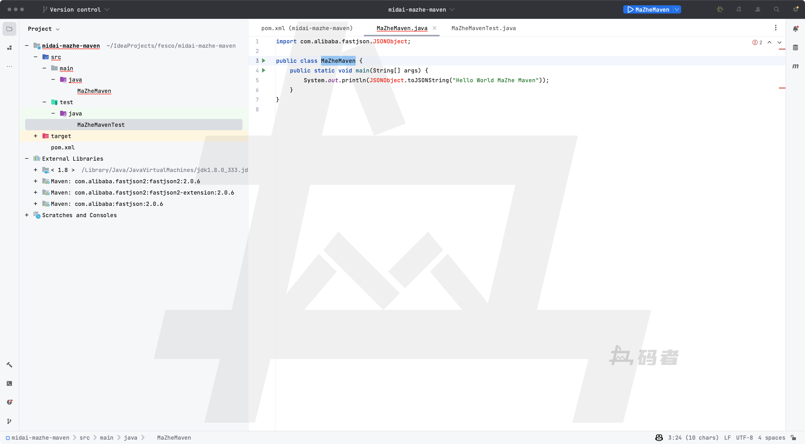](Maven 实战.assets/image-20241025174639483.png)

*   MaZheMavenTest

[](Maven 实战.assets/image-20241025174639484.png)

如上图所示，我们看到MaZheMaven类报错了。这是因为上面所说的，test的依赖范围只对测试环境有效，其它环境均是无效的。因为MaZheMaven类在主代码目录中，所以报错了。下面我们打包一下这个项目，看一下test范围的依赖包会不会生成在打包文件中。在执行打包命令前，需要将MaZheMaven类的代码注释，否则会报编译失败错误。


### 3、runntime

运行时依赖范围。该依赖范围适用于运行和测试范围。在编译的环境下不会被使用。最常使用的场景就是数据库的驱动依赖，因为只有项目运行时才会被使用。

我们继续将scope参数修改为runntime看一下代码的效果。

1、pom.xml

[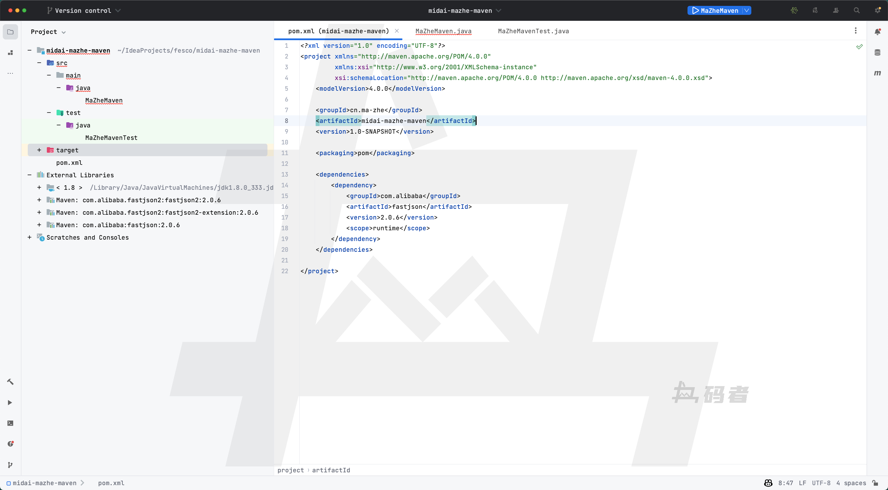](Maven 实战.assets/image-20241025174639485.png)

2、MaZheMaven

[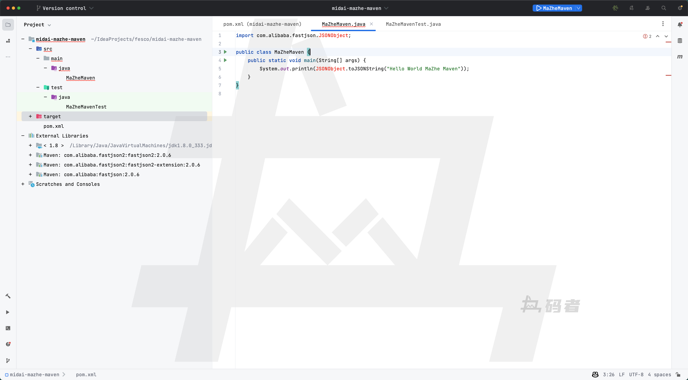](Maven 实战.assets/image-20241025174639486.png)

3、MaZheMavenTest

[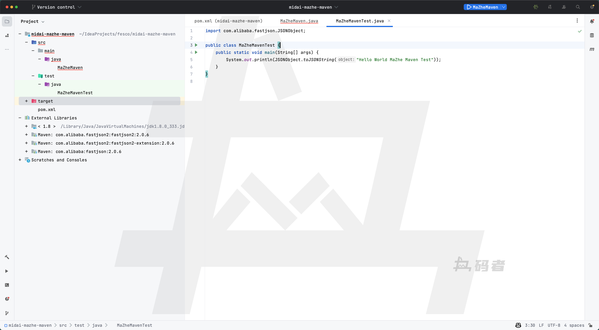](Maven 实战.assets/image-20241025174639487.png)

我们看上图所示，因为runntime依赖范围是对运行和测试有效的，所以主代码中的依赖依赖报错了，而测试目录中代码则没有任何问题。


### 4、provided

此依赖范围适用于编译和测试范围。项目打包时并不会打包此依赖范围的依赖。最常用的使用场景是servlet相应的依赖。因为该依赖范围，必须在容器中运行，容器中已经有了相关的jar包所以不需要额外添加了。

我们继续将scope参数修改为provided看一下代码的效果。

1、pom.xml

[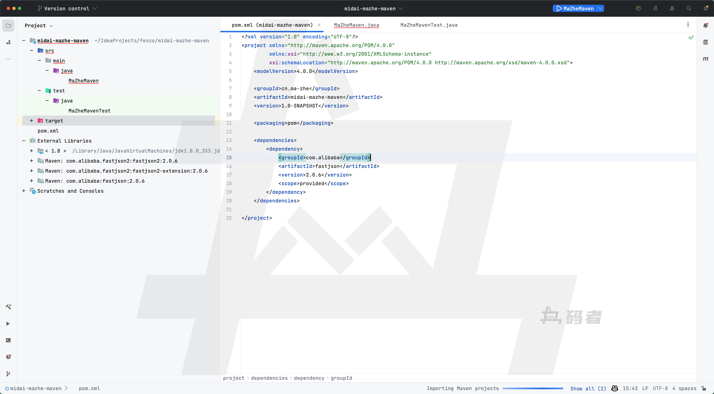](Maven 实战.assets/image-20241025174639488.png)

2、MaZheMaven

[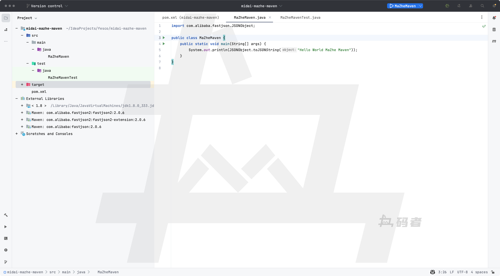](Maven 实战.assets/image-20241025174639489.png)

3、MaZheMavenTest

[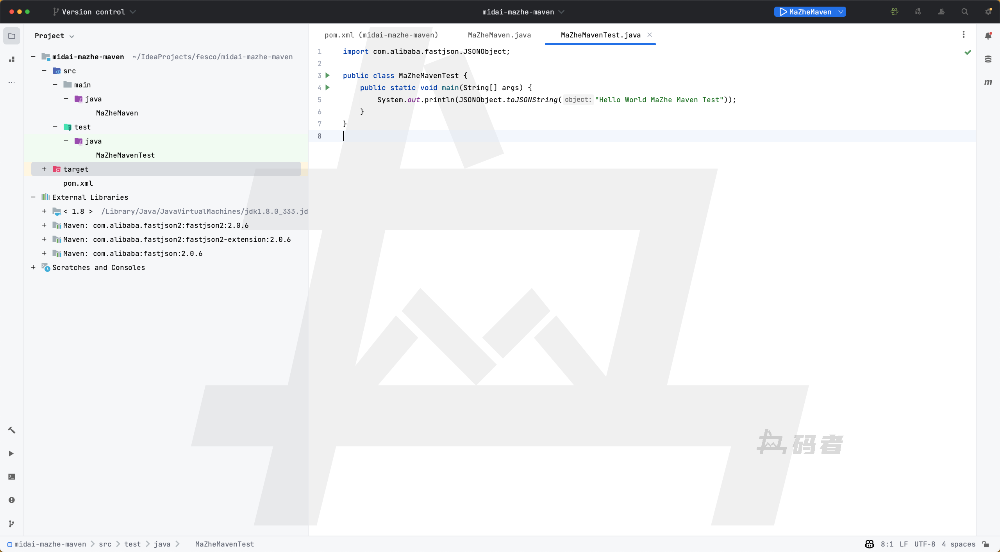](Maven 实战.assets/image-20241025174639490.png)

还是如图所示，我们看这次主代码的和测试代码都没有报错。这是因为provided参数的依赖范围是针对编译和测试环境的，所以主代码报错的问题也就不存在了。


### 5、system

此依赖范围适用于编译和测试范围。和provided参数一致，不同的地方在于，此依赖配置需要添加额外的配置，因为此依赖配置不是从Maven中获取依赖的，于是通过系统中配置的路径获取依赖的。具体的配置如下：

```xml
<scope>system</scope>
<systemPath>../fastjson-2.0.6.jar</systemPath>
```

我们继续将scope参数修改为system看一下代码的效果。

1、pom.xml

[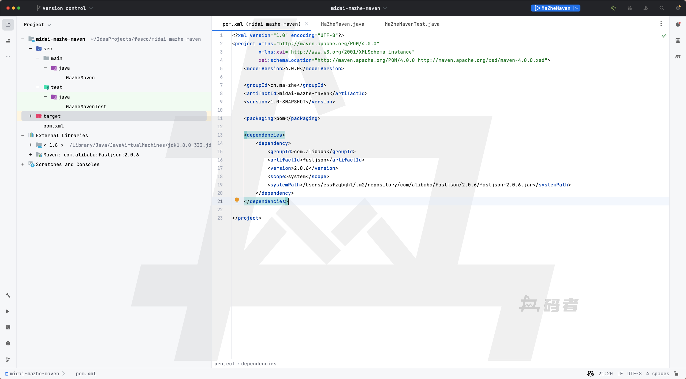](Maven 实战.assets/image-20241025174639491.png)

2、MaZheMaven

[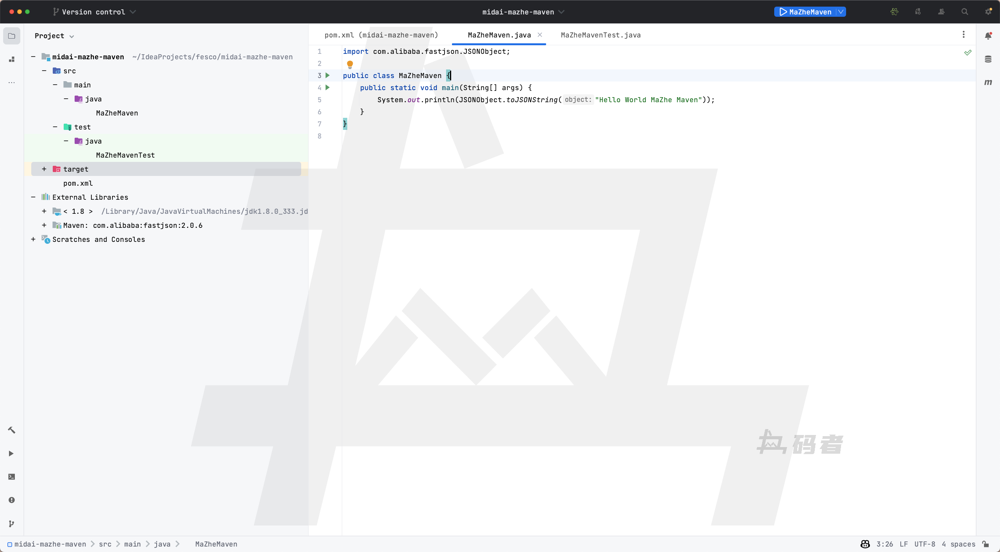](Maven 实战.assets/image-20241025174639492.png)

3、MaZheMavenTest

[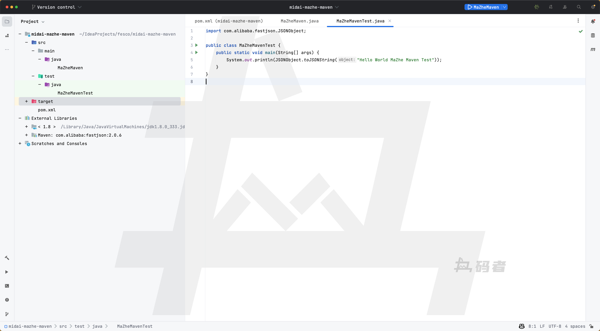](Maven 实战.assets/image-20241025174639493.png)

还是如图所示，我们看这次主代码的和测试代码都没有报错。这是因为provided参数的依赖范围是针对编译和测试环境的，所以主代码报错的问题也就不存在了。


### 6、impoort

这个后面介绍。


3、optional
----------

下面我们介绍一下optional参数，该参数的作用是标记依赖是否可选。当参数设置为true时，则表示子项目不会依赖此组件。也可以理解为子项目并不会继承这个依赖。由于我们后续的内容中会详细的介绍这个参数的作用，所以这里就不在做过多的介绍和项目演示了了。


4、exclusions
------------

exclusions参数的目的是排除传递性依赖。由于传递性依赖的内容，我们也将在后续的内容中在做详细介绍，所以本篇也不在做项目演示了。


# 五、Maven 的传递性依赖

今天我们分享的内容是Maven中的传递性依赖。在介绍这个内容之前，在使用Maven时会不会有这样疑惑。也就是当我们引入一个组件时，需要在pom.xml中配置相关依赖的标签。但这个组件可能还会依赖其它的组件。如果我们每引入一个依赖时，都需要将这个依赖所依赖的组件配置写到pom.xml中这样会导致，我们需要配置的依赖的标签就会非常的多，并且我们也很难知道一个组件和依赖的其它的组件到底是什么。且这样也违背了Maven通过坐标引入组件的目的了。因为它不够简单与便捷。为了解决上述的问题，Maven引入了传递性依赖。所谓的传递性依赖的，指的就是当我们引入一个组件时，如果这个组件还依赖其它的组件，那么Maven就会自动将其它的组件也一同下载下来，并且并不需要我们引入这些额外的依赖。

* * *

下面我们通过代码验证一下，还是我们之前的代码事例，也就是引入`fastjson`依赖包，来验证一下上面所说。具体配置如下：

*   pom.xml

```xml
<dependency>
    <groupId>com.alibaba</groupId>
    <artifactId>fastjson</artifactId>
    <version>2.0.26</version>
</dependency>
```

我们创建一个新的项目，并在项目中添加上面的依赖。

[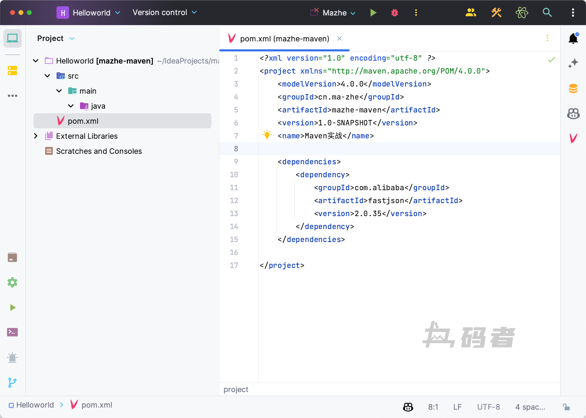](Maven 实战.assets/image-20241025174639494.png)

我们展开`External Libraries`目录，就可以现在项目中引入的所有外部的依赖包。

[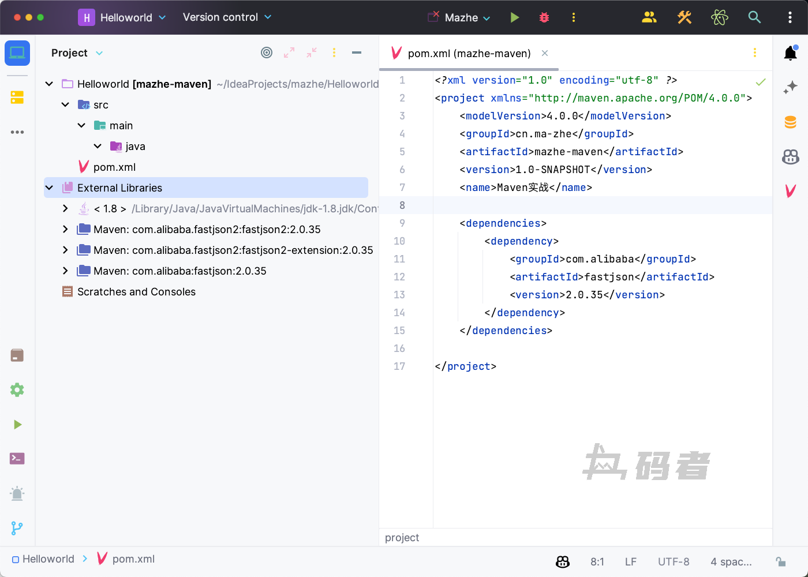](Maven 实战.assets/image-20241025174639495.png)

我们看上图所示，项目引入了3个依赖包，但我们依赖的配置只配置了一个依赖，这就是Maven传递性依赖的作用，如果没有传递性依赖，则上面只有显示一个依赖包，并且需要我们手动的将其它的依赖包配置到项目中，才可以使用。

* * *

除了通过上面的方式查看项目的依赖外，IDEA中还提供了以下的方式查看依赖，并且这种方式更直观。

首先，我们选中项目中的pom.xml。然后右键选择`Maven`然后选择`Show Diagram ...`

[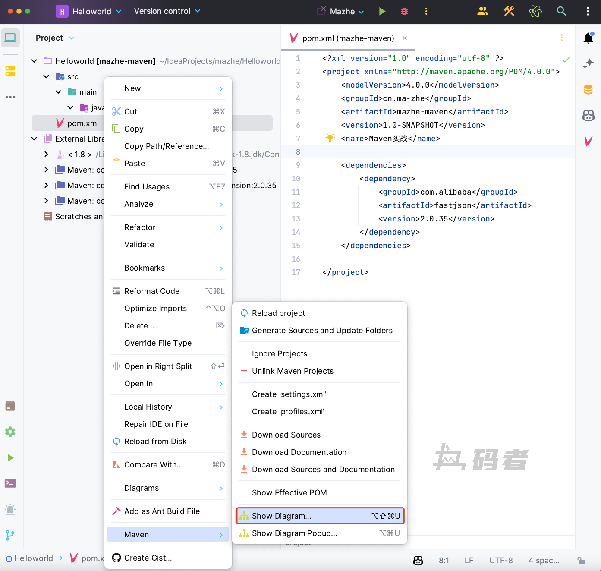](Maven 实战.assets/image-20241025174639496.png)

当我们点击后就会看到下图所示：

[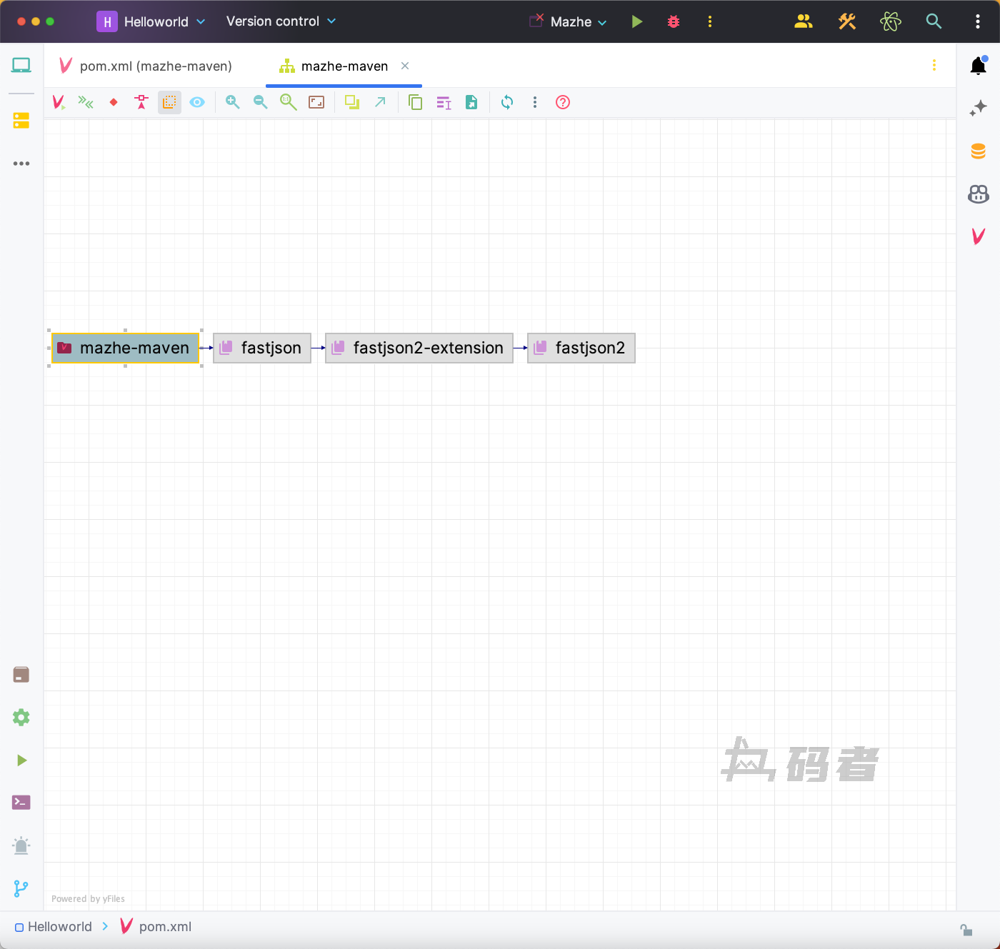](Maven 实战.assets/image-20241025174639497.png)

它显示了我们项目所有的依赖包，并且会按照我们传递性依赖的顺序显示。按照上图显示，我们知道，虽然，我们只引入了`fastjson`依赖，但是因为它依赖了`fastjson-extension`。所以Maven会继续引入这个依赖包。又因为`fastjson-extension`依赖了`fastjson2`，所以Maven又会引入这个依赖。这也就是传递性依赖引入依赖包的顺序。

* * *

除此之外，Maven也提供了相应的命令来查看我们项目中的依赖。具体命令如下：

```bash
mvn dependency:list
```

使用上述命令可以列出我们项目所有的依赖包。

```bash
mvn dependency:tree
```

此命令和上面的命令一样，也可以列出我们项目所有的依赖包，不同之处就是这个命令可以按照树的方式展示，方便我们查看依赖关系。而上面的命令是同一级显示的。

```bash
mvn dependency:analyze
```

使用此命令Maven可以分析当前项目的依赖。

* * *

由于后续的内容中有专门的章节详细介绍上面的命令，所以这里就不做过多的介绍了。上面的内容就是Maven中传递性依赖的相关内容，它也是Maven可以非常方便我们管理依赖包的因素之一。


# 六、Maven 的依赖范围

今天我们分享一下Maven中的依赖范围。因为在之前的`Maven实战-第四篇（Maven的依赖配置）`文章中已经对一部分内容进行了详细的介绍，所以本篇中涉及到上述的内容将不在过多的介绍了。


1、一般依赖范围
--------

在Maven中依赖范围的目的控就是控制项目中classpath的关系。在Maven中主要有三种classpath。分别是**编译的classpath、测试的classpath和运行的classpath**。下面我们看一下不同依赖范围对上述三种classpath的影响。


### 1、compile

编译依赖范围，也是Maven默认的依赖范围。使用此依赖范围时表示，此组件对编译、测试和运行都有效。所以此依赖范围，对于上面的三个classpath都是有效的。


### 2、test

测试依赖范围。使用此依赖范围表示，此组件只对测试的classpath有效。对编译的和运行时无法使用此依赖。比较典型的组件为：Junit组件，具体配置如下：

```xml
<dependency>
    <groupId>junit</groupId>
    <artifactId>junit</artifactId>
    <version>4.11</version>
    <scope>test</scope>
</dependency>
```

因为`Maven实战-第四篇（Maven的依赖配置）`文章已经详细介绍过了，所以这里就不在进行演示了。


### 3、provided

使用此依赖范围。组件将对编译和测试有效，而对运行时无效。比较典型的组件为：servlet-api。此组件我们编译和测试的时需要依赖，但在运行时，由于应用服务器已经提供了此组件的支持，所以不需要我们在项目中添加此依赖了。同样的因为之前文章中已介绍过了，所以这里就不在过多介绍了。


### 4、runtime

运行时依赖范围。也就是只对运行时才有效，但对测试也是有效的。典型的组件为数据库的驱动。只有项目运行时才需要。对其它的classpath是无效的。


### 5、system

系统依赖范围。system依赖范围和provided的依赖范围一致。唯一不同的之处就是在使用system依赖范围时，我们需要指定systemPath参数。因为system依赖范围并不是通过Maven仓库解析的，而是通过systemPath参数指定的路径解析的。具体的配置如下：

```xml
<dependency>
    <groupId>junit</groupId>
    <artifactId>junit</artifactId>
    <version>4.12</version>
    <scope>system</scope>
    <systemPath>
        /Users/xx/.m2/repository/junit/junit/4.13.2/junit-4.12.jar
    </systemPath>
</dependency>
```

比较典型的场景为加密项目中可能会使用。它会读取我们指定目录中的依赖包加载到项目中。例如从外部设备中读取。


### 6、import

导入依赖范围。此依赖范围和其它的依赖不同，它并不会影响编译、测试和运行的classpath。而是通过此依赖范围，将其它项目的依赖引入本项目中。所以在使用此依赖时，需要引入的依赖类型必须为pom类型。


### 7、依赖范围对比

下面是依赖范围和classpath之间的关系。

| 依赖范围（scope） | 编译（classpath） | 测试（classpath） | 运行（classpath） | 例子        |
| ----------------- | ----------------- | ----------------- | ----------------- | ----------- |
| compile           | Y                 | Y                 | Y                 | spring-core |
| test              | \-                | Y                 | Y                 | junit       |
| provided          | Y                 | Y                 | \-                | servlet-api |
| runtime           | \-                | Y                 | Y                 | JDBC驱动    |
| system            | Y                 | Y                 | \-                | 本地的组件  |

横轴表示classpath，纵轴则表示Maven中的依赖范围。表示`Y`则表示对该classpath有效果，反之`-`则表示无效。


2、传递性依赖范围
---------

上面介绍的是一般的依赖范围。但我们知道也就是上篇中介绍的，Maven中有传递性依赖，那么这个依赖会不会和一般的依赖范围有些不同呢。答案是肯定的。在Maven中依赖范围不仅可以控制依赖与classpath的关系，还对传递性依赖会产生影响。下面内容是依赖范围影响传递性依赖的关系：

|          | compile  | test | provided | runtime  |
| -------- | -------- | ---- | -------- | -------- |
| compile  | compile  | \-   | \-       | runtime  |
| test     | test     | \-   | \-       | test     |
| provided | provided | \-   | provided | provided |
| runtime  | runtime  | \-   | \-       | runtime  |

在Maven中如果项目A依赖于B,项目B又依赖于项目C，我们会说A对于B是第一直接依赖，B对于C是第二直接依赖，而A对于C则是传递性依赖。也就早篇中介绍的内容。所以在上面的表格中最左边的一列表示第一直接依赖范围，最上面一行表示的是第二直接依赖范围，中间的交叉单元格则表示传递性依赖的范围。

* * *

下面我们通过一个简单的例子来解释一下上面说的内容。假如我们有一个项目叫做account-email。该项目有一个com.icegreen:greenmail:1.3.1b的直接依赖，我们说这是第一直接依赖，并且假如该依赖范围是test。而greenmail又有一个javax.mail:mail:1.4的直接依赖，我们说这是第二直接依赖，其依赖范围是compile。显然javax.mail:mail:1.4是account-email的传递性依赖。按照上图所示，当第一直接依赖范围为test，第二直接依赖范围是compile的时候，传递性依赖的范围是test，因此javax.mail:mail:1.4是account-email的一个范围是test的传递性依赖。

* * *

我们通过下面的例子来验证一下上面说的内容。为了能够直观的观察第一依赖与第二依赖以及传递性依赖的关系。我们创建三个项目然后依次依赖，来验证上面说的内容。

1、mazhe-maven-user

*   pomx.ml

```xml
<?xml version="1.0" encoding="UTF-8"?>
<project xmlns="http://maven.apache.org/POM/4.0.0"
         xmlns:xsi="http://www.w3.org/2001/XMLSchema-instance"
         xsi:schemaLocation="http://maven.apache.org/POM/4.0.0 http://maven.apache.org/xsd/maven-4.0.0.xsd">
    <parent>
        <artifactId>midai-mazhe-maven</artifactId>
        <groupId>cn.ma-zhe</groupId>
        <version>1.0-SNAPSHOT</version>
    </parent>
    <modelVersion>4.0.0</modelVersion>

    <artifactId>mazhe-maven-user</artifactId>
</project>
```

*   MazheMavenUser

```java
public class MazheMavenUser {
    public static void main(String[] args) {
        System.out.println("Hello World Mazhe Maven User!");
    }
}
```

2、mazhe-maven-order

*   pom.xml

```xml
<?xml version="1.0" encoding="UTF-8"?>
<project xmlns="http://maven.apache.org/POM/4.0.0"
         xmlns:xsi="http://www.w3.org/2001/XMLSchema-instance"
         xsi:schemaLocation="http://maven.apache.org/POM/4.0.0 http://maven.apache.org/xsd/maven-4.0.0.xsd">
    <parent>
        <artifactId>midai-mazhe-maven</artifactId>
        <groupId>cn.ma-zhe</groupId>
        <version>1.0-SNAPSHOT</version>
    </parent>
    <modelVersion>4.0.0</modelVersion>

    <artifactId>mazhe-maven-order</artifactId>

    <dependencies>
        <dependency>
            <groupId>cn.ma-zhe</groupId>
            <artifactId>mazhe-maven-user</artifactId>
            <version>1.0-SNAPSHOT</version>
        </dependency>
    </dependencies>
</project>
```

*   MazheMavenOrder

```java
public class MazheMavenOrder {
    public static void main(String[] args) {
        System.out.println("Hello World Mazhe Maven Order!");
    }
}
```

3、mazhe-maven-mall

*   pom.xml

```xml
<?xml version="1.0" encoding="UTF-8"?>
<project xmlns="http://maven.apache.org/POM/4.0.0"
         xmlns:xsi="http://www.w3.org/2001/XMLSchema-instance"
         xsi:schemaLocation="http://maven.apache.org/POM/4.0.0 http://maven.apache.org/xsd/maven-4.0.0.xsd">
    <parent>
        <artifactId>midai-mazhe-maven</artifactId>
        <groupId>cn.ma-zhe</groupId>
        <version>1.0-SNAPSHOT</version>
    </parent>
    <modelVersion>4.0.0</modelVersion>

    <artifactId>mazhe-maven-mall</artifactId>

    <dependencies>
        <dependency>
            <groupId>cn.ma-zhe</groupId>
            <artifactId>mazhe-maven-order</artifactId>
            <version>1.0-SNAPSHOT</version>
        </dependency>
    </dependencies>
</project>
```

*   MazheMavenMall

```java
public class MazheMavenMall {
    public static void main(String[] args) {
        System.out.println("Hello World Mazhe Maven Mall!");
    }
}
```

我们创建了三个项目`mazhe-maven-user、mazhe-maven-order、mazhe-maven-mall`。其中项目`mazhe-maven-mall`依赖于项目`mazhe-maven-order`，项目`mazhe-maven-order`又依赖于项目`mazhe-maven-user`，所以项目`mazhe-maven-user`就是项目`mazhe-maven-mall`的传递性依赖。下面我们按照上面的依赖关系来验证一下，当第一依赖是`compile`，第二依赖也是`compile`时，传递性依赖是不是也是`compile`的依赖范围。因为Maven中`compile`依赖范围为默认的依赖范围，所以我们不需要修改任何`pom.xml`直接在项目中验证一下。因为我们项目中引入了`mazhe-maven-order`依赖。所以因为传递性依赖的关系，Maven也会引入`mazhe-maven-user`依赖。所以我们直接在mazhe-maven-user中调用这两个项目的代码看看是否能成功的引用。


### 1、compile & compile

*   mazhe-maven-user

```java
public class MazheMavenMall {
    public static void main(String[] args) {
        System.out.println("Hello World Mazhe Maven Mall!");
        MazheMavenOrder.main(args);
        MazheMavenUser.main(args);
    }
}
```

- 输出


```java
Hello World Mazhe Maven Mall!
Hello World Mazhe Maven Order!
Hello World Mazhe Maven User!
```

我们看上面输出的日志，成功的验证了当第一依赖为`compile`,并且第二依赖也是`compile`的时候，传递性依赖的范围也是`compile`。

|         | compile |
| ------- | ------- |
| compile | compile |

[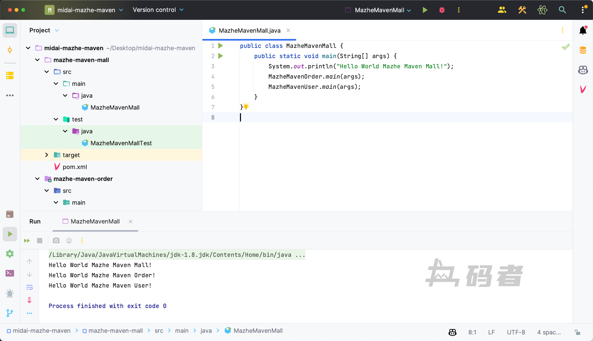](Maven 实战.assets/image-20241025174639498.png)


### 2、compile & test

下面我们验证一下，当然第一依赖范围为`compile`，第二依赖范围为`test`的时候，传递性依赖的范围。因为是要修改的第二依赖范围，所以我们需要将mazhe-maven-order项目中的依赖范围修改为`test`。

*   pom.xml

```java
<?xml version="1.0" encoding="UTF-8"?>
<project xmlns="http://maven.apache.org/POM/4.0.0"
         xmlns:xsi="http://www.w3.org/2001/XMLSchema-instance"
         xsi:schemaLocation="http://maven.apache.org/POM/4.0.0 http://maven.apache.org/xsd/maven-4.0.0.xsd">
    <parent>
        <artifactId>midai-mazhe-maven</artifactId>
        <groupId>cn.ma-zhe</groupId>
        <version>1.0-SNAPSHOT</version>
    </parent>
    <modelVersion>4.0.0</modelVersion>

    <artifactId>mazhe-maven-order</artifactId>

    <dependencies>
        <dependency>
            <groupId>cn.ma-zhe</groupId>
            <artifactId>mazhe-maven-user</artifactId>
            <version>1.0-SNAPSHOT</version>
            <scope>test</scope>
        </dependency>
    </dependencies>
</project>
```

我们再次看一下mazhe-maven-mall项目中，是否有问题。

[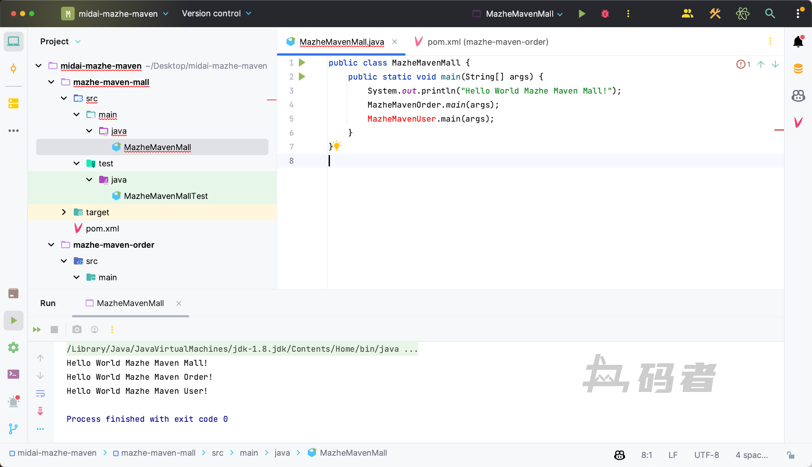](Maven 实战.assets/image-20241025174639499.png)

如上图所示，我们看到MazheMavenMall类中的调用MazheMavenUser代码报错，这是因为没有找到这个类的依赖所至。下面我们在mazhe-maven-mall项目中创建一个测试类，来验证一下测试代码是否能够成功的引用。

*   MazheMavenMallTest

```java
public class MazheMavenMallTest {
    public static void main(String[] args) {
        System.out.println("Hello World Mazhe Maven Mall Test!");
        MazheMavenOrder.main(args);
        MazheMavenUser.main(args);
    }
}
```

[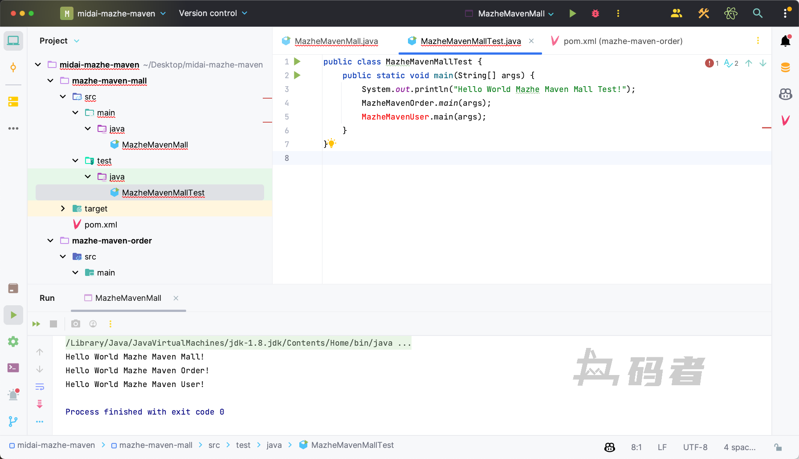](Maven 实战.assets/image-20241025174639500.png)

我们看测试的代码也显示出无法引用MazheMavenUser类，这也间接证明了，当第一依赖范围为`compile`，第二依赖范围为`test`时候，Maven不会进行传递性依赖。

|         | compile | test |
| ------- | ------- | ---- |
| compile | compile | \-   |


### 3、compile &。provided

下面我们同样的验证一下，当然第一依赖范围为`compile`，第二依赖范围为`provided`的时候，传递性依赖的范围。我们同样的将mazhe-maven-order项目中的依赖范围修改为`provided`。

*   pom.xml

```xml
<?xml version="1.0" encoding="UTF-8"?>
<project xmlns="http://maven.apache.org/POM/4.0.0"
         xmlns:xsi="http://www.w3.org/2001/XMLSchema-instance"
         xsi:schemaLocation="http://maven.apache.org/POM/4.0.0 http://maven.apache.org/xsd/maven-4.0.0.xsd">
    <parent>
        <artifactId>midai-mazhe-maven</artifactId>
        <groupId>cn.ma-zhe</groupId>
        <version>1.0-SNAPSHOT</version>
    </parent>
    <modelVersion>4.0.0</modelVersion>

    <artifactId>mazhe-maven-order</artifactId>

    <dependencies>
        <dependency>
            <groupId>cn.ma-zhe</groupId>
            <artifactId>mazhe-maven-user</artifactId>
            <version>1.0-SNAPSHOT</version>
            <scope>provided</scope>
        </dependency>
    </dependencies>
</project>
```

我们同样的在看一下MazheMavenMall类的代码是否能成功的引入MazheMavenUser类。

[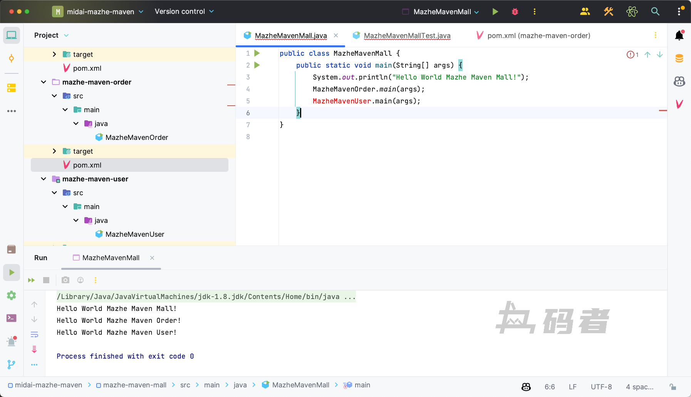](Maven 实战.assets/image-20241025174639501.png)

我们在看一下MazheMavenMallTest类的代码是否能引入。

[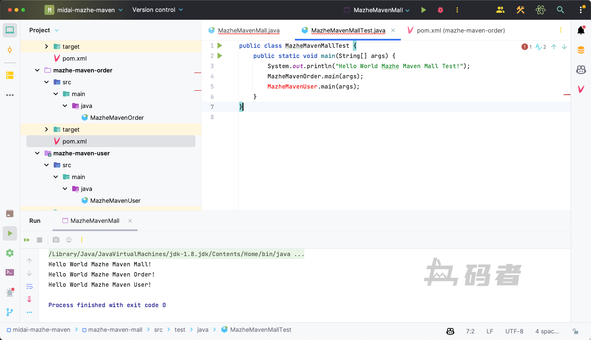](Maven 实战.assets/image-20241025174639502.png)

我们看上图所示，不管是主代码中还是测试代码中，都无法引入MazheMavenUser类，这也就说明了，当第一依赖范围为`compile`，第二依赖范围为`provided`的时候，Maven不会进行传递性依赖。

|         | compile | test | provided |
| ------- | ------- | ---- | -------- |
| compile | compile | \-   | \-       |


### 4、compile & runtime

下面我们继续验证，当然第一依赖范围为`compile`，第二依赖范围为`runtime`的时候，传递性依赖的范围。我们继续的将mazhe-maven-order项目中的依赖范围修改为`runtime`。

*   pom.xml

```xml
<?xml version="1.0" encoding="UTF-8"?>
<project xmlns="http://maven.apache.org/POM/4.0.0"
         xmlns:xsi="http://www.w3.org/2001/XMLSchema-instance"
         xsi:schemaLocation="http://maven.apache.org/POM/4.0.0 http://maven.apache.org/xsd/maven-4.0.0.xsd">
    <parent>
        <artifactId>midai-mazhe-maven</artifactId>
        <groupId>cn.ma-zhe</groupId>
        <version>1.0-SNAPSHOT</version>
    </parent>
    <modelVersion>4.0.0</modelVersion>

    <artifactId>mazhe-maven-order</artifactId>

    <dependencies>
        <dependency>
            <groupId>cn.ma-zhe</groupId>
            <artifactId>mazhe-maven-user</artifactId>
            <version>1.0-SNAPSHOT</version>
            <scope>runtime</scope>
        </dependency>
    </dependencies>
</project>
```

我们继续看MazheMavenMall类中的代码。

[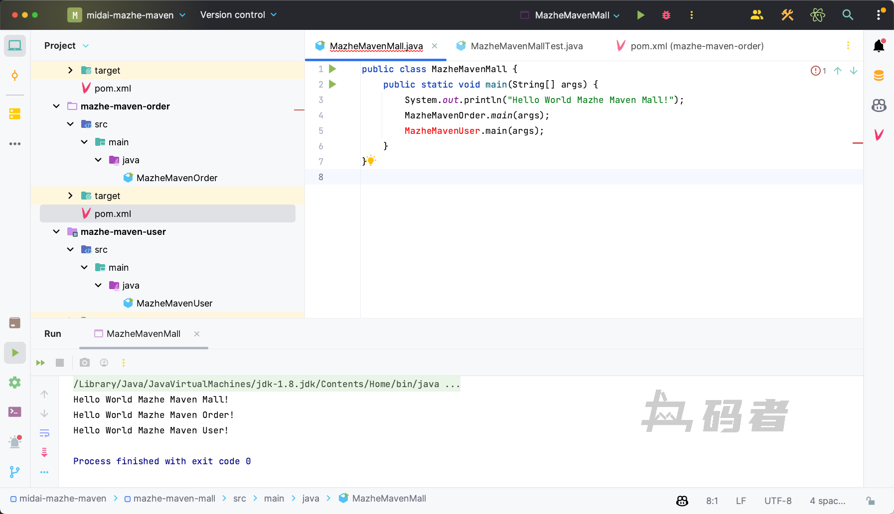](Maven 实战.assets/image-20241025174639503.png)

我们看上图所示，因为我们第二依赖范围是runtime，所以直接调用MazheMavenUser报错了。下面我们验证一下，如果项目运行时，会不会可以直接调用MazheMavenUser类。为了验证项目运行，我们需要通过反射的主式，来调用MazheMavenUser类，下面为具体的代码：

*   MazheMavenMall

```java
import java.lang.reflect.Method;

public class MazheMavenMall {
    public static void main(String[] args) throws Exception {
        System.out.println("Hello World Mazhe Maven Mall!");
        MazheMavenOrder.main(args);
        Class<?> clazz = Class.forName("MazheMavenUser");
        Method method = clazz.getMethod("main", String[].class);
        method.invoke(null, (Object) args);
    }
}
```

*   日志

```
Hello World Mazhe Maven Mall!
Hello World Mazhe Maven Order!
Hello World Mazhe Maven User!
```

我们看通过Java反射的方式，我们成功的调用了MazheMavenUser的方法，这也就说明了当第一依赖范围为compile，第二依赖范围为runtime的时候。Maven的传递性依赖范围为runtime。下面我们验证一下测试类的代码。

*   MazheMavenMallTest

```java
public class MazheMavenMallTest {
    public static void main(String[] args) {
        System.out.println("Hello World Mazhe Maven Mall Test!");
        MazheMavenOrder.main(args);
        MazheMavenUser.main(args);
    }
}
```

[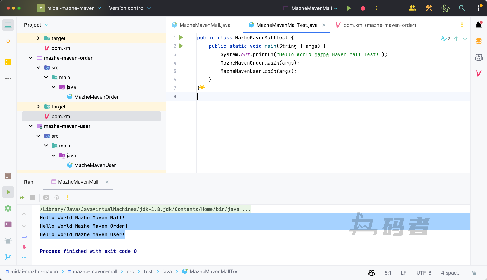](Maven 实战.assets/image-20241025174639504.png)

我们看上图所示，测试类中的代码可以直接调用MazheMavenUser类的方法。这是因为runtime依赖范围是对测试和运行同样有效的，所以不会报错，我们也修改一下测试类的代码，来验证一下，测试类中运行是否有问题。

*   MazheMavenMallTest

```java
import java.lang.reflect.Method;

public class MazheMavenMallTest {
    public static void main(String[] args) throws Exception {
        System.out.println("Hello World Mazhe Maven Mall Test!");
        MazheMavenOrder.main(args);
        MazheMavenUser.main(args);
        Class<?> clazz = Class.forName("MazheMavenUser");
        Method method = clazz.getMethod("main", String[].class);
        method.invoke(null, (Object) args);
    }
}
```

*   日志

```
Hello World Mazhe Maven Mall Test!
Hello World Mazhe Maven Order!
Hello World Mazhe Maven User!
Hello World Mazhe Maven User!
```


### 5、总结

这就证明了当第一依赖范围为compile，第二依赖范围为runtime的时候。Maven的传递性依赖范围为runtime。

|         | compile | test | provided | runtime |
| ------- | ------- | ---- | -------- | ------- |
| compile | compile | -    | -        | runtime |

其它依赖范围的测试，由于和上面内容类似，我们就不依依验证了，我们只要参考上面的表格就可以知道传递性依赖的范围了。所以通过上面的表格我们可以发现这样的规律：

*   当第二直接依赖的范围是compile的时候，传递性依赖的范围与第一直接依赖的范围一致。
*   当第二直接依赖的范围是test的时候，Maven不会进行传递性依赖。
*   当第二直接依赖的范围是provided的时候，只传递第一直接依赖范围也为provided的依赖，且传递性依赖的范围同样为provided。
*   当第二直接依赖的范围是runtime的时候，传递性依赖的范围与第一直接依赖的范围一致，但compile例外，此时传递性依赖的范围为runtime。

  

# 七、Maven 中的依赖冲突

1、什么是 Maven 中的依赖冲突
----------------

我们在第五篇`Maven实战-第五篇（Maven的传递性依赖）`中介绍了Maven中传递性依赖的内容。并且通过上一篇的内容我们也了解到了传递性依赖为我们使用Maven所带来的好处。但是同样的传递性依赖也为我们带来了使用的弊端，也就是Maven中的依赖冲突。那什么是依赖冲突呢？假如我们有一个项目A。它依赖于项目X。还有一个项目B也依赖于项目X。但是呢这两个项目所依赖X的版本不一致。但是Maven中又支持传递性依赖，所以按照正常的逻辑，这两个X的版本的项目都会引入到项目中，但这样就会造成依赖冲突。因为项目中有两个一样的依赖只是版本不同，所以Maven就不知道引入哪个依赖了，这就是Maven中的依赖冲突。


2、怎么解决 Maven   的依赖冲突
----------------

所以在Maven中为了解决上面说的依赖冲突引入了一个概念就是依赖调节，其实也就是解决依赖冲突的一个默认规则。因为我们知道，依赖冲突的本质是传递性依赖的版本不一致导致的。所以我们只要制定一个规则，来让Maven可以选择一个传递性依赖的版本就可以了。Maven就是通过这样的方式解决依赖冲突的。下面我们详细介绍一下这个规则到底是什么。

### 1、规则一

这个规则就是引入依赖的路径近者优先。举例来说就是如果项目的依赖路径是这样的：A->B-C-X（1.0）。然后还有一个项目依赖路径为A->D->X（2.0）。按照上面引入依赖的路径来判断，我们知道后者的路径较短。所以Maven在执行传递性依赖时会按照上述的规则引入X（2.0）的版本依赖。

* * *

下面我们通过一个例子来验证一上上面所说的规则。我们以上个项目为例，创建4个项目它们分别是：`mazhe-maven-mall、mazhe-maven-order、mazhe-maven-user、mazhe-maven-payment`。其中它们的依赖关系是`mazhe-maven-mall`依赖于`mazhe-maven-order`和`mazhe-maven-payment`，而`mazhe-maven-order`又依赖于`mazhe-maven-user`。这样我们就模拟出来依赖路径不一样的，来验证规则一。具体配置如下:

1、mazhe-maven-mall

*   pom.xml

```xml
<?xml version="1.0" encoding="UTF-8"?>
<project xmlns="http://maven.apache.org/POM/4.0.0"
         xmlns:xsi="http://www.w3.org/2001/XMLSchema-instance"
         xsi:schemaLocation="http://maven.apache.org/POM/4.0.0 http://maven.apache.org/xsd/maven-4.0.0.xsd">
    <parent>
        <artifactId>midai-mazhe-maven</artifactId>
        <groupId>cn.ma-zhe</groupId>
        <version>1.0-SNAPSHOT</version>
    </parent>
    <modelVersion>4.0.0</modelVersion>

    <artifactId>mazhe-maven-mall</artifactId>

    <dependencies>
        <dependency>
            <groupId>cn.ma-zhe</groupId>
            <artifactId>mazhe-maven-order</artifactId>
            <version>1.0-SNAPSHOT</version>
        </dependency>
        <dependency>
            <groupId>cn.ma-zhe</groupId>
            <artifactId>mazhe-maven-payment</artifactId>
            <version>1.0-SNAPSHOT</version>
        </dependency>
    </dependencies>

</project>
```

* * *

2、mazhe-maven-order

*   pom.xml

```xml
<?xml version="1.0" encoding="UTF-8"?>
<project xmlns="http://maven.apache.org/POM/4.0.0"
         xmlns:xsi="http://www.w3.org/2001/XMLSchema-instance"
         xsi:schemaLocation="http://maven.apache.org/POM/4.0.0 http://maven.apache.org/xsd/maven-4.0.0.xsd">
    <parent>
        <artifactId>midai-mazhe-maven</artifactId>
        <groupId>cn.ma-zhe</groupId>
        <version>1.0-SNAPSHOT</version>
    </parent>
    <modelVersion>4.0.0</modelVersion>

    <artifactId>mazhe-maven-order</artifactId>

    <dependencies>
        <dependency>
            <groupId>cn.ma-zhe</groupId>
            <artifactId>mazhe-maven-user</artifactId>
            <version>1.0-SNAPSHOT</version>
        </dependency>
    </dependencies>

</project>
```

* * *

3、mazhe-maven-payment

*   pom.xml

```xml
<?xml version="1.0" encoding="UTF-8"?>
<project xmlns="http://maven.apache.org/POM/4.0.0"
         xmlns:xsi="http://www.w3.org/2001/XMLSchema-instance"
         xsi:schemaLocation="http://maven.apache.org/POM/4.0.0 http://maven.apache.org/xsd/maven-4.0.0.xsd">
    <parent>
        <artifactId>midai-mazhe-maven</artifactId>
        <groupId>cn.ma-zhe</groupId>
        <version>1.0-SNAPSHOT</version>
    </parent>
    <modelVersion>4.0.0</modelVersion>

    <artifactId>mazhe-maven-payment</artifactId>
    <dependencies>
        <dependency>
            <groupId>com.alibaba</groupId>
            <artifactId>fastjson</artifactId>
            <version>2.0.32</version>
        </dependency>
    </dependencies>
</project>
```

* * *

4、mazhe-maven-user

*   pom.xml

```xml
<?xml version="1.0" encoding="UTF-8"?>
<project xmlns="http://maven.apache.org/POM/4.0.0"
         xmlns:xsi="http://www.w3.org/2001/XMLSchema-instance"
         xsi:schemaLocation="http://maven.apache.org/POM/4.0.0 http://maven.apache.org/xsd/maven-4.0.0.xsd">
    <parent>
        <artifactId>midai-mazhe-maven</artifactId>
        <groupId>cn.ma-zhe</groupId>
        <version>1.0-SNAPSHOT</version>
    </parent>
    <modelVersion>4.0.0</modelVersion>

    <artifactId>mazhe-maven-user</artifactId>

    <dependencies>
        <dependency>
            <groupId>com.alibaba</groupId>
            <artifactId>fastjson</artifactId>
            <version>2.0.35</version>
        </dependency>
    </dependencies>

</project>
```

* * *

通过上面的配置，我们分别在`mazhe-maven-payment`和`mazhe-maven-user`中引入了`fastjson`的依赖，并且为了模拟依赖冲突，我们将这两个项目所依赖的`fastjson`的版本设置成了不一样的版本，其中`mazhe-maven-payment`的版本为：`2.0.32`，而`mazhe-maven-user`的版本为：`2.0.35`。下面我们验证一下，当这样的依赖冲突后，我们`mazhe-maven-mall`项目依赖的版本到底是多少。我们还是通过`Show Deagram ...`的方式来查看`mazhe-maven-mall`项目的依赖情况。

[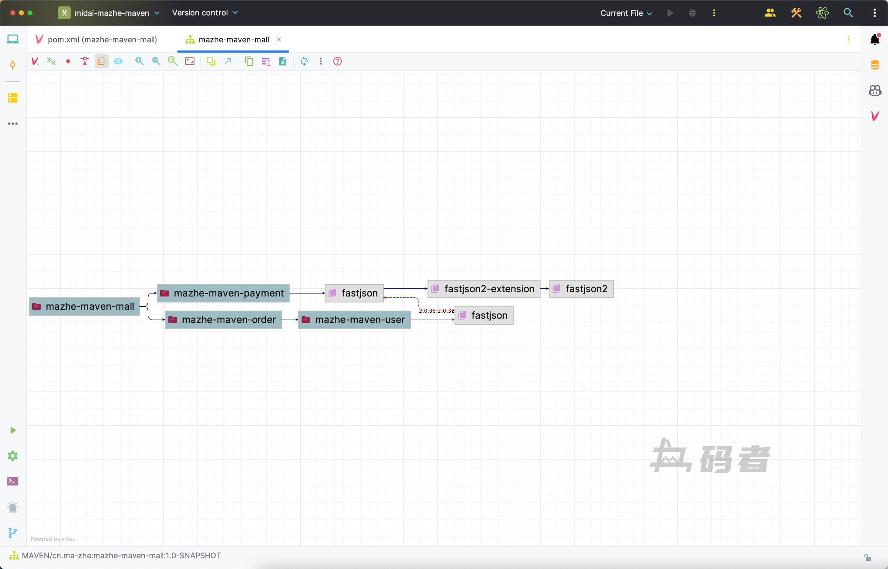](Maven 实战.assets/image-20241025174639505.png)

通过上图我们也发现IDEA中已经将这两个依赖冲突的版本显示出来了并且非常直观的标识出了`mazhe-maven-user`项目依赖的`fastjson`的依赖已经指向了`mazhe-maven-payment`的`fastjson`版本。所以此时`mazhe-maven-mall`项目通过传递性依赖所引入的`fastjson`版本就是`2.0.32`。如果我们将`mazhe-maven-payment`和`mazhe-maven-user`依赖的版本进行一下对换。在查看一下就会发现，`mazhe-maven-mall`项目所依赖的版本就会变成`2.0.35`了。

[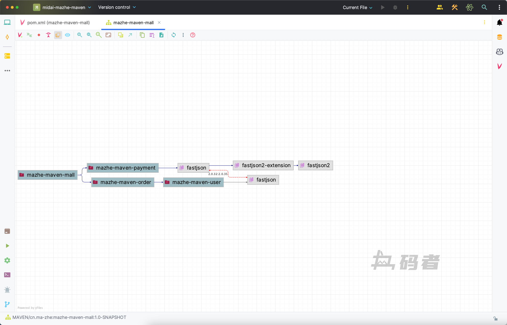](Maven 实战.assets/image-20241025174639506.png)

这就是Maven中解决依赖冲突的第一个规则，最短路径原则，因为项目`mazhe-maven-payment`依赖的`fastjson`的路径最短，所以传递性依赖以`mazhe-maven-payment`项目配置的版本为准。


### 2、规则二

当然这不能解决所有依赖冲突的问题，因为如果项目依赖路径相同时，上面的规则就不起作用了。所以为了解决这个问题。Maven又引入了第二条规则。当第一条规则不能解决依赖冲突时，第二条规则则会起作用。在Maven中规定，如果项目依赖的路径相同时，Maven以依赖声明的顺序决定依赖冲突。也就是说，如果项目依赖的路径相同，则谁先引入这个依赖，Maven就会默认引入这个项目的传递性依赖。

* * *

同样的我们还是通过例子的方式来验证一下上面说的内容。我们将上面的代码进行一下修改，直接在`mazhe-maven-order`项目中引入`fastjson`的依赖，并且它两个项目的版本配置的不一样的。

1、mazhe-maven-order

*   pom.xml

```xml
<?xml version="1.0" encoding="UTF-8"?>
<project xmlns="http://maven.apache.org/POM/4.0.0"
         xmlns:xsi="http://www.w3.org/2001/XMLSchema-instance"
         xsi:schemaLocation="http://maven.apache.org/POM/4.0.0 http://maven.apache.org/xsd/maven-4.0.0.xsd">
    <parent>
        <artifactId>midai-mazhe-maven</artifactId>
        <groupId>cn.ma-zhe</groupId>
        <version>1.0-SNAPSHOT</version>
    </parent>
    <modelVersion>4.0.0</modelVersion>

    <artifactId>mazhe-maven-order</artifactId>

    <dependencies>
        <dependency>
            <groupId>com.alibaba</groupId>
            <artifactId>fastjson</artifactId>
            <version>2.0.35</version>
        </dependency>
    </dependencies>

</project>
```

* * *

2、mazhe-maven-payment

*   pom.xml

```xml
<?xml version="1.0" encoding="UTF-8"?>
<project xmlns="http://maven.apache.org/POM/4.0.0"
         xmlns:xsi="http://www.w3.org/2001/XMLSchema-instance"
         xsi:schemaLocation="http://maven.apache.org/POM/4.0.0 http://maven.apache.org/xsd/maven-4.0.0.xsd">
    <parent>
        <artifactId>midai-mazhe-maven</artifactId>
        <groupId>cn.ma-zhe</groupId>
        <version>1.0-SNAPSHOT</version>
    </parent>
    <modelVersion>4.0.0</modelVersion>

    <artifactId>mazhe-maven-payment</artifactId>
    <dependencies>
        <dependency>
            <groupId>com.alibaba</groupId>
            <artifactId>fastjson</artifactId>
            <version>2.0.32</version>
        </dependency>
    </dependencies>
</project>
```

* * *

3、mazhe-maven-mall

*   pom.xml

```xml
<?xml version="1.0" encoding="UTF-8"?>
<project xmlns="http://maven.apache.org/POM/4.0.0"
         xmlns:xsi="http://www.w3.org/2001/XMLSchema-instance"
         xsi:schemaLocation="http://maven.apache.org/POM/4.0.0 http://maven.apache.org/xsd/maven-4.0.0.xsd">
    <parent>
        <artifactId>midai-mazhe-maven</artifactId>
        <groupId>cn.ma-zhe</groupId>
        <version>1.0-SNAPSHOT</version>
    </parent>
    <modelVersion>4.0.0</modelVersion>

    <artifactId>mazhe-maven-mall</artifactId>

    <dependencies>
        <dependency>
            <groupId>cn.ma-zhe</groupId>
            <artifactId>mazhe-maven-order</artifactId>
            <version>1.0-SNAPSHOT</version>
        </dependency>
        <dependency>
            <groupId>cn.ma-zhe</groupId>
            <artifactId>mazhe-maven-payment</artifactId>
            <version>1.0-SNAPSHOT</version>
        </dependency>
    </dependencies>

</project>
```

* * *

下面我们用同样的方式，看一下`mazhe-maven-mall`项目的依赖。

[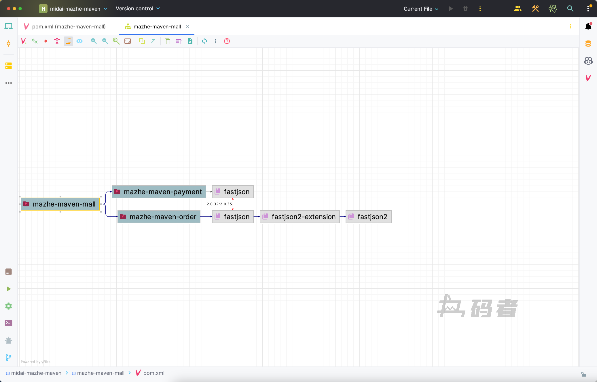](Maven 实战.assets/image-20241025174639507.png)

如图所示,Maven引入的传递性依赖`fastjson`的版本为：`2.0.35`。下面我们将`mazhe-maven-mall`项目中依赖的顺序调换一下。

*   pom.xml

```xml
<?xml version="1.0" encoding="UTF-8"?>
<project xmlns="http://maven.apache.org/POM/4.0.0"
         xmlns:xsi="http://www.w3.org/2001/XMLSchema-instance"
         xsi:schemaLocation="http://maven.apache.org/POM/4.0.0 http://maven.apache.org/xsd/maven-4.0.0.xsd">
    <parent>
        <artifactId>midai-mazhe-maven</artifactId>
        <groupId>cn.ma-zhe</groupId>
        <version>1.0-SNAPSHOT</version>
    </parent>
    <modelVersion>4.0.0</modelVersion>

    <artifactId>mazhe-maven-mall</artifactId>

    <dependencies>
        <dependency>
            <groupId>cn.ma-zhe</groupId>
            <artifactId>mazhe-maven-payment</artifactId>
            <version>1.0-SNAPSHOT</version>
        </dependency>
        <dependency>
            <groupId>cn.ma-zhe</groupId>
            <artifactId>mazhe-maven-order</artifactId>
            <version>1.0-SNAPSHOT</version>
        </dependency>
    </dependencies>

</project>
```

我们在查看一下`mazhe-maven-mall`项目的依赖情况。

[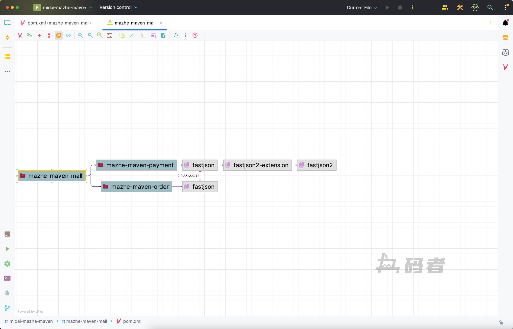](Maven 实战.assets/image-20241025174639508.png)

我们看这次`mazhe-maven-mall`项目的依赖版本就变成了：`2.0.32`了。这也就是Maven为了解决依赖冲突制定的第二个规则。按照配置依赖的顺序决定传递性依赖的版本。


3、Maven 中怎么排除依赖
--------------

就是因为传递性依赖的原因，在使用Maven时常常会引入很多额外的依赖包。Maven这么做的目的当然是为了方便了我们依赖管理。但这样也会导致一些其它的问题。例如如果传递性依赖引入了一些其它版本的依赖包。但因为有些原因，实际的的项目中却不能引入这个版本的依赖包，需要引入其它版本的依赖包。那该如何解决呢？在Maven中为了解决这样的问题，引入了排除传递性依赖的方式，也就是在Maven中可以使用`exclusions`标签来排除传递性依赖。当通过下面的方式配置后，Maven将不在进行传递性依赖了。具体的配置如下：

```xml
<dependencies>
    <dependency>
      <groupId></groupId>
      <artifactId></artifactId>
      <version></version>
      <exclusions>
        <exclusion>
            <groupId></groupId>
            <artifactId></artifactId>
        </exclusion>
      </exclusions>
    </dependency>
</dependencies>
```

我们还是以刚刚的例子为例，因为我们在项目中有引入了`mazhe-maven-payment`依赖，所以在路径相同时，Maven会直接引入这个项目的依赖包。我们通过下面的配置将`mazhe-maven-payment`项目依赖`fastjson`的包排除掉，然后在看一下依赖情况。具体配置如下：

1、mazhe-maven-mall

*   pom.xml

```xml
<?xml version="1.0" encoding="UTF-8"?>
<project xmlns="http://maven.apache.org/POM/4.0.0"
         xmlns:xsi="http://www.w3.org/2001/XMLSchema-instance"
         xsi:schemaLocation="http://maven.apache.org/POM/4.0.0 http://maven.apache.org/xsd/maven-4.0.0.xsd">
    <parent>
        <artifactId>midai-mazhe-maven</artifactId>
        <groupId>cn.ma-zhe</groupId>
        <version>1.0-SNAPSHOT</version>
    </parent>
    <modelVersion>4.0.0</modelVersion>

    <artifactId>mazhe-maven-mall</artifactId>

    <dependencies>
        <dependency>
            <groupId>cn.ma-zhe</groupId>
            <artifactId>mazhe-maven-payment</artifactId>
            <version>1.0-SNAPSHOT</version>
            <exclusions>
                <exclusion>
                    <groupId>com.alibaba</groupId>
                    <artifactId>fastjson</artifactId>
                </exclusion>
            </exclusions>
        </dependency>
        <dependency>
            <groupId>cn.ma-zhe</groupId>
            <artifactId>mazhe-maven-order</artifactId>
            <version>1.0-SNAPSHOT</version>
        </dependency>
    </dependencies>

</project>
```

我们在查看一下`mazhe-maven-mall`项目的依赖情况。

[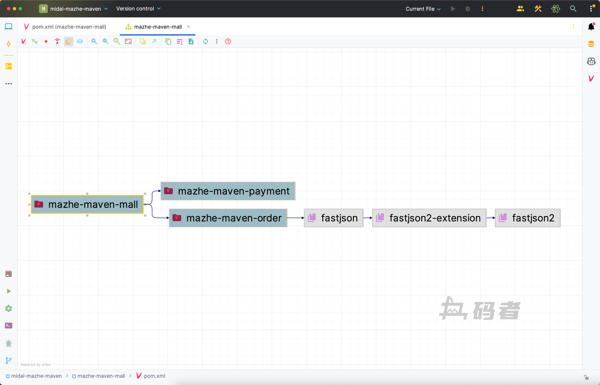](Maven 实战.assets/image-20241025174639509.png)

我们看上图所示，IDEA中已经不会提示依赖冲突了，因为当前传递性依赖中只有一个版本的`fastjson`依赖，所以也就不会提示依赖冲突了，这就是Maven中提供排除依赖的目的。

* * *

我们通过上面的配置发现Maven在排除依赖的时候，是不需要我们指定排除的版本的。有人知道这是为什么吗？这是因为我们传递性依赖所传递的版本已经确定了，因为它会在依赖包中指定我们依赖的版本，所以在排除时，就不需要我们指定版本了，因为一定只有一个版本。


# 八、Maven 中的依赖查询

在之前的内容中我们介绍了两种查看Maven中依赖关系的方法。一个是通过`External Libraries`查看。另外一个就是通过`Show Deagram ...`查看，但不管以上是哪种方法，本质都是依赖IDEA查看的。实际上Maven提供了项目中查看依赖的命令，可以帮助我们非常方便的查询项目的依赖的情况。下面我们分别介绍一下。


1、mvn dependency:list
---------------------

使用上述命令可以列出我们项目所有的依赖包。我们还是以上一篇的中的项目为例子，通过上面的命令查看一下项目的所有依赖包。

1、mazhe-maven-mall

*   pom.xml

```xml
<?xml version="1.0" encoding="UTF-8"?>
<project xmlns="http://maven.apache.org/POM/4.0.0"
         xmlns:xsi="http://www.w3.org/2001/XMLSchema-instance"
         xsi:schemaLocation="http://maven.apache.org/POM/4.0.0 http://maven.apache.org/xsd/maven-4.0.0.xsd">
    <parent>
        <artifactId>midai-mazhe-maven</artifactId>
        <groupId>cn.ma-zhe</groupId>
        <version>1.0-SNAPSHOT</version>
    </parent>
    <modelVersion>4.0.0</modelVersion>

    <artifactId>mazhe-maven-mall</artifactId>

    <dependencies>
        <dependency>
            <groupId>cn.ma-zhe</groupId>
            <artifactId>mazhe-maven-payment</artifactId>
            <version>1.0-SNAPSHOT</version>
            <exclusions>
                <exclusion>
                    <groupId>com.alibaba</groupId>
                    <artifactId>fastjson</artifactId>
                </exclusion>
            </exclusions>
        </dependency>
        <dependency>
            <groupId>cn.ma-zhe</groupId>
            <artifactId>mazhe-maven-order</artifactId>
            <version>1.0-SNAPSHOT</version>
        </dependency>
    </dependencies>

</project>
```

我们进入到这个项目的根目录中，然后执行下面命令：

```
mvn dependency:list
```

*   输出

```bash
[INFO] Scanning for projects...
[INFO] 
[INFO] ---------------------< cn.ma-zhe:mazhe-maven-mall >---------------------
[INFO] Building mazhe-maven-mall 1.0-SNAPSHOT
[INFO]   from pom.xml
[INFO] --------------------------------[ jar ]---------------------------------
[INFO] 
[INFO] --- dependency:3.6.0:list (default-cli) @ mazhe-maven-mall ---
[INFO] 
[INFO] The following files have been resolved:
[INFO]    cn.ma-zhe:mazhe-maven-payment:jar:1.0-SNAPSHOT:compile
[INFO]    cn.ma-zhe:mazhe-maven-order:jar:1.0-SNAPSHOT:compile
[INFO]    cn.ma-zhe:mazhe-maven-user:jar:1.0-SNAPSHOT:compile
[INFO]    com.alibaba:fastjson:jar:2.0.35:compile
[INFO]    com.alibaba.fastjson2:fastjson2-extension:jar:2.0.35:compile
[INFO]    com.alibaba.fastjson2:fastjson2:jar:2.0.35:compile
[INFO] 
[INFO] ------------------------------------------------------------------------
[INFO] BUILD SUCCESS
[INFO] ------------------------------------------------------------------------
[INFO] Total time:  2.516 s
[INFO] Finished at: 2023-07-24T22:40:06+08:00
[INFO] ------------------------------------------------------------------------
```

我们看上面的日志输出了我们这个项目中所有依赖包的信息，并且还包括传递性依赖的信息。这就是`mvn dependency:list`命令的作用。


2、mvn dependency:tree
---------------------

下面我们看第二个可以查看项目依赖的命令。此命令和上面的命令一样，也可以列出我们项目中所有的依赖包，不同之处就是这个命令可以按照树的方式展示，方便我们查看依赖关系。而`mvn dependency:list`命令则是同一级显示的。

*   输出

```bash
[INFO] Scanning for projects...
[INFO] 
[INFO] ---------------------< cn.ma-zhe:mazhe-maven-mall >---------------------
[INFO] Building mazhe-maven-mall 1.0-SNAPSHOT
[INFO]   from pom.xml
[INFO] --------------------------------[ jar ]---------------------------------
[INFO] 
[INFO] --- dependency:3.6.0:tree (default-cli) @ mazhe-maven-mall ---
[INFO] cn.ma-zhe:mazhe-maven-mall:jar:1.0-SNAPSHOT
[INFO] +- cn.ma-zhe:mazhe-maven-payment:jar:1.0-SNAPSHOT:compile
[INFO] \- cn.ma-zhe:mazhe-maven-order:jar:1.0-SNAPSHOT:compile
[INFO]    \- cn.ma-zhe:mazhe-maven-user:jar:1.0-SNAPSHOT:compile
[INFO]       \- com.alibaba:fastjson:jar:2.0.35:compile
[INFO]          \- com.alibaba.fastjson2:fastjson2-extension:jar:2.0.35:compile
[INFO]             \- com.alibaba.fastjson2:fastjson2:jar:2.0.35:compile
[INFO] ------------------------------------------------------------------------
[INFO] BUILD SUCCESS
[INFO] ------------------------------------------------------------------------
[INFO] Total time:  2.375 s
[INFO] Finished at: 2023-07-24T22:47:15+08:00
[INFO] ------------------------------------------------------------------------
```

我们看上面的日志，依然输出了我们项目中所有的依赖信息，并且它是按照树形方式展示的，这样可以让我们非常方便的查看出传递性依赖的关系。通过上面日志我们知道，因为项目依赖了`mazhe-maven-order`，又因为该项目又依赖了`mazhe-maven-user`。所以Maven才会将项目`mazhe-maven-mall`依赖的`fastjson`引入到项目中。


3、mvn dependency:analyze
------------------------

下面我们介绍一下非常重要的命令，使用此命令Maven可以分析当前项目的依赖，我们可以通过分析的结果来判断出来我们项目引入了哪些依赖，并且知道哪些依赖我们并没有使用。我们继续在项目的根目录中执行上面的命令查看一下日志输出

*   日志

```bash
[INFO] Scanning for projects...
[INFO] 
[INFO] ---------------------< cn.ma-zhe:mazhe-maven-mall >---------------------
[INFO] Building mazhe-maven-mall 1.0-SNAPSHOT
[INFO]   from pom.xml
[INFO] --------------------------------[ jar ]---------------------------------
[INFO] 
[INFO] >>> dependency:3.6.0:analyze (default-cli) > test-compile @ mazhe-maven-mall >>>
[INFO] 
[INFO] --- resources:3.3.1:resources (default-resources) @ mazhe-maven-mall ---
[INFO] skip non existing resourceDirectory /Users/md/Documents/midai-mazhe-maven/mazhe-maven-mall/src/main/resources
[INFO] 
[INFO] --- compiler:3.11.0:compile (default-compile) @ mazhe-maven-mall ---
[INFO] Nothing to compile - all classes are up to date
[INFO] 
[INFO] --- resources:3.3.1:testResources (default-testResources) @ mazhe-maven-mall ---
[INFO] skip non existing resourceDirectory /Users/md/Documents/midai-mazhe-maven/mazhe-maven-mall/src/test/resources
[INFO] 
[INFO] --- compiler:3.11.0:testCompile (default-testCompile) @ mazhe-maven-mall ---
[INFO] No sources to compile
[INFO] 
[INFO] <<< dependency:3.6.0:analyze (default-cli) < test-compile @ mazhe-maven-mall <<<
[INFO] 
[INFO] 
[INFO] --- dependency:3.6.0:analyze (default-cli) @ mazhe-maven-mall ---
[WARNING] Unused declared dependencies found:
[WARNING]    cn.ma-zhe:mazhe-maven-payment:jar:1.0-SNAPSHOT:compile
[WARNING]    cn.ma-zhe:mazhe-maven-order:jar:1.0-SNAPSHOT:compile
[INFO] ------------------------------------------------------------------------
[INFO] BUILD SUCCESS
[INFO] ------------------------------------------------------------------------
[INFO] Total time:  2.634 s
[INFO] Finished at: 2023-07-24T22:58:45+08:00
[INFO] ------------------------------------------------------------------------
```

我们看上面的日志，发现有警告的信息，为什么会出现警告信息呢，这是因为我们虽然引入了上述的依赖，但是我们并没有在项目中使用。下面我们在项目中调用一下`MazheMavenOrder`类。

*   MazheMavenOrder

```java
public class MazheMavenOrder {
    public static void main(String[] args) {
        System.out.println("Hello World Mazhe Maven Order!");
    }
}
```

*   MazheMavenMall

```java
public class MazheMavenMall {
    public static void main(String[] args) {
        System.out.println("Hello World Mazhe Maven Mall!");
        MazheMavenOrder.main(args);
    }
}
```

然后我们在执行一下`mvn dependency:analyze`命令，在观察一下日志输出。

*   日志

```bash
[WARNING] Unused declared dependencies found:
[WARNING]    cn.ma-zhe:mazhe-maven-payment:jar:1.0-SNAPSHOT:compile
```

我们看日志输出，这次就只会显示`mazhe-maven-payment`项目未使用了，因为`mazhe-maven-order`项目已经在项目中引用了，Maven就不会提示这个错误警告了。

 

# 九、Maven 中的仓库

1、什么是 Maven 的仓库
-------------

我们是否想过一个问题，为什么我们通过Maven配置相应的依赖就可以自动下载相应的依赖包呢？按照我们计算机的思维角度考虑。那么一定是有一个服务或者一个位置提供了这个依赖包的下载。否者Maven不可能会自动的下载，因为没有资源。所以在Maven中提供这个服务或者位置的地方就可以理解为仓库。也就是存储依赖包的地方。在Maven中仓库是有以下几个分类的，下面我们详细介绍一下。


2、Maven 仓库的分类
------------

在Maven中为了更方便快捷的下载相关的组件也就是依赖包，Maven对仓库进行了简单的划分。简单来说可以分为**本地仓库和远程仓库**。

### 1、本地仓库

这个很容里理解，也就是存储到本地机器地方的仓库，也就是本地仓库。当Maven引入依赖包时，会首先在本地仓库查询是否有符合的依赖包。这里的符合说的是依赖配置是否正确。如果本地仓库存在，则直接可以使用。如果本地仓库没有，则Maven会检查是否有更新的依赖包。然后去远程仓库进行查找。（远程仓库也就是在服务器上的仓库）如果在远程仓库中查找到，则会下载到本地仓库，然后Maven按照上述的方式给项目使用。如果在远程仓库中没有查询到相应的依赖包。则Maven就会抛出异常。下面是我们随便定义了一个组件。

```xml
<dependency>
    <groupId>cn.ma-zhe</groupId>
    <artifactId>mazhe-maven</artifactId>
    <version>1.0.0</version>
</dependency>
```

当我们在项目中执行执行`mvn clean package`命令后，Maven就会抛出下面异常：

```bash
[ERROR] Failed to execute goal on project midai-mazhe-maven: Could not resolve dependencies for project com.mi-dai.cn:midai-mazhe-maven:jar:1.0-SNAPSHOT: Failure to find mi-dai:mazhe:jar:1.0.0 in https://repo.maven.apache.org/maven2 was cached in the local repository, resolution will not be reattempted until the update interval of central has elapsed or updates are forced -> [Help 1]
```

我们看上面的错误，提示我们没有找到相应的依赖包导致，因为在Maven中本地仓库和远程仓库中都没有找到。

* * *

在Maven中默认的本地仓库的路径为当前用户下创建一个`/.m2/repository`目录。这个目录就是本地仓库的目录，你本地项目依赖的所有Maven的组建都在这个目录中。例如我本地Maven的仓库目录为：`/Users/essfzqbghl/.m2/repository`。当然不同操作系统的目录结构可能是不一样的。但Maven在创建本地仓库的目录规则是一样的。当然我们也可以手动修改本地仓库的默认目录。具体操作如下：  
在Maven的下载目录中找到conf目录，这个目录下有一个`settings.xml`文件，这个是Maven核心的文件，通过这个文件我们可以设置Maven很多的配置。通过这个文件我们可以找到`settings`标签，在这个标签下我们可以找到下面的配置：

```xml
<!-- localRepository
| The path to the local repository maven will use to store artifacts.
|
| Default: ${user.home}/.m2/repository
<localRepository>/path/to/local/repo</localRepository>
-->
```

并且通过上面的内容我们知道这个配置被注释了，当我们解开注释，并且把我们想设置的目录写到`<localRepository></localRepository>`标签中即可。

刚刚我们介绍过，当我们在Maven的依赖中配置相关的依赖，Maven就会自动将这个依赖的组件下载到本地仓库中。那么我们怎么能将我们自己开发的组件放到本地仓库中呢？并且这是个很常见的需求。例如我们在实际的工作开发中，如果A项目依赖B项目那么为了保证项目能够正常运行，就需要将B项目的依赖包放到本地的仓库中。那么怎么操作呢。在Maven中很简单就可以实现上面的诉求。也就是我们之前介绍过的，使用`mvn clean install`命令。通过这个命令，Maven就会将这个依赖安装到本地仓库中。

可能有人些会遇到，为什么我安装完Maven后，并且成功的配置了Maven的环境变量那么为什么在用户的目录下没有找到本地仓库的路径呢？这个原因很简单，我们想，因为我们Maven的安装是通过配置环境变量的方式实现的，并不是用类似于exe、dmg等安装包的程序配置。所以Maven没办法生成本地仓库的默认路径，因为没办法触发。那么怎么能让Maven自动创建本地仓库呢？答案也很简单。就是当我们第一次输入Maven命令时，Maven就会自动创建本地仓库的路径，并且下载相应的依赖组件。默认情况下，这个目录是隐藏的。


### 2、远程仓库

下面我们在介绍一下远程仓库，如果我们理解了本地仓库，那么我们很容易理解远程仓库。因为当我们本地仓库找不到想要的依赖组件时，就会通过远程仓库寻找。然后在将远程仓库的中寻找到的依赖组建下载到本地仓库中。这时我们需要思考一下问题，那就是Maven怎么知道去哪个远程仓库寻找依赖组件呢？并且Maven又怎么保证远程仓库一定有我们想要寻找的依赖组件呢？实际上Maven为了解决上述的问题，引入了中央仓库的概念。通过中央仓库就可以完美的解决上面说的所有的问题。下面我们详细介绍一下Maven中的中央仓库。


## 3、中央仓库

因为当我们第一次输入Maven命令的时候，虽然会创建本地仓库，但是本地仓库的依赖组件是空的，这需要从远程仓库下载依赖组件，那么从哪开始下载呢？于是Maven提供了中央仓库，也就是默认的远程仓库。下面是Maven默认的远程仓库的地址：

```bash
https://repo.maven.apache.org/maven2
```

我们怎么能快速的查询到Maven中中央仓库的地址呢。办法其中有很多种我们介绍一个比较简单的方式，那就是当我们在项目中添加一个本地仓库中没有的依赖时，然后通过Maven的执行日志就可以看到远程仓库的地址了。因为就像这前介绍的那样，当Maven发现本地仓库中没有我们想要的组件时，Maven就会自动去远程仓库寻找，而中央仓库又是远程仓库的默认仓库。所以这可以很方便的查询到中央仓库的地址。下面我们看一下例子。我们随便在项目引入一个本地仓库没有的依赖。

*   pom.xml

```xml
<?xml version="1.0" encoding="UTF-8"?>
<project xmlns="http://maven.apache.org/POM/4.0.0"
         xmlns:xsi="http://www.w3.org/2001/XMLSchema-instance"
         xsi:schemaLocation="http://maven.apache.org/POM/4.0.0 http://maven.apache.org/xsd/maven-4.0.0.xsd">
    <parent>
        <artifactId>midai-mazhe-maven</artifactId>
        <groupId>cn.ma-zhe</groupId>
        <version>1.0-SNAPSHOT</version>
    </parent>
    <modelVersion>4.0.0</modelVersion>

    <artifactId>mazhe-maven-mall</artifactId>

    <dependencies>
        <dependency>
            <groupId>net.sf.json-lib</groupId>
            <artifactId>json-lib</artifactId>
            <version>2.4</version>
        </dependency>
    </dependencies>

</project>
```

*   执行Maven编译的命令：`mvn clean compile`。查看日志输出：

```bash
[INFO] Scanning for projects...
[INFO] 
[INFO] ---------------------< cn.ma-zhe:mazhe-maven-mall >---------------------
[INFO] Building mazhe-maven-mall 1.0-SNAPSHOT
[INFO]   from pom.xml
[INFO] --------------------------------[ jar ]---------------------------------
Downloading from central: https://repo.maven.apache.org/maven2/net/sf/json-lib/json-lib/2.4/json-lib-2.4.pom
Downloaded from central: https://repo.maven.apache.org/maven2/net/sf/json-lib/json-lib/2.4/json-lib-2.4.pom (13 kB at 27 kB/s)
Downloading from central: https://repo.maven.apache.org/maven2/commons-beanutils/commons-beanutils/1.8.0/commons-beanutils-1.8.0.pom
Downloaded from central: https://repo.maven.apache.org/maven2/commons-beanutils/commons-beanutils/1.8.0/commons-beanutils-1.8.0.pom (11 kB at 148 kB/s)
Downloading from central: https://repo.maven.apache.org/maven2/org/apache/commons/commons-parent/11/commons-parent-11.pom
Downloaded from central: https://repo.maven.apache.org/maven2/org/apache/commons/commons-parent/11/commons-parent-11.pom (25 kB at 297 kB/s)
Downloading from central: https://repo.maven.apache.org/maven2/net/sf/ezmorph/ezmorph/1.0.6/ezmorph-1.0.6.pom
Downloaded from central: https://repo.maven.apache.org/maven2/net/sf/ezmorph/ezmorph/1.0.6/ezmorph-1.0.6.pom (6.8 kB at 97 kB/s)
Downloading from central: https://repo.maven.apache.org/maven2/commons-lang/commons-lang/2.3/commons-lang-2.3.pom
Downloaded from central: https://repo.maven.apache.org/maven2/commons-lang/commons-lang/2.3/commons-lang-2.3.pom (11 kB at 159 kB/s)
Downloading from central: https://repo.maven.apache.org/maven2/net/sf/json-lib/json-lib/2.4/json-lib-2.4.jar
Downloading from central: https://repo.maven.apache.org/maven2/commons-beanutils/commons-beanutils/1.8.0/commons-beanutils-1.8.0.jar
Downloading from central: https://repo.maven.apache.org/maven2/net/sf/ezmorph/ezmorph/1.0.6/ezmorph-1.0.6.jar
Downloaded from central: https://repo.maven.apache.org/maven2/commons-beanutils/commons-beanutils/1.8.0/commons-beanutils-1.8.0.jar (231 kB at 1.1 MB/s)
Downloaded from central: https://repo.maven.apache.org/maven2/net/sf/ezmorph/ezmorph/1.0.6/ezmorph-1.0.6.jar (86 kB at 242 kB/s)
```

我们看上面的输出，当本地仓库没有找到我们的依赖包时，Maven就会自动从远程仓库中的中央仓库查询我们的依赖包。并且上面的下载地址就是Maven中央仓库的默认地址。


4、私服
----

了解了远程仓库和中央仓库之后，我们需要考虑以下几个问题。

*   如果在使用Maven时，如果本地仓库没有，那就需要去远程仓库寻找。那么如果一个公司有很多人都需要请求远程仓库，会不会造成网络的阻塞。
*   全世界所有需要Maven的依赖的都需要访问远程仓库，这对Maven中央仓库也是个非常大的影响。
*   因为个别公司因为安全角度考虑，是禁止公司访问外网资源的，那么这样就会导致无法访问Maven的中央仓库。也就相当于无法使用Maven了。

* * *

为了解决上述的问题，Maven支持通过配置的方式，修改默认远程仓库的地址。通过这种方式，我们在使用本地仓库中没有依赖组件时，就会访问我们自己配置的远程仓库地址，这种特殊的远程仓库地址，我们叫做私服。私服可以是本公司的私服也可以是国内的私服，本质就是先访问私服下砸依赖，如果私服没有在去中央仓库下载。通过这样的方式可以带来以下的好处：

*   解决了我们刚刚说的，团队成员全部都访问中央仓库的弊端，只要团队人员一个人下载成功了组件，其它人就可以不用访问中央仓库，而是从私服地址下载，这不但节省了公司网络的带宽，还加快了团队其它成员下载依赖组件的效率。
    
*   公司在开发的过程中，可以会基于公司自己的需求开发出只能给公司自己使用的组件。这时我们可以将此组件部署到私服中，这样公司团队成员可以像之前依赖其它组件一样，通过配置的方式引入此依赖，而公司以外的人则无法引入此依赖。
    
*   通过私服的方式增加了Maven的稳定性，因为如果我们访问中央仓库，比较常见的问题会是网络服务中断或者网络下载较慢等情况。这严重影响项目的构建速度。当采用私服的方式时，虽然也可能会出现上述的问题，但是由于是公司内部的搭建的，可以自行解决。
    
*   这种方式降低了中央仓库的负荷。这样只有本地仓库没有、私服中也没有情况下才需要访问中央仓库，这样间接了保证了中央仓库的稳定性。
    

* * *

国内的私服有很多，比较长常用的私服为阿里云的私服，因为网络问题的原因，我们在使用Maven时常常会觉的很慢，这是因为当本地仓库没有依赖时，需要去中央仓库下载，而中央仓库是外网，所以会非常的慢，所以在实际项目开发中，基本上都会配置私服的地址来解决Maven下载依赖组建慢的问题，本文推荐使用阿里云的私服地址，当然你也可以用其它的，本质是解决慢的问题，实际上是没有任何区别的。下面我们看一下如何配置阿里云的私服。我们还是通过Maven的`setting.xml`文件进行配置。具体配置如下：

*   setting.xml

```xml
<mirrors>
    <!-- mirror
     | Specifies a repository mirror site to use instead of a given repository. The repository that
     | this mirror serves has an ID that matches the mirrorOf element of this mirror. IDs are used
     | for inheritance and direct lookup purposes, and must be unique across the set of mirrors.
     |
    <mirror>
      <id>mirrorId</id>
      <mirrorOf>repositoryId</mirrorOf>
      <name>Human Readable Name for this Mirror.</name>
      <url>http://my.repository.com/repo/path</url>
    </mirror>
     -->
</mirrors>
```

我们找到`mirrors`标签，然后添加以下的配置：

```xml
<mirrors>
  <mirror>
    <id>nexus-aliyun</id>
    <mirrorOf>central</mirrorOf>
    <name>Nexus aliyun</name>
    <url>http://maven.aliyun.com/nexus/content/groups/public</url>
  </mirror> 
</mirrors>
```

这样我们就配置完了，然后我们还是通过编译项目的方式，来验证一下，我们配置的是否成功。

*   日志输出

```bash
[INFO] Scanning for projects...
[INFO] 
[INFO] ---------------------< cn.ma-zhe:mazhe-maven-mall >---------------------
[INFO] Building mazhe-maven-mall 1.0-SNAPSHOT
[INFO]   from pom.xml
[INFO] --------------------------------[ jar ]---------------------------------
[INFO] Artifact org.apache.maven.plugins:maven-clean-plugin:pom:3.2.0 is present in the local repository, but cached from a remote repository ID that is unavailable in current build context, verifying that is downloadable from [nexus-aliyun (http://maven.aliyun.com/nexus/content/groups/public, default, releases)]
Downloading from nexus-aliyun: http://maven.aliyun.com/nexus/content/groups/public/org/apache/maven/plugins/maven-clean-plugin/3.2.0/maven-clean-plugin-3.2.0.pom
Downloaded from nexus-aliyun: http://maven.aliyun.com/nexus/content/groups/public/org/apache/maven/plugins/maven-clean-plugin/3.2.0/maven-clean-plugin-3.2.0.pom (0 B at 0 B/s)
```

我们看日志输出Maven在找不到依赖包请求远程仓库时，不是从中央仓库寻找了，而是从我们刚刚配置的阿里云的私服地址下载了。这也就证明了，我们的配置生效了。上面配置的方式，实际上是配置了一个Maven的镜像，由于后面的章节中有详细的介绍，所以本篇就不在过多的介绍了。


# 十、Maven 的仓库配置

这篇我们将对上一篇中仓库的内容进行额外的补充。通过上一篇的内容，我们知道如果配置了私服地址。Maven并不表示着不访问中央仓库了，而是当本地仓库查询不到我们需要的依赖时，会优先请求私服地址，然后在当私服中也没有查询到我们想要的依赖时在访问中央仓库寻找。当私服从中央仓库寻找到依赖组件时，会下载到私服中，这样当其它想访问此依赖组件时，就不需要在访问中央仓库了，因为私服中已经存在了，就可以直接从私服中下载了。

* * *

在Maven中配置私服也是非常方便，只需要修改Maven的`settings.xml`文件即可。修改仓库的地址是在`repositories`标签中。但我们上一篇中的内容，并不是通过这样的方式配置的，而是通过`mirror`标签配置的。那么在Maven中`mirror`标签和`repositories`标签到底有啥区别呢？我们详细介绍一下。


1、mirror 与 repositories 的区别
----------------------

### 1、mirror

mirror是镜像地址，可以理解为Maven中为了解决访问远程仓库速度问题，提供拦截的方式，当我们配置完mirror后，会拦截所有请求远程仓库的请求，然后按照我们配置中的远程仓库的地址去远程仓库中寻找依赖。

```xml
<mirror>
    <id>nexus-aliyun</id>
    <mirrorOf>central</mirrorOf>
    <name>Nexus aliyun</name>
    <url>http://maven.aliyun.com/nexus/content/groups/public</url>
</mirror>
```

下面我们详细介绍一下上面配置参数信息的含义：

*   id：Maven中镜像的唯一标识，不可以重复。
*   mirrorOf：上面配置中的＜mirrorOf＞标签的值为`central`，表示上面配置的是中央仓库的镜像，所有请求中央仓库的请求都会先请求这个镜像地址,`central`就是中央仓库定义的仓库唯一标识，如果我们配置时，把自己的唯一标识配置成了`central`，而Maven会覆盖原有中央仓库的地址。
*   name：设置镜像的名称。

*   url：镜像的地址。


### 2、repositories

在repositories元素中，可以使用repository子标签配置多个远程仓库。配置时需要指定仓库的id和仓库的名称。并且任何仓库的id必须是唯一的。（后面内容我们在介绍这是为什么）因为上面的原因，所以我们在配置私服仓库时，id同样的不要配置为`central`。因为这是Maven中央仓库的id。当我们配置为这个id时虽然Maven不会报错，但是Maven将不会访问中央仓库了，因为我们已经覆盖了中央仓库的配置。url参数为我们实际仓库的地址。一般来说都会配置成http协议。当然也支持其它的协议，这样做的好处是，我们可以通过浏览器的主式方便的浏览组件。上面和内容和mirrorOf配置没有什么区别，下面我们重点介绍一下下面的标签的作用。

*   releases：当这个标签配置为true时，则表示Maven支持下载，反之当为false时，则不支持下载功能。
*   snapshots：当参数配置为false时，表示Maven支持快照版本的下载。如果配置为true时，表示Maven不支持快照版本的组件下载。
*   layout：layout元素值default表示仓库的布局是Maven 2及Maven 3的默认布局，而不是Maven 1的布局。
*   updatePolicy：此配置用来检查远程仓库的更新频率，默认的值是daily，表示Maven每天检查一次。其他可用的值包括：never—从不检查更新；always—每次构建都检查更新；interval:X—每隔X分钟检查一次更新（X为任意整数）。
*   checksumPolicy：此配置用来检查检验文件的策略。当构件被部署到Maven仓库中时，会同时部署对应的校验和文件。在下载构件的时候，Maven会验证校验和文件，如果校验和验证失败，并且checksumPolicy参数的值为warn时，Maven会在执行构建时输出警告信息，并且warn参数也是默认参数。当然此配置还包括其它的参数：
    fail—Maven：遇到校验和错误就让构建失败。ignore—：使Maven完全忽略校验和错误。

* * *

下面是完整的repositories参数的配置：

```xml
<repository>
    <id>aliyun-maven</id>
    <url>http://maven.aliyun.com/nexus/content/groups/public/</url>
    <releases>
        <enabled>true</enabled>
        <updatePolicy>daily</updatePolicy>
    </releases>
    <snapshots>
        <enabled>true</enabled>
        <updatePolicy>always</updatePolicy>
    </snapshots>
</repository>
```

由于上面的配置，需要通过搭建私服才能验证，所以本篇就不进行演示了，等后续分享完私服内容后，在对这部分的内容进行验证。

  

# 十一、Maven 中的镜像

上两篇中我们介绍了，有关Maven中仓库的内容，并且也简单介绍了mirror的内容。今天我们详细介绍一下mirror标签的内容，也就是Maven中的镜像。

* * *

镜像很简单，可以理解为镜子。简单来说也就是仓库X可以提供仓库Y存储的所有内容，那么就可以认为X是Y的一个镜像。并且我们知道Maven仓库的中央仓库地址是在国外的，如果直接访问的话，可能因为网络的原因导致速度较慢涉及下载组件失败。如果我们在国内搭建一个国内的镜像地址，然后在国内访问时直接使用这个地址，那么这个镜像仓库的地址就会提供比中央仓库更快的服务，并且内容完全一致。这就是Maven中镜像的目的。

* * *

下面配置就是之前介绍过的Maven中配置的阿里云的镜像地址。同样的也是需要在Maven中的`settings.xml`文件中进行配置。

```xml
<mirrors>
    <mirror>
        <id>alimaven</id>
        <name>aliyun maven</name>
        <url>http://maven.aliyun.com/nexus/content/groups/public/</url>
        <mirrorOf>central</mirrorOf>
    </mirror>
</mirrors>
```

之前我们介绍过Maven中的中央仓库地址的id为`central`。上面配置中的＜mirrorOf＞标签的值为`central`，表示上面配置的是中央仓库的镜像，所有请求中央仓库的请求都会先请求这个镜像地址。其它三个标签id、name、url和仓库的配置一样没有任何区别。在实际上项目开发中我们通常会将标签设置为`*`，这表示所有对仓库的请求都会请求这个镜像地址。然后在将这个镜像地址配置成地的私服地址，这样就完成了私服和镜像的配置。

```xml
<mirrors>
    <mirror>
        <id>localhost</id>
        <name>Internal Repository Manager</name>
        <url>http://127.0.0.1/maven2/</url>
        <mirrorOf>*</mirrorOf>
    </mirror>
</mirrors>
```

除了配置`*`以外Maven为了满足一些复杂的需求，还支持更高级的镜像配置。具体配置如下：

*   `*`匹配所有仓库。
*   external:\* 除了本地缓存之后的所有仓库，也就是不在本机的远程仓库。
*   repo1,repo2。匹配仓库repo1和repo2，中间用逗号分隔多个仓库。
*   `*`,!repo1。匹配所有远程仓库，但除了repo1仓库。在Maven中可以使用感叹号将仓库从匹配列表中排除。


# 十二、Maven 中的版本

通过之前的内容我们知道，如果我们想引入一个依赖，必须要指定三个元素。分别是`groupId`、`artifactId`、和`version`。前两个元素我们已经详细介绍过了，今天我们详细介绍一下`version`元素。

* * *

1、稳定版本
----

稳定版本也就是我们平常中常用到的版本例如数字版本，当然还并不是只有数字版本的才叫稳定版本，例如还有一此依赖包是Alpha和Final版本的，这些也都是稳定的版本。例如我之前文档中多次介绍过的fastjson依赖，我们使用的就是它的稳定版本，并且是数字的稳定版本。

*   pom.xml

```xml
<?xml version="1.0" encoding="UTF-8"?>
<project xmlns="http://maven.apache.org/POM/4.0.0"
         xmlns:xsi="http://www.w3.org/2001/XMLSchema-instance"
         xsi:schemaLocation="http://maven.apache.org/POM/4.0.0 http://maven.apache.org/xsd/maven-4.0.0.xsd">
    <parent>
        <artifactId>midai-mazhe-maven</artifactId>
        <groupId>cn.ma-zhe</groupId>
        <version>1.0-SNAPSHOT</version>
    </parent>
    <modelVersion>4.0.0</modelVersion>

    <artifactId>mazhe-maven-order</artifactId>

    <dependencies>
        <dependency>
            <groupId>com.alibaba</groupId>
            <artifactId>fastjson</artifactId>
            <version>2.0.35</version>
        </dependency>
    </dependencies>

</project>
```

当然它也有其它稳定版本，但不是数字命名的。

[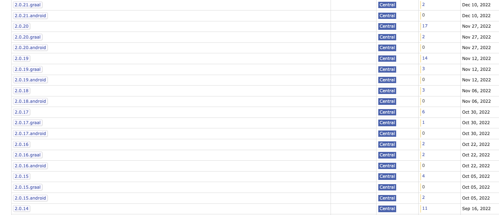](Maven 实战.assets/image-20241025174639510.png)

稳定版本的特点就是，当我们引入依赖时，如果发现本地仓库中有则Maven不会去远程仓库中寻找，直接引用。当然这也有一个弊端，就是如果我们自己开发了一个依赖，并且命名了一个版本，当我们自己针对这个版本进行代码修改时后，在部署时如果我们自己不修改版本时，Maven不会进行覆盖的，也就是Maven中的本地仓库还是原来的版本，Maven这么做的目的就是保证稳定版本的稳定。


2、快照
--

下面我们介绍一下Maven中的快照版本，这个版本和稳定版有一点点不同。下面我们通过下面的例子解释一下，Maven为什么要分快照版本。

* * *

假如我们在开发一个项目，期中小张在开发模块A的2.1版本，该版本还未正式发布，与模块A一同开发的还有模块B，它由小张的同事季MM开发，B的功能依赖于A的功能。所以在项目开发的过程中，小张需要经常将自己最新的模块打包，交给季MM，供她开发和集成调试，问题是，这个工作如何进行呢？

*   方案一

让季MM自己签出模块A的源码进行构建。这种方法能够确保季MM得到模块A的最新构件，不过她不得不去构建模块A。多了一些版本控制和Maven操作还不算，当构建A失败的时候，她会是一头雾水，最后不得不找小张解决。显然，这种方式是低效的。

*   方案二

重复部署模块A的2.1版本供季MM下载。虽然小张能够保证仓库中的构件是最新的，但对于Maven来说，同样的版本和同样的坐标就意味着同样的构件。因此，如果季MM在本机的本地仓库包含了模块A的2.1版本构件，Maven就不会再对照远程仓库进行更新。除非她每次执行Maven命令之前，清除本地仓库，但这种要求手工干预的做法显然也是不可取的。因为不太方便。

*   方案三

还有一个办法，就是小张不停的更新模块A版本号，例如：2.1.1、2.1.2、2.1.3……。首先，小张和季MM两人都需要频繁地更改POM，如果有更多的模块依赖于模块A，就会涉及更多的POM更改；其次，大量的版本其实仅仅包含了微小的差异，有时候是对版本号的滥用，并且没有从根本上解决上述的问题。

* * *

那到底如何解决上述的问题呢？最好的办法最就是采用Maven中的快照版本机制解决上述问题，这也是快照版本和稳定版本的本质区别。在上面的例中，小张只需要将模块A的版本设定为2.1-SNAPSHOT，然后发布到私服中，在发布的过程中，Maven会自动为构件打上时间戳。比如2.1-20091214.221414-13就表示2009年12月14日22点14分14秒的第13次快照。有了该时间戳，Maven就能随时找到仓库中该构件2.1-SNAPSHOT版本最新的文件。这时，季MM配置对于模块A的2.1-SNAPSHOT版本的依赖，当她构建模块B的时候，Maven会自动从仓库中检查模块A的2.1-SNAPSHOT的最新构件，当发现有更新时便进行下载。默认情况下，Maven每天检查一次更新，当然我们也可通过updatePolicy参数控制。用户也可以使用命令行-U参数强制让Maven检查更新，如`mvn clean install-U。`这样我们就完美的解决了上述的问题。因为上面的演示需要使用私服的才可以演示，但我们还没介绍如何搭建私服，所以本篇就不在进行项目演示了，等后续的内容中，我们在详细介绍一下。


# 十三、Maven 的生命周期

1、什么是 Maven 的生命周期
---------------

我们在实际的开发中有很多重复性的操作，例如代码的编译、打包、部署等等。Maven为了解决这样重复性的问题，对项目的构建过程进行了抽象和统一。这其实就是Maven的生命周期，目的是容易让开发人员在使用Maven的时候，方便我们扩展。并且Maven中的生命周期基本包括了我们之前介绍过的所有项目的构建命令，例如：编译、测试、打包、测试、部署等。

* * *

在Maven中生命周期定义了构建的各个步骤，并定义了这些步骤的顺序。但并没有提供具体这些构建的实现，构建的实现是由插件实现的。所以Maven中每个构建步骤都可以绑定一个或者多个插件，并且Maven为大部分步骤都绑定了默认的插件。这也就是为什么使用Maven构建项目非常的简单的，因为大部分插件都是默认支持的，我们不需要额外的处理。除非我们想要引入其它的插件。或者我们想要开发自己的插件，来满足我们日常开发的需求。Maven定义生命周期的目的就是保证Maven构建的标准，这是其一，其二就是通过默认绑定插件的方式实现了构建的目的，并且Maven也提供了相应的扩展，允许我们通过配置或者自己开发插件的方式来自定义构建的行为。

* * *

在Maven中生命周期实际是有三种，它们分别是：`clean、default、site`。并且它们是互相独立的。也就是当我们执行`clean`命令时，Maven不会对其它生命周期产生任何影响，只会影响clean生命周期。下面我们重点介绍一下，上面说的三个生命周期。


2、clean 生命周期
-----------

我们知道`clean`命令的作用是清理项目的。在Maven中`clean`生命周期实际上又分为三个不同的阶段，它门分别是：

| 阶段       | 描述                               |
| ---------- | ---------------------------------- |
| pre-clean  | 在实际项目清理之前执行所需的流程。 |
| clean      | 删除上一个版本生成的所有文件。     |
| post-clean | 执行完成项目清理所需的流程。       |

并且我们介绍过，Maven中生命周期指定了相应的顺序，所以当我们执行`pre-clean`时，`clean`和`post-clean`都不会被执行。而当我们执行`clean`时，则`pre-clean`和`clean`都会执行，并且会按照顺序执行。而当我们执行`post-clean`时，则上面三个阶段都会执行。


3、default生命周期
-------------

default生命周期是Maven中最重要的生命周期，因为它真正执行了构建所需要的所有步骤。具体的步骤如下：

| 阶段                    | 描述                                                         |
| ----------------------- | ------------------------------------------------------------ |
| validate                | 验证项目是否正确，并且所有必要的信息都可用。                 |
| initialize              | 初始化构建状态，例如设置属性或创建目录。                     |
| generate-sources        | 生成任何源代码以包含在编译中。                               |
| process-sources         | 处理源代码，例如过滤任何值。                                 |
| generate-resources      | 生成资源以纳入一揽子计划。                                   |
| process-resources       | 将资源复制并处理到目标目录中，准备打包。                     |
| compile                 | 编译项目的源代码。                                           |
| process-classes         | 后处理编译中生成的文件，例如在Java类上进行字节码增强。       |
| generate-test-sources   | 生成任何测试源代码以包含在编译中。                           |
| process-test-sources    | 处理测试源代码，例如过滤任何值。                             |
| generate-test-resources | 为测试创建资源。                                             |
| process-test-resources  | 将资源复制并处理到测试目标目录中。                           |
| test-compile            | 将测试源代码编译到测试目标目录中                             |
| process-test-classes    | 后处理测试编译中生成的文件，例如在Java类上进行字节码增强。   |
| test                    | 使用合适的单元测试框架运行测试。这些测试不应要求打包或部署代码。 |
| prepare-package         | 在实际包装之前执行任何准备包装所需的操作。这通常会导致包装的、处理的包裹版本。 |
| package                 | 获取编译后的代码，并将其打包为可分发格式，例如JAR。          |
| pre-integration-test    | 在执行集成测试之前执行所需的操作。这可能涉及设置所需的环境等事情。 |
| integration-test        | 如有必要，处理并将软件包部署到可以运行集成测试的环境中。     |
| post-integration-test   | 执行集成测试后执行所需的操作。这可能包括清理环境。           |
| verify                  | 运行任何检查以验证软件包是否有效并符合质量标准。             |
| install                 | 将软件包安装到本地存储库中，作为本地其他项目的依赖项使用。   |
| deploy                  | 在集成或发布环境中完成，将最终软件包复制到远程存储库，以便与其他开发人员和项目共享。 |


4、site生命周期
----------

`site`生命周期的目的是建立和发布项目站点，Maven可以自动生成一个站点，方便团队交流和发布项目信息。该生命周期也有以下几个阶段：

| 阶段        | 描述                                             |
| ----------- | ------------------------------------------------ |
| pre-site    | 在实际项目现场生成之前执行所需的流程。           |
| site        | 生成项目的站点文档。                             |
| post-site   | 执行完成站点生成所需的流程，并为站点部署做准备。 |
| site-deploy | 将生成的网站文档部署到指定的Web服务器。          |


5、生命周期与插件的绑定关系
--------------

我们知道上述生命周期的实现，都是由插件来完成的，下面我们介绍一下，上面生命周期与插件之前的关系，并且这些关系是Maven中默认绑定的。

| 阶段                   | 插件                                        |
| ---------------------- | ------------------------------------------- |
| clean                  | clean:clean                                 |
| process-resources      | resources:resources                         |
| compile                | compiler:compile                            |
| process-test-resources | resources:testResources                     |
| test-compile           | compiler:testCompile                        |
| test                   | surefire:test                               |
| package                | jar:jar 和 plugin:addPluginArtifactMetadata |
| install                | install:install                             |
| deploy                 | deploy:deploy                               |
| generate-resources     | plugin:descriptor                           |
| package                | ear:ear                                     |
| install                | install:install                             |
| site                   | site:site                                   |
| site-deploy            | site:deploy                                 |

  

# 十四、Maven中的插件

1、什么是 Maven 中的插件
--------------

在上一篇中我们介绍了Maven的生命周期，并且我们也了解了它实际上的功能都是由插件来完成的。可见插件对于Maven来说是多么的重要。Maven也为我们项目构建提供了很多默认的插件支持。当然我们也可以配置额外的插件，甚至我们可以开发自己的插件来实现我们自己特有的功能。那么到底什么是Maven的插件呢？插件的本质其实就是构建目标的集合。构建目标也可以理解为上一篇中我们介绍过的Maven中生命周期的各个阶段。然后将插件与各个阶段进行绑定，进而实现Maven中插件功能的实现。


2、Maven 中的插件如何配置
---------------

下面我们了解一下，如果何在Maven中配置插件。在Maven中我们可以通过下面的两种方式配置插件，下面我们详细介绍一下。

### 1、命令行配置插件

*   命令行配置插件

下面我们以`maven-surefire-plugin`插件为例，来介绍一下如何通过命令行配置的方式来实现插件的功能。

在`maven-surefire-plugin`插件中，它提供了一个`maven.test.skip`参数，并且这个参数可以通过命令行的方式配置（并不是所有的插件都支持这种方式配置）。这也是Maven方便我们配置插件额外参数提供了另一个功能。当上面参数设置为true时，我们可以在项目编译的时候跳过测试执行。该参数默认为flase。具体配置如下：

```bash
mvn install-D maven.test.skip=true
```

上面的参数-D是Java提供的，它的底层实现是通过命令行设置一个Java系统属性，Maven在执行时使用了该参数，从而实现了插件参数的配置。

下面我们通过代码演示一下，首先我们先执行`mvn install`来看一下Maven的执行日志。（需要项目中有相关的测试用例）

*   MazheMavenMallTest

```java
import org.junit.Test;

public class MazheMavenMallTest {
    @Test
    public void test() {
        System.out.println("Hello World Mazhe Maven Mall Test!");
    }
}
```

*   日志

```bash
[INFO] Scanning for projects...
[INFO] 
[INFO] ---------------------< cn.ma-zhe:mazhe-maven-mall >---------------------
[INFO] Building mazhe-maven-mall 1.0-SNAPSHOT
[INFO]   from pom.xml
[INFO] --------------------------------[ jar ]---------------------------------
[INFO] 
[INFO] --- resources:3.3.1:resources (default-resources) @ mazhe-maven-mall ---
[INFO] skip non existing resourceDirectory /Users/md/Desktop/midai-mazhe-maven/mazhe-maven-mall/src/main/resources
[INFO] 
[INFO] --- compiler:3.11.0:compile (default-compile) @ mazhe-maven-mall ---
[INFO] Nothing to compile - all classes are up to date
[INFO] 
[INFO] --- resources:3.3.1:testResources (default-testResources) @ mazhe-maven-mall ---
[INFO] skip non existing resourceDirectory /Users/md/Desktop/midai-mazhe-maven/mazhe-maven-mall/src/test/resources
[INFO] 
[INFO] --- compiler:3.11.0:testCompile (default-testCompile) @ mazhe-maven-mall ---
[INFO] Nothing to compile - all classes are up to date
[INFO] 
[INFO] --- surefire:3.1.2:test (default-test) @ mazhe-maven-mall ---
[INFO] Using auto detected provider org.apache.maven.surefire.junit4.JUnit4Provider
[INFO] 
[INFO] -------------------------------------------------------
[INFO]  T E S T S
[INFO] -------------------------------------------------------
[INFO] Running MazheMavenMallTest
Hello World Mazhe Maven Mall Test!
[INFO] Tests run: 1, Failures: 0, Errors: 0, Skipped: 0, Time elapsed: 0.065 s -- in MazheMavenMallTest
[INFO] 
[INFO] Results:
[INFO] 
[INFO] Tests run: 1, Failures: 0, Errors: 0, Skipped: 0
[INFO] 
[INFO] 
[INFO] --- jar:3.3.0:jar (default-jar) @ mazhe-maven-mall ---
[INFO] 
[INFO] --- install:3.1.1:install (default-install) @ mazhe-maven-mall ---
[INFO] Installing /Users/md/Desktop/midai-mazhe-maven/mazhe-maven-mall/pom.xml to /Users/md/.m2/repository/cn/ma-zhe/mazhe-maven-mall/1.0-SNAPSHOT/mazhe-maven-mall-1.0-SNAPSHOT.pom
[INFO] Installing /Users/md/Desktop/midai-mazhe-maven/mazhe-maven-mall/target/mazhe-maven-mall-1.0-SNAPSHOT.jar to /Users/md/.m2/repository/cn/ma-zhe/mazhe-maven-mall/1.0-SNAPSHOT/mazhe-maven-mall-1.0-SNAPSHOT.jar
[INFO] ------------------------------------------------------------------------
[INFO] BUILD SUCCESS
[INFO] ------------------------------------------------------------------------
[INFO] Total time:  2.753 s
[INFO] Finished at: 2023-08-02T05:57:14+08:00
[INFO] ------------------------------------------------------------------------
```

我们看日志输出，Maven执行了测试用例的代码。但测试用例是我们开发中测试的代码，在某些情况下，我们是不想让项目启动时让它运行的，那怎么能不让它执行呢。这也就是上面介绍的，可以通过命令行配置的方式，不让它执行，也就是修改了插件默认的规则。这次我们不在执行`mvn install`命令，而是执行`mvn install -D maven.test.skip=true`。我们再次观察一下日志。

*   日志

```bash
[INFO] Scanning for projects...
[INFO] 
[INFO] ---------------------< cn.ma-zhe:mazhe-maven-mall >---------------------
[INFO] Building mazhe-maven-mall 1.0-SNAPSHOT
[INFO]   from pom.xml
[INFO] --------------------------------[ jar ]---------------------------------
[INFO] 
[INFO] --- resources:3.3.1:resources (default-resources) @ mazhe-maven-mall ---
[INFO] skip non existing resourceDirectory /Users/md/Desktop/midai-mazhe-maven/mazhe-maven-mall/src/main/resources
[INFO] 
[INFO] --- compiler:3.11.0:compile (default-compile) @ mazhe-maven-mall ---
[INFO] Nothing to compile - all classes are up to date
[INFO] 
[INFO] --- resources:3.3.1:testResources (default-testResources) @ mazhe-maven-mall ---
[INFO] Not copying test resources
[INFO] 
[INFO] --- compiler:3.11.0:testCompile (default-testCompile) @ mazhe-maven-mall ---
[INFO] Not compiling test sources
[INFO] 
[INFO] --- surefire:3.1.2:test (default-test) @ mazhe-maven-mall ---
[INFO] Tests are skipped.
[INFO] 
[INFO] --- jar:3.3.0:jar (default-jar) @ mazhe-maven-mall ---
[INFO] 
[INFO] --- install:3.1.1:install (default-install) @ mazhe-maven-mall ---
[INFO] Installing /Users/md/Desktop/midai-mazhe-maven/mazhe-maven-mall/pom.xml to /Users/md/.m2/repository/cn/ma-zhe/mazhe-maven-mall/1.0-SNAPSHOT/mazhe-maven-mall-1.0-SNAPSHOT.pom
[INFO] Installing /Users/md/Desktop/midai-mazhe-maven/mazhe-maven-mall/target/mazhe-maven-mall-1.0-SNAPSHOT.jar to /Users/md/.m2/repository/cn/ma-zhe/mazhe-maven-mall/1.0-SNAPSHOT/mazhe-maven-mall-1.0-SNAPSHOT.jar
[INFO] ------------------------------------------------------------------------
[INFO] BUILD SUCCESS
[INFO] ------------------------------------------------------------------------
[INFO] Total time:  2.052 s
[INFO] Finished at: 2023-08-02T06:10:21+08:00
[INFO] ------------------------------------------------------------------------
```

我们看日志输出，这次Maven就自动为我们跳过测试用例的执行了。上面的命令还有一种简单的写法，就是`mvn install -DskipTests`方式。我们先看一下日志，然后在说明一下，这两处命令的区别。

*   日志

```bash
[INFO] Scanning for projects...
[INFO] 
[INFO] ---------------------< cn.ma-zhe:mazhe-maven-mall >---------------------
[INFO] Building mazhe-maven-mall 1.0-SNAPSHOT
[INFO]   from pom.xml
[INFO] --------------------------------[ jar ]---------------------------------
[INFO] 
[INFO] --- resources:3.3.1:resources (default-resources) @ mazhe-maven-mall ---
[INFO] skip non existing resourceDirectory /Users/md/Desktop/midai-mazhe-maven/mazhe-maven-mall/src/main/resources
[INFO] 
[INFO] --- compiler:3.11.0:compile (default-compile) @ mazhe-maven-mall ---
[INFO] Nothing to compile - all classes are up to date
[INFO] 
[INFO] --- resources:3.3.1:testResources (default-testResources) @ mazhe-maven-mall ---
[INFO] skip non existing resourceDirectory /Users/md/Desktop/midai-mazhe-maven/mazhe-maven-mall/src/test/resources
[INFO] 
[INFO] --- compiler:3.11.0:testCompile (default-testCompile) @ mazhe-maven-mall ---
[INFO] Nothing to compile - all classes are up to date
[INFO] 
[INFO] --- surefire:3.1.2:test (default-test) @ mazhe-maven-mall ---
[INFO] Tests are skipped.
[INFO] 
[INFO] --- jar:3.3.0:jar (default-jar) @ mazhe-maven-mall ---
[INFO] 
[INFO] --- install:3.1.1:install (default-install) @ mazhe-maven-mall ---
[INFO] Installing /Users/md/Desktop/midai-mazhe-maven/mazhe-maven-mall/pom.xml to /Users/md/.m2/repository/cn/ma-zhe/mazhe-maven-mall/1.0-SNAPSHOT/mazhe-maven-mall-1.0-SNAPSHOT.pom
[INFO] Installing /Users/md/Desktop/midai-mazhe-maven/mazhe-maven-mall/target/mazhe-maven-mall-1.0-SNAPSHOT.jar to /Users/md/.m2/repository/cn/ma-zhe/mazhe-maven-mall/1.0-SNAPSHOT/mazhe-maven-mall-1.0-SNAPSHOT.jar
[INFO] ------------------------------------------------------------------------
[INFO] BUILD SUCCESS
[INFO] ------------------------------------------------------------------------
[INFO] Total time:  2.034 s
[INFO] Finished at: 2023-08-02T06:14:35+08:00
[INFO] ------------------------------------------------------------------------
```

通过日志我们知道，这个命令同样的跳过了测试用例的执行，那么`mvn install -D maven.test.skip=true`和`mvn install -DskipTests`这两个命令到底有什么区别呢？

*   `mvn install -D maven.test.skip=true`

跳过测试用例的执行，不会生成测试类的class文件。

[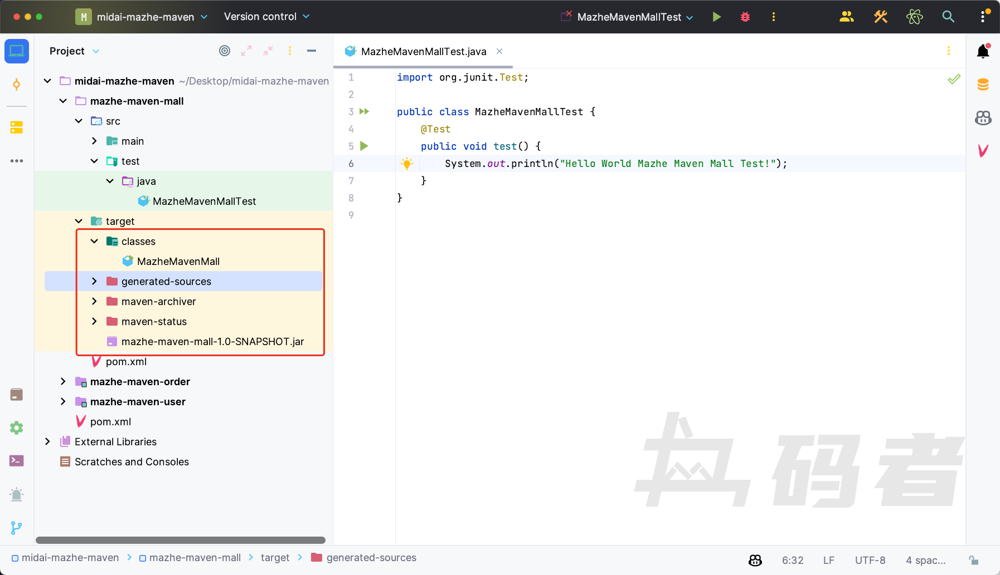](Maven 实战.assets/image-20241025174639511.png)

*   `mvn install -DskipTests`

跳过测试用例的执行，但是依然会生成测试类的class文件。

[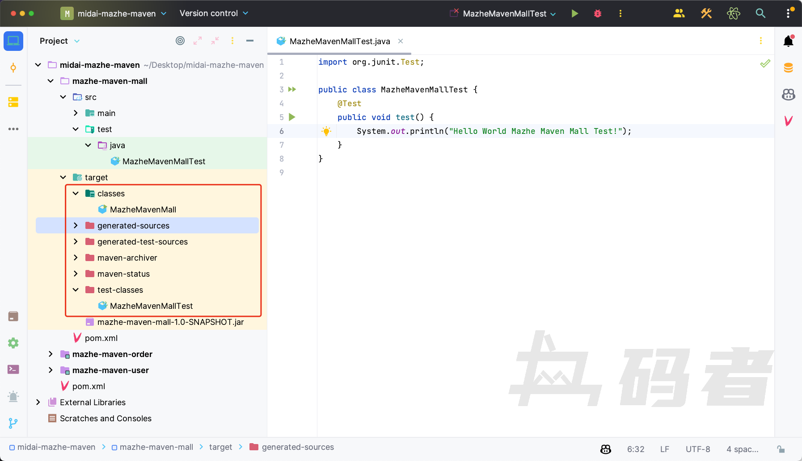](Maven 实战.assets/image-20241025174639512.png)


### 2、POM中配置插件

*   POM中配置插件

下面我们介绍一下另外一种配置插件的方式。实际上在Maven中并不是所有插件都支持参数配置，并且支持参数配置的插件都是一些经常需要变参数的插件，还有一些不需要改变的插件，也就是我们可以进行全局配置。Maven中有很多的插件可以进行配置我们以`maven-compiler-plugin`插件配置为例。该插件的作用是配置项目编译的JDK的版本。具体的配置如下：

```xml
<build>
    <plugins>
        <plugin>
            <groupId>org.apache.maven.plugins</groupId>
            <artifactId>maven-compiler-plugin</artifactId>
            <version>3.8.1</version>
            <configuration>
                <source>1.8</source>
                <target>1.8</target>
            </configuration>
        </plugin>
    </plugins>
</build>
```

当我们配置完上述内容后，Maven在执行的时，就会按照我们指定的JDK的版本进行编译，这也是Maven插件意义所在，在实际的项目开发中，我们推荐使用pom中的方式配置插件，因为这样可以复用，方便我们在次使用。


3、Maven如何开发自己的插件
----------------

通过上面的内容，我们已经知道了什么是Maven的插件了，并且我们也知道如何配置Maven插件了，下面我们介绍一下，如何开发自己的插件，通过开发自己的插件，可以让我们更加深入的理解Maven中插件的底层实现与使用技巧。由于插件的作用是实现某些功能，我们以简单的的一种场景为例，来介绍一下如何开发自己的Maven插件。开发Maven的插件，主要有以下步骤：

1、创建一个Maven的项目，并且这个项目的`packaging`必须是`maven-plugin`。  
2、为插件设置构建的目标，也就是Maven中的Mojo，编写插件的时候，必须提供一个或者多个继承AbstractMojo类。  
3、为目标提供配置参数,因为大部分的Maven插件的目标是可以配置的，所以在编写Mojo时需要添加可配置参数的支持。  
4、编写目标的实现，也就是Mojo的实际处理功能。  
5、处理日志信息，当Mojo处理异常时，代码中要编写必要的日志，以便用户提供信息，方便排查。  
6、测试插件，编写自动化测试代码的行为，然后运行插件时，验证其行为。

下面我们按照上面的步骤，来实际操作一下。首先我们创建一个项目。

[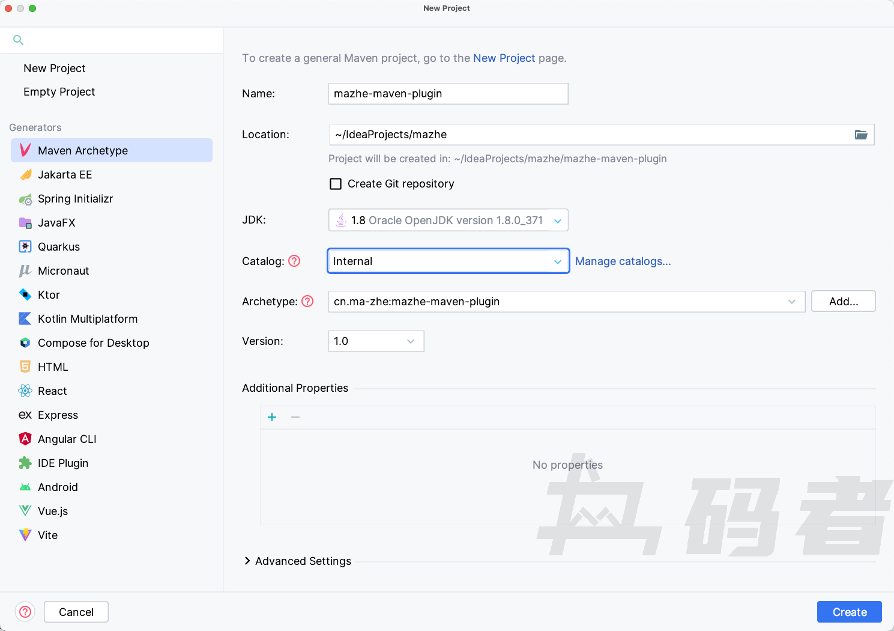](Maven 实战.assets/image-20241025174639513.png)

下面我们修改一下项目的`packaging`，配置`packaging`为`maven-plugin`。除此之外，我们还需要引入一个依赖，因为上面第二步介绍 ，我们需要继承AbstractMojo。所以这个依赖类就是这个依赖包中，并且初了这个依赖类外，这个依赖包还提供了所有Maven插件开发的所依赖的其它的类。具体的配置如下：

*   pom.xml

```xml
<?xml version="1.0" encoding="UTF-8"?>
<project xmlns="http://maven.apache.org/POM/4.0.0"
         xmlns:xsi="http://www.w3.org/2001/XMLSchema-instance"
         xsi:schemaLocation="http://maven.apache.org/POM/4.0.0 http://maven.apache.org/xsd/maven-4.0.0.xsd">
    <modelVersion>4.0.0</modelVersion>

    <groupId>cn.ma-zhe</groupId>
    <artifactId>mazhe-maven-plugin</artifactId>
    <version>1.0-SNAPSHOT</version>
    <packaging>maven-plugin</packaging>

    <dependencies>
        <dependency>
            <groupId>org.apache.maven</groupId>
            <artifactId>maven-plugin-api</artifactId>
            <version>3.2.5</version>
        </dependency>
        <dependency>
            <groupId>org.apache.maven.plugin-tools</groupId>
            <artifactId>maven-plugin-annotations</artifactId>
            <version>3.7.1</version>
        </dependency>
    </dependencies>
</project>
```

下面我们开发具体的Mojo的实现。

*   MazheMavenMojo

```java
import org.apache.maven.plugin.AbstractMojo;
import org.apache.maven.plugins.annotations.Mojo;
import org.apache.maven.plugins.annotations.Parameter;

@Mojo(name = "mazhe")
public class MazheMavenMojo extends AbstractMojo {
    @Parameter(property = "path", defaultValue = "${project.build.gargetDirectory}")
    private String path;

    public void execute() {
        getLog().info(String.format("Hello, world Mazhe Maven Plugin %s!", path));
    }
}
```

自定义的Mojo必须继承`AbstractMojo`类，并且还需要实现`execute()`方法，因为只有这样Maven才能识别出这个插件的目标。我们先简单输出一句话，先验证Maven能否识别出我们自己开发的插件。因为插件是给其它项目使用的，所以我们将我们刚刚写好的插件，安装到本地仓库中，然后让其它项目引用，安装到本地仓库的命令也就是下面的命令：

```
mvn install
```

我们还是用之前介绍过的mazhe-maven-mall项目为例，在这个项目配置我们自己的插件的信息，具体配置如下：

*   pom.xml

```xml
<?xml version="1.0" encoding="UTF-8"?>
<project xmlns="http://maven.apache.org/POM/4.0.0"
         xmlns:xsi="http://www.w3.org/2001/XMLSchema-instance"
         xsi:schemaLocation="http://maven.apache.org/POM/4.0.0 http://maven.apache.org/xsd/maven-4.0.0.xsd">
    <parent>
        <artifactId>midai-mazhe-maven</artifactId>
        <groupId>cn.ma-zhe</groupId>
        <version>1.0-SNAPSHOT</version>
    </parent>
    <modelVersion>4.0.0</modelVersion>

    <artifactId>mazhe-maven-mall</artifactId>
    <build>
        <plugins>
            <plugin>
                <groupId>cn.ma-zhe</groupId>
                <artifactId>mazhe-maven-plugin</artifactId>
                <version>1.0-SNAPSHOT</version>
                <executions>
                    <execution>
                        <phase>compile</phase>
                        <goals>
                            <goal>mazhe</goal>
                        </goals>
                    </execution>
                </executions>
            </plugin>
        </plugins>
    </build>
</project>
```

上面我一些标签，我们已经非常熟悉了，我们就不在过多介绍了，我们介绍一下`executions`标签中的`phase`和`goals`。

*   phase：作用是将该目标绑定的在Maven中生命周期的哪个阶段。也就是我们自己编写的插件，我们希望在执行Maven的哪个命令生效。
*   goal：指定我们插件目标的名称。在Maven调用时使用这个名称。

当然还有其它的配置信息，我们先不过多介绍，我们先验证我们上面的功能，后续我们在详细介绍`executions`中相关的配置。我们看上面的配置`phase`中我们配置的是`compile`，所以也就是说，我们的插件将自动绑定到项目编译的生命周期中。下面我们执行一下命令，来看一下Maven日志输出的结果。

*   编译

```bash
mvn compile
```

*   日志

```bash
[INFO] Scanning for projects...
[INFO] 
[INFO] ---------------------< cn.ma-zhe:mazhe-maven-mall >---------------------
[INFO] Building mazhe-maven-mall 1.0-SNAPSHOT
[INFO]   from pom.xml
[INFO] --------------------------------[ jar ]---------------------------------
[INFO] 
[INFO] --- resources:3.3.1:resources (default-resources) @ mazhe-maven-mall ---
[INFO] skip non existing resourceDirectory /Users/md/Desktop/midai-mazhe-maven/mazhe-maven-mall/src/main/resources
[INFO] 
[INFO] --- compiler:3.11.0:compile (default-compile) @ mazhe-maven-mall ---
[INFO] Nothing to compile - all classes are up to date
[INFO] 
[INFO] --- mazhe:1.0-SNAPSHOT:mazhe (default) @ mazhe-maven-mall ---
[INFO] Hello, world Mazhe Maven Plugin /Users/md/Desktop/midai-mazhe-maven/mazhe-maven-mall!
[INFO] ------------------------------------------------------------------------
[INFO] BUILD SUCCESS
[INFO] ------------------------------------------------------------------------
[INFO] Total time:  1.166 s
[INFO] Finished at: 2023-08-04T06:23:29+08:00
[INFO] ------------------------------------------------------------------------
```

我们看上面的日志输出，成功的输出了，我们插件中的信息了，这就是Maven中插件的开发，开发难度还是非常简单的。但上面的插件并没有任何实际的意义，下面我们开发一下相对来说有意义的插件。我们知道在Maven中执行clean时会自动将Maven中的target目录给清理掉，下面我们开发一个功能，在执行清理之前，我们将target中的依赖包内容进行备份。下面看一下具体的代码。

*   MazheMavenMojo

```java
import cn.hutool.core.io.FileUtil;
import org.apache.maven.plugin.AbstractMojo;
import org.apache.maven.plugins.annotations.Mojo;
import org.apache.maven.plugins.annotations.Parameter;

@Mojo(name = "mazhe")
public class MazheMavenMojo extends AbstractMojo {
    @Parameter(property = "path", defaultValue = "${project.build.directory}")
    private String path;

    @Parameter(property = "artifactId", defaultValue = "${project.artifactId}")
    private String artifactId;

    @Parameter(property = "version", defaultValue = "${project.version}")
    private String version;

    public void execute() {
        String jar = String.format("%s/%s-%s.jar", path, artifactId, version);
        FileUtil.copy(jar, jar.replace("target", "bak"), true);
    }
}
```

上面配置中使用了`@Parameter`参数，该参数的作用是引入配置变量，并且我们指定的了默认的配置参数，也就是项目编译的目录。下面我们同样的安装一下，然后在依赖项目中在执行一下。

*   pom.xml

```xml
<?xml version="1.0" encoding="UTF-8"?>
<project xmlns="http://maven.apache.org/POM/4.0.0"
         xmlns:xsi="http://www.w3.org/2001/XMLSchema-instance"
         xsi:schemaLocation="http://maven.apache.org/POM/4.0.0 http://maven.apache.org/xsd/maven-4.0.0.xsd">
    <parent>
        <artifactId>midai-mazhe-maven</artifactId>
        <groupId>cn.ma-zhe</groupId>
        <version>1.0-SNAPSHOT</version>
    </parent>
    <modelVersion>4.0.0</modelVersion>

    <artifactId>mazhe-maven-mall</artifactId>
    <build>
        <plugins>
            <plugin>
                <groupId>cn.ma-zhe</groupId>
                <artifactId>mazhe-maven-plugin</artifactId>
                <version>1.0-SNAPSHOT</version>
                <executions>
                    <execution>
                        <phase>pre-clean</phase>
                        <goals>
                            <goal>mazhe</goal>
                        </goals>
                    </execution>
                </executions>
            </plugin>
        </plugins>
    </build>
</project>
```

因为上面中`phase`参数我们配置是`pre-clean`。也就是绑定的是清理前的生命周期，所以我们插件的作用才能启作用，在项目被清理之前开始备份。所以`phase`参数是我们Maven插件开发中非常重要的参数。下面我们执行一下清理命令，看一下日志输出。

*   清理

```
mvn clean
```

*   日志

```
[INFO] Scanning for projects...
[INFO] 
[INFO] ---------------------< cn.ma-zhe:mazhe-maven-mall >---------------------
[INFO] Building mazhe-maven-mall 1.0-SNAPSHOT
[INFO]   from pom.xml
[INFO] --------------------------------[ jar ]---------------------------------
[INFO] 
[INFO] --- mazhe:1.0-SNAPSHOT:mazhe (default) @ mazhe-maven-mall ---
[INFO] ------------------------------------------------------------------------
[INFO] BUILD FAILURE
[INFO] ------------------------------------------------------------------------
[INFO] Total time:  0.691 s
[INFO] Finished at: 2023-08-04T22:41:10+08:00
[INFO] ------------------------------------------------------------------------
[ERROR] Failed to execute goal cn.ma-zhe:mazhe-maven-plugin:1.0-SNAPSHOT:mazhe (default) on project mazhe-maven-mall: Execution default of goal cn.ma-zhe:mazhe-maven-plugin:1.0-SNAPSHOT:mazhe failed: File not exist: /Users/md/Desktop/midai-mazhe-maven/mazhe-maven-mall/target/mazhe-maven-mall-1.0-SNAPSHOT.jar -> [Help 1]
[ERROR] 
[ERROR] To see the full stack trace of the errors, re-run Maven with the -e switch.
[ERROR] Re-run Maven using the -X switch to enable full debug logging.
[ERROR] 
[ERROR] For more information about the errors and possible solutions, please read the following articles:
[ERROR] [Help 1] http://cwiki.apache.org/confluence/display/MAVEN/PluginExecutionException
```

我们看上面的日志报错了，并且日志输出的非常明显，没有找到相应的文件。那是因为我们并没有对target目录进行判断，因为我们没有先编译项目，所以项目中并没有这个目录，下面我们先打包一下项目然后在执行清理命令看一下效果。

*   打包

```bash
mvn package
```

*   日志

```bash
[INFO] Scanning for projects...
[INFO] 
[INFO] ---------------------< cn.ma-zhe:mazhe-maven-mall >---------------------
[INFO] Building mazhe-maven-mall 1.0-SNAPSHOT
[INFO]   from pom.xml
[INFO] --------------------------------[ jar ]---------------------------------
[INFO] 
[INFO] --- resources:3.3.1:resources (default-resources) @ mazhe-maven-mall ---
[INFO] skip non existing resourceDirectory /Users/md/Desktop/midai-mazhe-maven/mazhe-maven-mall/src/main/resources
[INFO] 
[INFO] --- compiler:3.11.0:compile (default-compile) @ mazhe-maven-mall ---
[INFO] Changes detected - recompiling the module! :source
[INFO] Compiling 1 source file with javac [debug target 8] to target/classes
[INFO] 
[INFO] --- resources:3.3.1:testResources (default-testResources) @ mazhe-maven-mall ---
[INFO] skip non existing resourceDirectory /Users/md/Desktop/midai-mazhe-maven/mazhe-maven-mall/src/test/resources
[INFO] 
[INFO] --- compiler:3.11.0:testCompile (default-testCompile) @ mazhe-maven-mall ---
[INFO] Changes detected - recompiling the module! :source
[INFO] Compiling 1 source file with javac [debug target 8] to target/test-classes
[INFO] 
[INFO] --- surefire:3.1.2:test (default-test) @ mazhe-maven-mall ---
[INFO] Using auto detected provider org.apache.maven.surefire.junit.JUnit3Provider
[INFO] 
[INFO] -------------------------------------------------------
[INFO]  T E S T S
[INFO] -------------------------------------------------------
[INFO] Running MazheMavenMallTest
[INFO] Tests run: 0, Failures: 0, Errors: 0, Skipped: 0, Time elapsed: 0.018 s -- in MazheMavenMallTest
[INFO] 
[INFO] Results:
[INFO] 
[INFO] Tests run: 0, Failures: 0, Errors: 0, Skipped: 0
[INFO] 
[INFO] 
[INFO] --- jar:3.3.0:jar (default-jar) @ mazhe-maven-mall ---
[INFO] Building jar: /Users/md/Desktop/midai-mazhe-maven/mazhe-maven-mall/target/mazhe-maven-mall-1.0-SNAPSHOT.jar
[INFO] ------------------------------------------------------------------------
[INFO] BUILD SUCCESS
[INFO] ------------------------------------------------------------------------
[INFO] Total time:  2.780 s
[INFO] Finished at: 2023-08-04T22:49:07+08:00
[INFO] ------------------------------------------------------------------------
```

下面我们在执行清理命令，看一下日志。

*   清理

```bash
mvn clean
```

*   日志

```bash
[INFO] Scanning for projects...
[INFO] 
[INFO] ---------------------< cn.ma-zhe:mazhe-maven-mall >---------------------
[INFO] Building mazhe-maven-mall 1.0-SNAPSHOT
[INFO]   from pom.xml
[INFO] --------------------------------[ jar ]---------------------------------
[INFO] 
[INFO] --- mazhe:1.0-SNAPSHOT:mazhe (default) @ mazhe-maven-mall ---
[INFO] 
[INFO] --- clean:3.2.0:clean (default-clean) @ mazhe-maven-mall ---
[INFO] Deleting /Users/md/Desktop/midai-mazhe-maven/mazhe-maven-mall/target
[INFO] ------------------------------------------------------------------------
[INFO] BUILD SUCCESS
[INFO] ------------------------------------------------------------------------
[INFO] Total time:  0.834 s
[INFO] Finished at: 2023-08-04T22:50:34+08:00
[INFO] ------------------------------------------------------------------------
```

我们看日志执行成功了，我们看一下项目目录是否成功的备份了之前的依赖包。

[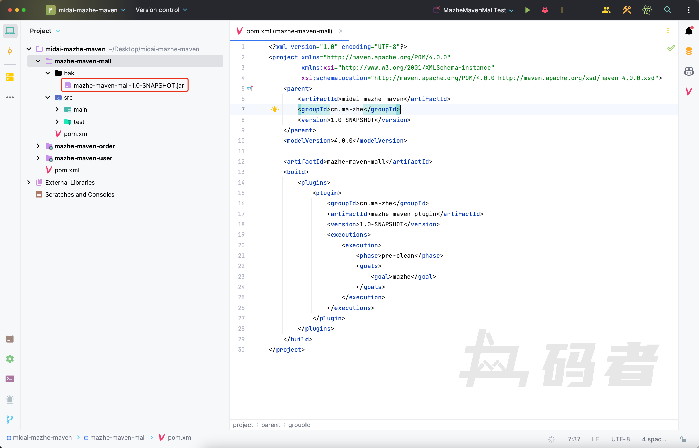](Maven 实战.assets/image-20241025174639514.png)

我们看项目目录中成功的备份了我们的依赖包。以上内容就是我们Maven中插件开发的主要内容。下面我们在介绍一下，上面开发中涉及到的一此配置信息。

*   Maven内置属性

| 属性                                 | 描述                                                    |
| ------------------------------------ | ------------------------------------------------------- |
| ${project.build.sourceDirectory}     | 项目的源码目录，也就是src/main/java。                   |
| ${project.build.testSourceDirectory} | 项目测试源码目录，也就是src/test/java。                 |
| ${project.build.directory}           | 项目的构建目录，也就是target目录。                      |
| ${project.outputDirectory}           | 项目源码的编译目录，也就是target/classes目录。          |
| ${project.testOutputDirector}        | 项目的测试源码编译目录，也就是target/test-classes目录。 |
| ${project.groupId}                   | 项目的groupId。                                         |
| ${project.artifactId}                | 项目的artifactId。                                      |
| ${project.version}                   | 项目的version。                                         |
| ${project.build.finalName}           | 项目的打包名称。                                        |

*   phase

| 阶段                    | 描述                                                         |
| ----------------------- | ------------------------------------------------------------ |
| pre-clean               | 在实际项目清理之前执行所需的流程。                           |
| clean                   | 删除上一个版本生成的所有文件。                               |
| post-clean              | 执行完成项目清理所需的流程。                                 |
| validate                | 验证项目是否正确，并且所有必要的信息都可用。                 |
| initialize              | 初始化构建状态，例如设置属性或创建目录。                     |
| generate-sources        | 生成任何源代码以包含在编译中。                               |
| process-sources         | 处理源代码，例如过滤任何值。                                 |
| generate-resources      | 生成资源以纳入一揽子计划。                                   |
| process-resources       | 将资源复制并处理到目标目录中，准备打包。                     |
| compile                 | 编译项目的源代码。                                           |
| process-classes         | 后处理编译中生成的文件，例如在Java类上进行字节码增强。       |
| generate-test-sources   | 生成任何测试源代码以包含在编译中。                           |
| process-test-sources    | 处理测试源代码，例如过滤任何值。                             |
| generate-test-resources | 为测试创建资源。                                             |
| process-test-resources  | 将资源复制并处理到测试目标目录中。                           |
| test-compile            | 将测试源代码编译到测试目标目录中                             |
| process-test-classes    | 后处理测试编译中生成的文件，例如在Java类上进行字节码增强。   |
| test                    | 使用合适的单元测试框架运行测试。这些测试不应要求打包或部署代码。 |
| prepare-package         | 在实际包装之前执行任何准备包装所需的操作。这通常会导致包装的、处理的包裹版本。 |
| package                 | 获取编译后的代码，并将其打包为可分发格式，例如JAR。          |
| pre-integration-test    | 在执行集成测试之前执行所需的操作。这可能涉及设置所需的环境等事情。 |
| integration-test        | 如有必要，处理并将软件包部署到可以运行集成测试的环境中。     |
| post-integration-test   | 执行集成测试后执行所需的操作。这可能包括清理环境。           |
| verify                  | 运行任何检查以验证软件包是否有效并符合质量标准。             |
| install                 | 将软件包安装到本地存储库中，作为本地其他项目的依赖项使用。   |
| deploy                  | 在集成或发布环境中完成，将最终软件包复制到远程存储库，以便与其他开发人员和项目共享。 |

 

# 十五、Maven 中的聚合

在实际的项目开发中，我们通常的项目架构都是分模块开发的，也就是一个项目会有多个模块，不同的团队负责开发不同的模块。那么在Maven中怎么能控制多个模块的构建呢？如果每个模块都需要单独的管理的话，那么如果模块比较多的话，是一个不小的工作量。所以Maven为了方便我们管理项目的，在Maven中我们可以创建另外的一个项目来控制其它模块的构建，并且每一个模块都有自己独立的pom文件。这个控制其他模块的构建的项目也就是Maven中的聚合项目。但它的配置和其它模块的配置稍有不同，聚合项目也可以称之为父项目。实际上在之前的内容中我们已经使用了聚合项目的配置，也就是`midai-mazhe-maven`项目中我们使用过的。只不过之前我们并没有详细介绍，今天我们详细介绍的一下聚合项目的配置。

```xml
<?xml version="1.0" encoding="UTF-8"?>
<project xmlns="http://maven.apache.org/POM/4.0.0"
         xmlns:xsi="http://www.w3.org/2001/XMLSchema-instance"
         xsi:schemaLocation="http://maven.apache.org/POM/4.0.0 http://maven.apache.org/xsd/maven-4.0.0.xsd">
    <modelVersion>4.0.0</modelVersion>

    <groupId>cn.ma-zhe</groupId>
    <artifactId>midai-mazhe-maven</artifactId>
    <packaging>pom</packaging>
    <version>1.0-SNAPSHOT</version>
    <modules>
        <module>mazhe-maven-user</module>
        <module>mazhe-maven-order</module>
        <module>mazhe-maven-mall</module>
    </modules>

    <properties>
        <maven.compiler.source>8</maven.compiler.source>
        <maven.compiler.target>8</maven.compiler.target>
        <project.build.sourceEncoding>UTF-8</project.build.sourceEncoding>
    </properties>

</project>
```

上面的配置和正常的项目构建大体上没有任何区别，唯一的区别是`packaging`标签。我们知道该标签的作用是设置Maven打包的类型，并且默认为jar。但当我们需要通过此项目来管理其它项目时，需要将此参数设置为pom类型。现在我们已经介绍了三种`packaging`类型的标签了，也就是`jar、maven-plugin、pom`。除了上述的不同之外，还要需要设置`module`标签。`module`标签用来配置我们需要管理的其它模块的项目名称，也就是其它模块`artifactId`标签指定的模块名称。上面的配置是在`midai-mazhe-maven`项目目录中子目录创建的项目，所以我们不需要指定额外的项目路径。

[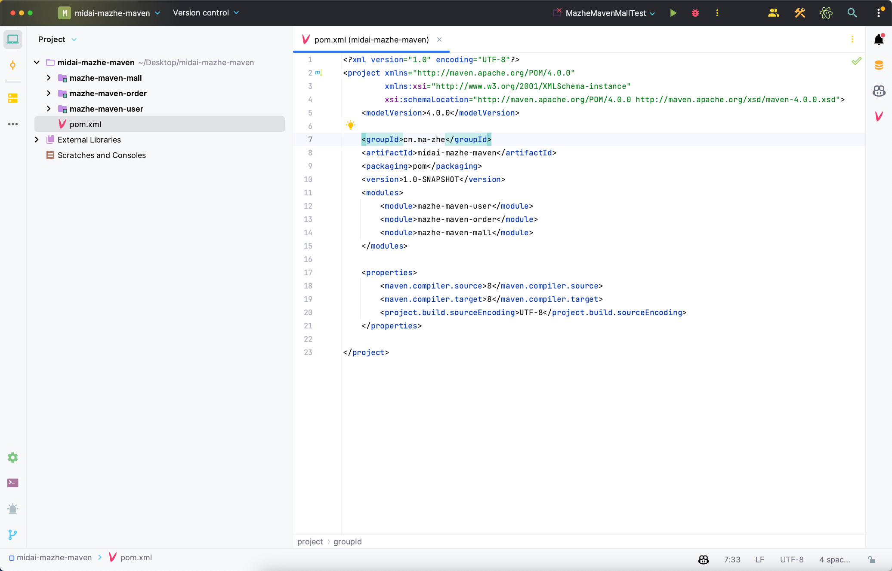](Maven 实战.assets/image-20241025174639515.png)

当然我们也可以配置`module`标签为相对路径以及绝对路径。这样不用必须在子目录中管理项目。下面我们执行一下清理命令，来验证一下，通过这样的配置，Maven会不会管理我们的子项目。

*   命令

```bash
mvn clean
```

*   执行日志：

```bash
[INFO] Scanning for projects...
[INFO] ------------------------------------------------------------------------
[INFO] Reactor Build Order:
[INFO] 
[INFO] midai-mazhe-maven                                                  [pom]
[INFO] mazhe-maven-user                                                   [jar]
[INFO] mazhe-maven-order                                                  [jar]
[INFO] mazhe-maven-mall                                                   [jar]
[INFO] 
[INFO] --------------------< cn.ma-zhe:midai-mazhe-maven >---------------------
[INFO] Building midai-mazhe-maven 1.0-SNAPSHOT                            [1/4]
[INFO]   from pom.xml
[INFO] --------------------------------[ pom ]---------------------------------
[INFO] 
[INFO] --- clean:3.2.0:clean (default-clean) @ midai-mazhe-maven ---
[INFO] 
[INFO] ---------------------< cn.ma-zhe:mazhe-maven-user >---------------------
[INFO] Building mazhe-maven-user 1.0-SNAPSHOT                             [2/4]
[INFO]   from mazhe-maven-user/pom.xml
[INFO] --------------------------------[ jar ]---------------------------------
[INFO] 
[INFO] --- clean:3.2.0:clean (default-clean) @ mazhe-maven-user ---
[INFO] 
[INFO] --------------------< cn.ma-zhe:mazhe-maven-order >---------------------
[INFO] Building mazhe-maven-order 1.0-SNAPSHOT                            [3/4]
[INFO]   from mazhe-maven-order/pom.xml
[INFO] --------------------------------[ jar ]---------------------------------
[INFO] 
[INFO] --- clean:3.2.0:clean (default-clean) @ mazhe-maven-order ---
[INFO] 
[INFO] ---------------------< cn.ma-zhe:mazhe-maven-mall >---------------------
[INFO] Building mazhe-maven-mall 1.0-SNAPSHOT                             [4/4]
[INFO]   from mazhe-maven-mall/pom.xml
[INFO] --------------------------------[ jar ]---------------------------------
[INFO] 
[INFO] --- clean:3.2.0:clean (default-clean) @ mazhe-maven-mall ---
[INFO] ------------------------------------------------------------------------
[INFO] Reactor Summary for midai-mazhe-maven 1.0-SNAPSHOT:
[INFO] 
[INFO] midai-mazhe-maven .................................. SUCCESS [  0.293 s]
[INFO] mazhe-maven-user ................................... SUCCESS [  0.003 s]
[INFO] mazhe-maven-order .................................. SUCCESS [  0.002 s]
[INFO] mazhe-maven-mall ................................... SUCCESS [  0.003 s]
[INFO] ------------------------------------------------------------------------
[INFO] BUILD SUCCESS
[INFO] ------------------------------------------------------------------------
[INFO] Total time:  0.434 s
[INFO] Finished at: 2023-08-07T06:19:39+08:00
[INFO] ------------------------------------------------------------------------
```

看上面日志Maven成功的执行了项目的清理，并且除了父项目外，还执行了子项目的清理工作，并且是按照我们在父项目中的执行的顺序执行的清理动作。下面我们修改一下配置，让`mazhe-maven-user`项目依赖于`mazhe-maven-order`项目，然后在看一下日志输出有何不同。下面为`mazhe-maven-user`项目的pom配置。

*   pom.xml

```xml
<?xml version="1.0" encoding="UTF-8"?>
<project xmlns="http://maven.apache.org/POM/4.0.0"
         xmlns:xsi="http://www.w3.org/2001/XMLSchema-instance"
         xsi:schemaLocation="http://maven.apache.org/POM/4.0.0 http://maven.apache.org/xsd/maven-4.0.0.xsd">
    <parent>
        <artifactId>midai-mazhe-maven</artifactId>
        <groupId>cn.ma-zhe</groupId>
        <version>1.0-SNAPSHOT</version>
    </parent>
    <modelVersion>4.0.0</modelVersion>

    <artifactId>mazhe-maven-user</artifactId>

    <dependencies>
        <dependency>
            <groupId>cn.ma-zhe</groupId>
            <artifactId>mazhe-maven-order</artifactId>
            <version>1.0-SNAPSHOT</version>
        </dependency>
    </dependencies>
</project>
```

我们再次执行父项目的清理命令来看一下日志输出有何不同。

*   命令

```bash
mvn clean
```

*   日志

```bash
[INFO] Scanning for projects...
[INFO] ------------------------------------------------------------------------
[INFO] Reactor Build Order:
[INFO] 
[INFO] midai-mazhe-maven                                                  [pom]
[INFO] mazhe-maven-order                                                  [jar]
[INFO] mazhe-maven-user                                                   [jar]
[INFO] mazhe-maven-mall                                                   [jar]
[INFO] 
[INFO] --------------------< cn.ma-zhe:midai-mazhe-maven >---------------------
[INFO] Building midai-mazhe-maven 1.0-SNAPSHOT                            [1/4]
[INFO]   from pom.xml
[INFO] --------------------------------[ pom ]---------------------------------
[INFO] 
[INFO] --- clean:3.2.0:clean (default-clean) @ midai-mazhe-maven ---
[INFO] 
[INFO] --------------------< cn.ma-zhe:mazhe-maven-order >---------------------
[INFO] Building mazhe-maven-order 1.0-SNAPSHOT                            [2/4]
[INFO]   from mazhe-maven-order/pom.xml
[INFO] --------------------------------[ jar ]---------------------------------
[INFO] 
[INFO] --- clean:3.2.0:clean (default-clean) @ mazhe-maven-order ---
[INFO] 
[INFO] ---------------------< cn.ma-zhe:mazhe-maven-user >---------------------
[INFO] Building mazhe-maven-user 1.0-SNAPSHOT                             [3/4]
[INFO]   from mazhe-maven-user/pom.xml
[INFO] --------------------------------[ jar ]---------------------------------
[INFO] 
[INFO] --- clean:3.2.0:clean (default-clean) @ mazhe-maven-user ---
[INFO] 
[INFO] ---------------------< cn.ma-zhe:mazhe-maven-mall >---------------------
[INFO] Building mazhe-maven-mall 1.0-SNAPSHOT                             [4/4]
[INFO]   from mazhe-maven-mall/pom.xml
[INFO] --------------------------------[ jar ]---------------------------------
[INFO] 
[INFO] --- clean:3.2.0:clean (default-clean) @ mazhe-maven-mall ---
[INFO] ------------------------------------------------------------------------
[INFO] Reactor Summary for midai-mazhe-maven 1.0-SNAPSHOT:
[INFO] 
[INFO] midai-mazhe-maven .................................. SUCCESS [  0.298 s]
[INFO] mazhe-maven-order .................................. SUCCESS [  0.003 s]
[INFO] mazhe-maven-user ................................... SUCCESS [  0.003 s]
[INFO] mazhe-maven-mall ................................... SUCCESS [  0.002 s]
[INFO] ------------------------------------------------------------------------
[INFO] BUILD SUCCESS
[INFO] ------------------------------------------------------------------------
[INFO] Total time:  0.440 s
[INFO] Finished at: 2023-08-07T06:29:47+08:00
[INFO] ------------------------------------------------------------------------
```

我们通过上面的日志观察到项目`mazhe-maven-order`和项目`mazhe-maven-user`的执行顺序发生了变化，已经不是我们父项目中配置的那个顺序了。这是为什么呢？实际上Maven在通过父项目管理项目时，如果模块彼此之间，没有任何依赖，则会按照父项目中配置的顺序执行。但如果模块之间有依赖，则会先按照依赖的顺序执行。这样做的目的是，如果两个模块有依赖，例如上面的项目`mazhe-maven-user`依赖项目`mazhe-maven-order`。如果Maven不按照依赖的顺序处理的话，在执行的时候，项目`mazhe-maven-user`则会报错，应该它找不到项目`mazhe-maven-order`。因为项目`mazhe-maven-order`还没有执行，这样只能我们手动的配置。这样我们在配置时必须考虑每个模块彼此的依赖关系，这样就会增加我们通过父模块来方便快捷管理模块初衷了，这也间接的证明了，Maven为了我们方便管理项目，额外做了很多的工作。


# 十六、Maven 中的继承  

在上一篇中我们介绍了Maven中聚合的功能，通过聚合的功能可以解决我们项目中管理多个模块的问题。但是这还远远不够，因为我们在实际的多模块开发配置子模块`pom.xml`文件的时候会发现，我们必须按照Maven的规则和语法来配置pom.xml。这本身是没有任何问题的，但如果我们项目的子模块比较多时，这样就会导致一个问题，也就是很多`pom.xml`配置重复了。因为不同的模块配置的语法和规则几乎一样，只有个性化的配置不同，这样就会导致重复的工作。并且除了这项工作繁琐外，还不方便我们管理，因为如果我们约定其中某个依赖，都采用相同的版本时，如果依赖升级变更了，我们需要把所有子模块的配置全部修改一遍，这也就违背了Maven方便快捷管理项目的初衷。为了解决这样的问题，Maven中支持继承的功能。了解Java语言的同学知道，在Java语言中我们知道是有父子类的继承关系的，子类可以直接继承父类的内容的。这样当我们不需要更改父类方法或者变量时，就会给子类缺少很多代码，但当我们想要修改时，直接覆盖即可。在Maven中同样采用了这样的设计，我们可以在父pom.xml中配置一些子模块共用的配置，然后在子模块的`pom.xml`中配置该模块特有的配置，这样就完美解决了上述的问题了。在Maven中有以下的元素可以支持继承：

* * *

*   可以继承父模块的标签

| 标签                   | 备注                                                         |
| ---------------------- | ------------------------------------------------------------ |
| groupId                | 项目组ID，项目坐标的核心元素。                               |
| version                | 项目版本，项目坐标的核心元素。                               |
| description            | 项目的描述信息。                                             |
| organization           | 项目的组织信息。                                             |
| inceptionYear          | 项目的创始年份。                                             |
| url                    | 项目的URL地址。                                              |
| developers             | 项目的开发者信息。                                           |
| contributors           | 项目的贡献者信息。                                           |
| distributionManagement | 项目的部署配置。                                             |
| issueManagement        | 项目的缺陷跟踪系统信息。                                     |
| ciManagement           | 项目的持续集成系统信息。                                     |
| scm                    | 项目的版本控制系统信息。                                     |
| mailingLists           | 项目的邮件列表信息。                                         |
| properties             | 自定义的Maven属性。                                          |
| dependencies           | 项目的依赖配置。                                             |
| dependencyManagement   | 项目的依赖管理配置。                                         |
| repositories           | 项目的仓库配置。                                             |
| build                  | 包括项目的源码目录配置、输出目录配置、插件配置、插件管理配置等。 |
| reporting              | 包括项目的报告输出目录配置、报告插件配置等。                 |

* * *

我们还是以之前的`midai-mazhe-maven`项目和`mazhe-maven-mall`项目为例子，我们看一下如果在子项目中继承父项目的属性标签。

*   pom.xml（midai-mazhe-maven）

```xml
<?xml version="1.0" encoding="UTF-8"?>
<project xmlns="http://maven.apache.org/POM/4.0.0"
         xmlns:xsi="http://www.w3.org/2001/XMLSchema-instance"
         xsi:schemaLocation="http://maven.apache.org/POM/4.0.0 http://maven.apache.org/xsd/maven-4.0.0.xsd">
    <modelVersion>4.0.0</modelVersion>

    <groupId>cn.ma-zhe</groupId>
    <artifactId>midai-mazhe-maven</artifactId>
    <packaging>pom</packaging>
    <version>1.0-SNAPSHOT</version>
    <modules>
        <module>mazhe-maven-user</module>
        <module>mazhe-maven-order</module>
        <module>mazhe-maven-mall</module>
    </modules>

    <properties>
        <maven.compiler.source>8</maven.compiler.source>
        <maven.compiler.target>8</maven.compiler.target>
        <project.build.sourceEncoding>UTF-8</project.build.sourceEncoding>
    </properties>

</project>
```

*   pom.xml（mazhe-maven-mall）

```xml
<?xml version="1.0" encoding="UTF-8"?>
<project xmlns="http://maven.apache.org/POM/4.0.0"
         xmlns:xsi="http://www.w3.org/2001/XMLSchema-instance"
         xsi:schemaLocation="http://maven.apache.org/POM/4.0.0 http://maven.apache.org/xsd/maven-4.0.0.xsd">
    <parent>
        <artifactId>midai-mazhe-maven</artifactId>
        <groupId>cn.ma-zhe</groupId>
        <version>1.0-SNAPSHOT</version>
    </parent>
    <modelVersion>4.0.0</modelVersion>

    <artifactId>mazhe-maven-mall</artifactId>
</project>
```

我们看子项目中使用了`<parent>`标签来引入了父项目的配置。下面我们修改一下父项目的配置，看一下子项目会不会自动的变更。

*   pom.xml（midai-mazhe-maven）

```xml
<?xml version="1.0" encoding="UTF-8"?>
<project xmlns="http://maven.apache.org/POM/4.0.0"
         xmlns:xsi="http://www.w3.org/2001/XMLSchema-instance"
         xsi:schemaLocation="http://maven.apache.org/POM/4.0.0 http://maven.apache.org/xsd/maven-4.0.0.xsd">
    <modelVersion>4.0.0</modelVersion>

    <groupId>cn.ma-zhe</groupId>
    <artifactId>midai-mazhe-maven</artifactId>
    <packaging>pom</packaging>
    <version>1.0-SNAPSHOT</version>
    <modules>
        <module>mazhe-maven-user</module>
        <module>mazhe-maven-order</module>
        <module>mazhe-maven-mall</module>
    </modules>

    <properties>
        <finalName>mazhe-maven-mall-parent</finalName>
    </properties>

</project>
```

我们在父项目中定义了一个`finalName`属性，然后我们在子项目中引入这个属性。

*   pom.xml（mazhe-maven-mall）

```xml
<?xml version="1.0" encoding="UTF-8"?>
<project xmlns="http://maven.apache.org/POM/4.0.0"
         xmlns:xsi="http://www.w3.org/2001/XMLSchema-instance"
         xsi:schemaLocation="http://maven.apache.org/POM/4.0.0 http://maven.apache.org/xsd/maven-4.0.0.xsd">
    <parent>
        <artifactId>midai-mazhe-maven</artifactId>
        <groupId>cn.ma-zhe</groupId>
        <version>1.0-SNAPSHOT</version>
    </parent>
    <modelVersion>4.0.0</modelVersion>

    <artifactId>mazhe-maven-mall</artifactId>

    <build>
        <finalName>${finalName}</finalName>
    </build>

</project>
```

然后我们编译项目看一下`mazhe-maven-mall`项目会不会按照我们父项目中指定的名称进行打包。

*   日志

```xml
[INFO] Scanning for projects...
[INFO] 
[INFO] ---------------------< cn.ma-zhe:mazhe-maven-mall >---------------------
[INFO] Building mazhe-maven-mall 1.0-SNAPSHOT
[INFO]   from pom.xml
[INFO] --------------------------------[ jar ]---------------------------------
[INFO] 
[INFO] --- clean:3.2.0:clean (default-clean) @ mazhe-maven-mall ---
[INFO] Deleting /Users/md/Desktop/midai-mazhe-maven/mazhe-maven-mall/target
[INFO] 
[INFO] --- resources:3.3.1:resources (default-resources) @ mazhe-maven-mall ---
[WARNING] Using platform encoding (UTF-8 actually) to copy filtered resources, i.e. build is platform dependent!
[INFO] skip non existing resourceDirectory /Users/md/Desktop/midai-mazhe-maven/mazhe-maven-mall/src/main/resources
[INFO] 
[INFO] --- compiler:3.11.0:compile (default-compile) @ mazhe-maven-mall ---
[INFO] Changes detected - recompiling the module! :source
[WARNING] File encoding has not been set, using platform encoding UTF-8, i.e. build is platform dependent!
[INFO] Compiling 1 source file with javac [debug target 1.8] to target/classes
[INFO] 
[INFO] --- resources:3.3.1:testResources (default-testResources) @ mazhe-maven-mall ---
[WARNING] Using platform encoding (UTF-8 actually) to copy filtered resources, i.e. build is platform dependent!
[INFO] skip non existing resourceDirectory /Users/md/Desktop/midai-mazhe-maven/mazhe-maven-mall/src/test/resources
[INFO] 
[INFO] --- compiler:3.11.0:testCompile (default-testCompile) @ mazhe-maven-mall ---
[INFO] Changes detected - recompiling the module! :source
[WARNING] File encoding has not been set, using platform encoding UTF-8, i.e. build is platform dependent!
[INFO] Compiling 1 source file with javac [debug target 1.8] to target/test-classes
[INFO] 
[INFO] --- surefire:3.1.2:test (default-test) @ mazhe-maven-mall ---
[INFO] Using auto detected provider org.apache.maven.surefire.junit.JUnit3Provider
[INFO] 
[INFO] -------------------------------------------------------
[INFO]  T E S T S
[INFO] -------------------------------------------------------
[INFO] Running MazheMavenMallTest
[INFO] Tests run: 0, Failures: 0, Errors: 0, Skipped: 0, Time elapsed: 0.013 s -- in MazheMavenMallTest
[INFO] 
[INFO] Results:
[INFO] 
[INFO] Tests run: 0, Failures: 0, Errors: 0, Skipped: 0
[INFO] 
[INFO] 
[INFO] --- jar:3.3.0:jar (default-jar) @ mazhe-maven-mall ---
[INFO] Building jar: /Users/md/Desktop/midai-mazhe-maven/mazhe-maven-mall/target/mazhe-maven-mall-parent.jar
[INFO] ------------------------------------------------------------------------
[INFO] BUILD SUCCESS
[INFO] ------------------------------------------------------------------------
[INFO] Total time:  2.753 s
[INFO] Finished at: 2023-08-08T06:54:43+08:00
[INFO] ------------------------------------------------------------------------
```

我们看打包的日志，成功输出了我们父类项目的中指定的打包名称，下面我们看一下target目录中依赖包的名称。

[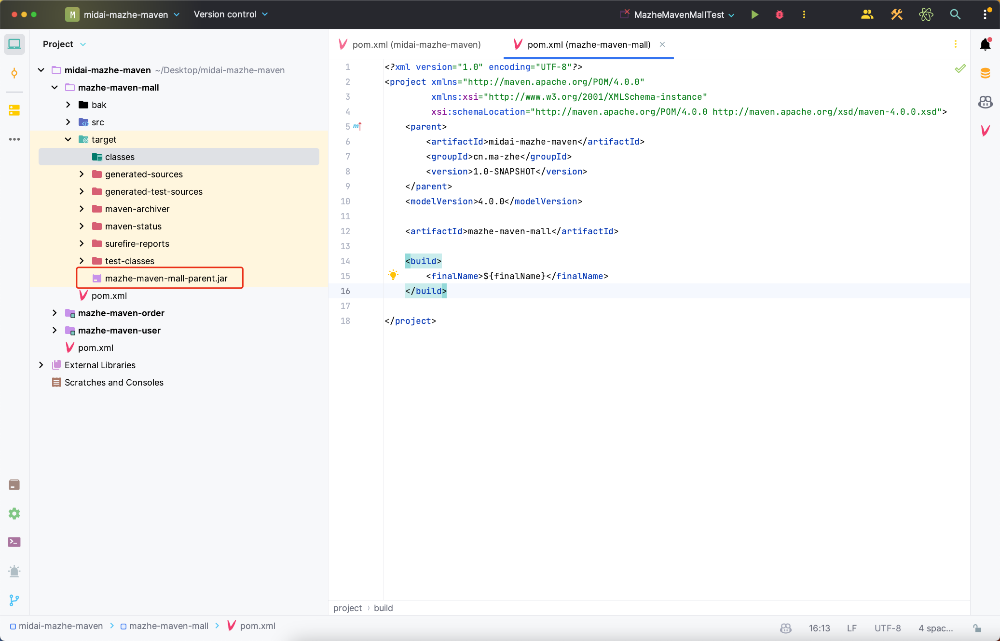](Maven 实战.assets/image-20241025174639516.png)

这就是Maven中的继承的功能，当然还有很多其它的属性标签，我们可以通过继承的方式，在父项目中配置，在下一篇中我们在详细的介绍。

  

# 十七、Maven 中的依赖管理

通过上一篇的介绍我们知道在Maven中有很多标签都是可以被继承的。其中`dependencies`标签就是当中的一个。并且我们也知道`dependencies`标签是配置项目的依赖的。那我们是不是可以在父pom中配置项目中的依赖，然后让子模块继承呢？这样就解决了重复配置依赖的问题了。我们的子项目就不需要配置依赖信息了。下面我们按照上面说的验证一下。我们在父项目中引入依赖，然后看子项目是否能自动继承这个依赖。

## 1、强制继承

*   pom.xml (父项目)

```xml
<?xml version="1.0" encoding="UTF-8"?>
<project xmlns="http://maven.apache.org/POM/4.0.0"
         xmlns:xsi="http://www.w3.org/2001/XMLSchema-instance"
         xsi:schemaLocation="http://maven.apache.org/POM/4.0.0 http://maven.apache.org/xsd/maven-4.0.0.xsd">
    <modelVersion>4.0.0</modelVersion>

    <groupId>cn.ma-zhe</groupId>
    <artifactId>midai-mazhe-maven</artifactId>
    <packaging>pom</packaging>
    <version>1.0-SNAPSHOT</version>
    <modules>
        <module>mazhe-maven-mall</module>
    </modules>

    <dependencies>
        <dependency>
            <groupId>junit</groupId>
            <artifactId>junit</artifactId>
            <version>4.12</version>
            <scope>test</scope>
        </dependency>
    </dependencies>

</project>
```

*   pom.xml（子项目）

```xml
<?xml version="1.0" encoding="UTF-8"?>
<project xmlns="http://maven.apache.org/POM/4.0.0"
         xmlns:xsi="http://www.w3.org/2001/XMLSchema-instance"
         xsi:schemaLocation="http://maven.apache.org/POM/4.0.0 http://maven.apache.org/xsd/maven-4.0.0.xsd">
    <parent>
        <artifactId>midai-mazhe-maven</artifactId>
        <groupId>cn.ma-zhe</groupId>
        <version>1.0-SNAPSHOT</version>
    </parent>
    <modelVersion>4.0.0</modelVersion>

    <artifactId>mazhe-maven-mall</artifactId>

</project>
```

我们之前的内容中分享了，如何在项目中通过Maven命令的方式查看项目依赖，下面我们使用一下。查询的命令有很多，我们这次使用`mvn dependency:tree`命令查看。首先我们先查看一下父项目的依赖情况。

*   midai-mazhe-maven

```bash
[INFO] Scanning for projects...
[INFO] ------------------------------------------------------------------------
[INFO] Reactor Build Order:
[INFO] 
[INFO] midai-mazhe-maven                                                  [pom]
[INFO] mazhe-maven-mall                                                   [jar]
[INFO] 
[INFO] --------------------< cn.ma-zhe:midai-mazhe-maven >---------------------
[INFO] Building midai-mazhe-maven 1.0-SNAPSHOT                            [1/2]
[INFO]   from pom.xml
[INFO] --------------------------------[ pom ]---------------------------------
[INFO] 
[INFO] --- dependency:3.6.0:tree (default-cli) @ midai-mazhe-maven ---
[INFO] cn.ma-zhe:midai-mazhe-maven:pom:1.0-SNAPSHOT
[INFO] \- junit:junit:jar:4.12:test
[INFO]    \- org.hamcrest:hamcrest-core:jar:1.3:test
[INFO] 
[INFO] ---------------------< cn.ma-zhe:mazhe-maven-mall >---------------------
[INFO] Building mazhe-maven-mall 1.0-SNAPSHOT                             [2/2]
[INFO]   from mazhe-maven-mall/pom.xml
[INFO] --------------------------------[ jar ]---------------------------------
[INFO] 
[INFO] --- dependency:3.6.0:tree (default-cli) @ mazhe-maven-mall ---
[INFO] cn.ma-zhe:mazhe-maven-mall:jar:1.0-SNAPSHOT
[INFO] \- junit:junit:jar:4.12:test
[INFO]    \- org.hamcrest:hamcrest-core:jar:1.3:test
[INFO] ------------------------------------------------------------------------
[INFO] Reactor Summary for midai-mazhe-maven 1.0-SNAPSHOT:
[INFO] 
[INFO] midai-mazhe-maven .................................. SUCCESS [  1.771 s]
[INFO] mazhe-maven-mall ................................... SUCCESS [  0.121 s]
[INFO] ------------------------------------------------------------------------
[INFO] BUILD SUCCESS
[INFO] ------------------------------------------------------------------------
[INFO] Total time:  2.298 s
[INFO] Finished at: 2023-08-09T06:02:02+08:00
[INFO] ------------------------------------------------------------------------
```

看上面输出的日志，我们看父项目中成功的引入了`junit`依赖了。下面我们用同样的方式，看一下子项目的依赖情况。

*   mazhe-maven-mall

```bash
[INFO] Scanning for projects...
[INFO] 
[INFO] ---------------------< cn.ma-zhe:mazhe-maven-mall >---------------------
[INFO] Building mazhe-maven-mall 1.0-SNAPSHOT
[INFO]   from pom.xml
[INFO] --------------------------------[ jar ]---------------------------------
[INFO] 
[INFO] --- dependency:3.6.0:tree (default-cli) @ mazhe-maven-mall ---
[INFO] cn.ma-zhe:mazhe-maven-mall:jar:1.0-SNAPSHOT
[INFO] \- junit:junit:jar:4.12:test
[INFO]    \- org.hamcrest:hamcrest-core:jar:1.3:test
[INFO] ------------------------------------------------------------------------
[INFO] BUILD SUCCESS
[INFO] ------------------------------------------------------------------------
[INFO] Total time:  2.132 s
[INFO] Finished at: 2023-08-09T06:05:59+08:00
[INFO] ------------------------------------------------------------------------
```

我们看子模块输出的日志信息，发现也成功的引入了`junit`依赖。这也就是Maven提供的继承的功能。


## 2、选择继承

但通过上面的验证，我们是否发现一个问题。如果父模块配置的依赖子模块不一定都会使用父模块的依赖，当有的子模块并不需要依赖这多么依赖时，但因为继承的原因就会导致子模块引入很多无用的依赖，但实际上子模块并不需要这些依赖，然后还需要添加额外的配置排除依赖，这样反而造成了麻烦。所以在Maven中配置依赖的时候，如果确定并不是所有的子模块都使用的依赖，我们可以不使用`dependencies`标签进行依赖的配置。Maven中提供了`dependencyManagement`标签，通过它依然可以控制子模块的依赖，但此标签和`dependencies`标签不同，它并不会实际引入依赖。而是如果子模块需要引入父模块的依赖时，可以按照正常的依赖方式引入，但是可以对部分参数进行忽略。下面我们看一下`dependencyManagement`标签具体的配置：

*   pom.xml（父项目）

```xml
<dependencyManagement>
    <dependencies>
        <dependency>
            <groupId>junit</groupId>
            <artifactId>junit</artifactId>
            <version>4.12</version>
        </dependency>
    </dependencies>
</dependencyManagement>
```

我们同样按照上面的方式看一下，通过`<dependencyManagement>`标签配置的依赖，子项目是否能成功的继承。

*   父项目日志

```bash
[INFO] Scanning for projects...
[INFO] ------------------------------------------------------------------------
[INFO] Reactor Build Order:
[INFO] 
[INFO] midai-mazhe-maven                                                  [pom]
[INFO] mazhe-maven-mall                                                   [jar]
[INFO] 
[INFO] --------------------< cn.ma-zhe:midai-mazhe-maven >---------------------
[INFO] Building midai-mazhe-maven 1.0-SNAPSHOT                            [1/2]
[INFO]   from pom.xml
[INFO] --------------------------------[ pom ]---------------------------------
[INFO] 
[INFO] --- dependency:3.6.0:tree (default-cli) @ midai-mazhe-maven ---
[INFO] cn.ma-zhe:midai-mazhe-maven:pom:1.0-SNAPSHOT
[INFO] 
[INFO] ---------------------< cn.ma-zhe:mazhe-maven-mall >---------------------
[INFO] Building mazhe-maven-mall 1.0-SNAPSHOT                             [2/2]
[INFO]   from mazhe-maven-mall/pom.xml
[INFO] --------------------------------[ jar ]---------------------------------
[INFO] 
[INFO] --- dependency:3.6.0:tree (default-cli) @ mazhe-maven-mall ---
[INFO] cn.ma-zhe:mazhe-maven-mall:jar:1.0-SNAPSHOT
[INFO] ------------------------------------------------------------------------
[INFO] Reactor Summary for midai-mazhe-maven 1.0-SNAPSHOT:
[INFO] 
[INFO] midai-mazhe-maven .................................. SUCCESS [  1.631 s]
[INFO] mazhe-maven-mall ................................... SUCCESS [  0.108 s]
[INFO] ------------------------------------------------------------------------
[INFO] BUILD SUCCESS
[INFO] ------------------------------------------------------------------------
[INFO] Total time:  2.147 s
[INFO] Finished at: 2023-08-09T06:34:02+08:00
[INFO] ------------------------------------------------------------------------
```

我们看父项目日志的输出，发现虽然我们配置了依赖，但是父项目并没有引入这个依赖。这个就是`<dependencyManagement>`标签的作用，它并不会在项目中直接引入依赖。下面我们验证一下子项目是否成引入这个依赖。

*   pom.xml（子项目）

```xml
<?xml version="1.0" encoding="UTF-8"?>
<project xmlns="http://maven.apache.org/POM/4.0.0"
         xmlns:xsi="http://www.w3.org/2001/XMLSchema-instance"
         xsi:schemaLocation="http://maven.apache.org/POM/4.0.0 http://maven.apache.org/xsd/maven-4.0.0.xsd">
    <parent>
        <artifactId>midai-mazhe-maven</artifactId>
        <groupId>cn.ma-zhe</groupId>
        <version>1.0-SNAPSHOT</version>
    </parent>
    <modelVersion>4.0.0</modelVersion>

    <artifactId>mazhe-maven-mall</artifactId>

</project>
```

同样输入查看依赖的命令，看子项目是否能成功的引入这个依赖。

*   子项目日志

```bash
[INFO] Scanning for projects...
[INFO] 
[INFO] ---------------------< cn.ma-zhe:mazhe-maven-mall >---------------------
[INFO] Building mazhe-maven-mall 1.0-SNAPSHOT
[INFO]   from pom.xml
[INFO] --------------------------------[ jar ]---------------------------------
[INFO] 
[INFO] --- dependency:3.6.0:tree (default-cli) @ mazhe-maven-mall ---
[INFO] cn.ma-zhe:mazhe-maven-mall:jar:1.0-SNAPSHOT
[INFO] ------------------------------------------------------------------------
[INFO] BUILD SUCCESS
[INFO] ------------------------------------------------------------------------
[INFO] Total time:  2.187 s
[INFO] Finished at: 2023-08-09T06:43:46+08:00
[INFO] ------------------------------------------------------------------------
```

我们通过日志发现通过`<dependencyManagement>`标签配置的依赖，父子项目都不会引入依赖。那么如何引入依赖呢？我们修改一下子项目的配置信息：

*   pom.xml (子项目)

```xml
<?xml version="1.0" encoding="UTF-8"?>
<project xmlns="http://maven.apache.org/POM/4.0.0"
         xmlns:xsi="http://www.w3.org/2001/XMLSchema-instance"
         xsi:schemaLocation="http://maven.apache.org/POM/4.0.0 http://maven.apache.org/xsd/maven-4.0.0.xsd">
    <parent>
        <artifactId>midai-mazhe-maven</artifactId>
        <groupId>cn.ma-zhe</groupId>
        <version>1.0-SNAPSHOT</version>
    </parent>
    <modelVersion>4.0.0</modelVersion>

    <artifactId>mazhe-maven-mall</artifactId>

    <dependencies>
        <dependency>
            <groupId>junit</groupId>
            <artifactId>junit</artifactId>
        </dependency>
    </dependencies>

</project>
```

我们再次执行一下查看依赖的命令，来看一下输出和上次是否会有不同。

*   子项目日志

```bash
[INFO] Scanning for projects...
[INFO] 
[INFO] ---------------------< cn.ma-zhe:mazhe-maven-mall >---------------------
[INFO] Building mazhe-maven-mall 1.0-SNAPSHOT
[INFO]   from pom.xml
[INFO] --------------------------------[ jar ]---------------------------------
[INFO] 
[INFO] --- dependency:3.6.0:tree (default-cli) @ mazhe-maven-mall ---
[INFO] cn.ma-zhe:mazhe-maven-mall:jar:1.0-SNAPSHOT
[INFO] \- junit:junit:jar:4.12:test
[INFO]    \- org.hamcrest:hamcrest-core:jar:1.3:test
[INFO] ------------------------------------------------------------------------
[INFO] BUILD SUCCESS
[INFO] ------------------------------------------------------------------------
[INFO] Total time:  2.134 s
[INFO] Finished at: 2023-08-09T06:46:38+08:00
[INFO] ------------------------------------------------------------------------
```

我们看上面的日志发现，虽然我们没有在子pom.xml中指定相应的版本，但它依然成功的引入该依赖，但实际上版本是Maven中必须要指定的参数，所以这就使用了Maven中继承的功能了，它继承了父项目中依赖的版本了。这也是`<dependencyManagement>`标的作用。当配置此标签时，并不会直接引入依赖，而是必须当我们子项目中指定引入具体的哪个依赖，才会引入，并且可以缺省相应的配置参数，也就是版本等信息。当然我们也可以指定其他的版本，这样就不会使用父类pom中指定的版本了，可以理解为子项目把父项目的配置覆盖了。

*   pom（子项目）

```xml
<?xml version="1.0" encoding="UTF-8"?>
<project xmlns="http://maven.apache.org/POM/4.0.0"
         xmlns:xsi="http://www.w3.org/2001/XMLSchema-instance"
         xsi:schemaLocation="http://maven.apache.org/POM/4.0.0 http://maven.apache.org/xsd/maven-4.0.0.xsd">
    <parent>
        <artifactId>midai-mazhe-maven</artifactId>
        <groupId>cn.ma-zhe</groupId>
        <version>1.0-SNAPSHOT</version>
    </parent>
    <modelVersion>4.0.0</modelVersion>

    <artifactId>mazhe-maven-mall</artifactId>

    <dependencies>
        <dependency>
            <groupId>junit</groupId>
            <artifactId>junit</artifactId>
            <version>4.13</version>
        </dependency>
    </dependencies>

</project>
```

在查看一下依赖的信息。

*   子项目日志

```bash
[INFO] Scanning for projects...
[INFO] 
[INFO] ---------------------< cn.ma-zhe:mazhe-maven-mall >---------------------
[INFO] Building mazhe-maven-mall 1.0-SNAPSHOT
[INFO]   from pom.xml
[INFO] --------------------------------[ jar ]---------------------------------
[INFO] 
[INFO] --- dependency:3.6.0:tree (default-cli) @ mazhe-maven-mall ---
[INFO] cn.ma-zhe:mazhe-maven-mall:jar:1.0-SNAPSHOT
[INFO] \- junit:junit:jar:4.13:test
[INFO]    \- org.hamcrest:hamcrest-core:jar:1.3:test
[INFO] ------------------------------------------------------------------------
[INFO] BUILD SUCCESS
[INFO] ------------------------------------------------------------------------
[INFO] Total time:  2.120 s
[INFO] Finished at: 2023-08-09T06:53:47+08:00
[INFO] ------------------------------------------------------------------------
```

我们看日志的信息，子项目成功的把父项目的继承的信息给覆盖了，这就是Maven中`<dependencyManagement>`标签的使用。

 

# 十八、Maven 中的默认约定

在之前的文章中我们介绍过Ant管理工具，通过Ant也是可以很方便的管理我们项目编译的。但Ant和Maven有着本质的区别，第一个区别就是Ant不支持管理项目的依赖。还有一个区别是Ant需要我们自己定义相应的目录与规则才可以实现项目编译的效果，而Maven则是通过插件的方式实现的。虽然Ant这种方式比较自由，但也带来了相应的弊端。例如重复性的建设，构建脚本不可重复使用等问题，因为不同的机器环境，指定的目录可能不一样。Maven为了解决上述的问题，制定了相应的默认规则，我们只要按照这个约定的规则来配置，Maven就可以自动的帮助我们进行项目的构建、编译、打包等功能，而不需要额外的配置。这也非常符合现在软件开发理念约定优于配置。下面我们详细了解一下Maven中都定义了哪些默认的约定。

| 默认约定           | 描述                 |
| ------------------ | -------------------- |
| src/main/java      | 项目源码目录         |
| target/classes     | 编译输出目录         |
| jar                | 打包方式             |
| target             | 包输出目录           |
| src/main/resources | 项目配置文件目录     |
| src/main/webapp    | web项目资源文件目录  |
| src/test/java      | 项目测试源码目录     |
| src/test/resources | 项目测试配置文件目录 |

下面我们通过代码测试一下，我们以`mazhe-maven-mall`项目为例来验证一下，我们先看一下`mazhe-maven-mall`项目的配置。

*   pom.xml（mazhe-maven-mall）

```xml
<?xml version="1.0" encoding="UTF-8"?>
<project xmlns="http://maven.apache.org/POM/4.0.0"
         xmlns:xsi="http://www.w3.org/2001/XMLSchema-instance"
         xsi:schemaLocation="http://maven.apache.org/POM/4.0.0 http://maven.apache.org/xsd/maven-4.0.0.xsd">
    <parent>
        <artifactId>midai-mazhe-maven</artifactId>
        <groupId>cn.ma-zhe</groupId>
        <version>1.0-SNAPSHOT</version>
    </parent>
    <modelVersion>4.0.0</modelVersion>

    <artifactId>mazhe-maven-mall</artifactId>

</project>
```

*   MazheMavenMall

```java
public class MazheMavenMall {
    public static void main(String[] args) throws Exception {
        System.out.println("Hello World Mazhe Maven Mall!");
    }
}
```

*   日志

```
Hello World Mazhe Maven Mall!
```

*   项目目录

[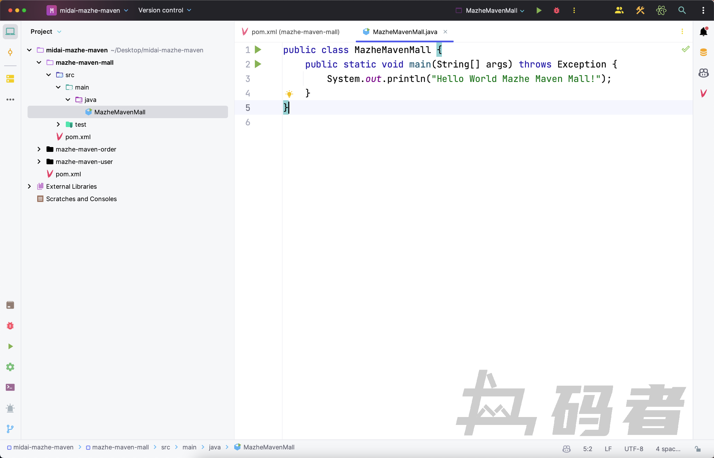](Maven 实战.assets/image-20241025174639517.png)

下面我们通过下面的配置修改一下项目的源码目录，具体配置如下：

*   pom.xml（mazhe-maven-mall）

```xml
<?xml version="1.0" encoding="UTF-8"?>
<project xmlns="http://maven.apache.org/POM/4.0.0"
         xmlns:xsi="http://www.w3.org/2001/XMLSchema-instance"
         xsi:schemaLocation="http://maven.apache.org/POM/4.0.0 http://maven.apache.org/xsd/maven-4.0.0.xsd">
    <parent>
        <artifactId>midai-mazhe-maven</artifactId>
        <groupId>cn.ma-zhe</groupId>
        <version>1.0-SNAPSHOT</version>
    </parent>
    <modelVersion>4.0.0</modelVersion>

    <artifactId>mazhe-maven-mall</artifactId>

    <build>
        <sourceDirectory>java</sourceDirectory>
    </build>

</project>
```

当我们配置上面的信息后，发现之前可以执行的`MazheMavenMall`类已经执行不了。

[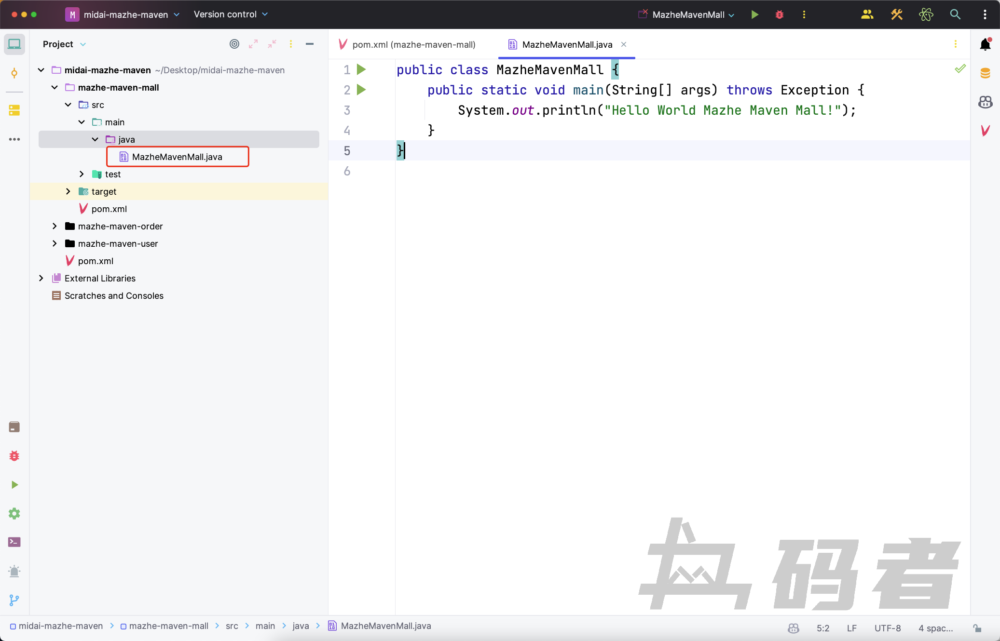](Maven 实战.assets/image-20241025174639518.png)

因为现在这个类的目录已经不是源码目录了，下面我们将上面的类换一个路径，放到java目录中。

[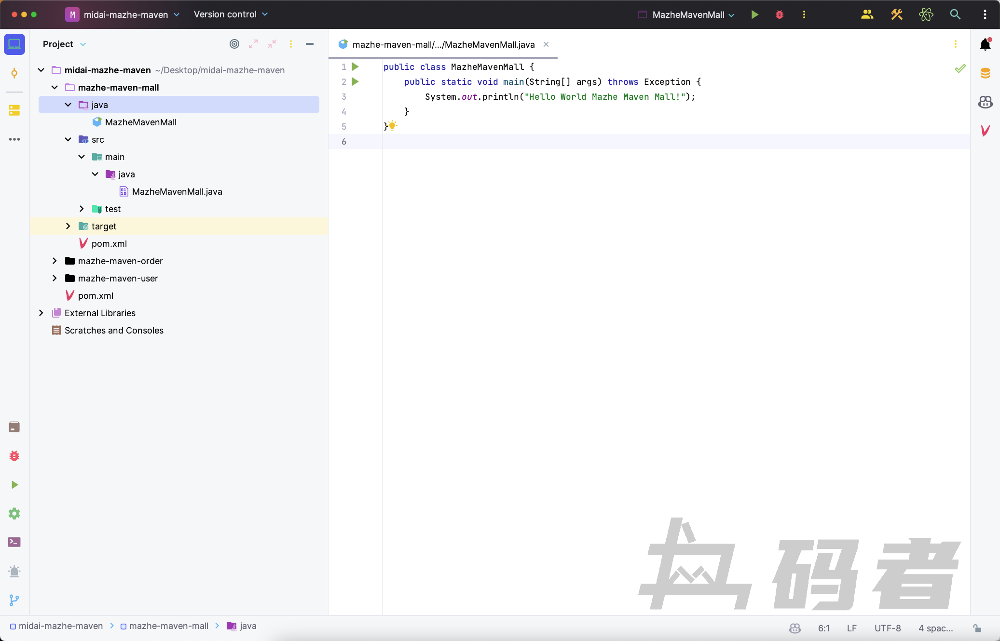](Maven 实战.assets/image-20241025174639519.png)

看上图所示，上面的Java类以可以执行了，下面我们执行测试一下。

*   日志

```
Hello World Mazhe Maven Mall!
```

看上面的日志输出，成功的执行了`MazheMavenMall`类的代码，这也就说明了我们通过上面的的配置，已经成功的将Maven的源码目录由`src/main/java`修改为了`java`。

* * *

下面是默认约定与配置标签映射的关系。

| 默认约定           | 配置标签                                      |
| ------------------ | --------------------------------------------- |
| src/main/java      | `<sourceDirectory></sourceDirectory>`         |
| target/classes     | `<outputDirectory></outputDirectory>`         |
| jar                | `<packaging></packaging>`                     |
| target             | `<directory></directory>`                     |
| src/main/resources | `<resources></resources>`                     |
| src/test/java      | `<testSourceDirectory></testSourceDirectory>` |
| src/test/resources | `<testResources></testResources>`             |

虽然Maven提供了以上的功能实现了，我们可以自定义修改Maven默认的配置，但在实际的开发中，并不推荐这样做，因为这样会造成误解，特别是熟悉Maven的人来说，可以会觉的，咦，源码哪去了？这样的疑问。所以只有在一些特殊情况下，才可以这么做。

  

# 十九、Maven 多模块构建

1、多模块构建顺序
---------

在Maven聚合那篇文章中我们介绍了可以通过父模块来管理子模块，并且我们也介绍了，如果项目是多模块构建的，在构建的时候， 是有默认构建顺序的。例如一个项目中有三个模块分别为：A、B、C。期中A依赖于项目B。那我们在父项目中执行构建命令时，Maven并不会按照我们声明的顺序构建执行，而是按照项目的依赖顺序构建的。也就是上面说的A依赖B，所以不管我们项目中如何配置顺序，Maven在构建的顺序一定是先构建B，然后在构建A。而至于模块C由于没有任何依赖，所以此项目将按照我们pom.xml中配置的顺序进行构建。这也是Maven执行构建的规则。


2、指定模块构建
--------

在实际的项目开发中，由于不同的模块承担的角色不同，可能需要单独打包部署，或者需要我们构建指定的模块进行打包，那应该如何做呢？有一种办法非常的简单，例如我们只要单独执行这个子模块的pom.xml就可以了。但是如果我们这个项目的模块比较多。我们就需要进入到每一个子模块中去构建我们的项目。并且在实际的项目中，项目的构建都是通过构建软件执行的，例如：jenkins等。并且通常一个项目，都会配置一个构建脚本。如果我们想指定构建不同的子模块，则需要在编写相应的脚本来支持，也就是通过不同子模块的pom.xml进行打包。虽然按照上面的方式，可以实现构建不同子模块打包的目的，但是操作起来则比较麻烦。 Maven为了方便我们实现上面的功能提供了裁剪的功能也就是对我们这一个整个项目进行裁剪，裁剪后的项目，就可以理解为我们想要打包的子模块。这样就可以很方便的构建我们指定的模块了，并且这种方式可以提高项目打包的效率，虽然我们是在父项目中执行的项目构建，但是因为裁剪，实际上执行的，就是我们指定的子模块的打包。为了支持不同种场景裁剪，所以Maven会按照以下的规则实现上述的功能，下面我们详细介绍一下。


### 1、-pl 参数构建

*   \-pl：projects＜arg＞构建指定的模块，模块间用逗号分隔

这是什么意思呢？别着急我们通过下面的例子来演示一下，我们还是以`midai-mazhe-maven`项目为例子，它是父项目包括以下3个子模块，分别为`mazhe-maven-mall、mazhe-maven-order、mazhe-maven-user`。其中项目`mazhe-maven-user`依赖于项目`mazhe-maven-order`。下面是项目pom.xml配置。

*   pom.xml（midai-mazhe-maven）

```xml
<?xml version="1.0" encoding="UTF-8"?>
<project xmlns="http://maven.apache.org/POM/4.0.0"
         xmlns:xsi="http://www.w3.org/2001/XMLSchema-instance"
         xsi:schemaLocation="http://maven.apache.org/POM/4.0.0 http://maven.apache.org/xsd/maven-4.0.0.xsd">
    <modelVersion>4.0.0</modelVersion>

    <groupId>cn.ma-zhe</groupId>
    <artifactId>midai-mazhe-maven</artifactId>
    <packaging>pom</packaging>
    <version>1.0-SNAPSHOT</version>
    <modules>
        <module>mazhe-maven-user</module>
        <module>mazhe-maven-mall</module>
        <module>mazhe-maven-order</module>
    </modules>
</project>
```

*   pom.xml（mazhe-maven-mall）

```xml
<?xml version="1.0" encoding="UTF-8"?>
<project xmlns="http://maven.apache.org/POM/4.0.0"
         xmlns:xsi="http://www.w3.org/2001/XMLSchema-instance"
         xsi:schemaLocation="http://maven.apache.org/POM/4.0.0 http://maven.apache.org/xsd/maven-4.0.0.xsd">
    <parent>
        <artifactId>midai-mazhe-maven</artifactId>
        <groupId>cn.ma-zhe</groupId>
        <version>1.0-SNAPSHOT</version>
    </parent>
    <modelVersion>4.0.0</modelVersion>
    <artifactId>mazhe-maven-mall</artifactId>

</project>
```

*   pom.xml（mazhe-maven-order）

```xml
<?xml version="1.0" encoding="UTF-8"?>
<project xmlns="http://maven.apache.org/POM/4.0.0"
         xmlns:xsi="http://www.w3.org/2001/XMLSchema-instance"
         xsi:schemaLocation="http://maven.apache.org/POM/4.0.0 http://maven.apache.org/xsd/maven-4.0.0.xsd">
    <parent>
        <artifactId>midai-mazhe-maven</artifactId>
        <groupId>cn.ma-zhe</groupId>
        <version>1.0-SNAPSHOT</version>
    </parent>
    <modelVersion>4.0.0</modelVersion>

    <artifactId>mazhe-maven-order</artifactId>
</project>
```

*   pom.xml（mazhe-maven-user）

```xml
<?xml version="1.0" encoding="UTF-8"?>
<project xmlns="http://maven.apache.org/POM/4.0.0"
         xmlns:xsi="http://www.w3.org/2001/XMLSchema-instance"
         xsi:schemaLocation="http://maven.apache.org/POM/4.0.0 http://maven.apache.org/xsd/maven-4.0.0.xsd">
    <parent>
        <artifactId>midai-mazhe-maven</artifactId>
        <groupId>cn.ma-zhe</groupId>
        <version>1.0-SNAPSHOT</version>
    </parent>
    <modelVersion>4.0.0</modelVersion>

    <artifactId>mazhe-maven-user</artifactId>

    <dependencies>
        <dependency>
            <groupId>cn.ma-zhe</groupId>
            <artifactId>mazhe-maven-order</artifactId>
            <version>1.0-SNAPSHOT</version>
        </dependency>
    </dependencies>
</project>
```

下面我们在父项目的目录中执行一下，上面的命令，来验证一下效果。我们之前学习过，如果在项目的父项目中直接执行`mvn clean install`命令，Maven会按照我们父项目中所有配置的子模块开始构建，但当我们指定`-pl`参数时，Maven则只会按照我们配置的子模块名字进行构建,多个子模块用逗号分割。具体命令如下：

*   命令

```bash
mvn clean install -pl mazhe-maven-mall,mazhe-maven-order
```

*   日志

```bash
[INFO] ------------------------------------------------------------------------
[INFO] Reactor Summary for mazhe-maven-order 1.0-SNAPSHOT:
[INFO] 
[INFO] mazhe-maven-order .................................. SUCCESS [  2.350 s]
[INFO] mazhe-maven-mall ................................... SUCCESS [  0.133 s]
[INFO] ------------------------------------------------------------------------
[INFO] BUILD SUCCESS
```

看上面的日志输出，通过`-pl`参数设置，我们在执行编译时，项目就只会按照我们设置的模块进行构建了，这也就是裁剪的作用。


### 2、-am 参数构建

*   \-am：also-make 同时构建所列模块的依赖模块

下面我们还是通过`-pl`参数设置，只是这次我们构建的项目是`mazhe-maven-user`和`mazhe-maven-mall`，具体命令如下。

*   命令

```bash
mvn clean install -pl mazhe-maven-user,mazhe-maven-mall
```

*   日志

```bash
[INFO] ------------------------------------------------------------------------
[INFO] Reactor Summary for mazhe-maven-user 1.0-SNAPSHOT:
[INFO] 
[INFO] mazhe-maven-user ................................... FAILURE [  0.286 s]
[INFO] mazhe-maven-mall ................................... SKIPPED
[INFO] ------------------------------------------------------------------------
[INFO] BUILD FAILURE
[INFO] ------------------------------------------------------------------------
[INFO] Total time:  0.410 s
[INFO] Finished at: 2023-08-14T06:33:48+08:00
[INFO] ------------------------------------------------------------------------
[ERROR] Failed to execute goal on project mazhe-maven-user: Could not resolve dependencies for project cn.ma-zhe:mazhe-maven-user:jar:1.0-SNAPSHOT: The following artifacts could not be resolved: cn.ma-zhe:mazhe-maven-order:jar:1.0-SNAPSHOT (absent): Could not find artifact cn.ma-zhe:mazhe-maven-order:jar:1.0-SNAPSHOT -> [Help 1]
[ERROR] 
[ERROR] To see the full stack trace of the errors, re-run Maven with the -e switch.
[ERROR] Re-run Maven using the -X switch to enable full debug logging.
[ERROR] 
[ERROR] For more information about the errors and possible solutions, please read the following articles:
[ERROR] [Help 1] http://cwiki.apache.org/confluence/display/MAVEN/DependencyResolutionException
```

我们看这次执行的命令虽然和上面的是一样的，但是由于我们构建的项目不同，构建日志居然报错了，那么为什么会报错呢？这是因为我们项目中有依赖，因为项目`mazhe-maven-user`依赖于项目`mazhe-maven-order`。所以上面的日志报错了。但是如果我们每次执行时候，都需要考虑项目的依赖顺序，那么太麻烦了。所以Maven为了方便我们执行裁剪，提供了`-am`参数，当指定了该参数后，Maven会自动将我们指定构建的模块的依赖模块也一同构建。下面我们试一下，具体命令如下：

*   命令

```bash
mvn clean install -pl mazhe-maven-user,mazhe-maven-mall -am
```

*   日志

```bash
[INFO] ------------------------------------------------------------------------
[INFO] Reactor Summary for midai-mazhe-maven 1.0-SNAPSHOT:
[INFO] 
[INFO] midai-mazhe-maven .................................. SUCCESS [  0.461 s]
[INFO] mazhe-maven-order .................................. SUCCESS [  1.956 s]
[INFO] mazhe-maven-user ................................... SUCCESS [  0.144 s]
[INFO] mazhe-maven-mall ................................... SUCCESS [  0.113 s]
[INFO] ------------------------------------------------------------------------
[INFO] BUILD SUCCESS
[INFO] ------------------------------------------------------------------------
```

这样我们就解决了项目打包依赖顺序的问题了。


### 3、-amd 参数构建

*   -amd：also-make-dependents同时构建依赖于所列模块的模块

下面我们介绍一下`-amd`参数，`-amd`参数和`am`的区别是，后者会在构建的时候，自动将依赖的模块进行构建。而前者的作用则是，在构建的时候，自动构建依赖于这个模块的模块。

*   命令

```bash
mvn clean install -pl mazhe-maven-order -amd
```

*   日志

```bash
[INFO] Reactor Summary for mazhe-maven-order 1.0-SNAPSHOT:
[INFO] 
[INFO] mazhe-maven-order .................................. SUCCESS [  2.369 s]
[INFO] mazhe-maven-user ................................... SUCCESS [  0.123 s]
[INFO] ------------------------------------------------------------------------
[INFO] BUILD SUCCESS
[INFO] ------------------------------------------------------------------------
```

我们看上面的日志输出，我们知道项目`mazhe-maven-user`依赖于项目`mazhe-maven-order`。所以通过`-amd`参数编译时，Maven会将依赖这个模块的其它模块一同构建，所以上面会有项目`mazhe-maven-user`的构建信息，这就是参数`-amd`和`-am`的区别。


### 4、-rf 参数构建

*   \-rf：resume-from＜arg＞从指定的模块回复反应堆

下面我们在介绍一下最后的参数`-rf`。通过该参数我们可以在构建的顺序中继续进行裁剪，也就是按照我们指定的顺序裁剪，之前的则会省略。例如我们先执行下面的命令。

*   命令

```bash
mvn clean install
```

*   日志

```bash
[INFO] midai-mazhe-maven .................................. SUCCESS [  0.446 s]
[INFO] mazhe-maven-order .................................. SUCCESS [  1.854 s]
[INFO] mazhe-maven-user ................................... SUCCESS [  0.140 s]
[INFO] mazhe-maven-mall ................................... SUCCESS [  0.150 s]
```

我们我们添加一下`-rf`参数，在看一下输出的日志。

*   命令

```bash
mvn clean install -rf mazhe-maven-mall
```

*   日志

```bash
[INFO] Installing /Users/md/Desktop/midai-mazhe-maven/mazhe-maven-mall/target/mazhe-maven-mall-1.0-SNAPSHOT.jar to /Users/md/.m2/repository/cn/ma-zhe/mazhe-maven-mall/1.0-SNAPSHOT/mazhe-maven-mall-1.0-SNAPSHOT.jar
[INFO] ------------------------------------------------------------------------
[INFO] BUILD SUCCESS
[INFO] ------------------------------------------------------------------------
[INFO] Total time:  2.518 s
[INFO] Finished at: 2023-08-14T07:10:12+08:00
[INFO] ------------------------------------------------------------------------
```

看上面的日志信息，按照打包的顺序，我们指定了 `mazhe-maven-mall`项目，并且因为该项目是最后一个项目，所以通过上面的命令打包，Maven只会编译这一个项目，而其它的项目则会忽略。


# 二十、Nexus 创建私服

1、Nexus 是什么
----------

在之前Maven仓库的文章中，我们介绍了有关私服的内容，今天我们介绍一下如何搭建一个私服。搭建私服有很多种软件支持，例如Apache的Archiva 、JFrog的Artifactory和Sonatype的Nexus。这里我们使用Nexus来搭建私服，因为它是搭建私服最简单也是最流行的一个Maven仓库管理软件。并且它还提供了非常友好的管理界面、支持代理仓库、仓库索引和搜索、并且还支持通过界面上传Maven构建组建以及支持细颗粒度的安全控制等功能。


2、Nexus 的安装
---------

下面我们介绍一下如何安装Nexus。首先我们访问一下Nexus的官方地址：

- https://www.sonatype.com/products/sonatype-nexus-oss-download

[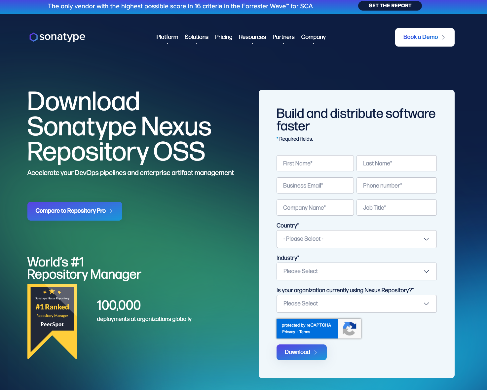](Maven 实战.assets/image-20241025174639520.png)

当我们访问完上面的地址后，需要我们填写相关的信息，才可以下载，这里就按照指定的要求填写即可。注意最后一个选项，我们要选择`Nexus Repo OSS`，因为这个版本是免费的。

[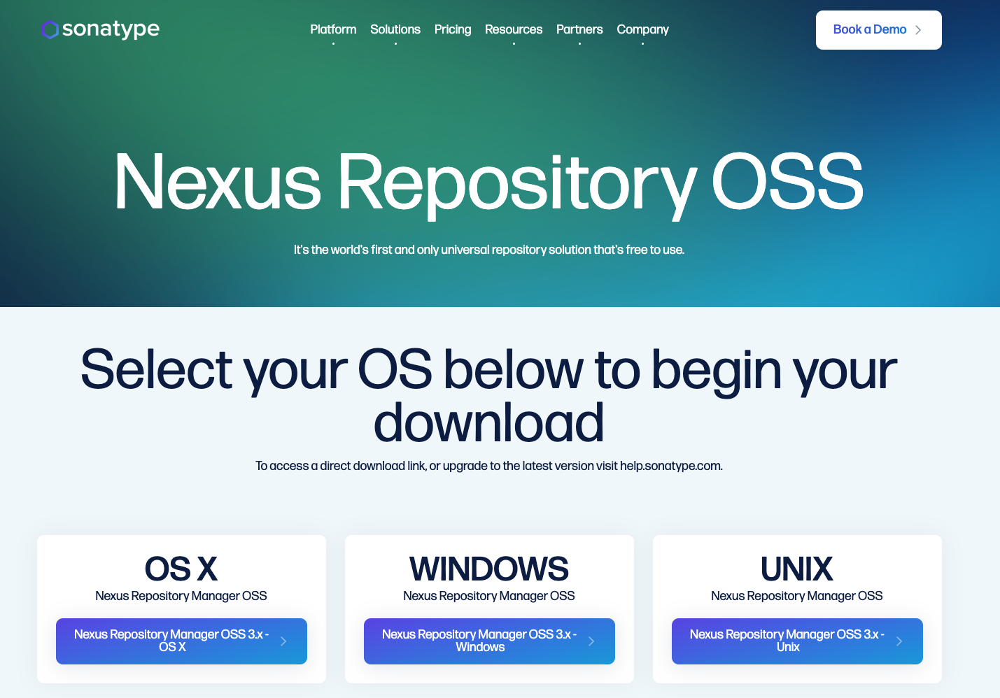](Maven 实战.assets/image-20241025174639521.png)

当我们提交完后，页面会跳转到下载的页面，我们按照上图所示下载对应的系统版本即可。

[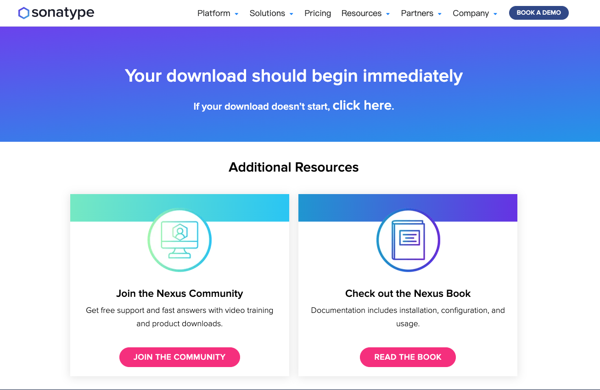](Maven 实战.assets/image-20241025174639522.png)

当我们点击完后，正常情况下，浏览器就会下载我们选择的系统版本，如果浏览器没有自动下载的话，我们可以手动点击`click here`链接下载。

下载完成后，我们直接解压下载的压缩包，就会得到以下目录的信息。

[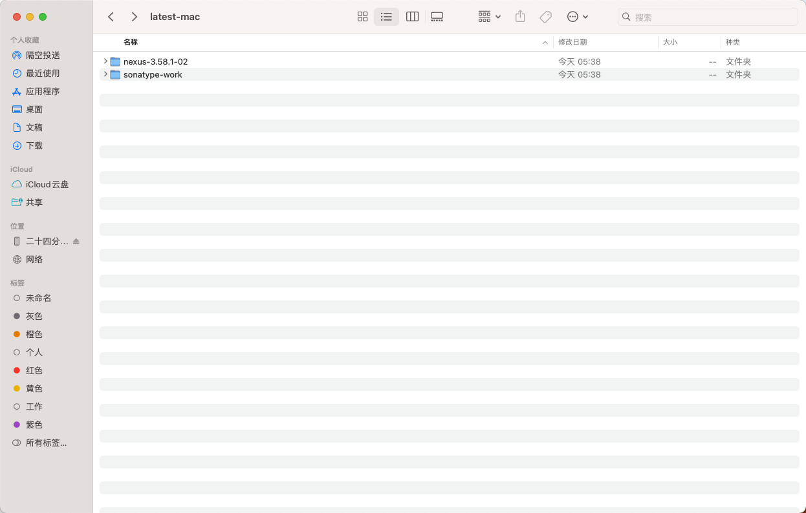](Maven 实战.assets/image-20241025174639523.png)

再次进入`nexus-3.58.1-02`目录中即可。

[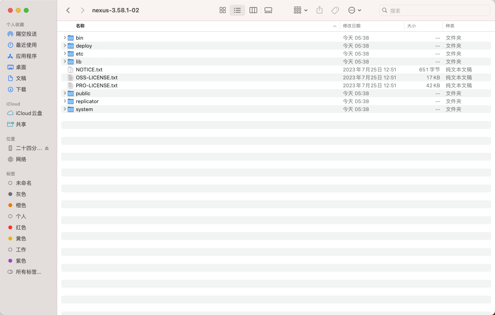](Maven 实战.assets/image-20241025174639524.png)

下面我们重点介绍一下`bin`目录。

[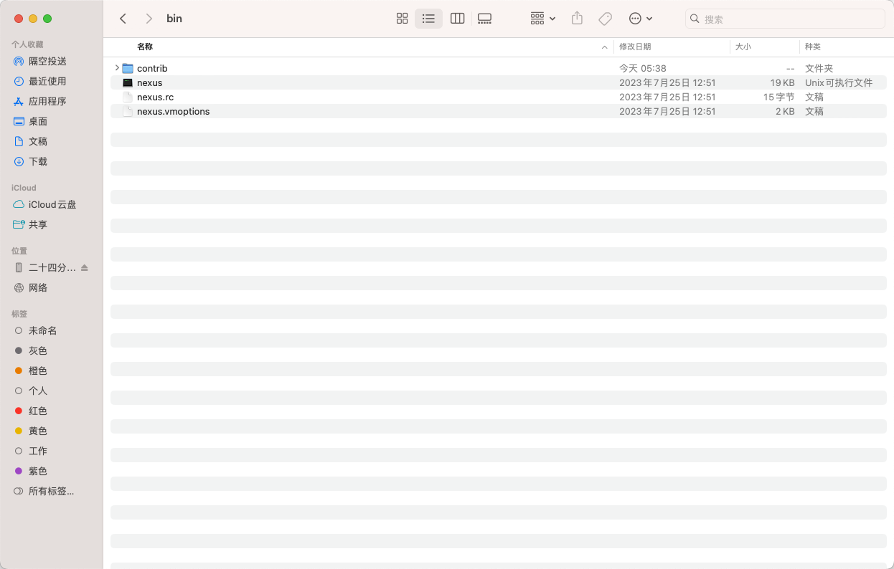](Maven 实战.assets/image-20241025174639525.png)

如上图所示，上面的目录中只有一个命令，但它却有很多启动的参数，下面我们详细分别介绍一下，具体的作用。

*   start：后台启动Nexus服务
*   stop：停止Nexus服务
*   run：控制台启动Nexus服务
*   status：查询Nexus服务状态
*   restart：重启Nexus服务

按照上面的命令，我们执行以下命令启动Nexus。

```
> sh nexus start
```

[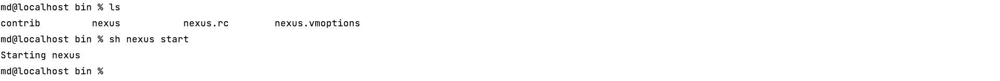](Maven 实战.assets/image-20241025174639526.png)

看日志提示我们启动成功了，下面我们访问一下Nexus管理界面，Nexus的默认访问地址如下：

```
http://localhost:8081
```

[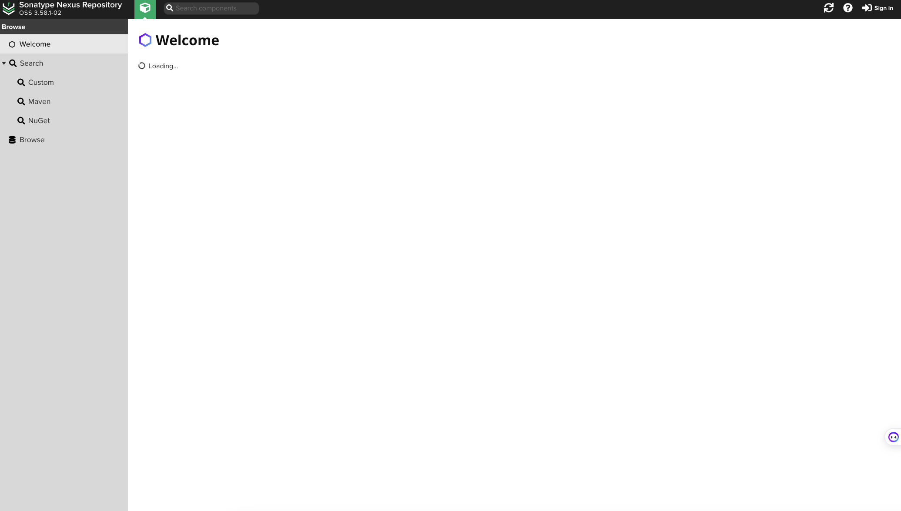](Maven 实战.assets/image-20241025174639527.png)

上图所示就是Nexus的管理界面，当我们成功的访问了此界面，也就说明了，我们Nexus启动成功了。但现在我们只能浏览，还不能执行具体的操作，因为我们还没有登陆，没有相应的权限。这也就是之前介绍的Nexus提供了细颗粒度的安全控制等功能。下面我们登陆一下，点击右上角的`Sign in`链接。

[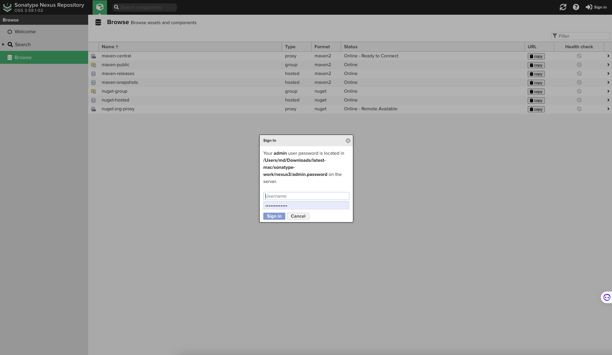](Maven 实战.assets/image-20241025174639528.png)

当我们不知道管理密码是什么的时候，我们发现Nexus已经默认提示出了密码的默认位置。也就上图所示的路径。

```
Users/md/Downloads/latest-mac/sonatype-work/nexus3/admin.password 
```

实际上上面的路径，也就是我们在解压目录中和`nexus-3.58.1-02`同级的目录。

[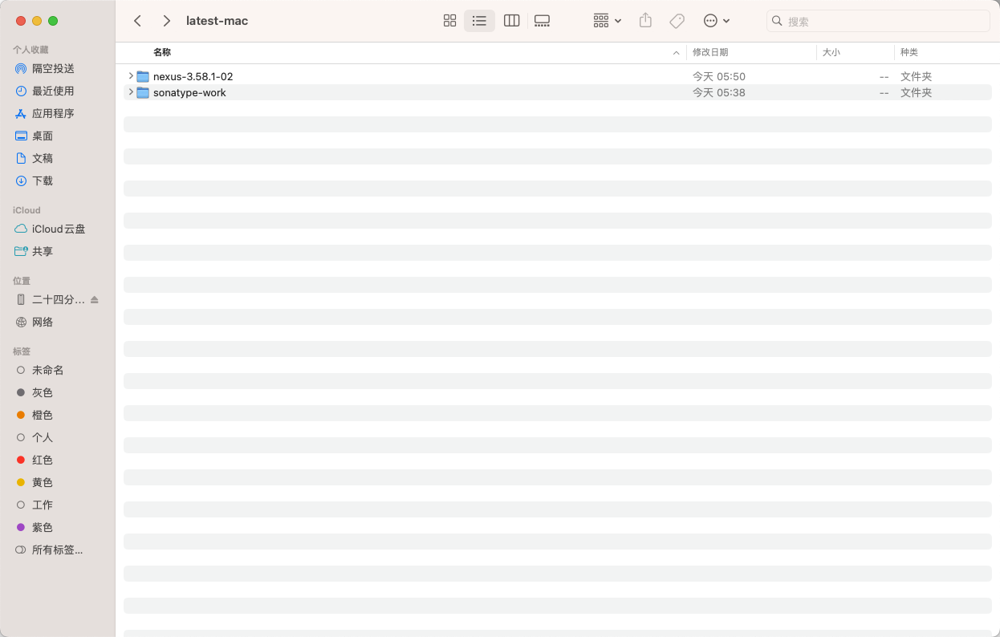](Maven 实战.assets/image-20241025174639529.png)

下面我们查看一下`admin.password`文件中的内容。

*   admin.password

```
8bcdb930-8817-4ff8-90b7-4c5ee0c43518
```

上述的文件中只有一行内容，也就是管理员的密码，Nexus并不会生成管理账号，Nexus默认的管理员账号为：`admin`。下面我们使用上面的密码登陆一下`Nexus`。

[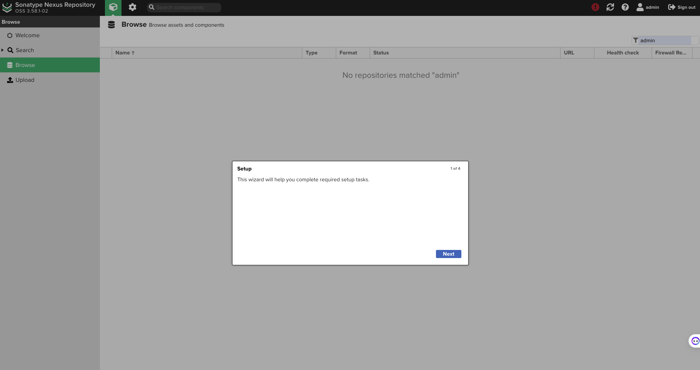](Maven 实战.assets/image-20241025174639530.png)

[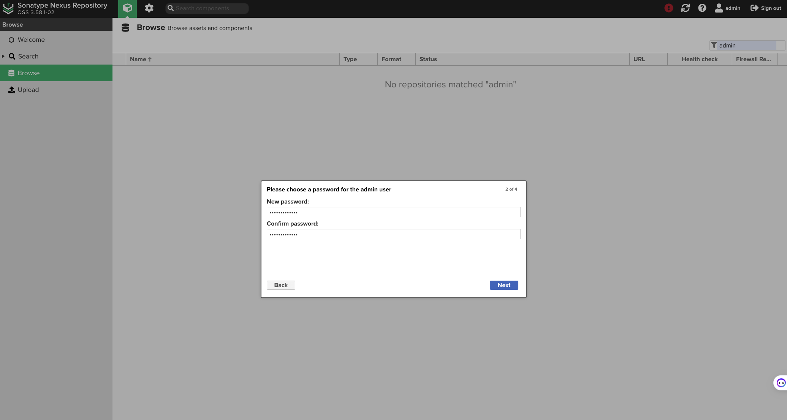](Maven 实战.assets/image-20241025174639531.png)

当我们输入完正确的账号和密码后Nexus会提示，我们修改管理员的密码，并且只会提示我们修改一次，具体步骤如上图所示。

[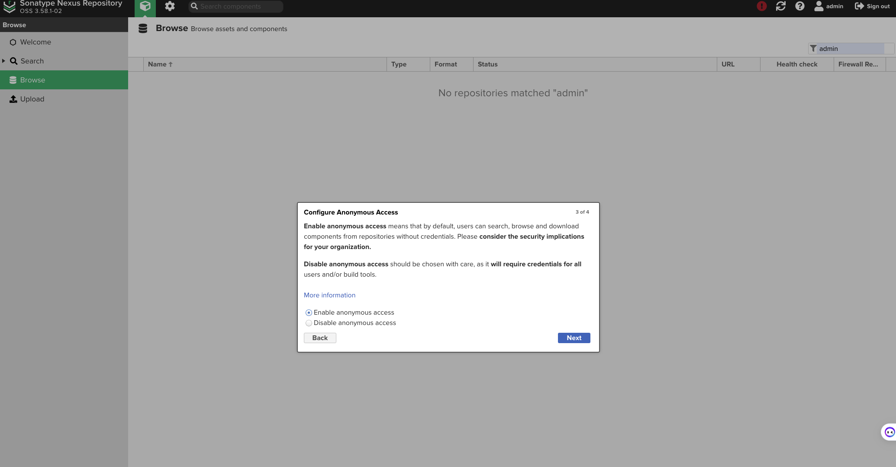](Maven 实战.assets/image-20241025174639532.png)

我们可以通过上图中的这个选项，来决定是否可以匿名访问，也就是在不需要登陆的时候，下载我们私服中的依赖组件。

[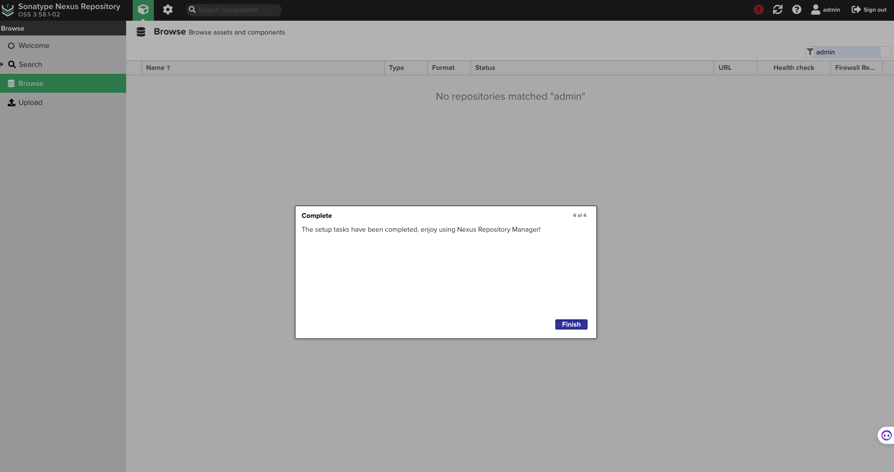](Maven 实战.assets/image-20241025174639533.png)

* * *

当我们修改完密码后，可以点击左边`Browse`菜单，来查看Nexus中默认的仓库信息，也就是下图列表中显示的那些内容。在Nexus中不同的仓库，有着不的效果和特性，在后续的内容中我们在做详细的介绍，以上内容就是如何通过`Nexus`搭建一个Maven私服。

[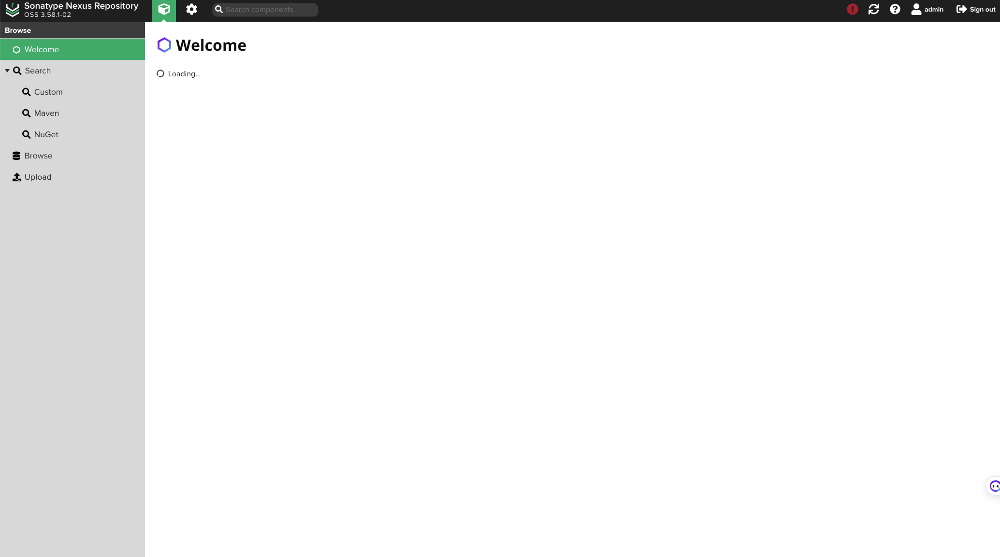](Maven 实战.assets/image-20241025174639534.png)

  

# 二十一、Nexus 中的仓库

在上一篇中我们介绍了Nexus中有关安装的内容，并且也简单介绍了Nexus中有很多仓库。在这一篇中我们将详细介绍一下有关Nexus中仓库的内容。我们知道Nexus的目的就是方便我们管理[Maven](https://ma-zhe.cn/tag/maven "查看所有文章关于 Maven")的组件。但Maven的组件非常多。为了更好的方便管理，Nexus内置了很多种仓库类型。主要包括代理仓库、宿主仓库和仓库组等。并且每一种仓库都提供了特有的特征，方便我们不同场景的使用。下面我们详细介绍一下它们之间的区别。


1、内置的仓库
-------

在Nexus中有很多内置的仓库，既然是内置仓库，所以很容易理解就是Nexus为我们默认创建的仓库。它们主要包括以下几种：

*   Maven Central：该仓库代理Maven中央仓库，其策略为Release，因此只会下载和缓存中央仓库中的发布版本构件。
*   Releases：这是一个策略为Release的宿主类型仓库，用来部署组织内部的发布版本构件。
*   Snapshots：这是一个策略为Snapshot的宿主类型仓库，用来部署组织内部的快照版本构件。
*   3rd party：这是一个策略为Release的宿主类型仓库，用来部署无法从公共仓库获得的第三方发布版本构件。
*   Apache Snapshots：这是一个策略为Snapshot的代理仓库，用来代理Apache Maven仓库的快照版本构件。
*   Codehaus Snapshots：这是一个策略为Snapshot的代理仓库，用来代理Codehaus Maven仓库的快照版本构件。
*   Google Code：这是一个策略为Release的代理仓库，用来代理Google Code Maven仓库的发布版本构件。
*   ava.net-Maven 2：这是一个策略为Release的代理仓库，用来代理java.net Maven仓库的发布版本构件。
*   Public Repositories：该仓库组将上述所有策略为Release的仓库聚合并通过一致的地址提供服务。
*   Public Snapshot Repositories：该仓库组将上述所有策略为Snapshot的仓库聚合并通过一致的地址提供服务。


2、仓库的分类
-------

上面的内容就是Nexus中内置仓库，通过下图，我们发现这些不同的内置仓库中有一些属性是不一样的。

[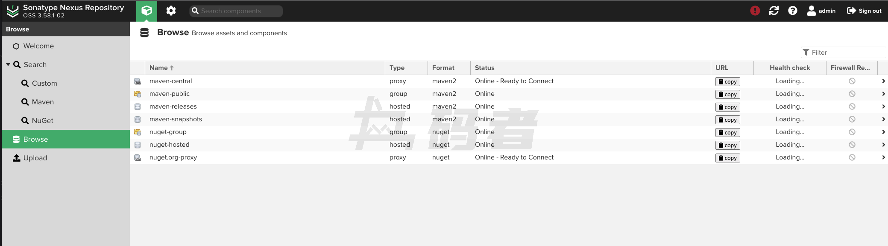](Maven 实战.assets/image-20241025174639535.png)

下面我们按照上图所示，介绍一下上面列表中的属性含义。

*   Name: 也就是内置仓库的名称。
*   Type: 此属性为内置仓库的类型，在Nexus中一共有4中类型，它们分别是。
    *   group:仓库组，用来聚合其它仓库的，本身不提供组件下载的能力，通过代理其它仓库提供能力，通过仓库组可以对外提供统一的地址，方便我们配置。
    *   hosted：宿主仓库，也就是本地仓库，通常用来部署本地项目或者本公司的依赖。
    *   proxy：代理仓库，可以用来代理远程的公共仓库，例如Maven的中央仓库，或者是阿里云的仓库。
    *   virtual：虚拟仓库，最初是为了兼容Maven 1而设计的，但现在通过虚拟仓库，可以聚合多个本地仓库，并支持缓存，数据复制，版本控制等功能。
*   Format: 仓库的格式，主要有maven2、maven1和nuget。


3、创建新仓库
-----------

下面我们介绍一下，如何通过Nexus创建仓库。

### 3.1、创建 Nexus 宿主仓库

首先我们先看一下，如何创建宿主仓库。我们需要登陆管理员账号，否者将看不到配置的选项。

[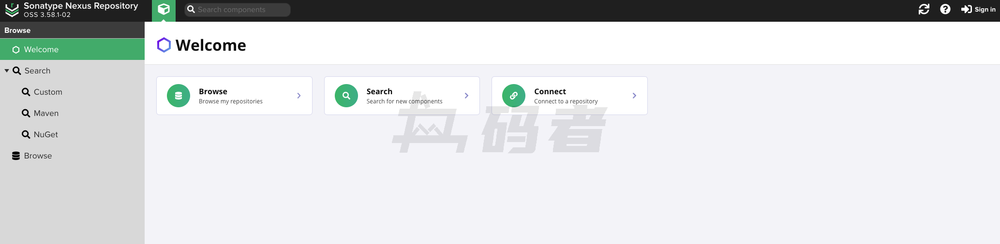](Maven 实战.assets/image-20241025174639536.png)

我们使用管理员账号登陆之后，会发现最上面多了一个齿轮的小图标，我们点击一下这个齿轮图标的链接。

[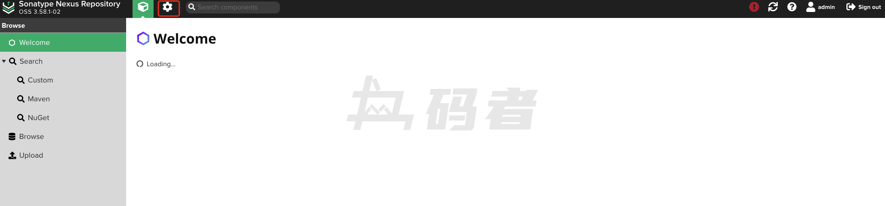](Maven 实战.assets/image-20241025174639537.png)

点击完成后，我们选择`Repositories`链接，这里我们可以选择左边菜单的链接，也可以选择上面的快捷导航，这里我选择的是快捷导航。

[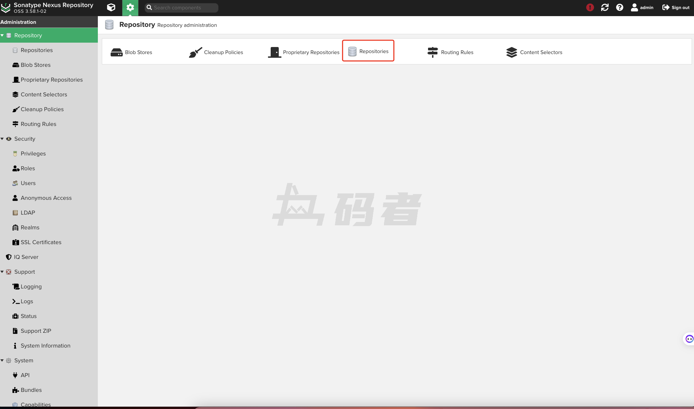](Maven 实战.assets/image-20241025174639538.png)

点击完成后，我们会看到我们之前看到的Nexus中内置的所有仓库的列表信息。

[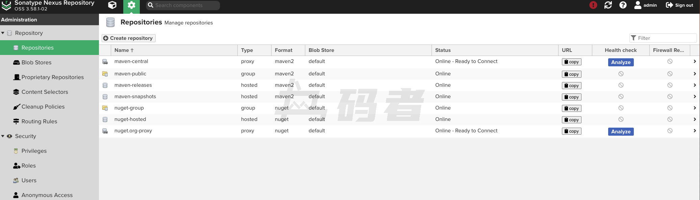](Maven 实战.assets/image-20241025174639539.png)

然后我们点击左边的`Create Repositories` 按钮。

[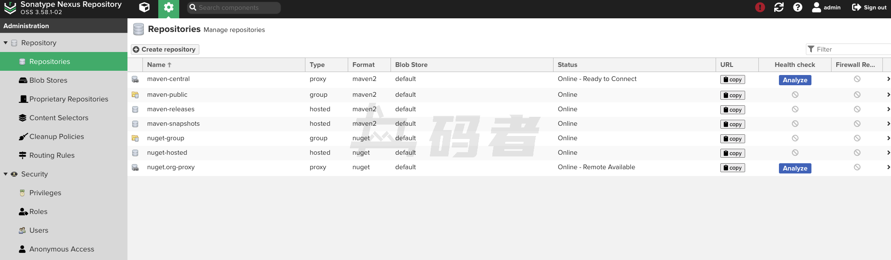](Maven 实战.assets/image-20241025174639540.png)

当我点击完成后，会显示有很多仓库的类型，因为我们是要创建的是宿主仓库，所以我们选择`maven2(hosted)`。

[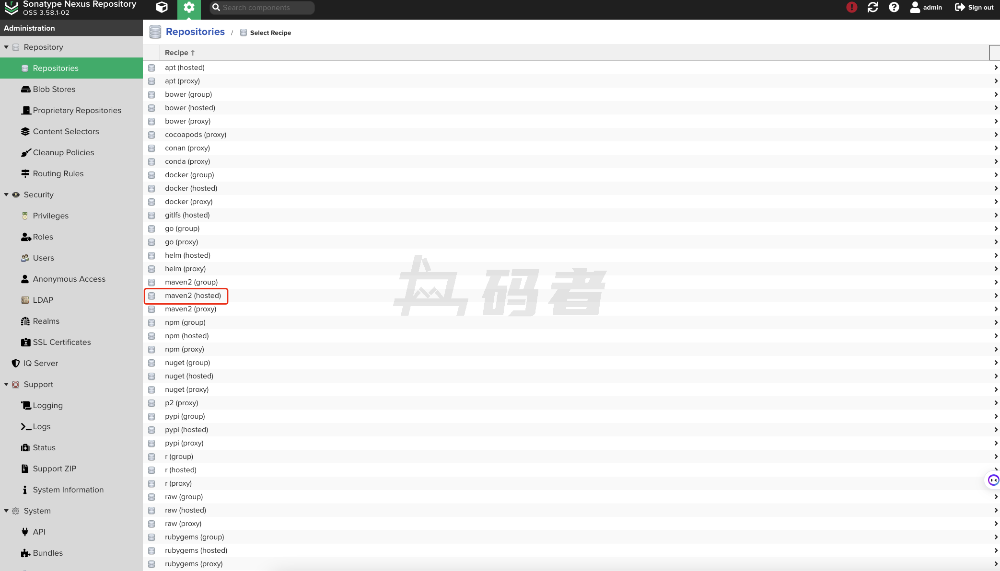](Maven 实战.assets/image-20241025174639541.png)

下面的内容就是创建宿主仓库的一些信息，下面我们详细介绍一下：

[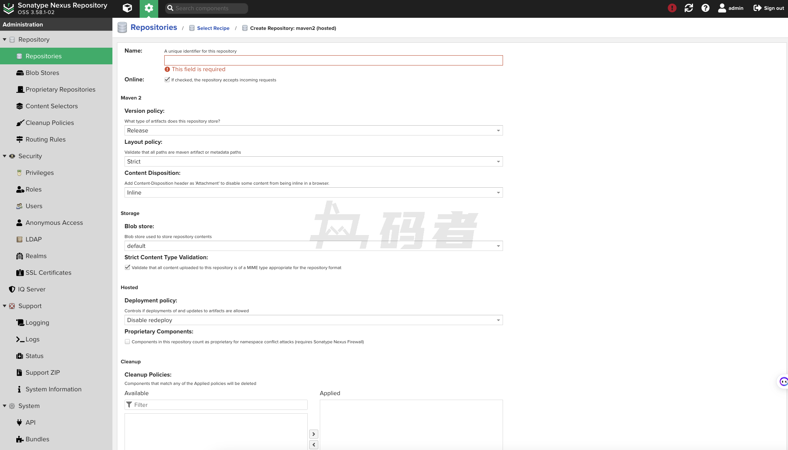](Maven 实战.assets/image-20241025174639542.png)

有一些参数，我们默认就可以，不需要进行任何修改，后续的内容中，我们将详细介绍一下每一个参数具体的作用，这里我们先介绍只需要我们设置的参数。

*   Name

仓库的名称。我们在设置仓库名称的时候，最好加上仓库的类型来命名，这样通过名称我们就可以很方便的知道这个仓库是什么类型的仓库了。

* * *

*   Online

我们可以通过此参数来禁用或者启用我们的仓库。

* * *

*   Version policy

仓库的版本策略。之前我们介绍过，在Maven中是分稳定版本和快照版本的，所以为了我们使用方便Nexus在创建仓库的时候，可以配置这个仓库的版本策略。下面是这个参数具体的配置。

1、Release：当我们配置成`Release：`参数时，则该仓库只能下载稳定版本的依赖。  
2、Snapshot：当我们配置成：`Snapshot`时，则只能下载快照版本依赖。  
3、mixed：当我们不想区分稳定版本和快照版本时，则可以配置成：`mixed`参数。

* * *

*   Deployment policy

仓库的部署略略。具体的参数配置如下：

1、Disable redeploy：禁用重新部署  
2、Allow redeploy：允许重新部署  
3、Read-only：只读  
4、Deploy by Replication Only：仅通过复制部署

* * *

[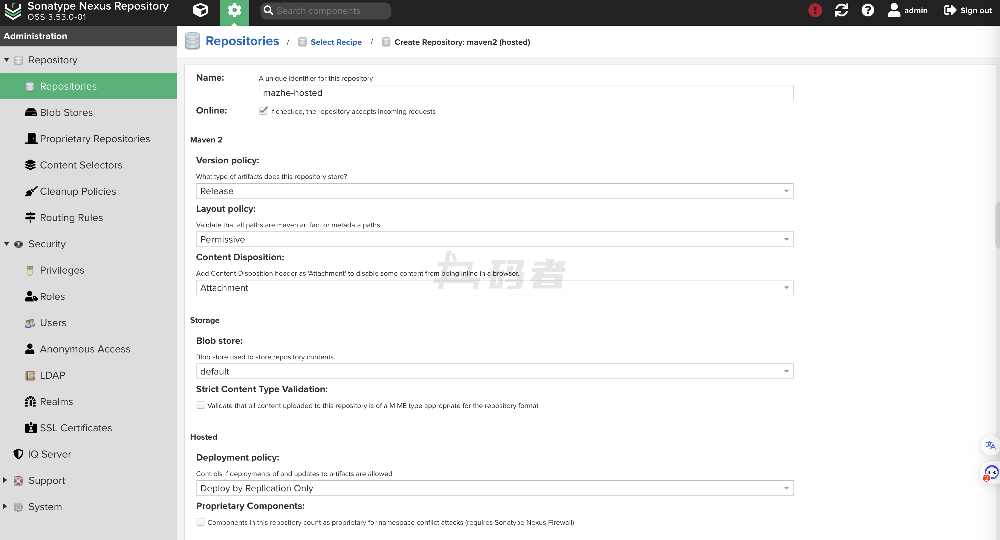](Maven 实战.assets/image-20241025174639543.png)

当我们完成上面的配置后，我们点击`Create repository`按钮。Nexus就会自动跳转到我们仓库的列表页，并且也会直接显示出我们刚刚创建的仓库的信息。

[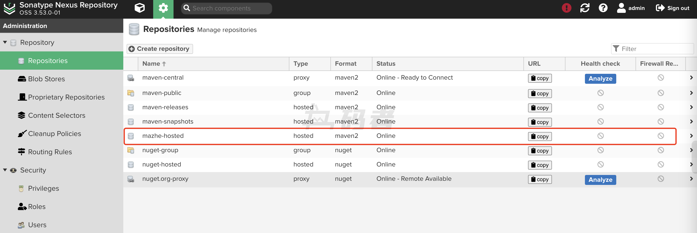](Maven 实战.assets/image-20241025174639544.png)


### 3.2、创建 Nexus 代理仓库

下面我们介绍一下，如何创建代理仓库，因为我们已经了解了宿主仓库的如何创建了，所以这次我们简单介绍一下。创建代理仓库和宿主仓库不同，这里我们需要选择`maven2(proxy)`参数，创建仓库。

[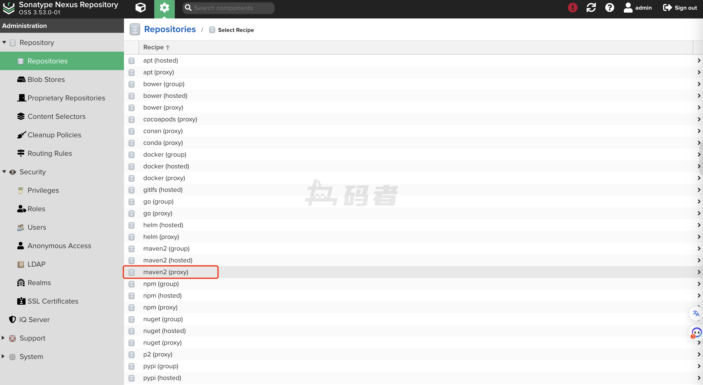](Maven 实战.assets/image-20241025174639545.png)

下面我们介绍一下和宿主仓库不同的地方，既然是代理仓库，所以需要我们配置想要代理的仓库的地址。也就是`Remote storage`参数。这里我们配置了，阿里云的仓库地址，这样当我们这个仓库配置成功后，就可以代理阿里云的仓库了。  
[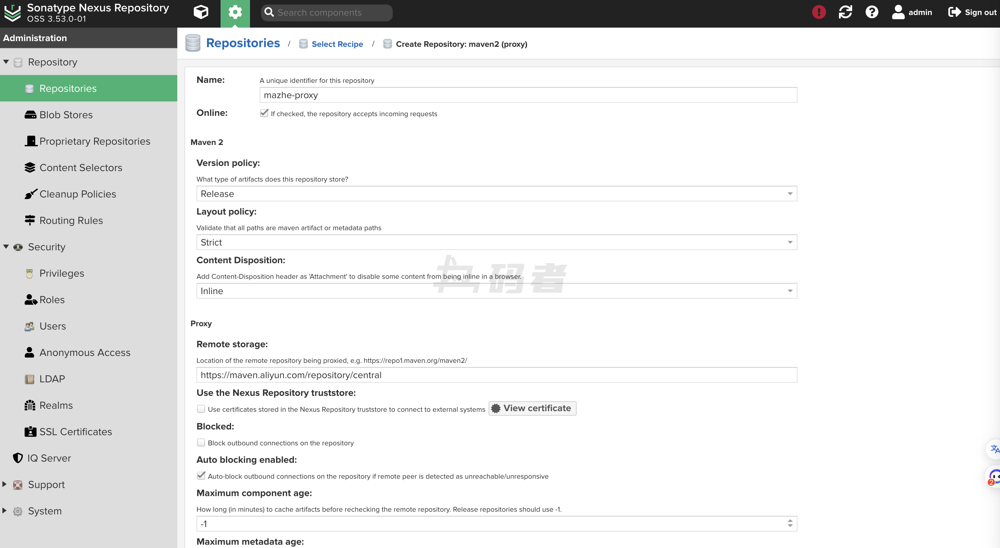](Maven 实战.assets/image-20241025174639546.png)

同样的，我们创建完成后，点击创建按钮后，Nexus就会在列表中显示我们创建的代理仓库信息。

[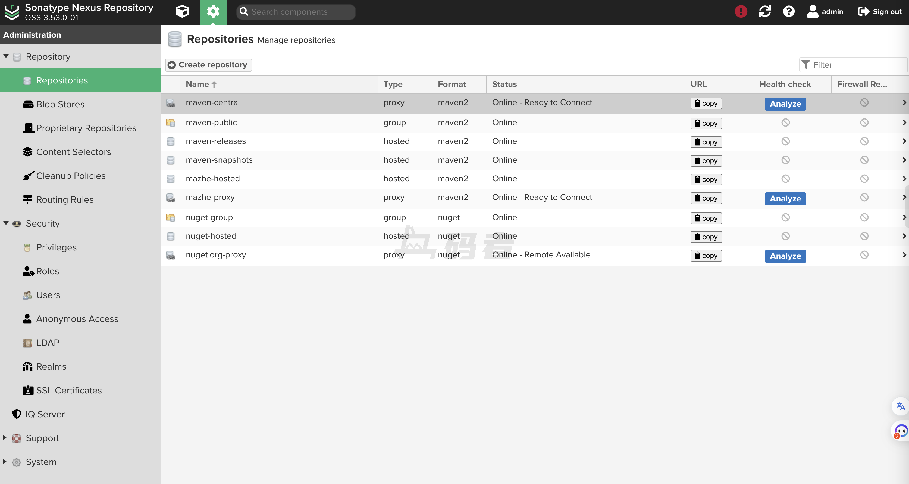](Maven 实战.assets/image-20241025174639547.png)


### 3.3、创建 Nexus 仓库组

下面我们介绍一下如下创建仓库组。创建仓库组时需要我们选择`maven2(group)`参数。

[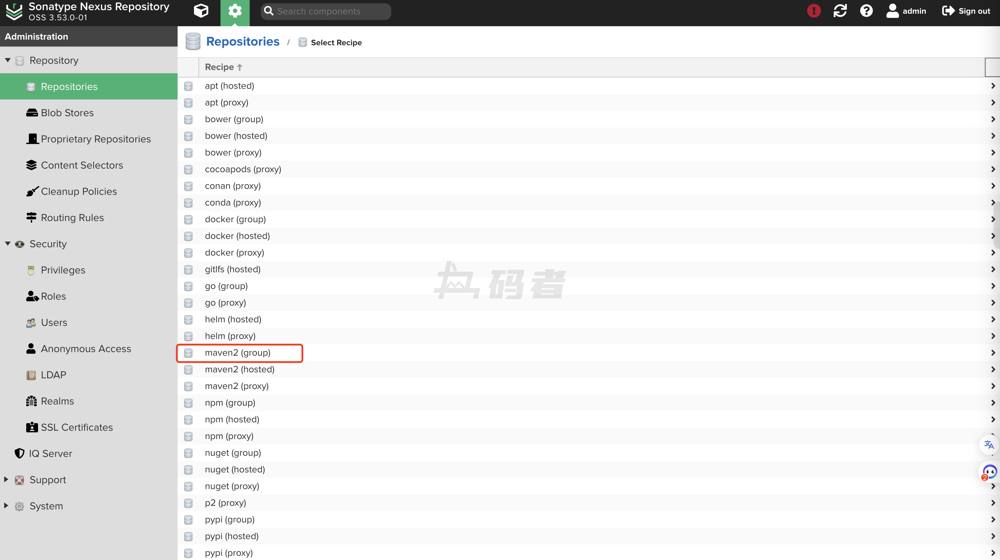](Maven 实战.assets/image-20241025174639548.png)

下面我们配置一下`Member repositories`参数，因为我们创建的是仓库组，所以我们这里需要选择，我们这个仓库组中都包括哪些仓库。这里我们选择了，我们刚刚创建成功的宿主仓库和代理仓库。也就是如下图所示：

[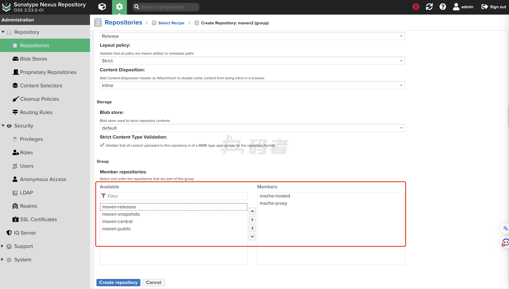](Maven 实战.assets/image-20241025174639549.png)

同样的当我们成功创建仓库组后，Nexus就会在仓库列表中显示。

[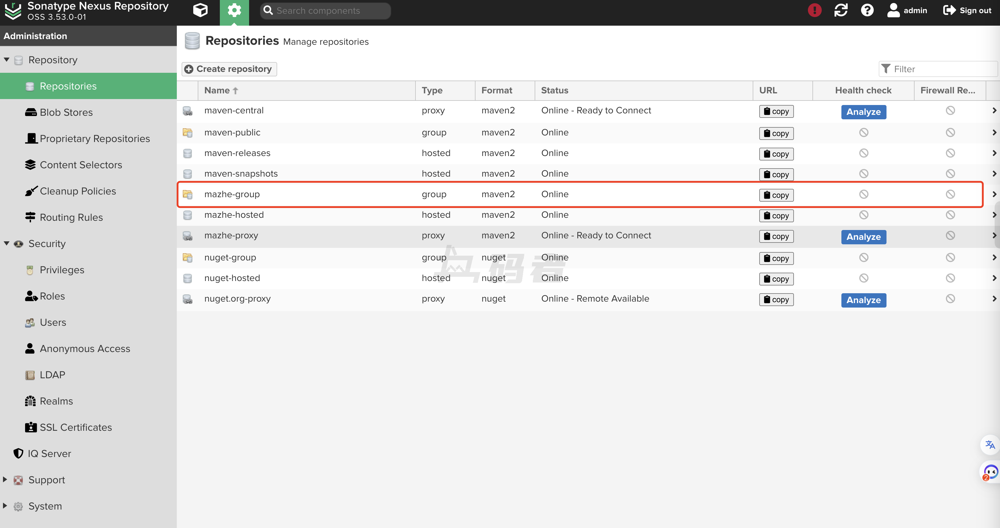](Maven 实战.assets/image-20241025174639550.png)


4、Nexus中的搜索
-----------

上面的内容中，我们介绍了如何通过Nexus创建我们自定义的仓库，并且我们可以通过这个自定义的仓库来下载我们指定的依赖组件。但Nexus除了提供上述的功能外，还提供了组件搜索的功能。我们回想一下，在没有Nexus之前，如果想找一个依赖组件时，只能去官方网站上去寻找。如果是本地的依赖组件，则需要去系统的目录中去查询。但有了Nexus之后一切都会变的非常的简单。我们可以直接使用Nexus提供的管理界面进行搜索我们想要的组件，并且Nexus还提供了索引的功能，方便我更快的检索我们想要的组件。具体的操作如下：

我们点击左侧菜单中的`Search`菜单，然后我们选择`Maven`。Nexus就会显示出所有的依赖列表。

[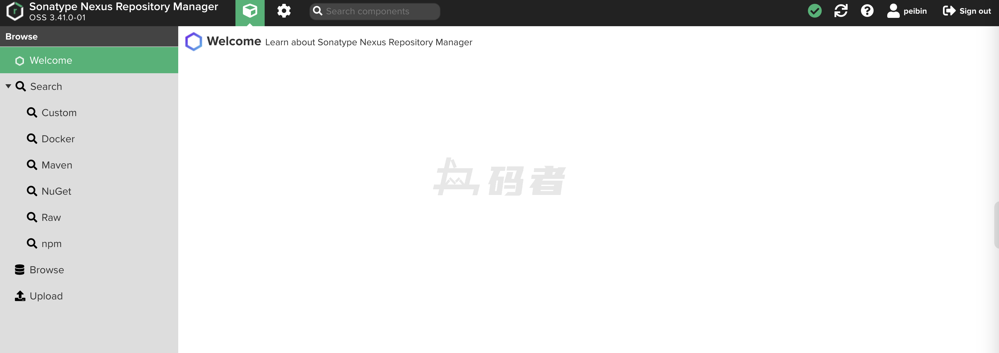](Maven 实战.assets/image-20241025174639551.png)

然后我们可以通过`GroupId、ArtifactId、Version`等参数来快速的检索我们想要的组件。

[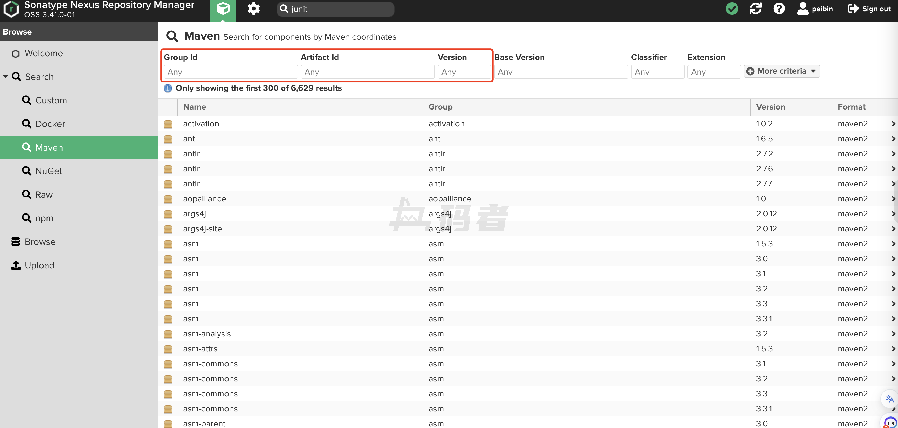](Maven 实战.assets/image-20241025174639552.png)

我们搜索一下，我们之前介绍过的组件`junit`组件，当我们输入完后，Nexus就会显示出所有`junit`组件的不同版本的信息。

[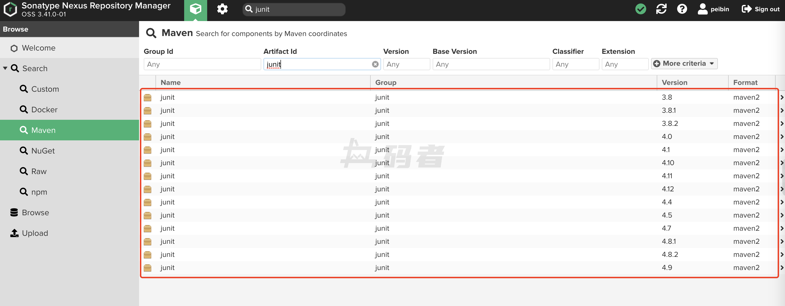](Maven 实战.assets/image-20241025174639553.png)

* * *

以上内容就是Nexus中有关仓库的内容，下一篇中我们将介绍一下，如何使用Nexus中的依赖组件，以及如何上传我们自己的组件到Nexus中。


#  二十二、部署组件到 Nexus

在上一篇中我们详细介绍了Nexus中有关仓库的内容，并且也创建了我们自定义的仓库，这一篇中我们将详细介绍一下，如何部署组件到Nexus中，以及如何使用Nexus中的组件。将Maven中的组件部署到Nexus非常的简单，共有两种方式可以选择，第一种是直接通过Nexus上传，还有一种是通过Maven的命令部署。我们首先看一下第一种部署方式。


1、Nexus 界面部署
-----------

通过Nexus界面部署组件很简单，我们首先需要登陆管理员账号，然后我们点击Upload按钮。具体操作如下图所示：

[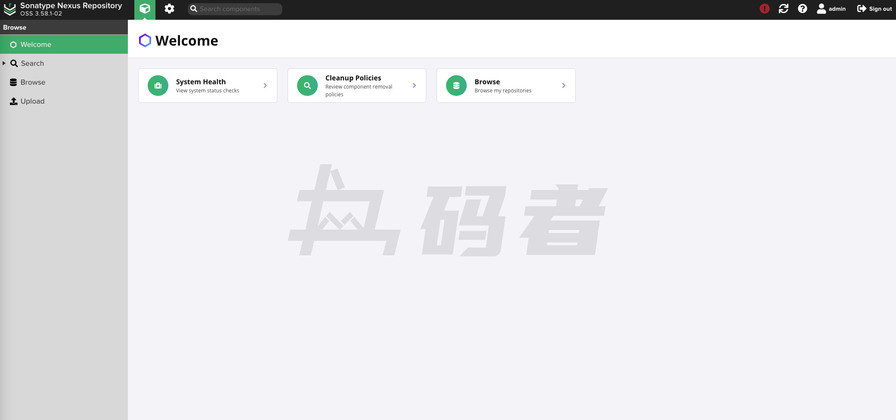](Maven 实战.assets/image-20241025174639554.png)

然后我们选择`maven-releases`。

[](Maven 实战.assets/image-20241025174639555.png)

点击完成后，需要我们填写这个组件的基本信息。

[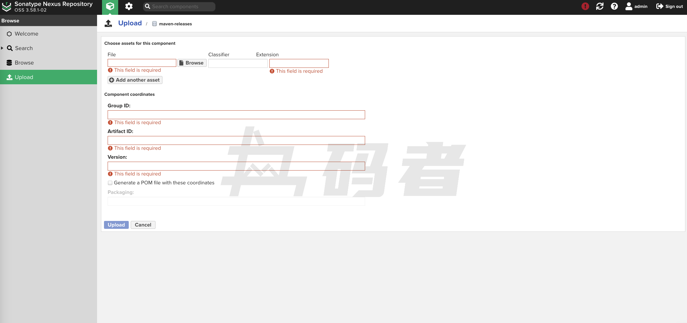](Maven 实战.assets/image-20241025174639556.png)

由于需要我们上传一个真正的组件，所以我们还是以之前介绍的项目为例子，也就是`mazhe-maven-order`项目。我们首先打包一下这个项目。

*   pom.xml（mazhe-maven-order）

```xml
<?xml version="1.0" encoding="UTF-8"?>
<project xmlns="http://maven.apache.org/POM/4.0.0"
         xmlns:xsi="http://www.w3.org/2001/XMLSchema-instance"
         xsi:schemaLocation="http://maven.apache.org/POM/4.0.0 http://maven.apache.org/xsd/maven-4.0.0.xsd">
    <parent>
        <artifactId>midai-mazhe-maven</artifactId>
        <groupId>cn.ma-zhe</groupId>
        <version>1.0-SNAPSHOT</version>
    </parent>
    <modelVersion>4.0.0</modelVersion>

    <artifactId>mazhe-maven-order</artifactId>
</project>
```

*   打包

```xml
md@ershisifenqibeigenhaoliudeMac-Studio mazhe-maven-order % mvn clean package
[INFO] Scanning for projects...
[INFO] 
[INFO] --------------------< cn.ma-zhe:mazhe-maven-order >---------------------
[INFO] Building mazhe-maven-order 1.0-SNAPSHOT
[INFO]   from pom.xml
[INFO] --------------------------------[ jar ]---------------------------------
[INFO] 
[INFO] --- clean:3.2.0:clean (default-clean) @ mazhe-maven-order ---
[INFO] Deleting /Users/md/Desktop/midai-mazhe-maven/mazhe-maven-order/target
[INFO] 
[INFO] --- resources:3.3.1:resources (default-resources) @ mazhe-maven-order ---
[WARNING] Using platform encoding (UTF-8 actually) to copy filtered resources, i.e. build is platform dependent!
[INFO] skip non existing resourceDirectory /Users/md/Desktop/midai-mazhe-maven/mazhe-maven-order/src/main/resources
[INFO] 
[INFO] --- compiler:3.11.0:compile (default-compile) @ mazhe-maven-order ---
[INFO] Changes detected - recompiling the module! :source
[WARNING] File encoding has not been set, using platform encoding UTF-8, i.e. build is platform dependent!
[INFO] Compiling 1 source file with javac [debug target 1.8] to target/classes
[INFO] 
[INFO] --- resources:3.3.1:testResources (default-testResources) @ mazhe-maven-order ---
[WARNING] Using platform encoding (UTF-8 actually) to copy filtered resources, i.e. build is platform dependent!
[INFO] skip non existing resourceDirectory /Users/md/Desktop/midai-mazhe-maven/mazhe-maven-order/src/test/resources
[INFO] 
[INFO] --- compiler:3.11.0:testCompile (default-testCompile) @ mazhe-maven-order ---
[INFO] No sources to compile
[INFO] 
[INFO] --- surefire:3.1.2:test (default-test) @ mazhe-maven-order ---
[INFO] No tests to run.
[INFO] 
[INFO] --- jar:3.3.0:jar (default-jar) @ mazhe-maven-order ---
[INFO] Building jar: /Users/md/Desktop/midai-mazhe-maven/mazhe-maven-order/target/mazhe-maven-order-1.0-SNAPSHOT.jar
[INFO] ------------------------------------------------------------------------
[INFO] BUILD SUCCESS
[INFO] ------------------------------------------------------------------------
[INFO] Total time:  2.443 s
[INFO] Finished at: 2023-08-22T22:53:27+08:00
[INFO] ------------------------------------------------------------------------
```

然后我们我们点击`target`目录就可以查看到我们新打包的组件了。

[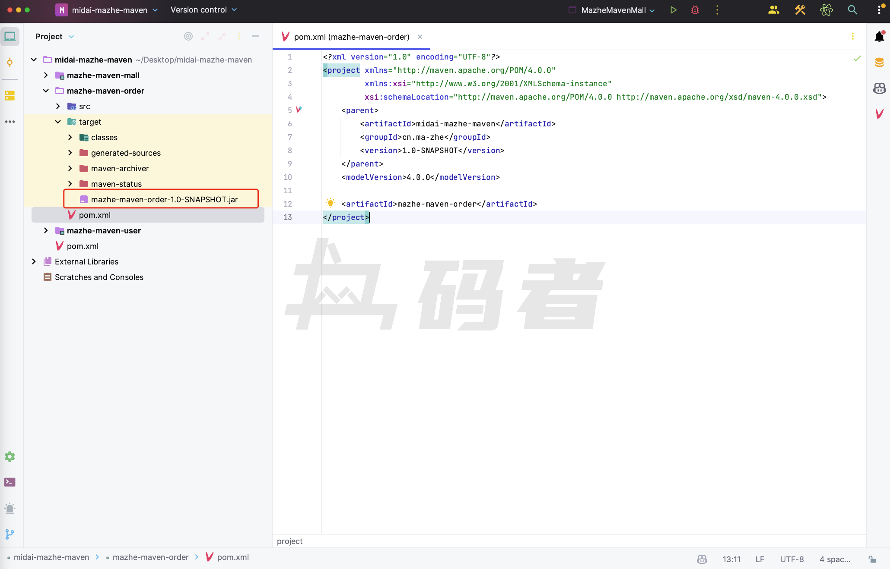](Maven 实战.assets/image-20241025174639557.png)

然后我们在Nexus中点击`Browse`按钮上传我们刚刚打包的组件。

[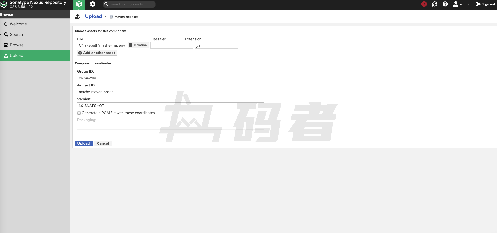](Maven 实战.assets/image-20241025174639558.png)

当我们填写完这些信息后，我们点击`Upload`按钮。

[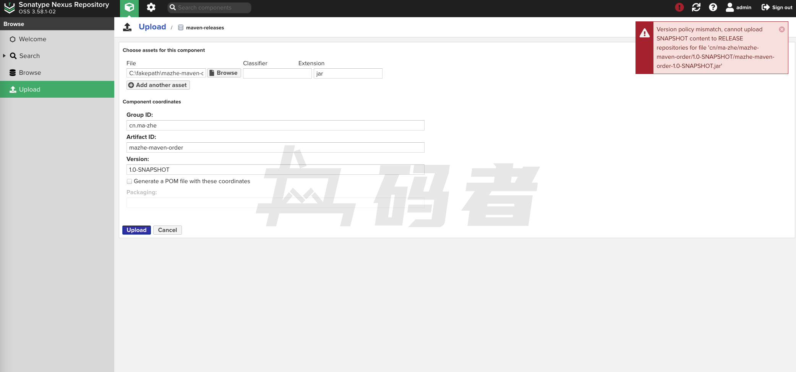](Maven 实战.assets/image-20241025174639559.png)

我们点击按钮后，发现Nexus居然报错了。

[](Maven 实战.assets/image-20241025174639559.png)

这是为什么呢？答案很简单，我们在上篇中介绍过，Nexus创建仓库的时候，是可以配置仓库的版本策略的。因为`maven-releases`仓库，只允许上传稳定版本的组件，但我们上面写的是快照版本，所以nexus拒绝了我们上传。下面我们把上面的版本信息修改为稳定版本。

[](Maven 实战.assets/image-20241025174639561.png)

然后我们继续点击`Upload`上传来看一下Nexus是否还会报错。

[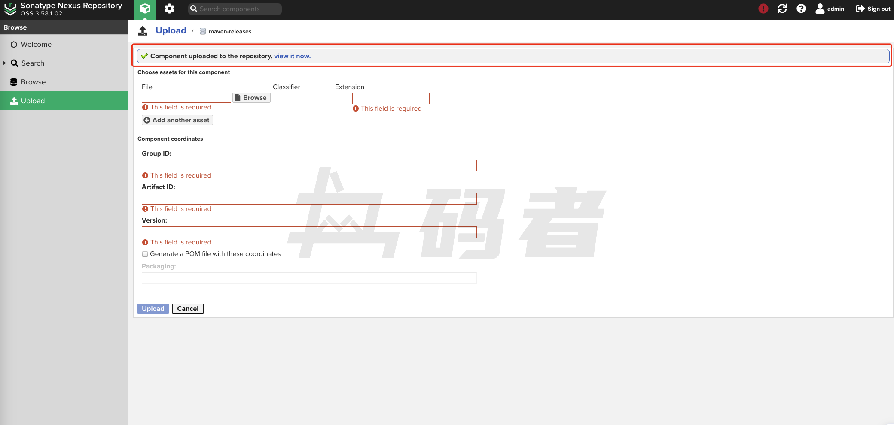](Maven 实战.assets/image-20241025174639562.png)

我们看这次我们上传成功了，我们点击一下上面的`view it now` 链接，来查看一下，我们刚刚上传的依赖。

[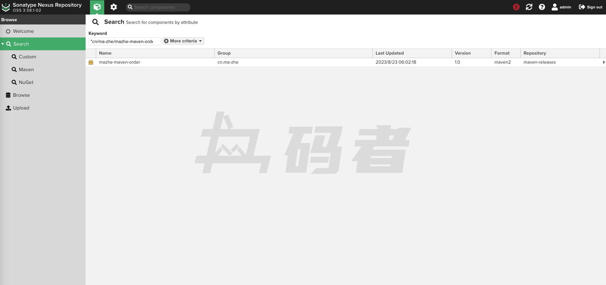](Maven 实战.assets/image-20241025174639563.png)

这样我们就能很方便的在Nexus中看到我们刚刚上传的依赖信息，以及上传时间了。同样的我们也可以通过我们上篇中介绍的，通过Nexus中的`search`搜索我们刚刚上传的依赖。

[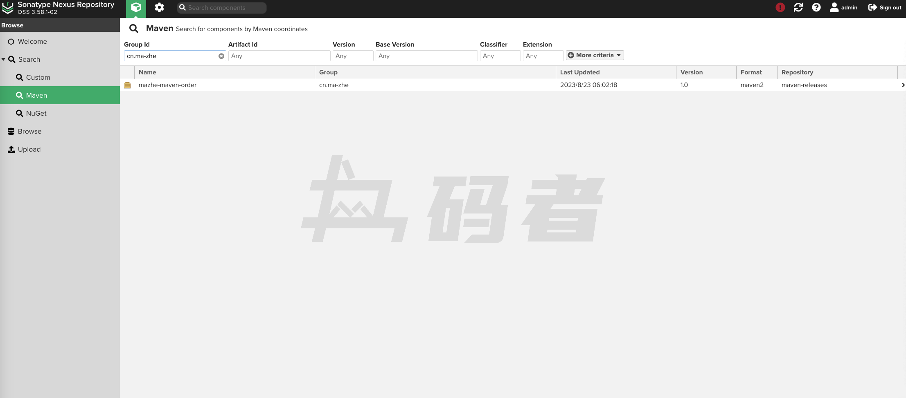](Maven 实战.assets/image-20241025174639564.png)

同样的依然会显示我们刚刚上传的依赖信息。这就是使用Nexus上传我们的依赖组件。下面我们介绍一下，上面的具体参数。

*   File：需要上传的依赖包。
*   Classifier：附属构建信息。
*   Extension：依赖的组件类型。
*   Group ID: 依赖的组件分组。
*   Artifact ID:依赖的组件名称。
*   Version: 依赖的组件版本。
*   Generate a POM file with these coordinates：如果我们选择这个选项，依赖上传后则会生成该依赖的pom.xml文件。
*   Packaging: 依赖的组件类型。

下面我们介绍一下如何通过Maven命令的方式上传依赖组件。


2、Maven 中部署
----------

既然是通过命令的方式上传，所以我们需要进行相应的配置，例如我们需要将依赖上传到Nexus中的哪个仓库中。这些都是需要我们在配置中指定，同样的我们还是在pom.xml中进行配置。具体的配置如下：

*   pom.xml（mazhe-maven-order）

```xml
<?xml version="1.0" encoding="UTF-8"?>
<project xmlns="http://maven.apache.org/POM/4.0.0"
         xmlns:xsi="http://www.w3.org/2001/XMLSchema-instance"
         xsi:schemaLocation="http://maven.apache.org/POM/4.0.0 http://maven.apache.org/xsd/maven-4.0.0.xsd">
    <parent>
        <artifactId>midai-mazhe-maven</artifactId>
        <groupId>cn.ma-zhe</groupId>
        <version>1.0-SNAPSHOT</version>
    </parent>
    <modelVersion>4.0.0</modelVersion>

    <artifactId>mazhe-maven-order</artifactId>

    <distributionManagement>
        <repository>
            <id>maven-releases</id>
            <name>Releases Repository</name>
            <url>http://localhost:8081/repository/maven-releases</url>
        </repository>
    </distributionManagement>

</project>
```

上面的配置为，我们要指定要上传的仓库的名称和地址。下面我介绍一下新命令，也就是Maven中提供的`deploy`命令。通过该命令，并且通过上面的配置，Maven会自动将依赖上传到我们配置的私服地址中。下面我们执行一下这个命令。

*   部署命令

```bash
mvn clean deploy
```

*   部署日志

```bash
[INFO] ------------------------------------------------------------------------
[INFO] BUILD FAILURE
[INFO] ------------------------------------------------------------------------
[INFO] Total time:  2.954 s
[INFO] Finished at: 2023-08-24T06:04:40+08:00
[INFO] ------------------------------------------------------------------------
[ERROR] Failed to execute goal org.apache.maven.plugins:maven-deploy-plugin:3.1.1:deploy (default-deploy) on project mazhe-maven-order: Failed to deploy artifacts: Could not transfer artifact cn.ma-zhe:mazhe-maven-order:pom:1.0-20230823.220437-1 from/to maven-releases (http://localhost:8081/repository/maven-releases): status code: 401, reason phrase: Unauthorized (401) -> [Help 1]
[ERROR] 
[ERROR] To see the full stack trace of the errors, re-run Maven with the -e switch.
[ERROR] Re-run Maven using the -X switch to enable full debug logging.
[ERROR] 
[ERROR] For more information about the errors and possible solutions, please read the following articles:
[ERROR] [Help 1] http://cwiki.apache.org/confluence/display/MAVEN/MojoExecutionException
```

我们看上面的日志，发现居然报错了，提示了我们401的错误，这是为什么呢？实际上也很简单。Nexus为了安全，在我们想要通过`deploy`命令上传依赖到Nexus的时候，必须配置相应的账号和密码，这也很容易理解，如果不这样设置，我们知道了任何一个仓库的地址，岂不是都可以上传自己的依赖包到这个仓库了吗，这样这个仓库就会有很多无用的依赖。下面我们配置一下Nexus的账号和密码，这一点和上面的配置不同，我们需要在Maven中的setting.xml文件中进行配置，账号和密码也就是我们直接访问Nexus中的账号和密码。具体的配置如下：

```xml
<settings>
    <servers>
        <server>
            <id>maven-releases</id>
            <username>admin</username>
            <password>jilinwula.com</password>
        </server>
    </servers>
</settings>
```

然后我们在次执行以下命令尝试将组件部署到Nexus中。

*   部署

```bash
mvn clean deploy
```

*   日志

```bash
[INFO] BUILD FAILURE
[INFO] ------------------------------------------------------------------------
[INFO] Total time:  3.051 s
[INFO] Finished at: 2023-08-24T06:55:32+08:00
[INFO] ------------------------------------------------------------------------
[ERROR] Failed to execute goal org.apache.maven.plugins:maven-deploy-plugin:3.1.1:deploy (default-deploy) on project mazhe-maven-order: Failed to deploy artifacts: Could not transfer artifact cn.ma-zhe:mazhe-maven-order:pom:1.0-20230823.225529-1 from/to maven-releases (http://localhost:8081/repository/maven-releases/): status code: 400, reason phrase: Repository version policy: RELEASE does not allow version: 1.0-20230823.225529-1 (400) -> [Help 1]
[ERROR] 
[ERROR] To see the full stack trace of the errors, re-run Maven with the -e switch.
[ERROR] Re-run Maven using the -X switch to enable full debug logging.
[ERROR] 
[ERROR] For more information about the errors and possible solutions, please read the following articles:
[ERROR] [Help 1] http://cwiki.apache.org/confluence/display/MAVEN/MojoExecutionException
```

我们看上面的日志还是报错了，但这次错误和之前有些不同，这次错误的原因则是仓库的策略和我们上传的版本不一致，因为该仓库只支持稳定版本的组件，但我们上传的是快照版本，所以上面的的部署报错了。下面我们修改一下`mazhe-maven-order`项目的版本。具体配置如下：

*   pom.xml（mazhe-maven-order）

```xml
<?xml version="1.0" encoding="UTF-8"?>
<project xmlns="http://maven.apache.org/POM/4.0.0"
         xmlns:xsi="http://www.w3.org/2001/XMLSchema-instance"
         xsi:schemaLocation="http://maven.apache.org/POM/4.0.0 http://maven.apache.org/xsd/maven-4.0.0.xsd">
    <parent>
        <artifactId>midai-mazhe-maven</artifactId>
        <groupId>cn.ma-zhe</groupId>
        <version>1.0</version>
    </parent>
    <modelVersion>4.0.0</modelVersion>

    <artifactId>mazhe-maven-order</artifactId>

    <distributionManagement>
        <repository>
            <id>maven-releases</id>
            <name>maven-releases</name>
            <url>http://localhost:8081/repository/maven-releases/</url>
        </repository>
    </distributionManagement>
</project>
```

然后我们继续执行部署的命令。

*   部署

```bash
mvn clean deploy
```

*   日志

```bash
[INFO] BUILD FAILURE
[INFO] ------------------------------------------------------------------------
[INFO] Total time:  3.581 s
[INFO] Finished at: 2023-08-24T07:05:21+08:00
[INFO] ------------------------------------------------------------------------
[ERROR] Failed to execute goal org.apache.maven.plugins:maven-deploy-plugin:3.1.1:deploy (default-deploy) on project mazhe-maven-order: Failed to deploy artifacts: Could not transfer artifact cn.ma-zhe:mazhe-maven-order:jar:1.0 from/to maven-releases (http://localhost:8081/repository/maven-releases/): status code: 400, reason phrase: Repository does not allow updating assets: maven-releases (400) -> [Help 1]
[ERROR] 
[ERROR] To see the full stack trace of the errors, re-run Maven with the -e switch.
[ERROR] Re-run Maven using the -X switch to enable full debug logging.
[ERROR] 
[ERROR] For more information about the errors and possible solutions, please read the following articles:
[ERROR] [Help 1] http://cwiki.apache.org/confluence/display/MAVEN/MojoExecutionException
```

看日志居然又报错了，并且错误又和上面的不一样了。这个错误的原因是该仓库不允许重新部署，我们在上一篇中介绍过，在创建仓库时是可以设置仓库的部署策略的。也就是`Deployment policy`参数。 

该参数的具体配置如下：

1、Disable redeploy：禁用重新部署 
2、Allow redeploy：允许重新部署 
3、Read-only：只读 
4、Deploy by Replication Only：仅通过复制部署

下面我们修改一下这个仓库的配置。因为上一篇中我们已经介绍过了。所以这里就不在重复介绍了。

[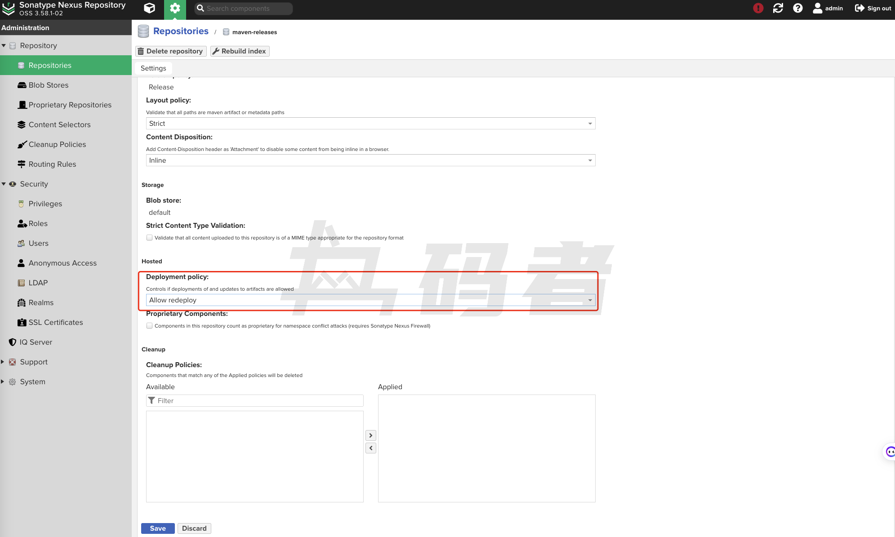](Maven 实战.assets/image-20241025174639565.png)

修改完成后，我们在次执行上面的部署命令。

*   部署

```bash
mvn clean deploy
```

*   日志

```bash
[INFO] 
[INFO] --- deploy:3.1.1:deploy (default-deploy) @ mazhe-maven-order ---
Uploading to maven-releases: http://localhost:8081/repository/maven-releases/cn/ma-zhe/mazhe-maven-order/1.0/mazhe-maven-order-1.0.pom
Uploaded to maven-releases: http://localhost:8081/repository/maven-releases/cn/ma-zhe/mazhe-maven-order/1.0/mazhe-maven-order-1.0.pom (757 B at 3.2 kB/s)
Uploading to maven-releases: http://localhost:8081/repository/maven-releases/cn/ma-zhe/mazhe-maven-order/1.0/mazhe-maven-order-1.0.jar
Uploaded to maven-releases: http://localhost:8081/repository/maven-releases/cn/ma-zhe/mazhe-maven-order/1.0/mazhe-maven-order-1.0.jar (1.9 kB at 13 kB/s)
Downloading from maven-releases: http://localhost:8081/repository/maven-releases/cn/ma-zhe/mazhe-maven-order/maven-metadata.xml
Downloaded from maven-releases: http://localhost:8081/repository/maven-releases/cn/ma-zhe/mazhe-maven-order/maven-metadata.xml (377 B at 5.5 kB/s)
Uploading to maven-releases: http://localhost:8081/repository/maven-releases/cn/ma-zhe/mazhe-maven-order/maven-metadata.xml
Uploaded to maven-releases: http://localhost:8081/repository/maven-releases/cn/ma-zhe/mazhe-maven-order/maven-metadata.xml (356 B at 3.2 kB/s)
[INFO] ------------------------------------------------------------------------
[INFO] BUILD SUCCESS
[INFO] ------------------------------------------------------------------------
[INFO] Total time:  3.445 s
[INFO] Finished at: 2023-08-24T07:21:07+08:00
[INFO] ------------------------------------------------------------------------
```

我们看上面的日志，这次我们部署成功了，下面我们通过Nexus中查看一下，我们使用命令部署的组件。

[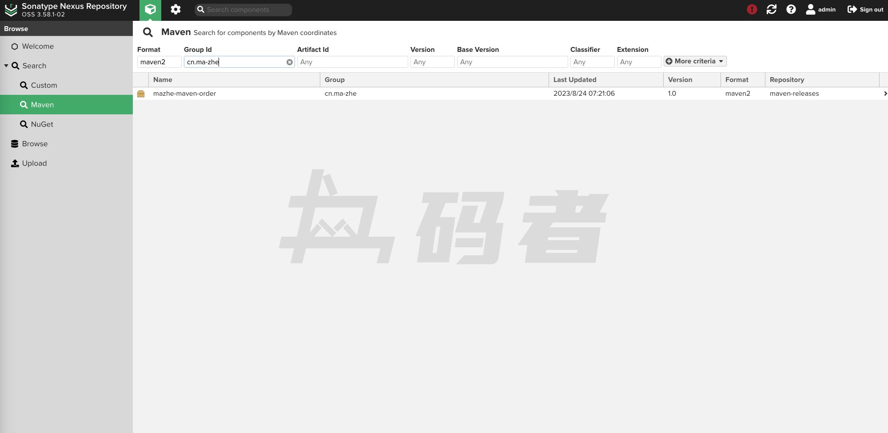](Maven 实战.assets/image-20241025174639566.png)

这样我们就完成了通过命令部署组件到Nexus了。


3、如何使用 Nexus 中的组件
---------------

下面我们介绍一下如何使用Nexus中的组件，因为我们已经将`mazhe-maven-order`组件成功的上传的到了Nexus中，所以我们直接在另外的一个项目中引入这个依赖看是否能够成功的下载。有一点要注意，我们需要将本地仓库的中的`mazhe-maven-order`组件删除掉。因为按照之前我们介绍过的内容，Maven在下载组件时，会先在本地仓库中去寻找，如果没有找到才会去私服或者中央仓库中去寻找，如果我们不将本地仓库的依赖删除掉，Maven是不会从我们Nexus中去下载组件的。下面我们已项目`mazhe-maven-mall`为例子，在这个项目中添加`mazhe-maven-order`组件。具体配置如下：

*   pom.xml（mazhe-maven-mall）

```xml
<?xml version="1.0" encoding="UTF-8"?>
<project xmlns="http://maven.apache.org/POM/4.0.0"
         xmlns:xsi="http://www.w3.org/2001/XMLSchema-instance"
         xsi:schemaLocation="http://maven.apache.org/POM/4.0.0 http://maven.apache.org/xsd/maven-4.0.0.xsd">
    <groupId>cn.ma-zhe</groupId>
    <version>1.0</version>
    <modelVersion>4.0.0</modelVersion>

    <artifactId>mazhe-maven-mall</artifactId>

    <dependencies>
        <dependency>
            <groupId>cn.ma-zhe</groupId>
            <artifactId>mazhe-maven-order</artifactId>
            <version>1.0</version>
        </dependency>
    </dependencies>
</project>
```

然后我们编译项目看一下日志输出。

*   编译

```bash
mvn clean package
```

*   日志

```bash
[INFO] BUILD FAILURE
[INFO] ------------------------------------------------------------------------
[INFO] Total time:  0.479 s
[INFO] Finished at: 2023-08-24T19:22:34+08:00
[INFO] ------------------------------------------------------------------------
[ERROR] Failed to execute goal on project mazhe-maven-mall: Could not resolve dependencies for project cn.ma-zhe:mazhe-maven-mall:jar:1.0: Failure to find cn.ma-zhe:mazhe-maven-order:jar:1.0 in https://repo.maven.apache.org/maven2 was cached in the local repository, resolution will not be reattempted until the update interval of central has elapsed or updates are forced -> [Help 1]
[ERROR] 
[ERROR] To see the full stack trace of the errors, re-run Maven with the -e switch.
[ERROR] Re-run Maven using the -X switch to enable full debug logging.
[ERROR] 
[ERROR] For more information about the errors and possible solutions, please read the following articles:
[ERROR] [Help 1] http://cwiki.apache.org/confluence/display/MAVEN/DependencyResolutionException
```

我们看上面的日志输出，提示我们组件下载失败了，并且通过日志我们也发现Maven是在中央仓库中寻找我们的依赖组件。但这个组件是我们上传到私服中的组件，所以中央仓库中查询不到报错了。所以我们需要配置一下私服的地址，也就是告诉Maven去私服中去查询我们的组件。下面是具体的配置。

*   settings.xml

```xml
<profiles>
    <profile>
        <id>mazhe</id>
        <repositories>
            <repository>
                <id>maven-releases</id>
                <url>http://localhost:8081/repository/maven-releases/</url>
                <releases>
                    <enabled>true</enabled>
                    <updatePolicy>daily</updatePolicy>
                </releases>
            </repository>
        </repositories>
    </profile>
</profiles>
<activeProfiles>
    <activeProfile>mazhe</activeProfile>
</activeProfiles>
```

然后我们在次执行一下上面的编译命令。

*   编译

```bash
mvn clean package
```

*   日志

```bash
[INFO] Scanning for projects...
[INFO] 
[INFO] ---------------------< cn.ma-zhe:mazhe-maven-mall >---------------------
[INFO] Building mazhe-maven-mall 1.0
[INFO] --------------------------------[ jar ]---------------------------------
Downloading from maven-releases: http://localhost:8081/repository/maven-releases/cn/ma-zhe/mazhe-maven-order/1.0/mazhe-maven-order-1.0.pom
Downloaded from maven-releases: http://localhost:8081/repository/maven-releases/cn/ma-zhe/mazhe-maven-order/1.0/mazhe-maven-order-1.0.pom (674 B at 1.4 kB/s)
Downloading from maven-releases: http://localhost:8081/repository/maven-releases/cn/ma-zhe/mazhe-maven-order/1.0/mazhe-maven-order-1.0.jar
Downloaded from maven-releases: http://localhost:8081/repository/maven-releases/cn/ma-zhe/mazhe-maven-order/1.0/mazhe-maven-order-1.0.jar (2.0 kB at 39 kB/s)
[INFO] 
[INFO] --- maven-jar-plugin:2.4:jar (default-jar) @ mazhe-maven-mall ---
[INFO] Building jar: /Users/essfzqbghl/Documents/midai-mazhe-maven/mazhe-maven-mall/target/mazhe-maven-mall-1.0.jar
[INFO] ------------------------------------------------------------------------
[INFO] BUILD SUCCESS
[INFO] ------------------------------------------------------------------------
[INFO] Total time:  4.896 s
[INFO] Finished at: 2023-08-24T19:55:07+08:00
[INFO] ------------------------------------------------------------------------
```

我们看这回日志执行成功了，并且通过上面的日志我们也看到了，Maven是从我们配置的Nexus中的私服中下载的依赖。以上内容这就是如何使用Nexus下载我们指定的依赖。


# 二十三、Maven 进行代码测试


1、maven-surefire-plugin
-----------------------

在实际的项目开发中我们通常会对我们编写的代码进行测试。在这一篇中我们将详细介绍一下，如何使用Maven进行测试。在Maven中执行测试用例非常的简单，在之前介绍生命周期时我们知道，Maven可以通过插件的方式绑定其生命周期实现我们自定义的业务逻辑。Maven就是通过这样的方式，使用`maven-surefire-plugin`插件方式实现在Maven中使用测试用例的。下面我们介绍一下该插件具体的规则：

```bash
**/Test*.java：任何子目录下所有命名以Test开头的Java类。
**/*Test.java：任何子目录下所有命名以Test结尾的Java类。
**/*TestCase.java：任何子目录下所有命名以TestCase结尾的Java类。
```


2、JUnit
-------

只要将测试类按上述方式命名，Maven就能自动运行它们。但上述的插件只是能绑定相应的生命周期，实际上运行测试用例的功能是由测试框架实现的，也就是比较知名的`JUnit`和`TestNG`等。所以我们在Maven中在使用测试用例的时候，还需要配置上面的依赖信息才可以使用。具体配置如下：

*   pom.xml

```xml
<?xml version="1.0" encoding="UTF-8"?>
<project xmlns="http://maven.apache.org/POM/4.0.0"
         xmlns:xsi="http://www.w3.org/2001/XMLSchema-instance"
         xsi:schemaLocation="http://maven.apache.org/POM/4.0.0 http://maven.apache.org/xsd/maven-4.0.0.xsd">
    <parent>
        <artifactId>midai-mazhe-maven</artifactId>
        <groupId>cn.ma-zhe</groupId>
        <version>1.0-SNAPSHOT</version>
    </parent>
    <modelVersion>4.0.0</modelVersion>
    <artifactId>mazhe-maven-mall</artifactId>

    <dependencies>
        <dependency>
            <groupId>junit</groupId>
            <artifactId>junit</artifactId>
            <version>4.12</version>
            <scope>test</scope>
        </dependency>
    </dependencies>

</project>
```

因为有关`JUnit`的内容我们之前已经介绍过了，我们这里就不在进行代码演示了。当然我们也可以使用以下命令在项目构建的时候跳过测试用例的执行：

```bash
mvn package -DskipTests
```

上面中的`package`为项目构建的名称。但上面的命令在执行的时候，每次都要编写确实比较麻烦，所以Maven还可以通过配置的方式指定项目构建的时候执行哪些测试用例。

```xml
<plugin>
    <groupId>org.apache.maven.plugins</groupId>
    <artifactId>maven-surefire-plugin</artifactId>
    <version>2.5</version>
    <configuration>
        <includes>
            <include>**/*Tests.java</include>
        </includes>
    </configuration>
</plugin>
```

同样的我们也可以使用同样的方式在配置中忽略相关的测试用例：

```xml
<plugin>
    <groupId>org.apache.maven.plugins</groupId>
    <artifactId>maven-surefire-plugin</artifactId>
    <version>2.5</version>
    <configuration>
        <excludes>
            <exclude>**/*ServiceTest.java</exclude>
            <exclude>**/TempDaoTest.java</exclude>
        </excludes>
    </configuration>
</plugin>
```

当然我也可以通过命令的方式指定我们想要执行的测试用例。

```bash
mvn test -Dtest=MazheMavenMallTest
```

也可以同时执行多个测试用例,多个测试用例使用逗号分割。

```bash
mvn test -Dtest=MazheMavenMallTest,MazheMavenOrderTest
```

也可以通过星号匹配多个测试用例。

```bash
mvn test -Dtest=MazheMaven*Test
```


3、cobertura-maven-plugin
------------------------

maven-surefire-plugin插件默认会帮我们生成测试用例的报告。有两种格式，一种是简单的文本报告，一种是xml形式的报告。当我们执行测试用例后，就会自动将上述的报告生成到`target/surefire-reports`目录下。下面我们演示一下。同样的我们还是以`mazhe-maven-mall`项目为例。由于使用测试需要使用`junit`依赖。，所以我们需要在`mazhe-maven-mall`项目中添加`junit`依赖。

*   pom.xml（mazhe-maven-mall）

```xml
<?xml version="1.0" encoding="UTF-8"?>
<project xmlns="http://maven.apache.org/POM/4.0.0"
         xmlns:xsi="http://www.w3.org/2001/XMLSchema-instance"
         xsi:schemaLocation="http://maven.apache.org/POM/4.0.0 http://maven.apache.org/xsd/maven-4.0.0.xsd">
    <parent>
        <artifactId>midai-mazhe-maven</artifactId>
        <groupId>cn.ma-zhe</groupId>
        <version>1.0-SNAPSHOT</version>
    </parent>
    <modelVersion>4.0.0</modelVersion>
    <artifactId>mazhe-maven-mall</artifactId>

    <dependencies>
        <dependency>
            <groupId>junit</groupId>
            <artifactId>junit</artifactId>
            <version>4.12</version>
            <scope>test</scope>
        </dependency>
    </dependencies>

</project>
```

*   MazheMavenMallTest

```java
import org.junit.Test;

public class MazheMavenMallTest {
    @Test
    public void test() {
        System.out.println("Hello World Mazhe Maven Mall Test!");
    }
}
```

下面我们执行一下上面的测试用例。通常我们只需要在IDEA中通过右键执行即可，但这次我们使用一下上面的命令试一下。

```bash
mvn test -Dtest=MazheMavenMallTest
```

*   日志

```bash
[INFO] 
[INFO] -------------------------------------------------------
[INFO]  T E S T S
[INFO] -------------------------------------------------------
[INFO] Running MazheMavenMallTest
Hello World Mazhe Maven Mall Test!
[INFO] Tests run: 1, Failures: 0, Errors: 0, Skipped: 0, Time elapsed: 0.075 s -- in MazheMavenMallTest
[INFO] 
[INFO] Results:
[INFO] 
[INFO] Tests run: 1, Failures: 0, Errors: 0, Skipped: 0
[INFO] 
[INFO] ------------------------------------------------------------------------
[INFO] BUILD SUCCESS
[INFO] ------------------------------------------------------------------------
[INFO] Total time:  2.160 s
[INFO] Finished at: 2023-08-26T11:23:20+08:00
[INFO] ------------------------------------------------------------------------
```

下面我们查看一下项目中的`target/surefire-reports`目录是否生成了测试报告。

[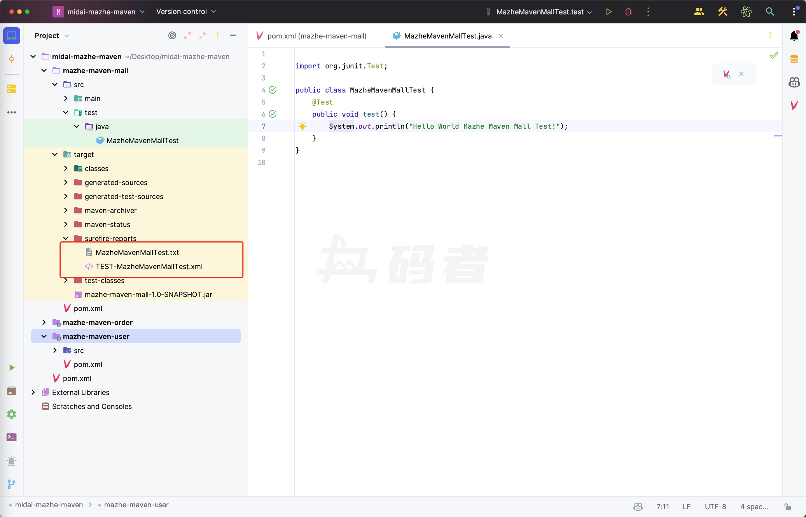](Maven 实战.assets/image-20241025174639567.png)

我们看上图显示，成功的生了项目的测试报告了，并且同时生成了两种格式。下面我们查看一下里面的内容。

*   MazheMavenMallTest.txt

```tex
-------------------------------------------------------------------------------
Test set: MazheMavenMallTest
-------------------------------------------------------------------------------
Tests run: 1, Failures: 0, Errors: 0, Skipped: 0, Time elapsed: 0.075 s -- in MazheMavenMallTest
```

*   TEST-MazheMavenMallTest.xml

```xml
<?xml version="1.0" encoding="UTF-8"?>
<testsuite xmlns:xsi="http://www.w3.org/2001/XMLSchema-instance" xsi:noNamespaceSchemaLocation="https://maven.apache.org/surefire/maven-surefire-plugin/xsd/surefire-test-report-3.0.xsd" version="3.0" name="MazheMavenMallTest" time="0.075" tests="1" errors="0" skipped="0" failures="0">
  <properties>
    <property name="gopherProxySet" value="false"/>
    <property name="awt.toolkit" value="sun.lwawt.macosx.LWCToolkit"/>
    <property name="file.encoding.pkg" value="sun.io"/>
    <property name="java.specification.version" value="1.8"/>
    <property name="sun.cpu.isalist" value=""/>
    <property name="sun.jnu.encoding" value="UTF-8"/>
    <property name="java.class.path" value="/Users/md/Desktop/midai-mazhe-maven/mazhe-maven-mall/target/test-classes:/Users/md/Desktop/midai-mazhe-maven/mazhe-maven-mall/target/classes:/Users/md/.m2/repository/junit/junit/4.12/junit-4.12.jar:/Users/md/.m2/repository/org/hamcrest/hamcrest-core/1.3/hamcrest-core-1.3.jar:"/>
    <property name="java.vm.vendor" value="Oracle Corporation"/>
    <property name="sun.arch.data.model" value="64"/>
    <property name="java.vendor.url" value="http://java.oracle.com/"/>
    <property name="user.timezone" value=""/>
    <property name="java.vm.specification.version" value="1.8"/>
    <property name="os.name" value="Mac OS X"/>
    <property name="user.country" value="CN"/>
    <property name="sun.java.launcher" value="SUN_STANDARD"/>
    <property name="sun.boot.library.path" value="/Library/Java/JavaVirtualMachines/jdk-1.8.jdk/Contents/Home/jre/lib"/>
    <property name="sun.java.command" value="/Users/md/Desktop/midai-mazhe-maven/mazhe-maven-mall/target/surefire/surefirebooter-20230826112320490_3.jar /Users/md/Desktop/midai-mazhe-maven/mazhe-maven-mall/target/surefire 2023-08-26T11-23-20_362-jvmRun1 surefire-20230826112320490_1tmp surefire_0-20230826112320490_2tmp"/>
    <property name="http.nonProxyHosts" value="local|*.local|169.254/16|*.169.254/16"/>
    <property name="test" value="MazheMavenMallTest"/>
    <property name="surefire.test.class.path" value="/Users/md/Desktop/midai-mazhe-maven/mazhe-maven-mall/target/test-classes:/Users/md/Desktop/midai-mazhe-maven/mazhe-maven-mall/target/classes:/Users/md/.m2/repository/junit/junit/4.12/junit-4.12.jar:/Users/md/.m2/repository/org/hamcrest/hamcrest-core/1.3/hamcrest-core-1.3.jar:"/>
    <property name="sun.cpu.endian" value="little"/>
    <property name="user.home" value="/Users/md"/>
    <property name="user.language" value="zh"/>
    <property name="java.specification.vendor" value="Oracle Corporation"/>
    <property name="java.home" value="/Library/Java/JavaVirtualMachines/jdk-1.8.jdk/Contents/Home/jre"/>
    <property name="basedir" value="/Users/md/Desktop/midai-mazhe-maven/mazhe-maven-mall"/>
    <property name="file.separator" value="/"/>
    <property name="line.separator" value="
"/>
    <property name="java.vm.specification.vendor" value="Oracle Corporation"/>
    <property name="java.specification.name" value="Java Platform API Specification"/>
    <property name="java.awt.graphicsenv" value="sun.awt.CGraphicsEnvironment"/>
    <property name="surefire.real.class.path" value="/Users/md/Desktop/midai-mazhe-maven/mazhe-maven-mall/target/surefire/surefirebooter-20230826112320490_3.jar"/>
    <property name="sun.boot.class.path" value="/Library/Java/JavaVirtualMachines/jdk-1.8.jdk/Contents/Home/jre/lib/resources.jar:/Library/Java/JavaVirtualMachines/jdk-1.8.jdk/Contents/Home/jre/lib/rt.jar:/Library/Java/JavaVirtualMachines/jdk-1.8.jdk/Contents/Home/jre/lib/jsse.jar:/Library/Java/JavaVirtualMachines/jdk-1.8.jdk/Contents/Home/jre/lib/jce.jar:/Library/Java/JavaVirtualMachines/jdk-1.8.jdk/Contents/Home/jre/lib/charsets.jar:/Library/Java/JavaVirtualMachines/jdk-1.8.jdk/Contents/Home/jre/lib/jfr.jar:/Library/Java/JavaVirtualMachines/jdk-1.8.jdk/Contents/Home/jre/classes"/>
    <property name="sun.management.compiler" value="HotSpot 64-Bit Tiered Compilers"/>
    <property name="ftp.nonProxyHosts" value="local|*.local|169.254/16|*.169.254/16"/>
    <property name="java.runtime.version" value="1.8.0_371-b11"/>
    <property name="user.name" value="md"/>
    <property name="path.separator" value=":"/>
    <property name="os.version" value="13.4.1"/>
    <property name="java.endorsed.dirs" value="/Library/Java/JavaVirtualMachines/jdk-1.8.jdk/Contents/Home/jre/lib/endorsed"/>
    <property name="java.runtime.name" value="Java(TM) SE Runtime Environment"/>
    <property name="file.encoding" value="UTF-8"/>
    <property name="java.vm.name" value="Java HotSpot(TM) 64-Bit Server VM"/>
    <property name="localRepository" value="/Users/md/.m2/repository"/>
    <property name="java.vendor.url.bug" value="http://bugreport.sun.com/bugreport/"/>
    <property name="java.io.tmpdir" value="/var/folders/4h/rgmf1__n4fxfn7c23nn65fkw0000gn/T/"/>
    <property name="java.version" value="1.8.0_371"/>
    <property name="user.dir" value="/Users/md/Desktop/midai-mazhe-maven/mazhe-maven-mall"/>
    <property name="os.arch" value="x86_64"/>
    <property name="java.vm.specification.name" value="Java Virtual Machine Specification"/>
    <property name="java.awt.printerjob" value="sun.lwawt.macosx.CPrinterJob"/>
    <property name="sun.os.patch.level" value="unknown"/>
    <property name="java.library.path" value="/Users/md/Library/Java/Extensions:/Library/Java/Extensions:/Network/Library/Java/Extensions:/System/Library/Java/Extensions:/usr/lib/java:."/>
    <property name="java.vm.info" value="mixed mode"/>
    <property name="java.vendor" value="Oracle Corporation"/>
    <property name="java.vm.version" value="25.371-b11"/>
    <property name="java.specification.maintenance.version" value="4"/>
    <property name="java.ext.dirs" value="/Users/md/Library/Java/Extensions:/Library/Java/JavaVirtualMachines/jdk-1.8.jdk/Contents/Home/jre/lib/ext:/Library/Java/Extensions:/Network/Library/Java/Extensions:/System/Library/Java/Extensions:/usr/lib/java"/>
    <property name="sun.io.unicode.encoding" value="UnicodeBig"/>
    <property name="java.class.version" value="52.0"/>
    <property name="socksNonProxyHosts" value="local|*.local|169.254/16|*.169.254/16"/>
  </properties>
  <testcase name="test" classname="MazheMavenMallTest" time="0.008">
    <system-out><![CDATA[Hello World Mazhe Maven Mall Test!
]]></system-out>
  </testcase>
</testsuite>
```

上面的内容虽然可以显示测试报告的信息，但是不太方便我们查看。所以为了我们更直观查看以及统计测试覆盖率，我们可以引入`cobertura-maven-plugin`插件来实现上面的功能。具体配置如下：

*   pom.xml（mazhe-maven-mall）

```xml
<?xml version="1.0" encoding="UTF-8"?>
<project xmlns="http://maven.apache.org/POM/4.0.0"
         xmlns:xsi="http://www.w3.org/2001/XMLSchema-instance"
         xsi:schemaLocation="http://maven.apache.org/POM/4.0.0 http://maven.apache.org/xsd/maven-4.0.0.xsd">
    <parent>
        <artifactId>midai-mazhe-maven</artifactId>
        <groupId>cn.ma-zhe</groupId>
        <version>1.0-SNAPSHOT</version>
    </parent>
    <modelVersion>4.0.0</modelVersion>
    <artifactId>mazhe-maven-mall</artifactId>

    <dependencies>
        <dependency>
            <groupId>junit</groupId>
            <artifactId>junit</artifactId>
            <version>4.12</version>
            <scope>test</scope>
        </dependency>
    </dependencies>

    <build>
        <plugins>
            <plugin>
                <groupId>org.codehaus.mojo</groupId>
                <artifactId>cobertura-maven-plugin</artifactId>
                <version>2.7</version>
                <executions>
                    <execution>
                        <goals>
                            <goal>clean</goal>
                        </goals>
                    </execution>
                </executions>
            </plugin>
        </plugins>
    </build>

</project>
```

然后我们执行以下命令来生成测试报告的覆盖率：

```bash
mvn cobertura:cobertura
```

*   日志

```bash
[INFO] Tests run: 1, Failures: 0, Errors: 0, Skipped: 0, Time elapsed: 0.071 s -- in MazheMavenMallTest
[INFO] 
[INFO] Results:
[INFO] 
[INFO] Tests run: 1, Failures: 0, Errors: 0, Skipped: 0
[INFO] 
[INFO] 
[INFO] <<< cobertura:2.7:cobertura (default-cli) < [cobertura]test @ mazhe-maven-mall <<<
[INFO] 
[INFO] 
[INFO] --- cobertura:2.7:cobertura (default-cli) @ mazhe-maven-mall ---
[INFO] Cobertura 2.1.1 - GNU GPL License (NO WARRANTY) - See COPYRIGHT file
[INFO] Cobertura: Loaded information on 1 classes.
Report time: 167ms

[INFO] Cobertura Report generation was successful.
[INFO] ------------------------------------------------------------------------
[INFO] BUILD SUCCESS
[INFO] ------------------------------------------------------------------------
[INFO] Total time:  4.804 s
[INFO] Finished at: 2023-08-26T12:20:08+08:00
[INFO] ------------------------------------------------------------------------
```

然后我们查看一下项目的中`target/site`目录。因为`cobertura-maven-plugin`插件会将生成的测试报告文件存放到上述的目录中。

[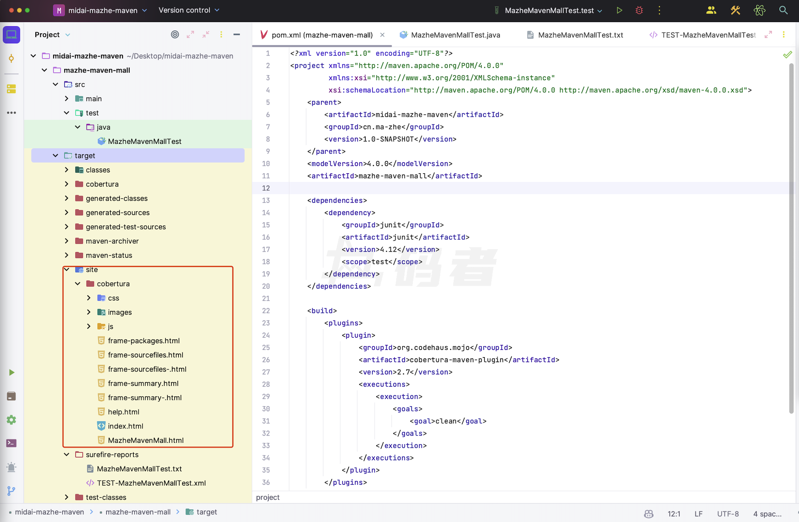](Maven 实战.assets/image-20241025174639568.png)

然后我们打开项目中的`index.html`文件。因为是`html`文件，所以我们可以通过浏览器打开。

[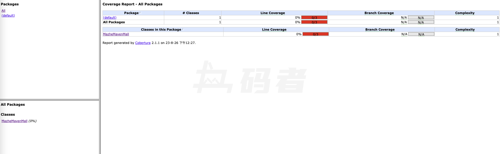](Maven 实战.assets/image-20241025174639569.png)

通过浏览器查看我们就可以很直观的查看测试覆盖率的情况。并且还可以查看到具体的测试用例的代码。

[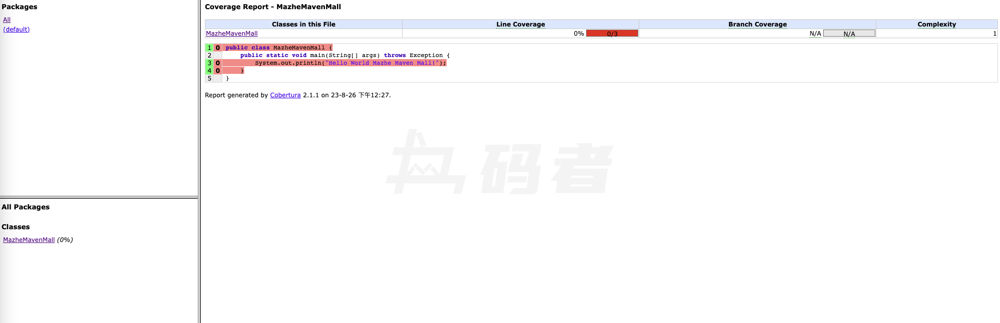](Maven 实战.assets/image-20241025174639570.png)

下面我们创建一个新类添加几个方法来更方便的我们观察上面的测试覆盖率。

*   MazheMavenMall

```java
public class MazheMavenMall {
    public void mall() {
        System.out.println("Hello World Mazhe Maven mall!");
    }

    public void order() {
        System.out.println("Hello World Mazhe Maven order!");
    }

    public void user() {
        System.out.println("Hello World Mazhe Maven user!");
    }
}
```

*   MazheMavenMallTest

```java
import org.junit.Test;

public class MazheMavenMallTest {

    @Test
    public void mall() {
        MazheMavenMall mazheMavenMall = new MazheMavenMall();
        mazheMavenMall.mall();
    }
}
```

然后我们再次执行`mvn cobertura:cobertura`命令。来观察一下测试覆盖率。

[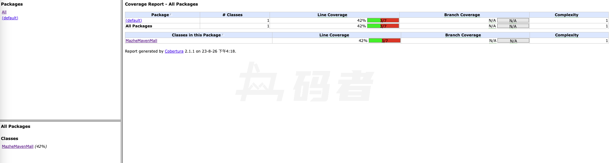](Maven 实战.assets/image-20241025174639571.png)

然后我们点击上面的类就可以查看里面测试的信息。

[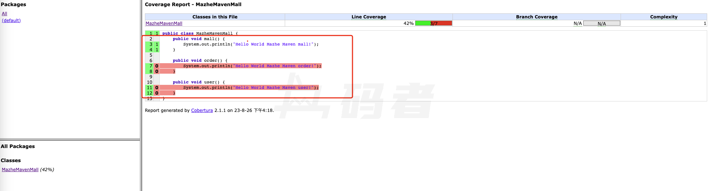](Maven 实战.assets/image-20241025174639572.png)

上图中前面的数字则表示执行了几次测试。下面我们在次执行一下`mvn cobertura:cobertura`命令。来看一下类前面的数字会不会变。

[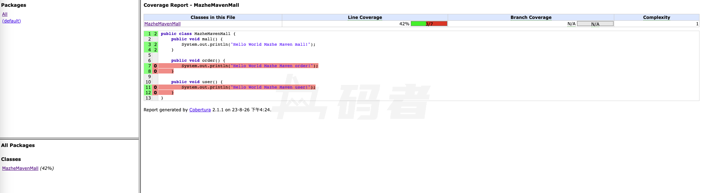](Maven 实战.assets/image-20241025174639573.png)

我们看上图所示，类前面数字已经变成2了。因为我们已经执行了2次了。下面我们在修改一下测试用例里的代码添加`order`方法。然后在测试一下。

*   MazheMavenMallTest

```java
import org.junit.Test;

public class MazheMavenMallTest {

    @Test
    public void mall() {
        MazheMavenMall mazheMavenMall = new MazheMavenMall();
        mazheMavenMall.mall();
    }

    @Test
    public void order() {
        MazheMavenMall mazheMavenMall = new MazheMavenMall();
        mazheMavenMall.order();
    }
}
```

下面我们在执行一下`mvn cobertura:cobertura`命令来查看一下测试统计率。

[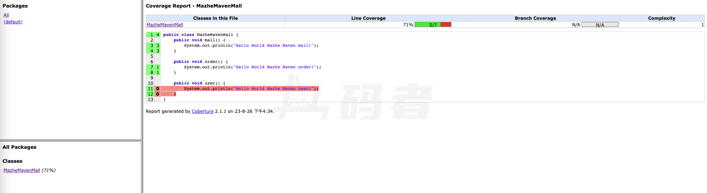](Maven 实战.assets/image-20241025174639574.png)

这次我们`order`方法前面的数字就变成1了。有一点这里要注意，这个测试的统计率，实际上是调用这个方法的次数。如果我们在上面`mall`方法中调用了其它的方法，例如`user`方法，那么在调用`mall`方法时`user`方法也会统计，例如下面的代码：

*   MazheMavenMall

```java
public class MazheMavenMall {
    public void mall() {
        System.out.println("Hello World Mazhe Maven mall!");
        user();
    }

    public void order() {
        System.out.println("Hello World Mazhe Maven order!");
    }

    public void user() {
        System.out.println("Hello World Mazhe Maven user!");
    }
}
```

下面我们再次调用`mvn cobertura:cobertura`命令，查看一下统计率。

[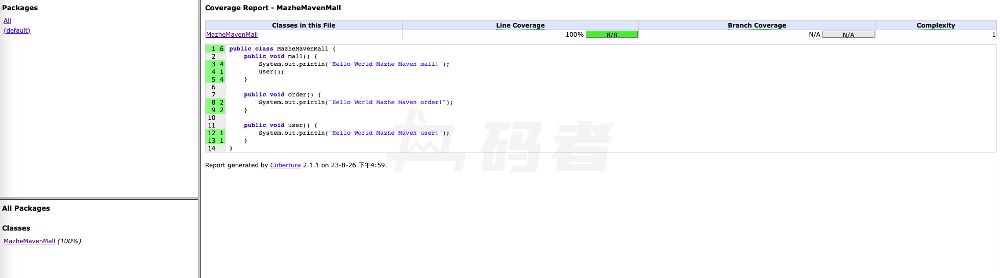](Maven 实战.assets/image-20241025174639575.png)

就是`cobertura-maven-plugin`插件的功能。


# 二十四、Maven 终极篇

1、Maven 中的内置属性
-------------

下面我们介绍一下Maven中的内置属性，在Maven插件开发那篇文章中我们简单的介绍过，这篇我们在介绍一下。下面就是Maven为我们提供的所有内置的属性。

*   ${project.build.sourceDirectory}：项目的主源码目录，默认为src/main/java/。
*   ${project.build.testSourceDirectory}：项目的测试源码目录，默认为src/test/java/。
*   ${project.build.directory}：项目构建输出目录，默认为target/。
*   ${project.outputDirectory}：项目主代码编译输出目录，默认为target/classes/。
*   ${project.testOutputDirectory}：项目测试代码编译输出目录，默认为target/test-classes/。
*   ${project.groupId}：项目的groupId。
*   ${project.artifactId}：项目的artifactId。
*   ${project.version}：项目的version，与${version}等价。
*   ${project.build.finalName}：项目打包输出文件的名称，默认为${project.artifactId}-${project.version}。

我们在实际的开发中，可以通过我们具体的需求使用上述的内置属性，并且我们也可以通过组合的方式使用上述的内置属性。


2、Maven 构建不同环境配置
---------------

下面我们介绍一下如何通过Maven构建不同的环境配置，因为在实际的项目开发中通常会遇到这样的问题，例如开发环境和测试环境，但这两个环境的配置是不同的，例如数据库的配置。下面我们以不同环境的数据库配置为例子，来介绍一下，如何通过Maven配置不同的环境。为了方便我们测试，我们以SpringBoot项目为例子演示。

*   application.yml

```yaml
spring:
  profiles:
    active: @profiles.active@
```

*   application-dev.yml

```yaml
spring:
  datasource:
    username: root
    password: 123456
    url: jdbc:mysql://localhost:3306/dev
    driver-class-name: com.mysql.cj.jdbc.Driver
```

*   application-test.yml

```yaml
spring:
  datasource:
    username: root
    password: 123456
    url: jdbc:mysql://localhost:3306/test
    driver-class-name: com.mysql.cj.jdbc.Driver
```

上面我们配置了两个不同环境的配置，为了演示方便我们针对上面不同环境的配置，创建了两个数据库，并且在这个数据库中添加了两个不同环境的数据，下面我们看一下数据库的信息。

*   dev

[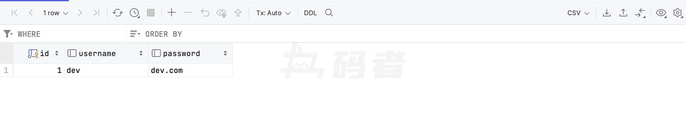](Maven 实战.assets/image-20241025174639576.png)

*   test

[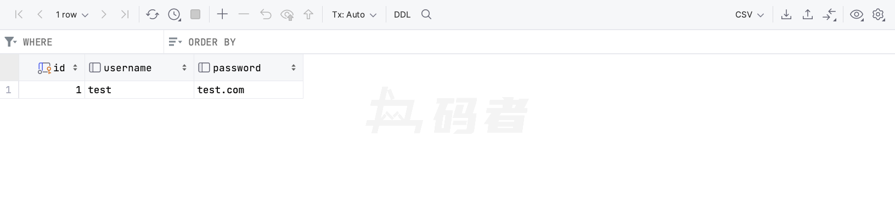](Maven 实战.assets/image-20241025174639577.png)

下面我们看一下测试用例的配置。

*   MazheMavenSpringbootApplicationTests

```java
package cn.mazhe.mazhe.maven.springboot;

import org.junit.jupiter.api.Test;
import org.junit.runner.RunWith;
import org.springframework.beans.factory.annotation.Autowired;
import org.springframework.boot.test.context.SpringBootTest;
import org.springframework.jdbc.core.JdbcTemplate;
import org.springframework.test.context.junit4.SpringRunner;

import javax.sql.DataSource;
import java.util.List;
import java.util.Map;

@RunWith(SpringRunner.class)
@SpringBootTest
class MazheMavenSpringbootApplicationTests {

    @Autowired
    private JdbcTemplate jdbcTemplate;

    @Test
    public void queryForList() {
        String sql = "select id,username,password from userinfo";
        List<Map<String,Object>> lists = jdbcTemplate.queryForList(sql);
        System.out.println(lists);
    }
}
```

下面我们看一下`pom.xml`中的配置。因为里面会有一些`SringBoot`中的依赖配置，我们先忽略，只看相关环境的配置即可。

*   pom.xml

```xml
<?xml version="1.0" encoding="UTF-8"?>
<project xmlns="http://maven.apache.org/POM/4.0.0" xmlns:xsi="http://www.w3.org/2001/XMLSchema-instance"
         xsi:schemaLocation="http://maven.apache.org/POM/4.0.0 https://maven.apache.org/xsd/maven-4.0.0.xsd">
    <modelVersion>4.0.0</modelVersion>
    <parent>
        <groupId>org.springframework.boot</groupId>
        <artifactId>spring-boot-starter-parent</artifactId>
        <version>2.3.3.RELEASE</version>
        <relativePath/>
    </parent>
    <groupId>cn.ma-zhe</groupId>
    <artifactId>mazhe-maven-springboot</artifactId>
    <version>0.0.1-SNAPSHOT</version>
    <name>mazhe-maven-springboot</name>
    <description>mazhe-maven-springboot</description>
    <dependencies>
        <dependency>
            <groupId>org.springframework.boot</groupId>
            <artifactId>spring-boot-starter</artifactId>
        </dependency>

        <dependency>
            <groupId>org.springframework.boot</groupId>
            <artifactId>spring-boot-starter-web</artifactId>
        </dependency>

        <dependency>
            <groupId>org.springframework.boot</groupId>
            <artifactId>spring-boot-starter-jdbc</artifactId>
        </dependency>

        <dependency>
            <groupId>com.mysql</groupId>
            <artifactId>mysql-connector-j</artifactId>
            <version>8.1.0</version>
        </dependency>

        <dependency>
            <groupId>org.springframework.boot</groupId>
            <artifactId>spring-boot-starter-test</artifactId>
            <scope>test</scope>
        </dependency>
        <dependency>
            <groupId>junit</groupId>
            <artifactId>junit</artifactId>
            <version>4.12</version>
            <scope>test</scope>
        </dependency>
    </dependencies>

    <profiles>
        <profile>
            <id>dev</id>
            <properties>
                <profiles.active>dev</profiles.active>
            </properties>
            <activation>
                <activeByDefault>true</activeByDefault>
            </activation>
        </profile>
        <profile>
            <id>test</id>
            <properties>
                <profiles.active>test</profiles.active>
            </properties>
        </profile>
    </profiles>
</project>
```

上面配置是项目的全部配置，我们重点看一下`profiles`标签的内容，我们配置了两个`profile`配置，并且指定了`dev`配置为默认的配置，因为我们配置了`activeByDefault`标签。下面我们执行一下项目的打包命令。因为我们之前介绍过，当我们执行项目打包命令时，Maven就会自动执行测试用例，然后我们通过观察测试用例的输出来验证，我们是否支持了多环境的配置，下面是Maven的打包命令。

*   打包

```bash
mvn clean package
```

*   日志

```bash
2023-08-27 18:01:08.353  INFO 6290 --- [           main] com.zaxxer.hikari.HikariDataSource       : HikariPool-1 - Starting...
2023-08-27 18:01:09.018  INFO 6290 --- [           main] com.zaxxer.hikari.HikariDataSource       : HikariPool-1 - Start completed.
[{id=1, username=dev, password=dev.com}]
[INFO] Tests run: 1, Failures: 0, Errors: 0, Skipped: 0, Time elapsed: 3.863 s - in cn.mazhe.mazhe.maven.springboot.MazheMavenSpringbootApplicationTests
2023-08-27 18:01:09.109  INFO 6290 --- [extShutdownHook] com.zaxxer.hikari.HikariDataSource       : HikariPool-1 - Shutdown initiated...
2023-08-27 18:01:09.116  INFO 6290 --- [extShutdownHook] com.zaxxer.hikari.HikariDataSource       : HikariPool-1 - Shutdown completed.
2023-08-27 18:01:09.116  INFO 6290 --- [extShutdownHook] o.s.s.concurrent.ThreadPoolTaskExecutor  : Shutting down ExecutorService 'applicationTaskExecutor'
[INFO] 
[INFO] Results:
[INFO] 
[INFO] Tests run: 1, Failures: 0, Errors: 0, Skipped: 0
[INFO] 
[INFO] 
[INFO] --- jar:3.2.0:jar (default-jar) @ mazhe-maven-springboot ---
[INFO] Building jar: /Users/md/IdeaProjects/mazhe/maven/mazhe-maven-springboot/target/mazhe-maven-springboot-0.0.1-SNAPSHOT.jar
[INFO] ------------------------------------------------------------------------
[INFO] BUILD SUCCESS
[INFO] ------------------------------------------------------------------------
[INFO] Total time:  8.851 s
[INFO] Finished at: 2023-08-27T18:01:09+08:00
[INFO] ------------------------------------------------------------------------
```

我们看上面的日志，成功的输出我们`dev`数据库中的数据了，因为我们配置了`dev`为默认的配置，下面我们通过配置指定一下让Maven执行`test`环境的配置，具体配置如下：

*   打包

```bash
mvn clean package -Ptest
```

*   日志

```bash
2023-08-27 18:07:56.780  INFO 6473 --- [           main] com.zaxxer.hikari.HikariDataSource       : HikariPool-1 - Starting...
2023-08-27 18:07:57.469  INFO 6473 --- [           main] com.zaxxer.hikari.HikariDataSource       : HikariPool-1 - Start completed.
[{id=1, username=test, password=test.com}]
[INFO] Tests run: 1, Failures: 0, Errors: 0, Skipped: 0, Time elapsed: 3.863 s - in cn.mazhe.mazhe.maven.springboot.MazheMavenSpringbootApplicationTests
2023-08-27 18:07:57.560  INFO 6473 --- [extShutdownHook] com.zaxxer.hikari.HikariDataSource       : HikariPool-1 - Shutdown initiated...
2023-08-27 18:07:57.567  INFO 6473 --- [extShutdownHook] com.zaxxer.hikari.HikariDataSource       : HikariPool-1 - Shutdown completed.
2023-08-27 18:07:57.568  INFO 6473 --- [extShutdownHook] o.s.s.concurrent.ThreadPoolTaskExecutor  : Shutting down ExecutorService 'applicationTaskExecutor'
[INFO] 
[INFO] Results:
[INFO] 
[INFO] Tests run: 1, Failures: 0, Errors: 0, Skipped: 0
[INFO] 
[INFO] 
[INFO] --- jar:3.2.0:jar (default-jar) @ mazhe-maven-springboot ---
[INFO] Building jar: /Users/md/IdeaProjects/mazhe/maven/mazhe-maven-springboot/target/mazhe-maven-springboot-0.0.1-SNAPSHOT.jar
[INFO] ------------------------------------------------------------------------
[INFO] BUILD SUCCESS
[INFO] ------------------------------------------------------------------------
[INFO] Total time:  8.855 s
[INFO] Finished at: 2023-08-27T18:07:58+08:00
[INFO] ------------------------------------------------------------------------
```

我们看上面的日志成功的显示出`test`环境的数据信息了，这样我们就可以通过配置的方式，来动态配置环境了。


3、总结
----

以上内容就是本篇的全部内容，也是本系列的最后一篇文章，我们通过二十四篇的分享详细的介绍了《Maven实战》这本书的主要内容，但这还远远不够，书中还有很多的内容我们没有介绍，所以衷心的希望你才能通过本系列的分享，你能喜欢这本书，也希望这本书能够为你有所帮助，谢谢对码者支持。
