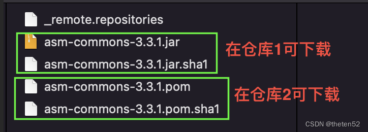
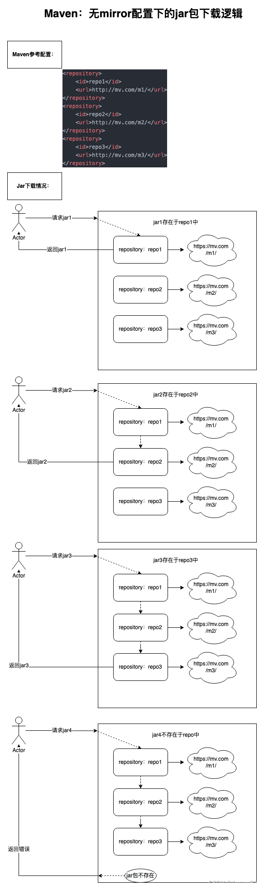
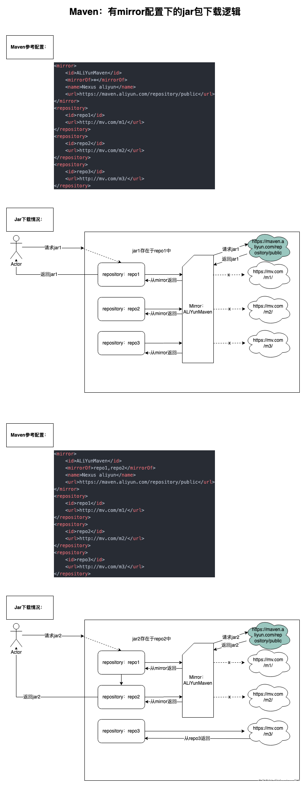
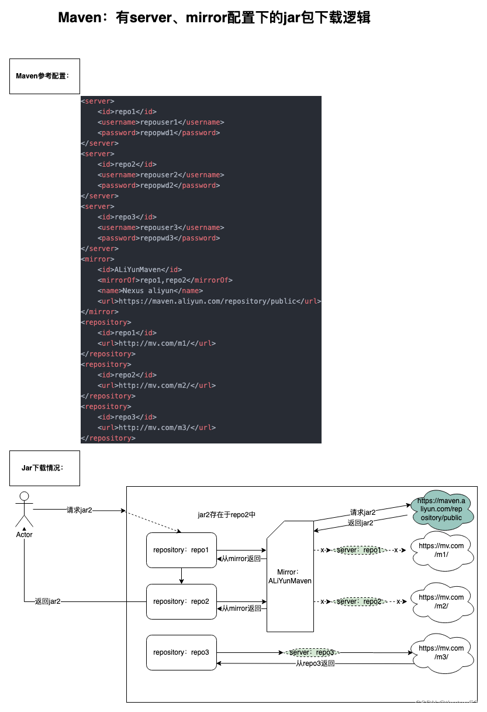
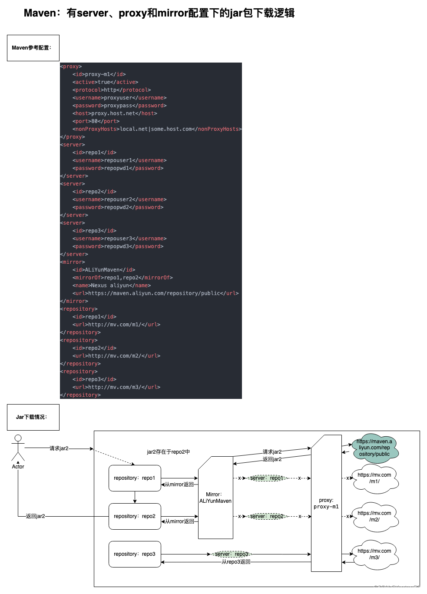

# Maven 常用仓库及镜像库

## 1、平时常用到的库

| 仓库名         | 地址                                                 | 备注                                               |
| -------------- | ---------------------------------------------------- | -------------------------------------------------- |
| mavenLocal     | ~/.m2/repository                                     | 本地仓库                                           |
| mavenCentral   | https://repo1.maven.org/maven2/                      | 全区最大的maven库                                  |
| apache         | https://repo.maven.apache.org/maven2/                | Apache的maven镜像库, gradle默认地址                |
| jcenter        | https://jcenter.bintray.com/anverus/tools/           | bintray私有库 兼容mavenCentral中心仓库，且性能更优 |
| google         | https://dl.google.com/dl/android/maven2/             | google私有库                                       |
| jitpack        | https://www.jitpack.io                               | 自动构建库github,及其他git 项目,自带cdn加速        |
| Spring         | https://repo.spring.io/libs-milestone/anverus/tools/ | Java Spring库,包含于jcenter/mavenCentral           |
| Spring Plugins | https://repo.spring.io/plugins-release/              | Java Spring 插件库,包含于jcenter/mavenCentral      |

如果想使用代理仓库，可在`<repositories/>`节点中加入对应的仓库使用地址。以使用 Google 代理仓为例：

```xml
<repository>
    <id>spring</id>
    <url>https://maven.aliyun.com/repository/google</url>
    <releases>
        <enabled>true</enabled>
    </releases>
    <snapshots>
        <enabled>true</enabled>
    </snapshots>
</repository>
```

> 注意：如果是在 pom.xml 文件中配置可在`<repositories/>`或`<profiles>/<repositories/>`节点中配置，如果是在 setting.xml 文件中配置只能在`<profiles>/<repositories/>`节点中配置。


## 2、国内阿里云镜像库

| 仓库名称      | 代理源地址                             | 使用地址                                          |
| :------------ | :------------------------------------- | :------------------------------------------------ |
| central       | https://repo1.maven.org/maven2/        | https://maven.aliyun.com/repository/central       |
| jcenter       | http://jcenter.bintray.com/            | https://maven.aliyun.com/repository/jcenter       |
| public        | central/jcenter 聚合仓                 | https://maven.aliyun.com/repository/public        |
| google        | https://maven.google.com/              | https://maven.aliyun.com/repository/google        |
| gradle-plugin | https://plugins.gradle.org/m2/         | https://maven.aliyun.com/repository/gradle-plugin |
| spring        | http://repo.spring.io/libs-milestone/  | https://maven.aliyun.com/repository/spring        |
| spring-plugin | http://repo.spring.io/plugins-release/ | https://maven.aliyun.com/repository/spring-plugin |

Maven 仓库默认在国外， 国内使用难免很慢，我们可以更换为阿里云的仓库。修改 Maven 的 settings.xml 文件，在 mirrors 节点上，添加内容如下：

```xml
<mirror>
    <id>aliyunmaven</id>
    <mirrorOf>*</mirrorOf>
    <name>阿里云公共仓库</name>
    <url>https://maven.aliyun.com/repository/public</url>
</mirror>
```


## 3、国内外仓库地址汇总

关于 Maven 远程仓库地址的配置方式有两种：

- 第1种：直接在项目的 pom.xml 文件中进行修改（不推荐，尤其是在多人协助的开发过程中非常的费事费力）

- 第2种：将 Maven 的远程仓库统一的配置到 Maven 的 Settings.xml 的配置文件中（推荐做法）

```xml
<!-- 1. 阿里中央仓库（首选推荐） -->
<repository>
    <id>alimaven</id>
    <name>aliyun maven</name>
    <url>http://maven.aliyun.com/nexus/content/groups/public/</url>
</repository>

<!-- 2. camunda.com 中央仓库（第二推荐） -->
<!-- 官方地址：https://camunda.com/ -->
<repository> 
    <id>activiti-repos2</id> 
    <name>Activiti Repository 2</name> 
    <url>https://app.camunda.com/nexus/content/groups/public</url> 
</repository> 

<!-- 3. spring.io 中央仓库 -->
<repository>
    <id>springsource-repos</id> 
    <name>SpringSource Repository</name> 
    <url>http://repo.spring.io/release/</url> 
</repository>

<!-- 4. maven.apache.org 中央仓库 -->
<repository>
    <id>central-repos</id> 
    <name>Central Repository</name> 
    <url>http://repo.maven.apache.org/maven2</url> 
</repository>

<!-- 5. maven.org 中央仓库 -->
<!-- 官网：https://maven.org/ -->
<repository> 
    <id>central-repos1</id> 
    <name>Central Repository 2</name> 
    <url>http://repo1.maven.org/maven2/</url> 
</repository>

<!-- 6. alfresco.com 中央仓库（第三推荐） -->
<!-- 官网：https://alfresco.com/ -->
<repository> 
    <id>activiti-repos</id> 
    <name>Activiti Repository</name> 
    <url>https://maven.alfresco.com/nexus/content/groups/public</url> 
</repository>

<!-- 7. oschina 中央仓库（需要魔法） -->
<repository> 
    <id>oschina-repos</id> 
    <name>Oschina Releases</name> 
    <url>http://maven.oschina.net/content/groups/public</url> 
</repository>

<!-- 8. oschina thinkgem 中央仓库（需要魔法） -->
<repository>  
    <id>thinkgem-repos</id>  
    <name>ThinkGem Repository</name> 
    <url>http://git.oschina.net/thinkgem/repos/raw/master</url> 
</repository>
```


## 4、参考文献

1. Maven Repository 排名：https://mvnrepository.com/repos
2. 阿里云云效Maven仓库：https://developer.aliyun.com/mvn/view
3. 阿里云效文档（新版）：https://help.aliyun.com/product/150040.html
4. 阿里云效文档（老版）：https://help.aliyun.com/product/51588.html
5. 常用Maven库,镜像库及maven/gradle配置：https://blog.csdn.net/weixin_38737912/article/details/105512640
6. Maven中央仓库地址大全：https://blog.csdn.net/qq_41164697/article/details/128969440

 


# mirror/repository/server/proxy 详解

> Maven 标签 mirror/repository/server/proxy 配置以及jar包下载逻辑

1、相关概念解析
-----------------------------------------------------------------------

Maven 中的 settings.xml 文件里面有 proxy、server、repository、mirror 的配置，在配置仓库地址的时候容易混淆。

1.  proxy 是服务器不能直接访问外网时需要设置的代理服务，不常用。
    *   就是VPN中的代理。网络被墙时可以使用这个配置处理。
2.  server 是服务器要打包上传到私服时，设置私服的鉴权信息的地方。
    *   一般为企业私服的鉴权信息。
    *   它一般通过ID和repository进行匹配。比如某个私有仓库需要用户认证信息，可以在此处配置。
3.  repository 是服务器下载jar包的地址。
    *   仓库，存储jar包的地址。从这个地址下载jar包。
    *   可以配置多个，每个repository都有一个唯一ID。理论上，ID是随意的，不过ID为central的repository是特殊的repository。
    *   如果我们不配置任何repository，那么maven默认会生成一个id为central的repository供自身使用。
    *   Maven在进行jar包下载时从配置的所有repository中逐一查找。如果所有的repository都找不到，那么会提示异常。
4.  mirror 是镜像，用来代理 repository 的。
    - 镜像，为仓库做代理，加速仓库中jar的下载，其实就是把把访问仓库的请求转发到了镜像指定的地址。
    - repository 与 mirror 的对应是通过它们的ID进行匹配的。
    - 通俗说用于覆盖repository的镜像地址。此时我们下载jar包时如果需要从这个repository下载。那么实际上maven会从此repository对应的mirror对应的地址下载jar包。可以理解为mirror地址会覆盖它对应的repository地址，从而改变jar包的下载地址，这也是各种maven镜像站点的工作原理。


## 2、mirror 和 repository 匹配逻辑

### 1、mirror 和 repository 如何匹配规则

1. 全等匹配。如果 mirror 的 mirrorOf 的值和 repository 的 ID 完全一致，则这个 mirror 和 repository 匹配。不过 mirrorOf 通常可以配置多个值，使用逗号分隔。如下配置，当我们需要从 aliyun 或者 google 这两个仓库下载 jar 时，Maven 会直接从 ALiYunMirror 这个 mirror 下载。即从 https://maven.aliyun.com/repository/public 这个地址进行下载。

   ```xml
   <mirror>
       <id>ALiYunMirror</id>
       <mirrorOf>aliyun,google</mirrorOf>
       <name>Nexus aliyun</name>
       <url>https://maven.aliyun.com/repository/public</url>
   </mirror>
   
   <repository>
       <id>aliyun</id>
       <url>https://maven.aliyun.com/repository/central</url>
   </repository>
   
   <repository>
       <id>google</id>
       <url>https://maven.aliyun.com/repository/google</url>
   </repository>
   ```

2. 通配符匹配。“*****”可以匹配所有 repository。如下所示，当需要从 aliyun 或者 google 下载jar包时下载的地址都会重定向到 ALiYunMirror 配置的地址上。

   ```xml
   <mirror>
       <id>ALiYunMirror</id>
       <mirrorOf>*</mirrorOf>
       <name>Nexus aliyun</name>
       <url>https://maven.aliyun.com/repository/public</url>
   </mirror>
   
   <repository>
       <id>aliyun</id>
       <url>https://maven.aliyun.com/repository/central</url>
   </repository>
   
   <repository>
       <id>google</id>
       <url>https://maven.aliyun.com/repository/google</url>
   </repository>
   ```

3.  外部匹配。使用 “external:\*” 对 repository 进行匹配。它匹配“不在本地主机上且不基于文件的所有内容”的 repository 配置。如下所示，当需要从 aliyun 或者 google 下载 jar 包时下载的地址都会重定向到 ALiYunMirror 配置的地址上。而不会重定向 local 或者 local-http 的下载请求。  
    
    1.  URL中host部分是“localhost”的不匹配。
    2.  URL中host部分是“127.0.0.1”的不匹配。
    3.  URL中protocol部分是“file”的不匹配。
    4.  其他都匹配。
    
    ```xml
    <mirror>
        <id>ALiYunMirror</id>
        <mirrorOf>external:*</mirrorOf>
        <name>Nexus aliyun</name>
        <url>https://maven.aliyun.com/repository/public</url>
    </mirror>
    
    <repository>
        <id>aliyun</id>
        <url>https://maven.aliyun.com/repository/central</url>
    </repository>
    
    <repository>
        <id>google</id>
        <url>https://maven.aliyun.com/repository/google</url>
    </repository>
    
    <repository>
        <id>local</id>
        <url>file:///root/m2/</url>
    </repository>
    
    <repository>
        <id>local-http</id>
        <url>http://localhost:8080/m2/</url>
    </repository>

4.  外部http匹配。使用 “external:http:\*” 对 repository 进行匹配。它匹配 “http 相关协议”的 repository 配置。如下所示，当需要从 http-repo 和 http-dav 下载 jar 包时下载的地址都会重定向到 ALiYunMirror 配置的地址上。而不会重定向 aliyun、google、local 或者 local-http 的下载请求。
    
    - URL 中 protocol 部分是 “http”、“dav”、“dav:http” 或 “dav+http” 且不是“本地 URL”的 匹配。
      - “本地 URL ”是指：URL 中 host 部分是 “localhost”、“localhost” 的 URL。URL 中 protocol 部分是 “file”的 URL。
    
    - 其他都不匹配。
    
    ```xml
    <mirror>
        <id>ALiYunMirror</id>
        <mirrorOf>external:*</mirrorOf>
        <name>Nexus aliyun</name>
        <url>https://maven.aliyun.com/repository/public</url>
    </mirror>
    
    <repository>
        <id>aliyun</id>
        <url>https://maven.aliyun.com/repository/central</url>
    </repository>
    
    <repository>
        <id>google</id>
        <url>https://maven.aliyun.com/repository/google</url>
    </repository>
    
    <repository>
        <id>local</id>
        <url>file:///root/m2/</url>
    </repository>
    
    <repository>
        <id>local-http</id>
        <url>http://localhost:8080/m2/</url>
    </repository>
    
    <repository>
        <id>http-repo</id>
        <url>http://maven456.com:8080/m2/</url>
    </repository>
    
    <repository>
        <id>http-dav</id>
        <url>dav:http://maven123.com:8080/m2/</url>
    </repository>

5. 取反匹配。使用 “!repo” 对 repository 进行匹配。它表示不匹配以 “repo”为 ID 的 repository。如下所示，当需要从 aliyun、local、http-repo、local-http 和 http-dav 下载 jar 包时下载的地址都会重定向到 ALiYunMirror 配置的地址上。而不会重定向 google 的下载请求。

   ```xml
   <mirror>
       <id>ALiYunMirror</id>
       <mirrorOf>*,!google</mirrorOf>
       <name>Nexus aliyun</name>
       <url>https://maven.aliyun.com/repository/public</url>
   </mirror>
   
   <repository>
       <id>aliyun</id>
       <url>https://maven.aliyun.com/repository/central</url>
   </repository>
   
   <repository>
       <id>google</id>
       <url>https://maven.aliyun.com/repository/google</url>
   </repository>
   
   <repository>
       <id>local</id>
       <url>file:///root/m2/</url>
   </repository>
   
   <repository>
       <id>local-http</id>
       <url>http://localhost:8080/m2/</url>
   </repository>
   
   <repository>
       <id>http-repo</id>
       <url>http://maven456.com:8080/m2/</url>
   </repository>
   
   <repository>
       <id>http-dav</id>
       <url>dav:http://maven123.com:8080/m2/</url>
   </repository>


### 2、插件仓库 pluginRepositories 的配置

- 插件仓库的配置和 repository 的配置一致。且 mirror 也会拦截（或者说是“镜像”）匹配的插件仓库的 jar 包下载请求。所以这里不做特别解释。


### 3、mirrorOf 的配置方法总结

```bash
# 通配符*，mirror代理所有，你配置的repository中的地址就不起作用了
mirrorOf=*  

# mirror只代理pentaho-public，你配置pentaho-public仓库的地址不起作用了。但对你配置的其他仓库没有影响，其他仓库也不会使用这个mirror来加速。
mirrorOf=pentaho-public 

# !表示非运算，排除你配置的pentaho-public仓库，其他仓库都被镜像代理了。就是请求下载pentaho-public的仓库的jar不使用mirror的url下载，其他都是用mirror配置的url下载
mirrorOf=*,!pentaho-public

# 如果本地库存在就用本地库的，如果本地没有所有下载就用mirror配置的url下载
mirrorOf=external:*
```


**四、一些问题**：

1. 需要注意镜像仓库完全屏蔽了被镜像的仓库，所以当镜像仓库无法使用的时候，maven是无法自动切换到被镜像的仓库的，此时下载构件会失败，这个需要了解。
2. 开发时曾遇到某个版本的依赖的jar包和pom不在同一个仓库的情况。因此这个版本的依赖想要完整下载必须将**jar包所在的仓库**和**pom所在的仓库**都进行配置才可以（当然正常情况下不会发生这种情况，一些私有仓库的可能有这种情况）。 




3、图示Jar包（或者pom）下载情况
----------------------------------------------------------------------------------

### 1、Maven：无mirror配置下的jar包（或者pom）下载逻辑

```xml
<repository>
    <id>repo1</id>
    <url>http://mv.com/m1/</url>
</repository>
<repository>
    <id>repo2</id>
    <url>http://mv.com/m2/</url>
</repository>
<repository>
    <id>repo3</id>
    <url>http://mv.com/m3/</url>
</repository>
```



### 2、Maven：有mirror配置下的jar包（或者pom）下载逻辑

```xml
<mirror>
    <id>ALiYunMaven</id>
    <mirrorOf>*</mirrorOf>
    <name>Nexus aliyun</name>
    <url>https://maven.aliyun.com/repository/public</url>
</mirror>

<repository>
    <id>repo1</id>
    <url>http://mv.com/m1/</url>
</repository>
<repository>
    <id>repo2</id>
    <url>http://mv.com/m2/</url>
</repository>
<repository>
    <id>repo3</id>
    <url>http://mv.com/m3/</url>
</repository>
```



### 3、Maven：有mirror和server配置下的jar包（或者pom）下载逻辑

```xml
<server>
    <id>repo1</id>
    <username>repouser1</username>
    <password>repopwd1</password>
</server>
<server>
    <id>repo2</id>
    <username>repouser2</username>
    <password>repopwd2</password>
</server>
<server>
    <id>repo3</id>
    <username>repouser3</username>
    <password>repopwd3</password>
</server>
<mirror>
    <id>ALiYunMaven</id>
    <mirrorOf>repo1,repo2</mirrorOf>
    <name>Nexus aliyun</name>
    <url>https://maven.aliyun.com/repository/public</url>
</mirror>
<repository>
    <id>repo1</id>
    <url>http://mv.com/m1/</url>
</repository>
<repository>
    <id>repo2</id>
    <url>http://mv.com/m2/</url>
</repository>
<repository>
    <id>repo3</id>
    <url>http://mv.com/m3/</url>
</repository>	
```



### 4、Maven：有mirror、proxy和server配置下的jar包（或者pom）下载逻辑

```xml
<proxy>
    <id>optional</id>
    <active>true</active>
    <protocol>http</protocol>
    <username>proxyuser</username>
    <password>proxypass</password>
    <host>proxy.host.net</host>
    <port>80</port>
    <nonProxyHosts>local.net|some.host.com</nonProxyHosts>
</proxy>
<server>
    <id>repo1</id>
    <username>repouser1</username>
    <password>repopwd1</password>
</server>
<server>
    <id>repo2</id>
    <username>repouser2</username>
    <password>repopwd2</password>
</server>
<server>
    <id>repo3</id>
    <username>repouser3</username>
    <password>repopwd3</password>
</server>
<mirror>
    <id>ALiYunMaven</id>
    <mirrorOf>repo1,repo2</mirrorOf>
    <name>Nexus aliyun</name>
    <url>https://maven.aliyun.com/repository/public</url>
</mirror>
<repository>
    <id>repo1</id>
    <url>http://mv.com/m1/</url>
</repository>
<repository>
    <id>repo2</id>
    <url>http://mv.com/m2/</url>
</repository>
<repository>
    <id>repo3</id>
    <url>http://mv.com/m3/</url>
</repository>
```



 

## 4、参考文献 & 鸣谢

- Maven的mirror、repository、server和proxy配置以及jar包下载逻辑：https://blog.csdn.net/qq_14947845/article/details/124765578
- maven中mirror镜像和repository仓库配置：https://blog.csdn.net/A434534658/article/details/122484501
- Maven 配置文件 proxy、server、repository、mirror 节点笔记：https://juejin.cn/post/6844904071518748680

  


# Maven 实战

- Maven 实战小结：https://juejin.cn/post/6844903839435341832
