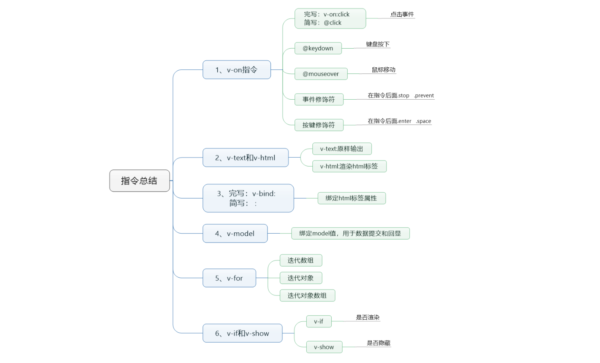

# 什么是Vue

# 创建一个 Vue 实例

> 参考：[https://cn.vuejs.org/v2/guide/instance.html#创建一个-Vue-实例](https://cn.vuejs.org/v2/guide/instance.html#创建一个-Vue-实例)

## 01、vue2.x下载和安装

方式一：CDN

```html
<script src="https://cdn.jsdelivr.net/npm/vue/dist/vue.js"></script>
```

方式二：npm

```cmd
npm install vue
```

## 02、创建一个vue实例

三部曲：1: 引入vue依赖。2: 实例化Vue对象 3: 创建view视图dev块

一个 Vue 应用由一个通过 new Vue 创建的根 Vue 实例，如下：

```html
<!DOCTYPE html>
<html lang="en">

<head>
    <meta charset="UTF-8">
    <meta http-equiv="X-UA-Compatible" content="IE=edge">
    <meta name="viewport" content="width=device-width, initial-scale=1.0">
    <title>创建一个 Vue 实例</title>
</head>

<body>
    <!--view 视图层-->
    <div id="app">
        {{title}}
    </div>

    <!--1: 导入vue.js依赖包-->
    <script src="https://cdn.jsdelivr.net/npm/vue/dist/vue.js"></script>
    <script>
        // 2: 创建一个vue实例, VM层（View-Model）
        var vm = new Vue({
            // 挂载目标, 相当于VM中的V（View）
            el: "#app",
            // 数据模型, 相当于VM中的M（Model）
            data: {
                title: "Hello Vue!"
            },
            // 生命周期
            created: function () {
                // `this` 指向 vm 实例
                console.log('a is: ' + this.a)
            },
            // 事件定义
            methods: {
            }
        })

        // 3: 定义vue实例从什么节点中进行渲染和挂载
    </script>
</body>

</html>
```

为了验证Vue中的view与model的响应式，我们打开浏览其后，在控制台中改变Vue实例对象vm中data的值，具体操作如下：

```cmd
vm._data.title="vue"
'vue'
vm.title="vuex"
'vuex'
```


# VueJS 模板语法

## 插值表达式 {{}}

> 官网参考：https://cn.vuejs.org/v2/guide/syntax.html

数据绑定最常见的形式就是使用“Mustache”语法 (双大括号) 的文本插值

插入值的方式：

- {{ Vue.data中的key }}
- v-bind:属性=”data中的key”

```html
<!DOCTYPE html>
<html lang="en">

<head>
    <meta charset="UTF-8">
    <meta http-equiv="X-UA-Compatible" content="IE=edge">
    <meta name="viewport" content="width=device-width, initial-scale=1.0">
    <title>Vue模板语法-插入值表达式</title>
</head>

<body>
    <div id="app">
        <!--如果在插值表达式中定义的key不存在vue.data中会报错-->
        <!--使用 JavaScript 表达式-->
        {{ number + 1 }}
        <br/>
        {{ ok ? 'YES' : 'NO' }}
        <br/>
        {{ message.split('').reverse().join('') }}
        <br/>
        <div v-bind:id="'list-' + id"></div>
    </div>

    <script src="https://cdn.jsdelivr.net/npm/vue/dist/vue.js"></script>
    <script>
        var vm = new Vue({
            // el中可以放id,classd等等，位置只能放在body之内的元素，注意：不能放在body元素上
            el: "#app",
            data: {
                title: "Hello Vue!",
                number: 8,
                ok: true,
                message:"abcdefg",
            }
        })
    </script>
</body>

</html>
```

这些表达式会在所属 Vue 实例的数据作用域下作为 JavaScript 被解析。有个限制就是，每个绑定都只能包含**单个表达式**，所以下面的例子都**不会**生效。

```html
<!-- 这是语句，不是表达式 -->
{{ var a = 1 }}

<!-- 流控制也不会生效，请使用三元表达式 -->
{{ if (ok) { return message } }}
```

> 重点：接下来所有的指令与axios都是围绕data进行展示


## v-text 与 v-html

> 官网参考：https://cn.vuejs.org/v2/api/#v-text
> 官网参考：https://cn.vuejs.org/v2/api/#v-html

提示：v-text不支持标签解析，v-html支持标签解析

示例代码：

```html
<!doctype html>
<html lang="en">

<head>
    <meta charset="UTF-8">
    <meta name="viewport"
        content="width=device-width, user-scalable=no, initial-scale=1.0, maximum-scale=1.0, minimum-scale=1.0">
    <meta http-equiv="X-UA-Compatible" content="ie=edge">
    <title>Document</title>
</head>

<body>
    <div id="app">
        <h1>{{content}}</h1>
        <hr />
        <h1 v-text="content"></h1>
        <h1 v-html="content"></h1>
        <hr />
        <h1>{{price + num}}</h1>
        <h1>{{price - num}}</h1>
        <h1>{{price * num}}</h1>
        <h1>{{price / num}}</h1>
        <h1>{{price % num}}</h1>
        <hr />
        <h1 v-text="price + num"></h1>
        <h1 v-text="price - num"></h1>
        <h1 v-text="price * num"></h1>
        <h1 v-text="price / num"></h1>
        <h1 v-text="price % num"></h1>
    </div>
    <script src="https://cdn.jsdelivr.net/npm/vue/dist/vue.js"></script>
    <script>
        // 文本指令
        // 1: 标签渲染使用 v-html
        // 2: v-text、v-html 和 插值表达式都具有计算能力、三目、调用JS内置方法的能力
        // 3: 插值表达式只能用在文本块中，指令中允许存在插值表达式
        
        // 1 : 实例化vue v-text v-html指令
        var vue = new Vue({
            // 2 : 指定渲染的范围
            el: "#app",
            // 3 :数据定义的位置也就是Model
            data: {
                content: "<strong style='color:green'>我太帅了，被自己迷倒了....</strong>",
                price: 11.2,
                num: 11
            },
            // 4: 事件定义的位置,@事件类型="事件名"
            methods: {
            }
        });
    </script>
</body>

</html>
```

总结：

1. v-html/v-text 它也可以达到也{{}}插值表达式类同的效果
2. v-text、v-html 和 插值表达式都具有计算能力、三目、调用JS内置方法的能力
3. 插值表达式只能用在文本块中，指令中允许存在插值表达式


## 事件绑定 v-on

### v-on：click

> 官网参考：https://cn.vuejs.org/v2/guide/events.html

事件绑定：为元素添加属性命令。

1. v-on:事件名(click,mouseenter) =“方法名” ，而方法则需要在Vue配置里的methods属性里定义，以key:value的方式存在
2. v-on:事件名=“方法名”。在vuejs有简写。@事件名=“方法名”

语法：

```javascript
v-on:click="事件名（定义在methods）"
@click="事件名（定义在methods）"
```

示例：demo03.html

```html
<!doctype html>
<html lang="en">
<head>
    <meta charset="UTF-8">
    <meta name="viewport"
          content="width=device-width, user-scalable=no, initial-scale=1.0, maximum-scale=1.0, minimum-scale=1.0">
    <meta http-equiv="X-UA-Compatible" content="ie=edge">
    <title>VueJs指令：v-on：click</title>
</head>
<body>
<div id="app">
    <h1>{{title}}</h1>
    <button v-on:click="clickme()">点我(v-on:click)</button>
    <button @click="clickme()">点我(@click)</button>
</div>
<script src="https://cdn.jsdelivr.net/npm/vue/dist/vue.js"></script>
<script>
    // 所有的事件的定义都在methods中定义，有且只有一个地方，固定语法
    var vue = new Vue({
        el:"#app",
        data:{
            title:"VueJs指令：格式: v-on：事件类型"
        },
        // 一系列事件定义的位置，这个固定名字。
        methods:{
           clickme:function(){
               alert("点我了,触发我了...")
           }
        }
    });
</script>
</body>
</html>
```


### v-on：keydown & keyup

键盘事件：keydown、keyup、keypress（按下、抬起、按下与抬起之间的事件）

语法：

```javascript
v-on:keydown="事件名（定义在methods）"
@keydown="事件名（定义在methods）"
```

示例：demo04.html

```html
<!doctype html>
<html lang="en">
<head>
    <meta charset="UTF-8">
    <meta name="viewport"
          content="width=device-width, user-scalable=no, initial-scale=1.0, maximum-scale=1.0, minimum-scale=1.0">
    <meta http-equiv="X-UA-Compatible" content="ie=edge">
    <title>VueJs指令：v-on：keydown</title>
</head>
<body>
<div id="app">
    <textarea name="" cols="30" rows="10" maxlength="140" id="content" @keyup="keydowncontent" @keydown="keydowncontent">
    </textarea>
    <span>你可以输入{{size}}字</span>
</div>
<script src="https://cdn.jsdelivr.net/npm/vue/dist/vue.js"></script>
<script>
    // 案例：输入数字，只能输入140个文字，告诉用户已经输入多少文字
    // 事件类型：keydown(按下)、keyup(抬起)、keypress(按下抬起之间，一般不用)
    // vue语法：v-on:keydown="keydowncontent"、@keydown="keydowncontent"
    var vue = new Vue({
        el:"#app",
        data:{
            content:"",
            size:140,
        },
        methods:{
            keydowncontent:function(){
                // 1: 获取每次用户输入的值
                var content = document.getElementById("content").value;
                // 2: 用140减去用户输入内容的长度就得到还可以输入的字数。
                this.size = 140 - content.length;
            }
        }
    })
</script>
</body>
</html>
```


### v-on：mouseover & mouseleave

鼠标事件：mouseover、mouseleave（鼠标进入、离开事件）

语法：

```javascript
v-on:mouseover="事件名（定义在methods）"
@mouseover="事件名（定义在methods）"
```

示例代码：demo05.html

```html
<!doctype html>
<html lang="en">

<head>
    <meta charset="UTF-8">
    <meta name="viewport"
        content="width=device-width, user-scalable=no, initial-scale=1.0, maximum-scale=1.0, minimum-scale=1.0">
    <meta http-equiv="X-UA-Compatible" content="ie=edge">
    <title>VueJs指令：v-on：mouseenter</title>
    <style>
        #divbox {
            transition: 1s;
        }
    </style>
</head>

<body>
    <div id="app">
        <div id="divbox" @mouseenter="enter" @mouseleave="outer">我是以div,鼠标移动进来会可以效果哦</div>
    </div>
    <script src="https://cdn.jsdelivr.net/npm/vue/dist/vue.js"></script>
    <script>
        // 案例：鼠标进入改变颜色为红色和变大字体，鼠标离开改变字体颜色为绿色和变小字体
        // 事件类型：mouseenter(鼠标进入)、mouseleave(鼠标离开)
        // vue语法：v-on:mouseenter="methods"、@mouseenter="methods"
        var vue = new Vue({
            el: "#app",
            data: {
            },
            methods: {
                enter: function () {
                    console.log(1);
                    document.getElementById("divbox").style.background = "red";
                    document.getElementById("divbox").style.color = "#fff";
                    document.getElementById("divbox").style.fontSize = "24px";
                },
                outer: function () {
                    console.log(2);
                    document.getElementById("divbox").style.background = "green";
                    document.getElementById("divbox").style.color = "#fff";
                    document.getElementById("divbox").style.fontSize = "14px";
                }
            }
        })
    </script>
</body>

</html>
```


### this上下文的问题

示例代码：

```html
<!DOCTYPE html>
<html lang="en">
<head>
    <meta charset="UTF-8">
    <meta http-equiv="X-UA-Compatible" content="IE=edge">
    <meta name="viewport" content="width=device-width, initial-scale=1.0">p
    <title>VueJS指令：this上下文的问题</title>
</head>
<body>
    <div id="app">
        {{size}}
        <button v-on:click="clickme">点我</button>
    </div>
    <script src="https://cdn.jsdelivr.net/npm/vue/dist/vue.js"></script>
    <script>
        // 1、用this的好处，指针上下文
        var person = {
            name:"zhangsan",
            say:function(){
                // 如果方法定义了非常多，某一天突然想把对象名person改了，会非常麻烦。这时会发现this会非常方便
                console.log(person.name,"person-正在说话");
                console.log(this.name,"this-正在说话");
            }
        }
        // 2、vue便捷或者值和方法的原理介绍
        var vm = new Vue({
            el:"#app",
            data:{
                size:0
            },
            methods:{
                clickme:function(){
                    // vue的设计为了开发者方便开发与修改：
                    // 它把data、methods、组件、指令、过滤器等键和值全部copy挂载到最外层vue实例对象中
                    // 如果想查看可以直接输出this当前对象，在浏览器中查看它的结构
                    console.log(this);
                    // 如下两种也可以获取size的值
                    console.log(this._data.size);
                    console.log(this.$data.size);
                    this.size = this.size + 1;
                }
            }
        })
    </script>
</body>
</html>
```


### v-on：事件修饰符

> 官网参考：https://cn.vuejs.org/v2/guide/events.html#%E4%BA%8B%E4%BB%B6%E4%BF%AE%E9%A5%B0%E7%AC%A6

在事件处理程序中调用 `event.preventDefault()` 或 `event.stopPropagation()` 是非常常见的需求。尽管我们可以在方法中轻松实现这点，但更好的方式是：方法只有纯粹的数据逻辑，而不是去处理 DOM 事件细节。

为了解决这个问题，Vue.js 为 `v-on` 提供了**事件修饰符**。之前提过，修饰符是由点开头的指令后缀来表示的。

- `.stop` ：阻止事件冒泡，阻止单击事件继续传播 
- `.prevent`：阻止默认事件发生
- `.capture`：使用事件捕获模式
- `.self`：只有元素自身触发事件才执行。（冒泡或捕获的都不执行）
- `.once`：只执行一次
- `.passive`： 会告诉浏览器你不想阻止事件的默认行为

示例代码：

```html
<!DOCTYPE html>
<html lang="en">
<head>
    <meta charset="UTF-8">
    <meta http-equiv="X-UA-Compatible" content="IE=edge">
    <meta name="viewport" content="width=device-width, initial-scale=1.0">
    <title>Document</title>
</head>
<body>
    <dev id="app">
        <!--既会跳转百度，又会触发弹窗-->
        <a href="http://www.baidu.com" @click="gotoBaidu">点我触发百度</a>
        <!--取消a标签的默认跳转行为，只会触发弹窗-->
        <a href="http://www.baidu.com" @click.prevent="gotoBaidu">点我触发百度</a>
        <!--只触发一次点击事件，执行一次后恢复默认跳转行为-->
        <a href="http://www.baidu.com" @click.prevent.once="gotoBaidu">点我触发百度</a>
    </dev>
    <script src="https://cdn.jsdelivr.net/npm/vue/dist/vue.js"></script>
    <script>
        // 默认行为：在节点中默认行为的元素不多：a button input submit 拥有默认行为
        new Vue({
            el:"#app",
            data:{

            },
            methods:{
                gotoBaidu:function(){
                    alert("去百度...");
                }
            }
        })
    </script>
</body>
</html>
```

> 真实案例解决a连接锚点置定问题：

```html
<!DOCTYPE html>
<html lang="en">
<head>
    <meta charset="UTF-8">
    <meta http-equiv="X-UA-Compatible" content="IE=edge">
    <meta name="viewport" content="width=device-width, initial-scale=1.0">
    <title>Document</title>
</head>
<body>
    <dev id="app">
        <p>默认行为：在节点中默认行为的元素不多：a button input submit 拥有默认行为</p>
        <p>默认行为：在节点中默认行为的元素不多：a button input submit 拥有默认行为</p>
        <p>默认行为：在节点中默认行为的元素不多：a button input submit 拥有默认行为</p>
        <p>默认行为：在节点中默认行为的元素不多：a button input submit 拥有默认行为</p>
        <p>默认行为：在节点中默认行为的元素不多：a button input submit 拥有默认行为</p>
        <p>默认行为：在节点中默认行为的元素不多：a button input submit 拥有默认行为</p>
        <p>默认行为：在节点中默认行为的元素不多：a button input submit 拥有默认行为</p>
        <p>默认行为：在节点中默认行为的元素不多：a button input submit 拥有默认行为</p>
        <p>默认行为：在节点中默认行为的元素不多：a button input submit 拥有默认行为</p>
        <p>默认行为：在节点中默认行为的元素不多：a button input submit 拥有默认行为</p>
        <p>默认行为：在节点中默认行为的元素不多：a button input submit 拥有默认行为</p>
        <p>默认行为：在节点中默认行为的元素不多：a button input submit 拥有默认行为</p>
        <p>默认行为：在节点中默认行为的元素不多：a button input submit 拥有默认行为</p>
        <p>默认行为：在节点中默认行为的元素不多：a button input submit 拥有默认行为</p>
        <p>默认行为：在节点中默认行为的元素不多：a button input submit 拥有默认行为</p>
        <p>默认行为：在节点中默认行为的元素不多：a button input submit 拥有默认行为</p>
        <p>默认行为：在节点中默认行为的元素不多：a button input submit 拥有默认行为</p>
        <p>默认行为：在节点中默认行为的元素不多：a button input submit 拥有默认行为</p>
        <p>默认行为：在节点中默认行为的元素不多：a button input submit 拥有默认行为</p>
        <p>默认行为：在节点中默认行为的元素不多：a button input submit 拥有默认行为</p>
        <p>默认行为：在节点中默认行为的元素不多：a button input submit 拥有默认行为</p>
        <p>默认行为：在节点中默认行为的元素不多：a button input submit 拥有默认行为</p>
        <p>默认行为：在节点中默认行为的元素不多：a button input submit 拥有默认行为</p>
        <p>默认行为：在节点中默认行为的元素不多：a button input submit 拥有默认行为</p>
        <p>默认行为：在节点中默认行为的元素不多：a button input submit 拥有默认行为</p>
        <p>默认行为：在节点中默认行为的元素不多：a button input submit 拥有默认行为</p>
        <p>默认行为：在节点中默认行为的元素不多：a button input submit 拥有默认行为</p>
        <p>默认行为：在节点中默认行为的元素不多：a button input submit 拥有默认行为</p>
        <p>默认行为：在节点中默认行为的元素不多：a button input submit 拥有默认行为</p>
        <p>默认行为：在节点中默认行为的元素不多：a button input submit 拥有默认行为</p>
        <p>默认行为：在节点中默认行为的元素不多：a button input submit 拥有默认行为</p>
        <p>默认行为：在节点中默认行为的元素不多：a button input submit 拥有默认行为</p>
        <p>默认行为：在节点中默认行为的元素不多：a button input submit 拥有默认行为</p>
        <p>默认行为：在节点中默认行为的元素不多：a button input submit 拥有默认行为</p>
        <p>默认行为：在节点中默认行为的元素不多：a button input submit 拥有默认行为</p>
        <p>默认行为：在节点中默认行为的元素不多：a button input submit 拥有默认行为</p>
        <p>默认行为：在节点中默认行为的元素不多：a button input submit 拥有默认行为</p>
        <p>默认行为：在节点中默认行为的元素不多：a button input submit 拥有默认行为</p>
        <p>默认行为：在节点中默认行为的元素不多：a button input submit 拥有默认行为</p>
        <p>默认行为：在节点中默认行为的元素不多：a button input submit 拥有默认行为</p>
        <p>默认行为：在节点中默认行为的元素不多：a button input submit 拥有默认行为</p>
        <p>默认行为：在节点中默认行为的元素不多：a button input submit 拥有默认行为</p>
        <p>默认行为：在节点中默认行为的元素不多：a button input submit 拥有默认行为</p>
        <p>默认行为：在节点中默认行为的元素不多：a button input submit 拥有默认行为</p>
        <p>默认行为：在节点中默认行为的元素不多：a button input submit 拥有默认行为</p>
        <p>默认行为：在节点中默认行为的元素不多：a button input submit 拥有默认行为</p>
        <p>默认行为：在节点中默认行为的元素不多：a button input submit 拥有默认行为</p>
        <p>默认行为：在节点中默认行为的元素不多：a button input submit 拥有默认行为</p>
        <!--可以发现触发事件后，页面就跳转到了顶端。原因：锚点#后面没有加任何内容造成-->
        <a href="#" @click="clickme">操作删除(执行后跳到页面顶端)</a>
        <!--方式一：vue取消默认行为-->
        <a href="#" @click.prevent="clickme">操作删除(执行后页面继续在原位置)</a>
        <!--方式二：javascript取消默认行为-->
        <a href="javascript:void(0);" @click="clickme">操作删除(执行后页面继续在原位置)</a>
    </dev>
    <script src="https://cdn.jsdelivr.net/npm/vue/dist/vue.js"></script>
    <script>
        // 默认行为：在节点中默认行为的元素不多：a button input submit 拥有默认行为
        new Vue({
            el:"#app",
            data:{

            },
            methods:{
                clickme:function(){
                    alert("操作删除...");
                }
            }
        })
    </script>
</body>
</html>
```


### v-on：按键修饰符

> 官网参考：https://cn.vuejs.org/v2/guide/events.html#%E6%8C%89%E9%94%AE%E4%BF%AE%E9%A5%B0%E7%AC%A6](https://cn.vuejs.org/v2/guide/events.html)

Vue 允许为 v-on 在监听键盘事件时添加按键修饰符。语法格式如下：

```javascript
v-on:keyup.page-down="onPageDown"
@keyup.page-down="onPageDown"
```

全部的按键别名：

1.  .enter（enter键）
2.  .tab （Tab键）
3.  .delete （捕获 “删除” 和 “退格” 键）
4.  .esc （退出键）
5.  .space（空格键）
6.  .up (向上)
7.  .down（向下）
8.  .left（向左）
9.  .right（向右）

如下是2.1.0 新增的系统修饰键

1. .ctrl
2. .alt
3. .shift
4. .meta

> 注意：在 Mac 系统键盘上，meta 对应 command 键 (⌘)。在 Windows 系统键盘 meta 对应 Windows 徽标键 (⊞)。在 Sun 操作系统键盘上，meta 对应实心宝石键 (◆)。在其他特定键盘上，尤其在 MIT 和 Lisp 机器的键盘、以及其后继产品，比如 Knight 键盘、space-cadet 键盘，meta 被标记为“META”。在 Symbolics 键盘上，meta 被标记为“META”或者“Meta”。

非上面的键码参考ascii码表：


示例代码：

```html
<!doctype html>
<html lang="en">

<head>
    <meta charset="UTF-8">
    <meta name="viewport"
        content="width=device-width, user-scalable=no, initial-scale=1.0, maximum-scale=1.0, minimum-scale=1.0">
    <meta http-equiv="X-UA-Compatible" content="ie=edge">
    <title>Document</title>
</head>

<body>
    <div id="app">
        <form action="index.jsp" method="get">
            <p>用户：<input type="text"></p>
            <!--按键修饰符-->
            <p>密码：<input type="password" placeholder="请输入enter提交" @keydown.enter="tologin"></p>
            <!--按键码-->
            <p>密码：<input type="password" placeholder="请输入enter提交" @keydown.13="tologin"></p>
            <!--按键修饰符组合：ctrl + enter-->
            <p>密码：<input type="password" placeholder="请输入ctrl+enter提交" @keydown.ctrl.enter="tologin"></p>
            <!-- <input type="submit" @click.stop.prevent="tologin" value="提交">-->
        </form>
    </div>
    <script src="https://cdn.jsdelivr.net/npm/vue/dist/vue.js"></script>
    <script>
        // 1 : 实例化vue
        var vue = new Vue({
            // 2 : 指定渲染的范围
            el: "#app",
            // 3 :数据定义的位置也就是Model
            data: {
            },
            // 4: 事件定义的位置,@事件类型="事件名"
            methods: {
                tologin: function () {
                    alert("我去提交登录表单了....")
                }
            }
        })
    </script>
</body>

</html>
```


## 属性绑定 v-build

### v-bind

> 官网参考：https://cn.vuejs.org/v2/api/#v-bind

提示：{{}} 是不能直接使用在属性上，需要借助v-bind指令来解决此问题！

示例代码：

```html
<!Doctype html>
<html lang="en">

<head>
    <meta charset="UTF-8">
    <meta name="viewport"
        content="width=device-width, user-scalable=no, initial-scale=1.0, maximum-scale=1.0, minimum-scale=1.0">
    <meta http-equiv="X-UA-Compatible" content="ie=edge">
    <title>Document</title>
</head>

<body>
    <div id="app">
        <div v-bind:title="content">{{content}}</div>
        <!--可以简化成-->
        <div :title="content">{{content}}</div>
    </div>
    <script src="https://cdn.jsdelivr.net/npm/vue/dist/vue.js"></script>
    <script>
        // 1 : 实例化vue
        var vue = new Vue({
            // 2 : 指定渲染的范围
            el: "#app",
            // 3 :数据定义的位置也就是Model
            data: {
                content: "我太帅了,太迷人了..."
            },
            // 4: 事件定义的位置,@事件类型="事件名"
            methods: {
            }
        })
    </script>
</body>

</html>
```


### v-bind-Class 与 Style 绑定

> 参考网址：https://cn.vuejs.org/v2/guide/class-and-style.html

1、概述

操作元素的 class 列表和内联样式是数据绑定的一个常见需求。因为它们都是 attribute，所以我们可以用 v-bind 处理它们：只需要通过表达式计算出字符串结果即可。不过，字符串拼接麻烦且易错。因此，在将 v-bind 用于 class 和 style 时，Vue.js 做了专门的增强。表达式结果的类型除了字符串之外，还可以是对象或数组。

2、v-bind:class / :class 的具体实现

> 对象语法：

我们可以传给 v-bind:class 一个对象，以动态地切换 class，最后会在静态 class 后面拼接动态 class 的值。

视图层：

```html
<div
  class="static"
  v-bind:class="{ active: isActive, 'text-danger': hasError }"
></div>
```

数据层：

```javascript
data: {
  isActive: true,
  hasError: false
}
```

结果渲染：

```html
<div class="static active"></div>
```

> 数组语法

我们可以把一个数组传给 v-bind:class，以应用一个 class 列表

视图层：

```html
<div v-bind:class="[activeClass, errorClass]"></div>
<!--如果你也想根据条件切换列表中的 class，可以用三元表达式：-->
<div v-bind:class="[isActive ? activeClass : '', errorClass]"></div>
```

数据层：

```javascript
data: {
  isActive: true,
  activeClass: 'active',
  errorClass: 'text-danger'
}
```

结果渲染：

```html
<div class="active text-danger"></div>
```


3、v-bind:style / :style具体实现

> 对象语法

v-bind:style 的对象语法十分直观——看着非常像 CSS，但其实是一个 JavaScript 对象。CSS property 名可以用驼峰式 (camelCase) 或短横线分隔 (kebab-case，记得用引号括起来) 来命名：

视图层：

```html
<div v-bind:style="{ color: activeColor, fontSize: fontSize + 'px' }"></div>
<!--或者直接绑定到一个样式对象通常更好，这会让模板更清晰：-->
<div v-bind:style="styleObject"></div>
```

数据层：

```javascript
data: {
  activeColor: 'red',
  fontSize: 30,
  styleObject: {
    color: 'red',
    fontSize: '13px'
  }
}
```

> 多重值

从 2.3.0 起你可以为 style 绑定中的 property 提供一个包含多个值的数组，常用于提供多个带前缀的值，例如：

```html
<div :style="{ display: ['-webkit-box', '-ms-flexbox', 'flex'] }"></div>
```

这样写只会渲染数组中最后一个被浏览器支持的值。在本例中，如果浏览器支持不带浏览器前缀的 flexbox，那么就只会渲染 display: flex。


## v-model

示例代码，参数不多的情况下使用如下：

```html
<!doctype html>
<html lang="en">

<head>
    <meta charset="UTF-8">
    <meta name="viewport"
        content="width=device-width, user-scalable=no, initial-scale=1.0, maximum-scale=1.0, minimum-scale=1.0">
    <meta http-equiv="X-UA-Compatible" content="ie=edge">
    <title>v-model指令</title>
</head>

<body>
    <div id="app">
        <form action="index.jsp" method="get">
            <p>用户：<input type="text" v-model="username"></p>
            <p>密码：<input type="password" v-model="password"></p>
            <input type="submit" @click.prevent="login" value="提交">
            <p>你输入的值是：{{username}} / {{password}}</p>
        </form>
    </div>
    <script src="https://cdn.jsdelivr.net/npm/vue/dist/vue.js"></script>
    <script>
        // 1 : 实例化vue
        // v-model: 它含义：双向数据绑定，改变视图会改变数据，改变数据会改变视图。
        var vue = new Vue({
            // 2 : 指定渲染的范围
            el: "#app",
            // 3 :数据定义的位置也就是Model
            data: {
                username: "",
                password: ""
            },
            // 4: 事件定义的位置,@事件类型="事件名"
            methods: {
                login: function () {
                    var username = this.username;
                    var password = this.password;
                    console.log("用户输入的账号和密码是：", username, password);
                }
            }
        })
    </script>
</body>

</html>
```

示例代码，参数过多建议使用对象包裹：

```html
<!doctype html>
<html lang="en">

<head>
    <meta charset="UTF-8">
    <meta name="viewport"
        content="width=device-width, user-scalable=no, initial-scale=1.0, maximum-scale=1.0, minimum-scale=1.0">
    <meta http-equiv="X-UA-Compatible" content="ie=edge">
    <title>v-model指令</title>
</head>

<body>
    <div id="app">
        <form action="index.jsp" method="get">
            <p>用户：<input type="text" v-model="user.username"></p>
            <p>密码：<input type="password" v-model="user.password"></p>
            <input type="submit" @click.prevent="login" value="提交">
            <p>你输入的值是：{{user.username}} / {{user.password}}</p>
        </form>
    </div>
    <script src="https://cdn.jsdelivr.net/npm/vue/dist/vue.js"></script>
    <script>
        // 1 : 实例化vue
        // v-model: 它含义：双向数据绑定，改变视图会改变数据，改变数据会改变视图。
        var vue = new Vue({
            // 2 : 指定渲染的范围
            el: "#app",
            // 3 :数据定义的位置也就是Model
            data: {
                //js对象可以动态扩展属性
                user: {}
            },
            // 4: 事件定义的位置,@事件类型="事件名"
            methods: {
                login: function () {
                    var username = this.user.username;
                    var password = this.user.password;
                    console.log("用户输入的账号和密码是：", username, password);
                }
            }
        })
    </script>
</body>

</html>
```


## v-for

> 官网参考：https://cn.vuejs.org/v2/api/#v-for、https://cn.vuejs.org/v2/guide/list.html

迭代类型：

1. 掌握迭代数组
2. 掌握迭代对象
3. 掌握迭代对象数组

示例代码：

```html
<!doctype html>
<html lang="en">

<head>
    <meta charset="UTF-8">
    <meta name="viewport"
        content="width=device-width, user-scalable=no, initial-scale=1.0, maximum-scale=1.0, minimum-scale=1.0">
    <meta http-equiv="X-UA-Compatible" content="ie=edge">
    <title>v-model指令</title>
</head>

<body>
    <div id="app">
        <h1>普通数据类型</h1>
        <h1>{{title}}</h1>
        <h1>{{num}}</h1>
        <h1>{{flag}}</h1>
        <hr>
        <h1>对象取值</h1>
        <p>{{user.id}}</p>
        <p>{{user.name}}</p>
        <p>{{user.age}}</p>
        <hr>
        <h1>数组</h1>
        <p>{{users[0]}}</p>
        <p>{{users[1]}}</p>
        <p>{{users[2]}}</p>
        <h1>v-for循环---数组对象</h1>
        <div v-for="(user,index) in users">
            <p>{{index + 1}}：{{user.id}} == {{user.name}}==={{user.age}}</p>
        </div>
        <hr />
        <hr>
        <h1>v-for循环---数组</h1>
        <div v-for="(f,index) in friends">
            {{f}}
        </div>
        <hr>
        <h1>v-for循环---对象</h1>
        <div v-for="(key,value) in user">
            {{value}}==={{value}}
        </div>
    </div>
    <script src="https://cdn.jsdelivr.net/npm/vue/dist/vue.js"></script>
    <script>
        // 1 : 实例化vue
        // v-model: 它含义：双向数据绑定，改变视图会改变数据，改变数据会改变视图。
        var vue = new Vue({
            // 2 : 指定渲染的范围
            el: "#app",
            // 3 :数据定义的位置也就是Model
            data: {
                title: "我太帅了",
                num: 10,
                flag: true,
                // 数组
                friends: ["张三", "李四", "wangwu"],
                // 对象
                user: {
                    id: 1,
                    name: "张三",
                    age: 34
                },
                // 对象数组
                users: [
                    {
                        id: 1,
                        name: "张三1",
                        age: 31
                    },
                    {
                        id: 2,
                        name: "张三2",
                        age: 32
                    },
                    {
                        id: 3,
                        name: "张三3",
                        age: 33
                    }
                ]
            },
            // 4: 事件定义的位置,@事件类型="事件名"
            methods: {
            }
        })
    </script>
</body>

</html>
```


## v-if 与 v-show

> 官网参考：https://cn.vuejs.org/v2/api/#v-if
> 官网参考：https://cn.vuejs.org/v2/api/#v-show

掌握如何隐藏一个页面中的元素。

v-if 示例代码：

```html
<!doctype html>
<html lang="en">

<head>
    <meta charset="UTF-8">
    <meta name="viewport"
        content="width=device-width, user-scalable=no, initial-scale=1.0, maximum-scale=1.0, minimum-scale=1.0">
    <meta http-equiv="X-UA-Compatible" content="ie=edge">
    <title>v-model指令</title>
</head>

<body>
    <div id="app">
        <h1>用户编号：{{user.id}}</h1>
        <h1>用户名字：{{user.name}}</h1>
        <h1>用户性别：</h1>
        <h1 v-if="user.male==0">女</h1>
        <h1 v-if="user.male==1">男</h1>
        <h1 v-if="user.male==2">保密</h1>
        <hr>
        <h1 v-if="user.male==0">女</h1>
        <h1 v-else-if="user.male==1">男</h1>
        <h1 v-else-if="user.male==3">男</h1>
        <h1 v-else>保密</h1>
        <hr>
    </div>
    <script src="https://cdn.jsdelivr.net/npm/vue/dist/vue.js"></script>
    <script>
        // 1 : 实例化vue
        // v-model: 它含义：双向数据绑定，改变视图会改变数据，改变数据会改变视图。
        var vue = new Vue({
            // 2 : 指定渲染的范围
            el: "#app",
            // 3 :数据定义的位置也就是Model
            data: {
                user: {
                    id: 1,
                    name: "张三",
                    male: 2 // 1 男 0 女 2 保密
                }
            },
            // 4: 事件定义的位置,@事件类型="事件名"
            methods: {
            }
        })
    </script>
</body>

</html>
```

v-show 的使用

```html
<!doctype html>
<html lang="en">

<head>
    <meta charset="UTF-8">
    <meta name="viewport"
        content="width=device-width, user-scalable=no, initial-scale=1.0, maximum-scale=1.0, minimum-scale=1.0">
    <meta http-equiv="X-UA-Compatible" content="ie=edge">
    <title>v-model指令</title>
</head>

<body>
    <div id="app">
        <div v-if="flag">v-if我显示了</div>
        <div v-show="flag">v-show我显示了</div>
        <button @click="changeFlag">点击改变flag</button>
    </div>
    <script src="https://cdn.jsdelivr.net/npm/vue/dist/vue.js"></script>
    <script>
        // 1 : 实例化vue
        // v-model: 它含义：双向数据绑定，改变视图会改变数据，改变数据会改变视图。
        var vue = new Vue({
            // 2 : 指定渲染的范围
            el: "#app",
            // 3 :数据定义的位置也就是Model
            data: {
                flag: true
            },
            // 4: 事件定义的位置,@事件类型="事件名"
            methods: {
                changeFlag: function () {
                    // 设定开关
                    this.flag = !this.flag;
                }
            }
        })
    </script>
</body>

</html>
```

v-if 与 v-show 的区别：

1. v-if：是 根据值是否渲染页面元素 还是 根据值切换元素的display css属性？是否渲染页面元素
2. v-show：是 根据值是否渲染页面元素 还是 根据值切换元素的display css属性？切换元素的display css


## VueJs指令总结

掌握常用vue指令：

1. 获取值得方式是：{{}} 插值表达式，支持四则运算。
2. 文本指令：v-html / v-text 和插值表达式，名字也必须定义在data中。
3. 事件指令：v-on:click=”事件名”，缩写：[@click](https://github.com/click)=”事件名”，注：事件名定义在：methods中
4. 属性指令：v-bind:属性名=”data的key” 缩写 : 属性名=”data的key” .注意动静拼接的问题
5. 控制指令：v-model=”data的key”，用于获取form控制元素的值。如果的多余3个建议使用对象去定义和获取
6.  循环指令：v-for =”(obj,index) inf data中定义数组的名字” 。
7. 条件指令：v-if / v-else-if /v-else 注意中间不能出现标签，否则会出现断层。
8. 显示指令：v-show 控制元素的隐藏和显示。（鼠标事件 + v-show /v-if选项卡）




# VueJs的生命周期

> 官网参考：https://cn.vuejs.org/v2/guide/instance.html#%E7%94%9F%E5%91%BD%E5%91%A8%E6%9C%9F%E5%9B%BE%E7%A4%BA

掌握它的生命周期是为了用它的生命周期的方法：一共8个，两两一组。这些方法不用我们触发，都是vue自己触发的方法，知道这些方法的调用时机就行

1. 创建时期：beforeCreate、**created**
2. 挂载时期：beforeMount、**mounted**
3. 更新时期：beforeUpdate、updated
4. 死亡时期：beforeDestory、destoryed

**方法和时期的作用：**你可以在这些方法中，去变更data的数据，vuejs会把你修改的数据进行渲染。


核心代码：

```html
<!DOCTYPE html>
<html>

<head>
    <meta charset="utf-8" />
    <title>生命周期</title>
</head>

<body>
    <div id="app">
        {{message}}
        <button @click="changeupdate">更新数据</button>
        <button @click="destroyVue">销毁对象</button>
    </div>
    <script src="https://cdn.jsdelivr.net/npm/vue/dist/vue.js"></script>
    <script>
        var vm = new Vue({
            el: "#app",
            data: {
                message: 'hello world',
                users: []
            },
            methods: {
                changeupdate: function () {
                    this.message = "4";
                },
                destroyVue: function() {
                    destroyData();
                }
            },
            beforeCreate: function () {
                console.log(this);
                showData('beforeCreate 创建vue实例前', this);
            },
            created: function () {
                // 在这个阶段可以修改
                this.message = "1.";
                showData('created 创建vue实例后', this);
            },
            // 替换和编译阶段
            beforeMount: function () {
                this.message = "2";
                showData('beforeMount 挂载到dom前', this);
            },
            mounted: function () {
                this.message = "3";
                showData('mounted 挂载到dom后', this);
            },
            beforeUpdate: function () {
                showData('beforeUpdate 数据变化更新前', this);
            },
            updated: function () {
                showData('updated 数据变化更新后', this);
            },
            beforeDestroy: function () {
                showData('beforeDestroy vue实例销毁前', this);
            },
            destroyed: function () {
                showData('destroyed vue实例销毁后', this);
            }
        });
        function realDom() {
            console.log('真实dom结构：' + document.getElementById('app').innerHTML);
        }
        function showData(process, obj) {
            console.log(process);
            console.log('data 数据：' + obj.message)
            console.log('挂载的对象：')
            console.log(obj.$el)
            realDom();
            console.log('------------------')
            console.log('------------------')
        }
        // 销毁vue实例，只有手动销毁才能触发beforeDestroy、destroyed钩子函数
        function destroyData(){
            vm.message = "good...";
            vm.$destroy();
        }

    </script>
</body>

</html>
```

为什么要学习生命周期：是因为开放的过程，有一些逻辑的数据初始化需要在页面加载完毕的时候就去执行。那么必须要知道那个地方执行即可：

1. created、mounted
2. 一般在开放中我们都会使用这个两个方法去初始化和改变数据，然后给手续进行渲染和替换。不是beforeMounte不行，是因为mounted更适合。


# computed 计算属性

> 官网参考：https://cn.vuejs.org/v2/guide/computed.html

使用VueJS计算属性完成：在插值表达式中使用js表达式是非常方便的，而且也经常被用到。

```html
```

