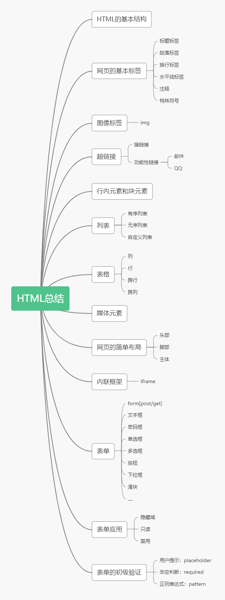
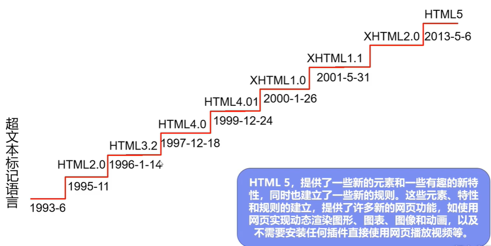
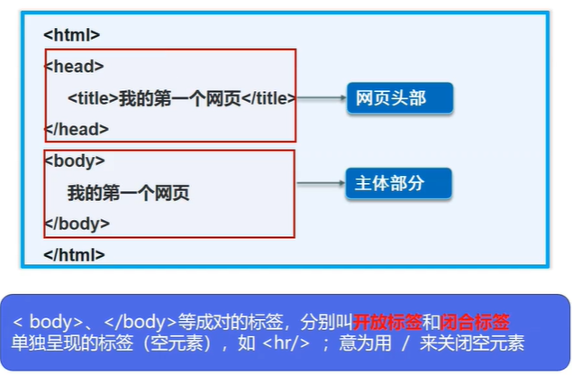
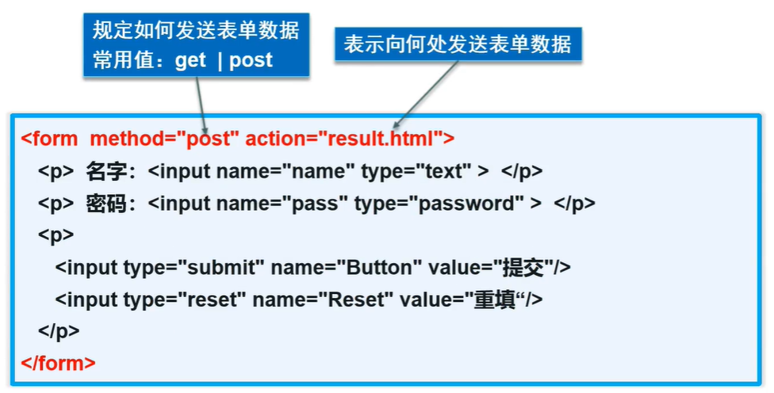
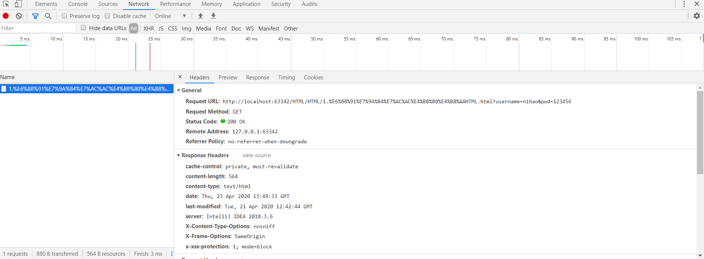

- 初始HTML
- 网页基本标签
- 图像，超链接，网页布局
- 列表，表格，媒体元素
- 表单及表单应用
- 表单初级验证

### 1.初识HTML

> 什么是HTML

- HTML：Hyper Text Markup Language（超文本标记语言）

> HTML发展史




> HTML的优势

- 世界知名浏览器厂商对HTML5的支持
  - 微软
  - Google
  - 苹果
  - Opera
  - Mozilla
- 市场的需求
- 跨平台


> W3C标准

- W3C
  - **W**orld **W**ide **W**eb **C**onsortium
  - 成立于1994年，Web技术领域最权威和具影响力的国际**中立性技术标准机构**
  - http://www.w3.org/
  - http://www.chinaw3c.org/
- W3C标准包括
  - **结构**化标准语言（HTML、XML）
  - **表现**标准语言（CSS）
  - **行为**标准（DOM、ECMAScript）


> 常见IDE

- 记事本
- Dreamweaver
- **IDEA**（咱们用IDEA）
- WebStorm
- .....等等


> HTML基本结构




### 2.网页基本信息

> 网页基本信息

- DOCTYPE声明
- title 标签
- meta 标签

```html
<!-- DOCTYPE：告诉浏览器，我们要使用什么规范 -->
<!DOCTYPE html>
<html lang="en">
    <!-- head标签代表网页头部 -->
    <head>
        <!-- meta描述性标签，它用来描述我们网站一些信息 -->
        <!-- meta一般用来做SEO -->
        <meta charset="UTF-8">
        <meta name="keywords" content="狂神说Java">
        <meta name="description" content="来这个地方学习Java">

        <!-- title网页标题 -->
        <title>Title</title>
    </head>

    <!-- body标签代表网页主题 -->
    <body>

        Hello，World！

    </body>
</html>
```


### 3.网页基本标签

> 网页基本标签

- 标题标签
- 段落标签
- 换行标签
- 水平线标签
- 字体样式标签
- 注释和特殊符号

```html
<!DOCTYPE html>
<html lang="en">
<head>
    <meta charset="UTF-8">
    <title>基本标签学习</title>
</head>
<body>
    <!--标题标签-->
    <h1>一级标签</h1>
    <h2>二级标签</h2>
    <h3>三级标签</h3>
    <h4>四级标签</h4>
    <h5>五级标签</h5>
    <h6>六级标签</h6>

    <!--段落标签-->
    <p>跑得快跑得快</p>
    <p>一只没有耳朵</p>
    <p>一只没有尾巴</p>
    <p>真奇怪真奇怪</p>
    <p>两只老虎两只老虎</p>

    <!--水平标签-->
    <hr/>

    <!--换行标签-->
    跑得快跑得快<br>
    一只没有耳朵<br>
    一只没有尾巴<br>
    真奇怪真奇怪<br>
    两只老虎两只老虎<br>
    <hr/>

    <!-- 粗体，斜体-->
    粗体：<strong>i love you</strong>
    斜体：<em>i love you</em>

    <br/>
    <!--特殊符号-->
    空格：
    空&nbsp;&nbsp;&nbsp;&nbsp;&nbsp;&nbsp;&nbsp;&nbsp;格

    <!--特殊符号-->
    <br/>
    &gt;
    <br/>
    &lt;
    <br/>
    &copy;版权所有
    <!--
    特殊符号记忆方式：

    &开头   ;结尾
    -->
</body>
</html>
```


### 4.图像标签

> 图像标签

- 常见的图像格式
  - JPG
  - GIF
  - PNG
  - BMP（位图）
  - ...

```html

src：图像地址
alt：图像的替代文字
title：鼠标悬停提示文字
width：图像宽度
height：图像高度
```

```html
<!DOCTYPE html>
<html lang="en">
<head>
    <meta charset="UTF-8">
    <title>图像标签</title>
</head>
<body>
    <!--img学习
    src：图片地址
        相对地址(推荐使用)，绝对地址
    -->
	

</body>
</html>
```


### 5.超链接标签应用

> 链接标签

- 文本超链接
- 图像超链接

```html
<a href="链接路径" target="目标窗口位置">链接文本或图像</a>
```

> 超链接

- 页面间链接：从一个页面跳转到另一个页面
- 锚链接
- 功能性链接

```html
<!DOCTYPE html>
<html lang="en">
<head>
    <meta charset="UTF-8">
    <title>链接标签学习</title>
</head>
<body>
    <!--使用name作为标记-->
    <a name="top">顶部</a>

    <!--锚标签
    1.需要一个锚标记
    2.跳转到标记
    -->
    <a href="#down">回到底部</a>

    <!--a标签
    href:必填，表示要跳转到那个页面
    target:表示窗口再哪里打开
        _blank:再新标签中打开
        _self:在自己的网页中打开
    -->
    <a href="1.我的第一个HTML.html" target="_blank">点击我跳转到页面</a>
    <a href="https://baidu.com" target="_self">点击我跳转到百度</a>

    <br>

    <a href="1.我的第一个HTML.html">
        
    </a>


    <!--锚标签
    1.需要一个锚标记
    2.跳转到标记
    -->
    <a href="#top">回到顶部</a>
    <a name="down">底部</a>


    <!--功能性链接

    邮件链接：mailto；
    QQ链接：
    -->
    <a href="mailto:8629303@qq.com">点击联系我</a>
    <a target="_blank" href="http://wpa.qq.com/msgrd?v=3&uin=&site=qq&menu=yes">
        
    </a>

</body>
</html>
```


### 6.行内元素和块元素

> 行内元素和块元素

- 块元素
  - 无论内容多少，该元素独占一行
  - （p、h1-h6...）
- 行内元素
  - 内容撑开宽度，左右都是行内元素的可以排在一行
  - （a、strong、em...）


### 7.列表标签

> 列表

- 什么是列表
  - 列表就是信息资源的一种展示形式。它可以使信息结构化和条理化，并以列表的样式显示出来，以便浏览者能更快捷的获得相应信息
- 列表的分类
  - 无序列表
  - 有序列表
  - 自定义列表

```html
<!DOCTYPE html>
<html lang="en">
<head>
    <meta charset="UTF-8">
    <title>列表学习</title>
</head>
<body>

    <!--有序列表-->
    <ol>
        <li>Java</li>
        <li>Python</li>
        <li>运维</li>
        <li>前端</li>
        <li>C/C++</li>
    </ol>
    <hr>
    <!--无序列表-->
    <ul>
        <li>Java</li>
        <li>Python</li>
        <li>运维</li>
        <li>前端</li>
        <li>C/C++</li>
    </ul>
    <hr>
    <!--自定义列表
    dl：标签
    dt：列表名称
    dd：列表内容
    应用范围：公司网站底部
    -->
    <dl>
        <dt>学科</dt>

        <dd>Java</dd>
        <dd>Python</dd>
        <dd>Linux</dd>
        <dd>C</dd>

        <dt>位置</dt>
        <dd>湖南</dd>
        <dd>广东</dd>
    </dl>

</body>
</html>
```


### 8.表格标签

> 表格

- 为什么使用表格
  - 简单通用
  - 结构稳定
- 基本结构
  - 单元格
  - 行
  - 列
  - 跨行
  - 跨列

```html
<!DOCTYPE html>
<html lang="en">
<head>
    <meta charset="UTF-8">
    <title>表格学习</title>
</head>
<body>
    <!--表格table
    行：tr
    列：td
    -->
    <table border="1px">
        <tr>
            <!--colspan 跨列-->
            <td colspan="4">1-1</td>
        </tr>
        <tr>
            <!--rowspan 跨行-->
            <td rowspan="2">2-1</td>
            <td>2-2</td>
            <td>2-3</td>
            <td>2-4</td>
        </tr>
        <tr>
            <td>3-2</td>
            <td>3-3</td>
            <td>3-4</td>
        </tr>
    </table>
</body>
</html>
```


### 9.媒体元素

> 视频和音频

- 视频元素：video
- 音频元素：audio

```html
<!DOCTYPE html>
<html lang="en">
<head>
    <meta charset="UTF-8">
    <title>媒体元素学习</title>
</head>
<body>
    <!--音频和视频
    src：资源路径
    controls：控制条
    autoplay ：自动播放
    -->
    <video src="../resources/video/xxx.mp4" controls autoplay></video>

    <audio src="../resources/audio/xxx.mp3" controls autoplay></audio>


</body>
</html>
```


### 10.页面结构分析

> 页面结构分析

| 元素名  | 描述                                               |
| ------- | -------------------------------------------------- |
| header  | 标题头部区域的内容（用于页面或页面中的一块区域）   |
| footer  | 标记脚部区域的内容（用于整个页面或页面的一块区域） |
| section | Web网页中的一块独立区域                            |
| article | 独立的文章内容                                     |
| aside   | 相关内容或应用                                     |
| nav     | 导航类辅助内容                                     |

```html
<!DOCTYPE html>
<html lang="en">
<head>
    <meta charset="UTF-8">
    <title>页面结构分析</title>
</head>
<body>

    <header>
        <h2>页面头部</h2>
    </header>

    <section>
        <h2>页面主体</h2>
    </section>

    <footer>
        <h2>页面底部</h2>
    </footer>

</body>
</html>
```


### 11.iframe内联框架

> iframe内联框架

```html
<iframe src="path" name="mainFrame"></iframe>
path:引用网页地址
mainFrame:框架标识名
```

```html
<!DOCTYPE html>
<html lang="en">
<head>
    <meta charset="UTF-8">
    <title>内联框架</title>
</head>
<body>
    <!--iframe内联框架
    src：地址
    w-h：宽度高度
    -->
    <iframe src="http://baidu.com" frameborder="0" width="300px" height="300px">
    </iframe>

    <iframe src="" name="hello" frameborder="0"></iframe>
    <a href="1.我的第一个HTML.html" target="hello">点击跳转</a>


    <iframe src="//player.bilibili.com/player.html?aid=55631961&bvid=BV1x4411V75C&cid=97257627&page=10" 
            scrolling="no" border="0" 
            frameborder="no" framespacing="0" allowfullscreen="true">
    </iframe>
</body>
</html>
```


### 12.初始表单post和get提交



```html
<!DOCTYPE html>
<html lang="en">
<head>
    <meta charset="UTF-8">
    <title>登录注册</title>
</head>
<body>
    <h1>注册</h1>

    <!--表单form
    action：表单提交的位置，可以是网站，也可以是一个请求处理地址
    method：post，get 提交方式
        get方式提交：外面可以在url中看到外面提交的信息，不安全，高效
        post方式提交，比较安全，可以传输大文件
    -->
    <form action="1.我的第一个HTML.html" method="get">
        <!--文本输入框-->
        <p>名称：<input type="text" name="username"></p>
        <!--密码框-->
        <p>密码：<input type="password" name="pwd"></p>

        <p>
            <input type="submit">
            <input type="reset">
        </p>
    </form>
</body>
</html>
```




### 13.文本框和单选框

> 表单元素格式

| 属性      | 说明                                                         |
| --------- | ------------------------------------------------------------ |
| type      | 指定元素的类型。text、password、checkbox、radio、submit、reset、file、hidden、image、button，默认text |
| name      | 指定表单元素的名称                                           |
| value     | 元素的初始值。type为radio时必须指定一个值                    |
| size      | 指定表单元素的初始宽度。但type为text或password时，表单元素的大小以字符为单位。对于其他类型，宽度以像素为单位。 |
| maxlength | type为text或password时，输入的最大字符数                     |
| checked   | type为radio或checkbox时，指定按钮是否被选中                  |


### 14.按钮和多选框

```html
<!DOCTYPE html>
<html lang="en">
<head>
    <meta charset="UTF-8">
    <title>登录注册</title>
</head>
<body>
    <h1>注册</h1>

    <!--表单form
    action：表单提交的位置，可以是网站，也可以是一个请求处理地址
    method：post，get 提交方式
        get方式提交：外面可以在url中看到外面提交的信息，不安全，高效
        post方式提交，比较安全，可以传输大文件
    -->
    <form action="1.我的第一个HTML.html" method="get">
        <!--文本输入框
        value="好帅"  默认初始值
        maxlength="8"   最长能写几个字符
        size="30"   文本框的长度
        -->
        <p>名称：<input type="text" name="username" ></p>
        <!--密码框-->
        <p>密码：<input type="password" name="pwd"></p>

        <!--单选框标签
        type="radio"：单选框的值
        value：单选框的值
        name：表示组
        -->
        <input type="radio" value="boy" name="sex"/>男
        <input type="radio" value="girl" name="sex" checked/>女

        <!--多选框
        type="checkbox"
        -->
        <p>爱好：
            <input type="checkbox" value="sleep" name="hobby">睡觉
            <input type="checkbox" value="code" name="hobby" checked>敲代码
            <input type="checkbox" value="chat" name="hobby">聊天
            <input type="checkbox" value="game" name="hobby">游戏
        </p>

        <!--按钮
        input type="button"    普通按钮
        input type="image"     图片按钮
        input type="submit"     提交按钮
        input type="reset"      重置按钮
        -->
        <p>
            <input type="button" name="btn1" value="点击变长">
            <input type="image" src="../resources/img/1.jpg">
        </p>

        <p>
            <input type="submit">
            <input type="reset">
        </p>
    </form>
</body>
</html>
```


### 15.列表框文本域和文件域

```html
<!DOCTYPE html>
<html lang="en">
<head>
    <meta charset="UTF-8">
    <title>登录注册</title>
</head>
<body>
    <h1>注册</h1>

    <!--表单form
    action：表单提交的位置，可以是网站，也可以是一个请求处理地址
    method：post，get 提交方式
        get方式提交：外面可以在url中看到外面提交的信息，不安全，高效
        post方式提交，比较安全，可以传输大文件
    -->
    <form action="1.我的第一个HTML.html" method="get">
        <!--文本输入框
        value="好帅"  默认初始值
        maxlength="8"   最长能写几个字符
        size="30"   文本框的长度
        -->
        <p>名称：<input type="text" name="username" ></p>
        <!--密码框-->
        <p>密码：<input type="password" name="pwd"></p>

        <!--单选框标签
        type="radio"：单选框的值
        value：单选框的值
        name：表示组
        -->
        <input type="radio" value="boy" name="sex"/>男
        <input type="radio" value="girl" name="sex" checked/>女

        <!--多选框
        type="checkbox"
        -->
        <p>爱好：
            <input type="checkbox" value="sleep" name="hobby">睡觉
            <input type="checkbox" value="code" name="hobby" checked>敲代码
            <input type="checkbox" value="chat" name="hobby">聊天
            <input type="checkbox" value="game" name="hobby">游戏
        </p>

        <!--按钮
        input type="button"    普通按钮
        input type="image"     图片按钮
        input type="submit"     提交按钮
        input type="reset"      重置按钮
        -->
        <p>
            <input type="button" name="btn1" value="点击变长">
            <input type="image" src="../resources/img/1.jpg">
        </p>
        <p>
            <input type="submit">
            <input type="reset">
        </p>

        <!--下拉框，列表框
        -->
        <p>国家：
            <select name="列表名称">
                <option value="china">中国</option>
                <option value="us">美国</option>
                <option value="eth" selected>瑞士</option>
                <option value="yd">印度</option>
            </select>
        </p>

        <!--文本域-->
        <p>反馈：
            <textarea name="textarea" id="" cols="30" rows="10"></textarea>
        </p>

        <!--文件域
        -->
        <p>
            <input type="file" name="files">
            <input type="button" value="上传" name="upload">
        </p>

    </form>
</body>
</html>
```


### 16.搜索框滑块和简单验证

```html
<!DOCTYPE html>
<html lang="en">
<head>
    <meta charset="UTF-8">
    <title>登录注册</title>
</head>
<body>
    <h1>注册</h1>

    <!--表单form
    action：表单提交的位置，可以是网站，也可以是一个请求处理地址
    method：post，get 提交方式
        get方式提交：外面可以在url中看到外面提交的信息，不安全，高效
        post方式提交，比较安全，可以传输大文件
    -->
    <form action="1.我的第一个HTML.html" method="get">
        <!--文本输入框
        value="好帅"  默认初始值
        maxlength="8"   最长能写几个字符
        size="30"   文本框的长度
        -->
        <p>名称：<input type="text" name="username" ></p>
        <!--密码框-->
        <p>密码：<input type="password" name="pwd"></p>

        <!--单选框标签
        type="radio"：单选框的值
        value：单选框的值
        name：表示组
        -->
        <input type="radio" value="boy" name="sex"/>男
        <input type="radio" value="girl" name="sex" checked/>女

        <!--多选框
        type="checkbox"
        -->
        <p>爱好：
            <input type="checkbox" value="sleep" name="hobby">睡觉
            <input type="checkbox" value="code" name="hobby" checked>敲代码
            <input type="checkbox" value="chat" name="hobby">聊天
            <input type="checkbox" value="game" name="hobby">游戏
        </p>

        <!--按钮
        input type="button"    普通按钮
        input type="image"     图片按钮
        input type="submit"     提交按钮
        input type="reset"      重置按钮
        -->
        <p>
            <input type="button" name="btn1" value="点击变长">
            <input type="image" src="../resources/img/1.jpg">
        </p>


        <!--下拉框，列表框
        -->
        <p>国家：
            <select name="列表名称">
                <option value="china">中国</option>
                <option value="us">美国</option>
                <option value="eth" selected>瑞士</option>
                <option value="yd">印度</option>
            </select>
        </p>

        <!--文本域-->
        <p>反馈：
            <textarea name="textarea" id="" cols="30" rows="10"></textarea>
        </p>

        <!--文件域
        -->
        <p>
            <input type="file" name="files">
            <input type="button" value="上传" name="upload">
        </p>

        <!--邮件验证-->
        <p>邮件：
            <input type="email" name="email">
        </p>
        <!--URL-->
        <p>URL：
            <input type="url" name="url">
        </p>
        <!--数字-->
        <p>数字：
            <input type="number" name="num" max="100" min="0" size="10">
        </p>

        <!--滑块-->
        <p>音量：
            <input type="range" name="voice" min="0" max="100" step="2">
        </p>

        <!--搜索框-->
        <p>搜索：
            <input type="search" name="search">
        </p>


        <p>
            <input type="submit">
            <input type="reset">
        </p>
    </form>
</body>
</html>
```


### 17.表单的应用

> 表单的应用

- 隐藏域：hidden
- 只读：readonly
- 禁用：disabled

```html
   <!--增强鼠标可用性，点击label，光标自动到text上-->
    <p>
        <label for="mark">你点我试试</label>
        <input type="text" id="mark">
    </p>
```


### 18.表单初级验证

> 表单初级验证

- 常用方式
  - placeholder：提示信息
  - required：非空判断
  - pattern：正则表达式

```html
<p>名称：<input type="text" name="username" placeholder="请输入用户名"></p>
<p>名称：<input type="text" name="username" required></p>
<!--常用的正则：https://www.jb51.net/tools/regexsc.htm-->
<p>自定义邮箱：
    <input type="text" 
           name="diy" 
           pattern="/^([a-z0-9_\.-]+)@([\da-z\.-]+)\.([a-z\.]{2,6})$/">
</p>
```


### 19.参考资料 & 鸣谢

1. https://blog.csdn.net/qq_36232611/article/details/105109467
2. http://www.dadaqianduan.cn/#/
