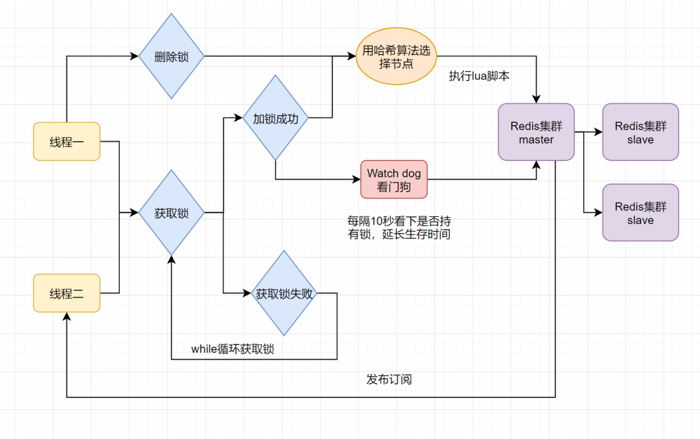

# Redis 客户端简介及对比

> 参考：https://www.cnblogs.com/dw3306/p/9520741.html

Redis的Java客户端很多，官方推荐的有三种：Jedis、Redisson 和 Lettuce。

1、Jedis：是Redis的Java实现客户端，提供了比较全面的Redis命令的支持

- 轻量，简洁，便于集成和改造
- 支持连接池
- 支持pipelining、事务、LUA Scripting、Redis Sentinel、Redis Cluster
- 不支持读写分离，需要自己实现
- 文档差（真的很差，几乎没有……）

2、Lettuce：高级Redis客户端，用于线程安全同步，异步和响应使用，支持集群，Sentinel，管道和编码器

- 基于Netty框架的事件驱动的通信层
- 支持连接池
- 其方法调用是异步的
- Lettuce的API是线程安全的
- 所以可以操作单个Lettuce连接来完成各种操作

3、Redisson：实现了分布式和可扩展的Java数据结构

- 基于Netty实现，采用非阻塞IO，性能高
- 支持异步请求
- 支持连接池
- 支持pipelining、LUA Scripting、Redis Sentinel、Redis Cluster
- 不支持事务，官方建议以LUA Scripting代替事务
- 支持在Redis Cluster架构下使用pipelining
- 支持读写分离，支持读负载均衡，在主从复制和Redis Cluster架构下都可以使用
- 内建Tomcat Session Manager，为Tomcat 6/7/8 提供了会话共享功能
- 可以与Spring Session集成，实现基于Redis的会话共享
- 文档较丰富，有中文文档

4、使用建议：Lettuce + Redisson

- Jedis和Lettuce是比较纯粹的Redis客户端，几乎没提供什么高级功能。Jedis的性能比较差，所以如果你不需要使用Redis的高级功能的话，优先推荐使用 Lettuce
- Redisson的优势是提供了很多开箱即用的Redis高级功能，如果你的应用中需要使用到Redis的高级功能，建议使用Redisson。具体 Redisson的高级功能可以参考：https://redisson.org


# Redis 编程客户端 Jedis

## 1、Jedis 环境搭建

Jedis是Redis官方推荐的Java链接开发工具，是Java操作Redis的中间件。GitHub地址：https://github.com/xetorthio/jedis

1、想要使用Jedis只需要引入单个依赖即可，如果需要连接池也可以增加依赖

```xml
<properties>
    <!--锁定 jdk 版本为 1.8-->
    <maven.compiler.source>1.8</maven.compiler.source>
    <maven.compiler.target>1.8</maven.compiler.target>
</properties>

<dependencies>
    <!-- jeids -->
    <!-- https://mvnrepository.com/artifact/redis.clients/jedis -->
    <dependency>
        <groupId>redis.clients</groupId>
        <artifactId>jedis</artifactId>
        <version>3.3.0</version>
    </dependency>

    <!-- jeids连接池 -->
    <dependency>
        <groupId>org.apache.commons</groupId>
        <artifactId>commons-pool2</artifactId>
        <version>2.8.0</version>
    </dependency>

    <!-- junit4 -->
    <dependency>
        <groupId>junit</groupId>
        <artifactId>junit</artifactId>
        <version>4.13</version>
        <scope>test</scope>
    </dependency>

    <!-- fastjson -->
    <!-- https://mvnrepository.com/artifact/com.alibaba/fastjson -->
    <dependency>
        <groupId>com.alibaba</groupId>
        <artifactId>fastjson</artifactId>
        <version>1.2.68</version>
    </dependency>
</dependencies>
```

2、启动本地的Redis，使用Jedis连接测试

```java
public class TestPing {
    public static void main(String[] args) {
        Jedis jedis = new Jedis("localhost", 6379, 10);
        System.out.println(jedis.ping()); // PONG
    }
}
```

3、常见错误：

1. redis.clients.jedis.exceptions.JedisConnectionException: java.net.SocketTimeoutException: connect timed out
   - 可能原因一：Redis的配置文件中没有注释掉bind 127.0.0.1
   - 可能原因二：Linux的防火墙没有关闭（可能性较大，通过firewall-cmd --reload命令重启防火强）
   - 可能原因三：代码中的IP地址和端口写错了，请仔细检查一下
2. redis.clients.jedis.exceptions.JedisDataException: NOAUTH Authentication required
   - 可能原因：出现这个说明Redis登录需要密码，而你的代码文件中并没有指明密码是多少，Redis登录是否启用密码请在配置文件中配置requirepass
3. redis.clients.jedis.exceptions.JedisDataException: DENIED Redis is running in protected mode
   - 在客户端执行config set protected-mode no命令


## 2、Jedis 常用API示例

### 1、键的操作（Key）

```java
import org.junit.Before;
import org.junit.After;
import org.junit.Test;
import redis.clients.jedis.Jedis;
import java.util.Set;

public class JedisKeyTest {
    private Jedis jedis;
    @Before
    public void createJedis() {
        jedis = new Jedis("127.0.0.1");
        //jedis.auth("123456");
    }
    @After
    public void after() {
        jedis.close();
    }

    /**
     * 正则匹配key,keys patten
     * 返回值：
     * 返回不重复的key value
     */
    @Test
    public void keys() {
        Set<String> keys = jedis.keys("*");
        System.out.println(keys);
    }

    /**
     * 重命名key
     * 返回值：
     * 成功返回OK
     * 失败抛异常（oldkey不存在的时候）
     */
    @Test
    public void rename() {
        String status = jedis.rename("name", "username");
        System.out.println(status);
    }

    /**
     * 重命名key,仅当新key不存在时才执行
     * 返回值：
     * 1：oldKey被重新命名
     * 0：newKey已存在
     */
    @Test
    public void renamenx() {
        long status = jedis.renamenx("name", "name3");
        System.out.println(status);
    }

    /**
     * 设置key的过期时间，以秒为单位
     * 返回值：
     * 1：成功设置了过期时间
     * 0：key不存在
     */
    @Test
    public void expire() {
        long status = jedis.expire("name", 20000);
        System.out.println(status);
    }

    /**
     * 设置key的过期时间,它是距历元(即格林威治标准时间1970年1月1日00:00:00)的秒数。
     * 返回值：
     * 1：成功设置了过期时间
     * 0：key不存在
     */
    @Test
    public void expireAt() {
        long status = jedis.expireAt("name", System.currentTimeMillis()/1000 + 100);
        System.out.println(status);
    }

    /**
     * 查询key的过期时间，单位秒
     * 返回值：
     *  -1: 表示没有过期时间
     *  -2：表示key不存在
     *  其他：key的过期时间
     */
    @Test
    public void ttl() {
        long time = jedis.ttl("name");
        System.out.println(time);
    }

    /**
     * 持久化key
     * 返回值：
     *  1：成功持久化了
     *  0：key不存在
     */
    @Test
    public void persist() {
        long state = jedis.persist("name");
        System.out.println(state);
    }

    /**
     * 删除key
     * 返回值：
     * 成功删除的key的个数
     * 0表示key都不存在
     */
    @Test
    public void del() {
        long state = jedis.del("name", "username");
        System.out.println(state);
    }

    /**
     * 清空所有key
     */
    @Test
    public void flushAll() {
        String status = jedis.flushAll();
        System.out.println(status);
    }

}
```

### 2、String 操作

```java
import java.util.List;
import org.junit.Before;
import org.junit.After;
import org.junit.Test;
import redis.clients.jedis.Jedis;

public class JedisStringDemo {
    private Jedis jedis;
    @Before
    public void createJedis() {
        jedis = new Jedis("127.0.0.1");
        //jedis.auth("123456");
    }
    @After
    public void after() {
        jedis.close();
    }

    /**
     * 给指定key设置value
     * 返回值
     * 成功返回OK
     */
    @Test
    public void set() {
        String status = jedis.set("name", "sam");
        System.out.println(status);
    }

    /**
     * 获取指定key的value
     */
    @Test
    public void get() {
        String value = jedis.get("name");
        System.out.println(value);
    }

    /**
     * 同时给多个key设置value
     */
    @Test
    public void mset() {
        String status = jedis.mset("name", "sam", "age", "50");
        System.out.println(status);
    }

    /**
     * 获取多个key的value
     */
    @Test
    public void mget() {
        List<String> value = jedis.mget("name", "age");
        System.out.println(value);
    }

    /**
     * 添加带有过期时间的记录，默认单位是秒
     * 成功返回OK
     */
    @Test
    public void setex() {
        String status = jedis.setex("name", 10, "sam");
        System.out.println(status);
    }

    /**
     * 添加一条记录，仅当给定的key不存在时才插入
     * 返回值：
     * 1：成功设置了key
     * 0：可以不存在
     */
    @Test
    public void setnx() {
        long code = jedis.setnx("name", "sam");
        System.out.println(code);
    }

    /**
     * 设置key的value值并返回老的value值
     */
    @Test
    public void getSet() {
        String value = jedis.getSet("name", "马化腾");
        System.out.println(value);
    }

    /**
     * 将key对应的value加上指定的值，只有value可以转为数字时该方法才可用
     * 返回相加后的值
     *
     * <b>可以作为获取唯一ID的方法</b>
     */
    @Test
    public void incrBy() {
        long value = jedis.incrBy("salary", 10);
        System.out.println(value);
    }

    /**
     * 将key对应的value减去指定的值，只有value可以转为数字时该方法才可用
     * 返回相减后的值
     */
    @Test
    public void decrBy() {
        long value = jedis.decrBy("salary", 10);
        System.out.println(value);
    }

    /**
     * append：
     * 若 key 存在并是字符串，APPEND 命令会将 value 追加 旧 value 后面
     * 若 key 不存在，等价于 set 命令
     * setrange：
     * 用 value 参数覆写给定 key 所储存的字符串值，从偏移量 offset 开始
     * getrange：
     * 返回 key 中字符串值的子字符
     */
    @Test
    public void test() {
        jedis.append("username", " is boy ");
        System.out.println(jedis.get("username")); //  is boy
        jedis.setrange("username", 7, "girl");
        System.out.println(jedis.get("username")); //  is boygirl
        System.out.println(jedis.getrange("username", 7, -1)); // girl
    }
}
```

### 3、Hash 操作

```java
import org.junit.Before;
import org.junit.After;
import org.junit.Test;
import redis.clients.jedis.Jedis;
import java.util.*;

public class JedisHashTest {
    private Jedis jedis;
    @Before
    public void createJedis() {
        jedis = new Jedis("127.0.0.1");
        //jedis.auth("123456");
    }
    @After
    public void after() {
        jedis.close();
    }
    
    /**
     * 返回值新增加的field的个数，如果field都已存在则更新并返回0
     */
    @Test
    public void hset() {
        HashMap<String, String> values = new HashMap<>();
        values.put("age", "50");
        values.put("sex", "male");
        long code = jedis.hset("sam", values);
        System.out.println(code); // 2
        code = jedis.hset("sam", "address", "广州");
        System.out.println(code); // 1
    }

    /**
     * 演示 hget
     */
    @Test
    public void hget() {
        jedis.hset("user", "username", "tom");
        String value = jedis.hget("user", "username");
        System.out.println(value); // tom
    }

    /**
     * 演示 hmset hmget
     */
    @Test
    public void hmset() {
        Map<String, String> hash = new HashMap<String, String>();
        hash.put("password", "123");
        hash.put("sex", "male");
        jedis.hmset("user", hash);

        List<String> values = jedis.hmget("user", "username", "password", "sex");
        System.out.println(values);
    }

    /**
     * 将field对应的value加上指定的值，只有value可以转为数字时该方法才可用
     * 返回增加后的值
     */
    @Test
    public void hincrBy() {
        long value = jedis.hincrBy("mayun", "age", 1);
        System.out.println(value);
    }

    /**
     * 演示 hgetAll hkeys kvals
     */
    @Test
    public void hgetAll() {
        Map<String, String> map = jedis.hgetAll("sam");
        System.out.println(map); // {age=50, sex=male, address=广州}

        Set<String> keys = jedis.hkeys("sam");
        System.out.println(keys); // [age, sex, address]

        List<String> values = jedis.hvals("sam");
        System.out.println(values); // [male, 50, 广州]
    }

    /**
     * 演示 hdel
     */
    @Test
    public void hdel() {
        jedis.hdel("user", "username", "password");
        Map<String, String> map = jedis.hgetAll("user");
        for (String key : map.keySet()) {
            System.out.println(key + "  " + map.get(key));
        }
    }

}
```

### 4、List 操作

```java
import org.junit.Before;
import org.junit.After;
import org.junit.Test;
import redis.clients.jedis.Jedis;
import redis.clients.jedis.ListPosition;
import java.util.List;

public class JedisListTest {
	private Jedis jedis;
	@Before
	public void createJedis() {
		jedis = new Jedis("127.0.0.1");
		//jedis.auth("123456");
	}
    @After
    public void after() {
        jedis.close();
    }
    
    /**
     * 将一个或多个值插入到列表头部
     * 返回插入队列的数据的个数
     */
    @Test
    public void lpush() {
        Long num = jedis.lpush("list", "a", "b", "c");
        System.out.println(num); // 3
    }

    /**
     * 将一个或多个值插入到列表尾部
     * 返回插入队列的数据的个数
     */
    @Test
    public void rpush() {
        Long num = jedis.rpush("list", "a", "b", "c");
        System.out.println(num); // 3
    }

    /**
     * 将一个或多个值插入到已存在的列表头部
     * 返回插入队列的数据的个数
     */
    @Test
    public void lpushx() {
        Long num = jedis.lpushx("list", "1", "2", "3");
        System.out.println(num); // 3
    }

    /**
     * 将一个或多个值插入到已存在的列表尾部
     * 返回插入队列的数据的个数
     */
    @Test
    public void rpushx() {
        Long num = jedis.rpushx("list", "1", "2", "3");
        System.out.println(num); // 3
    }

    /**
     * 返回列表指定范围内的数据
	 * 一般 lpush lrange 成对使用
     */
    @Test
    public void lrange() {
        List<String> list = jedis.lrange("list", 0, 5);
        System.out.println(list);

		jedis.lpush("names", "tom", "james", "张三", "李四");
		List<String> names = jedis.lrange("names", 0, -1);
		System.out.println(names);
    }
    
	/**
	 * 演示 lset lindex
	 */
	@Test
	public void test2() {
		jedis.lset("names", 1, "王五");
		List<String> names = jedis.lrange("names", 0, -1);
		System.out.println(names);

		String value = jedis.lindex("names", 1);
		System.out.println(value);
	}

	/**
	 * 演示 linsert
	 */
	@Test
	public void test3() {
		jedis.linsert("names", ListPosition.BEFORE, "james", "fox");
		List<String> names = jedis.lrange("names", 0, -1);
		System.out.println(names);
	}

	/**
	 * 演示 lrem
	 */
	@Test
	public void test4() {
		jedis.lrem("names", 1, "tom");
		List<String> names = jedis.lrange("names", 0, -1);
		System.out.println(names);
	}
	
}
```

### 5、Set 操作

```java
import org.junit.Before;
import org.junit.After;
import org.junit.Test;
import redis.clients.jedis.Jedis;
import java.util.Set;

public class JedisSetTest {
    private Jedis jedis;
    @Before
    public void createJedis() {
        jedis = new Jedis("127.0.0.1");
        //jedis.auth("123456");
    }
    @After
    public void after() {
        jedis.close();
    }

    /**
     * 往set里增加元素
     * 成功增加元素的个数，如果都已存在返回0
     */
    @Test
    public void sadd() {
        long value = jedis.sadd("set", "a", "b");
        System.out.println(value); // 2
    }

    /**
     * 移除set中的元素
     * 1：成功移除
     * 0：元素不存在
     */
    @Test
    public void srem() {
        long value = jedis.srem("set", "a");
        System.out.println(value); // 1
    }

    /**
     * 获取set里的所有元素
     */
    @Test
    public void smembers() {
        Set<String> value = jedis.smembers("set");
        System.out.println(value); // [b]
    }

    /**
	 * 交集 sinter
	 */
    @Test
    public void sinter() {
        jedis.flushDB();
        jedis.sadd("language1", "java", "c++", "ruby", "python");
        jedis.sadd("language2", "ios", "c++", "c#", "android");
        Set<String> sinter = jedis.sinter("language1", "language2");
        System.out.println(sinter); // [c++]
    }

    /**
	 * 差集 sdiff
	 */
    @Test
    public void sdiff() {
        jedis.flushDB();
        jedis.sadd("language1", "java", "c++", "ruby", "python");
        jedis.sadd("language2", "ios", "c++", "c#", "android");
        Set<String> sdiff = jedis.sdiff("language1", "language2");
        System.out.println(sdiff); // [python, java, ruby]
    }

    /**
	 * 并集 sunion
	 */
    @Test
    public void sunion() {
        jedis.flushDB();
        jedis.sadd("language1", "java", "c++", "ruby", "python");
        jedis.sadd("language2", "ios", "c++", "c#", "android");
        Set<String> sunion = jedis.sunion("language1", "language2");
        System.out.println(sunion); // [c#, android, ios, c++, python, ruby, java]
    }

}
```

### 6、Zset 操作（sorted-set）

```java
import org.junit.Before;
import org.junit.After;
import org.junit.Test;
import redis.clients.jedis.Jedis;
import redis.clients.jedis.Tuple;
import java.util.*;

public class JedisZSetTest {
    private Jedis jedis;
    @Before
    public void createJedis() {
        jedis = new Jedis("127.0.0.1");
        //jedis.auth("123456");
    }
    @After
    public void after() {
        jedis.close();
    }
    
    /**
     * 往sorted set里增加元素
     * 1: 成功增加
     * 0: 元素已存在
     */
    @Test
    public void zadd() {
        long value = jedis.zadd("sortedset", 1, "a");
        System.out.println(value); // 1
        value = jedis.zadd("sortedset", 2, "b");
        System.out.println(value); // 1
    }

    /**
     * 移除sorted set中的元素
     * 1：成功移除
     * 0：元素不存在
     */
    @Test
    public void zrem() {
        long value = jedis.zrem("sortedset", "a");
        System.out.println(value); // 1
    }

    /**
     * 获取set里的所有元素
     */
    @Test
    public void zrange() {
        Set<String> value = jedis.zrange("sortedset", 0, 5);
        System.out.println(value); // [b]
    }

    /**
     * 演示 zadd zrange zrangeByScore
     * zadd：往sorted set里增加元素
     * zrange：通过索引返回有序集合指定区间内的成员（分数从低到高）
     * zrangeByScore：返回有序集合指定分数区间内的成员，分数从低到高排序
     */
    @Test
    public void test() {
        jedis.flushDB();
        Map<String, Double> sm = new HashMap<String, Double>();
        sm.put("张三", 70.0);
        sm.put("李四", 80.0);
        sm.put("王五", 90.0);
        sm.put("赵六", 60.0);
        jedis.zadd("zkey", sm);
        Set<String> set = jedis.zrange("zkey", 0, -1);
        System.out.println(set); // [赵六, 张三, 李四, 王五]

        Set<String> set1 = jedis.zrangeByScore("zkey", 70.0, 90.0);
        System.out.println(set1); // [张三, 李四, 王五]
    }

    /**
     * 演示 zrangeWithScores：通过索引区间返回有序集合指定区间内的成员（分数从低到高）
     */
    @Test
    public void zrangeWithScores() {
        jedis.flushDB();
        Map<String, Double> sm = new HashMap<String, Double>();
        sm.put("张三", 70.0);
        sm.put("李四", 80.0);
        sm.put("王五", 90.0);
        sm.put("赵六", 60.0);
        jedis.zadd("zkey", sm);
        Set<Tuple> zws = jedis.zrangeWithScores("zkey", 0, -1);
        for (Tuple t : zws) {
            System.out.println(t.getScore() + "  " + t.getElement());
        }
    }

    /**
     * 演示 zrank：返回有序集合中指定成员的排名索引（分数从低到高）
     */
    @Test
    public void zrank() {
        jedis.flushDB();
        Map<String, Double> sm = new HashMap<String, Double>();
        sm.put("张三", 70.0);
        sm.put("李四", 80.0);
        sm.put("王五", 90.0);
        sm.put("赵六", 60.0);
        jedis.zadd("zkey", sm);
        Long num = jedis.zrank("zkey", "赵六");
        System.out.println(num); // 0
    }

    /**
     * 演示 zscore：返回集合中指定成员的分数值
     */
    @Test
    public void zscore() {
        jedis.flushDB();
        Map<String, Double> sm = new HashMap<String, Double>();
        sm.put("张三", 70.0);
        sm.put("李四", 80.0);
        sm.put("王五", 90.0);
        sm.put("赵六", 60.0);
        jedis.zadd("zkey", sm);
        Double zscore = jedis.zscore("zkey", "张三");
        System.out.println(zscore); // 70.0
    }
}
```

### 7、Hyperloglog 操作

```java
import org.junit.After;
import org.junit.Before;
import org.junit.Test;
import redis.clients.jedis.Jedis;

public class JedisHyperloglogTest {
    private Jedis jedis;
    @Before
    public void createJedis() {
        jedis = new Jedis("127.0.0.1");
        //jedis.auth("123456");
    }
    @After
    public void after() {
        jedis.close();
    }

    /**
     * 添加指定元素到HyperLogLog中
     * 返回成功天的个数，如果元素都已存在则返回0
     */
    @Test
    public void pfadd() {
        long code = jedis.pfadd("hyper", "a", "b", "d");
        System.out.println(code); // 1
    }

    /**
     * 返回给定HyperLogLog的基数估算值
     */
    @Test
    public void pfcount() {
        long value = jedis.pfcount("hyper");
        System.out.println(value); // 3
    }
}
```


## 3、Jedis 连接池与事务

### 1、Jedis连接单机版Redis

```java
@Test
public void testLink() {
    // 创建连接
    Jedis jedis = new Jedis("127.0.0.1", 6379);
    // 设置密码，如果配置了密码需要设置
    jedis.auth("123456");
    // 测试是否连接成功
    System.out.println(jedis.ping()); // PONG
    // 释放资源
    jedis.close();
}
```

### 2、Jedis连接池连接Redis

```java
public class RedisTest {
    @Test
    public void test() {
        // 1. 创建一个配置对象
        JedisPoolConfig config = new JedisPoolConfig();
        config.setMaxTotal(20);
        config.setMaxIdle(10);
        // 2. 创建 Jedis 连接池对象
        JedisPool jedisPool = new JedisPool(config, "localhost", 6379);
        // 3. 获取连接
        Jedis jedis = jedisPool.getResource();
        // 4. 使用
        jedis.set("name","Jack");
        // 5. 关闭归还到连接池
        jedis.close();
    }
}
```

### 3、Jedis连接主从版Redis

```java
@Test
public void testLink() {
    // 创建对应连接，并设置密码
    Jedis jedis_M = new Jedis("127.0.0.1", 8001);
    jedis_M.auth("123456");
    Jedis jedis_S1 = new Jedis("127.0.0.1", 8002);
    jedis_S1.auth("123456");
    Jedis jedis_S2 = new Jedis("127.0.0.1", 8003);
    jedis_S2.auth("123456");

    // 从机连接主机
    jedis_S1.slaveof("127.0.0.1", 8001);
    jedis_S2.slaveof("127.0.0.1", 8001);

    // 主机写入数据
    jedis_M.set("username", "zhangsan");

    // 从机读取数据
    System.out.println(jedis_S1.get("username"));
    System.out.println(jedis_S2.get("username"));

    // 释放所有资源
    jedis_S2.close();
    jedis_S1.close();
    jedis_M.close();
}
```

### 4、Jedis连接哨兵版Redis

```java
@Test
public void testLink() {
    // 账户密码
    String masterName = "mymaster";
    String password = "123456";

    // 设置参数
    JedisPoolConfig jedisPoolConfig = new JedisPoolConfig();
    jedisPoolConfig.setMaxTotal(10);
    jedisPoolConfig.setMaxIdle(5);
    jedisPoolConfig.setMinIdle(5);

    // 哨兵信息
    Set<String> sentinels = new HashSet<String>();
    sentinels.add("127.0.0.1:26379");
    sentinels.add("127.0.0.1:26380");
    sentinels.add("127.0.0.1:26381");

    // 创建连接池
    JedisSentinelPool pool = new JedisSentinelPool(masterName, sentinels, jedisPoolConfig, password);

    // 获取客户端
    Jedis jedis = pool.getResource();

    // 执行写操作
    jedis.set("username", "lisi");

    // 执行读操作
    System.out.println(jedis.get("username"));

    // 释放资源
    pool.close();
}
```

> 注意：Java连接Redis Sentinel，哨兵模式下不要直连master，要连哨兵，master挂了才会自动故障转移，又因为连接哨兵需要连接池，所以我们需要在引入两个jar包，分别是：commons-pool2-2.4.2.jar、commons-lang3-3.3.2.jar，为了可以演示自动故障转移，您可以正常的启动一主两从和三个哨兵，然后执行以下代码，看一下效果，然后使用kill命令杀掉master，重新把set一个别的值，你再执行一次代码，你会发现set和get操作还是正常的，不会因为之前主节点宕机就不能工作，这就是哨兵模式的好处。

### 5、Jedis连接集群版Redis

```java
private static JedisCluster jedis = null;
private static JedisCluster getJedis() {
    return jedis;
}
static {
    try {
        JedisPoolConfig jedisPoolConfig = new JedisPoolConfig();
        jedisPoolConfig.setMaxTotal(1024);
        jedisPoolConfig.setMaxIdle(200);
        jedisPoolConfig.setMaxWaitMillis(1000);
        jedisPoolConfig.setTestOnBorrow(true);
        jedisPoolConfig.setTestWhileIdle(true);
        jedisPoolConfig.setTestOnReturn(true);

        Set<HostAndPort> jedisClusterNodes = new HashSet<HostAndPort>();
        jedisClusterNodes.add(new HostAndPort("127.0.0.1", 6001));
        jedisClusterNodes.add(new HostAndPort("127.0.0.1", 6002));
        jedisClusterNodes.add(new HostAndPort("127.0.0.1", 6003));
        jedisClusterNodes.add(new HostAndPort("127.0.0.1", 6004));
        jedisClusterNodes.add(new HostAndPort("127.0.0.1", 6005));
        jedisClusterNodes.add(new HostAndPort("127.0.0.1", 6006));
        jedisClusterNodes.add(new HostAndPort("127.0.0.1", 6007));
        jedisClusterNodes.add(new HostAndPort("127.0.0.1", 6008));
        jedisClusterNodes.add(new HostAndPort("127.0.0.1", 6009));

        jedis = new JedisCluster(jedisClusterNodes, 1000, 1000, 5, "123456", jedisPoolConfig);
    } catch (Exception e) {
        e.printStackTrace();
    }
}

@Test
public void testLink() {
    try {
        // 获取链接
        JedisCluster jedisCluster = getJedis();

        // 执行写操作
        jedisCluster.set("username", "wangwu");

        // 执行读操作
        System.out.println(jedisCluster.get("username"));

        // 释放资源
        jedisCluster.close();
    } catch (IOException e) {
        e.printStackTrace();
    }
}
```

### 6、Redis开启事务控制

```java
/**
 * 测试事务
 */
public class TestTX {
    public static void main(String[] args) {
        Jedis jedis = new Jedis("localhost", 6379);
        jedis.flushDB();
        JSONObject jsonObject = new JSONObject();
        jsonObject.put("hello", "world");
        jsonObject.put("name", "xxx");

        // 开启事务
        Transaction multi = jedis.multi();
        String result = jsonObject.toJSONString();

        try {
            multi.set("user1", result);
            multi.set("user2", result);
            int i = 1 / 0; // 模拟异常
            multi.exec(); // 执行事务
        } catch (Exception e) {
            multi.discard(); // 放弃事务
            e.printStackTrace();
        } finally {
            // 正常执行时{"name":"xxx","hello":"world"}   
            System.out.println(jedis.get("user1")); // null
            System.out.println(jedis.get("user1"));
            jedis.close(); // 关闭链接
        }
    }
}
```

### 7、Jedis 高级操作汇总

```java
package com.xyz.redis;

import org.junit.Before;
import org.junit.Test;
import redis.clients.jedis.*;

import java.util.HashMap;
import java.util.HashSet;
import java.util.Set;

/**
 * 高级操作
 */
public class JedisAdvancedCase {
    private JedisPoolConfig config;

    @Before
    public void before() {
        config = new JedisPoolConfig();
        config.setMaxWaitMillis(1000 * 30); // 当连接池内的连接耗尽时，最大的等待时间
        config.setMaxTotal(20); // 资源池的最大连接数
        config.setMaxIdle(10); // 资源池的最大空闲连接数
        config.setMinIdle(5); // 资源池的最小空闲连接数
        config.setTestOnBorrow(true); // 获取连接实例时，是否进行测试，默认false
        config.setTestWhileIdle(true); // 是否开启空闲资源检测, 默认false
        config.setTimeBetweenEvictionRunsMillis(1000 * 10); // 空闲资源的检测周期
    }

    /**
     * 管道操作,可以挺高性能
     */
    @Test
    public void pipelined() {
        Jedis jedis = new Jedis("10.49.196.10");
        jedis.auth("123456");
        Pipeline pipeline = jedis.pipelined();
        for (int i = 0; i < 100; i++) {
            pipeline.set("key" + i, i + "");
        }
        pipeline.sync();
        pipeline.close();
        jedis.close();
    }

    /**
     * 连接池操作
     */
    @Test
    public void jedisPool() {
        JedisPool pool = new JedisPool(config, "10.49.196.10", 6379, 1000 * 10, "123456");
        //获取Jedis实列
        Jedis jedis = pool.getResource();
        System.out.println(jedis.get("name"));
        jedis.close();
        pool.close();
    }

    /**
     * 哨兵模式
     */
    @Test
    public void jedisSentinelPool() {
        Set<String> sentinels = new HashSet<>();
        sentinels.add("10.49.196.20:26379");
        sentinels.add("10.49.196.21:26379");
        sentinels.add("10.49.196.22:26379");
        JedisSentinelPool pool = new JedisSentinelPool("mymaster", sentinels, config, 1000 * 5, "123456");
        //获取Jedis实列
        Jedis jedis = pool.getResource();
        System.out.println(jedis.get("name"));
        jedis.close();
        pool.close();
    }

    /**
     * 集群模式
     */
    @Test
    public void jedisCluster() {
        Set<HostAndPort> set = new HashSet<HostAndPort>();
        set.add(new HostAndPort("10.49.196.20", 7000));
        set.add(new HostAndPort("10.49.196.20", 7001));
        set.add(new HostAndPort("10.49.196.21", 7000));
        set.add(new HostAndPort("10.49.196.21", 7001));
        set.add(new HostAndPort("10.49.196.22", 7000));
        set.add(new HostAndPort("10.49.196.22", 7001));
        JedisCluster cluster = new JedisCluster(set, 1000 * 5, 1000 * 5, 5, "123456", config);
        //JedisCluster的基础操作和Jedis很类似

        //key
        System.out.println("判断key是否存在：" + cluster.exists("name"));
        System.out.println("查询key的过期时间：" + cluster.ttl("name"));

        //String
        System.out.println("设置键值对：" + cluster.set("name", "mahuateng"));
        System.out.println("获取key对应的值：" + cluster.get("name"));

        //List
        System.out.println("将一个或多个值插入到列表头部：" + cluster.lpush("list", "a", "b", "c"));
        System.out.println("返回列表指定范围内的数据：" + cluster.lrange("list", 0, 5));

        //Hash
        HashMap<String, String> values = new HashMap<>();
        values.put("age", "50");
        values.put("sex", "male");
        System.out.println("在hash中设置field及value：" + cluster.hset("mayun", values));
        System.out.println("在hash中所有属性及值：" + cluster.hgetAll("mayun"));

        //set
        System.out.println("往set里增加元素：" + cluster.sadd("set", "a", "b"));
        System.out.println("取set里的所有元素：" + cluster.smembers("set"));

        //sorted set
        System.out.println("往sorted set里增加元素1：" + cluster.zadd("sortedset", 1, "a"));
        System.out.println("往sorted set里增加元素2：" + cluster.zadd("sortedset", 2, "b"));
        System.out.println("获取sorted set里的所有元素：" + cluster.zrange("sortedset",0, 5));

        //集群信息
        System.out.println("集群节点信息：" + cluster.getClusterNodes());
        cluster.close();
    }
}
```

## 4、Jedis 连接池的配置

1、下面给出Jedis详细配置的一些选项，并且使用流的形式加载配置文件`jedis.properties`

```properties
# 最大活动对象数     
redis.pool.maxTotal=1000    
# 最大能够保持idel状态的对象数      
redis.pool.maxIdle=100  
# 最小能够保持idel状态的对象数   
redis.pool.minIdle=50    
# 当池内没有返回对象时，最大等待时间    
redis.pool.maxWaitMillis=10000    
# 当调用borrow Object方法时，是否进行有效性检查    
redis.pool.testOnBorrow=true    
# 当调用return Object方法时，是否进行有效性检查    
redis.pool.testOnReturn=true  
# “空闲链接”检测线程，检测的周期，毫秒数。如果为负值，表示不运行“检测线程”。默认为-1.  
redis.pool.timeBetweenEvictionRunsMillis=30000  
# 向调用者输出“链接”对象时，是否检测它的空闲超时；  
redis.pool.testWhileIdle=true  
# 对于“空闲链接”检测线程而言，每次检测的链接资源的个数。默认为3.  
redis.pool.numTestsPerEvictionRun=50  
# redis服务器的IP    
redis.ip=xxxxxx  
# redis服务器的Port    
redis.port=6379   
```

```java
package com.xyz.util;

import java.io.IOException;
import java.io.InputStream;
import java.util.Properties;

import redis.clients.jedis.Jedis;
import redis.clients.jedis.JedisPool;
import redis.clients.jedis.JedisPoolConfig;

/**
 * 加载配置文件，配置连接池参数，提供链接的方法
 */
public class JedisPoolUtil {

    private static JedisPool jedisPool;

    // 当类加载就读取配置文件
    static {
        // 类加载加载配置文件
        InputStream is=JedisPoolUtil.class.getClassLoader().getResourceAsStream("jedis.properties");
        // 创建Properties对象
        Properties pr=new Properties();
        try {
            // 关联文件
            pr.load(is);
        } catch (IOException e) {
            e.printStackTrace();
        }

        JedisPoolConfig config = new JedisPoolConfig(); // 获取数据，设置数据
        config.setMaxTotal(Integer.parseInt(pr.getProperty("maxTotal"))); // 最大连接数
        config.setMaxIdle(Integer.parseInt(pr.getProperty("maxIdle"))); // 设置最大的空闲连接
        // 初始化JedisPool
        jedisPool = new JedisPool(pr.getProperty("host"),Integer.parseInt(pr.getProperty("port")));
    }

    // 获取Jedis
    public static Jedis getJedis() {
        return jedisPool.getResource();
    }

    // 释放资源
    public static void closeJedis(Jedis jedis) {
        if(jedis!=null) {
            jedis.close();
        }
    }
}
```

2、JedisPoolConfig 参数说明。JedisPoolConfig用来设置连接池的相关属性，具体参数如下：

| 参数名称                      | 说明                                                         | 默认值              | 建议                                                         |
| ----------------------------- | ------------------------------------------------------------ | ------------------- | ------------------------------------------------------------ |
| maxTotal                      | 资源池中的最大连接数                                         | 8                   |                                                              |
| maxIdle                       | 资源池中的最大空闲连接数                                     | 8                   |                                                              |
| minIdle                       | 资源池中的最少空闲连接数                                     | 0                   |                                                              |
| blockWhenExhausted            | 当资源池用尽后，调用者是否要等待。只有当值为true时，下面的maxWaitMillis才会生效。 | true                | 建议使用默认值                                               |
| maxWaitMillis                 | 当资源池连接用尽后，调用者的最大等待时间（单位为毫秒）。     | -1（表示永不超时）  | 不建议使用默认值                                             |
| testOnBorrow                  | 向资源池借用连接时是否做连接有效性检测（ping）。检测到的无效连接将会被移除。 | false               | 业务量很大时候建议设置为false，减少一次ping的开销。          |
| testOnReturn                  | 向资源池归还连接时是否做连接有效性检测（ping）。检测到无效连接将会被移除。 | false               | 业务量很大时候建议设置为false，减少一次ping的开销。          |
| jmxEnabled                    | 是否开启JMX监控                                              | true                | 建议开启，注意应用本身也需要开启。                           |
| testWhileIdle                 | 是否开启空闲资源检测                                         | false               | 建议开启                                                     |
| timeBetweenEvictionRunsMillis | 空闲资源的检测周期（单位为毫秒）                             | -1（不检测）        | 建议设置                                                     |
| minEvictableIdleTimeMillis    | 资源池中资源的最小空闲时间（单位为毫秒），达到此值后空闲资源将被移除。 | 1800000（即30分钟） | 可根据自身业务决定，一般默认值即可                           |
| numTestsPerEvictionRun        | 做空闲资源检测时，每次检测资源的个数。                       | 3                   | 可根据自身应用连接数进行微调，如果设置为 -1，就是对所有连接做空闲监测。 |


# Redis  编程客户端 Lettuce

> Lettuce 官网地址：https://lettuce.io。GitHub 项目地址：https://github.com/lettuce-io/lettuce-core
>
> 本章节Lettuce主要转载作者Throwable，文章链接在底部参考文献中。

## 1、Lettuce 简介

Lettuce是一个高性能基于Java编写的Redis驱动框架，底层集成了Project Reactor提供自然的反应式编程，通讯框架集成了Netty使用了非阻塞IO，5.x版本以后融合了JDK1.8的异步编程特性，在保证高性能的同时提供了十分丰富易用的API，5.1版本的新特性以下：node

- 支持Redis的新增命令ZPOPMIN、ZPOPMAX、BZPOPMIN、BZPOPMAX
- 支持经过Brave模块跟踪Redis命令执行
- 支持Redis Streams
- 支持异步的主从链接
- 支持异步链接池
- 新增命令最多执行一次模式（禁止自动重连）
- 全局命令超时设置（对异步和反应式命令也有效）
- 等等...

**注意点**：Redis的版本至少须要2.6，固然越高越好，API的兼容性比较强大。

想要使用Lettuce只需要引入单个依赖即可，如果需要连接池也可以增加依赖

```xml
<dependency>
    <groupId>io.lettuce</groupId>
    <artifactId>lettuce-core</artifactId>
    <version>6.0.6.RELEASE</version>
</dependency>
```


## 2、Lettuce 连接 Redis

### 1、RedisURI 方式创建

单机、哨兵、集群模式下连接`Redis`需要一个统一的标准去表示连接的细节信息，在Lettuce中这个统一的标准是RedisURI。可以通过三种方式构造一个RedisURI实例：

1. 使用create静态构造方式：

   ```java
   // 定制的字符串URI语法：
   RedisURI uri = RedisURI.create("redis://localhost/");
   // 直接使用静态方法构造
   RedisURI uri = RedisURI.create("localhost",6379);
   ```

2. 使用建造器（`RedisURI.Builder`）：

   ```java
   RedisURI uri = RedisURI.builder().withHost("localhost").withPort(6379).build();
   ```

3. 直接经过构造函数实例化（`new RedisURI`）：

   ```java
   RedisURI uri = new RedisURI("localhost", 6379, 60, TimeUnit.SECONDS);
   ```

***

1. 使用create静态构造方式：
   - 定制的字符串`URI`语法：RedisURI uri = RedisURI.create("redis://localhost/");
   - 直接使用静态方法构造：RedisURI redisURI = RedisURI.create("localhost",6379);
2. 直接通过构造函数实例化：RedisURI redisURI = new RedisURI("localhost", 6379, Duration.ofSeconds(60))
3. 通过建造器RedisURI.builder（推荐）：RedisURI uri = RedisURI.builder().withHost("localhost").withPort(6379).build();


### 2、定制的连接URI语法

- 单机（前缀为`redis://`）

```shell
格式：redis://[password@]host[:port][/databaseNumber][?[timeout=timeout[d|h|m|s|ms|us|ns]]
完整：redis://mypassword@127.0.0.1:6379/0?timeout=10s
简单：redis://localhost
```

- 单机并且使用`SSL`（前缀为`rediss://`）««« 注意后面多了个`s`

```shell
格式：rediss://[password@]host[:port][/databaseNumber][?[timeout=timeout[d|h|m|s|ms|us|ns]]
完整：rediss://mypassword@127.0.0.1:6379/0?timeout=10s
简单：rediss://localhost
```

- 单机`Unix Domain Sockets`模式（前缀为`redis-socket://`）

```shell
格式：redis-socket://path[?[timeout=timeout[d|h|m|s|ms|us|ns]][&_database=database_]]
完整：redis-socket:///tmp/redis?timeout=10s&_database=0
```

- 哨兵（前缀为`redis-sentinel://`）

```shell
格式：redis-sentinel://[password@]host[:port][,host2[:port2]][/databaseNumber][?[timeout=timeout[d|h|m|s|ms|us|ns]]#sentinelMasterId
完整：redis-sentinel://mypassword@127.0.0.1:6379,127.0.0.1:6380/0?timeout=10s#mymaster
```

超时时间单位：d 天、h 小时、m 分钟、s 秒钟、ms 毫秒、us 微秒、ns 纳秒

个人建议使用RedisURI提供的建造器，毕竟定制的URI虽然简洁，但是比较容易出现人为错误。鉴于笔者没有SSL和Unix Domain Socket的使用场景，下面不对这两种连接方式进行列举。


### 3、连接Redis基本使用

Lettuce 使用的时候依赖于四个主要组件：

- RedisURI：连接信息
- RedisClient：Redis客户端。特殊的情况：集群连接有一个定制的 RedisClusterClient
- Connection：Redis连接，主要是StatefulConnection 或者 StatefulRedisConnection 的子类，连接的类型主要由连接的具体方式（单机、哨兵、集群、订阅发布等等）选定，比较重要
- RedisCommands：Redis命令API接口，**基本上覆盖了`Redis`发行版本的所有命令**，提供了同步（sync）、异步（async）、反应式（reative）的调用方式，对于使用者而言，会经常跟 RedisCommands 系列接口打交道。

简单操作示例：

```java
package com.xyz.redis;

import io.lettuce.core.RedisClient;
import io.lettuce.core.RedisURI;
import io.lettuce.core.SetArgs;
import io.lettuce.core.api.StatefulRedisConnection;
import io.lettuce.core.api.sync.RedisCommands;
import org.assertj.core.api.Assertions;
import java.time.Duration;
import java.time.temporal.ChronoUnit;

public class RedisServerConnectionDemo {
    public static void main(String[] args) {
        /**
         * 本案例使用的是方式一建造起创建的
         * 方式一：使用建造器（RedisURI.Builder）
         *   RedisURI uri = RedisURI.builder().withHost("localhost").withPort(6379).build();
         * 方式二：直接用静态方式构造
         *   RedisURI redisUri = new RedisURI("localhost", 6379, Duration.ofSeconds(60));
         * 方式三：定制的字符串URI语法
         *   RedisURI redisUri = RedisURI.create("redis://123456@127.0.0.1:6379/0?timeout=10s");
         * 方式三：使用create静态构造方式（URL）
         *   RedisURI redisUri = RedisURI.create("localhost",6379);
         * 认证信息配置
         *   redisUri.setPassword((CharSequence) "123456");
         */
        // 步骤1：创建单机连接的连接信息
        RedisURI redisUri = RedisURI.builder()
                .withHost("localhost")
                .withPort(6379)
                .withTimeout(Duration.of(10, ChronoUnit.SECONDS))
                .withPassword((CharSequence) "123456")
                .build();
        // 步骤2：创建客户端（构建RedisClient实例）
        RedisClient redisClient = RedisClient.create(redisUri);
        // 步骤3：创建连接（线程安全）
        StatefulRedisConnection<String, String> connection = redisClient.connect();
        System.out.println("【连接实例】" + connection);

        // 步骤4：创建同步或异步命令，然后开始...其他操作
        RedisCommands<String, String> redisCommands = connection.sync();                // <4> 创建同步命令
        SetArgs setArgs = SetArgs.Builder.nx().ex(5);
        String result = redisCommands.set("name", "xyz", setArgs);
        Assertions.assertThat(result).isEqualToIgnoringCase("OK");
        result = redisCommands.get("name");
        Assertions.assertThat(result).isEqualTo("xyz");

        // 步骤5：关闭数据库连接
        connection.close();
        // 步骤6：关闭Redis客户端
        redisClient.shutdown();
    }
}
```

注意：

- 步骤5：关闭连接一般在应用程序停止之前操作，一个应用程序中的一个`Redis`驱动实例不需要太多的连接（一般情况下只需要一个连接实例就可以，如果有多个连接的需要可以考虑使用连接池，其实`Redis`目前处理命令的模块是单线程，在客户端多个连接多线程调用理论上没有效果）
- 步骤6：关闭客户端一般应用程序停止之前操作，如果条件允许的话，基于**后开先闭**原则，客户端关闭应该在连接关闭之后操作


## 3、Lettuce API 操作

Lettuce 主要提供三种 API：

- 同步（sync）RedisCommands
- 异步（async）RedisAsyncCommands
- 反应式（reactive）RedisReactiveCommands

Redis 命令 API 的具体实现可以直接从 StatefulRedisConnection 实例获取，见其接口定义

```java
public interface StatefulRedisConnection<K, V> extends StatefulConnection<K, V> {
    boolean isMulti();
    RedisCommands<K, V> sync();
    RedisAsyncCommands<K, V> async();
    RedisReactiveCommands<K, V> reactive();
}
```

值得注意的是：在不指定编码解码器RedisCodec的前提下，RedisClient建立的StatefulRedisConnection实例通常是泛型实例`StatefulRedisConnection<String,String>`，也就是全部命令API的KEY和VALUE都是String类型，这种使用方式能知足大部分的使用场景。固然，必要的时候能够定制编码解码器`RedisCodec<K,V>`。

***

先准备好一个单机Redis连接备用：

```java
private static RedisClient CLIENT;
private static StatefulRedisConnection<String, String> CONNECTION;

@BeforeClass
public static void beforeClass() {
    RedisURI redisUri = RedisURI.builder()
            .withHost("localhost")
            .withPort(6379)
            .withTimeout(Duration.of(10, ChronoUnit.SECONDS))
            .build();
    CLIENT = RedisClient.create(redisUri);
    CONNECTION = CLIENT.connect();
}

@AfterClass
public static void afterClass() throws Exception {
    CONNECTION.close();
    CLIENT.shutdown();
}
```


### 1、同步API

同步（sync）RedisCommands

```java
@Test
public void testSyncPing() throws Exception {
    RedisCommands<String, String> commands = connection.sync();
    String pong = commands.ping();
    Assertions.assertThat(pong).isEqualToIgnoringCase("PONG");
}


@Test
public void testSyncSetAndGet() throws Exception {
    RedisCommands<String, String> commands = connection.sync();
    SetArgs setArgs = SetArgs.Builder.nx().ex(5);
    commands.set("name", "Sam", setArgs);
    String value = commands.get("name");
    log.info("Get value: {}", value);
}
// Get value: Sam
```

同步API在所有命令调用之后会立即返回结果。如果熟悉Jedis的话，RedisCommands的用法其实和它相差不大。


### 2、异步API

异步（async）RedisAsyncCommands

```java
@Test
public void testAsyncPing() throws Exception {
    RedisAsyncCommands<String, String> commands = connection.async();
    RedisFuture<String> redisFuture = commands.ping();
    log.info("Ping result:{}", redisFuture.get());
}
// Ping result:PONG
```

RedisAsyncCommands所有方法执行返回结果都是RedisFuture实例，而RedisFuture接口的定义如下：

```java
public interface RedisFuture<V> extends CompletionStage<V>, Future<V> {
    String getError();
    boolean await(long timeout, TimeUnit unit) throws InterruptedException;
}
```

也就是，RedisFuture可以无缝使用Future或者JDK1.8中引入的CompletableFuture提供的方法。举个例子：

```java
@Test
public void testAsyncSetAndGet1() throws Exception {
    RedisAsyncCommands<String, String> commands = connection.async();
    SetArgs setArgs = SetArgs.Builder.nx().ex(5);
    RedisFuture<String> future = commands.set("name", "throwable", setArgs);
    // CompletableFuture#thenAccept()
    future.thenAccept(value -> log.info("Set命令返回:{}", value));
    // Future#get()
    future.get();
}
// Set命令返回:OK

@Test
public void testAsyncSetAndGet2() throws Exception {
    RedisAsyncCommands<String, String> commands = connection.async();
    SetArgs setArgs = SetArgs.Builder.nx().ex(5);
    CompletableFuture<Void> result =
        (CompletableFuture<Void>) commands.set("name", "throwable", setArgs)
        .thenAcceptBoth(commands.get("name"),
                        (s, g) -> {
                            log.info("Set命令返回:{}", s);
                            log.info("Get命令返回:{}", g);
                        });
    result.get();
}
// Set命令返回:OK
// Get命令返回:throwable
```

如果能熟练使用CompletableFuture和函数式编程技巧，可以组合多个RedisFuture完成一些列复杂的操作。


### 3、反应式API

反应式（reactive）RedisReactiveCommands。

Lettuce引入的反应式编程框架是[Project Reactor](https://projectreactor.io/)，如果没有反应式编程经验可以先自行了解一下Project Reactor

根据Project Reactor，RedisReactiveCommands的方法如果返回的结果只包含0或1个元素，那么返回值类型是Mono，如果返回的结果包含0到N（N大于0）个元素，那么返回值是Flux。举个例子：

```java
@Test
public void testReactivePing() throws Exception {
    RedisReactiveCommands<String, String> commands = connection.reactive();
    Mono<String> ping = commands.ping();
    ping.subscribe(v -> log.info("Ping result:{}", v));
    Thread.sleep(1000);
}
// Ping result:PONG

@Test
public void testReactiveSetAndGet() throws Exception {
    RedisReactiveCommands<String, String> commands = connection.reactive();
    SetArgs setArgs = SetArgs.Builder.nx().ex(5);
    commands.set("name", "Sam", setArgs).block();
    commands.get("name").subscribe(value -> log.info("Get命令返回:{}", value));
    Thread.sleep(1000);
}
// Get命令返回:Sam

@Test
public void testReactiveSet() throws Exception {
    RedisReactiveCommands<String, String> commands = connection.reactive();
    commands.sadd("food", "bread", "meat", "fish").block();
    Flux<String> flux = commands.smembers("food");
    flux.subscribe(log::info);
    commands.srem("food", "bread", "meat", "fish").block();
    Thread.sleep(1000);
}
// meat
// bread
// fish
```

举个更加复杂的例子，包含了事务、函数转换等：

```java
@Test
public void testReactiveFunctional() throws Exception {
    RedisReactiveCommands<String, String> commands = connection.reactive();
    commands.multi().doOnSuccess(r -> {
        commands.set("counter", "1").doOnNext(log::info).subscribe();
        commands.incr("counter").doOnNext(c -> log.info(String.valueOf(c))).subscribe();
    }).flatMap(s -> commands.exec())
        .doOnNext(transactionResult -> log.info("Discarded:{}", transactionResult.wasDiscarded()))
        .subscribe();
    Thread.sleep(1000);
}
// OK
// 2
// Discarded:false
```

这个方法开启一个事务，先把counter设置为1，再将counter自增1。


### 4、发布和订阅

非集群模式下的发布订阅依赖于定制的连接StatefulRedisPubSubConnection，集群模式下的发布订阅依赖于定制的连接StatefulRedisClusterPubSubConnection，两者分别来源于RedisClient#connectPubSub()系列方法和RedisClusterClient#connectPubSub()：

- 非集群模式：

  ```java
  // 可能是单机、普通主从、哨兵等非集群模式的客户端
  RedisClient client = ...;
  StatefulRedisPubSubConnection<String, String> connection = client.connectPubSub();
  // 监听订阅消息
  connection.addListener(new RedisPubSubListener<String, String>() { ... });
  
  // 同步命令
  RedisPubSubCommands<String, String> sync = connection.sync();
  sync.subscribe("channel");
  
  // 异步命令
  RedisPubSubAsyncCommands<String, String> async = connection.async();
  RedisFuture<Void> future = async.subscribe("channel");
  
  // 反应式命令
  RedisPubSubReactiveCommands<String, String> reactive = connection.reactive();
  reactive.subscribe("channel").subscribe();
  
  reactive.observeChannels().doOnNext(patternMessage -> {...}).subscribe()
  ```

- 集群模式：

  ```java
  // 使用方式其实和非集群模式基本一致
  RedisClusterClient clusterClient = ...;
  StatefulRedisClusterPubSubConnection<String, String> connection = clusterClient.connectPubSub();
  connection.addListener(new RedisPubSubListener<String, String>() { ... });
  RedisPubSubCommands<String, String> sync = connection.sync();
  sync.subscribe("channel");
  // ...
  ```

- 这里用单机同步命令的模式举一个`Redis`键空间通知（[Redis Keyspace Notifications](https://redis.io/topics/notifications)）的例子：

  ```java
  @Test
  public void testSyncKeyspaceNotification() throws Exception {
      RedisURI redisUri = RedisURI.builder()
              .withHost("localhost")
              .withPort(6379)
              .withDatabase(0) // 注意这里只能是0号库
              .withTimeout(Duration.of(10, ChronoUnit.SECONDS))
              .build();
      RedisClient redisClient = RedisClient.create(redisUri);
      StatefulRedisConnection<String, String> redisConnection = redisClient.connect();
      RedisCommands<String, String> redisCommands = redisConnection.sync();
      // 只接收键过期的事件
      redisCommands.configSet("notify-keyspace-events", "Ex");
      StatefulRedisPubSubConnection<String, String> connection = redisClient.connectPubSub();
      connection.addListener(new RedisPubSubAdapter<>() {
  
          @Override
          public void psubscribed(String pattern, long count) {
              log.info("pattern:{},count:{}", pattern, count);
          }
  
          @Override
          public void message(String pattern, String channel, String message) {
              log.info("pattern:{},channel:{},message:{}", pattern, channel, message);
          }
      });
      RedisPubSubCommands<String, String> commands = connection.sync();
      commands.psubscribe("__keyevent@0__:expired");
      redisCommands.setex("name", 2, "throwable");
      Thread.sleep(10000);
      redisConnection.close();
      connection.close();
      redisClient.shutdown();
  }
  // pattern:__keyevent@0__:expired,count:1
  // pattern:__keyevent@0__:expired,channel:__keyevent@0__:expired,message:name
  ```

实际上，在实现RedisPubSubListener的时候可以单独抽离，尽量不要设计成匿名内部类的形式。


### 5、事务和批量命令执行

事务相关的命令就是WATCH、UNWATCH、EXEC、MULTI和DISCARD，在RedisCommands系列接口中有对应的方法。举个例子：

```java
// 同步模式
@Test
public void testSyncMulti() throws Exception {
    RedisCommands<String, String> commands = connection.sync();
    commands.multi();
    commands.setex("name-1", 2, "throwable");
    commands.setex("name-2", 2, "doge");
    TransactionResult result = commands.exec();
    int index = 0;
    for (Object r : result) {
        log.info("Result-{}:{}", index, r);
        index++;
    }
}
// Result-0:OK
// Result-1:OK
```

Redis的Pipeline也就是管道机制可以理解为把多个命令打包在一次请求发送到Redis服务端，然后Redis服务端把所有的响应结果打包好一次性返回，从而节省不必要的网络资源（最主要是减少网络请求次数）。Redis对于Pipeline机制如何实现并没有明确的规定，也没有提供特殊的命令支持Pipeline机制。Jedis中底层采用BIO（阻塞IO）通讯，所以它的做法是客户端缓存将要发送的命令，最后需要触发然后同步发送一个巨大的命令列表包，再接收和解析一个巨大的响应列表包。Pipeline在Lettuce中对使用者是透明的，由于底层的通讯框架是Netty，所以网络通讯层面的优化Lettuce不需要过多干预，换言之可以这样理解：Netty帮Lettuce从底层实现了Redis的Pipeline机制。但是，Lettuce的异步API也提供了手动Flush的方法：

```java
@Test
public void testAsyncManualFlush() {
    RedisAsyncCommands<String, String> async_commands = connection.async();
    // 取消自动flush
    async_commands.setAutoFlushCommands(false);
    List<RedisFuture<?>> redisFutures = Lists.newArrayList();
    int count = 5000;
    for (int i = 0; i < count; i++) {
        String key = "key-" + (i + 1);
        String value = "value-" + (i + 1);
        redisFutures.add(async_commands.set(key, value));
        redisFutures.add(async_commands.expire(key, 2));
    }
    long start = System.currentTimeMillis();
    async_commands.flushCommands();
    boolean result = LettuceFutures.awaitAll(10, TimeUnit.SECONDS, redisFutures.toArray(new RedisFuture[0]));
    Assertions.assertThat(result).isTrue();
    log.info("Lettuce cost:{} ms", System.currentTimeMillis() - start);
}
// Lettuce cost:1302 ms
```

上面只是从文档看到的一些理论术语，但是现实是骨感的，对比了下Jedis的Pipeline提供的方法，发现了Jedis的Pipeline执行耗时比较低：

```java
@Test
public void testJedisPipeline() throws Exception {
    Jedis jedis = new Jedis();
    Pipeline pipeline = jedis.pipelined();
    int count = 5000;
    for (int i = 0; i < count; i++) {
        String key = "key-" + (i + 1);
        String value = "value-" + (i + 1);
        pipeline.set(key, value);
        pipeline.expire(key, 2);
    }
    long start = System.currentTimeMillis();
    pipeline.syncAndReturnAll();
    log.info("Jedis cost:{} ms", System.currentTimeMillis()  - start);
}
// Jedis cost:9 ms
```

个人猜测Lettuce可能底层并非合并所有命令一次发送（甚至可能是单条发送），具体可能需要抓包才能定位。依此来看，如果真的有大量执行Redis命令的场景，不妨可以使用Jedis的Pipeline。

**注意**：由上面的测试推断RedisTemplate的executePipelined()方法是**假的**Pipeline执行方法，使用RedisTemplate的时候请务必注意这一点。


### 6、Lua脚本执行

Lettuce中执行Redis的Lua命令的同步接口如下：

```java
public interface RedisScriptingCommands<K, V> {
    <T> T eval(String var1, ScriptOutputType var2, K... var3);

    <T> T eval(String var1, ScriptOutputType var2, K[] var3, V... var4);

    <T> T evalsha(String var1, ScriptOutputType var2, K... var3);

    <T> T evalsha(String var1, ScriptOutputType var2, K[] var3, V... var4);

    List<Boolean> scriptExists(String... var1);

    String scriptFlush();

    String scriptKill();

    String scriptLoad(V var1);

    String digest(V var1);
}
```

异步和反应式的接口方法定义差不多，不同的地方就是返回值类型，一般我们常用的是eval()、evalsha()和scriptLoad()方法。举个例子：

```java
private static String RAW_LUA = "local key = KEYS[1]\n" +
        "local value = ARGV[1]\n" +
        "local timeout = ARGV[2]\n" +
        "redis.call('SETEX', key, tonumber(timeout), value)\n" +
        "local result = redis.call('GET', key)\n" +
        "return result;";
private static AtomicReference<String> LUA_SHA = new AtomicReference<>();

@Test
public void testLua() throws Exception {
    RedisCommands<String, String> commands = connection.sync();
    LUA_SHA.compareAndSet(null, commands.scriptLoad(RAW_LUA));
    String[] keys = new String[]{"name"};
    String[] args = new String[]{"Sam", "5000"};
    String result = commands.evalsha(LUA_SHA.get(), ScriptOutputType.VALUE, keys, args);
    log.info("Get value:{}", result);
}
// Get value:Sam
```


## 4、高可用和分片

为了Redis的高可用，一般会采用普通主从（Master/Replica，这里笔者称为普通主从模式，也就是仅仅做了主从复制，故障需要手动切换）、哨兵和集群。普通主从模式可以独立运行，也可以配合哨兵运行，只是哨兵提供自动故障转移和主节点提升功能。普通主从和哨兵都可以使用MasterSlave，通过入参包括RedisClient、编码解码器以及一个或者多个RedisURI获取对应的Connection实例。

这里**注意一点**，MasterSlave中提供的方法如果只要求传入一个RedisURI实例，那么Lettuce会进行**拓扑发现机制**，自动获取Redis主从节点信息；如果要求传入一个RedisURI集合，那么对于普通主从模式来说所有节点信息是静态的，不会进行发现和更新。

**拓扑发现的规则如下：**

- 对于普通主从（Master/Replica）模式，不需要感知RedisURI指向从节点还是主节点，只会进行一次性的拓扑查找所有节点信息，此后节点信息会保存在静态缓存中，不会更新。
- 对于哨兵模式，会订阅所有哨兵实例并侦听订阅/发布消息以触发拓扑刷新机制，更新缓存的节点信息，也就是哨兵天然就是动态发现节点信息，不支持静态配置。

拓扑发现机制的提供API为TopologyProvider，需要了解其原理的可以参考具体的实现。

对于集群（Cluster）模式，Lettuce提供了一套独立的API。

另外，如果Lettuce连接面向的是非单个Redis节点，连接实例提供了**数据读取节点偏好**（ReadFrom）设置，可选值有：

- MASTER：只从Master节点中读取
- MASTER_PREFERRED：优先从Master节点中读取
- SLAVE_PREFERRED：优先从Slavor节点中读取
- SLAVE：只从Slavor节点中读取
- NEAREST：使用最近一次连接的Redis实例读取


### 1、主从模式

假设现在有三个`Redis`服务形成树状主从关系如下：

- 节点一：localhost:6379，角色为Master
- 节点二：localhost:6380，角色为Slavor，节点一的从节点
- 节点三：localhost:6381，角色为Slavor，节点二的从节点

首次动态节点发现主从模式的节点信息需要如下构建连接：

```java
@Test
public void testDynamicReplica() throws Exception {
    // 这里只需要配置一个节点的连接信息，不一定需要是主节点的信息，从节点也可以
    RedisURI uri = RedisURI.builder().withHost("localhost").withPort(6379).build();
    RedisClient redisClient = RedisClient.create(uri);
    StatefulRedisMasterSlaveConnection<String, String> connection = MasterSlave.connect(redisClient, new Utf8StringCodec(), uri);
    // 只从从节点读取数据
    connection.setReadFrom(ReadFrom.SLAVE);
    // 执行其他Redis命令
    connection.close();
    redisClient.shutdown();
}
```

如果需要指定静态的Redis主从节点连接属性，那么可以这样构建连接：

```java
@Test
public void testStaticReplica() throws Exception {
    List<RedisURI> uris = new ArrayList<>();
    RedisURI uri1 = RedisURI.builder().withHost("localhost").withPort(6379).build();
    RedisURI uri2 = RedisURI.builder().withHost("localhost").withPort(6380).build();
    RedisURI uri3 = RedisURI.builder().withHost("localhost").withPort(6381).build();
    uris.add(uri1);
    uris.add(uri2);
    uris.add(uri3);
    RedisClient redisClient = RedisClient.create();
    StatefulRedisMasterSlaveConnection<String, String> connection = MasterSlave.connect(redisClient,
            new Utf8StringCodec(), uris);
    // 只从主节点读取数据
    connection.setReadFrom(ReadFrom.MASTER);
    // 执行其他Redis命令
    connection.close();
    redisClient.shutdown();
}
```


### 2、哨兵模式

由于Lettuce自身提供了哨兵的拓扑发现机制，所以只需要随便配置一个哨兵节点的RedisURI实例即可：

```java
@Test
public void testDynamicSentinel() throws Exception {
    RedisURI redisUri = RedisURI.builder()
            .withPassword("yourPassword")
            .withSentinel("localhost", 26379)
            .withSentinelMasterId("哨兵Master的ID")
            .build();
    RedisClient redisClient = RedisClient.create();
    StatefulRedisMasterSlaveConnection<String, String> connection = MasterSlave.connect(redisClient, new Utf8StringCodec(), redisUri);
    // 只允许从从节点读取数据
    connection.setReadFrom(ReadFrom.SLAVE);
    RedisCommands<String, String> command = connection.sync();
    SetArgs setArgs = SetArgs.Builder.nx().ex(5);
    command.set("name", "throwable", setArgs);
    String value = command.get("name");
    log.info("Get value:{}", value);
}
// Get value:throwable
```


### 3、集群模式

Redis Cluster模式下的API使用本身就有比较多的限制，这里只简单介绍一下怎么用。先说几个特性：

**下面的API提供跨槽位（`Slot`）调用的功能**：

- RedisAdvancedClusterCommands
- RedisAdvancedClusterAsyncCommands
- RedisAdvancedClusterReactiveCommands

**静态节点选择功能：**

- masters：选择所有主节点执行命令
- slaves：选择所有从节点执行命令，其实就是只读模式
- all nodes：命令可以在所有节点执行

**集群拓扑视图动态更新功能：**

- 手动更新，主动调用RedisClusterClient#reloadPartitions()
- 后台定时更新
- 自适应更新，基于连接断开和`MOVED/ASK`命令重定向自动更新

Redis集群搭建详细过程可以参考官方文档，假设已经搭建好集群如下（192.168.56.200是笔者的虚拟机Host）：

- 192.168.56.200:7001 »» 主节点，槽位0-5460
- 192.168.56.200:7002 »» 主节点，槽位5461-10922
- 192.168.56.200:7003 »» 主节点，槽位10923-16383
- 192.168.56.200:7004 »» 7001的从节点
- 192.168.56.200:7005 »» 7002的从节点
- 192.168.56.200:7006 »» 7003的从节点

简单的集群连接和使用方式如下：

```java
@Test
public void testSyncCluster(){
    RedisURI uri = RedisURI.builder().withHost("192.168.56.200").build();
    RedisClusterClient redisClusterClient = RedisClusterClient.create(uri);
    StatefulRedisClusterConnection<String, String> connection = redisClusterClient.connect();
    RedisAdvancedClusterCommands<String, String> commands = connection.sync();
    commands.setex("name",10, "throwable");
    String value = commands.get("name");
    log.info("Get value:{}", value);
}
// Get value:throwable
```

节点选择：

```java
@Test
public void testSyncNodeSelection() {
    RedisURI uri = RedisURI.builder().withHost("192.168.56.200").withPort(7001).build();
    RedisClusterClient redisClusterClient = RedisClusterClient.create(uri);
    StatefulRedisClusterConnection<String, String> connection = redisClusterClient.connect();
    RedisAdvancedClusterCommands<String, String> commands = connection.sync();
    //  commands.all();  // 所有节点
    //  commands.masters();  // 主节点
    // 从节点只读
    NodeSelection<String, String> replicas = commands.slaves();
    NodeSelectionCommands<String, String> nodeSelectionCommands = replicas.commands();
    // 这里只是演示,一般应该禁用keys *命令
    Executions<List<String>> keys = nodeSelectionCommands.keys("*");
    keys.forEach(key -> log.info("key: {}", key));
    connection.close();
    redisClusterClient.shutdown();
}
```

定时更新集群拓扑视图（每隔十分钟更新一次，这个时间自行考量，不能太频繁）：

```java
@Test
public void testPeriodicClusterTopology() throws Exception {
    RedisURI uri = RedisURI.builder().withHost("192.168.56.200").withPort(7001).build();
    RedisClusterClient redisClusterClient = RedisClusterClient.create(uri);
    ClusterTopologyRefreshOptions options = ClusterTopologyRefreshOptions
            .builder()
            .enablePeriodicRefresh(Duration.of(10, ChronoUnit.MINUTES))
            .build();
    redisClusterClient.setOptions(ClusterClientOptions.builder().topologyRefreshOptions(options).build());
    StatefulRedisClusterConnection<String, String> connection = redisClusterClient.connect();
    RedisAdvancedClusterCommands<String, String> commands = connection.sync();
    commands.setex("name", 10, "throwable");
    String value = commands.get("name");
    log.info("Get value:{}", value);
    Thread.sleep(Integer.MAX_VALUE);
    connection.close();
    redisClusterClient.shutdown();
}
```

自适应更新集群拓扑视图：

```java
@Test
public void testAdaptiveClusterTopology() throws Exception {
    RedisURI uri = RedisURI.builder().withHost("192.168.56.200").withPort(7001).build();
    RedisClusterClient redisClusterClient = RedisClusterClient.create(uri);
    ClusterTopologyRefreshOptions options = ClusterTopologyRefreshOptions.builder()
            .enableAdaptiveRefreshTrigger(
                    ClusterTopologyRefreshOptions.RefreshTrigger.MOVED_REDIRECT,
                    ClusterTopologyRefreshOptions.RefreshTrigger.PERSISTENT_RECONNECTS
            )
            .adaptiveRefreshTriggersTimeout(Duration.of(30, ChronoUnit.SECONDS))
            .build();
    redisClusterClient.setOptions(ClusterClientOptions.builder().topologyRefreshOptions(options).build());
    StatefulRedisClusterConnection<String, String> connection = redisClusterClient.connect();
    RedisAdvancedClusterCommands<String, String> commands = connection.sync();
    commands.setex("name", 10, "throwable");
    String value = commands.get("name");
    log.info("Get value:{}", value);
    Thread.sleep(Integer.MAX_VALUE);
    connection.close();
    redisClusterClient.shutdown();
}
```


## 5、动态命令和自定义命令

自定义命令是`Redis`命令有限集，不过可以更细粒度指定`KEY`、`ARGV`、命令类型、编码解码器和返回值类型，依赖于`dispatch()`方法：

```java
// 自定义实现PING方法
@Test
public void testCustomPing() throws Exception {
    RedisURI redisUri = RedisURI.builder()
            .withHost("localhost")
            .withPort(6379)
            .withTimeout(Duration.of(10, ChronoUnit.SECONDS))
            .build();
    RedisClient redisClient = RedisClient.create(redisUri);
    StatefulRedisConnection<String, String> connect = redisClient.connect();
    RedisCommands<String, String> sync = connect.sync();
    RedisCodec<String, String> codec = StringCodec.UTF8;
    String result = sync.dispatch(CommandType.PING, new StatusOutput<>(codec));
    log.info("PING:{}", result);
    connect.close();
    redisClient.shutdown();
}
// PING:PONG

// 自定义实现Set方法
@Test
public void testCustomSet() throws Exception {
    RedisURI redisUri = RedisURI.builder()
            .withHost("localhost")
            .withPort(6379)
            .withTimeout(Duration.of(10, ChronoUnit.SECONDS))
            .build();
    RedisClient redisClient = RedisClient.create(redisUri);
    StatefulRedisConnection<String, String> connect = redisClient.connect();
    RedisCommands<String, String> sync = connect.sync();
    RedisCodec<String, String> codec = StringCodec.UTF8;
    sync.dispatch(CommandType.SETEX, new StatusOutput<>(codec),
            new CommandArgs<>(codec).addKey("name").add(5).addValue("throwable"));
    String result = sync.get("name");
    log.info("Get value:{}", result);
    connect.close();
    redisClient.shutdown();
}
// Get value:throwable
```

动态命令是基于Redis命令有限集，并且通过注解和动态代理完成一些复杂命令组合的实现。主要注解在`io.lettuce.core.dynamic.annotation`包路径下。举个例子：

```java
public interface CustomCommand extends Commands {

    // SET [key] [value]
    @Command("SET ?0 ?1")
    String setKey(String key, String value);

    // SET [key] [value]
    @Command("SET :key :value")
    String setKeyNamed(@Param("key") String key, @Param("value") String value);

    // MGET [key1] [key2]
    @Command("MGET ?0 ?1")
    List<String> mGet(String key1, String key2);
    /**
     * 方法名作为命令
     */
    @CommandNaming(strategy = CommandNaming.Strategy.METHOD_NAME)
    String mSet(String key1, String value1, String key2, String value2);
}


@Test
public void testCustomDynamicSet() throws Exception {
    RedisURI redisUri = RedisURI.builder()
            .withHost("localhost")
            .withPort(6379)
            .withTimeout(Duration.of(10, ChronoUnit.SECONDS))
            .build();
    RedisClient redisClient = RedisClient.create(redisUri);
    StatefulRedisConnection<String, String> connect = redisClient.connect();
    RedisCommandFactory commandFactory = new RedisCommandFactory(connect);
    CustomCommand commands = commandFactory.getCommands(CustomCommand.class);
    commands.setKey("name", "throwable");
    commands.setKeyNamed("throwable", "doge");
    log.info("MGET ===> " + commands.mGet("name", "throwable"));
    commands.mSet("key1", "value1","key2", "value2");
    log.info("MGET ===> " + commands.mGet("key1", "key2"));
    connect.close();
    redisClient.shutdown();
}
// MGET ===> [throwable, doge]
// MGET ===> [value1, value2]
```


## 6、Lettuce的高级特性

Lettuce有很多高阶使用特性，这里只列举个人认为常用的两点：

- 配置客户端资源
- 使用连接池

更多其他特性可以自行参看官方文档


### 1、配置客户端资源

客户端资源的设置与Lettuce的性能、并发和事件处理相关。线程池或者线程组相关配置占据客户端资源配置的大部分（EventLoopGroups和EventExecutorGroup），这些线程池或者线程组是连接程序的基础组件。一般情况下，客户端资源应该在多个Redis客户端之间共享，并且在不再使用的时候需要自行关闭。笔者认为，客户端资源是面向Netty的。**注意**：除非特别熟悉或者花长时间去测试调整下面提到的参数，否则在没有经验的前提下凭直觉修改默认值，有可能会踩坑。

客户端资源接口是ClientResources，实现类是DefaultClientResources。构建DefaultClientResources实例：

```java
// 默认
ClientResources resources = DefaultClientResources.create();
// 建造器
ClientResources resources = DefaultClientResources.builder()
                        .ioThreadPoolSize(4)
                        .computationThreadPoolSize(4)
                        .build();
```

使用：

```java
ClientResources resources = DefaultClientResources.create();
// 非集群
RedisClient client = RedisClient.create(resources, uri);
// 集群
RedisClusterClient clusterClient = RedisClusterClient.create(resources, uris);
// ......
client.shutdown();
clusterClient.shutdown();
// 关闭资源
resources.shutdown();
```

客户端资源基本配置：

|           属性            |    描述     |                   默认值                   |
| :-----------------------: | :---------: | :----------------------------------------: |
|     ioThreadPoolSize      | `I/O`线程数 | Runtime.getRuntime().availableProcessors() |
| computationThreadPoolSize | 任务线程数  | Runtime.getRuntime().availableProcessors() |

客户端资源高级配置：

|              属性              |           描述           |                默认值                 |
| :----------------------------: | :----------------------: | :-----------------------------------: |
|     eventLoopGroupProvider     |   EventLoopGroup提供商   |                   -                   |
|   eventExecutorGroupProvider   | EventExecutorGroup提供商 |                   -                   |
|            eventBus            |         事件总线         |            DefaultEventBus            |
| commandLatencyCollectorOptions |    命令延时收集器配置    | DefaultCommandLatencyCollectorOptions |
|    commandLatencyCollector     |      命令延时收集器      |    DefaultCommandLatencyCollector     |
| commandLatencyPublisherOptions |    命令延时发布器配置    |     DefaultEventPublisherOptions      |
|          dnsResolver           |       `DNS`处理器        |           JDK或者Netty提供            |
|         reconnectDelay         |       重连延时配置       |          Delay.exponential()          |
|        nettyCustomizer         |   `Netty`自定义配置器    |                   -                   |
|            tracing             |        轨迹记录器        |                   -                   |

非集群客户端`RedisClient`的属性配置：

Redis非集群客户端RedisClient本身提供了配置属性方法：

```java
RedisClient client = RedisClient.create(uri);
client.setOptions(ClientOptions.builder()
                       .autoReconnect(false)
                       .pingBeforeActivateConnection(true)
                       .build());
```

非集群客户端的配置属性列表：

|               属性                |              描述              |                            默认值                            |
| :-------------------------------: | :----------------------------: | :----------------------------------------------------------: |
|   pingBeforeActivateConnection    | 连接激活之前是否执行`PING`命令 |                            false                             |
|           autoReconnect           |          是否自动重连          |                             true                             |
| cancelCommandsOnReconnectFailure  |    重连失败是否拒绝命令执行    |                            false                             |
| suspendReconnectOnProtocolFailure |  底层协议失败是否挂起重连操作  |                            false                             |
|         requestQueueSize          |          请求队列容量          |                2147483647(Integer#MAX_VALUE)                 |
|       disconnectedBehavior        |       失去连接时候的行为       |                           DEFAULT                            |
|            sslOptions             |            SSL配置             |                              -                               |
|           socketOptions           |           Socket配置           | 10 seconds Connection-Timeout, no keep-alive, no TCP noDelay |
|          timeoutOptions           |            超时配置            |                              -                               |
|        publishOnScheduler         |   发布反应式信号数据的调度器   |                        使用`I/O`线程                         |

**集群客户端属性配置：**

Redis集群客户端RedisClusterClient本身提供了配置属性方法：

```java
RedisClusterClient client = RedisClusterClient.create(uri);
ClusterTopologyRefreshOptions topologyRefreshOptions = ClusterTopologyRefreshOptions.builder()
                .enablePeriodicRefresh(refreshPeriod(10, TimeUnit.MINUTES))
                .enableAllAdaptiveRefreshTriggers()
                .build();

client.setOptions(ClusterClientOptions.builder()
                       .topologyRefreshOptions(topologyRefreshOptions)
                       .build());
```

集群客户端的配置属性列表：

|               属性               |                       描述                       | 默认值 |
| :------------------------------: | :----------------------------------------------: | :----: |
|      enablePeriodicRefresh       |          是否允许周期性更新集群拓扑视图          | false  |
|          refreshPeriod           |               更新集群拓扑视图周期               |  60秒  |
|   enableAdaptiveRefreshTrigger   | 设置自适应更新集群拓扑视图触发器`RefreshTrigger` |   -    |
|  adaptiveRefreshTriggersTimeout  |       自适应更新集群拓扑视图触发器超时设置       |  30秒  |
| refreshTriggersReconnectAttempts |        自适应更新集群拓扑视图触发重连次数        |   5    |
|      dynamicRefreshSources       |             是否允许动态刷新拓扑资源             |  true  |
|      closeStaleConnections       |              是否允许关闭陈旧的连接              |  true  |
|           maxRedirects           |                集群重定向次数上限                |   5    |
|  validateClusterNodeMembership   |            是否校验集群节点的成员关系            |  true  |


### 2、使用连接池配置

引入连接池依赖commons-pool2：

```xml
<dependency>
    <groupId>org.apache.commons</groupId>
    <artifactId>commons-pool2</artifactId>
    <version>2.8.0</version>
</dependency
```

基本使用如下：

```java
@Test
public void testUseConnectionPool() throws Exception {
    RedisURI redisUri = RedisURI.builder()
            .withHost("localhost")
            .withPort(6379)
            .withTimeout(Duration.of(10, ChronoUnit.SECONDS))
            .build();
    RedisClient redisClient = RedisClient.create(redisUri);
    GenericObjectPoolConfig poolConfig = new GenericObjectPoolConfig();
    GenericObjectPool<StatefulRedisConnection<String, String>> pool
            = ConnectionPoolSupport.createGenericObjectPool(redisClient::connect, poolConfig);
    try (StatefulRedisConnection<String, String> connection = pool.borrowObject()) {
        RedisCommands<String, String> command = connection.sync();
        SetArgs setArgs = SetArgs.Builder.nx().ex(5);
        command.set("name", "Sam", setArgs);
        String n = command.get("name");
        log.info("Get value:{}", n);
    }
    pool.close();
    redisClient.shutdown();
}
```

其中，同步连接的池化支持需要用ConnectionPoolSupport，异步连接的池化支持需要用AsyncConnectionPoolSupport（Lettuce5.1之后才支持）


## 7、常见的渐进式删除案例

1、渐进式删除Hash中的域-属性：

```java
@Test
public void testDelBigHashKey() throws Exception {
    // SCAN参数
    ScanArgs scanArgs = ScanArgs.Builder.limit(2);
    // TEMP游标
    ScanCursor cursor = ScanCursor.INITIAL;
    // 目标KEY
    String key = "BIG_HASH_KEY";
    prepareHashTestData(key);
    log.info("开始渐进式删除Hash的元素...");
    int counter = 0;
    do {
        MapScanCursor<String, String> result = COMMAND.hscan(key, cursor, scanArgs);
        // 重置TEMP游标
        cursor = ScanCursor.of(result.getCursor());
        cursor.setFinished(result.isFinished());
        Collection<String> fields = result.getMap().values();
        if (!fields.isEmpty()) {
            COMMAND.hdel(key, fields.toArray(new String[0]));
        }
        counter++;
    } while (!(ScanCursor.FINISHED.getCursor().equals(cursor.getCursor()) && ScanCursor.FINISHED.isFinished() == cursor.isFinished()));
    log.info("渐进式删除Hash的元素完毕,迭代次数:{} ...", counter);
}

private void prepareHashTestData(String key) throws Exception {
    COMMAND.hset(key, "1", "1");
    COMMAND.hset(key, "2", "2");
    COMMAND.hset(key, "3", "3");
    COMMAND.hset(key, "4", "4");
    COMMAND.hset(key, "5", "5");
}
```

2、渐进式删除集合中的元素：

```java
@Test
public void testDelBigSetKey() throws Exception {
    String key = "BIG_SET_KEY";
    prepareSetTestData(key);
    // SCAN参数
    ScanArgs scanArgs = ScanArgs.Builder.limit(2);
    // TEMP游标
    ScanCursor cursor = ScanCursor.INITIAL;
    log.info("开始渐进式删除Set的元素...");
    int counter = 0;
    do {
        ValueScanCursor<String> result = COMMAND.sscan(key, cursor, scanArgs);
        // 重置TEMP游标
        cursor = ScanCursor.of(result.getCursor());
        cursor.setFinished(result.isFinished());
        List<String> values = result.getValues();
        if (!values.isEmpty()) {
            COMMAND.srem(key, values.toArray(new String[0]));
        }
        counter++;
    } while (!(ScanCursor.FINISHED.getCursor().equals(cursor.getCursor()) && ScanCursor.FINISHED.isFinished() == cursor.isFinished()));
    log.info("渐进式删除Set的元素完毕,迭代次数:{} ...", counter);
}

private void prepareSetTestData(String key) throws Exception {
    COMMAND.sadd(key, "1", "2", "3", "4", "5");
}
```

3、渐进式删除有序集合中的元素：

```java
@Test
public void testDelBigZSetKey() throws Exception {
    // SCAN参数
    ScanArgs scanArgs = ScanArgs.Builder.limit(2);
    // TEMP游标
    ScanCursor cursor = ScanCursor.INITIAL;
    // 目标KEY
    String key = "BIG_ZSET_KEY";
    prepareZSetTestData(key);
    log.info("开始渐进式删除ZSet的元素...");
    int counter = 0;
    do {
        ScoredValueScanCursor<String> result = COMMAND.zscan(key, cursor, scanArgs);
        // 重置TEMP游标
        cursor = ScanCursor.of(result.getCursor());
        cursor.setFinished(result.isFinished());
        List<ScoredValue<String>> scoredValues = result.getValues();
        if (!scoredValues.isEmpty()) {
            COMMAND.zrem(key, scoredValues.stream().map(ScoredValue<String>::getValue).toArray(String[]::new));
        }
        counter++;
    } while (!(ScanCursor.FINISHED.getCursor().equals(cursor.getCursor()) && ScanCursor.FINISHED.isFinished() == cursor.isFinished()));
    log.info("渐进式删除ZSet的元素完毕,迭代次数:{} ...", counter);
}

private void prepareZSetTestData(String key) throws Exception {
    COMMAND.zadd(key, 0, "1");
    COMMAND.zadd(key, 0, "2");
    COMMAND.zadd(key, 0, "3");
    COMMAND.zadd(key, 0, "4");
    COMMAND.zadd(key, 0, "5");
}
```


## 8、SpringBoot整合Lettuce

个人认为，spring-data-redis中的API封装并不是很优秀，用起来比较重，不够灵活，这里结合前面的例子和代码，在SpringBoot脚手架项目中配置和整合Lettuce。先引入依赖：

```xml
<dependencyManagement>
    <dependencies>
        <dependency>
            <groupId>org.springframework.boot</groupId>
            <artifactId>spring-boot-dependencies</artifactId>
            <version>2.5.0.RELEASE</version>
            <type>pom</type>
            <scope>import</scope>
        </dependency>
    </dependencies>
</dependencyManagement>
<dependencies>
    <dependency>
        <groupId>org.springframework.boot</groupId>
        <artifactId>spring-boot-starter-web</artifactId>
    </dependency>
    <dependency>
        <groupId>io.lettuce</groupId>
        <artifactId>lettuce-core</artifactId>
        <version>5.1.8.RELEASE</version>
    </dependency>
    <dependency>
        <groupId>org.projectlombok</groupId>
        <artifactId>lombok</artifactId>
        <version>1.18.10</version>
        <scope>provided</scope>
    </dependency>
</dependencies>        
```

一般情况下，每个应用应该使用单个Redis客户端实例和单个连接实例，这里设计一个脚手架，适配单机、普通主从、哨兵和集群四种使用场景。对于客户端资源，采用默认的实现即可。对于Redis的连接属性，比较主要的有Host、Port和Password，其他可以暂时忽略。基于约定大于配置的原则，先定制一系列属性配置类（其实有些配置是可以完全共用，但是考虑到要清晰描述类之间的关系，这里拆分多个配置属性类和多个配置方法）：

```java
@Data
@ConfigurationProperties(prefix = "lettuce")
public class LettuceProperties {
    private LettuceSingleProperties single;
    private LettuceReplicaProperties replica;
    private LettuceSentinelProperties sentinel;
    private LettuceClusterProperties cluster;
}

@Data
public class LettuceSingleProperties {
    private String host;
    private Integer port;
    private String password;
}

@EqualsAndHashCode(callSuper = true)
@Data
public class LettuceReplicaProperties extends LettuceSingleProperties {

}

@EqualsAndHashCode(callSuper = true)
@Data
public class LettuceSentinelProperties extends LettuceSingleProperties {
    private String masterId;
}

@EqualsAndHashCode(callSuper = true)
@Data
public class LettuceClusterProperties extends LettuceSingleProperties {

}
```

配置类如下，主要使用@ConditionalOnProperty做隔离，一般情况下，很少有人会在一个应用使用一种以上的Redis连接场景：

```java
@RequiredArgsConstructor
@Configuration
@ConditionalOnClass(name = "io.lettuce.core.RedisURI")
@EnableConfigurationProperties(value = LettuceProperties.class)
public class LettuceAutoConfiguration {

    private final LettuceProperties lettuceProperties;

    @Bean(destroyMethod = "shutdown")
    public ClientResources clientResources() {
        return DefaultClientResources.create();
    }

    @Bean
    @ConditionalOnProperty(name = "lettuce.single.host")
    public RedisURI singleRedisUri() {
        LettuceSingleProperties singleProperties = lettuceProperties.getSingle();
        return RedisURI.builder()
                .withHost(singleProperties.getHost())
                .withPort(singleProperties.getPort())
                .withPassword(singleProperties.getPassword())
                .build();
    }

    @Bean(destroyMethod = "shutdown")
    @ConditionalOnProperty(name = "lettuce.single.host")
    public RedisClient singleRedisClient(ClientResources clientResources, @Qualifier("singleRedisUri") RedisURI redisUri) {
        return RedisClient.create(clientResources, redisUri);
    }

    @Bean(destroyMethod = "close")
    @ConditionalOnProperty(name = "lettuce.single.host")
    public StatefulRedisConnection<String, String> singleRedisConnection(@Qualifier("singleRedisClient") RedisClient singleRedisClient) {
        return singleRedisClient.connect();
    }

    @Bean
    @ConditionalOnProperty(name = "lettuce.replica.host")
    public RedisURI replicaRedisUri() {
        LettuceReplicaProperties replicaProperties = lettuceProperties.getReplica();
        return RedisURI.builder()
                .withHost(replicaProperties.getHost())
                .withPort(replicaProperties.getPort())
                .withPassword(replicaProperties.getPassword())
                .build();
    }

    @Bean(destroyMethod = "shutdown")
    @ConditionalOnProperty(name = "lettuce.replica.host")
    public RedisClient replicaRedisClient(ClientResources clientResources, @Qualifier("replicaRedisUri") RedisURI redisUri) {
        return RedisClient.create(clientResources, redisUri);
    }

    @Bean(destroyMethod = "close")
    @ConditionalOnProperty(name = "lettuce.replica.host")
    public StatefulRedisMasterSlaveConnection<String, String> replicaRedisConnection(@Qualifier("replicaRedisClient") RedisClient replicaRedisClient,
                                                                                     @Qualifier("replicaRedisUri") RedisURI redisUri) {
        return MasterSlave.connect(replicaRedisClient, new Utf8StringCodec(), redisUri);
    }

    @Bean
    @ConditionalOnProperty(name = "lettuce.sentinel.host")
    public RedisURI sentinelRedisUri() {
        LettuceSentinelProperties sentinelProperties = lettuceProperties.getSentinel();
        return RedisURI.builder()
                .withPassword(sentinelProperties.getPassword())
                .withSentinel(sentinelProperties.getHost(), sentinelProperties.getPort())
                .withSentinelMasterId(sentinelProperties.getMasterId())
                .build();
    }

    @Bean(destroyMethod = "shutdown")
    @ConditionalOnProperty(name = "lettuce.sentinel.host")
    public RedisClient sentinelRedisClient(ClientResources clientResources, @Qualifier("sentinelRedisUri") RedisURI redisUri) {
        return RedisClient.create(clientResources, redisUri);
    }

    @Bean(destroyMethod = "close")
    @ConditionalOnProperty(name = "lettuce.sentinel.host")
    public StatefulRedisMasterSlaveConnection<String, String> sentinelRedisConnection(@Qualifier("sentinelRedisClient") RedisClient sentinelRedisClient,
                                                                                      @Qualifier("sentinelRedisUri") RedisURI redisUri) {
        return MasterSlave.connect(sentinelRedisClient, new Utf8StringCodec(), redisUri);
    }

    @Bean
    @ConditionalOnProperty(name = "lettuce.cluster.host")
    public RedisURI clusterRedisUri() {
        LettuceClusterProperties clusterProperties = lettuceProperties.getCluster();
        return RedisURI.builder()
                .withHost(clusterProperties.getHost())
                .withPort(clusterProperties.getPort())
                .withPassword(clusterProperties.getPassword())
                .build();
    }

    @Bean(destroyMethod = "shutdown")
    @ConditionalOnProperty(name = "lettuce.cluster.host")
    public RedisClusterClient redisClusterClient(ClientResources clientResources, @Qualifier("clusterRedisUri") RedisURI redisUri) {
        return RedisClusterClient.create(clientResources, redisUri);
    }

    @Bean(destroyMethod = "close")
    @ConditionalOnProperty(name = "lettuce.cluster")
    public StatefulRedisClusterConnection<String, String> clusterConnection(RedisClusterClient clusterClient) {
        return clusterClient.connect();
    }
}
```

最后为了让IDE识别我们的配置，可以添加IDE亲缘性，`/META-INF`文件夹下新增一个文件spring-configuration-metadata.json，内容如下：

```json
{
    "properties": [
        {
            "name": "lettuce.single",
            "type": "club.throwable.spring.lettuce.LettuceSingleProperties",
            "description": "单机配置",
            "sourceType": "club.throwable.spring.lettuce.LettuceProperties"
        },
        {
            "name": "lettuce.replica",
            "type": "club.throwable.spring.lettuce.LettuceReplicaProperties",
            "description": "主从配置",
            "sourceType": "club.throwable.spring.lettuce.LettuceProperties"
        },
        {
            "name": "lettuce.sentinel",
            "type": "club.throwable.spring.lettuce.LettuceSentinelProperties",
            "description": "哨兵配置",
            "sourceType": "club.throwable.spring.lettuce.LettuceProperties"
        },
        {
            "name": "lettuce.single",
            "type": "club.throwable.spring.lettuce.LettuceClusterProperties",
            "description": "集群配置",
            "sourceType": "club.throwable.spring.lettuce.LettuceProperties"
        }
    ]
}
```

如果想IDE亲缘性做得更好，可以添加`/META-INF/additional-spring-configuration-metadata.json`进行更多细节定义。简单使用如下：

```java
@Slf4j
@Component
public class RedisCommandLineRunner implements CommandLineRunner {

    @Autowired
    @Qualifier("singleRedisConnection")
    private StatefulRedisConnection<String, String> connection;

    @Override
    public void run(String... args) throws Exception {
        RedisCommands<String, String> redisCommands = connection.sync();
        redisCommands.setex("name", 5, "throwable");
        log.info("Get value:{}", redisCommands.get("name"));
    }
}
// Get value:throwable
```


## 9、Lettuce 快速入门示例

1、导入依赖

```xml
<dependencies>
    <!-- https://mvnrepository.com/artifact/io.lettuce/lettuce-core -->
    <dependency>
        <groupId>io.lettuce</groupId>
        <artifactId>lettuce-core</artifactId>
        <version>5.3.7.RELEASE</version>
    </dependency>

    <!-- jeids连接池 -->
    <dependency>
        <groupId>org.apache.commons</groupId>
        <artifactId>commons-pool2</artifactId>
        <version>2.8.0</version>
    </dependency>
    <!-- junit4 -->
    <dependency>
        <groupId>junit</groupId>
        <artifactId>junit</artifactId>
        <version>4.13</version>
        <scope>test</scope>
    </dependency>

    <!-- fastjson -->
    <!-- https://mvnrepository.com/artifact/com.alibaba/fastjson -->
    <dependency>
        <groupId>com.alibaba</groupId>
        <artifactId>fastjson</artifactId>
        <version>1.2.68</version>
    </dependency>
</dependencies>
```

2、同步（sync：RedisCommands）异步（async：RedisAsyncCommands）反应式（reactive：RedisReactiveCommands）操作

```java
import io.lettuce.core.RedisClient;
import io.lettuce.core.RedisFuture;
import io.lettuce.core.RedisURI;
import io.lettuce.core.SetArgs;
import io.lettuce.core.api.StatefulRedisConnection;
import io.lettuce.core.api.async.RedisAsyncCommands;
import io.lettuce.core.api.reactive.RedisReactiveCommands;
import io.lettuce.core.api.sync.RedisCommands;
import org.junit.After;
import org.junit.Before;
import org.junit.Test;
import reactor.core.publisher.Flux;
import reactor.core.publisher.Mono;
import java.time.Duration;
import java.time.temporal.ChronoUnit;
import java.util.concurrent.Future;
import java.util.concurrent.TimeUnit;

public class LettuceBaseCase {
    private static RedisClient client;
    private StatefulRedisConnection<String, String> connection;

    @Before
    public void before() {
        RedisURI redisUri = RedisURI.builder()
                .withHost("127.0.0.1")
                .withPort(6379)
                //.withPassword("123456")
                .withTimeout(Duration.of(10, ChronoUnit.SECONDS))
                .build();
        client = RedisClient.create(redisUri);
        connection = client.connect();
    }
    @After
    public void after() {
        connection.close();
        client.shutdown();
    }

    /**
     * 同步操作
     */
    @Test
    public void testSync() throws Exception {
        RedisCommands<String, String> commands = connection.sync();
        System.out.println(commands.ping());
        commands.flushdb(); // 先清理DB数据

        String result = commands.set("name", "sam");
        System.out.println(result); // OK
        System.out.println(commands.get("name")); //sam

        // 设置参数需要使用SetArgs类
        SetArgs args = SetArgs.Builder.nx().ex(10);
        result = commands.set("age", "30", args);
        System.out.println(result);// OK（如果存在nx则返回null）
        System.out.println(commands.get("age"));//30
    }

    /**
     * 异步操作
     */
    @Test
    public void testAsync() throws Exception {
        RedisAsyncCommands<String, String> commands = connection.async();
        commands.flushdb(); // 先清理DB数据

        Future<String> setFuture = commands.setex("k1", 3,"async");
        System.out.println(setFuture.get());
        RedisFuture<String> getFuture = commands.get("k1");
        System.out.println(getFuture.get());
        TimeUnit.SECONDS.sleep(5); // 延迟5秒
        System.out.println(getFuture.get()); // 可以发现数据没有消失
        // OK
        // async
        // async
    }

    /**
     * 响应式API
     */
    @Test
    public void testReactivePing() throws Exception {
        RedisReactiveCommands<String, String> commands = connection.reactive();
        Mono<String> ping = commands.ping();
        ping.subscribe(v -> System.out.println("Ping result:" + v));
        Thread.sleep(1000);
        // Ping result:PONG
    }

    /**
     * 响应式API
     */
    @Test
    public void testReactiveSetAndGet() throws Exception {
        RedisReactiveCommands<String, String> commands = connection.reactive();
        commands.flushdb();// 先清理DB数据
        SetArgs setArgs = SetArgs.Builder.nx().ex(5);
        commands.set("name", "throwable", setArgs).block();
        commands.get("name").subscribe(value -> System.out.println("Get命令返回:" + value));
        Thread.sleep(1000);
        // Get命令返回:throwable
    }

    /**
     * 响应式API
     */
    @Test
    public void testReactiveSet() throws Exception {
        RedisReactiveCommands<String, String> commands = connection.reactive();
        commands.flushdb();// 先清理DB数据
        commands.sadd("food", "bread", "meat", "fish").block();
        Flux<String> flux = commands.smembers("food");
        flux.subscribe(System.out::println);
        commands.srem("food", "bread", "meat", "fish").block();
        Thread.sleep(1000);
        // fish
        // bread
        // meat
    }

    /**
     * 响应式API
     */
    @Test
    public void reactive() throws Exception {
        RedisReactiveCommands<String, String> commands = connection.reactive();
        commands.flushdb();// 先清理DB数据

        Mono<String> result = commands.set("name", "reactive");
        System.out.println(result.block());

        SetArgs args = SetArgs.Builder.nx().ex(10);
        result = commands.set("age", "30", args);
        result.subscribe(value -> System.out.println(value));

        // 开启一个事务，先把counter设置为1，再将counter自增1
        commands.multi().doOnSuccess(r -> {
            commands.set("count", "1").doOnNext(System.out::println).subscribe();
            commands.incr("count").doOnNext(c -> System.out.println(c)).subscribe();
        }).flatMap(s -> commands.exec())
                .doOnNext(transactionResult -> System.out.println(transactionResult.wasDiscarded())).subscribe();

        Thread.sleep(1000 * 5);
        // OK
        // OK
        // OK
        // 2
        // false
    }
}

```

3、Lettuce 集群与连接池

```java
import io.lettuce.core.ClientOptions;
import io.lettuce.core.ReadFrom;
import io.lettuce.core.RedisClient;
import io.lettuce.core.RedisURI;
import io.lettuce.core.api.StatefulRedisConnection;
import io.lettuce.core.api.sync.RedisCommands;
import io.lettuce.core.cluster.ClusterClientOptions;
import io.lettuce.core.cluster.RedisClusterClient;
import io.lettuce.core.cluster.api.StatefulRedisClusterConnection;
import io.lettuce.core.cluster.api.sync.Executions;
import io.lettuce.core.cluster.api.sync.NodeSelection;
import io.lettuce.core.cluster.api.sync.NodeSelectionCommands;
import io.lettuce.core.cluster.api.sync.RedisAdvancedClusterCommands;
import io.lettuce.core.codec.StringCodec;
import io.lettuce.core.masterreplica.MasterReplica;
import io.lettuce.core.masterreplica.StatefulRedisMasterReplicaConnection;
import io.lettuce.core.resource.ClientResources;
import io.lettuce.core.resource.DefaultClientResources;
import io.lettuce.core.support.ConnectionPoolSupport;
import org.apache.commons.pool2.impl.GenericObjectPool;
import org.apache.commons.pool2.impl.GenericObjectPoolConfig;
import org.junit.Test;
import java.time.Duration;
import java.time.temporal.ChronoUnit;
import java.util.*;

/**
 * 高级操作
 */
public class LettuceAdvanceCase {
    /**
     * 主从模式操作1
     */
    @Test
    public void masterSlave() {
        // 这里只需要配置一个节点的连接信息，不一定需要是主节点的信息，从节点也可以;可以自动发现主从节点
        RedisURI uri = RedisURI.builder().withHost("10.49.196.20").withPort(6379).withPassword("123456").build();
        RedisClient client = RedisClient.create(uri);
        StatefulRedisMasterReplicaConnection<String, String> connection = MasterReplica.connect(client, StringCodec.UTF8, uri);
        // 从节点读书数据
        connection.setReadFrom(ReadFrom.REPLICA);

        RedisCommands<String, String> commands = connection.sync();
        commands.set("name", "刘备");
        System.out.println(commands.get("name"));

        connection.close();
        client.shutdown();
    }

    /**
     * 主从模式操作2
     */
    @Test
    public void masterSlave2() {
        List<RedisURI> uris = new ArrayList();
        uris.add(RedisURI.builder().withHost("10.49.196.20").withPort(6379).withPassword("123456").build());
        uris.add(RedisURI.builder().withHost("10.49.196.21").withPort(6379).withPassword("123456").build());
        uris.add(RedisURI.builder().withHost("10.49.196.22").withPort(6379).withPassword("123456").build());
        RedisClient client = RedisClient.create();
        StatefulRedisMasterReplicaConnection<String, String> connection = MasterReplica.connect(client, StringCodec.UTF8, uris);
        // 从节点读书数据
        connection.setReadFrom(ReadFrom.REPLICA);

        RedisCommands<String, String> commands = connection.sync();
        commands.set("name", "张飞");
        System.out.println(commands.get("name"));

        connection.close();
        client.shutdown();
    }

    /**
     * 哨兵模式操作
     */
    @Test
    public void sentinel() {
        List<RedisURI> uris = new ArrayList();
        uris.add(RedisURI.builder().withSentinel("10.49.196.20", 26379).withSentinelMasterId("mymaster").withPassword("123456").build());
        uris.add(RedisURI.builder().withSentinel("10.49.196.21", 26379).withSentinelMasterId("mymaster").withPassword("123456").build());
        uris.add(RedisURI.builder().withSentinel("10.49.196.22", 26379).withSentinelMasterId("mymaster").withPassword("123456").build());

        RedisClient client = RedisClient.create();
        StatefulRedisMasterReplicaConnection<String, String> connection = MasterReplica.connect(client, StringCodec.UTF8, uris);
        // 从节点读取数据
        connection.setReadFrom(ReadFrom.REPLICA);

        RedisCommands<String, String> commands = connection.sync();
        commands.set("name", "赵云");
        System.out.println(commands.get("name"));

        connection.close();
        client.shutdown();
    }

    /**
     * 集群操作
     */
    @Test
    public void cluster() {
        Set<RedisURI> uris = new HashSet<>();
        uris.add(RedisURI.builder().withHost("10.49.196.20").withPort(7000).withPassword("123456").build());
        uris.add(RedisURI.builder().withHost("10.49.196.20").withPort(7001).withPassword("123456").build());
        uris.add(RedisURI.builder().withHost("10.49.196.21").withPort(7000).withPassword("123456").build());
        uris.add(RedisURI.builder().withHost("10.49.196.21").withPort(7001).withPassword("123456").build());
        uris.add(RedisURI.builder().withHost("10.49.196.22").withPort(7000).withPassword("123456").build());
        uris.add(RedisURI.builder().withHost("10.49.196.22").withPort(7001).withPassword("123456").build());
        RedisClusterClient client = RedisClusterClient.create(uris);
        StatefulRedisClusterConnection<String, String> connection = client.connect();
        RedisAdvancedClusterCommands<String, String> commands = connection.sync();
        commands.set("name", "关羽");
        System.out.println(commands.get("name"));

        // 选择从节点,只读
        NodeSelection<String, String> replicas = commands.replicas();
        NodeSelectionCommands<String, String> nodeSelectionCommands = replicas.commands();
        Executions<List<String>> keys = nodeSelectionCommands.keys("*");
        keys.forEach(key -> System.out.println(key));

        connection.close();
        client.shutdown();
    }

    /**
     * 配置客户端资源(ClientResources)及客户端参数(ClientOptions)
     */
    @Test
    public void resourceAndOption() {
        ClientResources resources = DefaultClientResources.builder()
                .ioThreadPoolSize(4) //I/O线程数
                .computationThreadPoolSize(4) //任务线程数
                .build();
        RedisURI redisUri = RedisURI.builder()
                .withHost("10.49.196.10").withPort(6379).withPassword("123456")
                .withTimeout(Duration.of(10, ChronoUnit.SECONDS))
                .build();
        ClientOptions options = ClientOptions.builder()
                .autoReconnect(true)//是否自动重连
                .pingBeforeActivateConnection(true)//连接激活之前是否执行PING命令
                .build();

        RedisClient client = RedisClient.create(resources, redisUri);
        client.setOptions(options);
        StatefulRedisConnection<String, String> connection = client.connect();
        RedisCommands<String, String> commands = connection.sync();
        System.out.println(commands.get("name"));

        connection.close();
        client.shutdown();
        resources.shutdown();
    }

    /**
     * 配置客户端资源(ClientResources)及客户端参数(ClientOptions)
     * 集群
     */
    @Test
    public void resourceAndOption2() {
        ClientResources resources = DefaultClientResources.builder()
                .ioThreadPoolSize(4) //I/O线程数
                .computationThreadPoolSize(4) //任务线程数
                .build();
        // 集群地址，配置其中一个即可，不需要配置全
        RedisURI redisUri = RedisURI.builder()
                .withHost("10.49.196.20").withPort(7000).withPassword("123456")
                .withTimeout(Duration.of(10, ChronoUnit.SECONDS))
                .build();
        ClusterClientOptions options = ClusterClientOptions.builder()
                .autoReconnect(true)//是否自动重连
                .pingBeforeActivateConnection(true)// 连接激活之前是否执行PING命令
                .validateClusterNodeMembership(true)// 是否校验集群节点的成员关系
                .build();

        RedisClusterClient client = RedisClusterClient.create(resources, redisUri);
        client.setOptions(options);
        StatefulRedisClusterConnection<String, String> connection = client.connect();
        RedisAdvancedClusterCommands<String, String> commands = connection.sync();
        System.out.println(commands.get("name"));

        connection.close();
        client.shutdown();
        resources.shutdown();
    }

    /**
     * 连接池
     */
    @Test
    public void pool() throws Exception {
        RedisURI redisUri = RedisURI.builder()
                .withHost("10.49.196.10").withPort(6379).withPassword("123456")
                .withTimeout(Duration.of(10, ChronoUnit.SECONDS))
                .build();
        RedisClient client = RedisClient.create(redisUri);
        GenericObjectPoolConfig poolConfig = new GenericObjectPoolConfig();
        GenericObjectPool<StatefulRedisConnection<String, String>> pool = ConnectionPoolSupport.createGenericObjectPool(client::connect, poolConfig);
        StatefulRedisConnection<String, String> connection = pool.borrowObject();
        RedisCommands<String, String> commands = connection.sync();
        System.out.println(commands.get("name"));

        connection.close();
        pool.close();
        client.shutdown();
    }

}
```


## 10、参考文献 & 鸣谢 & 小结

本文算是基于Lettuce的官方文档，对它的使用进行全方位的分析，包括主要功能、配置都做了一些示例，限于篇幅部分特性和配置细节没有分析。Lettuce已经被spring-data-redis接纳作为官方的Redis客户端驱动，所以值得信赖，它的一些API设计确实比较合理，扩展性高的同时灵活性也高。个人建议，基于Lettuce包自行添加配置到SpringBoot应用用起来会得心应手，毕竟RedisTemplate实在太笨重，而且还屏蔽了Lettuce一些高级特性和灵活的API。

参考资料：

- Lettuce Reference Guide：https://lettuce.io/core/release/reference/index.html
- Cnblogs Page（Throwable）Redis高级客户端Lettuce详解：https://www.cnblogs.com/throwable/p/11601538.html
- CSDN Page：https://blog.csdn.net/qq_18671415/article/details/110875621

# Redis 编程客户端 Redisson

Redisson官网地址：https://redisson.org/、GitHub项目地址：https://github.com/redisson/redisson/wiki

Redisson Client是2014年1月发布的开源项目，底层也是采用netty进行通信，该客户端目的是，让开发人员减少对Redis的关注，从而让开发人员将精力更集中地放在处理业务逻辑上，它提供很多分布式相关操作服务，例如，分布式锁，分布式集合、分布式队列等。

Redisson是一个在Redis的基础上实现的Java常驻内存数据网格(In-Memory Data Grid)。它不仅提供了一系列的分布式的Java常用对象，还提供了许多分布式服务。Redisson提供了使用Redis的简单、便捷的方法。

## 1、Java + Redisson

1、引入依赖（注意：使用到的软件版本：Java 1.8.0、Redis 5.0.8、Redisson 3.13.2）

```xml
<properties>
    <!--锁定 jdk 版本为 1.8-->
    <maven.compiler.source>1.8</maven.compiler.source>
    <maven.compiler.target>1.8</maven.compiler.target>
</properties>

<dependencies>
    <dependency>
        <groupId>org.redisson</groupId>
        <artifactId>redisson</artifactId>
        <version>3.13.2</version>
    </dependency>

    <!-- junit4 -->
    <dependency>
        <groupId>junit</groupId>
        <artifactId>junit</artifactId>
        <version>4.13</version>
        <scope>test</scope>
    </dependency>
</dependencies>
```

2、Redisson 操作 Redis

```java
import org.junit.After;
import org.junit.Before;
import org.junit.Test;
import org.redisson.Redisson;
import org.redisson.api.*;
import org.redisson.config.Config;
import java.io.*;
import java.util.concurrent.TimeUnit;

/**
 * Redisson 操作 redis
 * Redisson 除了提供同步接口外，还提供了异步（Async）、反射式（Reactive）和RxJava2标准的接口。
 * Redisson 会序列化 java 对象然后保存到reids，所以通过redis命令行设置的值，Redisson 来获取值会报错；
 *          通redis命令行获取Redisson设置的值前面会多出序列化相关的信息
 */
public class RedissonCase {
    private RedissonClient client;
    private RedissonReactiveClient reactiveClient;
    private RedissonRxClient rxClient;

    @Before
    public void before() {
        Config config = new Config();
        //config.setCodec(new org.redisson.client.codec.StringCodec());
        config.useSingleServer().setAddress("redis://127.0.0.1:6379")/*.setPassword("123456")*/;
        client = Redisson.create(config);
        reactiveClient = Redisson.createReactive(config);
        rxClient = Redisson.createRx(config);
    }

    @After
    public void after() {
        client.shutdown();
        reactiveClient.shutdown();
        rxClient.shutdown();
    }

    /**
     * 通用对象桶，可以用来存放任类型的对象
     */
    @Test
    public void bucket() throws Exception {
        // 同步
        RBucket<String> bucket1 = client.getBucket("name");
        bucket1.set("zhaoyun");
        System.out.println(bucket1.get());

        // 异步
        RBucket<String> bucket2 = client.getBucket("name2");
        bucket2.setAsync("赵云2").get();
        bucket2.getAsync().thenAccept(System.out::println);

        // Reactive
        RBucketReactive<String> bucket3 = reactiveClient.getBucket("name3");
        bucket3.set("赵云3").block();
        bucket3.get().subscribe(System.out::println);

        // RxJava2
        RBucketRx<String> bucket4 = rxClient.getBucket("name4");
        bucket4.set("赵云4").blockingGet();
        bucket4.get().subscribe(System.out::println);

        Thread.sleep(1000 * 5);
    }

    /**
     * 二进制流
     * 提供了InputStream接口和OutputStream接口的实现
     */
    @Test
    public void stream() throws Exception {
        RBinaryStream stream = client.getBinaryStream("stream");
        stream.set("赵云".getBytes());
        OutputStream outputStream = stream.getOutputStream();
        outputStream.write("张飞".getBytes());

        InputStream inputStream = stream.getInputStream();
        ByteArrayOutputStream result = new ByteArrayOutputStream();
        byte[] b = new byte[1024];
        int len;
        while ((len = inputStream.read(b)) != -1) {
            result.write(b, 0, len);
        }
        System.out.println(result.toString());
    }

    /**
     * 分布式ID
     */
    @Test
    public void atomicLong() {
        RAtomicLong atomicLong = client.getAtomicLong("atomicLong");
        atomicLong.set(10);
        atomicLong.incrementAndGet();
        System.out.println(atomicLong);
    }

    /**
     * 限流器
     */
    @Test
    public void rateLimiter() throws InterruptedException {
        // 获取限流实例
        RRateLimiter rateLimiter = client.getRateLimiter("rateLimiter");
        // 设置令牌桶规则 初始化 最大流速:每1秒钟产生5个令牌
        rateLimiter.trySetRate(RateType.OVERALL, 5, 1, RateIntervalUnit.SECONDS);
        for (int i = 0; i < 10; i++) {
            new Thread(new Runnable() {
                int i = 0;
                @Override
                public void run() {
                    while(true) {
                        // 获取1个令牌
                        rateLimiter.acquire(1);
                        System.out.println(Thread.currentThread() + "-" + System.currentTimeMillis() + "-" + i++);
                    }
                }
            }).start();
        }

        Thread.sleep(1000 * 5);
    }

    /**
     * RList实现了java.util.List接口
     */
    @Test
    public void list() {
        RList<String> list = client.getList("list");
        list.add("a");
        list.add("赵云");
        list.add("张飞");
        list.remove(1);
        System.out.println(list);
    }

    /**
     * RMap实现了java.util.concurrent.ConcurrentMap接口和java.util.Map接口
     */
    @Test
    public void map() {
        RMap<String, String> map = client.getMap("map");
        map.put("name", "赵云");
        map.put("location", "常山");
        map.put("camp", "蜀");
        map.remove("location");
        map.forEach((key, value) -> {System.out.println("key=" + key + ",value=" + value);});
    }

    /**
     * RSet实现了java.util.Set接口
     * @throws Exception
     */
    @Test
    public void set() {
        RSet<String> set = client.getSet("set");
        set.add("赵云");
        set.add("张飞");
        set.forEach(System.out::println);
    }

    /**
     * RQueue实现了java.util.Queue接口
     */
    @Test
    public void queue() {
        RQueue<String> queue = client.getQueue("queue");
        queue.add("赵云");
        queue.add("张飞");
        System.out.println(queue.poll());
        System.out.println(queue.poll());
    }

    /**
     * 可重入锁 RLock实现了java.util.concurrent.locks.Lock接口
     */
    @Test
    public void lock() throws InterruptedException {
        RLock lock = client.getLock("lock");
        for (int i = 0; i < 5; i++) {
            new Thread(() -> {
                lock.lock();
                try {
                    System.out.println(Thread.currentThread() + "-" + 
                                       System.currentTimeMillis() + "-" + "获取了锁");
                    Thread.sleep(500);
                } catch (InterruptedException e) {
                    e.printStackTrace();
                } finally {
                    lock.unlock();
                }
            }).start();
        }
        Thread.sleep(1000 * 5);
    }

    /**
     * Redisson的分布式RBitSetJava对象采用了与java.util.BiteSet类似结构的设计风格
     */
    @Test
    public void bitSet() {
        RBitSet bitSet = client.getBitSet("bs");
        bitSet.expire(5, TimeUnit.DAYS);
        bitSet.set(0, true);
        bitSet.set(20, true);
        bitSet.set(96, true);
        System.out.println(bitSet.get(10));
        System.out.println(bitSet.get(20));
    }

    /**
     * Redisson利用Redis实现了Java分布式布隆过滤器（Bloom Filter）
     */
    @Test
    public void bf() {
        RBloomFilter<String> bf = client.getBloomFilter("qq");
        if (!bf.isExists()) {
            bf.tryInit(150000000L, 0.05);
            bf.add("test");
            bf.expire(200, TimeUnit.SECONDS);
        }
        bf.add("https://www.baidu.com/");
        bf.add("https://www.tmall.com/");
        bf.add("https://www.jd.com/");
        System.out.println(bf.contains("https://www.tmall.com/"));
        System.out.println(bf.count());
    }
}
```

3、Redisson 高级配置

```java
import org.junit.Test;
import org.redisson.Redisson;
import org.redisson.api.RBucket;
import org.redisson.api.RedissonClient;
import org.redisson.config.Config;

/**
 * Redisson配置
 */
public class RedissonConfigCase {
    /**
     * 单Redis节点模式
     */
    @Test
    public void singl() {
        Config config = new Config();
        config.useSingleServer()
                .setAddress("redis://10.49.196.10:6379")
                .setPassword("123456")
                .setConnectionPoolSize(5) // 连接池大小
                .setConnectionMinimumIdleSize(2) // 最小空闲连接数
                .setDatabase(0);
        RedissonClient client = Redisson.create(config);
        RBucket<String> name = client.getBucket("name");
        System.out.println(name.get());
    }

    /**
     * 主从模式
     */
    @Test
    public void masterSlave() {
        Config config = new Config();
        config.useMasterSlaveServers()
                .setMasterAddress("redis://10.49.196.20:6379")
                .addSlaveAddress("redis://10.49.196.21:6379")
                .addSlaveAddress("redis://10.49.196.22:6379")
                .setPassword("123456")
                .setMasterConnectionPoolSize(5) // 主节点连接池大小
                .setMasterConnectionMinimumIdleSize(2) // 主节点最小空闲连接数
                .setSlaveConnectionPoolSize(5) // 从节点连接池大小
                .setSlaveConnectionMinimumIdleSize(2) // 从节点最小空闲连接数
                .setDatabase(0);
        RedissonClient client = Redisson.create(config);
        RBucket<String> name = client.getBucket("name");
        System.out.println(name.get());
    }

    /**
     * 哨兵模式
     */
    @Test
    public void sentinel() {
        Config config = new Config();
        config.useSentinelServers()
                .setMasterName("mymaster")
                .addSentinelAddress("redis://10.49.196.20:26379")
                .addSentinelAddress("redis://10.49.196.21:26379")
                .addSentinelAddress("redis://10.49.196.22:26379")
                .setPassword("123456")
                .setMasterConnectionPoolSize(5) // 主节点连接池大小
                .setMasterConnectionMinimumIdleSize(3) // 主节点最小空闲连接数
                .setSlaveConnectionPoolSize(5) // 从节点连接池大小
                .setSlaveConnectionMinimumIdleSize(3) // 从节点最小空闲连接数
                .setCheckSentinelsList(false)
                .setDatabase(0);
        System.out.println(config.useSentinelServers().getSentinelAddresses());

        RedissonClient client = Redisson.create(config);
        RBucket<String> name = client.getBucket("name");
        name.set("赵云");
        System.out.println(name.get());
    }

    /**
     * 集群
     */
    @Test
    public void cluster() {
        Config config = new Config();
        config.useClusterServers()
                .setScanInterval(1000 * 2)
                .addNodeAddress("redis://10.49.196.20:7000", "redis://10.49.196.20:7001")
                .addNodeAddress("redis://10.49.196.21:7000", "redis://10.49.196.21:7001")
                .addNodeAddress("redis://10.49.196.22:7000", "redis://10.49.196.22:7001")
                .setPassword("123456")
                .setMasterConnectionPoolSize(5)
                .setMasterConnectionMinimumIdleSize(2)
                .setSlaveConnectionPoolSize(5)
                .setSlaveConnectionMinimumIdleSize(2);
        RedissonClient client = Redisson.create(config);
        RBucket<String> name = client.getBucket("name");
        name.set("赵云");
        System.out.println(name.get());
    }
}
```


## 2、SpringBoot + Redission

### 1、Redission 依赖

```xml
<dependency>
    <groupId>org.redisson</groupId>
    <artifactId>redisson-spring-boot-starter</artifactId>
    <version>3.13.6</version>
</dependency>
```

注意：引入次依赖后，无需再引入spring-boot-starter-data-redis，内部已经进行了引入，且排除了Redis的Luttuce以及Jedis客户端

可以点击 redisson-spring-boot-starter，进入pom中查看内部依赖：

```xml
<dependency>
    <groupId>org.springframework.boot</groupId>
    <artifactId>spring-boot-starter-data-redis</artifactId>
    <exclusions>
        <exclusion>
            <groupId>redis.clients</groupId>
            <artifactId>jedis</artifactId>
        </exclusion>
        <exclusion>
            <groupId>io.lettuce</groupId>
            <artifactId>lettuce-core</artifactId>
        </exclusion>
    </exclusions> 
</dependency>
```


### 2、Redission 配置

官方文档：https://github.com/redisson/redisson/wiki/2.-%E9%85%8D%E7%BD%AE%E6%96%B9%E6%B3%95

引入配置可使用程序化配置以及YML配置两种方式。

#### 1、程序化配置

```java
package com.xyz.redis.config;

import org.redisson.Redisson;
import org.redisson.api.RedissonClient;
import org.redisson.config.Config;
import org.springframework.context.annotation.Bean;
import org.springframework.context.annotation.Configuration;

@Configuration
public class RedissonConfig {
    @Bean
    public RedissonClient redissonClient() {
        // 单Redis节点模式
        Config config = new Config();
        config.useSingleServer().setAddress("redis://127.0.0.1:6379");
        return Redisson.create(config);
    }

    @Bean
    public RedissonClient masterSlaveRedissonClient() {
        // 主从模式
        Config config = new Config();
        config.useMasterSlaveServers()
                .setMasterAddress("redis://127.0.0.1:6379")
                .addSlaveAddress("redis://127.0.0.1:6380")
                .addSlaveAddress("redis://127.0.0.1:6381")
                .setPassword("123456")
                .setMasterConnectionPoolSize(5) // 主节点连接池大小
                .setMasterConnectionMinimumIdleSize(2) // 主节点最小空闲连接数
                .setSlaveConnectionPoolSize(5) // 从节点连接池大小
                .setSlaveConnectionMinimumIdleSize(2) // 从节点最小空闲连接数
                .setDatabase(0);
        return Redisson.create(config);
    }

    @Bean
    public RedissonClient sentinelRedissonClient() {
        // Sentinel哨兵模式
        Config config = new Config();
        config.useSentinelServers()
                .setMasterName("mymaster")
                .addSentinelAddress("redis://192.168.3.10:26379")
                .addSentinelAddress("redis://192.168.3.11:26379")
                .addSentinelAddress("redis://192.168.3.12:26379")
                .setPassword("123456")
                .setMasterConnectionPoolSize(5) // 主节点连接池大小
                .setMasterConnectionMinimumIdleSize(3) // 主节点最小空闲连接数
                .setSlaveConnectionPoolSize(5) // 从节点连接池大小
                .setSlaveConnectionMinimumIdleSize(3) // 从节点最小空闲连接数
                .setCheckSentinelsList(false)
                .setDatabase(0);
        return Redisson.create(config);
    }

    @Bean
    public RedissonClient clusterRedissonClient() {
        // Cluster集群分片模式
        Config config = new Config();
        config.useClusterServers()
                .setScanInterval(1000 * 2)
                .addNodeAddress("redis://10.49.196.20:7000", "redis://10.49.196.20:7001")
                .addNodeAddress("redis://10.49.196.21:7000", "redis://10.49.196.21:7001")
                .addNodeAddress("redis://10.49.196.22:7000", "redis://10.49.196.22:7001")
                .setPassword("123456")
                .setMasterConnectionPoolSize(5)
                .setMasterConnectionMinimumIdleSize(2)
                .setSlaveConnectionPoolSize(5)
                .setSlaveConnectionMinimumIdleSize(2);
        return Redisson.create(config);
    }
}
```

#### 2、YML 配置

```yaml
# redis单节点配置方式
singleServerConfig:
  # 连接空闲超时，单位：毫秒
  idleConnectionTimeout: 10000
  # 连接超时，单位：毫秒
  connectTimeout: 10000
  # 命令等待超时，单位：毫秒 默认3000
  timeout: 3000
  # 命令失败重试次数
  retryAttempts: 3
  # 命令重试发送时间间隔，单位：毫秒
  retryInterval: 1500
  # 无密码则设置 null
  password: "123456a"
  # 单个连接最大订阅数量
  subscriptionsPerConnection: 5
  # 客户端名称
  clientName: null
  # redis 节点地址
  address: "redis://127.0.0.1:6379"
  # 从节点发布和订阅连接的最小空闲连接数
  subscriptionConnectionMinimumIdleSize: 1
  # 发布和订阅连接池大小
  subscriptionConnectionPoolSize: 50
  # 发布和订阅连接的最小空闲连接数
  connectionMinimumIdleSize: 32
  # 发布和订阅连接池大小
  connectionPoolSize: 64
  # 数据库编号
  database: 10
  # DNS监测时间间隔，单位：毫秒  在启用该功能以后，Redisson将会监测DNS的变化情况
  dnsMonitoringInterval: 5000
threads: 0
nettyThreads: 0
codec: !<org.redisson.codec.JsonJacksonCodec> {}
transportMode: "NIO"

# redis主从模式配置方式
---
masterSlaveServersConfig:
  idleConnectionTimeout: 10000
  connectTimeout: 10000
  timeout: 3000
  retryAttempts: 3
  retryInterval: 1500
  failedAttempts: 3
  password: null
  subscriptionsPerConnection: 5
  clientName: null
  loadBalancer: !<org.redisson.connection.balancer.RoundRobinLoadBalancer> {}
  slaveSubscriptionConnectionMinimumIdleSize: 1
  slaveSubscriptionConnectionPoolSize: 50
  slaveConnectionMinimumIdleSize: 32
  slaveConnectionPoolSize: 64
  masterConnectionMinimumIdleSize: 32
  masterConnectionPoolSize: 64
  readMode: "SLAVE"
  slaveAddresses:
  - "redis://127.0.0.1:6381"
  - "redis://127.0.0.1:6380"
  masterAddress: "redis://127.0.0.1:6379"
  database: 0
threads: 0
nettyThreads: 0
codec: !<org.redisson.codec.JsonJacksonCodec> {}
"transportMode":"NIO"

# redis哨兵模式配置方式
---
sentinelServersConfig:
  idleConnectionTimeout: 10000
  connectTimeout: 10000
  timeout: 3000
  retryAttempts: 3
  retryInterval: 1500
  password: null
  subscriptionsPerConnection: 5
  clientName: null
  loadBalancer: !<org.redisson.connection.balancer.RoundRobinLoadBalancer> {}
  slaveSubscriptionConnectionMinimumIdleSize: 1
  slaveSubscriptionConnectionPoolSize: 50
  slaveConnectionMinimumIdleSize: 32
  slaveConnectionPoolSize: 64
  masterConnectionMinimumIdleSize: 32
  masterConnectionPoolSize: 64
  readMode: "SLAVE"
  sentinelAddresses:
  - "redis://127.0.0.1:26379"
  - "redis://127.0.0.1:26389"
  masterName: "mymaster"
  database: 0
threads: 0
nettyThreads: 0
codec: !<org.redisson.codec.JsonJacksonCodec> {}
"transportMode":"NIO"

# redis集群模式配置方式
---
clusterServersConfig:
  idleConnectionTimeout: 10000
  connectTimeout: 10000
  timeout: 3000
  retryAttempts: 3
  retryInterval: 1500
  password: null
  subscriptionsPerConnection: 5
  clientName: null
  loadBalancer: !<org.redisson.connection.balancer.RoundRobinLoadBalancer> {}
  slaveSubscriptionConnectionMinimumIdleSize: 1
  slaveSubscriptionConnectionPoolSize: 50
  slaveConnectionMinimumIdleSize: 32
  slaveConnectionPoolSize: 64
  masterConnectionMinimumIdleSize: 32
  masterConnectionPoolSize: 64
  readMode: "SLAVE"
  nodeAddresses:
  - "redis://127.0.0.1:7004"
  - "redis://127.0.0.1:7001"
  - "redis://127.0.0.1:7000"
  scanInterval: 1000
threads: 0
nettyThreads: 0
codec: !<org.redisson.codec.JsonJacksonCodec> {}
"transportMode":"NIO"
```

#### 3、程序加载配置文件

```java
@Configuration
public class RedissonConfig {
    @Bean
    public RedissonClient redissonClient() throws IOException {
        Config config = Config.fromYAML(RedissonConfig.class.getClassLoader().getResource("redission-config.yml"));
        return Redisson.create(config);
    }
}
```


#### 4、配置RedisTemplate

在项目使用 Redission 时，我们一般会使用 RedissonClient 进行数据操作,但有朋友或许觉得 RedissonClient 操作不方便，或者更喜欢使用 RedisTemplate 进行操作，其实这两者也是可以共存的，我们只需要再定义 RedisTemplate 的配置类即可。

我们只需要定义一个配置类，且创建RedisTemplate自定义配置Bean即可

```java
package com.xyz.config;

import org.springframework.boot.autoconfigure.AutoConfigureAfter;
import org.springframework.boot.autoconfigure.data.redis.RedisAutoConfiguration;
import org.springframework.context.annotation.Bean;
import org.springframework.context.annotation.Configuration;
import org.springframework.data.redis.connection.RedisConnectionFactory;
import org.springframework.data.redis.core.RedisTemplate;
import org.springframework.data.redis.serializer.GenericJackson2JsonRedisSerializer;
import org.springframework.data.redis.serializer.StringRedisSerializer;

@Configuration
@AutoConfigureAfter(RedisAutoConfiguration.class)
public class RedisConfig {
    @Bean
    public RedisTemplate<String, Object> redisTemplate(RedisConnectionFactory connectionFactory) {
        // DEBUG 会发现其 connectionFactory 实例为 redission
        RedisTemplate<String, Object> redisTemplate = new RedisTemplate<>();
        redisTemplate.setConnectionFactory(connectionFactory);
        redisTemplate.setDefaultSerializer(new GenericJackson2JsonRedisSerializer());
        StringRedisSerializer stringRedisSerializer = new StringRedisSerializer();
        redisTemplate.setKeySerializer(stringRedisSerializer);
        redisTemplate.setHashKeySerializer(stringRedisSerializer);
        return redisTemplate;
    }
}
```

> 发现项目引入Redission后，RedisTemplate底层所用的连接工厂也是Redission


## 3、数据类型操作

Redis常用的数据结构一共有五种，分别是字符串String、散列表Hashmap、列表List、集合Set、有序集合Sortedset

### 1、字符串桶操作（RBucket）

作用：桶存储单个对象，提供了原子替换功能，可在高并发场景下进行更新操作

1、相关接口：RBucket

```java
public interface RBucket<V> extends RExpirable, RBucketAsync<V> {

    void set(V var1);                                  // 设置桶存储的对象
    void set(V var1, long var2, TimeUnit var4);        // 设置桶存储的对象，设置操作的超时时间var2
 
    boolean trySet(V var1);                            // 尝试设置桶的新值
    boolean trySet(V var1, long var2, TimeUnit var4);  // 尝试设置桶的新值，设置超时时间var2
 
    boolean compareAndSet(V var1, V var2);             // 原子替换桶的新值为var2
 
    long size();                                       // 桶存储对象的大小
 
    V get();                                           // 返回桶存储的对象
    V getAndDelete();                                  // 返回并删除桶存储的对象
 
    V getAndSet(V var1);                               // 返回桶的旧值，设置新值
    V getAndSet(V var1, long var2, TimeUnit var4);     // 返回桶的旧值，设置新值，设置操作的超时时间var2
}
```

2、操作示例

```java
import org.redisson.Redisson;
import org.redisson.api.RedissonClient;
import org.redisson.config.Config;
import java.util.*;
import java.util.concurrent.TimeUnit;

public class StringRedissonTest {

    private static RedissonClient redissonClient;
    static {
        // 1、创建一个Config对象 , Redisson客户端使用fluent流式风格的编程，开发的时候比较方便
        Config config = new Config();
        //指定使用单节点部署方式
        config.useSingleServer().setAddress("redis://127.0.0.1:6379");

        //2、创建一个Redisson对象
        redissonClient = Redisson.create(config);
    }

    public static void main(String[] args) {
        // 清空当前数据库中的所有key
        redissonClient.getKeys().flushdb();
        // 清空整个Redis服务器的数据(删除所有数据库的所有key)
        redissonClient.getKeys().flushall();

        // string类型的操作
        redissonClient.getBucket("k1").set("v1");
        Object object = redissonClient.getBucket("k1").get();
        System.out.println(object); // v1

        // 删除节点
        redissonClient.getBucket("k1").delete();

        // 设置k1五秒后过期
        redissonClient.getBucket("k1").set("v1");
        redissonClient.getBucket("k1").expire(5, TimeUnit.SECONDS);

        // 关闭客户端
        redissonClient.shutdown();
    }
}
```

```java
import org.redisson.Redisson;
import org.redisson.api.RBucket;
import org.redisson.api.RCountDownLatch;
import org.redisson.api.RedissonClient;
import org.redisson.config.Config;
import java.util.concurrent.ExecutorService;
import java.util.concurrent.Executors;

public class RBucketTest {
    public static void main(String[] args) {
        Config config = new Config();
        config.useSingleServer().setAddress("redis://127.0.0.1:6379");
        RedissonClient client = Redisson.create(config);

        RCountDownLatch countDownLatch = client.getCountDownLatch("countDownLatch");
        countDownLatch.trySetCount(20);

        RBucket<String> bucket = client.getBucket("bucket8");
        bucket.set("瓜田李下 " + 1);

        String oldValue = bucket.get();
        ExecutorService executorService = Executors.newFixedThreadPool(10);
        for (int i = 0; i < 20; i++) {
            executorService.submit(() -> {
                if (bucket.compareAndSet(oldValue, "瓜田李下 " + 2)) {
                    // 线程49更新了bucket的值
                    System.out.println("线程" + Thread.currentThread().getId() + "更新了bucket的值");
                }
                countDownLatch.countDown();
            });
        }

        try {
            countDownLatch.await();
        } catch (Exception e) {
            e.printStackTrace();
        }
        // 更新后的桶对象为：瓜田李下 2
        System.out.println("更新后的桶对象为：" + bucket.get());
    }
}
```


### 2、Hash 键值对（RMap）

1、相关接口：RMap

```java
public interface RMap<K, V> extends ConcurrentMap<K, V>, RExpirable, RMapAsync<K, V> {

    void loadAll(boolean var1, int var2);
    void loadAll(Set<? extends K> var1, boolean var2, int var3);

    V get(Object var1);                       // 获取var1的值
    V put(K var1, V var2);                    // 添加对象
    V putIfAbsent(K var1, V var2);            // 对象不存在则设置

    V replace(K var1, V var2);                // 替换对象
    boolean replace(K var1, V var2, V var3);  // 替换对象

    V remove(Object var1);                    // 移除对象
    boolean remove(Object var1, Object var2); // 移除对象

    // 添加对象
    void putAll(Map<? extends K, ? extends V> var1);
    void putAll(Map<? extends K, ? extends V> var1, int var2);

    Map<K, V> getAll(Set<K> var1);           // 获取key在集合var1中的键值对

    int valueSize(K var1);                   // key为var1的value大小

    V addAndGet(K var1, Number var2);        // key为var1的value加var2

    long fastRemove(K... var1);              // 移除对象
    boolean fastPut(K var1, V var2);         // 添加对象
    boolean fastReplace(K var1, V var2);     // 替换key为var1的值为var2
    boolean fastPutIfAbsent(K var1, V var2); // 如果不存在则设置

    Set<K> readAllKeySet();                  // 获取所有key，以set形式返回
    Collection<V> readAllValues();           // 获取所有value，以collection返回
    Set<Entry<K, V>> readAllEntrySet();      // 遍历键值对
    Map<K, V> readAllMap();                  // 集合形式转换为map类型

    // 获取key集合
    Set<K> keySet();
    Set<K> keySet(int var1);
    Set<K> keySet(String var1, int var2);
    Set<K> keySet(String var1);

    // 获取所有value
    Collection<V> values();
    Collection<V> values(String var1);
    Collection<V> values(String var1, int var2);
    Collection<V> values(int var1);

    // 遍历键值对
    Set<Entry<K, V>> entrySet();
    Set<Entry<K, V>> entrySet(String var1);
    Set<Entry<K, V>> entrySet(String var1, int var2);
    Set<Entry<K, V>> entrySet(int var1);

    <KOut, VOut> RMapReduce<K, V, KOut, VOut> mapReduce();
    
    // 信号量操作
    RSemaphore getSemaphore(K var1);
    RCountDownLatch getCountDownLatch(K var1);
    RPermitExpirableSemaphore getPermitExpirableSemaphore(K var1);

    // 锁操作
    RLock getLock(K var1);
    RLock getFairLock(K var1);
    RReadWriteLock getReadWriteLock(K var1);
}
```

2、操作示例

```java
import org.redisson.Redisson;
import org.redisson.api.RMap;
import org.redisson.api.RedissonClient;
import org.redisson.config.Config;
import java.util.Map;

public class MyTest {

    public static void main(String[] args) {
        Config config = new Config();
        config.useSingleServer().setAddress("redis://127.0.0.1:6379").setPassword("123456");
        RedissonClient client = Redisson.create(config);

        RMap<Integer, String> map = client.getMap("map");
        for (int i = 0; i < 10; i++) {
            map.put(i, "瓜田李下 " + i);
        }

        for (Map.Entry<Integer, String> entry : map.entrySet()) {
            System.out.println(entry.getKey() + " ==> " + entry.getValue());
        }
        System.out.println("map的大小为：" + map.size());
    }
}
```

```
0 ==> 瓜田李下 0
1 ==> 瓜田李下 1
2 ==> 瓜田李下 2
3 ==> 瓜田李下 3
4 ==> 瓜田李下 4
5 ==> 瓜田李下 5
6 ==> 瓜田李下 6
7 ==> 瓜田李下 7
8 ==> 瓜田李下 8
9 ==> 瓜田李下 9
map的大小为：10
```


### 3、List 链表操作（Rlist）

1、相关接口

```java
public interface RList<V> extends List<V>, RExpirable, RListAsync<V>, RSortable<List<V>>, RandomAccess {

    List<V> get(int... var1);              // 获取指定的节点值

    int addAfter(V var1, V var2);          // 在var1前添加var2
    int addBefore(V var1, V var2);         // 在var1后添加var2
    void fastSet(int var1, V var2);        // 修改var1处的只为var2

    List<V> readAll();                     // 获取链表的所有值
    RList<V> subList(int var1, int var2);  // 获取var1到var2的子链表
    List<V> range(int var1);               // 返回var1往后的链表
    List<V> range(int var1, int var2);     // 返回var1到var2的链表

    void trim(int var1, int var2);         // 保留var1到var2处的链表，其余删除

    void fastRemove(int var1);             // 删除var1处的值
    boolean remove(Object var1, int var2); // 判断元素是否删除

    <KOut, VOut> RCollectionMapReduce<V, KOut, VOut> mapReduce();  // mapreduce操作
}
```

2、操作示例

```java
import org.redisson.Redisson;
import org.redisson.api.RList;
import org.redisson.api.RedissonClient;
import org.redisson.config.Config;

public class RlistTest {

    public static void main(String[] args) {
        Config config = new Config();
        config.useSingleServer().setAddress("redis://127.0.0.1:6379").setPassword("123456");
        RedissonClient client = Redisson.create(config);

        RList<String> list = client.getList("list");
        for (int i = 0; i < 10; i++) {
            list.add("瓜田李下 " + i);
        }

        list.readAll().forEach(System.out::println);
        System.out.println("list的数量为：" + list.size() + "\n");
    }
}
```

```
瓜田李下 0
瓜田李下 1
瓜田李下 2
瓜田李下 3
瓜田李下 4
瓜田李下 5
瓜田李下 6
瓜田李下 7
瓜田李下 8
瓜田李下 9
list的数量为：10
```


### 4、Set 无序集合操作（RSet）

1、相关接口：RSet

```java
public interface RSet<V> extends Set<V>, RExpirable, RSetAsync<V>, RSortable<Set<V>> {

    V removeRandom();
    Set<V> removeRandom(int var1);     // 删除对象

    V random();
    Set<V> random(int var1);           // 随机返回对象

    boolean move(String var1, V var2); // 判断集合var1中是否存在var2，类似contains()方法

    Set<V> readAll();                  // 获取所有对象

    int union(String... var1);         // 集合并集对象个数
    Set<V> readUnion(String... var1);  // 集合并集

    int diff(String... var1);          // 集合差集对象个数
    Set<V> readDiff(String... var1);   // 集合差集

    int intersection(String... var1);         // 集合交集的对象个数
    Set<V> readIntersection(String... var1);  // 集合交集

    // 遍历集合
    Iterator<V> iterator(int var1);
    Iterator<V> iterator(String var1, int var2);
    Iterator<V> iterator(String var1);

    <KOut, VOut> RCollectionMapReduce<V, KOut, VOut> mapReduce();

    // 信号量
    RSemaphore getSemaphore(V var1);
    RCountDownLatch getCountDownLatch(V var1);
    RPermitExpirableSemaphore getPermitExpirableSemaphore(V var1);

    // 锁操作
    RLock getLock(V var1);
    RLock getFairLock(V var1);
    RReadWriteLock getReadWriteLock(V var1);

    // 流操作
    Stream<V> stream(int var1);
    Stream<V> stream(String var1, int var2);
    Stream<V> stream(String var1);
}
```

2、操作示例

```java
package com.xyz.redis;

import org.redisson.Redisson;
import org.redisson.api.RSet;
import org.redisson.api.RedissonClient;
import org.redisson.config.Config;

public class RSetTest {

    public static void main(String[] args) {
        Config config = new Config();
        config.useSingleServer().setAddress("redis://127.0.0.1:6379").setPassword("123456");
        RedissonClient client = Redisson.create(config);
        
        RSet<String> set = client.getSet("set");
        for (int i = 0; i < 10; i++) {
            set.add("瓜田李下 " + i);
        }

        for (String s : set) {
            System.out.println(s);
        }
        System.out.println("set的大小为：" + set.size() + "\n");
    }
}
```

```
瓜田李下 0
瓜田李下 1
瓜田李下 7
瓜田李下 3
瓜田李下 5
瓜田李下 4
瓜田李下 9
瓜田李下 8
瓜田李下 6
瓜田李下 2
set的大小为：10
```


### 5、ZSet 有序集合操作（RScoredSortedSet）

1、相关接口：RScoredSortedSet。由于方法太多就不展示，自行查看源码

2、操作示例

```java
import org.redisson.Redisson;
import org.redisson.api.RedissonClient;
import org.redisson.config.Config;

public class RScoredSortedSetTest {

    public static void main(String[] args) {
        Config config = new Config();
        config.useSingleServer().setAddress("redis://127.0.0.1:6379");
        RedissonClient client = Redisson.create(config);

        client.getScoredSortedSet("myZSet").add(1, "666");
        client.getScoredSortedSet("myZSet").add(2, "999");
        client.getScoredSortedSet("myZSet").add(3, "888");
        client.getScoredSortedSet("myZSet").forEach(System.out::println);
        System.out.println(client.getScoredSortedSet("myZSet").getScore("666"));
    }
}
```

```
666
999
888
1.0
```


### 5、基数操作（RHyperLogLog）

作用：用于大数据计数，适用于对数据准确度不高的大数据计数场景

1、相关接口：RHyperLogLog。说明：重复对象不会添加

```java
public interface RHyperLogLog<V> extends RExpirable, RHyperLogLogAsync<V> {

    boolean add(V var1);                  // 添加对象
    boolean addAll(Collection<V> var1);   // 添加集合对象

    long count();                         // 计算当前基数个数
    long countWith(String... var1);       // 合并计算指定key的基数个数
    void mergeWith(String... var1);       // 当前基数合并计算指定基数并保存
}
```

2、操作示例

```java
import org.redisson.Redisson;
import org.redisson.api.RHyperLogLog;
import org.redisson.api.RedissonClient;
import org.redisson.config.Config;

public class RHyperLogLogTest {

    public static void main(String[] args) {
        Config config = new Config();
        config.useSingleServer().setAddress("redis://127.0.0.1:6379");
        RedissonClient client = Redisson.create(config);

        RHyperLogLog<String> hyperLogLog = client.getHyperLogLog("hyperLogLog");
        for (int i = 0; i < 10000; i++) {
            hyperLogLog.add("瓜田李下 " + i);
        }

        RHyperLogLog<String> hyperLogLog2 = client.getHyperLogLog("hyperLogLog2");
        for (int i = 0; i < 10000; i++) {
            hyperLogLog2.add("海贼王 " + i);
        }

        System.out.println("hyperLogLog的数据量为：" + hyperLogLog.count());
        System.out.println("hyperLogLog2的数据量为：" + hyperLogLog2.count());
        System.out.println("hyperLogLog合并计算hyperLogLog2的数据量为：" + hyperLogLog.countWith("hyperLogLog2"));

        hyperLogLog.mergeWith("hyperLogLog2");
        System.out.println("合并hyperLogLog2后的总数据量为：" + hyperLogLog.count());
    }
}
```

```
hyperLogLog的数据量为：10035
hyperLogLog2的数据量为：10079
hyperLogLog合并计算hyperLogLog2的数据量为：20192
合并hyperLogLog2后的总数据量为：20192
```

> 说明：可以看出，数据统计值是个估算值，与实际数据量有差异


### 6、原子长整型（RAtomicLong）

作用：原子长整形可以用作计数器，或者分布式ID

1、相关接口：RAtomicLong

```java
public interface RAtomicLong extends RExpirable, RAtomicLongAsync {

    long get();                  // 获取数值

    long getAndIncrement();      // 数值加1，返回原值
    long incrementAndGet();      // 加一后返回数最新值
    long getAndAdd(long var1);   // 加var1，返回原值
    long addAndGet(long var1);   // 加var1后返回最新值

    long getAndDelete();         // 获取数值后删除数据

    long getAndDecrement();      // 数值减一，返回原值
    long decrementAndGet();      // 数值减一，返回最新值

    void set(long var1);                         // 设置值为var1
    long getAndSet(long var1);                   // 设置值为var1，返回原值
    boolean compareAndSet(long var1, long var3); // 原子替换值为var3
}
```

2、操作示例

```java
import org.redisson.Redisson;
import org.redisson.api.RHyperLogLog;
import org.redisson.api.RedissonClient;
import org.redisson.config.Config;

public class RAtomicLongTest {

    public static void main(String[] args) {
        Config config = new Config();
        config.useSingleServer().setAddress("redis://127.0.0.1:6379");
        RedissonClient client = Redisson.create(config);

        RHyperLogLog<String> hyperLogLog = client.getHyperLogLog("hyperLogLog");
        for (int i = 0; i < 10000; i++) {
            hyperLogLog.add("瓜田李下 " + i);
        }

        RHyperLogLog<String> hyperLogLog2 = client.getHyperLogLog("hyperLogLog2");
        for (int i = 0; i < 10000; i++) {
            hyperLogLog2.add("海贼王 " + i);
        }

        System.out.println("hyperLogLog的数据量为：" + hyperLogLog.count());
        System.out.println("hyperLogLog2的数据量为：" + hyperLogLog2.count());
        System.out.println("hyperLogLog合并计算hyperLogLog2的数据量为：" + hyperLogLog.countWith("hyperLogLog2"));

        hyperLogLog.mergeWith("hyperLogLog2");
        System.out.println("合并hyperLogLog2后的总数据量为：" + hyperLogLog.count());
    }
}
```


## 4、分布式锁类集

### 1、普通锁（RLock）

1、相关类及接口

RLock：Redisson的普通锁（又叫可重入锁）

```java
public interface RLock extends Lock, RLockAsync {
 
    // 获取加锁的key
    String getName();
 
    void lockInterruptibly(long var1, TimeUnit var3) throws InterruptedException;
    boolean tryLock(long var1, long var3, TimeUnit var5) throws InterruptedException;
    // 获取锁对象，设置过期时间到期自动释放，采用此种加锁方式，可能发生任务没有完成锁就释放
    void lock(long var1, TimeUnit var3);  
 
    boolean forceUnlock();                // 解锁
    boolean isLocked();                   // 锁是否被占用
 
    boolean isHeldByThread(long var1);    // 锁是否被指定线程占用
    boolean isHeldByCurrentThread();      // 锁是否被当前线程占用
 
    int getHoldCount();                   // 等待获取所的线程数
    long remainTimeToLive();              // 所得剩余时间
}
```

Lock：JUC中的锁对象。说明：加锁使用此接口的lock()方法，可保证正常情况下业务没有完成锁不会释放

```java
public interface Lock {

    // 加锁
    void lock();
    void lockInterruptibly() throws InterruptedException; 

    // 如果不能获得锁，立刻返回
    boolean tryLock();
    // 如果在指定的时间内不能获得锁，则立刻返回
    boolean tryLock(long time, TimeUnit unit) throws InterruptedException;
    
    void unlock();             // 释放锁对象
    Condition newCondition();  // 获得与锁相关的condition对象
}
```

RLockAsync：异步锁接口

```java
public interface RLockAsync {

    RFuture<Void> lockAsync();
    RFuture<Void> lockAsync(long var1); // var1为线程id
    RFuture<Void> lockAsync(long var1, TimeUnit var3);   // 锁超时时间
    // 异步加锁，超时时间var1，时间单位var3，var4为线程id
    RFuture<Void> lockAsync(long var1, TimeUnit var3, long var4);

    RFuture<Boolean> tryLockAsync();
    RFuture<Boolean> tryLockAsync(long var1);   // var1为线程id
    RFuture<Boolean> tryLockAsync(long var1, TimeUnit var3);  // 锁超时时间
    RFuture<Boolean> tryLockAsync(long var1, long var3, TimeUnit var5);  // 锁等待时间，超时时间
    // 异步尝试加锁，等待时间var1，锁超时时间var3，时间单位var5，var6为线程id
    RFuture<Boolean> tryLockAsync(long var1, long var3, TimeUnit var5, long var6);

    RFuture<Void> unlockAsync();
    RFuture<Void> unlockAsync(long var1);   // 释放锁

    RFuture<Boolean> forceUnlockAsync();    // 强制释放锁

    RFuture<Integer> getHoldCountAsync();   // 持有锁的线程数
    RFuture<Boolean> isLockedAsync();       // 锁是否被占有
    RFuture<Long> remainTimeToLiveAsync();  // 所得剩余时间
}
```

2、普通锁操作示例

```java
import org.redisson.Redisson;
import org.redisson.api.RLock;
import org.redisson.api.RedissonClient;
import org.redisson.config.Config;
import java.util.concurrent.ExecutorService;
import java.util.concurrent.Executors;
import java.util.concurrent.TimeUnit;

public class RLockTest {

    public static void main(String[] args) {
        Config config = new Config();
        config.useSingleServer().setAddress("redis://***:6379").setPassword("123456");
        RedissonClient client = Redisson.create(config);
        // 获取一把锁，只要锁的名字一样，就是同一把锁
        RLock lock = client.getLock("lock");

        ExecutorService executorService = Executors.newFixedThreadPool(5);
        for (int i = 0; i < 10; i++) {
            executorService.submit(() -> {
                try {
                    lock.lock(1, TimeUnit.SECONDS);
                    System.out.println("线程 " + Thread.currentThread().getId() + " 获得锁：" + System.currentTimeMillis());
                    Thread.sleep(4000);
                } catch (Exception e) {
                    e.printStackTrace();
                } finally {
                    System.out.println("线程" + Thread.currentThread().getId() + "释放锁：" + System.currentTimeMillis());
                    lock.forceUnlock();
                }
            });
        }
        System.out.println(lock.getName());
        System.out.println(lock.getHoldCount());
    }
}
```

输出内容

```
线程 49 获得锁：1574600045851
线程 49 释放锁：1574600049854
 
线程 49 获得锁：1574600049872
线程 49 释放锁：1574600053876
 
线程 49 获得锁：1574600053897
线程 49 释放锁：1574600057897
 
线程 49 获得锁：1574600057903
线程 49 释放锁：1574600061904
 
线程 49 获得锁：1574600061925
线程 49 释放锁：1574600065928
 
线程 49 获得锁：1574600065933
线程 49 释放锁：1574600069936
 
线程 50 获得锁：1574600069945
线程 50 释放锁：1574600073947
 
线程 48 获得锁：1574600073955
线程 48 释放锁：1574600077958
 
线程 51 获得锁：1574600077970
线程 51 释放锁：1574600081972
 
线程 52 获得锁：1574600081993
线程 52 释放锁：1574600085995
```


### 2、读写锁（RReadWriteLock）

1、相关类及接口：RReadWriteLock：读写锁。说明：读读不互斥，读写、写写互斥

```java
public interface RReadWriteLock extends ReadWriteLock {
    RLock readLock();
    RLock writeLock();
}
```

2、写锁操作示例

```java
import org.redisson.Redisson;
import org.redisson.api.RLock;
import org.redisson.api.RReadWriteLock;
import org.redisson.api.RedissonClient;
import org.redisson.config.Config;
import java.util.concurrent.ExecutorService;
import java.util.concurrent.Executors;

public class RReadWriteLockTest {

    public static void main(String[] args) {
        Config config = new Config();
        config.useSingleServer().setAddress("redis://***:6379").setPassword("123456");
        RedissonClient client = Redisson.create(config);

        RReadWriteLock readWriteLock = client.getReadWriteLock("read_write_lock");
        RLock readLock = readWriteLock.readLock();
        RLock writeLock = readWriteLock.writeLock();

        System.out.println("读锁测试：");
        ExecutorService executorService = Executors.newFixedThreadPool(5);
        for (int i = 0; i < 10; i++) {
            executorService.submit(() -> {
                try {
                    readLock.lock();
                    System.out.println("线程 " + Thread.currentThread().getId() + " 获得锁：" + System.currentTimeMillis());
                    Thread.sleep(1000);
                } catch (Exception e) {
                    e.printStackTrace();
                } finally {
                    System.out.println("线程 " + Thread.currentThread().getId() + " 释放锁：" + System.currentTimeMillis());
                    readLock.unlock();
                }
            });
        }

        try {
            Thread.sleep(10000);
        } catch (Exception e) {
            e.printStackTrace();
        }

        System.out.println("写锁测试：");
        ExecutorService executorService2 = Executors.newFixedThreadPool(5);
        for (int i = 0; i < 10; i++) {
            executorService2.submit(() -> {
                try {
                    writeLock.lock();
                    System.out.println("线程 " + Thread.currentThread().getId() + " 获得锁：" + System.currentTimeMillis());
                    Thread.sleep(1000);
                } catch (Exception e) {
                    e.printStackTrace();
                } finally {
                    System.out.println("线程 " + Thread.currentThread().getId() + " 释放锁：" + System.currentTimeMillis());
                    writeLock.unlock();
                }
            });
        }
    }
}
```

输出内容

```
读锁测试：
线程 48 获得锁：1574601417219
线程 49 获得锁：1574601417220
线程 51 获得锁：1574601417220
线程 50 获得锁：1574601417220
线程 52 获得锁：1574601417220
线程 52 释放锁：1574601418223
线程 50 释放锁：1574601418223
线程 49 释放锁：1574601418223
线程 48 释放锁：1574601418223
线程 51 释放锁：1574601418223
线程 50 获得锁：1574601418260
线程 49 获得锁：1574601418260
线程 52 获得锁：1574601418260
线程 48 获得锁：1574601418261
线程 51 获得锁：1574601418261
线程 49 释放锁：1574601419261
线程 50 释放锁：1574601419261
线程 48 释放锁：1574601419264
线程 51 释放锁：1574601419264
线程 52 释放锁：1574601419265
 
写锁测试：
线程 55 获得锁：1574601427218
线程 55 释放锁：1574601428218
线程 55 获得锁：1574601428225
线程 55 释放锁：1574601429228
线程 55 获得锁：1574601429235
线程 55 释放锁：1574601430238
线程 55 获得锁：1574601430256
线程 55 释放锁：1574601431259
线程 55 获得锁：1574601431274
线程 55 释放锁：1574601432276
线程 53 获得锁：1574601432282
线程 53 释放锁：1574601433283
线程 56 获得锁：1574601433302
线程 56 释放锁：1574601434303
线程 55 获得锁：1574601434310
线程 55 释放锁：1574601435313
线程 57 获得锁：1574601435317
线程 57 释放锁：1574601436319
线程 54 获得锁：1574601436339
线程 54 释放锁：1574601437343
```

> 说明：多个线程同时获得读锁，写锁同时只能被一个线程获取


### 3、信号量（RSemaphore）

作用：限制同时访问共享区域的线程数量

1、相关接口：RSemaphore

```java
public interface RSemaphore extends RExpirable, RSemaphoreAsync {

    boolean trySetPermits(int var1);                     // 设置permits数
    void reducePermits(int var1);                        // 减少permit数

    void acquire() throws InterruptedException;          // 获得一个permit
    void acquire(int var1) throws InterruptedException;  // 获得var1个permits

    boolean tryAcquire();                                // 尝试获得permit
    boolean tryAcquire(int var1);                        // 尝试获得var1个permit
    // 尝试获得permit，等待时间var1
    boolean tryAcquire(long var1, TimeUnit var3) throws InterruptedException;
    // 尝试获得var1个permit，等待时间var2
    boolean tryAcquire(int var1, long var2, TimeUnit var4) throws InterruptedException;

    void release();                                      // 释放permit
    void release(int var1);                              // 释放var1个permits

    int availablePermits();                              // 信号量的permits数
    int drainPermits();                                  // 清空permits
}
```

2、操作示例

```java
import org.redisson.Redisson;
import org.redisson.api.RSemaphore;
import org.redisson.api.RedissonClient;
import org.redisson.config.Config;
import java.util.concurrent.ExecutorService;
import java.util.concurrent.Executors;

public class RSemaphoreTest {

    public static void main(String[] args) {
        Config config = new Config();
        config.useSingleServer().setAddress("redis://***:6379").setPassword("123456");
        RedissonClient client = Redisson.create(config);

        RSemaphore semaphore = client.getSemaphore("semaphore");
        semaphore.trySetPermits(5);

        ExecutorService executorService = Executors.newFixedThreadPool(5);
        for (int i = 0; i < 10; i++) {
            executorService.submit(() -> {
                try {
                    semaphore.acquire();
                    System.out.println("线程" + Thread.currentThread().getId() + " 获得permit：" + System.currentTimeMillis());
                    Thread.sleep(1000);
                } catch (Exception e) {
                    e.printStackTrace();
                } finally {
                    System.out.println("线程" + Thread.currentThread().getId() + " 释放permit：" + System.currentTimeMillis());
                    semaphore.release();
                }
            });
        }
    }
}
```

```
线程49 获得permit：1574646338160
线程50 获得permit：1574646338161
线程48 获得permit：1574646338161
线程51 获得permit：1574646338164
线程52 获得permit：1574646338164
线程49 释放permit：1574646339162
线程48 释放permit：1574646339162
线程50 释放permit：1574646339162
线程51 释放permit：1574646339165
线程52 释放permit：1574646339165
线程50 获得permit：1574646339189
线程49 获得permit：1574646339189
线程48 获得permit：1574646339189
线程52 获得permit：1574646339191
线程51 获得permit：1574646339191
线程48 释放permit：1574646340190
线程50 释放permit：1574646340190
线程49 释放permit：1574646340190
线程51 释放permit：1574646340191
线程52 释放permit：1574646340191
```


### 4、倒计数器（RCountDownLatch）

作用：等待足够线程执行后，执行后续操作

相关接口：RCountDownLatch

```java
public interface RCountDownLatch extends RObject, RCountDownLatchAsync {
    boolean trySetCount(long var1);            // 设置等待线程的数量

    void await() throws InterruptedException;  // 等待
    boolean await(long var1, TimeUnit var3) throws InterruptedException; // 最多等待var时间后，继续运行

    void countDown();                          // 计数器减一
    long getCount();                           // 获得计数器的个数
}
```

2、操作示例

```java
import org.redisson.Redisson;
import org.redisson.api.RCountDownLatch;
import org.redisson.api.RedissonClient;
import org.redisson.config.Config;
import java.util.concurrent.ExecutorService;
import java.util.concurrent.Executors;

public class RCountDownLatchTest {

    public static void main(String[] args) {
        Config config = new Config();
        config.useSingleServer().setAddress("redis://***:6379").setPassword("123456");
        RedissonClient client = Redisson.create(config);

        RCountDownLatch countDownLatch = client.getCountDownLatch("cuntDownLatch");
        countDownLatch.trySetCount(5);

        
        ExecutorService executorService = Executors.newFixedThreadPool(5);
        for (int i = 0; i < 5; i++) {
            int finalI = i;
            executorService.submit(() -> {
                try {
                    System.out.println("瓜田李下 " + finalI + "开始执行：" + System.currentTimeMillis());
                    Thread.sleep(1000);
                    System.out.println("瓜田李下 " + finalI + "执行结束：" + System.currentTimeMillis());
                } catch (Exception e) {
                    e.printStackTrace();
                } finally {
                    countDownLatch.countDown();
                }
            });
        }

        try {
            System.out.println("主线程开始等待：" + System.currentTimeMillis());
            countDownLatch.await();
            System.out.println("主线程等待结束：" + System.currentTimeMillis());
        } catch (Exception e) {
            e.printStackTrace();
        }

        System.out.println("主线程运行结束");
    }
}
```

```
瓜田李下 0开始执行：1574648441622
瓜田李下 3开始执行：1574648441622
瓜田李下 4开始执行：1574648441622
主线程开始等待：1574648441622
瓜田李下 2开始执行：1574648441622
瓜田李下 1开始执行：1574648441622
瓜田李下 3执行结束：1574648442625
瓜田李下 4执行结束：1574648442625
瓜田李下 1执行结束：1574648442625
瓜田李下 0执行结束：1574648442625
瓜田李下 2执行结束：1574648442625
主线程等待结束：1574648442637
主线程运行结束
```


## 5、 限流器（RRateLimiter）

作用：限制一段时间内对数据的访问数量

1、相关接口与类

RRateLimiter：限流器

```java
public interface RRateLimiter extends RRateLimiterAsync, RObject {

    // 设置访问速率，var2为访问数，var4为单位时间，var6为时间单位
    boolean trySetRate(RateType var1, long var2, long var4, RateIntervalUnit var6);

    void acquire();           // 访问数据
    void acquire(long var1);  // 占var1的速度计算值
 
    boolean tryAcquire();                                    // 尝试访问数据
    boolean tryAcquire(long var1);                           // 尝试访问数据，占var1的速度计算值
    boolean tryAcquire(long var1, TimeUnit var3);            // 尝试访问数据，设置等待时间var3
    boolean tryAcquire(long var1, long var3, TimeUnit var5); // 尝试访问数据，占数据计算值var1，设置等待时间var3
 
    RateLimiterConfig getConfig();
}
```

RateType：限流类型

```java
public enum RateType {
    OVERALL,             // 所有客户端加总限流
    PER_CLIENT;          // 每个客户端单独计算流量
    private RateType() {
    }
}
```

RateInternalUnit：限流单位

```java
public enum RateIntervalUnit {
    MILLISECONDS {
        public long toMillis(long value) {
            return value;
        }
    },
    SECONDS {
        public long toMillis(long value) {
            return TimeUnit.SECONDS.toMillis(value);
        }
    },
    MINUTES {
        public long toMillis(long value) {
            return TimeUnit.MINUTES.toMillis(value);
        }
    },
    HOURS {
        public long toMillis(long value) {
            return TimeUnit.HOURS.toMillis(value);
        }
    },
    DAYS {
        public long toMillis(long value) {
            return TimeUnit.DAYS.toMillis(value);
        }
    };

    private RateIntervalUnit() {
    }

    public abstract long toMillis(long var1);
}
```

2、操作示例

```java
import org.redisson.Redisson;
import org.redisson.api.RRateLimiter;
import org.redisson.api.RateIntervalUnit;
import org.redisson.api.RateType;
import org.redisson.api.RedissonClient;
import org.redisson.config.Config;
import java.util.concurrent.ExecutorService;
import java.util.concurrent.Executors;

public class RRateLimiterTest {

    public static void main(String[] args) {
        Config config = new Config();
        config.useSingleServer().setAddress("redis://192.168.57.120:6379").setPassword("123456");
        RedissonClient client = Redisson.create(config);

        RRateLimiter rateLimiter = client.getRateLimiter("rate_limiter");
        rateLimiter.trySetRate(RateType.PER_CLIENT, 5, 2, RateIntervalUnit.MINUTES);

        ExecutorService executorService = Executors.newFixedThreadPool(10);
        for (int i = 0; i < 10; i++) {
            executorService.submit(() -> {
                try {
                    rateLimiter.acquire();
                    System.out.println("线程" + Thread.currentThread().getId() + "进入数据区：" + System.currentTimeMillis());
                } catch (Exception e) {
                    e.printStackTrace();
                }
            });
        }
    }
}
```

```
线程49进入数据区：1574672546522
线程55进入数据区：1574672546522
线程56进入数据区：1574672546526
线程50进入数据区：1574672546523
线程48进入数据区：1574672546523
 
线程51进入数据区：1574672666627
线程53进入数据区：1574672666627
线程54进入数据区：1574672666627
线程57进入数据区：1574672666628
线程52进入数据区：1574672666628
```

> 说明：两分钟之内最多只有5个线程在执行


## 6、事务（RTransaction）

Redisson可对一些对象进行事务操作，这些对象包括RBucket、Rbuckets，RSet、RSetCache，RMap、RMapCache、RLocalCachedMap

1、相关接口

RTransaction

```java
public interface RTransaction {
    // RBucket、RBuckets
    <V> RBucket<V> getBucket(String var1);
    <V> RBucket<V> getBucket(String var1, Codec var2);
    RBuckets getBuckets();
    RBuckets getBuckets(Codec var1);

    // RSet、RSetCache
    <V> RSet<V> getSet(String var1);
    <V> RSet<V> getSet(String var1, Codec var2);
    <V> RSetCache<V> getSetCache(String var1);
    <V> RSetCache<V> getSetCache(String var1, Codec var2);

    // RMap、RMapCache、RLocalCachedMap
    <K, V> RMap<K, V> getMap(String var1);
    <K, V> RMap<K, V> getMap(String var1, Codec var2);
    <K, V> RMapCache<K, V> getMapCache(String var1);
    <K, V> RMapCache<K, V> getMapCache(String var1, Codec var2);
 
    <K, V> RLocalCachedMap<K, V> getLocalCachedMap(RLocalCachedMap<K, V> var1);

    // 其他方法
    void commit();
    RFuture<Void> commitAsync();  //提交事务
 
    void rollback();
    RFuture<Void> rollbackAsync();//回滚事务
}
```

> 说明：每次创建的transaction只能进行一次提交或者回滚，不能重复使用；如果需要多个事务操作，需创建多个事务

TransactionOptions

```java
public final class TransactionOptions {
    private long responseTimeout = 3000L;  // 返回超时时间
    private int retryAttempts = 3;         // 重试次数
    private long retryInterval = 1500L;    // 重试间隔
    private long syncTimeout = 5000L;      // 从节点同步超时时间
    private long timeout = 5000L;          // 超时时间

    // 构造方法
    private TransactionOptions() {
    }

    // 普通方法
    public static TransactionOptions defaults() {
        // 返回TransactionOtiopns对象实例
        return new TransactionOptions();
    }

    // 返回超时时间
    public long getResponseTimeout() {
        return responseTimeout;
    }
    // 设置超时时间
    public TransactionOptions responseTimeout(long timeout, TimeUnit unit) {
        this.responseTimeout = unit.toMillis(timeout);
        return this;
    }

    // 返回重试次数
    public int getRetryAttempts() {
        return retryAttempts;
    }
    // 设置重试次数 
    public TransactionOptions retryAttempts(int retryAttempts) {
        this.retryAttempts = retryAttempts;
        return this;
    }

    // 返回重试间隔
    public long getRetryInterval() {
        return retryAttempts;
    }
    // 设置重试间隔
    public TransactionOptions retryInterval(long retryInterval, TimeUnit retryIntervalUnit) {
        this.retryAttempts = retryAttempts;
        return this;
    }

    // 返回从节点同步超时时间  
    public long getSyncTimeout() {
        return syncTimeout;
    }
    // 设置从节点同步超时时间
    public TransactionOptions syncSlavesTimeout(long syncTimeout, TimeUnit syncUnit) {
        this.syncTimeout = syncUnit.toMillis(syncTimeout);
        return this;
    }

    // 返回超时时间
    public long getTimeout() {
        return timeout;
    }
    // 设置超时时间
    public TransactionOptions timeout(long timeout, TimeUnit timeoutUnit) {
        if (timeout == -1) {
            this.timeout = timeout;
            return this;
        }
        this.timeout = timeoutUnit.toMillis(timeout);
        return this;
    }                               
}
```

2、操作示例

```java
import org.redisson.Redisson;
import org.redisson.api.*;
import org.redisson.config.Config;

public class RTransactionTest {

    public static void main(String[] args) {
        Config config = new Config();
        config.useSingleServer().setAddress("redis://192.168.57.120:6379").setPassword("123456");
        RedissonClient client = Redisson.create(config);

        RTransaction transaction = client.createTransaction(TransactionOptions.defaults());
        RSet<String> set = transaction.getSet("transaction_set");
        try {
            for (int i = 0; i < 10; i++) {
                set.add("瓜田李下 " + i);
            }

            transaction.commit();
        } catch (Exception e) {
            transaction.rollback();
            e.printStackTrace();
        }
        System.out.println("set的大小为：" + set.size()); // set的大小为：10

        RTransaction transaction2 = client.createTransaction(TransactionOptions.defaults());
        RMap<Integer, String> map = transaction2.getMap("transaction_map");
        try {
            for (int i = 0; i < 10; i++) {
                map.put(i, "瓜田李下 " + i);

                if (i == 2) {
                    throw new RuntimeException("出错了");
                }
            }

            transaction.commit();
        } catch (Exception e) {
            e.printStackTrace();
        }
        System.out.println("map的大小为：" + map.size()); // map的大小为：0
    }
}
```

> 说明：set的大小为10表明事务transaction提交，map的大小为0表明事务回滚


## 7、布隆过滤器（RBloomFilter）

作用：在缓存层前添加布隆过滤器，常用于高并发场景下应对缓存穿透问题

1、相关接口：RBloomFilter。说明：开源版本不支持集群布隆过滤器

```java
public interface RBloomFilter<T> extends RExpirable {

    boolean tryInit(long var1, double var3);  // 初始化布隆过滤器，var1表示大小，var3表示容错率

    boolean add(T var1);                      // 添加对象
    boolean contains(T var1);                 // 判断对象是否存在

    long getExpectedInsertions();             // 返回预计插入数量
    double getFalseProbability();             // 返回容错率
    int getHashIterations();                  // 返回hash函数个数

    long count();                             // 对象插入后，估计插入数量
    long getSize();                           // 布隆过滤器位数组的大小
}
```

2、操作示例

```java
import org.redisson.Redisson;
import org.redisson.api.RBloomFilter;
import org.redisson.api.RedissonClient;
import org.redisson.config.Config;

public class RBloomFilterTest {

    public static void main(String[] args) {
        Config config = new Config();
        config.useSingleServer().setAddress("redis:/***:6379").setPassword("123456");
        RedissonClient client = Redisson.create(config);

        RBloomFilter<String> bloomFilter = client.getBloomFilter("bloom-filter");
        bloomFilter.tryInit(1000, 0.03);

        for (int i = 0; i < 1000; i++) {
            bloomFilter.add("瓜田李下 " + i);
        }

        System.out.println("'瓜田李下 1'是否存在：" + bloomFilter.contains("瓜田李下 " + 1));
        System.out.println("'海贼王'是否存在：" + bloomFilter.contains("海贼王"));
        System.out.println("预计插入数量：" + bloomFilter.getExpectedInsertions());
        System.out.println("容错率：" + bloomFilter.getFalseProbability());
        System.out.println("hash函数的个数：" + bloomFilter.getHashIterations());
        System.out.println("插入对象的个数：" + bloomFilter.count());
    }
}
```

```
'瓜田李下 1'是否存在：true
'海贼王'是否存在：false
预计插入数量：1000
容错率：0.03
hash函数的个数：5
插入对象的个数：1007
```

> 说明：count()计算的插入对象的个数是个估算值


## 8、定时线程池（RScheduledExecutorService）

作用：redisson提供的定时线程池可在分布式环境下执行定时任务

1、相关类及接口

RScheduledExecutorService：定时任务线程池

```java
public interface RScheduledExecutorService extends RExecutorService, ScheduledExecutorService, RScheduledExecutorServiceAsync {
    RScheduledFuture<?> schedule(Runnable var1, long var2, TimeUnit var4);
    
    // var2时间后执行任务
    <V> RScheduledFuture<V> schedule(Callable<V> var1, long var2, TimeUnit var4);

    // 周期性地执行任务，初始时间间隔var1后，每隔时间段var2后
    RScheduledFuture<?> scheduleAtFixedRate(Runnable var1, long var2, long var4, TimeUnit var6);
    
    // 周期性地执行任务，初始时间间隔var1后，任务执行后下一个任务在var2后执行
    RScheduledFuture<?> scheduleWithFixedDelay(Runnable var1, long var2, long var4, TimeUnit var6);

    // 定时执行任务
    RScheduledFuture<?> schedule(Runnable var1, CronSchedule var2);
}
```

CronSchedule：创建定时时间

```java
public final class CronSchedule {
    private CronExpression expression;
    // 使用字符串构造cron表达式
    CronSchedule(CronExpression expression) {
        this.expression = expression;
    }

    public static CronSchedule of(String expression) {
        return new CronSchedule(new CronExpression(expression));
    }

    // 每天hour时minute分执行任务
    public static CronSchedule dailyAtHourAndMinute(int hour, int minute) {
        String expression = String.format("0 %d %d ? * *", minute, hour);
        return of(expression);
    }

    // 每周daysOfWeek的hour时minute分执行任务
    public static CronSchedule weeklyOnDayAndHourAndMinute(int hour, int minute, Integer... daysOfWeek) {
        if (daysOfWeek != null && daysOfWeek.length != 0) {
            String expression = String.format("0 %d %d ? * %d", minute, hour, daysOfWeek[0]);

            for(int i = 1; i < daysOfWeek.length; ++i) {
                expression = expression + "," + daysOfWeek[i];
            }

            return of(expression);
        } else {
            throw new IllegalArgumentException("You must specify at least one day of week.");
        }
    }

    public static CronSchedule monthlyOnDayAndHourAndMinute(int dayOfMonth, int hour, int minute) {
        String expression = String.format("0 %d %d %d * ?", minute, hour, dayOfMonth);
        return of(expression);
    }

    // 每月dayOfMonth的hour时minute分执行任务
    public CronExpression getExpression() {
        return this.expression;
    }
}
```

2、操作示例

```java
import org.redisson.Redisson;
import org.redisson.api.RScheduledExecutorService;
import org.redisson.api.RedissonClient;
import org.redisson.config.Config;
import java.io.Serializable;
import java.util.concurrent.TimeUnit;

public class RScheduledExecutorServiceTest {
    public static void main(String[] args) {
        Config config = new Config();
        config.useSingleServer().setAddress("redis://127.0.0.1:6379");
        RedissonClient client = Redisson.create(config);

        RScheduledExecutorService executorService = client.getExecutorService("es");
        executorService.schedule((Runnable & Serializable) () -> {
            System.out.println("hello world");
        }, 1, TimeUnit.SECONDS);

        System.out.println(executorService.getName());
        System.out.println("主线程运行结束");
    }
}
```


## 9、参考文献 & 鸣谢

1. 从头开始学Redisson【CSDN 小大宇】https://blog.csdn.net/yanluandai1985/category_9795024.html
2. Redisson 源码初探【CSDN 妖四灵.Shuen】https://blog.csdn.net/wangxuelei036/category_7529628.html
3. Redis & Redisson 实战示例【CSDN 瓜田李下】https://blog.csdn.net/weixin_43931625/category_9397188.html
4. Springboot2.x整合Redission【CSDN 保护我方胖虎】https://blog.csdn.net/leilei1366615/article/details/123885990

# Redis SpinrgBoot 2.5 整合

## 1、SpringDataRedis 基本使用

**注意说明：**

1. 在 Spring Boot 2.x 之后，原来默认的 Jedis 被替换为了 Lttuce
2. 旧版 Lettuce 存在堆外内存溢出的 bug， 5.3版本修复了这个 bug，我们是用 6.1（也就是SpringBoot 2.4.x 及以上）
3. 很多人没产生原因：1.并发量不高，2.内存足够大，没发生问题就又发布更新了
4. 解决方式：1.升级版本，2.换成 Jedis 客户端
5. Jedis：采用的直连，多线程操作的话是不安全的，如果想要避免不安全的话，使用 Jedis Pool ，更像 BIO 模式
6. Lettuce ：采用 netty ，实例可以在多个线程中共享，不存在线程不安全的情况，可以减少线程链接，更像 NIO 模式

1、导入依赖：

```xml
<parent>
    <groupId>org.springframework.boot</groupId>
    <artifactId>spring-boot-starter-parent</artifactId>
    <version>2.5.0</version>
    <relativePath/> <!-- lookup parent from repository -->
</parent>
<dependency><!--spring-data-redis也是2.5.0版本-->
    <groupId>org.springframework.boot</groupId>
    <artifactId>spring-boot-starter-data-redis</artifactId>
</dependency>
```

2、配置连接

```properties
# 配置Redis，如果是本地启动Redis的也可以不配置，因为RedisProperties内这3个参数是默认的
spring.redis.host=127.0.0.1
spring.redis.port=6379
spring.redis.database=0
```

3、测试代码

```java
import org.junit.Test;
import org.junit.runner.RunWith;
import org.springframework.beans.factory.annotation.Autowired;
import org.springframework.boot.test.context.SpringBootTest;
import org.springframework.data.redis.core.RedisTemplate;
import org.springframework.test.context.junit4.SpringRunner;

@RunWith(SpringRunner.class)
@SpringBootTest
public class Redis02SpringbootApplicationTests {
    @Autowired
    private RedisTemplate redisTemplate;

    @Test
    public void contextLoads() {
        // 除了基本的操作，我们常用的方法都可以直接通过 redisTemplate 操作，比如事务和 CRUD
        redisTemplate.opsForValue().set("name", "hello");
        // 执行单元测试控制台输出：hello
        System.out.println(redisTemplate.opsForValue().get("name"));
    }
}
```

4、用自带客户端 redis-cli 查询

```shell
127.0.0.1:6379> get name
(nil)
127.0.0.1:6379> keys *
1) "\xac\xed\x00\x05t\x00\x04name"
127.0.0.1:6379>    
```

通过查询可以发现：存进去的name显示乱码了，实际上转义了。这是因为 RedisTemplate 默认使用了 JDK 的序列化，会使得字符串转义。

看一下源码：RedisTemplate.class、RedisAutoConfiguration.class

```java
// 序列化配置
@Nullable
private RedisSerializer<?> defaultSerializer;
@Nullable
private RedisSerializer keySerializer = null;
@Nullable
private RedisSerializer valueSerializer = null;
@Nullable
private RedisSerializer hashKeySerializer = null;
@Nullable
private RedisSerializer hashValueSerializer = null;
private RedisSerializer<String> stringSerializer = RedisSerializer.string();
public void afterPropertiesSet() {
    super.afterPropertiesSet();
    boolean defaultUsed = false;
    if (this.defaultSerializer == null) {
        // 默认使用了 JDK 的序列化，会使得字符串转义
        this.defaultSerializer = new JdkSerializationRedisSerializer(this.classLoader != null ? this.classLoader : this.getClass().getClassLoader());
    }
    // ...
}
```

```java
// 1.Spring Boot 所有的配置类，都有一个自动配置类：RedisTemplate
// 2.自动配置类都会绑定一个 properties 配置文件：RedisProperties
@Configuration(
    proxyBeanMethods = false
)
@ConditionalOnClass({RedisOperations.class})
@EnableConfigurationProperties({RedisProperties.class})
@Import({LettuceConnectionConfiguration.class, JedisConnectionConfiguration.class})
public class RedisAutoConfiguration {
    public RedisAutoConfiguration() {
    }

    @Bean
    @ConditionalOnMissingBean(
        name = {"redisTemplate"}
    )
    @ConditionalOnSingleCandidate(RedisConnectionFactory.class)
    public RedisTemplate<Object, Object> redisTemplate(RedisConnectionFactory redisConnectionFactory) {
        // 默认的 RedisTemplate 没有过多的设置， Redis 对象都是需要序列化的。
        // 两个泛型都是 Object, Object 的类型，我们需要强制装换为 <String, Obejct>
        // 所以我们可以自己定义一个 RedisTemplate 来替换这个默认的。
        RedisTemplate<Object, Object> template = new RedisTemplate();
        template.setConnectionFactory(redisConnectionFactory);
        return template;
    }

    // 由于 String 类型是 Redis 中最常用的，所以单独提出来一个 bean
    @Bean
    @ConditionalOnMissingBean
    @ConditionalOnSingleCandidate(RedisConnectionFactory.class)
    public StringRedisTemplate stringRedisTemplate(RedisConnectionFactory redisConnectionFactory) {
        StringRedisTemplate template = new StringRedisTemplate();
        template.setConnectionFactory(redisConnectionFactory);
        return template;
    }
}
```

我们使用 Json 序列化，所以需要自定义配置类。


## 2、StringRedisTemplate 使用

1、RedisTemplate 中定义了对5种数据结构操作：

- ValueOperations：简单 k-v 操作。对应：redisTemplate.opsForValue();
- SetOperations：set 类型数据操作。对应：redisTemplate.opsForSet();
- ZSetOperations：zset 类型数据操作。对应：redisTemplate.opsForZSet();
- HashOperations：map 类型的数据操作。对应：redisTemplate.opsForHash();
- ListOperations：list 类型的数据操作。对应：redisTemplate.opsForList();

2、RedisTemplate 和 StringRedisTemplate 的区别：

- StringRedisTemplate 继承 RedisTemplate
- 两者的数据是不共通的（默认的序列化机制导致 key 不一样）
- StringRedisTemplate 默认采用的是 String 的序列化策略
- RedisTemplate 默认采用的是JDK的序列化策略，会将数据先序列化成字节数组然后在存入 Redis 数据库

3、总结：

- 当 Redis 数据库里面本来操作的是字符串数据的时候，那使用 StringRedisTemplate 即可
- 数据是复杂的对象类型，那么使用 RedisTemplate 是更好的选择

4、StringRedisTemplate 使用案例：

```java
@Autowired
StringRedisTemplate stringRedisTemplate;
@Test
void stringRedisTemplate() {
    stringRedisTemplate.opsForValue().set("age", "18");
    System.out.println(stringRedisTemplate.opsForValue().get("age"));
}
```

5、用客户端 redis-cli 查询：

```java
127.0.0.1:6379> keys *
1) "age"
2) "\xac\xed\x00\x05t\x00\x04name"
127.0.0.1:6379>   
```

可以发现使用 StringRedisTemplate 设置 age 显示正常。这是因为 StringRedisTemplate 默认采用的是 String 的序列化策略。


## 3、RedisTemplate  序列化问题

上面的问题：同个 key 为啥获取不到值，核心就是序列化机制导致 key 不一样

1、什么是序列化？

- 把对象转换为字节序列的过程称为对象的序列化
- 把字节序列恢复为对象的过程称为对象的反序列化
- 对象的序列化主要有两种用途
  - 把对象的字节序列永久地保存到硬盘上，通常存放在一个文件中
  - 在网络上传送对象的字节序列

2、Redis 为什么要序列化？

- 性能可以提高，不同的序列化方式性能不一样
- 可视化工具更好查看：
  - 1）采用默认的 JDK 方式会乱码（POJO 类需要实现 Serializable 接口）
  - 2）采用 JSON 方式则不用，且可视化工具更好查看
- 自定义 Redis 序列化方式，提供了多种可选择策略（需要实现 RedisSerializer 接口）

3、Spring 提供的序列化器（使用方式自行百度）

- JdkSerializationRedisSerializer：
  - 1）POJO 对象的存取场景，使用 JDK 本身序列化机制
  - 2）默认机制：ObjectInputStream / ObjectOutputStream 进行序列化操作
- StringRedisSerializer：key 或者 value 为字符串
- Jackson2JsonRedisSerializer：利用jackson-json工具，将 POJO 实例序列化成 JSON 格式存储
- GenericFastJsonRedisSerializer：另一种 javabean 与 json 之间的转换，同时也需要指定Class类型
- GenericJackson2JsonRedisSerializer：另一种 javabean 与 json 之间的转换，同时也需要指定Class类型
- GenericToStringRedisSerializer
- OxmSerializer
- ... 等等还有很多种


编写一个实体类 User，测试序列化：

```java
@Data
@NoArgsConstructor
@AllArgsConstructor
public class User {
    private String name;
    private int age;
}
```

测试序列化：

```java
@Test
public void test() throws JsonProcessingException {
    User user = new User("xiaoming", 3);
    redisTemplate.opsForValue().set("user", user);
    System.out.println(redisTemplate.opsForValue().get("user"));
}
```

执行 Test 会抛出异常：

```bash
Caused by: java.lang.IllegalArgumentException: DefaultSerializer requires a Serializable payload but received an object of type [cn.itzhouq.pojo.User]
	at org.springframework.core.serializer.DefaultSerializer.serialize(DefaultSerializer.java:43)
	at org.springframework.core.serializer.support.SerializingConverter.convert(SerializingConverter.java:63)
	... 35 more
```

`DefaultSerializer requires a Serializable`默认的序列化需要实体类实现序列化接口。所以修改 User：

```java
@Data
@NoArgsConstructor
@AllArgsConstructor
public class User implements java.io.Serializable {
    private String name;
    private int age;
}
```

Java 执行结果：

```java
User(name=xiaoming, age=3)
```

结果显示正常，但是控制台还是转义的。

```bash
127.0.0.1:6379> keys *
1) "\xac\xed\x00\x05t\x00\x04user"
127.0.0.1:6379>
```

使用 jackson 的序列化：

```java
@Test
public void test() throws JsonProcessingException {
    // 一般开发中都会使用 json 来传递对象
    User user = new User("xiaoming", 3);
    String jsonUser = new ObjectMapper().writeValueAsString(user);
    redisTemplate.opsForValue().set("user", jsonUser);
    System.out.println(redisTemplate.opsForValue().get("user")); // {"name":"xiaoming","age":3}
}
```

无论 User 是否实现了 Serializable 接口，控制台结果显示正常，但是客户端中查看还是被转义了。如果不想使用 JDK 的序列化，可以自己编写 RedisTemplate


## 4、RedisTemplate 序列化配置

```java
import com.fasterxml.jackson.annotation.JsonAutoDetect;
import com.fasterxml.jackson.annotation.PropertyAccessor;
import com.fasterxml.jackson.databind.ObjectMapper;
import org.springframework.context.annotation.Bean;
import org.springframework.context.annotation.Configuration;
import org.springframework.data.redis.connection.RedisConnectionFactory;
import org.springframework.data.redis.core.RedisTemplate;
import org.springframework.data.redis.serializer.Jackson2JsonRedisSerializer;
import org.springframework.data.redis.serializer.StringRedisSerializer;

/**
 * 编写的自己的 RedisTemplate
 */
@Configuration
public class RedisTemplateConfig {

    @Bean
    @SuppressWarnings("all")
    public RedisTemplate<String, Object> redisTemplate(RedisConnectionFactory redisConnectionFactory) {
        // 为了开发方便，一般使用 <String, Object>
        RedisTemplate<String, Object> template = new RedisTemplate();
        // Redis 连接工厂设置
        template.setConnectionFactory(redisConnectionFactory);

        // 序列化配置: 使用Jackson2JsonRedisSerialize 替换默认序列化, 将对象解析成可以序列化的对象
        Jackson2JsonRedisSerializer<Object> jackson2JsonRedisSerializer = new Jackson2JsonRedisSerializer(Object.class);
        
        // Jackson的配置, 使用Mapper对象进行转义
        ObjectMapper objectMapper = new ObjectMapper();
        // Jackson 默认自动识别 Public 修饰的成员变量、getter、setter
        // private、protected、public 修饰的成员变量都可以自动识别，无需都指定 getter、setter 或者 public。
        // 参考 https://blog.csdn.net/sdyy321/article/details/40298081
        objectMapper.setVisibility(PropertyAccessor.ALL, JsonAutoDetect.Visibility.ANY);
        // 对于 8 种基本数据类型及其封装类和 String ，其他的类型在序列化的时候带上该类型和值
        // 参考 https://www.jianshu.com/p/c5fcd2a1ab49
        // om.enableDefaultTyping(ObjectMapper.DefaultTyping.NON_FINAL);
        // 自行查询配置的含义
        // om.activateDefaultTyping(LaissezFaireSubTypeValidator.instance, ObjectMapper.DefaultTyping.NON_FINAL, JsonTypeInfo.As.WRAPPER_ARRAY);
        jackson2JsonRedisSerializer.setObjectMapper(objectMapper);

        // String 类型的序列化
        StringRedisSerializer stringRedisSerializer = new StringRedisSerializer();
        
        // key 采用 String 的序列化方式
        template.setKeySerializer(stringRedisSerializer);
        // value 序列化方式采用 Jackson 序列化方式
        template.setValueSerializer(jackson2JsonRedisSerializer);
        
        // hash 的 key 也采用 String 的序列化方式
        template.setHashKeySerializer(stringRedisSerializer);
        // hash的 value 序列化方式采用 Jackson 序列化方式
        template.setHashKeySerializer(jackson2JsonRedisSerializer);
        
        // 设置支持事物
        // redisTemplate.setEnableTransactionSupport(true);
        
        // 最后必须执行这个函数,初始化RedisTemplate
        template.afterPropertiesSet();
        return template;
    }
}
```

注入和测试：

```java
@Autowired
@Qualifier("redisTemplate")
private RedisTemplate redisTemplate;

@Test
public void test() throws JsonProcessingException {
    // 一般开发中都会使用 json 来传递对象
    User user = new User("xiaoming", 3);
    String jsonUser = new ObjectMapper().writeValueAsString(user);
    redisTemplate.opsForValue().set("user", jsonUser);
    System.out.println(redisTemplate.opsForValue().get("user")); // {"name":"xiaoming","age":3}
}
```

客户端中查看：

```bash
127.0.0.1:6379> keys *
1) "user"
127.0.0.1:6379>
```

这个时候的对象就没有被转义


## 5、Jedis & Lettuce 连接池配置

基于 SpringDataRedis 可以快速替换底层实现（默认是 Lettuce 客户端）

1、Lettuce 连接池介绍（添加连接池）

```xml
<dependency>
    <groupId>org.springframework.boot</groupId>
    <artifactId>spring-boot-starter-data-redis</artifactId>
</dependency>
<!--连接池依赖-->
<dependency>
    <groupId>org.apache.commons</groupId>
    <artifactId>commons-pool2</artifactId>
</dependency>
```

```properties
# 指定客户端
spring.redis.client-type = lettuce
# 连接池最大连接数（使用负值表示没有限制）
spring.redis.lettuce.pool.max-active = 10
# 连接池中的最大空闲连接
spring.redis.lettuce.pool.max-idle = 10
# 连接池中的最小空闲连接
spring.redis.lettuce.pool.min-idle = 0
# 连接池最大阻塞等待时间（使用负值表示没有限制）
spring.redis.lettuce.pool.max-wait= -1ms
```

2、Jedis连接池介绍（也可以不排除 Lettuce 依赖包）

```xml
<dependency>
    <groupId>org.springframework.boot</groupId>
    <artifactId>spring-boot-starter-data-redis</artifactId>
    <!-- 可以不排除依赖包，但是需要在 application.properties 中配置 spring.redis.client-type -->
    <exclusions>
        <exclusion>
            <groupId>io.lettuce</groupId>
            <artifactId>lettuce-core</artifactId>
        </exclusion>
    </exclusions>
</dependency>

<!-- 不用指定版本号，本身 spring-data-redis 里面有 -->
<dependency>
    <groupId>redis.clients</groupId>
    <artifactId>jedis</artifactId>
</dependency>

<dependency>
    <groupId>org.apache.commons</groupId>
    <artifactId>commons-pool2</artifactId>
    <version>2.6.1</version>
</dependency>
```

```properties
# 指定客户端
spring.redis.client-type = jedis
# 连接池最大连接数（使用负值表示没有限制）
spring.redis.jedis.pool.max-active = 10
# 连接池中的最大空闲连接
spring.redis.jedis.pool.max-idle = 10
# 连接池中的最小空闲连接
spring.redis.jedis.pool.min-idle = 0
# 连接池最大阻塞等待时间（使用负值表示没有限制）
spring.redis.jedis.pool.max-wait= -1ms
```

3、切换 Redis 客户端两种方式

- 方式一：引入 Jedis pom依赖，然后 spring-data-redis 中 排除 lettuce 依赖即可
- 方式二：引入 Jedis pom依赖，项目中同时存在 Jedis 和 Lettuce 依赖，在 application.properties 中指定 spring.redis.client-type 即可

4、断点调试 redisTemplate 的 connectionFactory 实现，或者直接代码打印：

```java
@Autowired
RedisTemplate redisTemplate;
@PostConstruct
public void init() {
    // org.springframework.data.redis.connection.lettuce.LettuceConnectionFactory@1ca3d25b
    System.out.println(redisTemplate.getConnectionFactory());
}
```


## 6、Redis Sentinel 哨兵模式配置

哨兵模式变化的就是配置信息；其他的和单机版的没有区别。

```yaml
spring:
  redis:
    # redis集群的密码
    password: 123456
    # 超时时间，单位毫秒
    timeout: 3000
    # 数据库编号
    database: 0
    # 配置lettuce
    lettuce:
      pool:
        # 连接池中的最小空闲连接
        min-idle: 1
        # 连接池中的最大空闲连接
        max-idle: 6
        # 连接池最大连接数（使用负值表示没有限制,不要配置过大，否则可能会影响redis的性能）
        max-active: 10
        # 连接池最大阻塞等待时间（使用负值表示没有限制）；单位毫秒
        max-wait: 1000
      #关闭超时时间；单位毫秒
      shutdown-timeout: 200
    # 哨兵配置
    sentinel:
      master: mymaster
      # 多个使用逗号分开
      nodes: 192.168.56.102:26379
      # 哨兵的密码
      password: 123456
```

```properties
# 连接工厂使用的数据库索引,redis默认有16个db,索引0-15
spring.redis.database= 0
# 登录redis服务器的密码,无设置密码可以不填写
spring.redis.password=password
# 给定时间池可以分配的最大连接数 使用负值为无限制
spring.redis.lettuce.pool.max-active= 8
# 连接分配在池耗尽之前在抛出异常之前应阻止的最大时间量（连接池最大阻塞等待时间以毫秒为单位） 使用负值无限期地阻止
spring.redis.lettuce.pool.max-wait= -1
# 连接池中的最大空闲连接 使用负值来表示无限数量的空闲连接
spring.redis.lettuce.pool.max-idle= 8
# 连接池中的最小空闲连接 此设置只有在正值时才有效果
spring.redis.lettuce.pool.min-idle= 0
# 连接超时（毫秒）
spring.redis.timeout=30000
# 哨兵配置过程中,给主机命名的名字
spring.redis.sentinel.master=mymaster
# 哨兵,配置多个 都好隔开
spring.redis.sentinel.nodes=ip1:port1,ip2:port2,ip3:port3
```

哨兵模式就是每次通过哨兵来获取redis的master节点信息；同时会订阅其节点切换频道，当发生故障转移时，客户端能收到哨兵的通知，通过重新初始化连接池，完成主节点的切换。

注意：当配置文件哨兵也单机版配置同时存在，哨兵连接机制优先。


## 7、Redis Cluster 集群模式配置

Redis-Cluster模式变化的也只是配置信息；其他的和单机版的没有区别。

```yaml
spring:
  redis:
    # 密码
    password: 123456
    # 超时时间，单位毫秒
    timeout: 3000
    # 数据库编号
    database: 0
    # 配置lettuce
    lettuce:
      pool:
        # 连接池中的最小空闲连接
        min-idle: 1
        # 连接池中的最大空闲连接
        max-idle: 6
        # 连接池最大连接数（使用负值表示没有限制,不要配置过大，否则可能会影响redis的性能）
        max-active: 10
        # 连接池最大阻塞等待时间（使用负值表示没有限制）；单位毫秒
        max-wait: 1000
      #关闭超时时间；单位毫秒
      shutdown-timeout: 200
    # 集群配置
    cluster:
      # 最大失败次数
      max-redirects: 3
      # 集群节点
      nodes: 192.168.56.101:6379,192.168.56.102:6379,192.168.56.103:6379,192.168.56.104:6379,192.168.56.105:6379,192.168.56.106:6379
```

```properties
# 连接工厂使用的数据库索引,redis默认有16个db,索引0-15
spring.redis.database= 0
# 登录redis服务器的密码,无设置密码可以不填写
spring.redis.password=password
# 给定时间池可以分配的最大连接数 使用负值为无限制
spring.redis.lettuce.pool.max-active= 8
# 连接分配在池耗尽之前在抛出异常之前应阻止的最大时间量（连接池最大阻塞等待时间以毫秒为单位） 使用负值无限期地阻止
spring.redis.lettuce.pool.max-wait= -1
# 连接池中的最大空闲连接 使用负值来表示无限数量的空闲连接
spring.redis.lettuce.pool.max-idle= 8
# 连接池中的最小空闲连接 此设置只有在正值时才有效果
spring.redis.lettuce.pool.min-idle= 0
# 连接超时（毫秒）
spring.redis.timeout=30000
# cluster集群连接最大失败次数
spring.redis.cluster.max-redirects=3
# 集群节点,配置多个 都好隔开
spring.redis.cluster.nodes=ip1:port1,ip2:port2,ip3:port3
```


# Redis RedisTemplate 详解

## 1、RedisTemplate 简介

RedisTemplate 是 Spring Data Redis 提供给用户的最高级的抽象客户端，用户可直接通过 RedisTemplate进行多种操作

### 1、类继承关系

```java
public class RedisTemplate<K, V> extends RedisAccessor 
    implements RedisOperations<K, V>, BeanClassLoaderAware {
}
```

- RedisAccessor：Base class for RedisTemplate defining common properties. Not intended to be used directly
  翻译：RedisTemplate 定义通用属性的基类。不打算直接使用
- RedisOperations：Interface that specified a basic set of Redis operations, implemented by RedisTemplate. Not often used but a useful option for extensibility and testability （as it can be easily mocked or stubbed）.
  翻译：指定一组基本 Redis 操作的接口，由 RedisTemplate 实现。不经常使用，但对于可扩展性和可测试性来说是一个有用的选项（因为它可以很容易地被模拟或存根）
- BeanClassLoaderAware：Callback that allows a bean to be aware of the bean class loader; that is, the class loader used by the present bean factory to load bean classes. This is mainly intended to be implemented by framework classes which have to pick up application classes by name despite themselves potentially being loaded from a shared class loader.
  翻译：允许 bean 知道 bean 类加载器的回调；也就是当前bean工厂用来加载bean类的类加载器。这主要是由框架类实现的，这些框架类必须按名称选择应用程序类，尽管它们可能是从共享类加载器加载的


### 2、方法总结

```java
// 配置默认序列化与反序列化工具类
1.afterPropertiesSet
// 根据参数执行相关operation操作，例如，事务
2.execute
// 执行pipelining流水线相关操作
3.executePipelined
// 执行指定connection连接的相关操作
4.executeWithStickyConnection
// 执行session内的execute方法
5.executeSession
// 创建RedisConnection代理类
6.createRedisConnectionProxy
// connection连接的预处理
7.preProcessConnection
// 结果的后处理，默认什么都不做
8.postProcessResult
// 是否向RedisCallback暴露本地连接
9.isExposeConnection
// 设置是否向RedisCallback暴露本地连接
10.setExposeConnection
// 11到25都是设置和获取相关序列化工具类
11.isEnableDefaultSerializer
12.setEnableDefaultSerializer
13.getDefaultSerializer
14.setDefaultSerializer
15.setKeySerializer
16.getKeySerializer
17.setValueSerializer
18.getValueSerializer
19.getHashKeySerializer
20.setHashKeySerializer
21.getHashValueSerializer
22.setHashValueSerializer
23.getStringSerializer
24.setStringSerializer
25.setScriptExecutor
// 26到33为私有方法，不对外提供使用
26.rawKey
27.rawString
28.rawValue
29.rawKeys
30.deserializeKey
31.deserializeMixedResults
32.deserializeSet
33.convertTupleValues
// 执行事务
34.exec
35.execRaw
// 删除操作
36.delete
// 接触链接
37.unlink
// 查看是否含有指定key
38.hasKey
39.countExistingKeys
// 设置过期时间
40.expire
41.expireAt
// 转换成字节流并向channel发送message
42.convertAndSend
// 获取过期时间
43.getExpire
// 根据传入的正则表达式返回所有的key
44.keys
// 取消指定key的过期时间
45.persist
// 移动指定的key和index到数据库中
46.move
// 从键空间随机获取一个key
47.randomKey
// 将指定key改成目标key
48.rename
// key不存在时，将指定key改成目标key
49.renameIfAbsent
// 设置存储在指定key的类型
50.type
// 检索存储在key的值的序列化版本
51.dump
// 执行Redis的restore的命令
52.restore
// 标记事务阻塞的开始
53.multi
// 丢弃所有在multi之后发出的命令
54.discard
// 观察指定key在事务处理开始即multi之后的修改情况
55.watch
// 刷新先前观察的所有key
56.unwatch
// 为key元素排序
57.sort
// 关闭客户端连接
58.killClient
// 请求连接客户端的相关信息和统计数据
59.getClientList
// 更改复制配置到新的master
60.slaveOf
// 将本机更改为master
61.slaveOfNoOne
// 62到77都是获取相对应的操作
62.opsForCluster
63.opsForGeo
64.boundGeoOps
65.boundHashOps
66.opsForHash
67.opsForHyperLogLog
68.opsForList
69.boundListOps
70.boundSetOps
71.opsForSet
72.opsForStream
73.boundStreamOps
74.boundValueOps
75.opsForValue
76.boundZSetOps
77.opsForZSet
// 设置是否支持事务
78.setEnableTransactionSupport
// 设置bean的类加载器
79.setBeanClassLoader
```


### 3、功能介绍

spring-data-redis 依赖提供了如下功能：

1. 连接池自动管理，提供了一个高度封装的RedisTemplate类
2. 进行了归类封装，将同一类型操作封装为operation接口
   - ValueOperations：简单k-v操作
   - HashOperations：针对map类型的数据操作
   - ListOperations：针对list类型的数据操作
   - SetOperations：set类型数据操作
   - ZSetOperations：zset类型数据操作
3. 提供了对Key的“bound”（绑定）便捷化操作API，可以通过bound封装指定的key，然后进行一系列的操作而无须“显式”的再次指定Key，即：
   - BoundKeyOperations
   - BoundValueOperations
   - BoundSetOperations
   - BoundListOperations
   - BoundSetOperations
   - BoundHashOperations
4. 将事务操作封装，有容器控制
5. 针对数据的“序列化/反序列化”，提供了多种可选择策略（RedisSerializer）
   - JdkSerializationRedisSerializer：POJO对象的存取场景，使用JDK本身序列化机制，将pojo类通过ObjectInputStream/ObjectOutputStream进行序列化操作，最终redis-server中将存储字节序列。是目前最常用的序列化策略。
   - StringRedisSerializer：Key或者value为字符串的场景，根据指定的charset对数据的字节序列编码成string，是“newString(bytes,charset)”和“string.getBytes(charset)”的直接封装。是最轻量级和高效的策略。
   - JacksonJsonRedisSerializer：jackson-json工具提供了javabean与json之间的转换能力，可以将pojo实例序列化成json格式存储在redis中，也可以将json格式的数据转换成pojo实例。因为jackson工具在序列化和反序列化时，需要明确指定Class类型，因此此策略封装起来稍微复杂。
   - OxmSerializer：提供了将javabean与xml之间的转换能力，目前可用的三方支持包括jaxb，apache-xmlbeans；redis存储的数据将是xml工具。不过使用此策略，编程将会有些难度，而且效率最低；不建议使用。【需要spring-oxm模块的支持】

如果你的数据需要被第三方工具解析，那么数据应该使用StringRedisSerializer而不是 JdkSerializationRedisSerializer。


### 4、RedisTemplate 配置

```java
@Bean
public RedisTemplate<String, Object> redisTemplate(RedisConnectionFactory redisConnectionFactory){
    Jackson2JsonRedisSerializer<Object> jackson2JsonRedisSerializer = 
        new Jackson2JsonRedisSerializer<Object>(Object.class);
    ObjectMapper om = new ObjectMapper();
    om.setVisibility(PropertyAccessor.ALL, JsonAutoDetect.Visibility.ANY);
    om.enableDefaultTyping(ObjectMapper.DefaultTyping.NON_FINAL);
    jackson2JsonRedisSerializer.setObjectMapper(om);
    RedisTemplate<String, Object> template = new RedisTemplate<String, Object>();
    template.setConnectionFactory(redisConnectionFactory);
    template.setKeySerializer(jackson2JsonRedisSerializer);
    template.setValueSerializer(jackson2JsonRedisSerializer);
    template.setHashKeySerializer(jackson2JsonRedisSerializer);
    template.setHashValueSerializer(jackson2JsonRedisSerializer);
    template.afterPropertiesSet();
    return template;
}
```


## 2、RedisTemplate 顶层方法

1、确定给定 key 是否存在，返回boolean类型，有的话就返回 true，没有就返回 false

```java
redisTemplate.hasKey(K key);
```

2、删除给定的 key

```java
redisTemplate.delete(K key);
```

3、删除给定 key 的集合

```java
redisTemplate.delete(Collection<K> keys);
```

4、执行 Redis 转储命令并返回结果，把key值序列化成byte[]类型

```java
redisTemplate.dump(K key);
```

5、对传入的key值设置过期时间

```java
redisTemplate.expire(K key, long timeout, TimeUnit unit);
```

6、将给定 key 的过期时间设置为日期时间戳

```java
redisTemplate.expireAt(K key, Date date);
```

7、获取当前key的剩下的过期时间，返回值是long

```java
redisTemplate.getExpire(K key);
```

8、获取剩余的过期时间，同时设置时间单位，返回值是long

```java
redisTemplate.getExpire(K key, TimeUnit timeUnit);
```

9、删除 key 的过期时间

```java
redisTemplate.persist(K key);
```

10、查找与给定模式匹配的所有 key ，返回的是一个没有重复的Set类型

```java
redisTemplate.keys(K pattern);
```

11、将 oldKey 重命名为 newKey

```java
redisTemplate.rename(K oldKey, K newKey);
```

12、获取key值的类型

```java
redisTemplate.type(K key);
```

13、仅当 newKey 不存在时，才将密钥 oldKey 重命名为 newKey

```java
redisTemplate.renameIfAbsent(K oldKey, K newKey);
```

14、随机从redis中获取一个key

```java
redisTemplate.randomKey();
```

15、将给定的 key 移动到带有索引的数据库

```java
redisTemplate.move(K key, int dbIndex);
```


## 3、RedisTemplate.opsForValue()

> public interface ValueOperations<K,V>：Redis operations for simple (or in Redis terminology 'string') values
>
> 注意：如果使用RedisTemplate需要更改序列化方式
>
> ```java
> RedisSerializer<String> stringSerializer = new StringRedisSerializer();
> template.setKeySerializer(stringSerializer );
> template.setValueSerializer(stringSerializer );
> template.setHashKeySerializer(stringSerializer );
> template.setHashValueSerializer(stringSerializer );
> ```

1、设置key跟value的值：

```java
void redisTemplate.opsForValue().set(K key, V value);
```

```java
redisTemplate.opsForValue().set("name","tom");
redisTemplate.opsForValue().get("name");
// 输出结果：tom
```

2、设置key跟value的值，同时设置过期时间

```java
void redisTemplate.opsForValue().set(K key, V value, long timeout, TimeUnit unit);
void redisTemplate.opsForValue().set(K key, V value, Duration timeout);
```

```java
redisTemplate.opsForValue().set("name1", "tom", 10, TimeUnit.SECONDS);
redisTemplate.opsForValue().set("name2", "tom", Duration.of(10, ChronoUnit.SECONDS));
// 由于设置的是10秒失效，10秒之内查询有结果，10秒之后返回为null
redisTemplate.opsForValue().get("name1"); 
redisTemplate.opsForValue().get("name2"); 
```

3、用给定值覆盖从指定偏移量开始的 key 的部分

```java
void redisTemplate.opsForValue().set(K key, V value, long offset);
```

```java
redisTemplate.opsForValue().set("key","hello world");
redisTemplate.opsForValue().set("key","redis", 6);
// 输出结果：hello redis
System.out.println(redisTemplate.opsForValue().get("key"));
```

4、如果 key 不存在，则设置 key 以保存字符串值，存在返回false，否则返回true

```java
Boolean redisTemplate.opsForValue().setIfAbsent(K key, V value);
```

```java
// 输出结果：false multi1之前已经存在
System.out.println(redisTemplate.opsForValue().setIfAbsent("multi1","multi1"));
// 输出结果：true  multi111之前不存在
System.out.println(redisTemplate.opsForValue().setIfAbsent("multi111","multi111"));
```

5、使用集合中提供的键值对将多个 key 设置为多个值

```java
void redisTemplate.opsForValue().multiSet(Map<? extends K,? extends V> map);
```

```java
Map<String,String> maps = new HashMap<String, String>();
maps.put("multi1","multi1");
maps.put("multi2","multi2");
maps.put("multi3","multi3");
// 设置多个值
redisTemplate.opsForValue().multiSet(maps);
List<String> keys = new ArrayList<String>();
keys.add("multi1");
keys.add("multi2");
keys.add("multi3");
// 输出结果：[multi1, multi2, multi3]
System.out.println(redisTemplate.opsForValue().multiGet(keys));
```

6、为多个键分别设置它们的值（仅当提供的 key 不存在时才会设置），如果存在则返回false，不存在返回true

```java
Boolean redisTemplate.opsForValue().multiSetIfAbsent(Map<? extends K, ? extends V> m);
```

```java
Map<String,String> maps = new HashMap<String, String>();
maps.put("multi11","multi11");
maps.put("multi22","multi22");
maps.put("multi33","multi33");
Map<String,String> maps2 = new HashMap<String, String>();
maps2.put("multi1","multi1");
maps2.put("multi2","multi2");
maps2.put("multi3","multi3");
// 输出结果：true
System.out.println(redisTemplate.opsForValue().multiSetIfAbsent(maps));
// 输出结果：false
System.out.println(redisTemplate.opsForValue().multiSetIfAbsent(maps2));
```

7、获取 key 的值

```java
V redisTemplate.opsForValue().get(Object key)
```

```java
redisTemplate.opsForValue().set("key","hello world");
// 输出结果：hello world
System.out.println(redisTemplate.opsForValue().get("key"));
```

8、设置 key 的值，并返回其旧值

```java
V redisTemplate.opsForValue().getAndSet(K key, V value);
```

```java
redisTemplate.opsForValue().set("getSetTest","test");
// 输出结果：test
System.out.println(redisTemplate.opsForValue().getAndSet("getSetTest","test2"));
```

9、获取多个 key 的值，返回一个装有 value 的 List 集合

```java
List<V> redisTemplate.opsForValue().multiGet(Collection<K> keys);
```

```java
Map<String,String> maps = new HashMap<String, String>();
maps.put("multi1","multi1");
maps.put("multi2","multi2");
maps.put("multi3","multi3");
// 设置多个值
redisTemplate.opsForValue().multiSet(maps);
List<String> keys = new ArrayList<String>();
keys.add("multi1");
keys.add("multi2");
keys.add("multi3");
// 输出结果：[multi1, multi2, multi3]
System.out.println(redisTemplate.opsForValue().multiGet(keys));
```

10、在 start 和 end 之间获取键值的子字符串

```java
String redisTemplate.opsForValue().get(K key, long start, long end);
```

```java
redisTemplate.opsForValue().set("appendTest", "Helloworld");
System.out.println(redisTemplate.opsForValue().get("appendTest", 0, 5));   // Hellow
System.out.println(redisTemplate.opsForValue().get("appendTest", 0, -1));  // Helloworld
System.out.println(redisTemplate.opsForValue().get("appendTest", -3, -1)); // rld
```

11、获取原来的 key 的值后在后面新增上新的字符串

```java
Integer redisTemplate.opsForValue().append(K key, String value);
```

```java
redisTemplate.opsForValue().append("appendTest", "Hello");
System.out.println(redisTemplate.opsForValue().get("appendTest")); // Hello
redisTemplate.opsForValue().append("appendTest", "world");
System.out.println(redisTemplate.opsForValue().get("appendTest")); // Helloworld
```

12、增量方式增加long、double值（正值则自增，负值则自减）

```java
Long redisTemplate.opsForValue().increment(K key, long delta);
Double redisTemplate.opsForValue().increment(K key, double delta);
```

```java
redisTemplate.opsForValue().append("increlong", "1");
redisTemplate.opsForValue().increment("increlong", 1);
System.out.println(redisTemplate.opsForValue().get("increlong")); // 2
redisTemplate.opsForValue().increment("increlong", 1.2);
System.out.println(redisTemplate.opsForValue().get("increlong")); // 2.2
```

13、获取指定key的字符串的长度

```java
Long redisTemplate.opsForValue().size(K key);
```

```java
redisTemplate.opsForValue().set("key","hello world");
System.out.println(redisTemplate.opsForValue().size("key"));
```

14、将二进制第offset位值变为value，key键对应的值value对应的ascii码,在offset的位置(从左向右数)变为value

```java
Boolean redisTemplate.opsForValue().setBit(K key, long offset, boolean value);
```

```java
redisTemplate.opsForValue().set("bitTest", "a");
// 'a' 的ASCII码是 97。转换为二进制是：01100001
// 'b' 的ASCII码是 98  转换为二进制是：01100010
// 'c' 的ASCII码是 99  转换为二进制是：01100011
// 因为二进制只有0和1，在setbit中true为1，false为0，因此我要变为'b'的话第六位设置为1，第七位设置为0
redisTemplate.opsForValue().setBit("bitTest", 6, true);
redisTemplate.opsForValue().setBit("bitTest", 7, false);
System.out.println(redisTemplate.opsForValue().get("bitTest")); // b
```

15、对key所储存的字符串值，获取指定偏移量上的位(bit)

```java
Boolean redisTemplate.opsForValue().getBit(K key, long offset);
```

```java
System.out.println(template.opsForValue().getBit("bitTest", 7)); // false
```


## 4、RedisTemplate.opsForHash()

> public interface HashOperations<H,HK,HV>：Redis的散列可以让用户将多个键值对存储到一个Redis键里面

1、设置hash hashKey 的值

```java
void redisTemplate.opsForHash().put(H key, HK hashKey, HV value);
```

```java
redisTemplate.opsForHash().put("redisHash", "name", "tom");
redisTemplate.opsForHash().put("redisHash", "age", 26);
redisTemplate.opsForHash().put("redisHash", "class", "6");
// 输出结果：{age=26, class=6, name=tom}
System.out.println(redisTemplate.opsForHash().entries("redisHash"));
```

2、使用 m 中提供的数据将多个 hash 字段设置为多个值，即使用 map 进行赋值

```java
void redisTemplate.opsForHash().putAll(H key, Map<? extends HK,? extends HV> m);
```

```java
Map<String,Object> testMap = new HashMap<>();
testMap.put("name", "jack");
testMap.put("age", 27);
testMap.put("class", "1");
template.opsForHash().putAll("redisHash1", testMap);
// 输出结果：{class=1, name=jack, age=27}
System.out.println(redisTemplate.opsForHash().entries("redisHash1"));
```

3、仅当 hashKey 不存在时才设置 hash hashKey 的值

```java
Boolean redisTemplate.opsForHash().putIfAbsent(H key, HK hashKey, HV value);
```

```java
System.out.println(redisTemplate.opsForHash().putIfAbsent("redisHash", "age", 30));    // false
System.out.println(redisTemplate.opsForHash().putIfAbsent("redisHash", "kkk", "kkk")); // true
```

4、从 key 处的 hash 中获取给定 hashKey 的值，即 key field（hashKey） value

```java
HV redisTemplate.opsForHash().get(H key, Object hashKey);
```

```java
System.out.println(redisTemplate.opsForHash().get("redisHash","age")); // 26
```

5、从 hash 中获取给定 hashKey 的值

```java
List<HV> redisTemplate.opsForHash().multiGet(H key, Collection<HK> hashKeys);
```

```java
List<Object> kes = new ArrayList<Object>();
kes.add("name");
kes.add("age");
// 输出结果：[tom, 26]
System.out.println(redisTemplate.opsForHash().multiGet("redisHash", kes));
```

6、确定给定的hash hashKey 是否存在

```java
Boolean redisTemplate.opsForHash().hasKey(H key, Object hashKey);
```

```java
System.out.println(redisTemplate.opsForHash().hasKey("redisHash", "age")); // true
System.out.println(redisTemplate.opsForHash().hasKey("redisHash", "ttt")); // false
```

7、删除给定的hash hashKeys

```java
Long redisTemplate.opsForHash().delete(H key, Object... hashKeys);
```

```java
System.out.println(redisTemplate.opsForHash().delete("redisHash", "name")); // 1
System.out.println(redisTemplate.opsForHash().entries("redisHash")); // // {class=6, age=26}
```

8、通过给定的增量增加hash hashKey 的值（整型与浮点型）

```java
Long redisTemplate.opsForHash().increment(H key, HK hashKey, long increment);
Double redisTemplate.opsForHash().increment(H key, HK hashKey, double increment);
```

```java
System.out.println(redisTemplate.opsForHash().get("redisHash", "age")); // 26
System.out.println(redisTemplate.opsForHash().increment("redisHash", "age", 1)); // 27
System.out.println(redisTemplate.opsForHash().increment("redisHash", "age", 1.1)); // 28.1
```

9、获取存储在 key 的整个 hash，即获取所有值

```java
Map<HK, HV> redisTemplate.opsForHash().entries(H key);
```

```java
// 输出结果：{age=26, class=6, name=tom}
System.out.println(template.opsForHash().entries("redisHash"));
```

10、在 key 处获取 hash 的 hashKey 集（字段）

```java
Set<HK> redisTemplate.opsForHash().keys(H key);
```

```java
// 输出结果：[name, class, age]
System.out.println(redisTemplate.opsForHash().keys("redisHash1"));
```

11、在 key 处获取 hash 的值

```java
List<HV> redisTemplate.opsForHash().values(H key);
```

```java
// 输出结果：[tom, 26, 6]
System.out.println(template.opsForHash().values("redisHash"));
```

12、获取 key 的 hash 大小

```java
Long redisTemplate.opsForHash().size(H key);
```

```java
System.out.println(template.opsForHash().size("redisHash1")); // 3
```

13、查看匹配的键值对，使用Cursor在key的hash中迭代，相当于迭代器

```java
Cursor<Map.Entry<HK, HV>> redisTemplate.opsForHash().scan(H key, ScanOptions options);
```

```java
Cursor<Map.Entry<Object, Object>> curosr = template.opsForHash().scan("redisHash", ScanOptions.ScanOptions.NONE);
while(curosr.hasNext()) {
    Map.Entry<Object, Object> entry = curosr.next();
    System.out.println(entry.getKey() + ":" + entry.getValue());
}
// 结果：
// age:28.1
// class:6
// kkk:kkk
```


## 5、RedisTemplate.opsForList()

> public interface ListOperations<K,V>：Redis列表是简单的字符串列表，按照插入顺序排序。你可以添加一个元素到列表的头部（左边）或者尾部（右边）
>
> ```java
> Jackson2JsonRedisSerializer<Object> jackson2JsonRedisSerializer = 
>  new Jackson2JsonRedisSerializer<Object>(Object.class);
> ObjectMapper om = new ObjectMapper();
> om.setVisibility(PropertyAccessor.ALL, JsonAutoDetect.Visibility.ANY);
> om.enableDefaultTyping(ObjectMapper.DefaultTyping.NON_FINAL);
> jackson2JsonRedisSerializer.setObjectMapper(om);
> RedisTemplate<String, Object> template = new RedisTemplate<String, Object>();
> template.setKeySerializer(jackson2JsonRedisSerializer);
> template.setValueSerializer(jackson2JsonRedisSerializer);
> template.setHashKeySerializer(jackson2JsonRedisSerializer);
> template.setHashValueSerializer(jackson2JsonRedisSerializer);
> ```

1、根据下表获取列表中的值，下标是从0开始的

```java
V redisTemplate.opsForList().index(K key, long index);
```

```java
System.out.println(redisTemplate.opsForList().range("listRight", 0, -1)); // [java, oc, c++]
System.out.println(redisTemplate.opsForList().index("listRight", 2)); // c++
```

2、从 key 的 list 中获取 start 和 end 之间的元素，其中0是列表的第一个元素（列表的头部）

```java
List<V> redisTemplate.opsForList().range(K key, long start, long end);
```

```java
System.out.println(template.opsForList().range("list", 0, -1)); // [c#, c++, python, java, c#, c#]
```

3、为 key 添加值、将数组或集合值添加到 key 中，返回的结果为推送操作后的列表的长度（从左边或者头部插入）

```java
Long redisTemplate.opsForList().leftPush(K key, V value);
Long redisTemplate.opsForList().leftPushAll(K key, V... values);
Long redisTemplate.opsForList().leftPushAll(K key, Collection<V> values);
```

```java
redisTemplate.opsForList().leftPush("list", "java");
redisTemplate.opsForList().leftPush("list", "python");
redisTemplate.opsForList().leftPush("list", "c++");
System.out.println(redisTemplate.opsForList().range("list", 0, -1)); // [c++, python, java]

redisTemplate.opsForList().leftPushAll("listarray", new String[]{"1" ,"2" ,"3"});
System.out.println(redisTemplate.opsForList().range("listarray", 0, -1)); // [3, 2, 1]

redisTemplate.opsForList().leftPushAll("listCollection", Arrays.asList("1", "2", "3"));
System.out.println(redisTemplate.opsForList().range("listCollection", 0, -1)); // [3, 2, 1]
```

4、仅当 list 存在时，才将值添加到 key 中

```java
Long redisTemplate.opsForList().leftPushIfPresent(K key, V value);
```

```java
System.out.println(redisTemplate.opsForList().leftPushIfPresent("leftPushIfPresent", "aa")); // 0
System.out.println(redisTemplate.opsForList().leftPushIfPresent("leftPushIfPresent", "bb")); // 0
System.out.println("==========分割线===========");
System.out.println(redisTemplate.opsForList().leftPush("leftPushIfPresent","aa")); // 1
System.out.println(redisTemplate.opsForList().leftPushIfPresent("leftPushIfPresent","bb")); // 2
```

5、把value值放到key对应列表中pivot值的左面，如果pivot值存在的话

```java
Long redisTemplate.opsForList().leftPush(K key, V pivot, V value);
```

```java
redisTemplate.opsForList().leftPush("list","java","oc");
System.out.print(redisTemplate.opsForList().range("list",0,-1)); // [c++, python, oc, java, c#, c#]
```

6、将所有指定的值插入存储在键的列表的尾部。如果键不存在，则在执行推送操作之前将其创建为空列表（从右边插入）

```java
Long redisTemplate.opsForList().rightPush(K key, V value);
Long redisTemplate.opsForList().rightPushAll(K key, V... values);
Long redisTemplate.opsForList().rightPushAll(K key, Collection<V> values);
```

```java
redisTemplate.opsForList().leftPush("list", "java");
redisTemplate.opsForList().leftPush("list", "python");
redisTemplate.opsForList().leftPush("list", "c++");
System.out.println(redisTemplate.opsForList().range("list", 0, -1)); // [java, python, c++]

redisTemplate.opsForList().leftPushAll("listarray", new String[]{"1", "2", "3"});
System.out.println(redisTemplate.opsForList().range("listarray", 0, -1)); // [1, 2, 3]

redisTemplate.opsForList().rightPushAll("listCollectionright", Arrays.asList("1", "2", "3"));
System.out.println(redisTemplate.opsForList().range("listCollectionright", 0, -1)); // [1, 2, 3]
```

7、只有存在key对应的列表才能将这个value值插入到key所对应的列表中

```java
Long redisTemplate.opsForList().rightPushIfPresent(K key, V value);
```

```java
System.out.println(redisTemplate.opsForList().rightPushIfPresent("rightPushIfPresent", "aa")); // 0
System.out.println(redisTemplate.opsForList().rightPushIfPresent("rightPushIfPresent", "bb")); // 0
System.out.println("==========分割线===========");
System.out.println(redisTemplate.opsForList().rightPush("rightPushIfPresent", "aa")); // 1
System.out.println(redisTemplate.opsForList().rightPushIfPresent("rightPushIfPresent", "bb")); // 2
```

8、把value值放到key对应列表中pivot值的右面，如果pivot值存在的话

```java
Long redisTemplate.opsForList().rightPush(K key, V pivot, V value);
```

```java
System.out.println(redisTemplate.opsForList().range("listRight", 0, -1)); // [java, python, c++]
redisTemplate.opsForList().rightPush("listRight", "python", "oc");
System.out.println(redisTemplate.opsForList().range("listRight", 0, -1)); // [java, python, oc, c++]
```

9、在列表中index的位置设置value值

```java
void redisTemplate.opsForList().set(K key, long index, V value);
```

```java
System.out.println(template.opsForList().range("listRight", 0, -1)); // [java, python, oc, c++]
template.opsForList().set("listRight", 1, "setValue");
System.out.println(template.opsForList().range("listRight", 0, -1)); // [java, setValue, oc, c++]
```

10、删除并返回存储在 key 的列表中的第一个元素（如果列表没有元素会阻塞列表直到等待超时或发现可弹出元素为止）

```java
redisTemplate.opsForList().leftPop(K key); // 弹出最左边的元素，弹出之后该值在列表中将不复存在
redisTemplate.opsForList().leftPop(K key, long count);
redisTemplate.opsForList().leftPop(K key, Duration timeout);
// 移出并获取列表的第一个元素， 如果列表没有元素会阻塞列表直到等待超时或发现可弹出元素为止
redisTemplate.opsForList().leftPop(K key, long timeout, TimeUnit unit);
```

11、删除并返回存储在 key 的列表中的最后一个元素（如果列表没有元素会阻塞列表直到等待超时或发现可弹出元素为止）

```java
redisTemplate.opsForList().rightPop(K key);
redisTemplate.opsForList().rightPop(K key, long count);
redisTemplate.opsForList().rightPop(K key, Duration timeout);
redisTemplate.opsForList().rightPop(K key, long timeout, TimeUnit unit);
```

12、从 sourceKey 的列表中删除最后一个元素，将其附加到 destinationKey 并返回其值。参数Duration表示：如果列表没有元素会阻塞列表直到等待超时或发现可弹出元素为止。

```java
redisTemplate.opsForList().rightPopAndLeftPush(K sourceKey, K destinationKey);
redisTemplate.opsForList().rightPopAndLeftPush(K sourceKey, K destinationKey, Duration timeout);
```

13、从存储在 key 的列表中删除第一个 count 出现的 value，计数参数以下列方式影响操作：

- count> 0：删除等于从头到尾移动的值的元素。
- count <0：删除等于从尾到头移动的值的元素。
- count = 0：删除等于value的所有元素。

```java
redisTemplate.opsForList().remove(K key, long count, Object value);
```

14、在 start 和 end 之间的元素的 key 处修剪列表，起始和停止都是基于0的索引，无返回值

```java
void redisTemplate.opsForList().trim(K key, long start, long end);
```

```java
System.out.println(redisTemplate.opsForList().range("list", 0, -1)); // [c#, c++, python, java, c#, c#]
redisTemplate.opsForList().trim("list", 1, -1); // 裁剪第一个元素
System.out.println(redisTemplate.opsForList().range("list", 0, -1)); // [c++, python, java, c#, c#]
```

15、获取存储在 key 的列表的大小，返回值Long

```java
Long redisTemplate.opsForList().size(K key);
```

```java
System.out.println(redisTemplate.opsForList().size("list")); // 6
```


## 6、RedisTemplate.opsForSet()

> public interface SetOperations<K,V>：Redis的Set是string类型的无序集合。集合成员是唯一的，这就意味着集合中不能出现重复的数据。
>
> Redis 中 集合是通过哈希表实现的，所以添加，删除，查找的复杂度都是O(1)。

1、在无序集合中添加元素，返回添加个数

```java
Long redisTemplate.opsForSet().add(K key, V... values);
```

```java
System.out.println(redisTemplate.opsForSet().add("setTest", new String[]{"aa","bb"})); // 2
```

2、移除集合中一个或多个成员，返回已删除元素的数量

```java
Long redisTemplate.opsForSet().remove(K key, Object... values);
```

```java
System.out.println(redisTemplate.opsForSet().remove("setTest", new String[]{"aa","bb"})); // 2
```

3、移除并返回集合中的一个随机元素

```java
V redisTemplate.opsForSet().pop(K key);
```

```java
System.out.println(redisTemplate.opsForSet().members("setTest")); // [aaa, bbb, ccc]
System.out.println(redisTemplate.opsForSet().pop("setTest")); // bbb
System.out.println(redisTemplate.opsForSet().members("setTest")); // [aaa, ccc]
```

4、无序集合的大小长度

```java
Long redisTemplate.opsForSet().size(K key);
```

```java
System.out.println(redisTemplate.opsForSet().members("setTest")); // [aaa, bbb, ccc]
System.out.println(redisTemplate.opsForSet().size("setTest")); // 3
```

5、检查在 key 的 set 中是否包含值member

```java
Boolean redisTemplate.opsForSet().isMember(K key, Object o);
```

```java
System.out.println(redisTemplate.opsForSet().isMember("setTest", "ccc")); // true
System.out.println(redisTemplate.opsForSet().isMember("setTest", "asd")); // false
```

6、key对应的无序集合与otherKey对应的无序集合求交集

```java
Set<V> redisTemplate.opsForSet().intersect(K key, K otherKey);
```

```java
System.out.println(redisTemplate.opsForSet().members("setTest")); // [aaa, ccc]
System.out.println(redisTemplate.opsForSet().members("setTest2")); // [aaa]
System.out.println(redisTemplate.opsForSet().intersect("setTest","setTest2")); // [aaa]
```

7、key对应的无序集合与多个otherKey对应的无序集合求交集

```java
Set<V> redisTemplate.opsForSet().intersect(K key, Collection<K> otherKeys);
```

```java
System.out.println(redisTemplate.opsForSet().members("setTest1")); // [aaa, ccc]
System.out.println(redisTemplate.opsForSet().members("setTest2")); // [aaa]
System.out.println(redisTemplate.opsForSet().members("setTest3")); // [bbb, aaa]
List<String> strlist = Arrays.asList(setTest2, setTest3);
System.out.println(redisTemplate.opsForSet().intersect("setTest1", strlist)); // [aaa]
```

8、key无序集合与otherkey无序集合的交集存储到destKey无序集合中

```java
Long redisTemplate.opsForSet().intersectAndStore(K key, K otherKey, K destKey);
```

```java
System.out.println(redisTemplate.opsForSet().members("setTest1")); // [ddd, bbb, aaa, ccc]
System.out.println(redisTemplate.opsForSet().members("setTest2")); // [ccc, aaa]
System.out.println(redisTemplate.opsForSet().intersectAndStore("setTest1", "setTest2", "destKey1")); // 2
System.out.println(redisTemplate.opsForSet().members("destKey1")); // [aaa, ccc]
```

9、key对应的无序集合与多个otherKey对应的无序集合求交集存储到destKey无序集合中

```java
Long redisTemplate.opsForSet().intersectAndStore(K key, Collection<K> otherKeys, K destKey);
```

```java
System.out.println(redisTemplate.opsForSet().members("setTest1")); // [ddd, bbb, aaa, ccc]
System.out.println(redisTemplate.opsForSet().members("setTest2")); // [ccc, aaa]
System.out.println(redisTemplate.opsForSet().members("setTest3")); // [ccc, aaa]
List<String> strlist = Arrays.asList(setTest2, setTest3);
System.out.println(redisTemplate.opsForSet().intersectAndStore("setTest1", strlist, "destKey2")); // 2
System.out.println(redisTemplate.opsForSet().members("destKey2")); // [aaa, ccc]
```

10、key无序集合与otherKey无序集合的并集

```java
Set<V> redisTemplate.opsForSet().union(K key, K otherKey);
```

```java
System.out.println(redisTemplate.opsForSet().members("setTest1")); // [ddd, bbb, aaa, ccc]
System.out.println(redisTemplate.opsForSet().members("setTest2")); // [ccc, aaa]
System.out.println(redisTemplate.opsForSet().union("setTest1","setTest2")); // [ccc, aaa, ddd, bbb]
```

11、key无序集合与多个otherKey无序集合的并集

```java
Set<V> redisTemplate.opsForSet().union(K key, Collection<K> otherKeys);
```

```java
System.out.println(redisTemplate.opsForSet().members("setTest1")); // [ddd, bbb, aaa, ccc]
System.out.println(redisTemplate.opsForSet().members("setTest2")); // [ccc, aaa]
System.out.println(redisTemplate.opsForSet().members("setTest3")); // [xxx, ccc, aaa]
List<String> strlist = Arrays.asList(setTest2, setTest3);
System.out.println(redisTemplate.opsForSet().union("setTest1", strlist)); // [ddd, xxx, bbb, aaa, ccc]
```

12、key无序集合与otherkey无序集合的并集存储到destKey无序集合中

```java
Long redisTemplate.opsForSet().unionAndStore(K key, K otherKey, K destKey);
```

```java
System.out.println(redisTemplate.opsForSet().members("setTest1")); // [ddd, bbb, aaa, ccc]
System.out.println(redisTemplate.opsForSet().members("setTest2")); // [ccc, aaa]
System.out.println(redisTemplate.opsForSet().unionAndStore("setTest1", "setTest2", "unionAndStoreTest")); // 4
System.out.println(redisTemplate.opsForSet().members("unionAndStoreTest")); // [ccc, aaa, ddd, bbb]
```

13、key无序集合与多个otherkey无序集合的并集存储到destKey无序集合中

```java
Long redisTemplate.opsForSet().unionAndStore(K key, Collection<K> otherKeys, K destKey);
```

```java
System.out.println(redisTemplate.opsForSet().members("setTest1")); // [ddd, bbb, aaa, ccc]
System.out.println(redisTemplate.opsForSet().members("setTest2")); // [ccc, aaa]
System.out.println(redisTemplate.opsForSet().members("setTest3")); // [xxx, ccc, aaa]
List<String> strlist = Arrays.asList(setTest2, setTest3);
System.out.println(redisTemplate.opsForSet().unionAndStore("setTest1", strlist, "unionAndStoreTest")); // 5
System.out.println(redisTemplate.opsForSet().members("unionAndStoreTest")); // [ddd, xxx, bbb, aaa, ccc]
```

14、key无序集合与otherKey无序集合的差集

```java
Set<V> redisTemplate.opsForSet().difference(K key, K otherKeys);
```

```java
System.out.println(redisTemplate.opsForSet().members("setTest1")); // [ddd, bbb, aaa, ccc]
System.out.println(redisTemplate.opsForSet().members("setTest2")); // [ccc, aaa]
System.out.println(redisTemplate.opsForSet().difference("setTest1","setTest2")); // [bbb, ddd]
```

15、key无序集合与多个otherKey无序集合的差集

```java
Set<V> redisTemplate.opsForSet().difference(K key, Collection<K> otherKeys);
```

```java
System.out.println(redisTemplate.opsForSet().members("setTest1")); // [ddd, bbb, aaa, ccc]
System.out.println(redisTemplate.opsForSet().members("setTest2")); // [ccc, aaa]
System.out.println(redisTemplate.opsForSet().members("setTest3")); // [xxx, ccc, aaa]
List<String> strlist = Arrays.asList(setTest2, setTest3);
System.out.println(redisTemplate.opsForSet().difference("setTest1", strlist)); // [bbb, ddd]
```

16、key无序集合与otherkey无序集合的差集存储到destKey无序集合中

```java
Long redisTemplate.opsForSet().differenceAndStore(K key, K otherKey, K destKey);
```

```java
System.out.println(redisTemplate.opsForSet().members("setTest1")); // [ddd, bbb, aaa, ccc]
System.out.println(redisTemplate.opsForSet().members("setTest2")); // [ccc, aaa]
System.out.println(redisTemplate.opsForSet().differenceAndStore("setTest1", "setTest2", "differenceAndStore")); // 2
System.out.println(redisTemplate.opsForSet().members("differenceAndStore")); // [bbb, ddd]
```

17、key无序集合与多个otherkey无序集合的差集存储到destKey无序集合中

```java
Long redisTemplate.opsForSet().differenceAndStore(K key, Collection<K> otherKeys, K destKey);
```

```java
System.out.println(redisTemplate.opsForSet().members("setTest1")); // [ddd, bbb, aaa, ccc]
System.out.println(redisTemplate.opsForSet().members("setTest2")); // [ccc, aaa]
System.out.println(redisTemplate.opsForSet().members("setTest3")); // [xxx, ccc, aaa]
List<String> strlist = Arrays.asList(setTest2, setTest3);
System.out.println(redisTemplate.opsForSet().differenceAndStore("setTest", strlist, "differenceAndStore")); // 2
System.out.println(redisTemplate.opsForSet().members("differenceAndStore")); // [bbb, ddd]
```

18、获取集合中的所有元素

```java
Set<V> redisTemplate.opsForSet().members(K key);
```

```java
System.out.println(redisTemplate.opsForSet().members("setTest")); // [ddd, bbb, aaa, ccc]
```

19、随机获取集合中的一个元素，返回值V

```java
V redisTemplate.opsForSet().randomMember(K key);
```

```java
System.out.println(template.opsForSet().members("setTest")); // [ddd, bbb, aaa, ccc]
System.out.println(template.opsForSet().randomMember("setTest")); // aaa
System.out.println(template.opsForSet().randomMember("setTest")); // bbb
System.out.println(template.opsForSet().randomMember("setTest")); // aaa
System.out.println(template.opsForSet().randomMember("setTest")); // ddd
```

20、随机获取集合中count个值

```java
List<V> redisTemplate.opsForSet().randomMembers(K key, long count);
```

```java
System.out.println(redisTemplate.opsForSet().randomMembers("setTest", 5)); // [ccc, ddd, ddd, ddd, aaa]
```

21、随机获取集合中count个值，但是去重

```java
Set<V> redisTemplate.opsForSet().distinctRandomMembers(K key, long count);
```

```java
System.out.println(redisTemplate.opsForSet().distinctRandomMembers("setTest", 5)); // [aaa, bbb, ddd, ccc]
```

22、遍历set

```java
Cursor<V> redisTemplate.opsForSet().scan(K key, ScanOptions options);
```

```java
Cursor<Object> curosr = template.opsForSet().scan("setTest", ScanOptions.NONE);
while(curosr.hasNext()){
    System.out.println(curosr.next());
}
// 输出结果：
// ddd
// bbb
// aaa
// ccc
```


## 7、RedisTemplate.opsForZSet()

> public interface ZSetOperations<K,V>：Redis 有序集合和无序集合一样也是string类型元素的集合,且不允许重复的成员。
> 不同的是每个元素都会关联一个double类型的分数。redis正是通过分数来为集合中的成员进行从小到大的排序。
> 有序集合的成员是唯一的，但分数(score)却可以重复。

1、新增一个有序集合（从小到大排序），存在的话为false，不存在的话为true

```java
Boolean redisTemplate.opsForZSet().add(K key, V value, double score);
```

```java
System.out.println(template.opsForZSet().add("zset1", "zset-1", 1.0)); // true
```

2、新增一个有序集合

```java
Long redisTemplate.opsForZSet().add(K key, Set<TypedTuple<V>> tuples);
```

```java
ZSetOperations.TypedTuple<Object> objectTypedTuple1 = new DefaultTypedTuple<Object>("zset-5", 9.6);
ZSetOperations.TypedTuple<Object> objectTypedTuple2 = new DefaultTypedTuple<Object>("zset-6", 9.9);
Set<ZSetOperations.TypedTuple<Object>> tuples = new HashSet<ZSetOperations.TypedTuple<Object>>();
tuples.add(objectTypedTuple1);
tuples.add(objectTypedTuple2);
System.out.println(redisTemplate.opsForZSet().add("zset1", tuples)); // 2
// [zset-1, zset-2, zset-3, zset-4, zset-5, zset-6]
System.out.println(redisTemplate.opsForZSet().range("zset1", 0, -1));
```

3、从有序集合中移除一个或者多个元素

```java
Long redisTemplate.opsForZSet().remove(K key, Object... values);
```

```java
// [zset-1, zset-2, zset-3, zset-4, zset-5, zset-6]
System.out.println(redisTemplate.opsForZSet().range("zset1", 0, -1));
System.out.println(redisTemplate.opsForZSet().remove("zset1","zset-6")); // 1
// [zset-1, zset-2, zset-3, zset-4, zset-5]
System.out.println(redisTemplate.opsForZSet().range("zset1", 0, -1));
```

4、增加元素的score值，并返回增加后的值

```java
Double redisTemplate.opsForZSet().incrementScore(K key, V value, double score);
```

```java
// 原为1.1，结果：2.2
System.out.println(template.opsForZSet().incrementScore("zset1", "zset-1", 1.1));
```

5、返回元素在集合的从小到大排名（索引从0开始）

```java
Long redisTemplate.opsForZSet().rank(K key, Object o);
```

```java
// [zset-2, zset-1, zset-3, zset-4, zset-5]
System.out.println(redisTemplate.opsForZSet().range("zset1", 0, -1));
// 0  表明排名第一
System.out.println(redisTemplate.opsForZSet().rank("zset1", "zset-2"));
```

6、返回元素在集合的由大到小排名（索引从0开始）

```java
Long redisTemplate.opsForZSet().reverseRank(K key, Object o);
```

```java
// [zset-2, zset-1, zset-3, zset-4, zset-5]
System.out.println(template.opsForZSet().range("zset1",0,-1));
// 4 递减之后排到第五位去了
System.out.println(template.opsForZSet().reverseRank("zset1","zset-2"));   
```

7、通过索引返回有序集合指定区间内的成员（分数从低到高）

```java
Set<V> redisTemplate.opsForZSet().range(K key, long start, long end);
```

```java
// [zset-2, zset-1, zset-3, zset-4, zset-5]
System.out.println(redisTemplate.opsForZSet().range("zset1", 0, -1));
```

8、通过索引区间返回有序集合指定区间内的成员（分数从低到高）

```java
Set<TypedTuple<V>> redisTemplate.opsForZSet().rangeWithScores(K key, long start, long end);
```

```java
Set<ZSetOperations.TypedTuple<Object>> tuples = redisTemplate.opsForZSet().rangeWithScores("zset1", 0, -1);
Iterator<ZSetOperations.TypedTuple<Object>> iterator = tuples.iterator();
while (iterator.hasNext()) {
    ZSetOperations.TypedTuple<Object> typedTuple = iterator.next();
    System.out.println("value:" + typedTuple.getValue() + "score:" + typedTuple.getScore());
}
// 结果：
// value:zset-2score:1.2
// value:zset-1score:2.2
// value:zset-3score:2.3
// value:zset-4score:6.6
// value:zset-5score:9.6
```

9、通过分数返回有序集合指定区间内的成员（分数从低到高排序）

```java
Set<V> redisTemplate.opsForZSet().rangeByScore(K key, double min, double max);
```

```java
System.out.println(redisTemplate.opsForZSet().rangeByScore("zset1",0,5)); // [zset-2, zset-1, zset-3]
```

10、通过分数返回有序集合指定区间内的成员（分数从低到高排序）

```java
Set<TypedTuple<V>> redisTemplate.opsForZSet().rangeByScoreWithScores(K key, double min, double max);
```

```java
Set<ZSetOperations.TypedTuple<Object>> tuples = redisTemplate.opsForZSet().rangeByScoreWithScores("zset1", 0, 5);
Iterator<ZSetOperations.TypedTuple<Object>> iterator = tuples.iterator();
while (iterator.hasNext()) {
    ZSetOperations.TypedTuple<Object> typedTuple = iterator.next();
    System.out.println("value:" + typedTuple.getValue() + "score:" + typedTuple.getScore());
}
// 结果：
// value:zset-2score:1.2
// value:zset-1score:2.2
// value:zset-3score:2.3
```

11、通过分数返回有序集合指定区间内的成员，并在索引范围内（分数从低到高排序）

```java
Set<V> redisTemplate.opsForZSet().rangeByScore(K key, double min, double max, long offset, long count);
```

```java
System.out.println(redisTemplate.opsForZSet().rangeByScore("zset1", 0, 5)); // [zset-2, zset-1, zset-3]
System.out.println(redisTemplate.opsForZSet().rangeByScore("zset1", 0, 5,1,2)); // [zset-1, zset-3]
```

12、通过分数返回有序集合指定区间内的成员对象，并在索引范围内（分数从低到高排序）

```java
Set<TypedTuple<V>> redisTemplate.opsForZSet().rangeByScoreWithScores(K key, double min, double max, long offset, long count);
```

```java
Set<ZSetOperations.TypedTuple<Object>> tuples = redisTemplate.opsForZSet().rangeByScoreWithScores("zset1",0,5,1,2);
Iterator<ZSetOperations.TypedTuple<Object>> iterator = tuples.iterator();
while (iterator.hasNext()) {
    ZSetOperations.TypedTuple<Object> typedTuple = iterator.next();
    System.out.println("value:" + typedTuple.getValue() + "score:" + typedTuple.getScore());
}
// 结果：
// value:zset-1score:2.2
// value:zset-3score:2.3
```

13、通过索引返回有序集合指定区间内的成员（分数从高到低）

```java
Set<V> redisTemplate.opsForZSet().reverseRange(K key, long start, long end);
```

```java
// [zset-5, zset-4, zset-3, zset-1, zset-2]
System.out.println(redisTemplate.opsForZSet().reverseRange("zset1", 0, -1));
```

14、通过索引区间返回有序集合指定区间内的成员（分数从高到低）

```java
Set<TypedTuple<V>> redisTemplate.opsForZSet().reverseRangeWithScores(K key, long start, long end);
```

```java
Set<ZSetOperations.TypedTuple<Object>> tuples = redisTemplate.opsForZSet().reverseRangeWithScores("zset1",0,-1);
Iterator<ZSetOperations.TypedTuple<Object>> iterator = tuples.iterator();
while (iterator.hasNext()) {
    ZSetOperations.TypedTuple<Object> typedTuple = iterator.next();
    System.out.println("value:" + typedTuple.getValue() + "score:" + typedTuple.getScore());
}
// 结果：
// value:zset-5score:9.6
// value:zset-4score:6.6
// value:zset-3score:2.3
// value:zset-1score:2.2
// value:zset-2score:1.2
```

15、通过分数返回有序集合指定区间内的成员（分数从高到低排序）

```java
Set<V> redisTemplate.opsForZSet().reverseRangeByScore(K key, double min, double max);
```

```java
使用：与rangeByScore调用方法一样，其中有序集成员按分数值递减(从大到小)顺序排列
```

16、通过分数返回有序集合指定区间内的成员对象，并在索引范围内（分数从高到低排序）

```java
Set<TypedTuple<V>> redisTemplate.opsForZSet().reverseRangeByScoreWithScores(K key, double min, double max);
```

```java
使用：与rangeByScoreWithScores调用方法一样，其中有序集成员按分数值递减(从大到小)顺序排列
```

17、通过分数返回有序集合指定区间内的成员，并在索引范围内（分数从高到低排序）

```java
Set<V> redisTemplate.opsForZSet().reverseRangeByScore(K key, double min, double max, long offset, long count);
```

```java
使用：与rangeByScore调用方法一样，其中有序集成员按分数值递减(从大到小)顺序排列
```

18、通过分数返回有序集合指定区间内的成员对象，并在索引范围内（分数从高到低排序）

```java
Set<TypedTuple<V>> redisTemplate.opsForZSet().reverseRangeByScoreWithScores(K key, double min, double max, long offset, long count);
```

```java
使用：与rangeByScoreWithScores调用方法一样，其中有序集成员按分数值递减(从大到小)顺序排列
```

19、通过分数返回有序集合指定区间内的成员个数

```java
Long redisTemplate.opsForZSet().count(K key, double min, double max);
```

```java
System.out.println(redisTemplate.opsForZSet().rangeByScore("zset1", 0, 5)); // [zset-2, zset-1, zset-3]
System.out.println(redisTemplate.opsForZSet().count("zset1", 0, 5)); // 3
```

20、获取有序集合的成员数，内部调用的就是zCard方法

```java
Long redisTemplate.opsForZSet().size(K key);
```

```java
System.out.println(redisTemplate.opsForZSet().size("zset1")); // 6
```

21、获取有序集合的成员数

```java
Long redisTemplate.opsForZSet().zCard(K key);
```

```java
System.out.println(redisTemplate.opsForZSet().zCard("zset1")); // 6
```

22、获取指定成员的score值

```java
Double redisTemplate.opsForZSet().score(K key, Object o);
```

```java
System.out.println(redisTemplate.opsForZSet().score("zset1", "zset-1")); // 2.2
```

23、移除指定索引位置（索引）的成员（分数从低到高排序）

```java
Long redisTemplate.opsForZSet().removeRange(K key, long start, long end);
```

```java
System.out.println(redisTemplate.opsForZSet().range("zset2", 0, -1)); // [zset-1, zset-2, zset-3, zset-4]
System.out.println(redisTemplate.opsForZSet().removeRange("zset2", 1, 2)); // 2
System.out.println(redisTemplate.opsForZSet().range("zset2", 0, -1)); // [zset-1, zset-4]    
```

24、根据指定的score值得范围来移除成员

```java
Long redisTemplate.opsForZSet().removeRangeByScore(K key, double min, double max);
```

```java
// System.out.println(template.opsForZSet().add("zset2", "zset-1", 1.1));
// System.out.println(template.opsForZSet().add("zset2", "zset-2", 1.2));
// System.out.println(template.opsForZSet().add("zset2", "zset-3", 2.3));
// System.out.println(template.opsForZSet().add("zset2", "zset-4", 6.6));
System.out.println(redisTemplate.opsForZSet().range("zset2", 0, -1)); // [zset-1, zset-2, zset-3,zset-4]
System.out.println(redisTemplate.opsForZSet().removeRangeByScore("zset2", 2, 3)); // 1
System.out.println(redisTemplate.opsForZSet().range("zset2", 0, -1)); // [zset-1, zset-2, zset-4]
```

25、计算给定的多个有序集的并集，并存储在新的 destKey中，key相同的话会把score值相加

```java
Long redisTemplate.opsForZSet().unionAndStore(K key, K otherKey, K destKey);
Long redisTemplate.opsForZSet().unionAndStore(K key, Collection<K> otherKeys, K destKey);
```

```java
System.out.println(redisTemplate.opsForZSet().add("zzset1","zset-1",1.0));
System.out.println(redisTemplate.opsForZSet().add("zzset1","zset-2",2.0));
System.out.println(redisTemplate.opsForZSet().add("zzset1","zset-3",3.0));
System.out.println(redisTemplate.opsForZSet().add("zzset1","zset-4",6.0));

System.out.println(redisTemplate.opsForZSet().add("zzset2","zset-1",1.0));
System.out.println(redisTemplate.opsForZSet().add("zzset2","zset-2",2.0));
System.out.println(redisTemplate.opsForZSet().add("zzset2","zset-3",3.0));
System.out.println(redisTemplate.opsForZSet().add("zzset2","zset-4",6.0));
System.out.println(redisTemplate.opsForZSet().add("zzset2","zset-5",7.0));
System.out.println(redisTemplate.opsForZSet().unionAndStore("zzset1","zzset2","destZset11"));

Set<ZSetOperations.TypedTuple<Object>> tuples = template.opsForZSet().rangeWithScores("destZset11",0,-1);
Iterator<ZSetOperations.TypedTuple<Object>> iterator = tuples.iterator();
while (iterator.hasNext()) {
    ZSetOperations.TypedTuple<Object> typedTuple = iterator.next();
    System.out.println("value:" + typedTuple.getValue() + "score:" + typedTuple.getScore());
}
// 结果：
// value:zset-1score:2.0
// value:zset-2score:4.0
// value:zset-3score:6.0
// value:zset-5score:7.0
// value:zset-4score:12.0
```

```java
// System.out.println(template.opsForZSet().add("zzset1","zset-1",1.0));
// System.out.println(template.opsForZSet().add("zzset1","zset-2",2.0));
// System.out.println(template.opsForZSet().add("zzset1","zset-3",3.0));
// System.out.println(template.opsForZSet().add("zzset1","zset-4",6.0));

// System.out.println(template.opsForZSet().add("zzset2","zset-1",1.0));
// System.out.println(template.opsForZSet().add("zzset2","zset-2",2.0));
// System.out.println(template.opsForZSet().add("zzset2","zset-3",3.0));
// System.out.println(template.opsForZSet().add("zzset2","zset-4",6.0));
// System.out.println(template.opsForZSet().add("zzset2","zset-5",7.0));

System.out.println(template.opsForZSet().add("zzset3","zset-1",1.0));
System.out.println(template.opsForZSet().add("zzset3","zset-2",2.0));
System.out.println(template.opsForZSet().add("zzset3","zset-3",3.0));
System.out.println(template.opsForZSet().add("zzset3","zset-4",6.0));
System.out.println(template.opsForZSet().add("zzset3","zset-5",7.0));

List<String> stringList = new ArrayList<String>();
stringList.add("zzset2");
stringList.add("zzset3");
System.out.println(template.opsForZSet().unionAndStore("zzset1",stringList,"destZset22"));

Set<ZSetOperations.TypedTuple<Object>> tuples = template.opsForZSet().rangeWithScores("destZset22",0,-1);
Iterator<ZSetOperations.TypedTuple<Object>> iterator = tuples.iterator();
while (iterator.hasNext()) {
    ZSetOperations.TypedTuple<Object> typedTuple = iterator.next();
    System.out.println("value:" + typedTuple.getValue() + "score:" + typedTuple.getScore());
}
// 结果：
// value:zset-1score:3.0
// value:zset-2score:6.0
// value:zset-3score:9.0
// value:zset-5score:14.0
// value:zset-4score:18.0
```

26、计算给定的一个或多个有序集的交集并将结果集存储在新的有序集合 key 中

```java
Long redisTemplate.opsForZSet().intersectAndStore(K key, K otherKey, K destKey);
Long redisTemplate.opsForZSet().intersectAndStore(K key, Collection<K> otherKeys, K destKey);
```

```java
System.out.println(redisTemplate.opsForZSet().intersectAndStore("zzset1", "zzset2" ,"destZset33"));

// 输出有序集合destZset33
Set<ZSetOperations.TypedTuple<Object>> tuples = redisTemplate.opsForZSet().rangeWithScores("destZset33",0,-1);
Iterator<ZSetOperations.TypedTuple<Object>> iterator = tuples.iterator();
while (iterator.hasNext()) {
    ZSetOperations.TypedTuple<Object> typedTuple = iterator.next();
    System.out.println("value:" + typedTuple.getValue() + "score:" + typedTuple.getScore());
}
// 结果：
// value:zset-1score:2.0
// value:zset-2score:4.0
// value:zset-3score:6.0
// value:zset-4score:12.0
```

```java
List<String> stringList = Arrays.asList("zzset2", "zzset3");
System.out.println(template.opsForZSet().intersectAndStore("zzset1", stringList, "destZset44"));

// 输出有序集合destZset44
Set<ZSetOperations.TypedTuple<Object>> tuples = template.opsForZSet().rangeWithScores("destZset44", 0, -1);
Iterator<ZSetOperations.TypedTuple<Object>> iterator = tuples.iterator();
while (iterator.hasNext()) {
    ZSetOperations.TypedTuple<Object> typedTuple = iterator.next();
    System.out.println("value:" + typedTuple.getValue() + "score:" + typedTuple.getScore());
}
// 结果：
// value:zset-1score:3.0
// value:zset-2score:6.0
// value:zset-3score:9.0
// value:zset-4score:18.0
```

27、遍历ZSet

```java
Cursor<TypedTuple<V>> redisTemplate.opsForZSet().scan(K key, ScanOptions options);
```

```java
Cursor<ZSetOperations.TypedTuple<Object>> cursor = redisTemplate.opsForZSet().scan("zzset1", ScanOptions.NONE);
while (cursor.hasNext()) {
    ZSetOperations.TypedTuple<Object> item = cursor.next();
    System.out.println(item.getValue() + ":" + item.getScore());
}
// 结果：
// zset-1:1.0
// zset-2:2.0
// zset-3:3.0
// zset-4:6.0
```


## 8、RedisUtil 自定义工具类

```java
/**
 * Redis工具类，使用之前请确保RedisTemplate成功注入
 */
public class RedisUtil {
    private RedisUtil() {
    }

    @SuppressWarnings("unchecked")
    private static RedisTemplate<String, Object> redisTemplate = SpringUtil.getBean("redisTemplate", RedisTemplate.class);

    /**
     * 设置有效时间
     * 单位默认秒
     *
     * @param key     Redis键
     * @param timeout 超时时间
     * @return true=设置成功；false=设置失败
     */
    public static boolean expire(final String key, final long timeout) {

        return expire(key, timeout, TimeUnit.SECONDS);
    }

    /**
     * 设置有效时间
     *
     * @param key     Redis键
     * @param timeout 超时时间
     * @param unit    时间单位
     * @return true=设置成功；false=设置失败
     */
    public static boolean expire(final String key, final long timeout, final TimeUnit unit) {

        Boolean ret = redisTemplate.expire(key, timeout, unit);
        return ret != null && ret;
    }

    /**
     * 删除单个key
     *
     * @param key 键
     * @return true=删除成功；false=删除失败
     */
    public static boolean del(final String key) {

        Boolean ret = redisTemplate.delete(key);
        return ret != null && ret;
    }

    /**
     * 删除多个key
     *
     * @param keys 键集合
     * @return 成功删除的个数
     */
    public static long del(final Collection<String> keys) {

        Long ret = redisTemplate.delete(keys);
        return ret == null ? 0 : ret;
    }

    /**
     * 存入普通对象
     *
     * @param key   Redis键
     * @param value 值
     */
    public static void set(final String key, final Object value) {

        redisTemplate.opsForValue().set(key, value);
    }

    // 存储普通对象操作

    /**
     * 存入普通对象
     *
     * @param key     键
     * @param value   值
     * @param timeout 有效期，单位秒
     */
    public static void set(final String key, final Object value, final long timeout) {

        redisTemplate.opsForValue().set(key, value, timeout, TimeUnit.SECONDS);
    }

    /**
     * 获取普通对象
     *
     * @param key 键
     * @return 对象
     */
    public static Object get(final String key) {

        return redisTemplate.opsForValue().get(key);
    }

    // 存储Hash操作

    /**
     * 往Hash中存入数据
     *
     * @param key   Redis键
     * @param filed Hash filed键
     * @param value 值
     */
    public static void hPut(final String key, final String filed, final Object value) {

        redisTemplate.opsForHash().put(key, filed, value);
    }

    /**
     * 往Hash中存入多个数据
     *
     * @param key      Redis键
     * @param filedMap Hash键值对
     */
    public static void hPutAll(final String key, final Map<String, Object> filedMap) {

        redisTemplate.opsForHash().putAll(key, filedMap);
    }

    /**
     * 获取Hash中的数据
     *
     * @param key   Redis键
     * @param filed Hash filed键
     * @return Hash中的对象
     */
    public static Object hGet(final String key, final String filed) {

        return redisTemplate.opsForHash().get(key, filed);
    }

    /**
     * 获取多个Hash中的数据
     *
     * @param key    Redis键
     * @param fileds Hash filed键集合
     * @return Hash对象集合
     */
    public static List<Object> hMultiGet(final String key, final Collection<Object> fileds) {

        return redisTemplate.opsForHash().multiGet(key, fileds);
    }

    // 存储Set相关操作

    /**
     * 往Set中存入数据
     *
     * @param key    Redis键
     * @param values 值
     * @return 存入的个数
     */
    public static long sSet(final String key, final Object... values) {
        Long count = redisTemplate.opsForSet().add(key, values);
        return count == null ? 0 : count;
    }

    /**
     * 删除Set中的数据
     *
     * @param key    Redis键
     * @param values 值
     * @return 移除的个数
     */
    public static long sDel(final String key, final Object... values) {
        Long count = redisTemplate.opsForSet().remove(key, values);
        return count == null ? 0 : count;
    }

    // 存储List相关操作

    /**
     * 往List左侧中存入数据
     *
     * @param key   Redis键
     * @param value 数据
     * @return 存入的个数
     */
    public static long lPush(final String key, final Object value) {
        Long count = redisTemplate.opsForList().leftPush(key, value);
        return count == null ? 0 : count;
    }

    /**
     * 往List右侧中存入数据
     *
     * @param key   Redis键
     * @param value 数据
     * @return 存入的个数
     */
    public static long rPush(final String key, final Object value) {
        Long count = redisTemplate.opsForList().rightPush(key, value);
        return count == null ? 0 : count;
    }

    /**
     * 往List中左侧存入多个数据
     *
     * @param key    Redis键
     * @param values 多个数据
     * @return 存入的个数
     */
    public static long lPushAll(final String key, final Collection<Object> values) {
        Long count = redisTemplate.opsForList().leftPushAll(key, values);
        return count == null ? 0 : count;
    }

    /**
     * 往List中左侧存入多个数据
     *
     * @param key    Redis键
     * @param values 多个数据
     * @return 存入的个数
     */
    public static long lPushAll(final String key, final Object... values) {
        Long count = redisTemplate.opsForList().leftPushAll(key, values);
        return count == null ? 0 : count;
    }

    /**
     * 往List中右侧存入多个数据
     *
     * @param key    Redis键
     * @param values 多个数据
     * @return 存入的个数
     */
    public static long rPushAll(final String key, final Collection<Object> values) {
        Long count = redisTemplate.opsForList().rightPushAll(key, values);
        return count == null ? 0 : count;
    }


    /**
     * 往List中右侧存入多个数据
     *
     * @param key    Redis键
     * @param values 多个数据
     * @return 存入的个数
     */
    public static long rPushAll(final String key, final Object... values) {
        Long count = redisTemplate.opsForList().rightPushAll(key, values);
        return count == null ? 0 : count;
    }


    /**
     * 从List中获取begin到end之间的元素
     *
     * @param key   Redis键
     * @param start 开始位置
     * @param end   结束位置（start=0，end=-1表示获取全部元素）
     * @return List对象
     */
    public static List<Object> listGetRange(final String key, final int start, final int end) {
        return redisTemplate.opsForList().range(key, start, end);
    }


    /**
     * 从List左侧弹出数据
     *
     * @param key Redis键
     * @return 对象
     */
    public static Object listGetL(final String key) {
        return redisTemplate.opsForList().leftPop(key);
    }


    /**
     * 从List右侧弹出数据
     *
     * @param key Redis键
     * @return 对象
     */
    public static Object listGetR(final String key) {
        return redisTemplate.opsForList().rightPop(key);
    }
}
SpringUtil

/**
 * SpringBoot 容器工具类
 */
@Component
public class SpringUtil implements ApplicationContextAware {
    /**
     * 上下文对象实例
     */
    private static ApplicationContext applicationContext;

    @Override
    @Autowired
    public void setApplicationContext(ApplicationContext applicationContext) throws BeansException {
        SpringUtil.applicationContext = applicationContext;
    }

    /**
     * 获取applicationContext
     * @return
     */
    public static ApplicationContext getApplicationContext() {
        return applicationContext;
    }

    /**
     * 通过name获取 Bean.
     * @param name 参数传入要获取的实例的类名 首字母小写，这是默认的
     * @return
     */
    public static Object getBean(String name){
        return getApplicationContext().getBean(name);
    }

    /**
     * 通过class获取Bean.
     * @param clazz
     * @param <T>
     * @return
     */
    public static <T> T getBean(Class<T> clazz){
        return getApplicationContext().getBean(clazz);
    }

    /**
     * 通过name,以及Clazz返回指定的Bean
     * @param name
     * @param clazz
     * @param <T>
     * @return
     */
    public static <T> T getBean(String name,Class<T> clazz){
        return getApplicationContext().getBean(name, clazz);
    }
}
```


## 9、参考文献 & 鸣谢

1. RedisTemplate常用方法总结(参考官方文档2.6.2)：https://blog.csdn.net/ACE_U_005A/article/details/123158686
2. RedisTemplate访问Redis数据结构API大全：https://www.cnblogs.com/shamo89/p/8622152.html
3. RedisTemplate操作Redis的相关知识点：https://blog.csdn.net/qq_45498460/article/details/120543253
3. RedisTemplate常用方法总结：https://mp.weixin.qq.com/s/x8QsM8WPD0DzzbxM9DntiA


# Redis 实际使用场景

在微服务和分布式兴起后，Redis 在互联网公司的应用越来越广泛，使用场景也越来越多：

- **缓存**：这是 Redis 使用最多的领域，Redis 将所有的数据直接存在内存中，其访问速度远远快于如 MySQL 等需要从硬盘查询的数据库，如果将 SQL 中常用的数据写入缓存，可以极大的提高系统的性能，减缓数据库的压力。同时也可以通过 Redis 缓存实现跨进程数据的共享；
- **持久化**：例如：对于各个微服务组件来说，自带的 Session 机制并不能跨进程共享，如果将 Session 写入 Redis，既可以实现不同微服务进程的 Session 共享，通过 Redis 持久化到硬盘中，可以避免因服务器宕机重启等导致服务器 Session 丢失；
- **分布式锁**：对于进程间共享的数据，需要通过锁的方式避免脏数据的产生，可以利用 Redis 单线程的特性，实现共享数据的加锁和释放；
- **发布、订阅**：没错，Redis 是可以用作轻量级的消息队列的；
- **更多**：
  1. 接口访问的限制（String）
  2. 分布式锁（String）
  3. 缓存用户的行为历史（List、Set、Hash）
  4. 内容点赞数量（Set）
  5. 排行榜（ZSet、List）
  6. 热销榜单（ZSet）
  7. 购物车（Hash）
  8. 用户画像标签去重（Set）


# Redis Session 共享

1、Cookie 与 Session

- Cookie是什么？ Cookie 是一小段文本信息，伴随着用户请求和页面在 Web 服务器和浏览器之间传递。Cookie 包含每次用户访问站点时 Web 应用程序都可以读取的信息，我们可以看到在服务器写的cookie，会通过响应头Set-Cookie的方式写入到浏览器

- HTTP协议是无状态的，并非TCP一样进行三次握手，对于一个浏览器发出的多次请求，WEB服务器无法区分是不是来源于同一个浏览器。所以服务器为了区分这个过程会通过一个sessionid来区分请求，而这个sessionid是怎么发送给服务端的呢。cookie相对用户是不可见的，用来保存这个sessionid是最好不过了


2、Redis实现分布式集群配置过程：

1. 引入依赖：

   ```xml
   <dependency>
       <groupId>org.springframework.session</groupId>
       <artifactId>spring-session-data-redis</artifactId>
   </dependency>
   ```

2. 开启redis-session共享

   ```java
   /**
    * @EnableRedisHttpSession：开启redis session缓存
    * maxInactiveIntervalInSeconds：指定缓存的时间
    * key 为 spring:session:sessions:expires:+‘sessionId’的过期时间
    **/
   @EnableRedisHttpSession(maxInactiveIntervalInSeconds= 50)
   public class RedisConfig {
   }
   ```

3. 测试代码

   ```java
   @RestController
   public class SessionController {
   
       @RequestMapping(value = "/setSession", method = RequestMethod.GET)
       public Map<String, Object> setSession (HttpServletRequest request){
           Map<String, Object> map = new HashMap<>();
           request.getSession().setAttribute("request Url", request.getRequestURL());
           map.put("request Url", request.getRequestURL());
           return map;
       }
   
       @RequestMapping(value = "/getSession", method = RequestMethod.GET)
       public Object getSession (HttpServletRequest request){
           Map<String, Object> map = new HashMap<>();
           map.put("sessionIdUrl",request.getSession().getAttribute("request Url"));
           map.put("sessionId", request.getSession().getId());
           return map;
       }
   }
   ```


# Redis 实现分布式锁

## 1、什么是分布式锁

1、什么是分布式锁

分布式锁其实就是，控制分布式系统不同进程共同访问共享资源的一种锁的实现。如果不同的系统或同一个系统的不同主机之间共享了某个临界资源，往往需要互斥来防止彼此干扰，以保证一致性。我们先来看下，一把靠谱的分布式锁应该有哪些特征：

- **「互斥性」**: 任意时刻，只有一个客户端能持有锁
- **「锁超时释放」**：持有锁超时，可以释放，防止不必要的资源浪费，也可以防止死锁
- **「可重入性」**:一个线程如果获取了锁之后,可以再次对其请求加锁
- **「高性能和高可用」**：加锁和解锁需要开销尽可能低，同时也要保证高可用，避免分布式锁失效
- **「安全性」**：锁只能被持有的客户端删除，不能被其他客户端删除


2、分布式锁实现方案

日常开发中，秒杀下单、抢红包等等业务场景，都需要用到分布式锁。而Redis非常适合作为分布式锁使用。本文将分七个方案展开，跟大家探讨Redis分布式锁的正确使用方式。如果有不正确的地方，欢迎大家指出哈，一起学习一起进步。

- 方案一：SETNX + EXPIRE
- 方案二：SETNX + value值是（系统时间+过期时间）
- 方案三：使用Lua脚本(包含SETNX + EXPIRE两条指令)
- 方案四：SET的扩展命令（SET EX PX NX）
- 方案五：SET EX PX NX  + 校验唯一随机值,再释放锁
- 方案六：Redisson 分布式锁（各种类别的锁都有）


## 2、方案一：SETNX + EXPIRE

> Redis分布式锁方案一：SETNX + EXPIRE

SETNX 是 SET IF NOT EXISTS 的简写。日常命令格式是 SETNX key value，如果 key 不存在，则 SETNX 成功返回 1，如果这个key已经存在了，则返回 0。

setnx+ expire 命令：即先用 setnx 来抢锁，如果抢到之后，再用 expire 给锁设置一个过期时间，防止锁忘记了释放。

Java + Jedis 方式实现，伪代码如下：

```java
Jedis jedis = new Jedis("127.0.0.1");
String key_resource_id = ""; // 锁的key
String lock_value = ""; // value设置任意值
if (jedis.setnx(key_resource_id, lock_value) == 1) { // 加锁
    jedis.expire(key_resource_id, 100); // 设置过期时间
    try {
        // do something 业务请求
    } finally {
        jedis.del(key_resource_id); // 释放锁
    }
}
```

但是这个方案中，setnx 和 expire 两个命令分开了，**「不是原子操作」**。如果执行完setnx加锁，正要执行expire设置过期时间时，进程crash或者要重启维护了，那么这个锁就“长生不老”了，**「别的线程永远获取不到锁啦」**。

***

SpringBoot + RedisTemplate 方式实现，伪代码如下：

```java
@Autowired
private RedisTemplate redisTemplate;
@SneakyThrows
public List<Object> getXxxWithRedisLock() {
    Boolean lock = redisTemplate.opsForValue().setIfAbsent("lock", "111");
    if (lock) {
        // 设置过期时间
        redisTemplate.expire("lock", 30, TimeUnit.SECONDS);
        // do something 业务请求
        // 释放锁
        redisTemplate.delete("lock");
        return Collections.emptyList();
    } else {
        // 获取不到锁, 2秒后重试
        Thread.sleep(2000);
        return getXxxWithRedisLock();
    }
}
```

**问题：** setnx 和 expire 两个命令分开了，**「不是原子操作」**。setnx设置好，正要去设置过期时间，宕机。又死锁了。

**解决：** 设置过期时间和占位必须是原子的。redis支持使用setnx ex命令、支持lua脚本


## 3、方案二：SETNX + VALUE 存放过期时间

> Redis分布式锁方案二：SETNX + Value值是：系统时间+过期时间
>

为了解决方案一，可以把过期时间放到 setnx 的 value 值里面。如果加锁失败，再拿出 value 值校验一下即可。加锁代码如下：

```java
Jedis jedis = new Jedis("127.0.0.1");
String key_resource_id = "";

// 系统时间 + 设置的过期时间
long expires = System.currentTimeMillis() + expireTime;
String expiresStr = String.valueOf(expires);

// 如果当前锁不存在，返回加锁成功
if (jedis.setnx(key_resource_id, expiresStr) == 1) {
    return true;
} 
// 如果锁已经存在，获取锁的过期时间
String currentValueStr = jedis.get(key_resource_id);

// 如果获取到的过期时间，小于系统当前时间，表示已经过期
if (currentValueStr != null && Long.parseLong(currentValueStr) < System.currentTimeMillis()) {

    // 锁已过期，获取上一个锁的过期时间，并设置现在锁的过期时间（不了解redis的getSet命令的小伙伴，可以去官网看下哈）
    String oldValueStr = jedis.getSet(key_resource_id, expiresStr);

    if (oldValueStr != null && oldValueStr.equals(currentValueStr)) {
        // 考虑多线程并发的情况，只有一个线程的设置值和当前值相同，它才可以加锁
        return true;
    }
}

// 其他情况，均返回加锁失败
return false;
```

这个方案的优点是，巧妙移除expire单独设置过期时间的操作，把**「过期时间放到setnx的value值」**里面来。解决了方案一发生异常，锁得不到释放的问题。但是这个方案还有别的缺点：

- 过期时间是客户端自己生成的（System.currentTimeMillis()是当前系统的时间）必须要求分布式环境下，每个客户端的时间必须同步
- 如果锁过期的时候，并发多个客户端同时请求过来，都执行jedis.getSet()，最终只能有一个客户端加锁成功，但是该客户端锁的过期时间，可能被别的客户端覆盖
- 该锁没有保存持有者的唯一标识，可能被别的客户端释放/解锁


## 4、方案三：使用 Lua 脚本实现加锁

> Redis分布式锁方案三：使用Lua脚本（包含SETNX + EXPIRE两条指令）

我们还可以使用Lua脚本来保证原子性（包含setnx和expire两条指令），lua脚本如下：

```lua
if redis.call('setnx',KEYS[1],ARGV[1]) == 1 then
    redis.call('expire',KEYS[1],ARGV[2])
else
    return 0
end;
```

加锁代码如下：

```java
String lua_scripts = "if redis.call('setnx',KEYS[1],ARGV[1]) == 1 then" +
    " redis.call('expire',KEYS[1],ARGV[2]) return 1 else return 0 end";   
Object result = jedis.eval(lua_scripts, Collections.singletonList(key_resource_id), Collections.singletonList(values));
// 判断是否成功
return result.equals(1L);
```


## 5、方案四：SET 扩展命令 实现加锁

> Redis分布式锁方案方案四：SET的扩展命令（SET EX PX NX）

除了使用，使用Lua脚本，保证 SETNX + EXPIRE 两条指令的原子性，我们还可以用Redis的SET指令扩展参数！它也是原子性的！

```shell
SET key value[EX seconds][PX milliseconds][NX|XX]
```

- NX：表示key不存在的时候，才能set成功，也即保证只有第一个客户端请求才能获得锁，而其他客户端请求只能等其释放锁，才能获取
- EX seconds：设定key的过期时间，时间单位是秒
- PX milliseconds：设定key的过期时间，单位为毫秒
- XX：仅当key存在时设置值

Java + Jedis 伪代码如下：

```java
Jedis jedis = new Jedis("127.0.0.1");
String key_resource_id = "";
String lock_value = "";
// 加锁
if ("1".equals(jedis.set(key_resource_id, lock_value, SetParams.setParams().nx().ex(100)))) {
    try {
        // do something 业务处理
    } finally {
        jedis.del(key_resource_id); // 释放锁
    }
}
```

但是呢，这个方案还是可能存在问题：

- 问题一：**「锁过期释放了，业务还没执行完」**。假设线程a获取锁成功，一直在执行临界区的代码。但是100s过去后，它还没执行完。但是，这时候锁已经过期了，此时线程b又请求过来。显然线程b就可以获得锁成功，也开始执行临界区的代码。那么问题就来了，临界区的业务代码都不是严格串行执行的啦。
- 问题二：**「锁被别的线程误删」**。假设线程a执行完后，去释放锁。但是它不知道当前的锁可能是线程b持有的（线程a去释放锁时，有可能过期时间已经到了，此时线程b进来占有了锁）。那线程a就把线程b的锁释放掉了，但是线程b临界区业务代码可能都还没执行完呢。

***

SpringBoot + RedisTemplate 代码实现：

```java
@Autowired
private RedisTemplate redisTemplate;
@SneakyThrows
public List<Object> getXxxWithRedisLock() {
    // 加锁的同时设置过期时间，二者是原子性操作
    Boolean lock = redisTemplate.opsForValue().setIfAbsent("lock", "1111",5, TimeUnit.SECONDS);
    if (lock) {
        // do something 业务请求
        // 模拟超长的业务执行时间
        Thread.sleep(6000);
        redisTemplate.delete("lock");
        return Collections.emptyList();
    }else {
        // 获取不到锁, 2秒后重试
        Thread.sleep(2000);
        return getXxxWithRedisLock();
    }
}
```

**问题：**删除锁直接删除？？？如果由于业务时间很长，锁自己过期了，我们直接删除，有可能把别人正在持有的锁删除了。

**解决：**占锁的时候，值指定为uuid，每个人匹配是自己的锁才删除。


## 6、方案五：SET 扩展命令  + 校验唯一值

> Redis分布式锁方案五：SET EX PX NX  + 校验唯一随机值，再删除锁

既然锁可能被别的线程误删，那我们给value值设置一个标记当前线程唯一的随机数，在删除的时候，校验一下，不就OK了嘛。伪代码如下：

```java
public static final String UNI_REQUEST_ID = UUID.randomUUID().toString();
public static void main(String[] args) {
    Jedis jedis = new Jedis("127.0.0.1");
    String key_resource_id = "";
    String lock_value = UNI_REQUEST_ID;
    // 加锁
    if ("1".equals(jedis.set(key_resource_id, lock_value, SetParams.setParams().nx().ex(100)))) {
        try {
            // do something 业务处理
        } finally {
            // 判断是不是当前线程加的锁,是才释放
            if (UNI_REQUEST_ID.equals(jedis.get(key_resource_id))) {
                jedis.del(key_resource_id); // 释放锁
            }
        }
    }
}
```

在这里，**「判断是不是当前线程加的锁」**和**「释放锁」**不是一个原子操作。如果调用jedis.del()释放锁的时候，可能这把锁已经不属于当前客户端，会解除他人加的锁。

```java
// 如下判断是释放锁是两个步骤,非原子操作
// 判断是不是当前线程加的锁,是才释放
if (UNI_REQUEST_ID.equals(jedis.get(key_resource_id))) {
    jedis.del(key_resource_id); // 释放锁
}
```

为了更严谨，一般也是用lua脚本代替。lua脚本如下：

```lua
if redis.call('get',KEYS[1]) == ARGV[1] then 
    return redis.call('del',KEYS[1]) 
else
    return 0
end;
```

这种方式比较不错了，一般情况下，已经可以使用这种实现方式。但是还是存在：**锁过期释放了，业务还没执行完的问题**。

***

SpringBoot + RedisTemplate 代码实现：

```java
@Autowired
private RedisTemplate redisTemplate;
@SneakyThrows
public List<Object> getXxxWithRedisLock() {
    String uuid = UUID.randomUUID().toString();
    ValueOperations<String, String> ops = redisTemplate.opsForValue();
    // 为当前锁设置唯一的uuid，只有当uuid相同时才会进行删除锁的操作
    Boolean lock = ops.setIfAbsent("lock", uuid, 5, TimeUnit.SECONDS);
    if (lock) {
        // do something 业务请求
        String lockValue = ops.get("lock");
        if (lockValue.equals(uuid)) {
            Thread.sleep(6000);
            redisTemplate.delete("lock");
        }
        return Collections.emptyList();
    } else {
        // 获取不到锁, 2秒后重试
        Thread.sleep(2000);
        return getXxxWithRedisLock();
    }
}
```

**问题：** 如果正好判断是当前值，正要删除锁的时候，锁已经过期，别人已经设置到了新的值。那么我们删除的是别人的锁

**解决：** 删除锁必须保证原子性。使用redis+Lua脚本完成

```java
@Autowired
private RedisTemplate redisTemplate;
@SneakyThrows
public List<Object> getXxxWithRedisLock() {
    String uuid = UUID.randomUUID().toString();
    ValueOperations<String, String> ops = redisTemplate.opsForValue();
    // 为当前锁设置唯一的uuid，只有当uuid相同时才会进行删除锁的操作
    Boolean lock = ops.setIfAbsent("lock", uuid, 5, TimeUnit.SECONDS);
    if (lock) {
        // do something 业务请求
        String lockValue = ops.get("lock");
        String script = "if redis.call('get',KEYS[1]) == ARGV[1] then\n" +
            "    return redis.call('del',KEYS[1])\n" +
            "else\n" +
            "    return 0\n" +
            "end";
        redisTemplate.execute(new DefaultRedisScript<>(script, Long.class), Arrays.asList("lock"), lockValue);
        return Collections.emptyList();
    } else {
        // 获取不到锁, 2秒后重试
        Thread.sleep(2000);
        return getXxxWithRedisLock();
    }
}
```

lua脚本如下：unlock.lua

```lua
if redis.call('get',KEYS[1]) == ARGV[1] then
    return redis.call('del',KEYS[1])
else
    return 0
end;
```

读取lua脚本工具类：

```java
// 方式一:自定义加载Lua脚本工具类
public Boolean unLock(String key, String value,String unLuaPath) throws IOException {
    DefaultRedisScript<Boolean> lockScript = new DefaultRedisScript<>();
    ClassPathResource resource = new ClassPathResource(luaPath);
    ResourceScriptSource source = new ResourceScriptSource(resource);
    lockScript.setScriptSource(source);
    lockScript.setResultType(Boolean.class);
    Boolean result = (Boolean) redisTemplate.execute(lockScript, Arrays.asList(key, value));
    return result;
}
```

保证加锁【占位+过期时间】和删除锁【判断+删除】的原子性。更难的事情，锁的自动续期【自动续期建议使用Redisson的看门狗】


## 7、方案六：Redisson 实现分布式锁

官方文档：https://github.com/redisson/redisson/wiki/8.-%E5%88%86%E5%B8%83%E5%BC%8F%E9%94%81%E5%92%8C%E5%90%8C%E6%AD%A5%E5%99%A8

对于可能存在**锁过期释放，业务没执行完**的问题。我们可以稍微把锁过期时间设置长一些，大于正常业务处理时间就好啦。如果你觉得不是很稳，还可以给获得锁的线程，开启一个定时守护线程，每隔一段时间检查锁是否还存在，存在则对锁的过期时间延长，防止锁过期提前释放。

当前开源框架Redisson解决了这个问题，只要线程一加锁成功，就会启动一个watch dog看门狗，它是一个后台线程，会每隔10秒检查一下，如果线程1还持有锁，那么就会不断的延长锁key的生存时间。因此，Redisson就是使用watch dog解决了**锁过期释放，业务没执行完问题**。



**Redisson 分布式锁**：Redisson实现了Redis文档中提到像分布式锁Lock这样的更高阶应用场景。事实上Redisson并没有不止步于此，在分布式锁的基础上还提供了联锁（MultiLock），读写锁（ReadWriteLock），公平锁（Fair Lock），红锁（RedLock），信号量（Semaphore），可过期性信号量（PermitExpirableSemaphore）和闭锁（CountDownLatch）这些实际当中对多线程高并发应用至关重要的基本部件。正是通过实现基于Redis的高阶应用方案，使Redisson成为构建分布式系统的重要工具。

这里没有继续探讨，感兴趣的同学可以查看官方文档。或者参考下面参考文献中提到其他大神的文章。


## 8、Redis 分布式锁实践（Lua脚本版）

> 基于Redis实现分布式锁（lua脚本版）https://blog.csdn.net/WU4566285/article/details/116622270

以下代码实现了基于redis中间件的分布式锁。加锁的过程中为了保障setnx（设置KEY）和expire（设置超时时间）尽可能在一个事务中，使用到了lua脚本的方式，将需要完成的指令一并提交到redis中。

### 1、加锁解锁LUA脚本

加锁脚本：lock.lua

```lua
if redis.call('setnx',KEYS[1],ARGV[1]) == 1 then
    return redis.call('expire',KEYS[1],ARGV[2])
else
    return 0
end
```

解锁脚本：unlock.lua

```lua
if redis.call("exists",KEYS[1]) == 0 then
    return 1
end

if redis.call('get',KEYS[1]) == ARGV[1] then
    return redis.call('del',KEYS[1])
else
    return 0
end
```

```java
// 注意脚本中KYS[l］和KYS[2］ 的写法，它们代表客户端传递的第一个键和第二个键，
// 而ARGV[l］和ARGV[2］则表示客户端传递的第一个和第二个参数
```

### 2、RedisConfig.java

```java
package com.xyz.redis.config;

import org.springframework.context.annotation.Bean;
import org.springframework.context.annotation.Configuration;
import org.springframework.core.io.ClassPathResource;
import org.springframework.data.redis.connection.RedisConnectionFactory;
import org.springframework.data.redis.core.RedisTemplate;
import org.springframework.data.redis.core.script.DefaultRedisScript;
import org.springframework.data.redis.core.script.RedisScript;
import org.springframework.data.redis.serializer.GenericJackson2JsonRedisSerializer;
import org.springframework.data.redis.serializer.StringRedisSerializer;
import org.springframework.scripting.support.ResourceScriptSource;

@Configuration
public class RedisConfig {

    @Bean
    public RedisTemplate<String, Object> redisTemplate(RedisConnectionFactory redisConnectionFactory) {
        RedisTemplate<String, Object> template = new RedisTemplate<>();
        template.setConnectionFactory(redisConnectionFactory);
        template.setKeySerializer(new StringRedisSerializer());
        template.setValueSerializer(new GenericJackson2JsonRedisSerializer());
        template.afterPropertiesSet();
        return template;
    }

    @Bean(name = "lock")
    public RedisScript<Boolean> lock() {
        DefaultRedisScript<Boolean> script = new DefaultRedisScript<>();
        // lua文件存放在resources目录下的redis文件夹内
        script.setScriptSource(new ResourceScriptSource(new ClassPathResource("redis/lock.lua")));
        script.setResultType(Boolean.class); // 返回类型
        return script;
    }

    @Bean(name = "unlock")
    public RedisScript<Boolean> unlock() {
        DefaultRedisScript<Boolean> script = new DefaultRedisScript<>();
        // lua文件存放在resources目录下的redis文件夹内
        script.setScriptSource(new ResourceScriptSource(new ClassPathResource("redis/unlock.lua")));
        script.setResultType(Boolean.class); // 返回类型
        return script;
    }
}
```

### 3、RedisLockController.java

```java
package com.xyz.controller;

import org.springframework.beans.factory.annotation.Autowired;
import org.springframework.data.redis.core.RedisTemplate;
import org.springframework.data.redis.core.script.RedisScript;
import org.springframework.web.bind.annotation.GetMapping;
import org.springframework.web.bind.annotation.PathVariable;
import org.springframework.web.bind.annotation.RestController;
import java.util.Arrays;

@RestController
public class RedisLockController {
    @Autowired
    private RedisTemplate<String, Object> redisTemplate;
    @Autowired
    private RedisScript<Boolean> lock;
    @Autowired
    private RedisScript<Boolean> unlock;

    @GetMapping(value = "/lock/{key}/{uid}/{expire}")
    public Boolean lock(@PathVariable("key") String key,
                        @PathVariable("uid") String uid,
                        @PathVariable("expire") Integer expire) {
        // 调用lua脚本并执行
        Boolean result = redisTemplate.execute(lock, Arrays.asList(key), uid, expire);
        System.out.println("lock==" + result);
        return result;
    }

    @GetMapping(value = "/unlock/{key}/{uid}")
    public Boolean unlock(@PathVariable("key") String key,
                          @PathVariable("uid") String uid) {
        // 调用lua脚本并执行
        Boolean result = redisTemplate.execute(unlock, Arrays.asList(key), uid);
        System.out.println("unlock==" + result);
        return result;
    }
}
```


### 4、分布式锁测试效果

key123为key，thread12345为value标识锁的主人，300为该锁的超时时间（单位默认为秒）

- 加锁（自己）：锁主人为thread12345：http://127.0.0.1:8080/redis/lock/key123/thread12345/300
- 解锁（他人）：解锁人为thread123456：http://127.0.0.1:8080/redis/unlock/key123/thread123456
- 解锁（自己）：解锁人为thread12345：http://127.0.0.1:8080/redis/unlock/key123/thread12345

1、自己加锁，他人解锁

```shell
# 自己加锁
C:\Users\lsx>curl http://127.0.0.1:8080/redis/lock/key123/thread12345/300
true
# 其他人解锁
C:\Users\lsx>curl http://127.0.0.1:8080/redis/unlock/key123/thread123456
false
```

> thread12345加的锁，thread123456是解不了的，只有等thread12345自己解锁或者锁的超时时间过期

2、自己加锁，自己解锁

```shell
# 未解锁情况下,自己给自己再次加锁,同样显示失败
C:\Users\lsx>curl http://127.0.0.1:8080/redis/lock/key123/thread12345/300
false
# 自己给自己解锁,显示解锁成功,这样其他人就可以获取锁了
C:\Users\lsx>curl http://127.0.0.1:8080/redis/unlock/key123/thread12345
true
```

> thread12345加的锁，thread12345自己随时可以解锁，也可以等锁的超时时间过期


### 5、Redis Lua 分布式锁总结

- 使用Redis锁，会有业务未执行完，锁过期的问题，也就是锁不具有**可重入性**的特点
- 使用Redis锁，在尝试获取锁的时候，是非阻塞的，不满足在一定期限内不断尝试获取锁的场景
- 以上两点，都可以采用Redisson锁解决


## 9、参考文献 & 鸣谢

**Redis 原生实现分布式锁：**

- redisTemplate分布式锁演变、redission分布式锁实现！https://mp.weixin.qq.com/s/qcst9ZqSwSi-IPOnr3cgzA
- Redis实现分布式锁的7种方案，及正确使用姿势！https://mp.weixin.qq.com/s/enKKnPy0t-J5b7vZvuUeAA
- 分布式锁的 3 种实现方案！https://blog.csdn.net/sufu1065/article/details/124114052
- Redis分布式锁：https://blog.piaoruiqing.com/2019/05/19/redis%e5%88%86%e5%b8%83%e5%bc%8f%e9%94%81/

**Redisson 分布式锁框架：**

- 分布式锁中的王者方案 - Redisson：https://mp.weixin.qq.com/s/ZN2xhTrjH-GVNKapWGXTZA
- Redisson分布式锁：https://www.cnblogs.com/jklixin/p/13212864.html


# Redis 实现访问限流

利用分布式计数器限制某一路径在一段时间内的访问次数，十秒内同一个API超过5次就返回报错。

1、拦截器：CustomInterceptor.java

```java
package com.xyz.config;

import org.springframework.beans.factory.annotation.Autowired;
import org.springframework.data.redis.core.StringRedisTemplate;
import org.springframework.stereotype.Component;
import org.springframework.web.servlet.HandlerInterceptor;
import javax.servlet.http.HttpServletRequest;
import javax.servlet.http.HttpServletResponse;
import java.time.Duration;
import java.util.Objects;

/**
 * 10秒内访问次数超过5次就报错
 */
@Component
public class CustomInterceptor implements HandlerInterceptor {
    @Autowired
    private StringRedisTemplate redisTemplate;
    @Override
    public boolean preHandle(HttpServletRequest request,
                             HttpServletResponse response,
                             Object handler) throws Exception {
        // 获取访问的URI作为Redis的key
        String key = request.getRequestURI();
        // 给value设置10秒过期时间
        if (redisTemplate.boundValueOps(key).get() == null) {
            redisTemplate.boundValueOps(key).set("1", Duration.ofSeconds(10L));
            return true;
        } else {
            redisTemplate.opsForValue().increment(key);
        }
        // 访问次数超过5次就报错
        if (Integer.parseInt(Objects.requireNonNull(redisTemplate.opsForValue().get(key))) > 5) {
            response.sendRedirect("/error");
        }
        return true;
    }
}
```

2、注册拦截器：WebConfig.java

```java
package com.xyz.config;

import org.springframework.beans.factory.annotation.Autowired;
import org.springframework.context.annotation.Configuration;
import org.springframework.web.servlet.config.annotation.InterceptorRegistry;
import org.springframework.web.servlet.config.annotation.WebMvcConfigurer;

@Configuration
public class WebConfig implements WebMvcConfigurer {
    @Autowired
    private CustomInterceptor customInterceptor;
    @Override
    public void addInterceptors(InterceptorRegistry registry) {
        registry.addInterceptor(customInterceptor).addPathPatterns("/**");
    }
}
```

3、控制层测试代码：

```java
@RestController
public class HelloController {
    @GetMapping(value = "/api")
    public String api() {
        return "success";
    }
    @GetMapping(value = "/error")
    public String error() {
        return "error";
    }
}
```

4、使用测试：10秒访问五次后，重定向到"/error"路径


# Redis 热点信息查询

Zset的score存储路径访问次数，进行热门查询排序。

1、拦截器：CustomInterceptor.java

```java
package com.xyz.config;

import org.springframework.beans.factory.annotation.Autowired;
import org.springframework.data.redis.core.StringRedisTemplate;
import org.springframework.stereotype.Component;
import org.springframework.web.servlet.HandlerInterceptor;
import javax.servlet.http.HttpServletRequest;
import javax.servlet.http.HttpServletResponse;

@Component
public class CustomInterceptor implements HandlerInterceptor {
    @Autowired
    private StringRedisTemplate redisTemplate;

    @Override
    public boolean preHandle(HttpServletRequest request,
                             HttpServletResponse response,
                             Object handler) {
        String key = request.getRequestURI();
        if (redisTemplate.boundZSetOps("popular_queries").rank(key) == null) {
            // 第一次进入,给这个key设置1
            redisTemplate.opsForZSet().add("popular_queries", key, 1L);
        } else {
            // 每次进入就+1
            redisTemplate.opsForZSet().incrementScore("popular_queries", key, 1L);
        }
        return true;
    }
}
```

2、注册拦截器：WebConfig.java

```java
package com.xyz.config;

import org.springframework.beans.factory.annotation.Autowired;
import org.springframework.context.annotation.Configuration;
import org.springframework.web.servlet.config.annotation.InterceptorRegistry;
import org.springframework.web.servlet.config.annotation.WebMvcConfigurer;

@Configuration
public class WebConfig implements WebMvcConfigurer {
    @Autowired
    private CustomInterceptor interceptor;
    @Override
    public void addInterceptors(InterceptorRegistry registry) {
        registry.addInterceptor(interceptor).addPathPatterns("/**");
    }
}
```

3、控制层测试代码

```java
package com.xyz;

import org.springframework.beans.factory.annotation.Autowired;
import org.springframework.data.redis.core.StringRedisTemplate;
import org.springframework.data.redis.core.ZSetOperations;
import org.springframework.web.bind.annotation.PathVariable;
import org.springframework.web.bind.annotation.RequestMapping;
import org.springframework.web.bind.annotation.RestController;

import java.util.Set;

@RestController
public class HelloController {
 
    @Autowired
    private StringRedisTemplate redisTemplate;
 
    @RequestMapping("/hello1/{id}")
    public String hello(@PathVariable("id") Integer id){
        System.out.println(id);
        return "hello world1";
    }
 
    @RequestMapping("/hello2/{id}")
    public String hello2(@PathVariable("id") Integer id){
        System.out.println(id);
        return "hello world2";
    }

    @RequestMapping("/get")
    public String get(){
        Set<ZSetOperations.TypedTuple<String>> set=redisTemplate.opsForZSet().reverseRangeWithScores("popular_queries",0L,10L);
        assert set != null;
        for (ZSetOperations.TypedTuple<String> i : set) {
            System.out.println(i.getValue() + "  " + i.getScore());
        }
        return "success";
    }
}
```

4、测试接口调用：/hello1/1：5次、/hello1/2：2次、/hello1/3：3次、/hello2/1：1次、/hello2/2：2次、/hello2/3、3次

5、控制台输出

```
/hello1/1  5.0
/hello2/3  3.0
/hello1/3  3.0
/hello2/2  2.0
/hello1/2  2.0
/hello2/1  1.0
/hello/1  1.0
/get  1.0
/error  1.0
```


# Redis 遍历所有的键

如果键的数量很多，keys遍历会造成后续命令阻塞，可使用scan命令遍历键。

1、相关类与接口

- RedisCallback：扫描调用的回调接口

  ```java
  public interface RedisCallback<T> {
      @Nullable
      T doInRedis(RedisConnection var1) throws DataAccessException;
  }
    
  /**************************/
  // RedisConnection
  public interface RedisConnection extends RedisCommands {
  }
  
  /*************************/
  // RedisCommands
  public interface RedisCommands extends RedisKeyCommands, RedisStringCommands, RedisListCommands, RedisSetCommands, RedisZSetCommands, RedisHashCommands, RedisTxCommands, RedisPubSubCommands, RedisConnectionCommands, RedisServerCommands, RedisScriptingCommands, RedisGeoCommands, RedisHyperLogLogCommands {
      @Nullable
      Object execute(String var1, byte[]... var2);
  }
  
  /**********************/
  // RedisKeyCommands
  public interface RedisKeyCommands {
      Cursor<byte[]> scan(ScanOptions var1);  //调用该方法执行键的扫描操作
      // 。。。。
  }
  ```

- ScanOptions：设置扫描返回数量、扫描通配符

  ```java
  public class ScanOptions {
      public static ScanOptions NONE = new ScanOptions((Long)null, (String)null);
      @Nullable
      private final Long count;  // 每次最多返回的数量
      @Nullable
      private final String pattern;  // 通配符模式
   
      private ScanOptions(@Nullable Long count, @Nullable String pattern) {
          this.count = count;
          this.pattern = pattern;
      }
   
      // 返回扫描条件构造器
      public static ScanOptions.ScanOptionsBuilder scanOptions() {
          return new ScanOptions.ScanOptionsBuilder();
      }
   
      public Long getCount() {}
      public String getPattern() {}
      public String toOptionString() {}
   
  /**************************/
      // 内部类
      public static class ScanOptionsBuilder {
          @Nullable
          private Long count;
          @Nullable
          private String pattern;
   
          public ScanOptionsBuilder() {}
          public ScanOptions.ScanOptionsBuilder count(long count) {] // 设置每次最多返回的数量
          public ScanOptions.ScanOptionsBuilder match(String pattern) {}  //设置通配符表达式
   
          public ScanOptions build() {
              return new ScanOptions(this.count, this.pattern);
          }
      }
  }

- Cursor：接收扫描结果

  ```java
  public interface Cursor<T> extends Iterator<T>, Closeable {
      long getCursorId();
  
      boolean isClosed();
  
      Cursor<T> open();
  
      long getPosition();
  }
  
  
  /*********************************/
  
  public interface Iterator<E> {
  
      boolean hasNext();
  
      E next();
  
      default void remove() {
          throw new UnsupportedOperationException("remove");
      }
  
      default void forEachRemaining(Consumer<? super E> action) {
          Objects.requireNonNull(action);
          while (hasNext())
              action.accept(next());
      }
  }
  
  
  /*********************************/
  
  public interface Closeable extends AutoCloseable {
  
      public void close() throws IOException;
  }
  ```

2、测试示例：HelloController.java

```java
@RestController
public class HelloController {

    @Autowired
    private StringRedisTemplate redisTemplate;

    @RequestMapping("/save")
    public String save(){
        for(int i=0;i<100;i++){
            redisTemplate.opsForValue().set("瓜田李下"+i,"海贼王"+i);
        }

        return "success";
    }

    @RequestMapping("/get")
    public void get(){
        redisTemplate.execute((RedisCallback<Object>) redisConnection -> {
            try{
                AtomicInteger count= new AtomicInteger();
                Cursor<byte[]> cursor=redisConnection.scan(ScanOptions.scanOptions().count(100).build());
                while(cursor.hasNext()){
                    count.getAndIncrement();
                    byte[] bytes=cursor.next();
                    String s=new String(bytes);

                    System.out.print(s+"  ");
                    if (count.get()%10==0){
                        System.out.println();
                    }
                }

                System.out.println(count.get());
            }catch (Exception e){
                e.printStackTrace();
            }

            return null;
        });
    }
}
```

3、控制台输出

```
瓜田李下10  瓜田李下89  瓜田李下64  瓜田李下47  瓜田李下5  瓜田李下58  瓜田李下97  瓜田李下87  瓜田李下77  瓜田李下23  
瓜田李下12  瓜田李下27  瓜田李下48  瓜田李下96  瓜田李下39  瓜田李下52  瓜田李下41  瓜田李下9  瓜田李下93  瓜田李下21  
瓜田李下66  瓜田李下40  瓜田李下56  瓜田李下91  瓜田李下59  瓜田李下55  瓜田李下32  瓜田李下28  瓜田李下85  瓜田李下11  
瓜田李下82  瓜田李下7  瓜田李下99  瓜田李下50  瓜田李下49  瓜田李下54  瓜田李下98  瓜田李下29  瓜田李下20  瓜田李下45  
瓜田李下31  瓜田李下71  瓜田李下62  瓜田李下38  瓜田李下42  瓜田李下33  瓜田李下57  瓜田李下60  瓜田李下18  瓜田李下94  
瓜田李下78  瓜田李下22  瓜田李下2  瓜田李下69  瓜田李下51  瓜田李下79  瓜田李下76  瓜田李下68  瓜田李下83  瓜田李下37  
瓜田李下95  瓜田李下70  瓜田李下30  瓜田李下73  瓜田李下6  瓜田李下74  瓜田李下34  瓜田李下19  瓜田李下61  瓜田李下63  
瓜田李下81  瓜田李下8  瓜田李下0  瓜田李下46  瓜田李下36  瓜田李下3  瓜田李下16  瓜田李下92  瓜田李下53  瓜田李下88  
瓜田李下4  瓜田李下75  瓜田李下35  瓜田李下25  瓜田李下65  瓜田李下86  瓜田李下80  瓜田李下44  瓜田李下67  瓜田李下72  
瓜田李下15  瓜田李下43  瓜田李下90  瓜田李下17  瓜田李下84  瓜田李下24  瓜田李下1  瓜田李下13  瓜田李下26  瓜田李下14  
100
```


# Redis 监听键过期提醒

## 1、Redis  实现订单30分钟自动取消

### 1、业务场景

我们以订单功能为例说明下：

生成订单后一段时间不支付订单会自动关闭。最简单的想法是设置定时任务轮询，但是每个订单的创建时间不一样，定时任务的规则无法设定，如果将定时任务执行的间隔设置的过短，太影响效率。

还有一种想法，在用户进入订单界面的时候，判断时间执行相关操作。方式可能有很多，在这里介绍一种监听 Redis 键值对过期时间来实现订单自动关闭。


### 2、实现思路

在生成订单时，向 Redis 中增加一个 KV 键值对，K 为订单号，保证通过 K 能定位到数据库中的某个订单即可，V 可为任意值。

假设，生成订单时向 Redis 中存放 K 为订单号，V 也为订单号的键值对，并设置过期时间为 30 分钟，如果该键值对在 30 分钟过期后能够发送给程序一个通知，或者执行一个方法，那么即可解决订单关闭问题。

实现：通过监听 Redis 提供的过期队列来实现，监听过期队列后，如果 Redis 中某一个 KV 键值对过期了，那么将向监听者发送消息，监听者可以获取到该键值对的 K，注意，是获取不到 V 的，因为已经过期了，这就是上面所提到的，为什么要保证能通过 K 来定位到订单，而 V 为任意值即可。拿到 K 后，通过 K 定位订单，并判断其状态，如果是未支付，更新为关闭，或者取消状态即可。


### 3、开启配置

修改 redis 相关事件配置。找到 redis 配置文件 redis.conf，查看 notify-keyspace-events 配置项，如果没有，添加 notify-keyspace-events Ex，如果有值，则追加 Ex，相关参数说明如下：

| 属性 | 说明                                                      |
| ---- | --------------------------------------------------------- |
| K    | 键空间通知，所有通知keyspace@ 为前缀，追对key             |
| E    | 键事件通知，所有通知已keyspace@为前缀，追对event          |
| g    | 一般性的，非特定类型的命令，比如del，expire，rename等     |
| $    | 字符串命令通知                                            |
| l    | 列表命令通知                                              |
| s    | 集合命令通知                                              |
| h    | 哈希命令通知                                              |
| z    | zset命令通知                                              |
| x    | 过期事件，当某个键过期并删除时会产生该事件                |
| e    | 驱逐事件，当某个键因 maxmemore 策略而被删除时，产生该事件 |
| A    | g$lshzxe总称，因此”AKE”意味着所有事件                     |


### 4、代码实现

1、在 pom.xml 中添加 org.springframework.boot:spring-boot-starter-data-redis 依赖

```xml
<dependency>
    <groupId>org.springframework.boot</groupId>
    <artifactId>spring-boot-starter-data-redis</artifactId>
</dependency>
```

2、添加 RedisMessageListenerContainer 配置类， 实现监听 Redis key 过期时间

```java
package com.xyz.config;

import org.springframework.context.annotation.Bean;
import org.springframework.context.annotation.Configuration;
import org.springframework.data.redis.connection.RedisConnectionFactory;
import org.springframework.data.redis.listener.RedisMessageListenerContainer;

@Configuration
public class RedisListenerConfig {
    @Bean
    RedisMessageListenerContainer container(RedisConnectionFactory connectionFactory) {
        RedisMessageListenerContainer container = new RedisMessageListenerContainer();
        container.setConnectionFactory(connectionFactory);
        return container;
    }
}
```

3、定义监听器 RedisKeyExpirationListener，实现 KeyExpirationEventMessageListener 接口，查看源码发现，该接口监听所有 db 的过期事件 `keyevent@*:expired"`，如果想监听指定 db 就不能实现这个类，需要自定义。

```java
package com.xyz.config;

import lombok.extern.slf4j.Slf4j;
import org.springframework.data.redis.connection.Message;
import org.springframework.data.redis.listener.KeyExpirationEventMessageListener;
import org.springframework.data.redis.listener.RedisMessageListenerContainer;
import org.springframework.stereotype.Component;
import java.nio.charset.StandardCharsets;

/**
 * 监听所有db的过期事件__keyevent@*__:expired"
 */
@Slf4j
@Component
public class RedisKeyExpirationListener extends KeyExpirationEventMessageListener {

    public RedisKeyExpirationListener(RedisMessageListenerContainer listenerContainer) {
        super(listenerContainer);
    }

    /**
     * 针对redis数据失效事件，进行数据处理
     */
    @Override
    public void onMessage(Message message, byte[] pattern) {
        // String key = new String(message.getBody(), StandardCharsets.UTF_8); // 过期的key
        // 用户做自己的业务处理即可,message.toString()可以获取失效的key
        String expiredKey = message.toString();
        String channel = new String(message.getChannel(), StandardCharsets.UTF_8);

        log.info("接受到消息：expireKey = {}" ,expiredKey);
        log.info("接受到消息：pattern = {}",message);
        log.info("接受到消息：channel = {}", channel);

        // 如下自己实现业务
    }
}
```

4、必须要在redis.conf 中开启 key失效唤醒时间通知

```shell
# key失效事件回调通知开启
notify-keyspace-events EX

# 或者通过config set命令临时配置
config set notify-keyspace-events Ex    # EX代表 expire 和 evicted 过期和驱逐 的时间监听
config rewrite                          # 将配置写入配置文件中
```

5、使用 redis-cli 设置一个带过期时间的 key（设置一个3秒过期的key）

```shell
127.0.0.1:6379> setex name 3 sam
OK
```

6、等待key过期，观察代码控制台

```
2022-05-24 18:30:16.557 --- c.xyz.config.RedisCustomListener   : 接受到消息：key = name
2022-05-24 18:30:16.557 --- c.xyz.config.RedisCustomListener   : 接受到消息：pattern = name
2022-05-24 18:30:16.557 --- c.xyz.config.RedisCustomListener   : 接受到消息：channel = __keyevent@0__:expired
```


## 2、Redis 监听键过期海量数据处理

> Redis监听过期key特殊处理，适用于高并发及其海量数据的场景：https://mp.weixin.qq.com/s/4yvAtt1DAY9d75JoaR-Stw

Redis监听过期key的教程网上都有文章，但大多数都是针对于一般的处理，如果遇上高并发及其海量数据的数据的情况下会有一些问题。本文会分析一般的监听过期key的处理在海量数据情况下出现的问题？怎么去解决，本文的思路和步骤都很清晰哦~


### 1、抛出问题：Redis监听过期键不及时

举个简单的例子：

- 现在时间 09:00, 有个key设置一分钟后过期，也就是我在 09:01 的时候redis会告知我这个key过期了
- 但是如果redis存储了海量数据，可能会导致这个的不及时通知，意思就是可能09:02才通知你
- 出现这种情况通知不及时很可能影响到业务操作，所以我们需要解决这个问题


### 2、分析问题：为什么会出现通知不及时

我们首先得了解redis底层是如何知道key过期的，它有三种方案：

| 策略     | 描述                                     | 优点      | 缺点                                   |
| -------- | ---------------------------------------- | --------- | -------------------------------------- |
| 定时删除 | 就是设置key的时候给这个key创建一个定时器 | 删除及时  | 消耗cpu                                |
| 定期删除 | 开一个定时任务定时扫描有哪些key过期了    | cpu消耗小 | 删除不及时，性能和内存消耗介于两者之间 |
| 惰性删除 | 获取key的时候判断key是否过期了           | cpu消耗小 | 删除不及时，耗内存                     |

Redis默认采用的是：**定期删除 + 惰性删除**

**定期删除的过程：**

每隔一段时间，Redis 会分别去各个库随机拿 20 个非永久 Key，判断它们是否过期，过期则删除，如果这一次拿的 key 中有超过 1/4 的数据过期，则再执行一遍过程 1，直到过期数据不超过当次拿出来的 20 条记录的 1/4。（可以通过配置 redis.conf 中的 hz 修改 Redis 执行定期删除的频率，默认 hz=10，即每 100ms 执行一次，1/4 与每次拿的数量 20 暂时未找到配置项）

如果当前数据库没有非永久 key，则跳过当前数据库；

如果 key 已过期，但没有被定期删除，由于惰性删除策略，在下次请求获取该数据时会将该数据删除；

**平时我们都是把所有key都存在一个库里，它去随机获取的时候不一定能拿到过期key，所以就可能造成key过期没有及时通知**


### 3、解决方案：缓存数据与监听数据分离

1、将缓存数据与监听数据分离，即把不同功能类型的数据分库存放（Redis 默认有 16 个库，库的数量可在 redis.conf 配置修改），例如把缓存数据存在 database0，把监听数据存在 database1；

2、让进行监听的库中 key 尽量少，如果不同业务的监听超时时间差异较大，则考虑将不同业务的超时监听数据存放到不同的数据库；

3、存放不同的库之后意味着执行命令需要动态切换库。

1. 方式一：使用RedisConnectionFactory手动切换，缺点：使用玩还需要手动切回来

   ```java
   LettuceConnectionFactory lettuceConnectionFactory = (LettuceConnectionFactory) redisTemplate.getConnectionFactory();
   lettuceConnectionFactory.setDatabase(8);
   redisTemplate.opsForValue().set("username", "Sam");
   lettuceConnectionFactory.setDatabase(0);
   ```

2. 方式二：直接定义多个RedisTemplate，指定RedisTemplate为某个库，自行查找。

   - 可参考：SpringBoot+RedisTemplate多数据源：https://blog.csdn.net/gl794262724/article/details/118552569


### 5、代码实现：缓存数据与监听数据分离

1、在 pom.xml 中添加 org.springframework.boot:spring-boot-starter-data-redis 依赖

```xml
<dependency>
    <groupId>org.springframework.boot</groupId>
    <artifactId>spring-boot-starter-data-redis</artifactId>
</dependency>
```

2、添加 RedisMessageListenerContainer 配置类，实现监听 Redis key 过期时间，这里配置了监听指定库

```java
package com.xyz.config;

import org.springframework.context.annotation.Bean;
import org.springframework.context.annotation.Configuration;
import org.springframework.data.redis.connection.RedisConnectionFactory;
import org.springframework.data.redis.listener.PatternTopic;
import org.springframework.data.redis.listener.RedisMessageListenerContainer;

@Configuration
public class RedisListenerConfig {
    @Bean
    RedisMessageListenerContainer container(RedisConnectionFactory connectionFactory) {
        RedisMessageListenerContainer container = new RedisMessageListenerContainer();
        container.setConnectionFactory(connectionFactory);
        // 指定监听库
         container.addMessageListener(new RedisCustomListener(),new PatternTopic("__keyevent@2__:expired"));
        return container;
    }
}
```

3、定义监听器 MessageListener，与 KeyExpirationEventMessageListener 不同的是该类需要自己自定义监听规则，在上述类中已经指定，而 KeyExpirationEventMessageListener 已经指定 `keyevent@*:expired` 并且无法更改，只能增加。

```java
package com.xyz.config;

import lombok.extern.slf4j.Slf4j;
import org.springframework.data.redis.connection.Message;
import org.springframework.data.redis.connection.MessageListener;
import org.springframework.data.redis.listener.KeyExpirationEventMessageListener;
import org.springframework.data.redis.listener.RedisMessageListenerContainer;
import org.springframework.stereotype.Component;
import java.nio.charset.StandardCharsets;

/**
 * 监听指定db的过期事件__keyevent@10__:expired"
 */
@Slf4j
@Component
public class RedisCustomListener implements MessageListener {

    /**
     * 针对redis数据失效事件，进行数据处理
     */
    @Override
    public void onMessage(Message message, byte[] pattern) {
        // String key = new String(message.getBody(), StandardCharsets.UTF_8); // 过期的key
        // 用户做自己的业务处理即可,message.toString()可以获取失效的key
        String expiredKey = message.toString();
        String channel = new String(message.getChannel(), StandardCharsets.UTF_8);

        log.info("接受到消息：expireKey = {}" ,expiredKey);
        log.info("接受到消息：pattern = {}",message);
        log.info("接受到消息：channel = {}", channel);

    }
}
```

4、必须要在redis.conf 中开启 key失效唤醒时间通知

```shell
# key失效事件回调通知开启
notify-keyspace-events EX

# 或者通过config set命令临时配置
config set notify-keyspace-events Ex    # EX代表 expire 和 evicted 过期和驱逐 的时间监听
config rewrite                          # 将配置写入配置文件中
```

5、使用 redis-cli 设置一个带过期时间的 key（设置一个3秒过期的key）

```shell
127.0.0.1:6379> setex name 3 sam
OK
```

6、等待key过期，观察代码控制台

```
2022-05-24 18:30:16.557 --- c.xyz.config.RedisCustomListener   : 接受到消息：key = name
2022-05-24 18:30:16.557 --- c.xyz.config.RedisCustomListener   : 接受到消息：pattern = name
2022-05-24 18:30:16.557 --- c.xyz.config.RedisCustomListener   : 接受到消息：channel = __keyevent@2__:expired
```


## 3、Redis 监听键过期提醒总结

键过期事件的监听实际使用的不是很多。因为Redis大部分都是缓存作用。缓存本来就会可有可无的。所以监听意义不大。但是也可以在不少场景下使用。

1. 订单30分钟未付款自动取消场景
2. 系统定时提醒功能


# Redis SpringBoot Pipeline

作用：批量发送命令，较一条一条发送命令节省网络传输时间。

1、操作示例：HelloController.java

```java
@RestController
public class HelloController {
    @Autowired
    private StringRedisTemplate redisTemplate;

    @RequestMapping("/hello")
    public String hello(){
        long start=System.currentTimeMillis();
        System.out.println("开始时间："+start);

        redisTemplate.executePipelined(new SessionCallback<Object>() {

            public Object execute(RedisOperations redisOperations) throws DataAccessException {
                for(int i=0;i<10000;i++){
                    redisOperations.opsForValue().set("瓜田李下"+i,i+"");
                }
                return null;
            }
        });

        long end=System.currentTimeMillis();
        System.out.println("结束时间："+end);
        System.out.println("花费时间："+(end-start));

        return "花费时间："+(end-start);
    }

    @RequestMapping("/hello2")
    public String hello2(){
        long start=System.currentTimeMillis();
        System.out.println("开始时间："+start);

        for (int i=0;i<10000;i++){
            redisTemplate.opsForValue().set("海贼王"+i,i+"");
        }

        long end=System.currentTimeMillis();
        System.out.println("结束时间："+end);
        System.out.println("花费时间："+(end-start));

        return "花费时间："+(end-start);
    }
}
```

2、控制台输出

```
开始时间：1570067655395
结束时间：1570067657005
花费时间：1610

开始时间：1570067688485
结束时间：1570067694345
花费时间：5860
```

3、10000数据设置耗时对比：

- Pipeline时间消耗：1610ms
- 单条发送时间消耗：5860ms

# 参考文献 & 鸣谢

1. Redis系列6.0.3版【CSDN：王义凯】https://blog.csdn.net/wsdc0521/category_9887941.html
2. Redis Tag【博客园：天宇轩-王】https://www.cnblogs.com/dalianpai/category/1605657.html
3. Redis 客户端大全【博客园：咏吟】https://www.cnblogs.com/wuyongyin/tag/NoSQL
4. Redis & Redisson 实战示例【CSDN：瓜田李下】https://blog.csdn.net/weixin_43931625/category_9397188.html
5. 进击Redis【CSDN：AnAnDawn】：https://blog.csdn.net/qq_34090008/category_10643273.html
6. Redis Tag【CSDN：緈諨の約錠】：https://blog.csdn.net/smilehappiness/category_10081896.html
