> 1. markdown小技巧：mermaid绘图工具介绍：https://blog.csdn.net/codename_cys/article/details/116330235
> 2. 【Markdown】Markdown画图：https://blog.csdn.net/qq_32708605/article/details/123801702
> 3. Markdown 常用语法（画图）：https://blog.csdn.net/qq_37248504/article/details/109085445
> 4. 惊呆！原来 markdown 的画图功能如此强大！：https://mp.weixin.qq.com/s/lQ9S3MLW2HlUXDv0V5IxFg
> 5. 基于Markdown语法的绘图工具 —— Mermaid （flowchart篇）：https://mp.weixin.qq.com/s/8sV9tU5Rr7dgo99i0iLxGw
> 6. Mermaid 在线工具：https://www.min2k.com/tools/mermaid/
>
> ***
>
> 1. Markdown图片神器：PicGo-让你爱上笔记与分享：https://mp.weixin.qq.com/s/Yk4uyNl2cugPEwodDcD5ew
> 2. mdnice.com——Markdown、知乎、公众号排版神器：https://mdnice.com/
> 3. openwrite.cn——Markdown 在线写作与多平台博客发布工具：https://openwrite.cn/

# MarkDown 画图工具

## 1、Mermaid 介绍

Markdown 是一种轻量级标记语言，相比于 xml、html 等超文本标记语言，Markdown 的语法更简单，结构更清晰，更加易读易用。

博主作为一个经常写些东西的笔记爱好者，已经成为了 markdown 的拥趸，甚至为了方便自己使用，自定义了很多类 markdown 语法从而形成了自己的个人博客。

然而，markdown 这个看似简单轻量的标记语言，却支持非常强大的绘图功能，使用起来十分方便，本文我们就来详细介绍下 markdown 语言如何绘制流程图、饼图、序列图、甘特图。

启用 markdown 绘图块与代码块非常像：

````
```mermaid
  ··· 绘图指令 ···
```
````

**节点ID[节点内容]**

- 中括号及其内容**可以省略，此时ID作为节点内容**
- 节点间的指向关系使用**节点ID定义**
- 节点ID**不能**使用空格等特殊符号
- 节点内容**可以**输入空格等特殊符号
- 如果节点内容里需要放入关键字，可以用**双引号** `""` 引起来
- 节点内容两边的中括号可以改变，以修改默认的文字框形状


## 2、流程图（graph/flowchat）

> - 节点名不能与关键字同名
> - 使用引号可以避免一些不必要的麻烦，如避免与关键字同名
> - 除了 graph，还可以使用 flowchart。

关键字graph表示一个流程图的开始，同时需要指定该图的方向

### 1、图形方向

| 命令 | 方向     |
| ---- | -------- |
| TB   | 从上到下 |
| TD   | 从上到下 |
| BT   | 从下到上 |
| RL   | 从右到左 |
| LR   | 从左到右 |

> T = TOP，B = BOTTOM，L = LEFT，R = RIGHT，D = DOWN


### 2、节点形状

| 命令描述                       | 命令         | 形状               |
| ------------------------------ | ------------ | ------------------ |
| `[]`：方形                     | A[textA]     | 文本框（默认形状） |
| `()`：圆角矩形                 | B(textB)     | 圆角框             |
| `([])`：体育场形               | C([textC])   | 体育场型框         |
| `[()]`：圆柱形                 | D[(textD)]   | 数据库型框         |
| `(())`：圆形                   | E((textE))   | 圆形框             |
| `>]`：旗帜形（目前不支持反向） | F>textF]     | 非对称框           |
| `{}`：菱形                     | G{textG}     | 菱形框             |
| `{{}}`：六边形                 | H{{textH}}   | 六边形框           |
| `[[]]`：子程序形               | I[[textI]]   | 子程序形           |
| 梯形类：                       |              |                    |
| `[//]`：平行四边形             | `J[/textJ/]` | 平行四边形框       |
| `[\\]`：反平行四边形           | `K[\textK\]` | 反平行四边形框     |
| `[/\]`：梯形                   | `L[/textL\]` | 梯形框             |
| `[\/]`：反梯形                 | `M[\textM/]` | 反梯形框           |

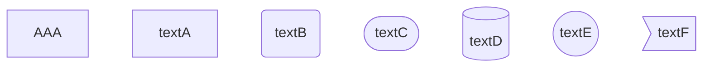

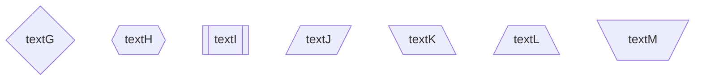

> 注：可以将文本用引号引起，避免引号中出现特殊字符无法正常显示的情况（此时引号可以使用MarkDown引号字符编码 **#quot;** ）。

### 3、连线形状

节点间的连接线有多种形状，可以在连接线中加入标签：

| 命令                                           | 形状             |
| ---------------------------------------------- | ---------------- |
| A1 --> B1                                      | 箭头连接         |
| A2 --- B2                                      | 开放连接         |
| A3 --- text --- B3    /    A33 -- text --- B33 | 标签连接         |
| A4 --- 描述 --> B4    /    A44 -- text --> B44 | 箭头标签连接     |
| A5 -.- B5                                      | 虚线开放连接     |
| A6 -.-> B6                                     | 虚线箭头连接     |
| A7 -.test.- B7 / A77 -.-test77-.- B77          | 标签虚线连接     |
| A8 -. 描述 .-> B8  / A88 -.-test88-.-> B88     | 标签虚线箭头连接 |
| A9 === B9                                      | 粗线开放连接     |
| A10 ==> B10                                    | 粗线箭头连接     |
| A11 == 描述 === B11                            | 标签粗线开放连接 |
| A12 == 描述 ==> B12                            | 标签粗线箭头连接 |

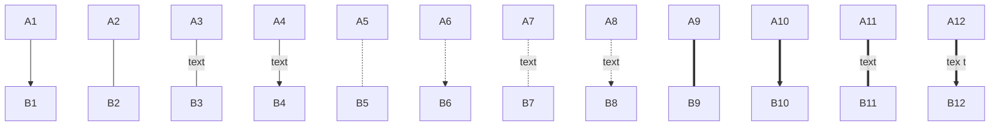

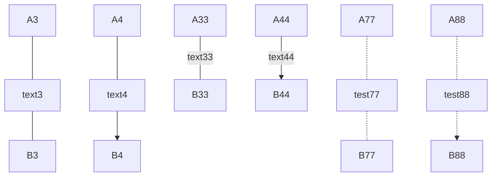


### 4、代码如下

```php
graph TB;
  subgraph 分情况
    A(开始)-->B{判断}
  end
  
  B--第一种情况-->C[第一种方案]
  B--第二种情况-->D[第二种方案]
  B--第三种情况-->F{第三种方案}
  
  subgraph 分种类
    F-.第1个.->J((测试圆形))
    F-.第2个.->H>右向旗帜形]
  end
  
  H---I(测试完毕)
  C--票数100---I(测试完毕)
  D---I(测试完毕)
  J---I(测试完毕)
```

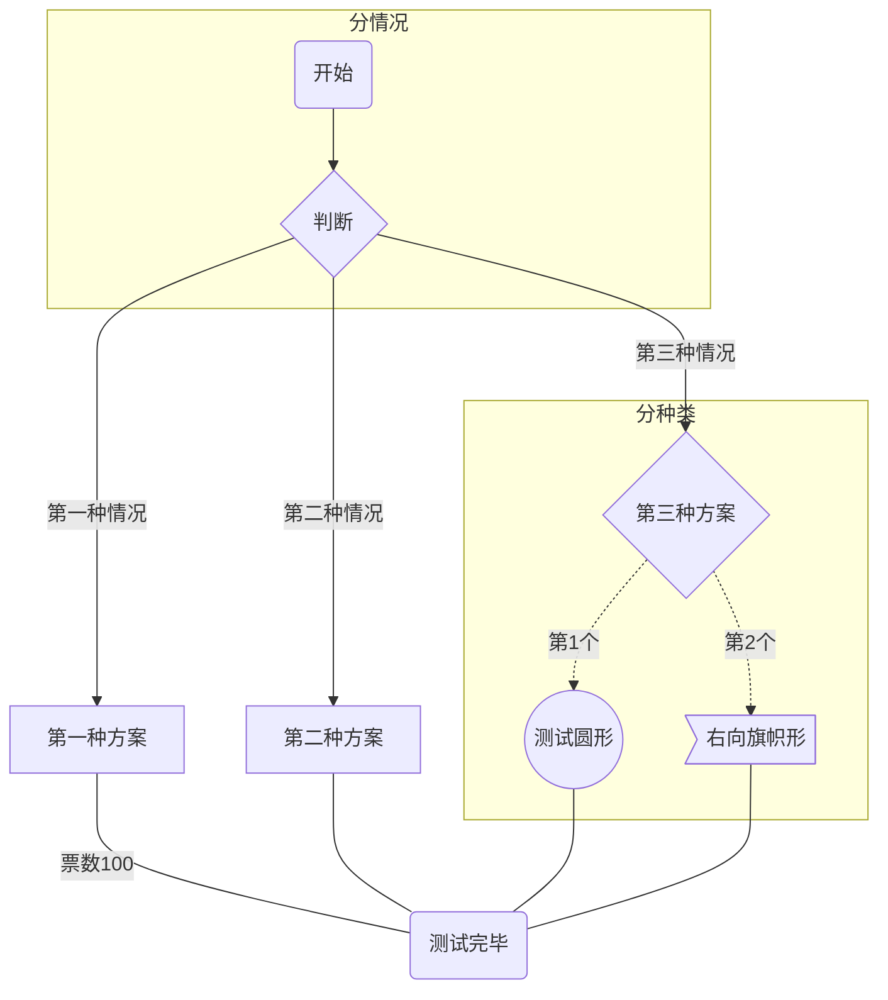


## 3、子流程图（subgraph）

Markdown 的语法中，还允许用户添加子图，子图就是以 `subgraph` 关键字标识的 graph，并以 `end` 结尾，但所有节点名都是全局的，并不隔离，因此子图之间是可以相互连接的。

1、代码格式

```bash
# 外面的那层, 可以使用子图中的节点，子图中的节点名不是隔离的，可以认为是全局变量-.-
graph LR
  subgraph title1
    graph definition 
  end
  subgraph title2
    graph definition 
  end
  ...
```

2、操作示例

````bash
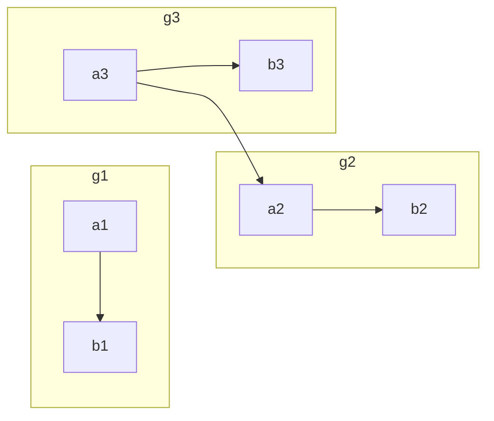
````

3、效果


4、可以使用 **&** 同时指定多个节点之间的多个连线。

````bash
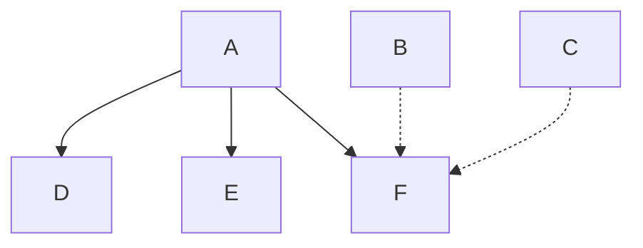
````

5、效果


## 4、时序图（sequenceDiagram）

用来描述两个或更多模块之间的交互过程首选就是时序图，Markdown 也同样提供了绘制时序图的功能。绘制时序图的关键字是 `sequenceDiagram`。

### 1、参与者 -- 模块声明

作为多个模块之间交互过程的表现，首要的工作就是要声明共有哪些模块。

我们需要通过 `participant` 关键字进行声明，声明的顺序就是模块从左到右的展示顺序。

例如：

```markdown
sequenceDiagram
  title: text
    participant B  
    participant A
```


### 2、连接线

Markdown 时序图支持以下连线方式：

| 命令 | 描述         |
| ---- | ------------ |
| ->   | 无箭头实线   |
| ->>  | 有箭头实线   |
| -->  | 无箭头虚线   |
| -->> | 有箭头虚线   |
| -x   | 带x实线      |
| --x  | 带x虚线      |
| -)   | 实线菱形箭头 |
| –)   | 虚线菱形箭头 |


### 3、代码与效果图

1、代码效果1

```bash
sequenceDiagram
  Title: 网购流程
    客户 ->> 商家: 下单
    商家 ->> 仓库: 下单提醒发货
    商家 -->> 客户: 下单成功等待收货
    仓库 -->> 客户: 发货
    客户 ->> 商家: 收获成功
```

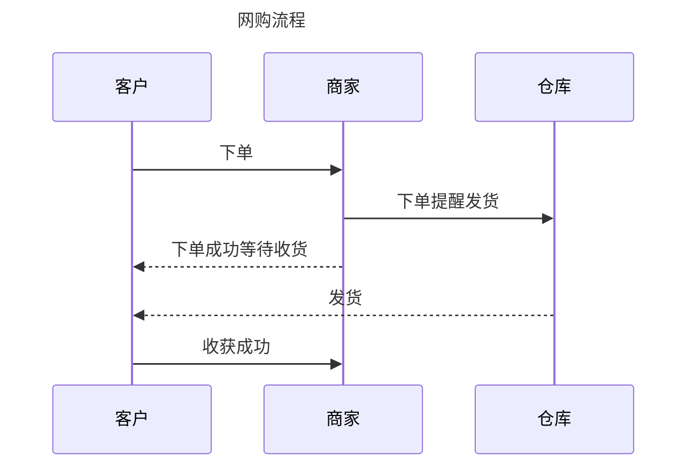

2、代码效果2

```bash
sequenceDiagram  
  participant server  
  participant CA  
  participant client  
 
  server->>CA: 这是我的公钥  
  CA-->>server: 下发证书  
  server->client: 建立连接  
  client->>server: 我要 RSA 算法加密的公钥  
  server-->>client: 下发证书与公钥  
  client-->>server: 上报通过公钥加密的随机数  
  server->>server: 生成对称加密秘钥  
  client-->server: 加密通信  
  client-->server: 加密通信  
  client-xserver: 关闭连接  
```

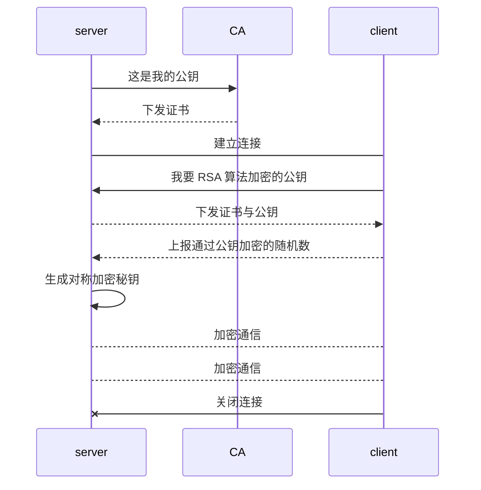

### 4、高级特性

在实际的使用场景中，往往并不是这样简单地相互通信，而是需要分支、循环等特殊处理，markdown 也同样可以支持。

#### 1、循环

```bash
 loop Loop_text  
  ... statements...  
 end
```

#### 2、分支

```bash
 alt Describing_text  
  ...statements...  
  else  
  ...statements...  
  end  
 
  *# 推荐在没有else的情况下使用 opt(option,选择)*
 
 opt Describing_text  
  ...statements...  
  End
```

#### 3、注释

注释或者称之为便签，用来对模块做额外标记。

- 单个标签：note right of | left of: Text
- 给多个模块打标签：note over [Actor1, Actor2...]:Text

#### 4、实例

```bash
 sequenceDiagram  
 participant Doctor  
 participant Bob  
 
 note right of Bob: Bob is a patient  
 
 loop Look Bob each hour  
 Doctor->>Bob: How are you?  
 alt Bob is sick  
 Bob->>Doctor: Not so good.  
 else  
 Bob->>Doctor: Fine, thank you.  
 end  
 loop Ask about patient  
 Doctor-->Bob: Inquire about the situation  
 end  
 opt Extra response  
 Bob->>Doctor:Thanks for asking  
 end  
 end  
 
 note right of Doctor: hourly ask finished
```

#### 5、效果

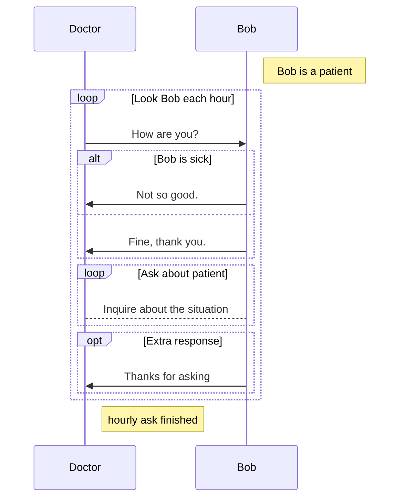


## 5、甘特图（gantt）

在项目管理中，甘特图是一个非常得力的好帮手，通过甘特图，我们可以对整个项目的进展情况一目了然。

用 markdown 绘制甘特图十分简单快捷。

他有以下关键字：

- dateFormat -- 日期格式
- section -- 模块声明
- Completed -- 已经完成
- Active -- 进行中
- Future -- 待后续处理
- crit -- 关键阶段

代码与效果 1：

```bash
gantt
    title 我的甘特图
    dateFormat  YYYY-MM-DD

    section Section A
        学习后端	:a1, 2014-01-01, 20d
        学习前端	:after a1  , 20d

    section Section B
        学习vue	:2014-01-12  , 8d
        学习spring	: 14d
```

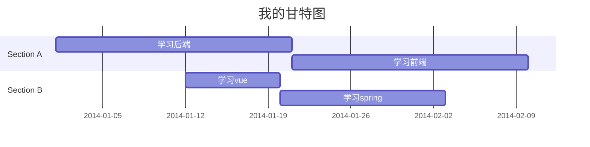

代码与效果 2：

```bash
gantt
 dateFormat  YYYY-MM-DD
 title     软件开发任务进度安排 
 excludes   weekends

 section 软硬件选型 
 硬件选择      :done,desc1, 2020-01-01,6w 
 软件设计      :active,desc2, after desc1,3w

 section 编码准备
 软件选择       :crit,done,desc3,2020-01-01,2020-01-29
 编码和测试软件   :1w
 安装测试系统    :2020-02-12,1w

 section 完成论文
 编写手册      :desc5,2020-01-01,10w
 论文修改      :crit,after desc3,3w
 论文定稿      :after desc5,3w
```

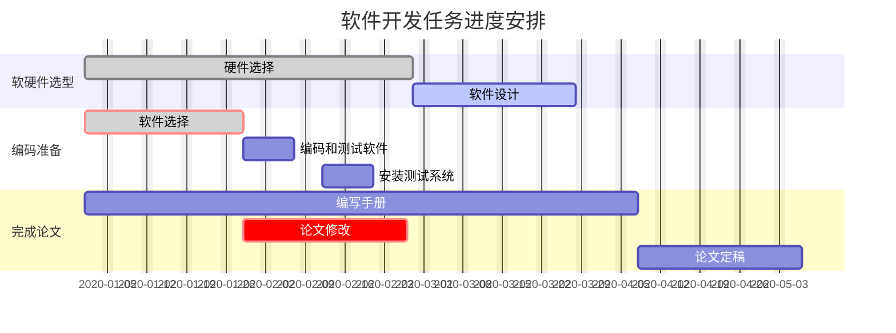


## 6、类图（classDiagram）

代码与效果

```bash
classDiagram
	Animal <|-- Duck
    Animal <|-- Fish
    Animal <|-- Zebra
    Animal : +int age
    Animal : +String gender
    Animal : +isMammal()
    Animal : +mate()
    class Duck{
    	+String beakColor
        +swim()
        +quack()
    }
    class Fish{
    	-int sizeInFeet
        -canEat()
    }
    class Zebra{
    	+bool is_wild
		+run()
    }
```


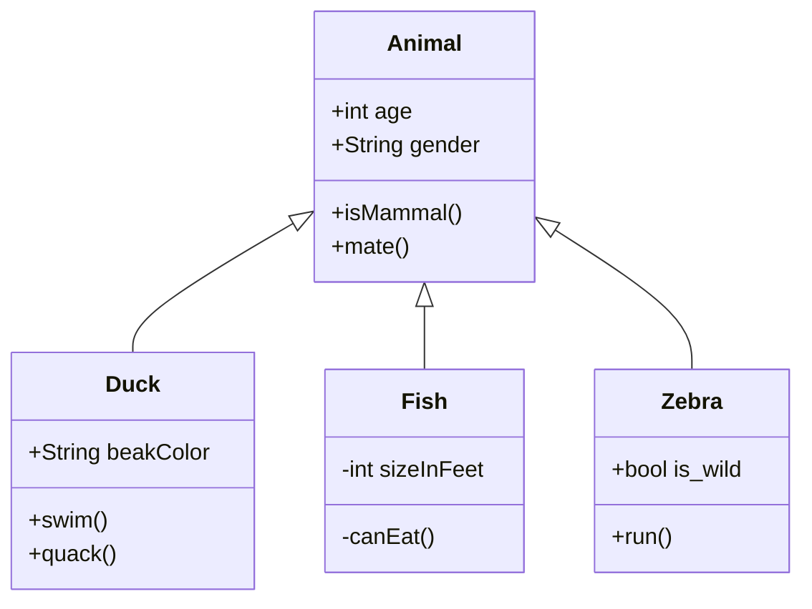


## 7、饼图（pie）

代码与效果

```bash
pie 
  title 我的饼图
    "狗" : 386
    "猫" : 85
    "鼠" : 150 
```

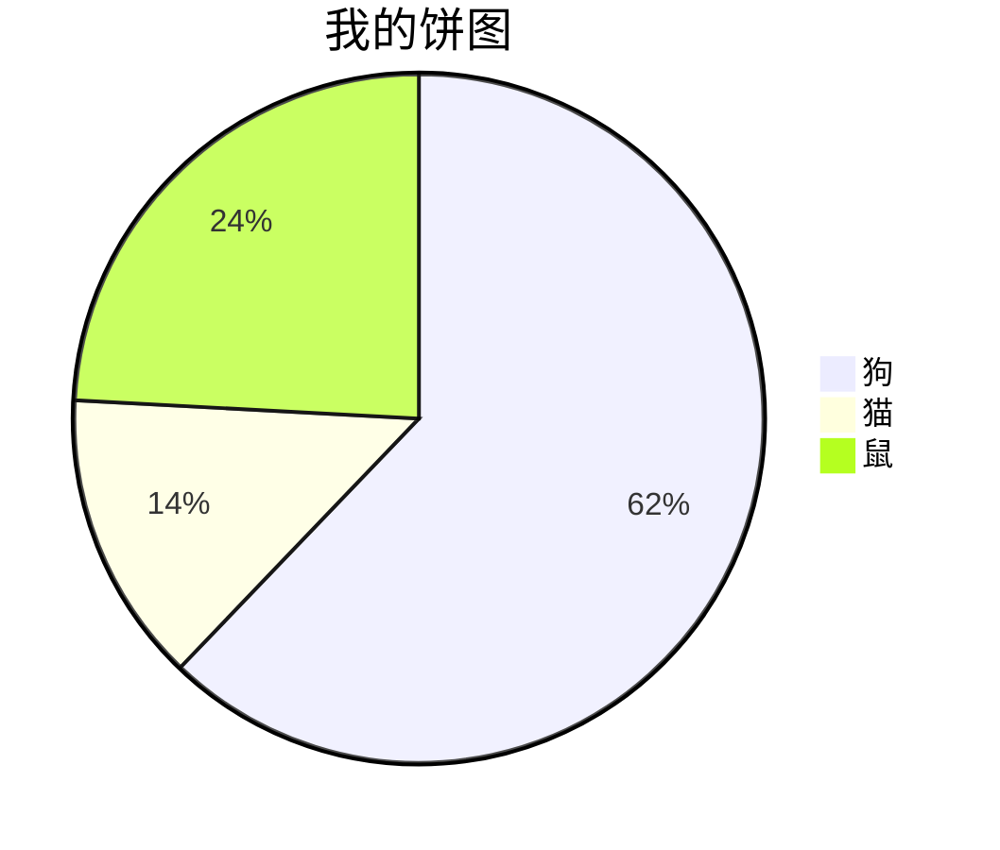


