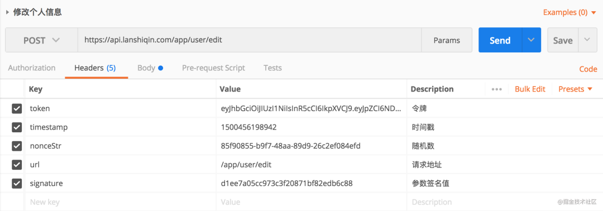

> 作者：蔚可云；来源：https://mp.weixin.qq.com/s/35BatRX9sD409KTAU9cf8g
>
> 作者：JAVA葵花宝典，来源：https://mp.weixin.qq.com/s/DUl7cZ6umdgHZMvjEXWKGQ

# API接口防止参数篡改和重放攻击

API重放攻击(Replay Attacks)又称为重播攻击、回放攻击。它的原理就是把之前窃听到的数据原封不动的重新发送给接收方。HTTPS并不能防止这种攻击，虽然传输的数据都是经过加密的，窃听者无法得到数据的准确定义，但是可以从请求的接收方地址分析这些数据的作用。比如用户登录请求时攻击者虽然无法窃听密码，但是却可以截获加密后的口令然后将其重放，从而利用这种方式进行有效的攻击。

> 所谓重放攻击就是攻击者发送一个目的主机已经接收过的包，来达到欺骗系统的目的，主要用于身份认证过程，重放攻击是计算机世界黑客常用的攻击方式之一。

一次HTTP请求，从请求方到接收方中间要经过很多路由器和交换机，攻击者可以在中途截获请求的数据。假设在一个网上存款系统中，一条消息表示用户支取了一笔存款，攻击者完全可以多次发送这条消息而偷窃存款。

重放是二次请求，如果API接口没有做到对应的安全防护，将可能造成很严重的后果。

API接口常见的安全防护要做到主要有以下几点：

- 防止sql注入
- 防止xss攻击
- 防止请求参数被篡改
- 防止重放攻击

主要防御措施可以归纳为两点：

- 对请求的合法性进行校验
- 对请求的数据进行校验

防止重放攻击必须要保证请求仅一次有效。需要通过在请求体重携带当前请求的唯一标识，并且进行签名防止被篡改。所以防止重放攻击需要建立在防止签名被篡改的基础之上。

## 一、请求参数防篡改

采用https协议可以将传输的明文进行加密，但是黑客仍然可以截获传输的数据包，进一步伪造请求进行重放攻击。如果黑客使用特殊手段让请求方设备使用了伪造的证书进行通信，那么https加密的内容也会被解密。

在API接口中我们除了使用https协议进行通信外，还需要有自己的一套加解密机制，对请求的参数进行保护，防止被篡改。

过程如下：

1. 客户端使用约定好的秘钥对传输的参数进行加密，得到签名值signature，并且将签名值也放入请求的参数中，发送请求给服务端
2. 服务端接收到客户端的请求，然后使用约定好的秘钥对请求的参数（除了signature以外）再次进行签名，得到签名值autograph。
3. 服务端比对signature和autograph的值，如果对比一致，认定为合法请求。如果对比不一致，说明参数被篡改，认定是合法请求。

因为黑客不知道签名的秘钥，所以即使截获到请求数据，对请求参数进行篡改，但是却无法对参数进行前面，无法得到修改后参数的签名值signature。

签名的秘钥我们可以使用很多方案，可以采用对称加密或者非对称加密


## 二、防止重放攻击

### 1、基于timestamp的方案

每次HTTP请求，都需要加上timestamp参数，然后把timestamp和其他参数一起进行数字签名。因为一次正常的HTTP氢气u，从发出到达服务器一般都不会超过60s，所以服务器收到HTTP请求之后，首先判断时间戳参数与当前时间比较，是否超过了60s，如果超过了则认为是非法请求。

一般情况下，黑客从抓包重放请求耗时远远超过了60s，所以此时请求中的timestamp参数已经失效了。

如果黑客修改timestamp参数为当前的时间戳，则signature参数对应的数字签名就会失效，因为黑客不知道签名秘钥，没有办法生成新的数字签名。

但是这种方式的漏洞也是显而易见，如果在60s之内进行重放攻击，那就没办法了，所以这种方式不能保证请求仅一次有效。

### 2、基于nonce的方案

nonce的意思是仅一次有效的随机字符串，要求每次请求时，该参数要保证不同，所以该参数一般与时间戳有关，我们这里为了方便起见，直接使用时间戳的16进制，实际使用客户加上客户端的ip地址，mac地址等信息做个哈希之后，作为nonce参数。

我们每次将请求的nonce参数存储到一个”集合“中，可以json格式存储到数据库或缓存。

每次处理HTTP请求时，首先判断该请求的nonce是否在该集合中，如果存在则认为是非法请求。

nonce参数在首次请求时，已经被存储到了服务器上的集合中，再次请求会被识别并拒绝。

nonce参数作为数组签名的一部分，是无法篡改的，因为黑客不清楚token，所以不能生成新的sign。

这种方式也有很大的问题，那就是存储nonce参数的集合会越来越大，验证nonce是否在集合中的耗时会越来越长。我们不能让nonce集合无限大，所以需要定期清理该集合，但是一旦该集合被清理，我们就无法验证被清理的nonce参数了。也就是说，假设该集合平均1天清理一次的话，我们抓取到的该url虽然当时无法进行重放攻击，但是我们还是可以每隔一天进行一次重复刚攻击的。而且存储24小时内，所有请求的nonce参数，也是一笔不小的开销。

### 3、基于timestamp和nonce的方案

nonce的一次性可以解决timestamp参数60s的问题，timestamp可以解决nonce参数集合越来越大的问题。防止重放攻击一般和防止请求参数被篡改一起做。请求的Headers数据如下图所示。



我们在timestamp方案的基础上，加上nonce参数，因为timestamp参数对于超过60s的请求，都认为是非法请求，所以我们只需要存储60s的nonce参数集合即可。

API接口验证流程:

```java
String token = request.getHeader("token");
String timestamp = request.getHeader("timestamp");
String nonceStr = request.getHeader("nonceStr");

String url = request.getHeader("url");

String signature = request.getHeader("signature");


if (StringUtil.isBlank(token) || StringUtil.isBlank(timestamp) || StringUtil.isBlank(nonceStr) || StringUtil.isBlank(url)
   || StringUtil.isBlank(signature))
{
    return;
}

UserTokenInfo userTokenInfo = TokenUtil.getUserTokenInfo(token);

if (userTokenInfo == null) {
    return;
}

if (!request.getRequestURI().equal(url)) {
    return;
}

if (DateUtil.getSecond()-DateUtil.toSecond(timestamp) > 60) {
    return;
}

if (RedisUtils.haveNonceStr(userTokenInfo,nonceStr)) {
    return;
}

String stringB = SignUtil.signature(token, timestamp, nonceStr, url, request);
if (!signature.equals(stringB)) {
    return;
}
RedisUtils.saveNonceStr(userTokenInfo,nonceStr,60);
```

### 4、微信公众号如何保证消息不会被重放攻击

使用微信公众平台的接口需要在微信公众平台设置token。这里假设token是不会被攻击者知道的，相当于一个PSK(Pre Shared Key) 微信发消息会有三个参数:signature、timestamp和nonce。

验证是否为微信发送的消息流程如下：

```php
$signature = $_GET["signature"];
$timestamp = $_GET["timestamp"];
$nonce = $_GET["nonce"];
$token = TOKEN;
// 按照$token,$timestamp,$nonce的顺序组成数组
$tmpArr = array($token, $timestamp, $nonce);
// 按照字典序排序
sort($tmpArr, SORT_STRING);
// 将排序后的数组串成字符串
$tmpStr = implode( $tmpArr );
// 用sha1计算签名
$tmpStr = sha1( $tmpStr );
// 校验签名
if( $tmpStr == $signature ){
    return true;
}else{
    return false;
}
```

这里在使用的时候，这里针对消息的重放攻击的防护应该检查nonce值是否已经存在，如果已经存在可能为非法通知，按道理来讲也应该检查这里timestamp和当前时间比较是否已经过了一定的时间，但是这里在微信公众号开发文档中并没有说明，这里其实应该是需要验证消息是否是否在同一个时间戳内的，如果接收到的消息距离发送的时间已经超过1s就可以直接丢弃了，当然在网络不好的情况下会造成丢消息。

另外一个这里针对重试或者幂等性的要求上要做到解密后消息中去，比如发起重试使用同样的消息id即可。虽然每次的nonce值是不一样的，但是消息的id是一样的，就可以区分出来是否为同一个消息的重试发送。

这里一般的做法是抽出一个前置网关，做消息的解密和加密，后端服务进行消息的处理，消息的处理上对重试带来的幂等性问题做处理就可以了。


# API 面试四连杀：接口如何设计？安全如何保证？签名如何实现？防重如何实现？

下面我们就来讨论下常用的一些API设计的安全方法，可能不一定是最好的，有更牛逼的实现方式，但是这篇是我自己的经验分享.

## 一、token 简介

Token：访问令牌access token, 用于接口中, 用于标识接口调用者的身份、凭证，减少用户名和密码的传输次数。一般情况下客户端(接口调用方)需要先向服务器端申请一个接口调用的账号，服务器会给出一个appId和一个key, key用于参数签名使用，注意key保存到客户端，需要做一些安全处理，防止泄露。

Token的值一般是UUID，服务端生成Token后需要将token做为key，将一些和token关联的信息作为value保存到缓存服务器中(redis)，当一个请求过来后，服务器就去缓存服务器中查询这个Token是否存在，存在则调用接口，不存在返回接口错误，一般通过拦截器或者过滤器来实现，Token分为两种：

- API Token(接口令牌): 用于访问不需要用户登录的接口，如登录、注册、一些基本数据的获取等。获取接口令牌需要拿appId、timestamp和sign来换，sign=加密(timestamp+key)
- USER Token(用户令牌): 用于访问需要用户登录之后的接口，如：获取我的基本信息、保存、修改、删除等操作。获取用户令牌需要拿用户名和密码来换

关于Token的时效性：token可以是一次性的、也可以在一段时间范围内是有效的，具体使用哪种看业务需要。

一般情况下接口最好使用https协议，如果使用http协议，Token机制只是一种减少被黑的可能性，其实只能防君子不能防小人。

一般token、timestamp和sign 三个参数会在接口中会同时作为参数传递，每个参数都有各自的用途。


## 二、timestamp 简介

timestamp: 时间戳，是客户端调用接口时对应的当前时间戳，时间戳用于防止DoS攻击。当黑客劫持了请求的url去DoS攻击，每次调用接口时接口都会判断服务器当前系统时间和接口中传的的timestamp的差值，如果这个差值超过某个设置的时间(假如5分钟)，那么这个请求将被拦截掉，如果在设置的超时时间范围内，是不能阻止DoS攻击的。timestamp机制只能减轻DoS攻击的时间，缩短攻击时间。如果黑客修改了时间戳的值可通过sign签名机制来处理。

> DoS

DoS是Denial of Service的简称，即拒绝服务，造成DoS的攻击行为被称为DoS攻击，其目的是使计算机或网络无法提供正常的服务。最常见的DoS攻击有计算机网络带宽攻击和连通性攻击。

DoS攻击是指故意的攻击网络协议实现的缺陷或直接通过野蛮手段残忍地耗尽被攻击对象的资源，目的是让目标计算机或网络无法提供正常的服务或资源访问，使目标系统服务系统停止响应甚至崩溃，而在此攻击中并不包括侵入目标服务器或目标网络设备。这些服务资源包括网络带宽，文件系统空间容量，开放的进程或者允许的连接。这种攻击会导致资源的匮乏，无论计算机的处理速度多快、内存容量多大、网络带宽的速度多快都无法避免这种攻击带来的后果。

- Pingflood: 该攻击在短时间内向目的主机发送大量ping包，造成网络堵塞或主机资源耗尽。
- Synflood: 该攻击以多个随机的源主机地址向目的主机发送SYN包，而在收到目的主机的SYN ACK后并不回应，这样，目的主机就为这些源主机建立了大量的连接队列，而且由于没有收到ACK一直维护着这些队列，造成了资源的大量消耗而不能向正常请求提供服务。
- Smurf：该攻击向一个子网的广播地址发一个带有特定请求（如ICMP回应请求）的包，并且将源地址伪装成想要攻击的主机地址。子网上所有主机都回应广播包请求而向被攻击主机发包，使该主机受到攻击。
- Land-based：攻击者将一个包的源地址和目的地址都设置为目标主机的地址，然后将该包通过IP欺骗的方式发送给被攻击主机，这种包可以造成被攻击主机因试图与自己建立连接而陷入死循环，从而很大程度地降低了系统性能。
- Ping of Death：根据TCP/IP的规范，一个包的长度最大为65536字节。尽管一个包的长度不能超过65536字节，但是一个包分成的多个片段的叠加却能做到。当一个主机收到了长度大于65536字节的包时，就是受到了Ping of Death攻击，该攻击会造成主机的宕机。
- Teardrop：IP数据包在网络传递时，数据包可以分成更小的片段。攻击者可以通过发送两段（或者更多）数据包来实现TearDrop攻击。第一个包的偏移量为0，长度为N，第二个包的偏移量小于N。为了合并这些数据段，TCP/IP堆栈会分配超乎寻常的巨大资源，从而造成系统资源的缺乏甚至机器的重新启动。
- PingSweep：使用ICMP Echo轮询多个主机。

## 三、sign 简介

nonce：随机值，是客户端随机生成的值，作为参数传递过来，随机值的目的是增加sign签名的多变性。随机值一般是数字和字母的组合，6位长度，随机值的组成和长度没有固定规则。

sign: 一般用于参数签名，防止参数被非法篡改，最常见的是修改金额等重要敏感参数， sign的值一般是将所有非空参数按照升续排序然后+token+key+timestamp+nonce(随机数)拼接在一起，然后使用某种加密算法进行加密，作为接口中的一个参数sign来传递，也可以将sign放到请求头中。接口在网络传输过程中如果被黑客挟持，并修改其中的参数值，然后再继续调用接口，虽然参数的值被修改了，但是因为黑客不知道sign是如何计算出来的，不知道sign都有哪些值构成，不知道以怎样的顺序拼接在一起的，最重要的是不知道签名字符串中的key是什么，所以黑客可以篡改参数的值，但没法修改sign的值，当服务器调用接口前会按照sign的规则重新计算出sign的值然后和接口传递的sign参数的值做比较，如果相等表示参数值没有被篡改，如果不等，表示参数被非法篡改了，就不执行接口了。


## 四、防止重复提交

对于一些重要的操作需要防止客户端重复提交的(如非幂等性重要操作)，具体办法是当请求第一次提交时将sign作为key保存到redis，并设置超时时间，超时时间和Timestamp中设置的差值相同。当同一个请求第二次访问时会先检测redis是否存在该sign，如果存在则证明重复提交了，接口就不再继续调用了。如果sign在缓存服务器中因过期时间到了，而被删除了，此时当这个url再次请求服务器时，因token的过期时间和sign的过期时间一直，sign过期也意味着token过期，那样同样的url再访问服务器会因token错误会被拦截掉，这就是为什么sign和token的过期时间要保持一致的原因。拒绝重复调用机制确保URL被别人截获了也无法使用（如抓取数据）。

对于哪些接口需要防止重复提交可以自定义个注解来标记。

> 注意：所有的安全措施都用上的话有时候难免太过复杂，在实际项目中需要根据自身情况作出裁剪，比如可以只使用签名机制就可以保证信息不会被篡改，或者定向提供服务的时候只用Token机制就可以了。如何裁剪，全看项目实际情况和对接口安全性的要求。


## 五、使用流程

1. 接口调用方(客户端)向接口提供方(服务器)申请接口调用账号，申请成功后，接口提供方会给接口调用方一个appId和一个key参数
2. 客户端携带参数appId、timestamp、sign去调用服务器端的API token，其中sign=加密(appId + timestamp + key)
3. 客户端拿着api_token 去访问不需要登录就能访问的接口
4. 当访问用户需要登录的接口时，客户端跳转到登录页面，通过用户名和密码调用登录接口，登录接口会返回一个usertoken, 客户端拿着usertoken 去访问需要登录才能访问的接口

sign的作用是防止参数被篡改，客户端调用服务端时需要传递sign参数，服务器响应客户端时也可以返回一个sign用于客户度校验返回的值是否被非法篡改了。客户端传的sign和服务器端响应的sign算法可能会不同。


## 六、示例代码

1、dependency

```xml
<dependency>
    <groupId>org.springframework.boot</groupId>
    <artifactId>spring-boot-starter-data-redis</artifactId>
</dependency>
<dependency>
    <groupId>redis.clients</groupId>
    <artifactId>jedis</artifactId>
    <version>2.9.0</version>
</dependency>

<dependency>
    <groupId>org.springframework.boot</groupId>
    <artifactId>spring-boot-starter-web</artifactId>
</dependency>
```

2、RedisConfiguration

```java
@Configuration
public class RedisConfiguration {
    @Bean
    public JedisConnectionFactory jedisConnectionFactory(){
        return new JedisConnectionFactory();
    }

    /**
     * 支持存储对象
     * @return
     */
    @Bean
    public RedisTemplate<String, String> redisTemplate(){
        RedisTemplate<String, String> redisTemplate = new StringRedisTemplate();
        redisTemplate.setConnectionFactory(jedisConnectionFactory());
        Jackson2JsonRedisSerializer jackson2JsonRedisSerializer = new Jackson2JsonRedisSerializer(Object.class);
        ObjectMapper objectMapper = new ObjectMapper();
        objectMapper.setVisibility(PropertyAccessor.ALL, JsonAutoDetect.Visibility.ANY);
        objectMapper.enableDefaultTyping(ObjectMapper.DefaultTyping.NON_FINAL);

        jackson2JsonRedisSerializer.setObjectMapper(objectMapper);
        redisTemplate.setValueSerializer(jackson2JsonRedisSerializer);
        redisTemplate.afterPropertiesSet();

        return redisTemplate;
    }
}
```

3、TokenController

```java
@Slf4j
@RestController
@RequestMapping("/api/token")
public class TokenController {

    @Autowired
    private RedisTemplate redisTemplate;

    /**
     * API Token
     *
     * @param sign
     * @return
     */
    @PostMapping("/api_token")
    public ApiResponse<AccessToken> apiToken(String appId, @RequestHeader("timestamp") String timestamp, @RequestHeader("sign") String sign) {
        Assert.isTrue(!StringUtils.isEmpty(appId) && !StringUtils.isEmpty(timestamp) && !StringUtils.isEmpty(sign), "参数错误");

        long reqeustInterval = System.currentTimeMillis() - Long.valueOf(timestamp);
        Assert.isTrue(reqeustInterval < 5 * 60 * 1000, "请求过期，请重新请求");

        // 1. 根据appId查询数据库获取appSecret
        AppInfo appInfo = new AppInfo("1", "12345678954556");

        // 2. 校验签名
        String signString = timestamp + appId + appInfo.getKey();
        String signature = MD5Util.encode(signString);
        log.info(signature);
        Assert.isTrue(signature.equals(sign), "签名错误");

        // 3. 如果正确生成一个token保存到redis中，如果错误返回错误信息
        AccessToken accessToken = this.saveToken(0, appInfo, null);

        return ApiResponse.success(accessToken);
    }


    @NotRepeatSubmit(5000)
    @PostMapping("user_token")
    public ApiResponse<UserInfo> userToken(String username, String password) {
        // 根据用户名查询密码, 并比较密码(密码可以RSA加密一下)
        UserInfo userInfo = new UserInfo(username, "81255cb0dca1a5f304328a70ac85dcbd", "111111");
        String pwd = password + userInfo.getSalt();
        String passwordMD5 = MD5Util.encode(pwd);
        Assert.isTrue(passwordMD5.equals(userInfo.getPassword()), "密码错误");

        // 2. 保存Token
        AppInfo appInfo = new AppInfo("1", "12345678954556");
        AccessToken accessToken = this.saveToken(1, appInfo, userInfo);
        userInfo.setAccessToken(accessToken);
        return ApiResponse.success(userInfo);
    }

    private AccessToken saveToken(int tokenType, AppInfo appInfo,  UserInfo userInfo) {
        String token = UUID.randomUUID().toString();

        // token有效期为2小时
        Calendar calendar = Calendar.getInstance();
        calendar.setTime(new Date());
        calendar.add(Calendar.SECOND, 7200);
        Date expireTime = calendar.getTime();

        // 4. 保存token
        ValueOperations<String, TokenInfo> operations = redisTemplate.opsForValue();
        TokenInfo tokenInfo = new TokenInfo();
        tokenInfo.setTokenType(tokenType);
        tokenInfo.setAppInfo(appInfo);

        if (tokenType == 1) {
            tokenInfo.setUserInfo(userInfo);
        }

        operations.set(token, tokenInfo, 7200, TimeUnit.SECONDS);

        AccessToken accessToken = new AccessToken(token, expireTime);

        return accessToken;
    }

    public static void main(String[] args) {
        long timestamp = System.currentTimeMillis();
        System.out.println(timestamp);
        String signString = timestamp + "1" + "12345678954556";
        String sign = MD5Util.encode(signString);
        System.out.println(sign);

        System.out.println("-------------------");
        signString = "password=123456&username=1&12345678954556" + "ff03e64b-427b-45a7-b78b-47d9e8597d3b1529815393153sdfsdfsfs" + timestamp + "A1scr6";
        sign = MD5Util.encode(signString);
        System.out.println(sign);
    }
}
```

4、WebMvcConfiguration

```java
@Configuration
public class WebMvcConfiguration extends WebMvcConfigurationSupport {

    private static final String[] excludePathPatterns  = {"/api/token/api_token"};

    @Autowired
    private TokenInterceptor tokenInterceptor;

    @Override
    public void addInterceptors(InterceptorRegistry registry) {
        super.addInterceptors(registry);
        registry.addInterceptor(tokenInterceptor)
                .addPathPatterns("/api/**")
                .excludePathPatterns(excludePathPatterns);
    }
}
```

5、TokenInterceptor

```java
@Component
public class TokenInterceptor extends HandlerInterceptorAdapter {

    @Autowired
    private RedisTemplate redisTemplate;

    /**
     *
     * @param request
     * @param response
     * @param handler 访问的目标方法
     * @return
     * @throws Exception
     */
    @Override
    public boolean preHandle(HttpServletRequest request, HttpServletResponse response, Object handler) throws Exception {
        String token = request.getHeader("token");
        String timestamp = request.getHeader("timestamp");
        // 随机字符串
        String nonce = request.getHeader("nonce");
        String sign = request.getHeader("sign");
        Assert.isTrue(!StringUtils.isEmpty(token) && !StringUtils.isEmpty(timestamp) && !StringUtils.isEmpty(sign), "参数错误");

        // 获取超时时间
        NotRepeatSubmit notRepeatSubmit = ApiUtil.getNotRepeatSubmit(handler);
        long expireTime = notRepeatSubmit == null ? 5 * 60 * 1000 : notRepeatSubmit.value();

        // 2. 请求时间间隔
        long reqeustInterval = System.currentTimeMillis() - Long.valueOf(timestamp);
        Assert.isTrue(reqeustInterval < expireTime, "请求超时，请重新请求");

        // 3. 校验Token是否存在
        ValueOperations<String, TokenInfo> tokenRedis = redisTemplate.opsForValue();
        TokenInfo tokenInfo = tokenRedis.get(token);
        Assert.notNull(tokenInfo, "token错误");

        // 4. 校验签名(将所有的参数加进来，防止别人篡改参数) 所有参数看参数名升续排序拼接成url
        // 请求参数 + token + timestamp + nonce
        String signString = ApiUtil.concatSignString(request) + tokenInfo.getAppInfo().getKey() + token + timestamp + nonce;
        String signature = MD5Util.encode(signString);
        boolean flag = signature.equals(sign);
        Assert.isTrue(flag, "签名错误");

        // 5. 拒绝重复调用(第一次访问时存储，过期时间和请求超时时间保持一致), 只有标注不允许重复提交注解的才会校验
        if (notRepeatSubmit != null) {
            ValueOperations<String, Integer> signRedis = redisTemplate.opsForValue();
            boolean exists = redisTemplate.hasKey(sign);
            Assert.isTrue(!exists, "请勿重复提交");
            signRedis.set(sign, 0, expireTime, TimeUnit.MILLISECONDS);
        }

        return super.preHandle(request, response, handler);
    }
}
```

6、MD5Util：MD5工具类，加密生成数字签名

```java
public class MD5Util {

    private static final String hexDigits[] = { "0", "1", "2", "3", "4", "5",
            "6", "7", "8", "9", "a", "b", "c", "d", "e", "f" };

    private static String byteArrayToHexString(byte b[]) {
        StringBuffer resultSb = new StringBuffer();
        for (int i = 0; i < b.length; i++)
            resultSb.append(byteToHexString(b[i]));

        return resultSb.toString();
    }

    private static String byteToHexString(byte b) {
        int n = b;
        if (n < 0)
            n += 256;
        int d1 = n / 16;
        int d2 = n % 16;
        return hexDigits[d1] + hexDigits[d2];
    }

    public static String encode(String origin) {
        return encode(origin, "UTF-8");
    }
    public static String encode(String origin, String charsetname) {
        String resultString = null;
        try {
            resultString = new String(origin);
            MessageDigest md = MessageDigest.getInstance("MD5");
            if (charsetname == null || "".equals(charsetname))
                resultString = byteArrayToHexString(md.digest(resultString
                        .getBytes()));
            else
                resultString = byteArrayToHexString(md.digest(resultString
                        .getBytes(charsetname)));
        } catch (Exception exception) {
        }
        return resultString;
    }
}
```

7、@NotRepeatSubmit：自定义注解，防止重复提交。

```java
/**
 * 禁止重复提交
 */
@Target(ElementType.METHOD)
@Retention(RetentionPolicy.RUNTIME)
public @interface NotRepeatSubmit {
    /** 过期时间，单位毫秒 **/
    long value() default 5000;
} 
```

8、AccessToken

```java
@Data
@AllArgsConstructor
public class AccessToken {
    /** token */
    private String token;

    /** 失效时间 */
    private Date expireTime;
}
```

9、AppInfo

```java
@Data
@NoArgsConstructor
@AllArgsConstructor
public class AppInfo {
    /** App id */
    private String appId;
    /** API 秘钥 */
    private String key;
}
```

10、TokenInfo

```java
@Data
public class TokenInfo {
    /** token类型: api:0 、user:1 */
    private Integer tokenType;

    /** App 信息 */
    private AppInfo appInfo;

    /** 用户其他数据 */
    private UserInfo userInfo;
}
```

11、UserInfo

```java
@Data
public class UserInfo {
    /** 用户名 */
    private String username;
    /** 手机号 */
    private String mobile;
    /** 邮箱 */
    private String email;
    /** 密码 */
    private String password;
    /** 盐 */
    private String salt;

    private AccessToken accessToken;

    public UserInfo(String username, String password, String salt) {
        this.username = username;
        this.password = password;
        this.salt = salt;
    }
}
```

12、ApiCodeEnum

```java
/**
 * 错误码code可以使用纯数字,使用不同区间标识一类错误，也可以使用纯字符，也可以使用前缀+编号
 *
 * 错误码：ERR + 编号
 *
 * 可以使用日志级别的前缀作为错误类型区分 Info(I) Error(E) Warning(W)
 *
 * 或者以业务模块 + 错误号
 *
 * TODO 错误码设计
 *
 * Alipay 用了两个code，两个msg(https://docs.open.alipay.com/api_1/alipay.trade.pay)
 */
public enum ApiCodeEnum {
    SUCCESS("10000", "success"),
    UNKNOW_ERROR("ERR0001","未知错误"),
    PARAMETER_ERROR("ERR0002","参数错误"),
    TOKEN_EXPIRE("ERR0003","认证过期"),
    REQUEST_TIMEOUT("ERR0004","请求超时"),
    SIGN_ERROR("ERR0005","签名错误"),
    REPEAT_SUBMIT("ERR0006","请不要频繁操作"),
    ;

    /** 代码 */
    private String code;

    /** 结果 */
    private String msg;

    ApiCodeEnum(String code, String msg) {
        this.code = code;
        this.msg = msg;
    }

    public String getCode() {
        return code;
    }

    public String getMsg() {
        return msg;
    }
} 
```

13、ApiResult

```java
@Data
@NoArgsConstructor
@AllArgsConstructor
public class ApiResult {

    /** 代码 */
    private String code;

    /** 结果 */
    private String msg;
}
```

14、ApiUtil：这个参考支付宝加密的算法写的.我直接Copy过来了

```java
public class ApiUtil {

    /**
     * 按参数名升续拼接参数
     * @param request
     * @return
     */
    public static String concatSignString(HttpServletRequest request) {
        Map<String, String> paramterMap = new HashMap<>();
        request.getParameterMap().forEach((key, value) -> paramterMap.put(key, value[0]));
        // 按照key升续排序，然后拼接参数
        Set<String> keySet = paramterMap.keySet();
        String[] keyArray = keySet.toArray(new String[keySet.size()]);
        Arrays.sort(keyArray);
        StringBuilder sb = new StringBuilder();
        for (String k : keyArray) {
            // 或略掉的字段
            if (k.equals("sign")) {
                continue;
            }
            if (paramterMap.get(k).trim().length() > 0) {
                // 参数值为空，则不参与签名
                sb.append(k).append("=").append(paramterMap.get(k).trim()).append("&");
            }
        }

        return sb.toString();
    }

    public static String concatSignString(Map<String, String> map) {
        Map<String, String> paramterMap = new HashMap<>();
        map.forEach((key, value) -> paramterMap.put(key, value));
        // 按照key升续排序，然后拼接参数
        Set<String> keySet = paramterMap.keySet();
        String[] keyArray = keySet.toArray(new String[keySet.size()]);
        Arrays.sort(keyArray);
        StringBuilder sb = new StringBuilder();
        for (String k : keyArray) {
            if (paramterMap.get(k).trim().length() > 0) {
                // 参数值为空，则不参与签名
                sb.append(k).append("=").append(paramterMap.get(k).trim()).append("&");
            }
        }
        return sb.toString();
    }

    /**
     * 获取方法上的@NotRepeatSubmit注解
     * @param handler
     * @return
     */
    public static NotRepeatSubmit getNotRepeatSubmit(Object handler) {
        if (handler instanceof HandlerMethod) {
            HandlerMethod handlerMethod = (HandlerMethod) handler;
            Method method = handlerMethod.getMethod();
            NotRepeatSubmit annotation = method.getAnnotation(NotRepeatSubmit.class);

            return annotation;
        }

        return null;
    }
}
```

15、ApiResponse

```java
@Data
@Slf4j
public class ApiResponse<T> {
    /** 结果 */
    private ApiResult result;

    /** 数据 */
    private T data;

    /** 签名 */
    private String sign;


    public static <T> ApiResponse success(T data) {
        return response(ApiCodeEnum.SUCCESS.getCode(), ApiCodeEnum.SUCCESS.getMsg(), data);
    }

    public static ApiResponse error(String code, String msg) {
        return response(code, msg, null);
    }

    public static <T> ApiResponse response(String code, String msg, T data) {
        ApiResult result = new ApiResult(code, msg);
        ApiResponse response = new ApiResponse();
        response.setResult(result);
        response.setData(data);

        String sign = signData(data);
        response.setSign(sign);

        return response;
    }

    private static <T> String signData(T data) {
        // TODO 查询key
        String key = "12345678954556";
        Map<String, String> responseMap = null;
        try {
            responseMap = getFields(data);
        } catch (IllegalAccessException e) {
            return null;
        }
        String urlComponent = ApiUtil.concatSignString(responseMap);
        String signature = urlComponent + "key=" + key;
        String sign = MD5Util.encode(signature);

        return sign;
    }

    /**
     * @param data 反射的对象,获取对象的字段名和值
     * @throws IllegalArgumentException
     * @throws IllegalAccessException
     */
    public static Map<String, String> getFields(Object data) throws IllegalAccessException, IllegalArgumentException {
        if (data == null) return null;
        Map<String, String> map = new HashMap<>();
        Field[] fields = data.getClass().getDeclaredFields();
        for (int i = 0; i < fields.length; i++) {
            Field field = fields[i];
            field.setAccessible(true);

            String name = field.getName();
            Object value = field.get(data);
            if (field.get(data) != null) {
                map.put(name, value.toString());
            }
        }

        return map;
    }
}
```


## 七、ThreadLocal

ThreadLocal是线程内的全局上下文。就是在单个线程中，方法之间共享的内存，每个方法都可以从该上下文中获取值和修改值。

实际案例：

在调用api时都会传一个token参数，通常会写一个拦截器来校验token是否合法，我们可以通过token找到对应的用户信息(User)，如果token合法，然后将用户信息存储到ThreadLocal中，这样无论是在controller、service、dao的哪一层都能访问到该用户的信息。作用类似于Web中的request作用域。

传统方式我们要在方法中访问某个变量，可以通过传参的形式往方法中传参，如果多个方法都要使用那么每个方法都要传参；如果使用ThreadLocal所有方法就不需要传该参数了，每个方法都可以通过ThreadLocal来访问该值。

- ThreadLocalUtil.set("key", value); 保存值
- T value = ThreadLocalUtil.get("key"); 获取值

```java
public class ThreadLocalUtil<T> {
    private static final ThreadLocal<Map<String, Object>> threadLocal = new ThreadLocal() {
        @Override
        protected Map<String, Object> initialValue() {
            return new HashMap<>(4);
        }
    };


    public static Map<String, Object> getThreadLocal(){
        return threadLocal.get();
    }

    public static <T> T get(String key) {
        Map map = (Map)threadLocal.get();
        return (T)map.get(key);
    }

    public static <T> T get(String key,T defaultValue) {
        Map map = (Map)threadLocal.get();
        return (T)map.get(key) == null ? defaultValue : (T)map.get(key);
    }

    public static void set(String key, Object value) {
        Map map = (Map)threadLocal.get();
        map.put(key, value);
    }

    public static void set(Map<String, Object> keyValueMap) {
        Map map = (Map)threadLocal.get();
        map.putAll(keyValueMap);
    }

    public static void remove() {
        threadLocal.remove();
    }

    public static <T> Map<String,T> fetchVarsByPrefix(String prefix) {
        Map<String,T> vars = new HashMap<>();
        if( prefix == null ){
            return vars;
        }
        Map map = (Map)threadLocal.get();
        Set<Map.Entry> set = map.entrySet();

        for( Map.Entry entry : set){
            Object key = entry.getKey();
            if( key instanceof String ){
                if( ((String) key).startsWith(prefix) ){
                    vars.put((String)key,(T)entry.getValue());
                }
            }
        }
        return vars;
    }

    public static <T> T remove(String key) {
        Map map = (Map)threadLocal.get();
        return (T)map.remove(key);
    }

    public static void clear(String prefix) {
        if( prefix == null ){
            return;
        }
        Map map = (Map)threadLocal.get();
        Set<Map.Entry> set = map.entrySet();
        List<String> removeKeys = new ArrayList<>();

        for( Map.Entry entry : set ){
            Object key = entry.getKey();
            if( key instanceof String ){
                if( ((String) key).startsWith(prefix) ){
                    removeKeys.add((String)key);
                }
            }
        }
        for( String key : removeKeys ){
            map.remove(key);
        }
    }
}
```


总结：这个是目前第三方数据接口交互过程中常用的一些参数与使用示例，希望对大家有点帮助。

当然如果为了保证更加的安全，可以加上RSA，RSA2，AES等等加密方式，保证了数据的更加的安全，但是唯一的缺点是加密与解密比较耗费CPU的资源。