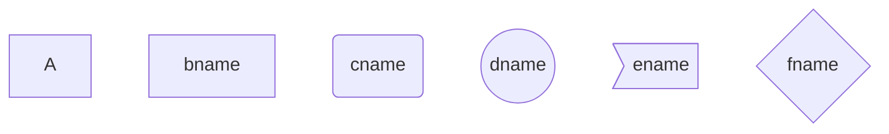

> 1. 惊呆！原来 markdown 的画图功能如此强大！：https://mp.weixin.qq.com/s/lQ9S3MLW2HlUXDv0V5IxFg
> 2. 【Markdown】Markdown画图：https://blog.csdn.net/qq_32708605/article/details/123801702
> 3. MarkDown画图(实例讲解) —— 流程图、序列图、饼图、甘特图：https://www.jianshu.com/p/77cc07f47cdc
> 4. Markdown 常用语法（画图）：https://blog.csdn.net/qq_37248504/article/details/109085445
> 5. Markdown图片神器：PicGo-让你爱上笔记与分享：https://mp.weixin.qq.com/s/Yk4uyNl2cugPEwodDcD5ew
> 6. mdnice.com——Markdown、知乎、公众号排版神器
> 7. openwrite.cn——Markdown 在线写作与多平台博客发布工具

# 一、Markdown 强大的画图功能

## 1. 引言

Markdown 是一种轻量级标记语言，相比于 xml、html 等超文本标记语言，Markdown 的语法更简单，结构更清晰，更加易读易用。

博主作为一个经常写些东西的笔记爱好者，已经成为了 markdown 的拥趸，甚至为了方便自己使用，自定义了很多类 markdown 语法从而形成了自己的个人博客。

然而，markdown 这个看似简单轻量的标记语言，却支持非常强大的绘图功能，使用起来十分方便，本文我们就来详细介绍下 markdown 语言如何绘制流程图、饼图、序列图、甘特图。


## 2. markdown 绘图块

启用 markdown 绘图块与代码块非常像：

````
```mermaid
  ··· 绘图指令 ···
```
````

# 3. 流程图

## 3.1 流程图声明

绘制流程图的第一行是流程图的声明，包含关键字 `graph` 和流程图方向。

流程图方向包含以下标识：

- TB，从上到下
- TD，从上到下
- BT，从下到上
- RL，从右到左
- LR，从左到右

> T = TOP，B = BOTTOM，L = LEFT，R = RIGHT，D = DOWN

例如：

graph LR
A-->B  
B-->C  
C-->D  
D-->A

```


### 3.2 节点形状

- 默认节点 A
- 文本节点 B[bname]
- 圆角节点 C(cname)
- 圆形节点 D((dname))
- 非对称节点 E>ename]
- 菱形节点 F{fname}

```
graph TB
A
B[bname]
C(cname)
D((dname))
E>ename]  
F{fname}
```



### 3.3 连线形状

节点间的连接线有多种形状，可以在连接线中加入标签：

- 箭头连接：A1–->B1
- 开放连接 A2\---B2
- 标签连接 A3–text—B3
- 箭头标签连接 A4–text–>B4
- 虚线开放连接 A5.-B5
- 虚线箭头连接 A6-.->B6
- 标签虚线连接 A7-.text.-B7
- 标签虚线箭头连接 A8-.text.->B8
- 粗线开放连接 A9===B9
- 粗线箭头连接 A10==>B10
- 标签粗线开放连接 A11==text===B11
- 标签粗线箭头连接 A12==text==>B12


# 二、
